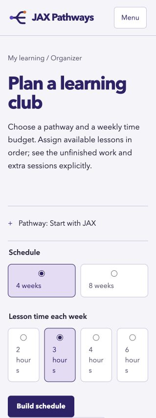

# Architecture upgrades implemented

This implements all eight upgrade areas identified in `app-architecture-audit-2026-10-06.md`. Existing content, release and permanent-lesson-page changes in the workspace were retained.

| Audit area | Implementation |
| --- | --- |
| Notebook boundaries | `workspace.js` orchestrates loading and state. `scripts/notebook/evidence.js` owns editing and filtering, `backup.js` owns restore/export UI through `getBackup`/`applyBackup` callbacks, and `summary.js` owns progress summaries. Editing reads notebook state through `getState`, so restored records replace the current state without stale references. |
| Career and pathway boundaries | `scripts/careers.js` and `scripts/pathways.js` own their respective interactions. `lib/views/career.js`, `pathway.js`, `domains.js` and `routes.js` render explicit inputs. `paths.js` is a small compatibility coordinator. `course-navigation.js` removes the career-to-catalog controller dependency. Initialization is document-scoped and repeatable. |
| Project view | `lib/views/project.js` renders the project and command panels. `scripts/project.js` owns fetching, terminal switching and stage reporting. Command text stays literal and feedback elements stay empty until used. |
| CSS ownership | `base.css` is a composition entry for named `styles/shared` and feature files. The split retains all declaration, selector, media-condition and source order. Only adjacent matching media blocks were combined. Compatibility rules remain deliberately ordered; this change does not claim all historic overrides have been eliminated. |
| Type checks | `tsconfig.domain.json` adds a strict `checkJs` gate through `npm run check:types`, included in `npm run check`. It covers selected pure libraries, HTTP/manifest contracts, shared browser actions, choice controls and the project view. `types/manifests.ts` defines project and validation data. Broader legacy-controller migration can be incremental; the entire JavaScript app is not yet strictly type checked. |
| Network policy | `lib/http.js` bounds JSON requests, including response-body reads, to ten seconds by default. `createJsonResource` shares in-flight requests and successful results per fetcher, evicts failures and supports parsing before caching. Reader validation receipts use this resource; project registries and validation receipts are checked before use. Notebook notes remain usable when optional project associations fail to load. |
| Choice controls | Selects opt in with `data-choices` and `data-choice-label`. `scripts/choices.js` enhances only those controls; `setSelectValue` and `populateSelect` explicitly refresh their presentation. Native property descriptors are untouched. Disabled options/groups, required controls, dynamic options and form resets synchronize through local observers. `experience.js` no longer observes the entire document; dynamic project content invokes enhancement explicitly. |
| Server-only boundary | Build-time Markdown and project guide rendering live in `lib/server`. A dependency-reachability test rejects browser entry points that import server-only code or Node built-ins. The existing acyclic dependency and domain/controller boundary test remains. |

## Maintenance contracts

- Keep domain and view modules independent of browser controllers. View rendering should receive its data rather than read `courseState` or storage.
- Add build-only filesystem/path modules under `lib/server`; never import them from browser entry points or their dependencies.
- Mark new enhanced selects explicitly, give each a stable unique ID and a meaningful choice label, and use `setSelectValue` for programmatic selection. Plain selects remain native. Refresh an enhanced control after direct option changes if immediate UI synchronization is needed.
- Initialize dynamic reading controls explicitly with `initReadingTools` after rendering. Shared page startup is not a document-wide observer.
- Add optional JSON resources through `fetchJson` or `createJsonResource`. Pass a parser when malformed responses must be retried rather than cached. Resource caching is page-local, not a persistent offline cache.
- Preserve source order when reorganizing compatibility styles. Structural separation is complete; deleting historic overrides requires a separate behavior review.
- Extend the strict type-check include list as more modules acquire precise contracts; do not replace unknown input types with blanket casts.

## Verification

Final checks passed: 80 tests, zero Astro errors/warnings, scoped strict types, ESLint and formatting. Static-link and SEO checks passed for all 166 HTML pages at both `/` and `/jaxpathways/`; the deployment check restored the root build.

New tests cover request timeouts and aborts, HTTP/JSON failures, concurrent caching and retries, malformed manifests, opt-in choice enhancement, programmatic selection, disabled states, dynamic options, form resets, exact command text, escaped view content and server-only import reachability. Existing notebook save/retry, backup merge/cancel, reading, route and project integration coverage remains in place.

The browser preview was checked on desktop and at a 390-pixel viewport. Schedule rebuilding, mobile menu opening/Escape dismissal, project PowerShell conversion and career rendering were exercised. Organizer and project pages had no horizontal overflow in that viewport. This is representative browser verification, not exhaustive accessibility certification or every-page visual review.

Run `npm run check` for diagnostics, strict scoped types, lint, formatting, curriculum, tests, distribution, static links and SEO. Run `npm run check:deployment` for the `/jaxpathways` deployment base; it restores the root build afterwards.

