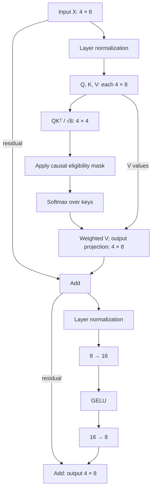
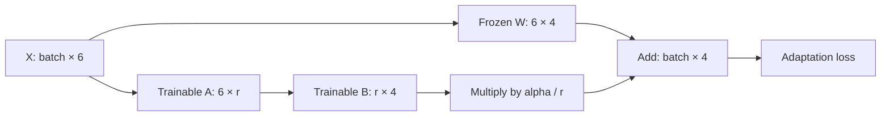
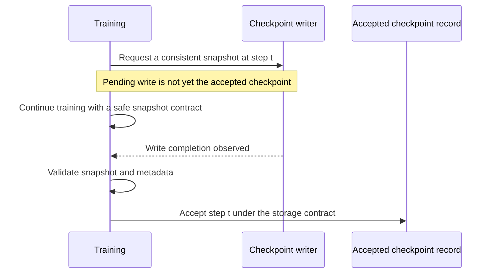

# Priority diagram specifications — 6 October 2026

These are proposed designs for the [course diagram audit](diagram-audit-2026-10-06.md). They are not shipped lesson assets. Mermaid blocks are reviewable drafts; they have not yet been compiled or visually validated. Numerical examples introduced below are explicitly identified as new fixtures.

Every implementation should retain the lesson's measured evidence and place the mechanism diagram beside its corresponding explanation. Use the exact canonical code when a fixture differs from these specifications.

## 1. Tensor axes and vectorization

**Lessons:** `arrays-02`, `transforms-03`, `optimization-01`. **Medium:** SVG with selectable axes; static SVG/PNG equivalent.

**Question:** Which axes disappear, which remain, and which values are shared?

Draw a nonsquare matrix as observation rows and feature columns. Align the weight vector with the feature axis; join products along that axis; retain one output slot per observation. Put the scalar bias outside the contraction and show it entering every output slot. Then connect prediction and target vectors to elementwise residuals and a scalar mean squared loss.

For `vmap`, expand the same single-example function into three row calls with one shared weight input and a stacked output. Label mapped axis `0`, shared argument `None` and result axis `0`. Use the lesson's actual rows and recorded outputs `1, 1, 8`. Avoid drawings that imply one CPU/GPU thread per example. [JAX automatic vectorization](https://docs.jax.dev/en/latest/automatic-vectorization.html).

**Prediction:** “If we append one observation without changing the number of features, which shapes change?”

**Reading:** “Follow one row across to its output. The feature dimension is consumed by the dot product; the observation dimension remains. The shared weight vector is reused in every row calculation.”

**Counterexample:** Align `(n,1)` predictions against `(n,)` targets and expose the unintended `(n,n)` broadcast. This must look visibly different from one residual per observation.

**Acceptance:** Independent scalar-loop values equal the contraction and vectorized values; shape assertions catch the outer-broadcast error. Labels remain readable without color.

## 2. Key ownership and scan state

**Lessons:** `state-01`, `state-03`. **Medium:** two coordinated SVGs, reusing the existing conceptual cards.

The random-key tree should show a parent split into a continuation key and a sampling key. Carry the continuation key into the next split. Highlight the incorrect reuse of a sampling key by duplicating that branch and showing the repeated values. Do not imply a key mutates itself when passed to a sampler. [JAX random numbers](https://docs.jax.dev/en/latest/random-numbers.html).

The scan diagram should have time on the horizontal axis. Each cell receives `carry_t` from its left and `input_t` from above; it emits `carry_(t+1)` to its right and `output_t` below. A separate bracket stacks outputs. Mark fixed carry structure/shape/dtype as a loop invariant.

**Prediction:** “Which value is returned once, and which values are collected for every step?”

**Reading:** “The horizontal chain is the recurrent state. The downward values are observations of each step, not additional carry values.”

**Acceptance:** Unroll three steps independently and compare both the final carry and stacked outputs. Reuse an old key deliberately and reproduce the same draw. Keep probabilistic independence claims separate from these deterministic checks.

## 3. Curvature, Adam, clipping and schedule clocks

**Lessons:** `optimization-08`, `optimization-12`. **Medium:** data-derived contour plot, vector plot and SVG state flow.

Use three separate views, each with its own scope:

1. Plot the actual quadratic's contours and recorded optimizer iterates. This explains why coordinates make unequal progress and why loss can rebound near a minimum.
2. Diagram gradients entering first/second moments, bias correction, parameter updates and the completed-step counter. Use the exact optimizer convention, including epsilon placement, from the lesson.
3. Introduce a **new analytic clipping fixture**: gradient `(3,4)` has norm `5`. Global norm clipping at `2.5` produces `(1.5,2)` and preserves direction. Clipping each coordinate to `[-2.5,2.5]` produces `(2.5,2.5)`, changes direction and leaves norm greater than `2.5`. Draw all three vectors with equal axis scale.

A small clock strip should separate microbatches, accumulated gradients and optimizer updates. Label the schedule's actual indexing convention; do not assume it advances per example or per microbatch.

**Prediction:** “Which clipping rule preserves the direction? Does the schedule advance if no optimizer update happens?”

**Reading:** “Both clipped vectors are shorter than the original, but only the radial projection lies on the selected norm circle. The componentwise box and the norm ball impose different constraints.”

**Acceptance:** Independent vector arithmetic confirms both outputs. Optimizer state labels match actual code. New clipping/schedule panels receive separate provenance: the existing optimizer comparison has different learning rates and does not demonstrate these two mechanisms.

## 4. The actual Transformer block

**Lesson:** `transformers-03`. **Medium:** SVG architecture with tensor dimensions.

Draw the implemented single-head, pre-layer-normalized block. The residual stream is `(4,8)`. The attention score/mask matrix is `(4,4)`. The feed-forward branch expands width `8` to `16` and returns to `8`.

Split the combined Q/K/V node into three in the final SVG so the score and value paths are unambiguous. Do not add multiple heads, rotary embeddings or cache machinery to this lesson. The text harness uses a different, two-head architecture and needs its own specification.

**Prediction:** “Which operation mixes positions? Which operations act independently on each token's feature vector?”

**Reading:** “Only the attention weights mix eligible token positions here. Both residual additions require the branch to return to width eight. The existing output-minus-input heatmap shows the total correction, not attention weights.”

**Acceptance:** Attach shape assertions to every intermediate and verify both additions independently. Explain the identical heatmap rows using the current constant-offset/normalization fixture rather than implying every Transformer produces identical corrections.

## 5. Attention eligibility versus supervised targets

**Lessons:** `transformers-02`, `pretraining-01`, `posttraining-01`. **Medium:** aligned token-strip SVGs and an existing attention interaction.

Use separate panels for separate objectives. A universal mask diagram would conceal important differences.

- **Causal SFT:** align input tokens at `t`, target tokens at `t+1`, target-role flags and scored positions. Place the attention-eligibility matrix alongside them. The response-only loss mask follows the shifted targets, not the unshifted inputs.
- **MLM:** fork clean tokens into labels and a corrupted input sequence. Feed only corrupted tokens to the encoder. Connect selected predictions and clean labels at the loss. Bidirectional context and selected-position loss are separate concepts.
- **Packing:** show segment boundaries blocking cross-document attention even when both segments occupy one tensor.

**Prediction:** “Can an unscored prompt token still influence the loss?”

**Reading:** “A loss mask controls which outputs contribute directly to the objective. It does not remove the prompt's influence on a scored response. An attention mask instead controls which positions contribute context.”

**Acceptance:** Change a future token and verify earlier causal outputs remain invariant. Shift role flags independently. Ensure no clean hidden-token value reaches MLM encoder inputs. Do not depict the full BERT corruption recipe when the current fixture only uses masking.

## 6. Masked-image reconstruction in image coordinates

**Lesson:** `pretraining-02`. **Medium:** Matplotlib image grid generated from actual arrays, plus a small SVG dataflow.

Show one current `4 × 4 × 1` image divided into four `2 × 2` patches. Number patches in row-major order: `0,1` across the top and `2,3` across the bottom. Patches `0` and `3` are visible; `1` and `2` are hidden.

Panels: original image → visible-only input with hidden regions hatched → target hidden patches → predicted hidden patches → signed or absolute reconstruction error. Original/target/prediction panels share intensity limits. Error has its own explicitly named scale. Masked regions must not look like observed black pixels.

Show visible patch values plus the constant feature entering the implemented linear reconstructor: nine input features, a `9 × 16` weight matrix and reconstructed patch values. This is a small linear teaching model. The MAE paper motivates masked reconstruction, but its encoder/decoder architecture is not the implementation here. [Masked Autoencoders](https://arxiv.org/abs/2111.06377).

**Prediction:** “If we change a hidden target pixel without changing the observed patches, can the model see that changed pixel at inference?”

**Reading:** “The hatching marks missing observations. Compare each reconstruction with its target at the same spatial coordinate. The error panel shows which pixels remain wrong even when average loss is small.”

**Acceptance:** Independent patchify/unpatchify round trip, exact patch-ID test, no target leakage, and a check that only the intended hidden positions contribute to the reconstruction loss. Keep the training curve as supporting evidence. Do not generate the reconstruction with an image model.

## 7. LoRA parameter and gradient paths

**Lesson:** `posttraining-02`. **Medium:** SVG with explicit frozen/trainable labels.

Use this code's row-vector convention, rather than copying the orientation of a paper diagram. Batch input `X` has six features. Frozen base `W` has shape `(6,4)`. Trainable `A` has shape `(6,r)` and `B` has shape `(r,4)`. Both branches produce four output features.

Add separately styled gradient annotations: parameters `A/B` update, `W` does not. Frozen weights still participate in forward computation; “frozen” must not imply the input derivative through that branch is necessarily removed.

The actual fixture uses rank one and alpha one. Include the zero-initialized `B` snapshot: the first gradient of `A` is zero while `B` can receive a nonzero gradient. Then show merge `W + (alpha/r)AB`. [LoRA](https://arxiv.org/abs/2106.09685).

**Prediction:** “Which tensors change on the first update?”

**Acceptance:** Count trainable elements as `r(6+4)`, test the initialization gradients and compare merged/unmerged outputs within a declared tolerance. Do not describe this fixture as quantized LoRA.

## 8. PPO/RLHF and DPO must have different diagrams

**Lessons:** `rl-03`, `posttraining-04`, `posttraining-05`. **Medium:** two SVG dataflows and an analytic PPO panel.

For the RLHF lesson, distinguish four roles: trainable current policy; old policy frozen within a rollout's inner PPO epochs; reference policy fixed throughout policy optimization; reward model fitted earlier and then frozen. Connect sampled actions to rewards and fixed advantages, current/old probabilities to the ratio, and current/reference probabilities to KL. Stop-gradient boundaries must be explicit.

The present experiment is a finite categorical bandit with an exact baseline and exact categorical KL. It does not contain a learned critic or an end-to-end human-feedback collection system. Old-policy values refresh between rollouts, while the reference does not. Diagram these different lifetimes.

PPO's analytic panel should show positive and negative advantage cases separately. Clipping changes the objective incentive; it does not impose a hard trust-region bound on the resulting policy.

For DPO, draw chosen/rejected examples entering both a trainable policy and a frozen reference. Their log-probability differences form a reference-corrected margin, scaled by the actual beta and passed to the stable loss. There is no reward-model call or on-policy rollout in this training step. [Direct Preference Optimization](https://arxiv.org/abs/2305.18290).

**Prediction:** “Which distribution is refreshed next rollout? Could the DPO margin improve while chosen probability falls?”

**Acceptance:** Independently compute one PPO ratio, categorical KL and DPO margin. Verify reference/reward parameters remain unchanged and old probabilities remain fixed during inner epochs. Use the lesson's actual beta (`0.3` for its DPO training fixture), rather than copying a generic diagram value.

## 9. Checkpoint consistency and asynchronous acceptance

**Lessons:** `recovery-02/03/04/05`. **Medium:** SVG aligned timeline; Mermaid sequence draft for high-level ordering.

Show five aligned tracks: parameters, optimizer, random key, data cursor and completed step. Draw one vertical snapshot boundary. The next restored update must receive the same state and examples as uninterrupted execution.

The final version must follow the real checkpoint API rather than imply every library uses the same callbacks. Overlay crashes before completion and after acceptance; identify which checkpoint can be selected in each case. Keep the current parallel state-merge diagram as an introductory view.

**Prediction:** “The live process reached step 42 but the latest accepted snapshot is step 40. Which step can recovery promise?”

**Reading:** “The live-progress line and recovery boundary answer different questions. A pending request has not advanced the accepted checkpoint. Model and iterator state must describe the same completed update.”

**Acceptance:** Restore in a fresh process and compare next example IDs, random state, parameter update and optimizer state. Do not equate an asynchronous completion notification with a stronger durability guarantee than the storage system provides.

## 10. Integer arithmetic and framework parity

**Lessons:** `deployment-05`, `deployment-08`, `kernels-04`. **Medium:** number line, units-aware SVG and aligned layer trace.

Number line: real values → divide by scale → round → add zero-point → clamp to the declared integer range. Label reconstruction `scale × (q − zero_point)` and show saturation separately from rounding.

Arithmetic path: quantized activation and weight → subtract zero-points as required → multiply → wide accumulation → correctly scaled bias → output rescale/requantization. Mark per-tensor/per-channel scale axes and every dtype. Do not draw an int8 accumulator simply because inputs are int8; verify supported arithmetic rather than assuming it.

Parallel reference paths should distinguish original high-precision inputs, represented low-precision inputs and the actual kernel. This separates representation error from implementation error. A separate framework diagram aligns each reference and converted layer, with preprocessing and parameter-layout contracts above the first layer.

**Prediction:** “If the integer dot product is correct but bias uses the wrong scale, which comparison fails first?”

**Acceptance:** Hand-compute a small affine example with nonzero zero-point, clipping and bias. Match both layerwise and final outputs to independent references with explicit absolute/relative tolerances. Use actual supported format names, including exact FP8 variants if introduced. Accuracy and numerical parity do not establish target-device speed.

## 11. Sharding, collectives and Pallas ownership

**Lessons:** `distributed-01/02/03`, `kernels-01/03`. **Medium:** SVG mesh/chunks, categorical matrix and conceptual timeline.

Keep a global-array view next to local shards and the named device mesh. Give replicas the same value identity without drawing them as disjoint partitions. A reduction panel should carry sums and counts so unequal local batch sizes remain correct.

For collectives, show chunk ownership after each reduce-scatter/all-gather round, with the assumed algorithm named. Link modeled payload bytes to those transfers. Ring arrows describe an algorithm, not necessarily physical links or actual network measurements.

For the Pallas coverage fixture, show the `5 × 11` logical matrix, program IDs `0–8`, partial boundary tiles and masked padded positions. Use a discrete palette and integer legend, not a continuous magnitude scale. Explain grid-to-block mapping using the actual BlockSpec. [Pallas grid and BlockSpec](https://docs.jax.dev/en/latest/pallas/grid_blockspec.html).

A pipeline timeline may show load/compute/store buffers and their reuse, but its durations are schematic until measured. CPU interpretation and race checks do not demonstrate TPU overlap or throughput. [Pallas TPU pipelining](https://docs.jax.dev/en/latest/pallas/tpu/pipelining.html).

**Prediction:** “Which program owns this boundary element? Which buffer can be reused at this point?”

**Acceptance:** Enumerate coverage independently, show no omitted logical element, verify boundary guards, compare the global reduction with an unsharded calculation, and qualify any hardware timing with its own device receipt.

## 12. Retrieval and modality lifecycle

**Scope:** text, image, audio and cross-modal harnesses; planned CLIP/SigLIP/retrieval projects. **Medium:** shared workflow with modality-specific insets.

The common workflow should name artifacts and gates, not just stages: source manifest → frozen split/processor → objective configuration → recoverable checkpoint → evaluated candidate → qualified precision/export → published revision → monitored service. Connect MLflow/W&B-style tracking as observers of runs and artifact lineage; a dashboard is not the authority for every artifact's contents.

The audio inset should connect a real waveform segment to a 128-sample window, hop 64, 15 frames and 65 real-FFT bins, then show time averaging. Keep the existing real error spectrogram. The text inset needs shifted targets and cache validity; the image inset needs layout/range/receptive field; the cross-modal inset needs paired identities and multi-positive labels.

Compare CLIP's row/column-normalized objectives with SigLIP's labeled pairwise sigmoid terms. Negative construction and reduction conventions must be stated; “independent pairwise terms” does not mean minibatch sampling is irrelevant. [Sigmoid Loss for Language Image Pre-Training](https://arxiv.org/abs/2303.15343).

For retrieval, draw a ranked-result example already specified by the project: relevant IDs are A and C; exact and ANN top-two results are B, A. ANN recall at two is 1, relevance recall is 1/2, and reciprocal rank is 1/2. This analytic fixture demonstrates why a faithful index can reproduce a poor semantic ranking. Keep planned benchmark curves empty until runs exist.

**Prediction:** “Can reranking recover a relevant document that candidate generation omitted?”

**Acceptance:** Independently calculate the example metrics, preserve corpus/query/split identities, apply eligibility consistently, and record each model/processor/index revision. A real-data model's evaluation and publication cannot inherit success from a small synthetic harness.

## Definition of done

A finished diagram includes structured source, rendered SVG and PNG, placement next to the relevant explanation, a prediction question, a concrete reading walkthrough, a transfer question and its factual checks. All measured values have saved data and provenance. Conceptual diagrams state their assumptions. Check both light/dark presentation, print/offline exports and narrow screens; do not use color alone to encode frozen state, masks or ownership.

After changing canonical lesson content, regenerate its dependent assets through the course build pipeline. Run affected numerical checks when computations change, then validate source/artifact freshness and the static build. Do not hand-edit generated notebooks or copied lesson Markdown.
