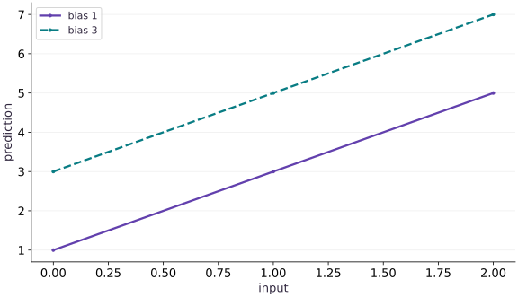

# Pure functions and explicit inputs

Phase 01: Arrays & pure functions · about 45 minutes · CPU

## What you will be able to do

- Identify hidden inputs and side effects in a numerical function.
- Pass model parameters explicitly and return new state without mutating input containers.
- Test replay and independence between two parameter configurations.
- Explain why host orchestration and transformed numerical computation need different boundaries.

## The problem

Have you ever rerun a notebook cell and got a different result because another cell changed a variable? Let’s make that dependency visible. We’ll pass a model’s weights into its prediction function, return new values explicitly, and check that the same inputs reproduce the same calculation.

## The idea

A pure function makes its changing inputs visible and returns its result without secretly changing shared state. That gives transformations such as differentiation and compilation a clear computation to work with. When a prediction changes, we should be able to identify the input that changed.

## Make a repeated call explainable

Imagine a prediction function that receives features and weights but reads a global bias. You compile it, change that Python global, and call the compiled function again. The source file now displays the new bias, but the already-traced computation may still embody the old value. The hidden dependency makes the result difficult to reason about.

Pass the bias as an explicit argument instead. Then two calls with different bias arrays are visibly two computations with different data. For a linear prediction, increasing the bias by $1$ must increase every output by $1$, while changing the weight vector can affect rows differently.

Purity does not mean a whole application has no state. It means the numerical function receives the state it needs and returns any new state. Files, logs and orchestration can live outside that numerical boundary.

### Pause and reason

Where should a changing training step or random key live?

<details><summary>Compare your reasoning</summary>

In explicit state passed into the computation and returned when updated. Hiding it in a mutable Python global makes replay and transformed execution harder to verify.

</details>

## Hidden state makes the signature incomplete

A function that takes $x$ but reads a global weight has two effective inputs while advertising only one. Re-running it after changing the global can change its result with no visible argument change. Tests may depend on the order in which prior code ran.

Passing the weight explicitly makes the dependency visible. It also allows two model configurations to coexist without rewriting global variables. That matters for evaluation, comparisons, checkpoint recovery, and eventually multiple workers.

## Array immutability does not make a dictionary immutable

JAX arrays are immutable values, but a Python dictionary holding them is still a mutable container. Assigning `params["weight"] = ...` changes which value the dictionary holds. If another variable refers to the same dictionary, it sees the changed entry.

Constructing `{**params, "weight": new_weight}` makes a new dictionary with a changed binding and keeps the old container intact. This is a shallow copy: nested mutable objects can still be shared. Our example has only array leaves, so the shallow update is sufficient for the declared structure. More general parameter trees will need deliberate tree-aware transformations.

## Treat a step as an input/output contract

A training step will eventually consume parameters, optimizer state, and a batch, then return updated state and metrics. The current predictor is the simpler first piece: parameters and data in, predictions out. The caller owns the history and can save both original and updated values.

This structure makes replay a meaningful test. With the same inputs, predictions should agree; changing the weight should affect predictions in the expected way. Do not make a test depend on a global that may already have been edited elsewhere in a notebook.

```text
predict(parameters, observations) → predictions
future step(state, batch) → new_state, metrics
```

## Choose a clear transformation boundary

A print, file write, or list append is a Python side effect. Inside a transformed function, such effects can happen during tracing rather than every device execution. We will investigate that mechanism in the tracing lesson. For now, separate producing metrics from reporting them.

Return the values you need to inspect, then let the caller print or save them. This design also makes unit-sized numerical checks simpler: you can compare actual outputs with known arrays without parsing console messages or relying on side-effect timing.

## A deterministic check has limits

Calling a function twice with fixed inputs checks a useful property, but it does not prove the absence of every hidden dependency. A hidden global might happen not to change. Inspect the implementation and deliberately exercise multiple configurations. Randomness will need an explicit input as well; that is why the next phase introduces keys rather than treating random draws as invisible global state.

Keep the evidence proportional to the claim: these tests establish the behavior of this predictor and update pattern, not the replay of an entire distributed training job.

## Run the example

```python
import jax.numpy as jnp
def predict(params, x):
    return params["weight"] * x + params["bias"]
params = {"weight": jnp.array(2.), "bias": jnp.array(1.)}
x = jnp.array([0., 1., 2.])
print(predict(params, x))
assert jnp.allclose(predict(params, x), jnp.array([1., 3., 5.]))
```

Expected: [$1$. $3$. $5$.]

## Explicit parameters make predictions inspectable

**Predict:** What changes when the bias increases by $2$?



**Recorded CPU computation**

### Read the figure

The horizontal axis is the input and the vertical axis is the prediction. The solid line uses bias $1$; the dashed line uses bias $3$. Both use the same weight $2$.

At input $0$, the predictions are $1$ and $3$. At input $2$, they are $5$ and $7$. The gap stays $2$ everywhere, and the parallel lines rise by $2$ for each unit increase in the input.

### Connect it to the computation

In $y=wx+b$, changing the explicit bias changes the vertical offset, while the unchanged weight preserves the slope. You can read the bias directly where the line meets the vertical axis because the product $wx$ is zero there.

This makes the function’s inputs inspectable: the change in the output follows the change in the passed parameter. As a check, setting the bias to $0$ would move the solid line down by $1$ and make it pass through the origin. It would not flatten the line.

```python
changed = {**params, 'bias': jnp.array(3.0)}
visual_data = {'kind': 'line', 'x': x.tolist(), 'xlabel': 'input', 'ylabel': 'prediction', 'series': [{'label': 'bias 1', 'y': predict(params, x).tolist()}, {'label': 'bias 3', 'y': predict(changed, x).tolist()}]}
```

## Recorded reference execution

CPU run: 2026-10-06T15:39:10.345809+00:00. JAX 0.9.2.

```text
[1. 3. 5.]
aliased container weight: 9.0
evaluation losses: 0.0 6.0
PASS: arrays-03

```

## Expose a mutable container alias

**Predict before running:** If `alias = params`, does assigning a new weight through alias preserve the original dictionary? Predict before running on a separate example.

```python
container = {"weight": jnp.array(2.), "bias": jnp.array(1.)}
alias = container
alias["weight"] = jnp.array(9.)
assert float(container["weight"]) == 9.
assert float(params["weight"]) == 2.
print("aliased container weight:", float(container["weight"]))
```

**Expected:** The aliased container changes to weight $9$; the separate original lesson parameters remain $2$.

The mutation concerns Python container bindings. It does not contradict JAX array immutability.

## Replay two independent model configurations

**Predict before running:** What should each parameter setting predict, regardless of which was called first?

```python
first_params = {"weight": jnp.array(2.), "bias": jnp.array(1.)}
second_params = {"weight": jnp.array(-1.), "bias": jnp.array(4.)}
first_output = predict(first_params, x)
second_output = predict(second_params, x)
assert jnp.allclose(first_output, jnp.array([1., 3., 5.]))
assert jnp.allclose(second_output, jnp.array([4., 3., 2.]))
assert jnp.allclose(predict(first_params, x), first_output)
assert jnp.allclose(predict(second_params, x), second_output)
```

**Expected:** The two configurations produce $[1, 3, 5]$ and $[4, 3, 2]$, and both can be replayed.

Independent configurations reveal the benefit of explicit inputs more clearly than one call on one global parameter set.

## Make it yours

Create new parameters with weight $3$ while retaining the original bias. Show that the original parameters still produce the original predictions.

<details><summary>Reference solution</summary>

```python
updated = {**params, "weight": jnp.array(3.)}
assert jnp.allclose(predict(updated, x), jnp.array([1.,4.,7.]))
assert float(params["weight"]) == 2.0
```

</details>

## Update the bias without changing either parameter input

**Practice**

Implement `with_bias(params, new_bias)`, returning a new dictionary. Verify outputs for new bias $-2$ and replay the original prediction.

<details><summary>Hint</summary>

A new dictionary is required; changing a binding in the original dictionary breaks the promised contract.

</details>

<details><summary>Reference solution and reasoning</summary>

```python
def with_bias(parameters, new_bias):
    return {**parameters, "bias": jnp.asarray(new_bias)}
changed_bias = with_bias(params, -2.)
assert changed_bias is not params
assert jnp.allclose(predict(changed_bias, x), jnp.array([-2., 0., 2.]))
assert jnp.allclose(predict(params, x), jnp.array([1., 3., 5.]))
```

The caller can evaluate both the old and new model without restoring a global value or depending on call order.

</details>

## Return predictions and metrics together

**Challenge**

Write `evaluate(params, inputs, targets)` that returns predictions and a scalar MSE. Test two model configurations on targets $[1, 3, 5]$. Keep printing outside the function.

<details><summary>Hint</summary>

Compute data inside the numerical core and report it outside. A tuple return does not itself imply mutation.

</details>

<details><summary>Reference solution and reasoning</summary>

```python
def evaluate(parameters, inputs, targets):
    predictions = predict(parameters, inputs)
    return predictions, jnp.mean((predictions - targets) ** 2)
labels = jnp.array([1., 3., 5.])
outputs, error = evaluate(first_params, x, labels)
other_outputs, other_error = evaluate(second_params, x, labels)
assert error.shape == ()
assert jnp.allclose(error, 0.)
assert jnp.allclose(other_error, 6.)
assert jnp.allclose(outputs, first_output)
print("evaluation losses:", float(error), float(other_error))
```

The second model has residuals $[3, 0, -3]$, giving mean squared error $6$. Known output arithmetic makes the check independent of the implementation.

</details>

## Check your understanding

What makes predict easier to transform and test?

1. Reading an editable global weight
2. Passing parameters and data explicitly
3. Printing inside every numerical operation

<details><summary>Answer and explanation</summary>

Passing parameters and data explicitly

Explicit inputs expose the computation and let you compare calls with controlled parameter values.

</details>

## Diagnose the result

If a replay differs, inspect hidden globals, mutable aliases, and random state before assuming nondeterministic hardware. If an update affects an old model, check whether the caller reused the same dictionary. If logs disappear under a transform, inspect whether they are Python side effects. Preserve numerical results as return values so you can investigate without relying on side-effect behavior.

## Carry forward

- Explicit inputs make model dependencies visible and configurations independent.
- Immutable arrays can still be stored in mutable Python containers.
- Return new state deliberately and let the caller own it.
- Keep numerical computation separate from host logging, I/O, and orchestration.

## Keep your evidence

Keep both parameter configurations, their known predictions, a container-alias experiment, a non-mutating update, and an evaluation loss checked by hand. Explain which state the caller owns.

Keep predictions, modified code, observed results, and reasoning. A checkpoint alone does not demonstrate the exercise.

## Primary references

- [JAX: pure functions and common gotchas](https://docs.jax.dev/en/latest/notebooks/Common_Gotchas_in_JAX.html#pure-functions)
- [JAX: stateful computations](https://docs.jax.dev/en/latest/stateful-computations.html)

