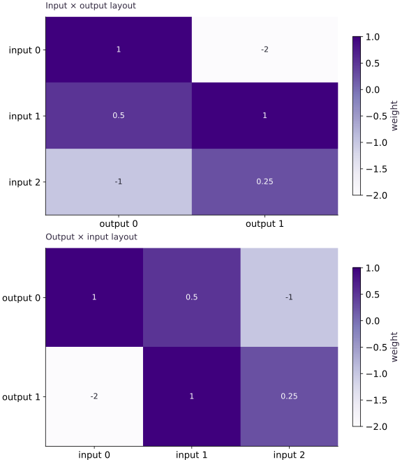

# Move models between JAX, Keras, TensorFlow and PyTorch

Phase 15: Deployment, interoperability & edge AI · about 75 minutes · CPU

## What you will be able to do

- Map Dense and Linear weight axes and verify a known output.
- Separate architecture, weights, non-trainable state, optimizer state and preprocessing.
- Run a backend-neutral Keras model and explain the boundaries of tensor exchange and export.

## The problem

You have a dense layer in PyTorch and the same model idea in Keras. Can you reuse the weights in JAX? We’ll start with one small layer, work out a prediction by hand, and check the weight axes. From there, you’ll learn which parts of a model can transfer directly and which need separate checks.

## The idea

Interoperability has three different jobs: reproduce a model in another framework, share tensor data, or export inference to another runtime. Each has a different contract. Start with a deterministic, asymmetric dense layer: three input features and two outputs expose the transpose that a square matrix can hide. The CPU companion uses NumPy and JAX; the optional lab below executes the real Keras backends.

## A parameter file is not a model

Our inputs have shape $[\mathrm{batch}, 3]$. Keras Dense uses a $[3, 2]$ kernel; PyTorch Linear stores $[2, 3]$ weights and multiplies by their transpose. Bias has shape $[2]$. For $x=[1, 2, -1]$, the first output is $1+1+1+0.1=3.1$. Verify a hand-derived row before comparing whole arrays. Convolution kernels have additional layout conventions; do not apply this dense transpose rule to them.

## Use Keras as a shared model vocabulary

Keras $3$ can execute models on JAX, TensorFlow or PyTorch. Select KERAS_BACKEND before importing keras, in a fresh process. Use `keras.layers` and `keras.ops` in portable model code; a call to tf.* inside a custom layer is a TensorFlow dependency. This does not port arbitrary Python side effects or framework-specific training loops. A .keras archive preserves Keras configuration and weights; an inference export has a different job.

## Explicit JAX state is a design decision

Pass parameters and non-trainable state explicitly; return updated state and keep random keys visible. A matched inference result does not show that dropout randomness, BatchNorm moving statistics or optimizer slots were transferred. Start in inference mode with `training=False.` Compare gradients and an update separately before claiming training equivalence. Reinitializing the optimizer is a new training run, not an exact resume.

## Choose the bridge for the destination

NumPy exchange makes a clear host copy and usually breaks autodiff across the boundary. DLPack exchanges supported tensor buffers between frameworks; sharing memory is not model conversion or cross-framework autodiff, and external mutation can violate JAX assumptions. JAX export serializes a staged computation for compatible consumers. jax2tf is a separate, version-sensitive TensorFlow bridge. Keras export can target supported inference formats; inspect the destination operators and signatures. ONNX is a model interchange format, while ONNX Runtime execution providers choose supported execution paths. PyTorch/XLA runs PyTorch through XLA; it does not turn a PyTorch model into an explicit JAX function.

## Run the optional real-framework lab

The file labs/keras_backends.py beside this lesson builds the same Dense model, fixes its weights, compares known outputs, and inspects mixed precision policy. From the extracted course workspace root, use an isolated environment with Keras and the backend you want. Run the same file in a new process for each backend; --backend selects it before importing Keras. Tested locally with Keras 3.14.1 on the installed JAX and PyTorch backends. The same companion also passed on TensorFlow 2.21.0 with Keras 3.15.1 in the separate edge-lab environment. These optional backend checks are recorded separately from the core CPU receipt.

**Optional Keras environment — macOS/Linux, workspace root**

```sh
python3 -m venv .venv-interop
.venv-interop/bin/python -m pip install "keras==3.14.1" "jax==0.9.2" "torch==2.11.0"
```

**Expected:** An isolated environment with the tested Keras/JAX/PyTorch versions. Use .venv-interop/bin/python instead of python3 in the commands below; on Windows use .venv-interop\Scripts\python.exe. TensorFlow is a separate optional backend: use the edge lab environment instructions and record its installed versions.

**Optional lab — run from the course workspace root after installing Keras and the selected backend**

```sh
python3 phases/15-deployment/01-keras-and-pytorch-bridges-to-explicit-jax/labs/keras_backends.py --backend jax
python3 phases/15-deployment/01-keras-and-pytorch-bridges-to-explicit-jax/labs/keras_backends.py --backend torch
python3 phases/15-deployment/01-keras-and-pytorch-bridges-to-explicit-jax/labs/keras_backends.py --backend tensorflow
```

**Expected:** Each installed backend prints PASS and measured precision errors. A missing backend must be installed in its isolated environment before running that command.

## Write the same dense layer in both layouts

We’ll call the input matrix $X$, the Keras-style kernel $W$, and the PyTorch-style weight $W_{\mathrm{torch}}$. The math agrees when $W=W_{\mathrm{torch}}^\mathsf{T}$. The transpose changes how weights are arranged, not what the layer means. Bias $b$ is added to every output row. Check the known first row before trying a larger model.

$$
Y=XW+b=XW_{\mathrm{torch}}^\mathsf{T}+b
$$

## Run the example

```python
import numpy as np
import jax
import jax.numpy as jnp
# Same dense layer, different parameter layouts.
x = np.array([[1., 2., -1.], [-2., 0., 3.]], np.float32)
keras_kernel = np.array([[1., -2.], [.5, 1.], [-1., .25]], np.float32)
bias = np.array([.1, -.2], np.float32)
torch_weight = keras_kernel.T.copy()  # torch Linear: output, input
params = {"kernel": jnp.asarray(torch_weight.T), "bias": jnp.asarray(bias)}
def predict(params, inputs):
    return inputs @ params["kernel"] + params["bias"]
actual = np.asarray(jax.jit(predict)(params, jnp.asarray(x)))
# A hand-computed first row detects a shared layout mistake.
np.testing.assert_allclose(actual[0], [3.1, -.45], atol=1e-6)
np.testing.assert_allclose(actual, x @ keras_kernel + bias, atol=1e-6)
print("Matched dense outputs:", actual)

```

Expected: Two rows match; the first is $[3.1, -0.45]$ within absolute tolerance $10^{-6}$.

## A transpose changes storage layout, not the intended model

**Predict:** Which axis names swap between the two parameter layouts?



**Recorded CPU computation**

### Read the figure

The upper matrix has input features as rows and output features as columns. The lower matrix swaps those axes. The cell values are weights, and the two panels contain the same six numbers in transposed positions.

Track the weight $-1$: it moves from input $2$, output $0$ in the upper panel to output $0$, input $2$ in the lower panel. It still connects the same input feature to the same output feature. The layout changes from shape $(3,2)$ to $(2,3)$.

### Connect it to the computation

With the first convention, a row batch computes $XW+b$. With the transposed storage convention, the equivalent calculation uses $X\widetilde W^{\mathsf T}+b$, where $\widetilde W=W^{\mathsf T}$. Transposing storage without adapting the computation would change the meaning or produce a shape error.

The picture explains this layout contract using an explicit numerical reference. It does not demonstrate that every layer or serialized model can be transferred between frameworks by one transpose. Check activations, bias, preprocessing, and layer-specific conventions against an independent output reference as well.

```python
visual_data = {'kind': 'panels', 'panels': [{'kind': 'heatmap', 'title': 'Input × output layout', 'values': keras_kernel.tolist(), 'rows': ['input 0', 'input 1', 'input 2'], 'columns': ['output 0', 'output 1'], 'unit': 'weight'}, {'kind': 'heatmap', 'title': 'Output × input layout', 'values': torch_weight.tolist(), 'rows': ['output 0', 'output 1'], 'columns': ['input 0', 'input 1', 'input 2'], 'unit': 'weight'}]}
```

## Recorded reference execution

CPU run: 2026-10-06T01:26:12.161424+00:00. JAX 0.9.2.

```text
Matched dense outputs: [[ 3.1  -0.45]
 [-4.9   4.55]]
Equal shapes, unequal outputs
Changed batch verified
PASS: deployment-01

```

## A square matrix hides a transpose

**Predict before running:** Will a shape check catch wrong axes when input and output dimensions are equal?

```python
square = np.array([[1., 2.], [3., 4.]], np.float32)
z = np.array([[2., -1.]], np.float32)
assert (z @ square).shape == (z @ square.T).shape
assert not np.allclose(z @ square, z @ square.T)
print("Equal shapes, unequal outputs")

```

**Expected:** Both outputs have the same shape but different values.

Check asymmetric values and independently known outputs, not just tensor dimensions.

## Make it yours

Add a batch with four rows and preserve the same parameters. Verify each row independently using a feature-by-feature sum.

<details><summary>Reference solution</summary>

```python
changed = np.arange(12, dtype=np.float32).reshape(4, 3) / 4
expected = np.stack([sum(row[i] * keras_kernel[i] for i in range(3)) + bias for row in changed])
np.testing.assert_allclose(predict(params, changed), expected, atol=2e-6)
print("Changed batch verified")
```

</details>

## Detect a preprocessing mismatch

**Transfer**

Suppose the source model expects inputs divided by $255$, while the target receives raw pixels. Demonstrate why correct weight transfer still fails.

<details><summary>Hint</summary>

Compute both predictions from the same raw input: once with the source normalization and once without it. Matching weights cannot cancel an input-scale mismatch.

</details>

<details><summary>Reference solution and reasoning</summary>

```python
pixels = np.array([[255., 128., 0.]], np.float32)
source = predict(params, pixels / 255.)
wrong = predict(params, pixels)
assert not np.allclose(source, wrong)
np.testing.assert_allclose(source, predict(params, pixels / 255.), atol=1e-6)

```

Input normalization belongs in the deployment contract. Matching weights cannot compensate for a different input distribution.

</details>

## Check your understanding

The Dense predictions match after transposing weights. What has been established?

1. The tested inference mapping matches for these inputs.
2. Optimizer and random state are now equivalent.
3. Any runtime can execute the model.

<details><summary>Answer and explanation</summary>

The tested inference mapping matches for these inputs.

The comparison establishes bounded numerical equivalence. Training state, other operators, shapes and target runtime support each need their own evidence.

</details>

## Diagnose the result

If output shapes fail, write the contraction axes. If shapes match but values drift, check layout, preprocessing, bias, inference mode and dtype in that order. A missing TensorFlow import in the optional lab means that backend is not installed; it is not a failure of the JAX core exercise.

## Keep your evidence

Keep the layout map, two changed-input comparisons, runtime versions and optional backend-lab output. Identify which model state and preprocessing are not covered by a dense-layer match.

Keep predictions, modified code, observed results, and reasoning. A checkpoint alone does not demonstrate the exercise.

## Primary references

- [Keras multi-backend migration](https://keras.io/guides/migrating_to_keras_3/)
- [Keras inference export](https://keras.io/api/models/model_saving_apis/export/)
- [JAX DLPack contract](https://docs.jax.dev/en/latest/_autosummary/jax.dlpack.from_dlpack.html)

