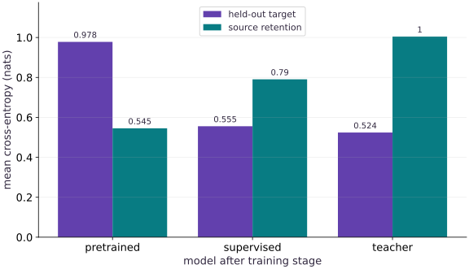

# Adapt a pretrained model and choose a post-training objective

Phase 15: Deployment, interoperability & edge AI · about 130 minutes · CPU

## What you will be able to do

- Pretrain and reload an artifact with recorded data and checkpoint hashes
- Compare supervised adaptation and teacher distillation from the same starting weights
- Verify both objective gradients independently
- Report target-task gains and source-task retention without leaking held-out data

## The problem

A model already learned one task. You now have a small adaptation set and a teacher that supplies probabilities. Should you optimize the observed labels or imitate the teacher? We will actually pretrain, save and reload a tiny model, adapt it both ways, and compare the resulting predictions on an untouched evaluation split. The model is deliberately small so every objective and derivative can be inspected.

## The idea

Adaptation starts with the behavior you want to change and the evidence you have. Supervised labels and teacher distributions supply different targets. Their objectives can use the same model while asking it to learn different things.

## Choose the target before choosing the adaptation method

A hard target identifies one class. A teacher distribution can assign mass to several alternatives, preserving information about relative preferences. Matching that distribution does not guarantee the teacher is correct for your deployment population.

Keep the evaluation target fixed when comparing adaptation methods. A lower training loss under one objective cannot be compared directly with a differently defined loss under another objective.

The held-out cross-entropy bars compare the lesson's two procedures under a common scoring rule. Explain that rule and inspect changed examples before choosing a method. This experiment is a bounded adaptation comparison; reward modeling and policy optimization require their own distinct data and update contracts.

### Pause and reason

Why not choose the method with the numerically smallest training loss across different objectives?

<details><summary>Compare your reasoning</summary>

The numbers may have different definitions and scales. Compare behavior under a common held-out evaluation contract relevant to the intended task.

</details>

## Define the tasks before choosing an objective

The input has two measured features plus a constant intercept feature. The source task uses one synthetic probability rule; the target task uses another. Source training sees $256$ rows. Adaptation sees only $48$ different rows. The final target report uses $512$ separately generated rows. These are disjoint generated splits with separate keys, not a real benchmark. Binary adaptation labels are sampled from the target probabilities; the teacher supplies the probabilities themselves. That privileged teacher is declared explicitly rather than presented as a generally superior model.

## Understand hard labels and soft targets

For logit $z=x^\top w$, cross-entropy is $\log(1+e^z)-tz$, where $t$ is either a binary observed label or a teacher probability between zero and one. Differentiating gives $(\operatorname{sigmoid}(z)-t)x$. Averaging over rows gives the gradient in our host reference. A soft target contains uncertainty that a single sampled binary label does not. If the teacher is wrong, faithfully matching that uncertainty can also preserve its mistakes.

$$
L(w)=\frac1N\sum_i[\operatorname{softplus}(x_i^\top w)-t_i x_i^\top w],\qquad \nabla L=\frac1N X^\top(\operatorname{sigmoid}(Xw)-t)
$$

## Make pretrained mean previously trained

We start from zero, optimize the source objective for $300$ updates and check that the source loss falls. We save those resulting weights, hash the checkpoint bytes and record the source-array hash, objective, dtype, version and training recipe. Adaptation uses only the reloaded artifact. This establishes a small reproducibly pretrained fixture; it is not a foundation model, a downloaded checkpoint or a random frozen feature masquerading as pretraining. The artifact omits optimizer state, so no exact-resume claim is made.

## Choose a fair comparison

Both adaptation branches receive identical initial weights, adaptation inputs, update count and rate. Their training losses are not directly a competition because their targets differ. We evaluate both on one common target cross-entropy and probability squared error, using held-out generating probabilities unavailable to training. We also evaluate source loss to expose forgetting. Do not select a learning rate using this final report; add a separate validation split for model selection. One seeded synthetic result does not establish which objective will win on another task.

## Locate preference and reinforcement objectives

A pairwise preference objective asks which of two responses is preferred; its supervision consists of prompt, chosen response and rejected response, with a defined sampling and reference policy. A teacher cross-entropy uses distributions over labels or tokens and does not require preference pairs. An RL objective uses a reward and a policy whose generated actions affect the training samples. This lab executes supervised adaptation and distillation only. Renaming teacher probabilities “rewards” would not create an RL experiment.

## Carry the contract to a real pretrained model

Choose an actual model checkpoint under its license, record repository and exact revision, tokenizer or feature preprocessing, architecture configuration, file hashes and base precision. First verify a golden inference example before changing weights. Build disjoint training, validation and final evaluation sets, with no overlap from teacher-generation or calibration data. Start with a small controlled adapter or declared trainable parameter subset; record what remains frozen and save adapter/base identities together. Define the task and source-retention criteria before optimization. Recheck export, precision and target-runtime parity after adaptation. This extension is an execution plan, not a claim that a large external model ran in this CPU lesson.

## Turn task tradeoffs into a release decision

A lower target loss can be useful while still causing an unacceptable regression on an older task. Decide how much source-task degradation is allowed before inspecting the candidate results. Let $L_s$ denote source evaluation loss and let $\Delta_s=L_s(\mathrm{candidate})-L_s(\mathrm{base})$. Positive $\Delta_s$ means worse retention. A retention budget is a product decision expressed in the same loss units, not a universal constant.

In this synthetic exercise the source evaluation reuses the source inputs, so it is only a retention proxy. A real release needs a separate held-out source set as well as a held-out target set. Record every candidate, including candidates rejected by the gate. If none satisfies the predeclared budget, keep the base or change the training recipe; do not quietly relax the budget after seeing the answer.

$$
\mathrm{accept}(m)=\left[L_t(m)<L_t(m_0)\right]\land\left[L_s(m)-L_s(m_0)\leq\delta\right]
$$

### Pause and reason

Can the candidate with the lowest target loss fail this gate?

<details><summary>Compare your reasoning</summary>

Yes. The gate requires both improvement on the target criterion and a source regression no larger than the chosen budget $\delta$. Report both quantities and the reason for rejection.

</details>

## 1. Pretrain a small model and retain its source data identity

Create main.py in the CPU environment. These are explicit synthetic classification tasks; the source model is genuinely optimized before it is saved.

```python
# Step 1 — 1. Pretrain a small model and retain its source data identity: The same stable cross-entropy accepts binary labels or teacher...
# Import hashlib for this computation.
import hashlib
import json
import tempfile
from pathlib import Path
import numpy as np
import jax
import jax.numpy as jnp

# Function `design(key, n)` implementing this stage's computation:
def design(key,n):
    # Sample deterministic random values into `features` using an explicit PRNG key.
    features=jax.random.normal(key,(n,2))
    # Return `jnp.concatenate([features, jnp.ones((n, 1))], axis=1)` to the caller.
    return jnp.concatenate([features,jnp.ones((n,1))],axis=1)
# Create or split explicit PRNG key(s) (`source_X`) for reproducible randomness.
source_X=design(jax.random.key(10),256)
# Initialize array `source_targets` with explicit values and shape.
source_targets=jax.nn.sigmoid(source_X@jnp.array([1.2,-.8,.2]))
# Create or split explicit PRNG key(s) (`adapt_X`) for reproducible randomness.
adapt_X=design(jax.random.key(11),48)
# Create or split explicit PRNG key(s) (`held_X`) for reproducible randomness.
held_X=design(jax.random.key(12),512)
# Initialize array `teacher` with explicit values and shape.
teacher=jnp.array([.6,1.4,-.3])
# Perform matrix contraction / projection to compute `soft_targets`.
soft_targets=jax.nn.sigmoid(adapt_X@teacher)
# Create or split explicit PRNG key(s) (`hard_targets`) for reproducible randomness.
hard_targets=jax.random.bernoulli(jax.random.key(13),soft_targets).astype(jnp.float32)
# Perform matrix contraction / projection to compute `held_prob`.
held_prob=jax.nn.sigmoid(held_X@teacher)
# Function `objective(w, X, targets)` implementing this stage's computation:
def objective(w,X,targets):
    # Perform matrix contraction / projection to compute `logits`.
    logits=X@w
    # Return `jnp.mean(jnp.logaddexp(0.0, logits) - targets * logits)` to the caller.
    return jnp.mean(jnp.logaddexp(0.,logits)-targets*logits)
# Function `train(initial, X, targets, steps, ...)` implementing this stage's computation:
def train(initial,X,targets,steps=300,rate=.15):
    # Function `step(w, _)` implementing this stage's computation:
    def step(w,_):
        # Evaluate both scalar loss and parameter gradients in one pass (`(loss, grad)`).
        loss,grad=jax.value_and_grad(objective)(w,X,targets)
        # Return `(w - rate * grad, loss)` to the caller.
        return w-rate*grad,loss
    # Return `jax.lax.scan(step, initial, None, length=steps)` to the caller.
    return jax.lax.scan(step,initial,None,length=steps)
# Allocate initialized array `(base, pretrain_history)` with the specified shape and dtype.
base,pretrain_history=train(jnp.zeros(3),source_X,source_targets)
# Verify that the output satisfies the expected shape, finite-value, or numerical contract.
assert pretrain_history[-1]<pretrain_history[0]-.1
# Convert `source_hash` to a host NumPy array for inspection or verification.
source_hash=hashlib.sha256(np.asarray(source_X).tobytes()+np.asarray(source_targets).tobytes()).hexdigest()
```

The same stable cross-entropy accepts binary labels or teacher probabilities. Those targets express different supervision, even though the algebra is shared.

## 2. Save and reload before adapting

Append this artifact boundary. The manifest names the model, synthetic source split, objective and training recipe; adaptation starts from reloaded weights.

```python
# Step 2 — 2. Save and reload before adapting: Both branches begin with identical pretrained parameters and a...
# Create an isolated temporary directory to run and inspect artifacts safely:
with tempfile.TemporaryDirectory() as directory:
    # Read or serialize artifact data on disk (`checkpoint`).
    checkpoint=Path(directory)/'pretrained.npz'
    # Convert `` to a host NumPy array for inspection or verification.
    np.savez(checkpoint,weights=np.asarray(base))
    # Compute deterministic cryptographic digest `digest` for provenance verification.
    digest=hashlib.sha256(checkpoint.read_bytes()).hexdigest()
    # Compute deterministic cryptographic digest `manifest` for provenance verification.
    manifest={'model':'three-parameter logistic synthetic fixture','source_data_sha256':source_hash,
              'weights_sha256':digest,'source_seed':10,'pretrain_steps':300,'learning_rate':.15,
              'objective':'binary cross entropy with synthetic source probabilities',
              'jax':jax.__version__,'dtype':'float32','optimizer_state_included':False}
    # Read or serialize artifact data on disk (`manifest_path`).
    manifest_path=Path(directory)/'manifest.json'
    # Read or serialize artifact data on disk (``).
    manifest_path.write_text(json.dumps(manifest))
    # Read or serialize artifact data on disk (`recorded`).
    recorded=json.loads(manifest_path.read_text())
    # Verify that the output satisfies the expected shape, finite-value, or numerical contract.
    assert hashlib.sha256(checkpoint.read_bytes()).hexdigest()==recorded['weights_sha256']
    # Enter managed runtime/context scope for this block:
    with np.load(checkpoint,allow_pickle=False) as saved:
        # Create device-backed JAX array `restored`.
        restored=jnp.asarray(saved['weights'])
# Verify that computed values match the expected reference within numerical tolerance.
np.testing.assert_array_equal(restored,base)
# Initialize array `frozen` with explicit values and shape.
frozen=np.array(restored,copy=True)
# Run `train` to compute `(sft, sft_history)`.
sft,sft_history=train(restored,adapt_X,hard_targets,steps=200)
# Run `train` to compute `(distilled, distill_history)`.
distilled,distill_history=train(restored,adapt_X,soft_targets,steps=200)
# Verify that computed values match the expected reference within numerical tolerance.
np.testing.assert_array_equal(restored,frozen)
```

Both branches begin with identical pretrained parameters and a fresh stateless SGD update rule. This is adaptation, not exact optimizer-state resumption.

## 3. Compare on a held-out criterion shared by both objectives

Append the independent derivative and final evaluation. Neither optimization branch receives held_X or held_prob.

```python
# Step 3 — 3. Compare on a held-out criterion shared by both objectives: The teacher is the known generating rule in this fixture, so...
# Initialize array `w_check` with explicit values and shape.
w_check=jnp.array([.2,-.3,.1])
# Convert `host_X` to a host NumPy array for inspection or verification.
host_X=np.asarray(adapt_X,dtype=np.float64)
# Convert `host_w` to a host NumPy array for inspection or verification.
host_w=np.asarray(w_check,dtype=np.float64)
# Perform matrix contraction / projection to compute `host_p`.
host_p=1/(1+np.exp(-(host_X@host_w)))
# Iterate over `targets` to step through the computation:
for targets in (hard_targets,soft_targets):
    # Convert `expected` to a host NumPy array for inspection or verification.
    expected=host_X.T@(host_p-np.asarray(targets))/len(host_X)
    # Differentiate the objective to obtain gradients ``.
    np.testing.assert_allclose(jax.grad(objective)(w_check,adapt_X,targets),expected,rtol=1e-5,atol=1e-6)
# Evaluate `metrics` from the current inputs and state.
metrics={}
# Iterate over `(name, weights)` to step through the computation:
for name,weights in [('pretrained',restored),('supervised',sft),('teacher',distilled)]:
    # Perform matrix contraction / projection to compute `metrics[name]`.
    metrics[name]={'held_cross_entropy':float(objective(weights,held_X,held_prob)),
                   'held_brier':float(jnp.mean((jax.nn.sigmoid(held_X@weights)-held_prob)**2)),
                   'source_cross_entropy':float(objective(weights,source_X,source_targets))}
# Verify contract: `metrics['supervised']['held_cross_entropy'] < metrics['pretrained'][...`.
assert metrics['supervised']['held_cross_entropy']<metrics['pretrained']['held_cross_entropy']
# Verify that the output satisfies the expected shape, finite-value, or numerical contract.
assert metrics['teacher']['held_cross_entropy']<metrics['pretrained']['held_cross_entropy']
# Print the observed values to compare against the expected result.
print(json.dumps(metrics,indent=2))
# Print diagnostic summary of the computed outputs.
print('checkpoint source hash:',source_hash)
```

The teacher is the known generating rule in this fixture, so matching it is an especially favorable distillation setting. Report source retention as well as target-task improvement.

## Run the example

```python
# Step 1 — 1. Pretrain a small model and retain its source data identity: The same stable cross-entropy accepts binary labels or teacher...
# Import hashlib for this computation.
import hashlib
import json
import tempfile
from pathlib import Path
import numpy as np
import jax
import jax.numpy as jnp

# Function `design(key, n)` implementing this stage's computation:
def design(key,n):
    # Sample deterministic random values into `features` using an explicit PRNG key.
    features=jax.random.normal(key,(n,2))
    # Return `jnp.concatenate([features, jnp.ones((n, 1))], axis=1)` to the caller.
    return jnp.concatenate([features,jnp.ones((n,1))],axis=1)
# Create or split explicit PRNG key(s) (`source_X`) for reproducible randomness.
source_X=design(jax.random.key(10),256)
# Initialize array `source_targets` with explicit values and shape.
source_targets=jax.nn.sigmoid(source_X@jnp.array([1.2,-.8,.2]))
# Create or split explicit PRNG key(s) (`adapt_X`) for reproducible randomness.
adapt_X=design(jax.random.key(11),48)
# Create or split explicit PRNG key(s) (`held_X`) for reproducible randomness.
held_X=design(jax.random.key(12),512)
# Initialize array `teacher` with explicit values and shape.
teacher=jnp.array([.6,1.4,-.3])
# Perform matrix contraction / projection to compute `soft_targets`.
soft_targets=jax.nn.sigmoid(adapt_X@teacher)
# Create or split explicit PRNG key(s) (`hard_targets`) for reproducible randomness.
hard_targets=jax.random.bernoulli(jax.random.key(13),soft_targets).astype(jnp.float32)
# Perform matrix contraction / projection to compute `held_prob`.
held_prob=jax.nn.sigmoid(held_X@teacher)
# Function `objective(w, X, targets)` implementing this stage's computation:
def objective(w,X,targets):
    # Perform matrix contraction / projection to compute `logits`.
    logits=X@w
    # Return `jnp.mean(jnp.logaddexp(0.0, logits) - targets * logits)` to the caller.
    return jnp.mean(jnp.logaddexp(0.,logits)-targets*logits)
# Function `train(initial, X, targets, steps, ...)` implementing this stage's computation:
def train(initial,X,targets,steps=300,rate=.15):
    # Function `step(w, _)` implementing this stage's computation:
    def step(w,_):
        # Evaluate both scalar loss and parameter gradients in one pass (`(loss, grad)`).
        loss,grad=jax.value_and_grad(objective)(w,X,targets)
        # Return `(w - rate * grad, loss)` to the caller.
        return w-rate*grad,loss
    # Return `jax.lax.scan(step, initial, None, length=steps)` to the caller.
    return jax.lax.scan(step,initial,None,length=steps)
# Allocate initialized array `(base, pretrain_history)` with the specified shape and dtype.
base,pretrain_history=train(jnp.zeros(3),source_X,source_targets)
# Verify that the output satisfies the expected shape, finite-value, or numerical contract.
assert pretrain_history[-1]<pretrain_history[0]-.1
# Convert `source_hash` to a host NumPy array for inspection or verification.
source_hash=hashlib.sha256(np.asarray(source_X).tobytes()+np.asarray(source_targets).tobytes()).hexdigest()

# Step 2 — 2. Save and reload before adapting: Both branches begin with identical pretrained parameters and a...
# Create an isolated temporary directory to run and inspect artifacts safely:
with tempfile.TemporaryDirectory() as directory:
    # Read or serialize artifact data on disk (`checkpoint`).
    checkpoint=Path(directory)/'pretrained.npz'
    # Convert `` to a host NumPy array for inspection or verification.
    np.savez(checkpoint,weights=np.asarray(base))
    # Compute deterministic cryptographic digest `digest` for provenance verification.
    digest=hashlib.sha256(checkpoint.read_bytes()).hexdigest()
    # Compute deterministic cryptographic digest `manifest` for provenance verification.
    manifest={'model':'three-parameter logistic synthetic fixture','source_data_sha256':source_hash,
              'weights_sha256':digest,'source_seed':10,'pretrain_steps':300,'learning_rate':.15,
              'objective':'binary cross entropy with synthetic source probabilities',
              'jax':jax.__version__,'dtype':'float32','optimizer_state_included':False}
    # Read or serialize artifact data on disk (`manifest_path`).
    manifest_path=Path(directory)/'manifest.json'
    # Read or serialize artifact data on disk (``).
    manifest_path.write_text(json.dumps(manifest))
    # Read or serialize artifact data on disk (`recorded`).
    recorded=json.loads(manifest_path.read_text())
    # Verify that the output satisfies the expected shape, finite-value, or numerical contract.
    assert hashlib.sha256(checkpoint.read_bytes()).hexdigest()==recorded['weights_sha256']
    # Enter managed runtime/context scope for this block:
    with np.load(checkpoint,allow_pickle=False) as saved:
        # Create device-backed JAX array `restored`.
        restored=jnp.asarray(saved['weights'])
# Verify that computed values match the expected reference within numerical tolerance.
np.testing.assert_array_equal(restored,base)
# Initialize array `frozen` with explicit values and shape.
frozen=np.array(restored,copy=True)
# Run `train` to compute `(sft, sft_history)`.
sft,sft_history=train(restored,adapt_X,hard_targets,steps=200)
# Run `train` to compute `(distilled, distill_history)`.
distilled,distill_history=train(restored,adapt_X,soft_targets,steps=200)
# Verify that computed values match the expected reference within numerical tolerance.
np.testing.assert_array_equal(restored,frozen)

# Step 3 — 3. Compare on a held-out criterion shared by both objectives: The teacher is the known generating rule in this fixture, so...
# Initialize array `w_check` with explicit values and shape.
w_check=jnp.array([.2,-.3,.1])
# Convert `host_X` to a host NumPy array for inspection or verification.
host_X=np.asarray(adapt_X,dtype=np.float64)
# Convert `host_w` to a host NumPy array for inspection or verification.
host_w=np.asarray(w_check,dtype=np.float64)
# Perform matrix contraction / projection to compute `host_p`.
host_p=1/(1+np.exp(-(host_X@host_w)))
# Iterate over `targets` to step through the computation:
for targets in (hard_targets,soft_targets):
    # Convert `expected` to a host NumPy array for inspection or verification.
    expected=host_X.T@(host_p-np.asarray(targets))/len(host_X)
    # Differentiate the objective to obtain gradients ``.
    np.testing.assert_allclose(jax.grad(objective)(w_check,adapt_X,targets),expected,rtol=1e-5,atol=1e-6)
# Evaluate `metrics` from the current inputs and state.
metrics={}
# Iterate over `(name, weights)` to step through the computation:
for name,weights in [('pretrained',restored),('supervised',sft),('teacher',distilled)]:
    # Perform matrix contraction / projection to compute `metrics[name]`.
    metrics[name]={'held_cross_entropy':float(objective(weights,held_X,held_prob)),
                   'held_brier':float(jnp.mean((jax.nn.sigmoid(held_X@weights)-held_prob)**2)),
                   'source_cross_entropy':float(objective(weights,source_X,source_targets))}
# Verify contract: `metrics['supervised']['held_cross_entropy'] < metrics['pretrained'][...`.
assert metrics['supervised']['held_cross_entropy']<metrics['pretrained']['held_cross_entropy']
# Verify that the output satisfies the expected shape, finite-value, or numerical contract.
assert metrics['teacher']['held_cross_entropy']<metrics['pretrained']['held_cross_entropy']
# Print the observed values to compare against the expected result.
print(json.dumps(metrics,indent=2))
# Print diagnostic summary of the computed outputs.
print('checkpoint source hash:',source_hash)
```

Expected: Both adapted branches reduce the common held-out target cross-entropy relative to the reloaded source model. The printed table also reports probability error and source-task retention; inspect all three quantities.

## Two adaptation objectives evaluated on the same held-out target

**Predict:** Will improving the new task necessarily preserve performance on the source task?



**Recorded CPU computation**

### Read the figure

The horizontal categories are the reloaded pretrained model, supervised adaptation and teacher distillation. The vertical axis is mean cross-entropy in nats. One series evaluates the same held-out target probabilities for every model; the other evaluates source-task probabilities. Lower is better within each series. The two adapted models improve target-task loss while their source-task loss increases. These bars are evaluations of the resulting weights, not the branches’ incomparable training objectives. In this seeded run the held-out target bars are approximately $0.978,0.555,0.524$, while the source bars are $0.545,0.790,1.005$, in the same model order. Teacher adaptation gives the lowest target loss here but also the largest source-retention loss.

### Connect it to the computation

The teacher exactly matches the declared synthetic target generator, making this an especially favorable distillation case. The held-out comparison demonstrates an objective tradeoff on this fixture. It neither establishes that a real teacher is correct nor that one adaptation recipe is generally best. The failure experiment makes the teacher wrong and rechecks the target criterion.

```python
# Compute figure data for: Two adaptation objectives evaluated on the same held-out target
# Evaluate `names` from the current inputs and state.
names=["pretrained","supervised","teacher"]
# Evaluate `visual_data` from the current inputs and state.
visual_data={"kind":"bar","x":[0,1,2],"labels":names,"xlabel":"model after training stage","ylabel":"mean cross-entropy (nats)","series":[{"label":"held-out target","y":[metrics[n]["held_cross_entropy"] for n in names]},{"label":"source retention","y":[metrics[n]["source_cross_entropy"] for n in names]}]}
```

## Recorded reference execution

CPU run: 2026-10-08T14:05:57.173513+00:00. JAX 0.9.2.

```text
{
  "pretrained": {
    "held_cross_entropy": 0.9780182838439941,
    "held_brier": 0.17108705639839172,
    "source_cross_entropy": 0.5451400876045227
  },
  "supervised": {
    "held_cross_entropy": 0.5554870367050171,
    "held_brier": 0.012093935161828995,
    "source_cross_entropy": 0.7904530763626099
  },
  "teacher": {
    "held_cross_entropy": 0.5240296125411987,
    "held_brier": 0.00022982103109825402,
    "source_cross_entropy": 1.0046310424804688
  }
}
checkpoint source hash: f5fb50c38195b46766bee2edaa81a7ad28386523baa850c5294eb71b47f1f84c
{
  "pretrained": {
    "held_cross_entropy": 0.9780182838439941,
    "held_brier": 0.17108705639839172,
    "source_cross_entropy": 0.5451400876045227
  },
  "supervised": {
    "held_cross_entropy": 0.5554870367050171,
    "held_brier": 0.012093935161828995,
    "source_cross_entropy": 0.7904530763626099
  },
  "teacher": {
    "held_cross_entropy": 0.5240296125411987,
    "held_brier": 0.00022982103109825402,
    "source_cross_entropy": 1.0046310424804688
  }
}
checkpoint source hash: f5fb50c38195b46766bee2edaa81a7ad28386523baa850c5294eb71b47f1f84c
wrong-teacher held loss: 1.3151594400405884
source retention losses: [0.5451400876045227, 0.7904530763626099, 1.0046310424804688]
supervised source loss increase 0.24531298875808716 passes declared gate True
teacher source loss increase 0.45949095487594604 passes declared gate False
Candidate selected under the declared fixture budget: supervised
PASS: deployment-02

```

## Check a stable extreme logit

**Predict before running:** Can a logit of $1000$ be evaluated without exponentiating it directly?

```python
# Experiment — Check a stable extreme logit: logaddexp evaluates softplus stably; a naive log(1+exp(z)) can...
# Initialize array `extreme` with explicit values and shape.
extreme=objective(jnp.array([1000.]),jnp.ones((1,1)),jnp.zeros(1))
# Verify that the numerical values match the expected reference within tolerance.
assert jnp.isfinite(extreme) and jnp.allclose(extreme,1000.)
```

**Expected:** The wrong confident prediction has finite loss $1000$.

logaddexp evaluates softplus stably; a naive log(1+exp(z)) can overflow.

## Reveal teacher error

**Predict before running:** If a teacher flips every target probability, does matching it still solve the original task?

```python
# Experiment — Reveal teacher error: Distillation optimizes fidelity to its teacher, which is not...
wrong,_=train(restored,adapt_X,1-soft_targets,steps=200)
# Verify contract: `objective(wrong, held_X, held_prob) > objective(distilled, held_X, h...`.
assert objective(wrong,held_X,held_prob)>objective(distilled,held_X,held_prob)
# Print the observed values to compare against the expected result.
print("wrong-teacher held loss:",float(objective(wrong,held_X,held_prob)))
```

**Expected:** The deliberately wrong teacher produces worse target evaluation than the correct teacher.

Distillation optimizes fidelity to its teacher, which is not automatically fidelity to the desired task.

## Make it yours

Adapt for zero steps and verify that predictions exactly match the reloaded checkpoint. Then run a short adaptation and show that the saved base is unchanged while the adapted parameters differ.

### How to write this exercise — Step-by-step recipe & starter scaffold

**Key functions & syntax to use:**
- `train(...)` — Call `train` with your updated parameters or inputs from this lesson's workspace.
- `testing.assert_array_equal(...)` — Call `testing.assert_array_equal` with your updated parameters or inputs from this lesson's workspace.
- `assert condition` — Verify that the observed output shape, status, or numerical value satisfies the contract.

**Step-by-step implementation plan:**
1. Verify that computed values match the expected reference within numerical tolerance.
2. Run `train` to compute `(short, _)`.
3. Verify contract: `not jnp.array_equal(short, restored)`.
4. Verify that computed values match the expected reference within numerical tolerance.

**Starter code scaffold (fill in the TODOs):**

```python
# Exercise solution: Adapt for zero steps and verify that predictions exactly match the...
unchanged,_ = train(...)  # TODO: compute unchanged,_
# Verify that computed values match the expected reference within numerical tolerance.
np.testing.assert_array_equal(unchanged,restored)
# Run `train` to compute `(short, _)`.
short,_ = train(...)  # TODO: compute short,_
# Verify contract: `not jnp.array_equal(short, restored)`.
assert not jnp.array_equal(short,restored)  # TODO: complete assertion check
# Verify that computed values match the expected reference within numerical tolerance.
np.testing.assert_array_equal(restored,frozen)
```

<details><summary>Reference solution</summary>

```python
# Exercise solution: Adapt for zero steps and verify that predictions exactly match the...
unchanged,_=train(restored,adapt_X,hard_targets,steps=0)
# Verify that computed values match the expected reference within numerical tolerance.
np.testing.assert_array_equal(unchanged,restored)
# Run `train` to compute `(short, _)`.
short,_=train(restored,adapt_X,hard_targets,steps=10)
# Verify contract: `not jnp.array_equal(short, restored)`.
assert not jnp.array_equal(short,restored)
# Verify that computed values match the expected reference within numerical tolerance.
np.testing.assert_array_equal(restored,frozen)
```

</details>

## Keep source-task evidence

**Transfer / diagnosis**

Measure source cross-entropy before and after both adaptation objectives. Explain any forgetting using the different source and target probability rules.

<details><summary>Hint</summary>

Report the actual values; target improvement is not a source-retention guarantee.

</details>

### How to write: Keep source-task evidence — Step-by-step recipe & starter scaffold

**Key functions & syntax to use:**
- `evidence(...)` — Call `evidence` with your updated parameters or inputs from this lesson's workspace.
- `objective(...)` — Call `objective` with your updated parameters or inputs from this lesson's workspace.
- `assert condition` — Verify that the observed output shape, status, or numerical value satisfies the contract.

**Step-by-step implementation plan:**
1. Verify contract: `retention[1] > retention[0] and retention[2] > retention[0]`.
2. Print the observed values to compare against the expected result.

**Starter code scaffold (fill in the TODOs):**

```python
# Keep source-task evidence (Transfer / diagnosis): The two tasks prefer different parameters; the measurement...
retention = ...  # TODO: compute retention
# Verify contract: `retention[1] > retention[0] and retention[2] > retention[0]`.
assert retention[1]  # TODO: complete assertion check
# Print the observed values to compare against the expected result.
print("source retention losses:",retention)
```

<details><summary>Reference solution and reasoning</summary>

```python
# Keep source-task evidence (Transfer / diagnosis): The two tasks prefer different parameters; the measurement...
retention=[float(objective(w,source_X,source_targets)) for w in (restored,sft,distilled)]
# Verify contract: `retention[1] > retention[0] and retention[2] > retention[0]`.
assert retention[1]>retention[0] and retention[2]>retention[0]
# Print the observed values to compare against the expected result.
print("source retention losses:",retention)
```

The two tasks prefer different parameters; the measurement exposes that tradeoff.

</details>

## Check the loss without autodiff

**Transfer / diagnosis**

Compare the soft-target loss with a host float64 logaddexp expression on new weights.

<details><summary>Hint</summary>

Use the same logits, reduction and targets; this check does not call the JAX loss as its oracle.

</details>

### How to write: Check the loss without autodiff — Step-by-step recipe & starter scaffold

**Key functions & syntax to use:**
- `x.sum(axis=...) / x.mean(axis=..., keepdims=...)` — Reduces values along the named `axis` (the axis you name is collapsed unless `keepdims=True`).
- `jnp.allclose(actual, expected, rtol=..., atol=...)` — Checks that two arrays match elementwise within floating-point tolerance.

**Step-by-step implementation plan:**
1. Initialize array `probe` with explicit values and shape.
2. Perform matrix / vector contraction (`@`) to compute `z`.
3. Aggregate array values to compute `expected`.
4. Create device-backed JAX array ``.

**Starter code scaffold (fill in the TODOs):**

```python
# Check the loss without autodiff (Transfer / diagnosis): Independent algebra checks normalization and reduction as...
# Initialize array `probe` with explicit values and shape.
probe = np.array(...)  # TODO: compute probe
# Perform matrix / vector contraction (`@`) to compute `z`.
z = ...  # TODO: compute z
# Aggregate array values to compute `expected`.
expected = np.mean(...)  # TODO: compute expected
# Create device-backed JAX array ``.
np.testing.assert_allclose(objective(jnp.asarray(probe),adapt_X,soft_targets),expected,rtol = ...  # TODO: compute np.testing.assert_allclose(objective(jnp.asarray(probe),adapt_X,soft_targets),expected,rtol
```

<details><summary>Reference solution and reasoning</summary>

```python
# Check the loss without autodiff (Transfer / diagnosis): Independent algebra checks normalization and reduction as...
# Initialize array `probe` with explicit values and shape.
probe=np.array([-.4,.2,.3])
# Perform matrix / vector contraction (`@`) to compute `z`.
z=host_X@probe
# Aggregate array values to compute `expected`.
expected=np.mean(np.logaddexp(0,z)-np.asarray(soft_targets)*z)
# Create device-backed JAX array ``.
np.testing.assert_allclose(objective(jnp.asarray(probe),adapt_X,soft_targets),expected,rtol=1e-6)
```

Independent algebra checks normalization and reduction as well as stability.

</details>

## Choose under a declared retention constraint

**Transfer / diagnosis**

Before running, choose a source-loss increase budget of $0.3$ nats for this fixture. Evaluate both adapted candidates against the same target and source criteria; retain the base if neither qualifies.

<details><summary>Hint</summary>

Compare each source loss with the base source loss. Do not compare the two training objectives with each other.

</details>

### How to write: Choose under a declared retention constraint — Step-by-step recipe & starter scaffold

**Key functions & syntax to use:**
- `constraint(...)` — Call `constraint` with your updated parameters or inputs from this lesson's workspace.
- `in(...)` — Call `in` with your updated parameters or inputs from this lesson's workspace.
- `assert condition` — Verify that the observed output shape, status, or numerical value satisfies the contract.

**Step-by-step implementation plan:**
1. Evaluate `eligible` from the current inputs and state.
2. Iterate over `name` to step through the computation:
3. Evaluate `delta` from the current inputs and state.
4. Evaluate `improved` from the current inputs and state.
5. Evaluate `accepted_candidate` from the current inputs and state.

**Starter code scaffold (fill in the TODOs):**

```python
# Choose under a declared retention constraint (Transfer / diagnosis): The gate separates optimization from acceptance.
retention_budget = ...  # TODO: compute retention_budget
# Evaluate `eligible` from the current inputs and state.
eligible = ...  # TODO: compute eligible
# Iterate over `name` to step through the computation:
for name in ('supervised', 'teacher'):
    # Evaluate `delta` from the current inputs and state.
    delta = ...  # TODO: compute delta
    # Evaluate `improved` from the current inputs and state.
    improved = ...  # TODO: compute improved
    # Evaluate `accepted_candidate` from the current inputs and state.
    accepted_candidate = ...  # TODO: compute accepted_candidate
    # Print diagnostic summary of the computed outputs.
    print(name, 'source loss increase', delta, 'passes declared gate', accepted_candidate)
    # Branch on condition `accepted_candidate`:
    if accepted_candidate: eligible.append(name)
# Run `min` to compute `selected`.
selected = min(...)  # TODO: compute selected
# Verify contract: `selected == 'pretrained' or selected in eligible`.
assert selected  # TODO: complete assertion check
# Verify that the output satisfies the expected shape, finite-value, or numerical contract.
assert all(metrics[n]['source_cross_entropy']-metrics['pretrained']['source_cross_entropy']  # TODO: complete assertion check
# Print the observed values to compare against the expected result.
print('Candidate selected under the declared fixture budget:', selected)
```

<details><summary>Reference solution and reasoning</summary>

```python
# Choose under a declared retention constraint (Transfer / diagnosis): The gate separates optimization from acceptance.
retention_budget = .3
# Evaluate `eligible` from the current inputs and state.
eligible = []
# Iterate over `name` to step through the computation:
for name in ('supervised', 'teacher'):
    # Evaluate `delta` from the current inputs and state.
    delta = metrics[name]['source_cross_entropy'] - metrics['pretrained']['source_cross_entropy']
    # Evaluate `improved` from the current inputs and state.
    improved = metrics[name]['held_cross_entropy'] < metrics['pretrained']['held_cross_entropy']
    # Evaluate `accepted_candidate` from the current inputs and state.
    accepted_candidate = improved and delta <= retention_budget
    # Print diagnostic summary of the computed outputs.
    print(name, 'source loss increase', delta, 'passes declared gate', accepted_candidate)
    # Branch on condition `accepted_candidate`:
    if accepted_candidate: eligible.append(name)
# Run `min` to compute `selected`.
selected = min(eligible, key=lambda n: metrics[n]['held_cross_entropy']) if eligible else 'pretrained'
# Verify contract: `selected == 'pretrained' or selected in eligible`.
assert selected == 'pretrained' or selected in eligible
# Verify that the output satisfies the expected shape, finite-value, or numerical contract.
assert all(metrics[n]['source_cross_entropy']-metrics['pretrained']['source_cross_entropy'] <= retention_budget for n in eligible)
# Print the observed values to compare against the expected result.
print('Candidate selected under the declared fixture budget:', selected)
```

The gate separates optimization from acceptance. Its conclusion applies to these seeded data and this declared budget; selecting a candidate is not evidence of generalization to a natural dataset.

</details>

## Check your understanding

Why should the two adaptation branches be compared using a common held-out criterion rather than their own training losses?

1. Teacher targets always make training loss zero
2. Their supervision differs, so their training losses answer different questions
3. Using the evaluation split during every update guarantees fairness

<details><summary>Answer and explanation</summary>

Their supervision differs, so their training losses answer different questions

The common held-out task defines the comparison. Different training targets can yield different loss values even when prediction quality is similar; evaluating the final split during model selection would also leak information.

</details>

## Diagnose the result

If target performance improves but source loss rises, inspect task conflict before blaming checkpoint corruption. If the initial adapted output differs before any update, compare checkpoint hash, preprocessing and precision. If a distillation result looks implausibly strong, verify that teacher labels and evaluation labels were not generated from the same held-out examples.

## Carry forward

- A post-training comparison begins with an identifiable trained artifact.
- Choose an objective according to the supervision actually available.
- Compare target quality, source retention and provenance before exporting a new version.

## Keep your evidence

Source/checkpoint hashes, independent loss and gradient, disjoint evaluation results and teacher-failure diagnosis. Keep the environment, observed outputs and your explanation of the figure.

Save your predictions, modified code, terminal outputs, and reasoning in your engineering portfolio.

## Primary references

- [Knowledge distillation: original paper](https://arxiv.org/abs/1503.02531)
- [JAX automatic differentiation](https://docs.jax.dev/en/latest/automatic-differentiation.html)

