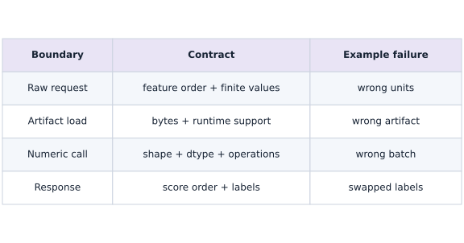

# Export a computation and verify its serving contract

Phase 15: Deployment, interoperability & edge AI · about 110 minutes · CPU

## What you will be able to do

- Serialize and reload a fixed-shape JAX inference computation.
- Test known values and changed requests independently.
- Distinguish export compatibility from service and edge-device readiness.

## The problem

Your function works in the training process. Let’s make sure it also works after saving and reloading its inference computation. We’ll define one request shape, check a known prediction, and deliberately send an incompatible request. These checks give us a clear contract before adding a service around the model.

## The idea

Export packages a computation for a supported runtime. The consumer still needs input validation, preprocessing, output meaning and compatibility information. Separate the artifact boundary from the surrounding service.

## A serialized computation still needs an interface

The lesson exports a fixed float32 input of shape $(1,3)$ to an output of shape $(1,2)$. A Python function may accept a larger batch while that particular exported signature does not. The consumer must follow the artifact's declared contract.

Serialize, load the file again and call the restored computation on new inputs. Comparing only the original in-memory function does not test the exported bytes. Keep artifact hash, environment and tolerance with the result.

If preprocessing lives outside the export, version it alongside the model. A correct graph can still return wrong application results when the caller normalizes inputs differently. A local round trip does not automatically qualify another runtime, hardware target or version.

### Four different deployment boundaries

**Predict:** Which row is tested by the exported object alone?



*Conceptual / analytic teaching diagram; not a recorded benchmark.*

Read top to bottom from the raw request to the response. Each row has a distinct contract and a distinct failure. The exported computation handles the numeric call; request fields, artifact identity and response meaning require surrounding checks. The fresh-process experiment exercises loading and calling under the installed CPU runtime.

### Pause and reason

What should happen to a request with the wrong feature count?

<details><summary>Compare your reasoning</summary>

Reject it at the interface with a clear explanation before inference. Silently reshaping may alter example meaning and does not make the request compatible with the exported signature.

</details>

## Freeze the inference boundary

The example closes over trained weights and bias, so those values become part of the exported computation. The single input is float32 $[1, 3]$; the output is float32 $[1, 2]$. A new weight version requires a new artifact here. For systems that pass weights as inputs, define and version those parameter signatures instead. Remove optimizer state and training-only behavior from this inference boundary.

## Fixed shapes are a deliberate constraint

A fixed batch-one signature simplifies the runtime contract. A batch of two is not accepted merely because the original Python expression supports it. JAX shape polymorphism is a separate export feature with its own constraints. Record permitted dimensions explicitly; an HTTP wrapper should reject malformed requests before invoking the computation.

## Verify the file, not the original function

Serialize, read back and deserialize before checking predictions. Then compare to both a manually known row and NumPy on new inputs. Record the JAX/jaxlib versions, platform, artifact hash, preprocessing and tolerance with the release. Exported calling conventions and supported platforms have compatibility rules; retain the environment instead of assuming a byte file runs everywhere.

## Choose a runtime after choosing an artifact

The local exported call still needs a compatible JAX runtime. For TensorFlow serving, investigate a supported jax2tf or Keras SavedModel route and retest outputs after conversion. For LiteRT, use its supported converter and runtime with explicit operator and dtype checks. ONNX Runtime needs a supported ONNX graph and execution provider. A format name alone says nothing about whether a target NPU can execute every operator.

## From local call to service

Place decoding, normalization, shape checks, inference and response encoding inside your request boundary. Set input size limits and concurrency limits. Measure cold initialization and warmed request latency separately; queueing and network time change the service result. The edge lesson extends this boundary to a single-device request. Autoscaling and a production server are outside this CPU artifact exercise.

## Separate serialized computation from the serving system

Export answers a specific question: can a staged computation be represented, loaded and called with the declared signature? It does not automatically include the request parser, feature names, normalization policy, output labels or service configuration. A fixed shape of $(1,3)$ says that the call expects one observation with three features; it says nothing about which physical measurements those features represent.

This example captures a particular set of weights and bias in the exported computation. The fresh-process experiment loads only the bytes and a request. It does not import the original inference function or retrain a model. Passing that test is stronger than calling the object that just produced the export, but it still checks the installed CPU runtime, not a different accelerator or another runtime's operator coverage.

## Define an inference-only computation

Create main.py in your lesson workspace and run it with the active course Python environment. Keep training out of the function and compute the known probe before exporting.

```python
# Step 1 — Define an inference-only computation: The probe returns [3.1,-0.45].
# Import tempfile for this computation.
import tempfile
from pathlib import Path
import numpy as np
import jax
import jax.numpy as jnp
from jax import export
# Initialize array `weights` with explicit values and shape.
weights = jnp.array([[1., -2.], [.5, 1.], [-1., .25]], dtype=jnp.float32)
# Initialize array `bias` with explicit values and shape.
bias = jnp.array([.1, -.2], dtype=jnp.float32)
# Define and JIT-compile `inference(x)` so XLA traces and fuses the operations:
@jax.jit
# Function `inference(x)` implementing this stage's computation:
def inference(x):
    # Return `x @ weights + bias` to the caller.
    return x @ weights + bias

# Create device-backed JAX array ``.
np.testing.assert_allclose(inference(jnp.array([[1.,2.,-1.]], jnp.float32)), [[3.1,-.45]], atol=1e-6)
```

The probe returns $[3.1,-0.45]$. Preserve that independent expected value as you cross the serialization boundary.

## Declare the fixed input signature

Append this block to the same main.py and rerun the whole file. Stage the computation for a batch of one with three float32 features.

```python
# Step 2 — Declare the fixed input signature: The export has one input of shape (1,3).
signature = jax.ShapeDtypeStruct((1, 3), jnp.float32)
# Run `export.export` to compute `artifact`.
artifact = export.export(inference)(signature)

# Verify that the output tensor shape matches our prediction.
assert artifact.in_avals[0].shape == (1,3)
```

The export has one input of shape $(1,3)$. A batch of two is a different contract; the failure experiment tests that rejection.

## Write bytes, reload and compare

Append this block to the same main.py and rerun the whole file. Serialize to disk and call the restored artifact on the same probe.

```python
# Step 3 — Write bytes, reload and compare: The output agrees with hand arithmetic.
# Create an isolated temporary directory to run and inspect artifacts safely:
with tempfile.TemporaryDirectory() as folder:
    # Read or serialize artifact data on disk (`path`).
    path = Path(folder) / "dense.jaxexport"
    # Run `path.write_bytes` to perform the next check or state transition.
    path.write_bytes(artifact.serialize())
    # Run `export.deserialize` to compute `restored`.
    restored = export.deserialize(path.read_bytes())
    # Convert `sample` to a host NumPy array for inspection or verification.
    sample = np.array([[1., 2., -1.]], np.float32)
    # Convert `actual` to a host NumPy array for inspection or verification.
    actual = np.asarray(restored.call(sample))
    # Verify that computed values match the expected reference within numerical tolerance.
    np.testing.assert_allclose(actual, [[3.1, -.45]], atol=1e-6)
    # Print diagnostic summary of the computed outputs.
    print("Verified serialized bytes:", path.stat().st_size)
```

The output agrees with hand arithmetic. File size is recorded rather than hard-coded because the representation can change with the JAX version. Next, run the fresh-interpreter experiment.

## Run the example

```python
# Export a computation and verify its serving contract: Export packages a computation for a supported runtime.
# Import tempfile for this computation.
import tempfile
from pathlib import Path
import numpy as np
import jax
import jax.numpy as jnp
from jax import export
# Initialize array `weights` with explicit values and shape.
weights = jnp.array([[1., -2.], [.5, 1.], [-1., .25]], dtype=jnp.float32)
# Initialize array `bias` with explicit values and shape.
bias = jnp.array([.1, -.2], dtype=jnp.float32)
# Define and JIT-compile `inference(x)` so XLA traces and fuses the operations:
@jax.jit
# Function `inference(x)` implementing this stage's computation:
def inference(x):
    # Return `x @ weights + bias` to the caller.
    return x @ weights + bias
# Cast or evaluate `signature` in explicit floating-point precision.
signature = jax.ShapeDtypeStruct((1, 3), jnp.float32)
# Run `export.export` to compute `artifact`.
artifact = export.export(inference)(signature)
# Create an isolated temporary directory to run and inspect artifacts safely:
with tempfile.TemporaryDirectory() as folder:
    # Read or serialize artifact data on disk (`path`).
    path = Path(folder) / "dense.jaxexport"
    # Run `path.write_bytes` to perform the next check or state transition.
    path.write_bytes(artifact.serialize())
    # Run `export.deserialize` to compute `restored`.
    restored = export.deserialize(path.read_bytes())
    # Convert `sample` to a host NumPy array for inspection or verification.
    sample = np.array([[1., 2., -1.]], np.float32)
    # Convert `actual` to a host NumPy array for inspection or verification.
    actual = np.asarray(restored.call(sample))
    # Verify that computed values match the expected reference within numerical tolerance.
    np.testing.assert_allclose(actual, [[3.1, -.45]], atol=1e-6)
    # Print diagnostic summary of the computed outputs.
    print("Verified serialized bytes:", path.stat().st_size)
```

Expected: The serialized artifact reloads and returns $[3.1, -0.45]$. File size depends on the JAX version.

## Serialization preserves the declared computation

**Predict:** Do the restored scores match the direct function?


**Recorded CPU computation**

### Read the figure

Each category is one output score. The paired bars compare the direct computation with the restored serialized artifact on the same input. Both give approximately $3.1$ for score $0$ and $-0.45$ for score $1$.

The matching heights show numerical agreement. The bars are adjacent, rather than one line hiding another. A negative second score is valid because these are raw outputs, not probabilities constrained to lie between zero and one.

### Connect it to the computation

This is the first behavior to check after serialization: does the restored computation preserve the result within the declared tolerance? The figure makes a coordinate-by-coordinate mismatch visible instead of reducing all outputs to one aggregate number.

The example exports a specific float32 input signature with shape $(1,3)$. Agreement for this case does not establish acceptance of arbitrary shapes or support in every serving runtime. Keep the signature and input preprocessing with the artifact, then expand parity checks to the cases your application actually needs.

```python
# Compute figure data for: Serialization preserves the declared computation
# Convert `direct` to a host NumPy array for inspection or verification.
direct = np.asarray(inference(sample))
# Evaluate `visual_data` from the current inputs and state.
visual_data = {'kind': 'bar', 'labels': ['score 0', 'score 1'], 'ylabel': 'output score', 'series': [{'label': 'direct', 'y': direct[0].tolist()}, {'label': 'restored artifact', 'y': actual[0].tolist()}]}
```

## Recorded reference execution

CPU run: 2026-10-08T14:06:12.719376+00:00. JAX 0.9.2.

```text
Verified serialized bytes: 1172
Verified serialized bytes: 1172
Rejected incompatible shape: ValueError
Fresh interpreter loaded bytes and matched the known scores.
Changed exported request verified
Invalid requests rejected before the one valid inference call.
PASS: deployment-03

```

## Reject the wrong batch

**Predict before running:** Does the exported signature accept two rows?

```python
# Experiment — Reject the wrong batch: A Python function being shape-generic does not make its fixed...
# Run the boundary check and catch the expected exception:
try:
    restored.call(np.ones((2, 3), np.float32))
except (ValueError, TypeError) as error:
    print("Rejected incompatible shape:", type(error).__name__)
else:
    raise AssertionError("Fixed batch-one contract was not enforced")
```

**Expected:** The incompatible shape is rejected.

A Python function being shape-generic does not make its fixed exported interface polymorphic.

## Load only the exported bytes in a fresh interpreter

**Predict before running:** Will the computation still work when the new process has no inference function or live parameter objects?

```python
# Experiment — Load only the exported bytes in a fresh interpreter: The checked boundary is artifact bytes → installed JAX CPU...
# Import json for this computation.
import json
import os
import subprocess
import sys
# Convert `worker` to a host NumPy array for inspection or verification.
worker = """import json,sys
from pathlib import Path
import numpy as np
from jax import export
loaded = export.deserialize(Path(sys.argv[1]).read_bytes())
request = np.asarray(json.load(sys.stdin)['features'], dtype=np.float32)
print(json.dumps({'scores': np.asarray(loaded.call(request)).tolist()}, allow_nan=False))
"""
# Create an isolated temporary directory to run and inspect artifacts safely:
with tempfile.TemporaryDirectory() as directory:
    # Read or serialize artifact data on disk (`exported_path`).
    exported_path = Path(directory) / 'dense.jaxexport'
    # Run `exported_path.write_bytes` to perform the next check or state transition.
    exported_path.write_bytes(artifact.serialize())
    # Configure environment variable before initializing the runtime.
    completed = subprocess.run([sys.executable, '-c', worker, str(exported_path)], input=json.dumps({'features': [[1.,2.,-1.]]}), text=True, capture_output=True, check=True, env=dict(os.environ, JAX_PLATFORMS='cpu'), timeout=60)
    # Read or serialize artifact data on disk (`worker_scores`).
    worker_scores = json.loads(completed.stdout)['scores']
# Verify that computed values match the expected reference within numerical tolerance.
np.testing.assert_allclose(worker_scores, [[3.1, -.45]], atol=1e-6)
# Print the observed values to compare against the expected result.
print('Fresh interpreter loaded bytes and matched the known scores.')
```

**Expected:** The child process returns $[3.1,-0.45]$ using only the exported artifact and request.

The checked boundary is artifact bytes → installed JAX CPU runtime → scores. The worker has a JSON transport for the test, not a production web server. A separate deployment runtime requires its own receipt.

## Make it yours

Verify a new input $[-2, 0, 3]$ against an independent NumPy expression.

### How to write this exercise — Step-by-step recipe & starter scaffold

**Key functions & syntax to use:**
- `jnp.allclose(actual, expected, rtol=..., atol=...)` — Checks that two arrays match elementwise within floating-point tolerance.

**Step-by-step implementation plan:**
1. Initialize array `changed` with explicit values and shape.
2. Convert `expected` to a host NumPy array for inspection or verification.
3. Verify that computed values match the expected reference within numerical tolerance.
4. Print the observed values to compare against the expected result.

**Starter code scaffold (fill in the TODOs):**

```python
# Exercise solution: Verify a new input [-2, 0, 3] against an independent NumPy expression.
# Initialize array `changed` with explicit values and shape.
changed = np.array(...)  # TODO: compute changed
# Convert `expected` to a host NumPy array for inspection or verification.
expected = ...  # TODO: compute expected
# Verify that computed values match the expected reference within numerical tolerance.
np.testing.assert_allclose(restored.call(changed), expected, atol = ...  # TODO: compute np.testing.assert_allclose(restored.call(changed), expected, atol
# Print the observed values to compare against the expected result.
print("Changed exported request verified")
```

<details><summary>Reference solution</summary>

```python
# Exercise solution: Verify a new input [-2, 0, 3] against an independent NumPy expression.
# Initialize array `changed` with explicit values and shape.
changed = np.array([[-2., 0., 3.]], np.float32)
# Convert `expected` to a host NumPy array for inspection or verification.
expected = changed @ np.asarray(weights) + np.asarray(bias)
# Verify that computed values match the expected reference within numerical tolerance.
np.testing.assert_allclose(restored.call(changed), expected, atol=1e-6)
# Print the observed values to compare against the expected result.
print("Changed exported request verified")
```

</details>

## Validate a request before inference

**Transfer**

Write a host-side request checker that rejects nonfinite values and the wrong shape. Test a NaN input and a wrong feature count.

<details><summary>Hint</summary>

Validate shape and finiteness on the host before calling inference. Include a singleton batch, the wrong feature count and a NaN; specify which cases your serving signature permits.

</details>

### How to write: Validate a request before inference — Step-by-step recipe & starter scaffold

**Key functions & syntax to use:**
- `jnp.allclose(actual, expected, rtol=..., atol=...)` — Checks that two arrays match elementwise within floating-point tolerance.
- `jnp.isfinite(x)` — Returns a boolean mask verifying that no element is `NaN` or `Inf`.

**Step-by-step implementation plan:**
1. Convert `array` to a host NumPy array for inspection or verification.
2. Guard input contract (`array.shape != (1, 3) or not np.isfinite(array).all()`) and fail fast if violated.
3. Return `array` to the caller.
4. Iterate over `invalid` to step through the computation:
5. Verify that computed values match the expected reference within numerical tolerance.

**Starter code scaffold (fill in the TODOs):**

```python
# Validate a request before inference (Transfer): Validation belongs before the runtime call.
def validate_request(values):
    # Convert `array` to a host NumPy array for inspection or verification.
    array = np.asarray(...)  # TODO: compute array
    # Guard input contract (`array.shape != (1, 3) or not np.isfinite(array).all()`) and fail fast if violated.
    if array.shape != (1, 3) or not np.isfinite(array).all():
        raise ValueError("expected finite float32 [1, 3]")
    # Return `array` to the caller.
    return ...  # TODO: return computed result
# Iterate over `invalid` to step through the computation:
for invalid in ([[1., 2.]], [[1., float("nan"), 3.]]):
    try:
        validate_request(invalid)
    except ValueError:
        pass
    else:
        raise AssertionError("invalid input accepted")
# Verify that computed values match the expected reference within numerical tolerance.
np.testing.assert_allclose(restored.call(validate_request([[1.,2.,-1.]])), [[3.1,-.45]], atol=1e-6)
```

<details><summary>Reference solution and reasoning</summary>

```python
# Validate a request before inference (Transfer): Validation belongs before the runtime call.
def validate_request(values):
    # Convert `array` to a host NumPy array for inspection or verification.
    array = np.asarray(values, dtype=np.float32)
    # Guard input contract (`array.shape != (1, 3) or not np.isfinite(array).all()`) and fail fast if violated.
    if array.shape != (1, 3) or not np.isfinite(array).all():
        raise ValueError("expected finite float32 [1, 3]")
    # Return `array` to the caller.
    return array
# Iterate over `invalid` to step through the computation:
for invalid in ([[1., 2.]], [[1., float("nan"), 3.]]):
    try:
        validate_request(invalid)
    except ValueError:
        pass
    else:
        raise AssertionError("invalid input accepted")
# Verify that computed values match the expected reference within numerical tolerance.
np.testing.assert_allclose(restored.call(validate_request([[1.,2.,-1.]])), [[3.1,-.45]], atol=1e-6)
```

Validation belongs before the runtime call. A dtype cast alone neither verifies input shape nor rejects NaNs.

</details>

## Prove that request validation precedes exported inference

**Transfer / diagnosis**

Build a request wrapper that records how often inference runs. Reject both a malformed feature row and a nonfinite row before calling the exported computation. Then verify one valid request.

<details><summary>Hint</summary>

Increment the counter only after validation succeeds. An error message alone does not prove which boundary rejected the input.

</details>

### How to write: Prove that request validation precedes exported inference — Step-by-step recipe & starter scaffold

**Key functions & syntax to use:**
- `jnp.allclose(actual, expected, rtol=..., atol=...)` — Checks that two arrays match elementwise within floating-point tolerance.

**Step-by-step implementation plan:**
1. Function `checked_prediction(values)` implementing this stage's computation:
2. Run `validate_request` to compute `array`.
3. Accumulate the next contribution into `inference_calls[0]`.
4. Return `np.asarray(restored.call(array))` to the caller.
5. Iterate over `invalid` to step through the computation:

**Starter code scaffold (fill in the TODOs):**

```python
# Prove that request validation precedes exported inference (Transfer / diagnosis): The wrapper tests ordering as well as acceptance.
inference_calls = ...  # TODO: compute inference_calls
# Function `checked_prediction(values)` implementing this stage's computation:
def checked_prediction(values):
    # Run `validate_request` to compute `array`.
    array = validate_request(...)  # TODO: compute array
    # Accumulate the next contribution into `inference_calls[0]`.
    inference_calls[0] += 1
    # Return `np.asarray(restored.call(array))` to the caller.
    return ...  # TODO: return computed result
# Iterate over `invalid` to step through the computation:
for invalid in ([[1., 2.]], [[1., float('inf'), 3.]]):
    try: checked_prediction(invalid)
    except ValueError: pass
    else: raise AssertionError('invalid request reached inference')
# Verify contract: `inference_calls[0] == 0`.
assert inference_calls[0]  # TODO: complete assertion check
# Verify that computed values match the expected reference within numerical tolerance.
np.testing.assert_allclose(checked_prediction([[1.,2.,-1.]]), [[3.1,-.45]], atol=1e-6)
# Verify contract: `inference_calls[0] == 1`.
assert inference_calls[0]  # TODO: complete assertion check
# Print the observed values to compare against the expected result.
print('Invalid requests rejected before the one valid inference call.')
```

<details><summary>Reference solution and reasoning</summary>

```python
# Prove that request validation precedes exported inference (Transfer / diagnosis): The wrapper tests ordering as well as acceptance.
inference_calls = [0]
# Function `checked_prediction(values)` implementing this stage's computation:
def checked_prediction(values):
    # Run `validate_request` to compute `array`.
    array = validate_request(values)
    # Accumulate the next contribution into `inference_calls[0]`.
    inference_calls[0] += 1
    # Return `np.asarray(restored.call(array))` to the caller.
    return np.asarray(restored.call(array))
# Iterate over `invalid` to step through the computation:
for invalid in ([[1., 2.]], [[1., float('inf'), 3.]]):
    try: checked_prediction(invalid)
    except ValueError: pass
    else: raise AssertionError('invalid request reached inference')
# Verify contract: `inference_calls[0] == 0`.
assert inference_calls[0] == 0
# Verify that computed values match the expected reference within numerical tolerance.
np.testing.assert_allclose(checked_prediction([[1.,2.,-1.]]), [[3.1,-.45]], atol=1e-6)
# Verify contract: `inference_calls[0] == 1`.
assert inference_calls[0] == 1
# Print the observed values to compare against the expected result.
print('Invalid requests rejected before the one valid inference call.')
```

The wrapper tests ordering as well as acceptance. A service can satisfy an output check on valid inputs and still waste runtime work or fail unclearly on malformed requests.

</details>

## Check your understanding

What does a successful local export round trip prove?

1. The saved computation matches the tested CPU contract.
2. The file is an edge executable on every NPU.
3. An HTTP service now exists.

<details><summary>Answer and explanation</summary>

The saved computation matches the tested CPU contract.

A successful round trip verifies the tested artifact and local runtime. Other consumers, device kernels and request systems require separate checks.

</details>

## Diagnose the result

A missing flatbuffers dependency prevents serialization: reinstall requirements-cpu.txt. A rejected input may be correct enforcement of your shape/dtype signature. Conversion success with output drift calls for intermediate-tensor comparison, preprocessing checks and evaluation on held-out examples.

## Keep your evidence

Keep the export/reload code, version/platform manifest, known-output and changed-input checks, rejected-shape result, and the planned serving request boundary.

Save your predictions, modified code, terminal outputs, and reasoning in your engineering portfolio.

## Primary references

- [JAX export and serialization](https://docs.jax.dev/en/latest/export/export.html)
- [JAX shape polymorphism](https://docs.jax.dev/en/latest/export/shape_poly.html)
- [Keras inference export](https://keras.io/api/models/model_saving_apis/export/)

