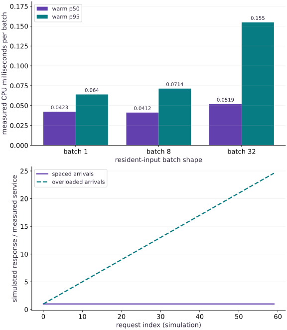

# Inference capacity, batching, and autoscaling

Phase 15: Deployment, interoperability & edge AI · about 115 minutes · CPU

## What you will be able to do

- Measure completed inference after warming each batch shape
- Report batch latency and example throughput with correct units
- Implement and independently check a serial queue timeline
- Distinguish utilization, batch-collection delay and hypothetical replica planning from measured service evidence

## The problem

A model call looks fast in isolation, yet users may wait when requests arrive together. We will measure actual completed inference at several batch sizes, then use those observations in a clearly labeled queue simulation. The aim is to connect milliseconds per batch, examples per second and response latency without confusing a local benchmark with a deployed service.

## The idea

Inference capacity depends on arrivals, queueing, batching, service time and response work. A fast model call is one component. Define the request boundary before estimating throughput or deciding when to add capacity.

## A request spends time before and after computation

A request may wait for a batch, wait behind existing work, execute and then be encoded for response. Larger batches can improve work per call while increasing the first waiting request's latency. These objectives can conflict.

Draw arrival, enqueue, dispatch and completion on one timeline. Then measure or model each interval with its source stated. Tail latency depends on the arrival pattern and concurrency, not just the mean of isolated calls.

This lesson combines measured CPU batch computation with a separately simulated queue. Keep those panels distinct. A queue simulation explores stated assumptions; it is not an observed autoscaling system or a production traffic measurement.

### Pause and reason

Can higher batch throughput coexist with worse user latency?

<details><summary>Compare your reasoning</summary>

Yes. Requests can wait longer to form a batch or reach service. Report both completed throughput and the declared end-to-end latency distribution.

</details>

## Choose the clock boundary first

JAX dispatch may return before numerical work has completed. The timer calls block_until_ready inside the measured interval. Inputs and weights are already resident; preprocessing, device placement, request decoding and response encoding are excluded. The first call for each shape can include compilation and is recorded separately from $40$ warm calls. A p95 from $40$ samples is a small descriptive statistic, not a reliable production tail estimate. Timings change across hosts and repeated runs; correctness checks must not assert a fixed speedup.

## Keep request units and example units separate

Let a batch of $B$ examples take $t_B$ milliseconds. A serial worker completing full batches has a compute-throughput proxy $1000B/t_B$ examples per second. The batch still takes $t_B$ milliseconds; dividing by $B$ describes amortized cost per example, not the response time experienced by one example in that batch. Partial batches, memory pressure, shape recompilation and preprocessing can change both numbers.

$$
q_B=\frac{1000B}{t_B}\quad\text{examples/second}
$$

## Trace a queue before using a rate formula

For one first-come-first-served worker, a request starts at the later of its arrival and the previous finish. With arrivals at $0,1,4$ milliseconds and service duration $2$ milliseconds, starts are $0,2,4$, finishes are $2,4,6$, and response times are $2,3,2$. The second request waits one millisecond because the worker is busy. This independent hand timeline checks our simulation before we feed it measured service durations.

$$
s_i=\max(a_i,f_{i-1}),\qquad f_i=s_i+t,\qquad r_i=f_i-a_i
$$

## A utilization estimate is not a latency guarantee

If arrival rate is $\lambda$ requests per second and each request consumes $t$ milliseconds on one serial worker, the utilization proxy is $\rho=\lambda t/1000$. Sustained offered work above capacity makes backlog grow in this unlimited-queue model. Even below capacity, bursts and service-time variation can cause long waits. Our stable arrivals are spaced $1.5t$ apart, so no queue forms. Overloaded arrivals are $0.6t$ apart; waiting grows by $0.4t$ per request and the sixtieth response takes $24.6t$. These are simulated consequences of declared inputs, not measured user latencies.

## Batch collection trades waiting for throughput

With regularly spaced arrivals separated by $\delta$, filling a batch of $B$ from empty makes its first example wait $(B-1)\delta$ before execution; the average collection wait is $(B-1)\delta/2$ if all positions are equally represented. A timeout permits partial batches and limits intentional collection delay, but a busy worker can still add queueing. A production experiment should replay realistic arrivals, batch sizes and sequence lengths, record queue, collection and execution times separately, and compare tail latency against an explicit service-level objective. This lesson measures batch computation and simulates a batch-one queue; it does not claim a dynamic batching server ran.

## Plan replicas with headroom, then test the plan

For a measured effective capacity $q$ requests per second per replica and target utilization $u$, a first estimate is $R=\lceil\lambda/(u q)\rceil$. This assumes compatible units, balanced routing and an actual capacity measurement for the workload. Autoscaling also has observation windows, startup time, warming and cooldown; it cannot erase a burst that arrives before new capacity is ready. Keep the formula labeled as a planning assumption until a load test includes the real request boundary, concurrency limits, failures and startup behavior.

## 1. Define and check the inference workload

Create a fresh main.py. This fixed dense-network fixture measures an inference boundary; its random weights are not presented as a pretrained or accurate model.

```python
import math
import time
import numpy as np
import jax
import jax.numpy as jnp
rng=np.random.default_rng(82)
W1=jnp.asarray(rng.normal(0,.1,(64,32)).astype(np.float32))
W2=jnp.asarray(rng.normal(0,.1,(32,8)).astype(np.float32))
@jax.jit
def infer(inputs):
    return jnp.tanh(inputs@W1)@W2
def measure(batch_size,repeats=40):
    host=rng.normal(size=(batch_size,64)).astype(np.float32)
    device=jnp.asarray(host)
    began=time.perf_counter()
    first=infer(device).block_until_ready()
    first_ms=(time.perf_counter()-began)*1000
    expected=np.tanh(host@np.asarray(W1))@np.asarray(W2)
    np.testing.assert_allclose(first,expected,rtol=2e-5,atol=2e-6)
    samples=[]
    for _ in range(repeats):
        began=time.perf_counter()
        infer(device).block_until_ready()
        samples.append((time.perf_counter()-began)*1000)
    p50=float(np.percentile(samples,50))
    return {'batch':batch_size,'first_call_ms':first_ms,'samples_ms':samples,
            'p50_ms':p50,'p95_ms':float(np.percentile(samples,95)),
            'steady_examples_per_second':1000*batch_size/p50}
```

The timer includes dispatch and completion for already resident inputs. JSON, networking, queueing and host-to-device placement are outside this boundary.

## 2. Measure each batch shape separately

Append three batch shapes and print all timing boundaries. Each shape has its own first call and warmed sample distribution.

```python
measurements=[measure(batch) for batch in (1,8,32)]
for report in measurements:
    assert len(report['samples_ms'])==40
    assert all(value>0 and np.isfinite(value) for value in report['samples_ms'])
    print({key:value for key,value in report.items() if key!='samples_ms'})
service_ms=measurements[0]['p50_ms']
```

Do not assume a larger batch is faster per request. Examples per second and milliseconds per batch answer different questions.

## 3. Model a queue with an independent hand-check

Append the FCFS simulator and two hypothetical arrival schedules. Times are milliseconds throughout the simulation.

```python
def simulate_queue(arrival_ms,service_ms):
    arrivals=np.asarray(arrival_ms,dtype=float)
    if arrivals.ndim!=1 or np.any(~np.isfinite(arrivals)) or np.any(np.diff(arrivals)<0):
        raise ValueError('arrivals must be a finite ordered vector')
    if not np.isfinite(service_ms) or service_ms<=0:
        raise ValueError('service duration must be positive milliseconds')
    ready=0.
    starts=[];finishes=[]
    for arrival in arrivals:
        start=max(float(arrival),ready)
        ready=start+service_ms
        starts.append(start);finishes.append(ready)
    return np.array(starts),np.array(finishes),np.array(finishes)-arrivals
hand_start,hand_finish,hand_latency=simulate_queue([0.,1.,4.],2.)
np.testing.assert_allclose(hand_start,[0.,2.,4.])
np.testing.assert_allclose(hand_finish,[2.,4.,6.])
np.testing.assert_allclose(hand_latency,[2.,3.,2.])
request_index=np.arange(60)
stable_arrivals=request_index*1.5*service_ms
overloaded_arrivals=request_index*.6*service_ms
_,_,stable_latency=simulate_queue(stable_arrivals,service_ms)
_,_,overloaded_latency=simulate_queue(overloaded_arrivals,service_ms)
assert np.allclose(stable_latency,service_ms)
assert np.isclose(overloaded_latency[-1],24.6*service_ms)
print('measured batch-one service proxy (ms):',service_ms)
print('simulated last stable/overloaded response (ms):',stable_latency[-1],overloaded_latency[-1])
```

This simulator assumes one serial worker and a constant service duration derived from the measured median. It is not a load test, an HTTP server or an autoscaler.

## Run the example

```python
import math
import time
import numpy as np
import jax
import jax.numpy as jnp
rng=np.random.default_rng(82)
W1=jnp.asarray(rng.normal(0,.1,(64,32)).astype(np.float32))
W2=jnp.asarray(rng.normal(0,.1,(32,8)).astype(np.float32))
@jax.jit
def infer(inputs):
    return jnp.tanh(inputs@W1)@W2
def measure(batch_size,repeats=40):
    host=rng.normal(size=(batch_size,64)).astype(np.float32)
    device=jnp.asarray(host)
    began=time.perf_counter()
    first=infer(device).block_until_ready()
    first_ms=(time.perf_counter()-began)*1000
    expected=np.tanh(host@np.asarray(W1))@np.asarray(W2)
    np.testing.assert_allclose(first,expected,rtol=2e-5,atol=2e-6)
    samples=[]
    for _ in range(repeats):
        began=time.perf_counter()
        infer(device).block_until_ready()
        samples.append((time.perf_counter()-began)*1000)
    p50=float(np.percentile(samples,50))
    return {'batch':batch_size,'first_call_ms':first_ms,'samples_ms':samples,
            'p50_ms':p50,'p95_ms':float(np.percentile(samples,95)),
            'steady_examples_per_second':1000*batch_size/p50}

measurements=[measure(batch) for batch in (1,8,32)]
for report in measurements:
    assert len(report['samples_ms'])==40
    assert all(value>0 and np.isfinite(value) for value in report['samples_ms'])
    print({key:value for key,value in report.items() if key!='samples_ms'})
service_ms=measurements[0]['p50_ms']

def simulate_queue(arrival_ms,service_ms):
    arrivals=np.asarray(arrival_ms,dtype=float)
    if arrivals.ndim!=1 or np.any(~np.isfinite(arrivals)) or np.any(np.diff(arrivals)<0):
        raise ValueError('arrivals must be a finite ordered vector')
    if not np.isfinite(service_ms) or service_ms<=0:
        raise ValueError('service duration must be positive milliseconds')
    ready=0.
    starts=[];finishes=[]
    for arrival in arrivals:
        start=max(float(arrival),ready)
        ready=start+service_ms
        starts.append(start);finishes.append(ready)
    return np.array(starts),np.array(finishes),np.array(finishes)-arrivals
hand_start,hand_finish,hand_latency=simulate_queue([0.,1.,4.],2.)
np.testing.assert_allclose(hand_start,[0.,2.,4.])
np.testing.assert_allclose(hand_finish,[2.,4.,6.])
np.testing.assert_allclose(hand_latency,[2.,3.,2.])
request_index=np.arange(60)
stable_arrivals=request_index*1.5*service_ms
overloaded_arrivals=request_index*.6*service_ms
_,_,stable_latency=simulate_queue(stable_arrivals,service_ms)
_,_,overloaded_latency=simulate_queue(overloaded_arrivals,service_ms)
assert np.allclose(stable_latency,service_ms)
assert np.isclose(overloaded_latency[-1],24.6*service_ms)
print('measured batch-one service proxy (ms):',service_ms)
print('simulated last stable/overloaded response (ms):',stable_latency[-1],overloaded_latency[-1])
```

Expected: The program prints first-call, warm p50/p95 and examples-per-second measurements for each batch size. Absolute timings are host-dependent. The independent queue example yields response times of 2, 3 and 2 milliseconds.

## Measured batch computation and a separately simulated queue

**Predict:** Can a queue grow even when the duration of each individual model call is unchanged?



**Recorded CPU computation**

### Read the figure

The upper panel shows measured CPU warm p50 and p95 milliseconds per batch for batch sizes $1,8,32$. Each timing waits for completion; inputs are already resident. These are sample percentiles, not confidence bounds or a speedup guarantee. The lower panel uses request index on the horizontal axis and simulated response time divided by the measured batch-one median on the vertical axis. Stable arrivals stay at $1$; overloaded arrivals rise from $1$ to $24.6$.

### Connect it to the computation

The lower panel’s growth comes entirely from the chosen arrival schedule and serial queue recurrence. The service duration stays fixed in the simulation. Normalizing by the measured service duration makes the buildup visible without freezing host-dependent milliseconds into the prose. Real requests can add networking, preprocessing, variable service times and batch collection; those costs are not inferred from this graph.

```python
visual_data={"kind":"panels","panels":[{"kind":"bar","x":[0,1,2],"labels":["batch 1","batch 8","batch 32"],"xlabel":"resident-input batch shape","ylabel":"measured CPU milliseconds per batch","series":[{"label":"warm p50","y":[r["p50_ms"] for r in measurements]},{"label":"warm p95","y":[r["p95_ms"] for r in measurements]}]},{"kind":"line","x":request_index.tolist(),"xlabel":"request index (simulation)","ylabel":"simulated response / measured service","series":[{"label":"spaced arrivals","y":(stable_latency/service_ms).tolist()},{"label":"overloaded arrivals","y":(overloaded_latency/service_ms).tolist()}]}]}
```

## Recorded reference execution

CPU run: 2026-10-06T15:42:56.607688+00:00. JAX 0.9.2.

```text
{'batch': 1, 'first_call_ms': 31.033499632030725, 'p50_ms': 0.009125098586082458, 'p95_ms': 0.010269298218190665, 'steady_examples_per_second': 109587.85711369668}
{'batch': 8, 'first_call_ms': 19.89674987271428, 'p50_ms': 0.010124873369932175, 'p95_ms': 0.025049666874110685, 'steady_examples_per_second': 790133.3387297061}
{'batch': 32, 'first_call_ms': 19.11341631785035, 'p50_ms': 0.0149579718708992, 'p95_ms': 0.02745192032307386, 'steady_examples_per_second': 2139327.4620509306}
measured batch-one service proxy (ms): 0.009125098586082458
simulated last stable/overloaded response (ms): 0.009125098586082458 0.22447742521762848
{'batch': 1, 'first_call_ms': 19.517916720360518, 'p50_ms': 0.009874347597360611, 'p95_ms': 0.050065177492797375, 'steady_examples_per_second': 101272.5134638057}
{'batch': 8, 'first_call_ms': 18.403999973088503, 'p50_ms': 0.013228971511125565, 'p95_ms': 0.026662135496735566, 'steady_examples_per_second': 604733.3304234573}
{'batch': 32, 'first_call_ms': 18.77100020647049, 'p50_ms': 0.014499993994832039, 'p95_ms': 0.01635991502553224, 'steady_examples_per_second': 2206897.465709652}
measured batch-one service proxy (ms): 0.009874347597360611
simulated last stable/overloaded response (ms): 0.009874347597360611 0.24290895089507103
hypothetical planned replicas: 3
PASS: deployment-04

```

## Compute a replica estimate with explicit units

**Predict before running:** At 300 requests per second, 200 requests per second of effective capacity per replica, and 70% target utilization, how many replicas does the planning formula suggest?

```python
arrival_per_s=300.;capacity_per_s=200.;target_utilization=.7
replicas=math.ceil(arrival_per_s/(target_utilization*capacity_per_s))
assert replicas==3
print("hypothetical planned replicas:",replicas)
```

**Expected:** The formula suggests three replicas under the stated assumptions.

This is arithmetic on hypothetical effective capacities, not an executed autoscaling test.

## Estimate batch-collection delay

**Predict before running:** For eight requests arriving two milliseconds apart, how long do the earliest and average request wait for a full batch before computation?

```python
batch=8;spacing_ms=2.
collection_wait=(batch-1-np.arange(batch))*spacing_ms
assert collection_wait[0]==14.
assert collection_wait.mean()==7.
```

**Expected:** The first waits fourteen milliseconds; mean collection delay is seven milliseconds.

A throughput improvement can be overwhelmed by waiting for a batch at low arrival rates.

## Make it yours

Simulate a burst of four requests arriving at time zero with a two-millisecond serial service duration. Derive all finish times and response times before executing.

<details><summary>Reference solution</summary>

```python
_,burst_finish,burst_latency=simulate_queue([0.,0.,0.,0.],2.)
np.testing.assert_allclose(burst_finish,[2.,4.,6.,8.])
np.testing.assert_allclose(burst_latency,[2.,4.,6.,8.])
```

</details>

## Expose burst sensitivity

**Transfer / diagnosis**

Compare five requests spaced three milliseconds apart with five simultaneous requests. Use two-millisecond service and compare maximum response latency.

<details><summary>Hint</summary>

The worker is idle between spaced requests but never idle during the burst.

</details>

<details><summary>Reference solution and reasoning</summary>

```python
_,_,smooth=simulate_queue(np.arange(5)*3.,2.)
_,_,burst=simulate_queue(np.zeros(5),2.)
assert smooth.max()==2. and burst.max()==10.
```

An average arrival rate alone does not describe a burst or tail latency.

</details>

## Reject a broken timeline

**Transfer / diagnosis**

Pass an out-of-order arrival vector and a zero service duration. Confirm both are rejected instead of returning a plausible chart.

<details><summary>Hint</summary>

Public simulation inputs need finite, ordered values and positive service time.

</details>

<details><summary>Reference solution and reasoning</summary>

```python
for arrivals,duration in [([2.,1.],2.),([0.,1.],0.)]:
    try:
        simulate_queue(arrivals,duration)
    except ValueError:
        pass
    else:
        raise AssertionError("invalid timeline was accepted")
```

Validating assumptions prevents a simulation from silently supporting a false capacity story.

</details>

## Check your understanding

A batch of eight finishes in four milliseconds. Which statement follows for a fully occupied serial worker?

1. Every example experiences half a millisecond of response latency
2. The compute-throughput proxy is two thousand examples per second, while batch execution still takes four milliseconds
3. The service can guarantee the same throughput for every arrival pattern

<details><summary>Answer and explanation</summary>

The compute-throughput proxy is two thousand examples per second, while batch execution still takes four milliseconds

Eight examples per four milliseconds gives two thousand per second when batches remain full. A request still waits for collection and the full execution, plus any other boundary costs.

</details>

## Diagnose the result

If timings look impossibly small, check that completion is inside the timer. If a larger batch improves examples per second but misses a latency target, inspect collection and queue delay before choosing replicas. If a capacity calculation differs by a thousand, label milliseconds versus seconds at every conversion.

## Carry forward

- Measure completion and declare the boundary.
- Batch throughput, amortized cost and individual response time are different quantities.
- A queue simulation and replica formula guide experiments; neither replaces a real service load test.

## Keep your evidence

Warm timing samples, latency/throughput units, independent queue timeline and labeled simulation/replica assumptions. Keep the environment, observed outputs and your explanation of the figure.

Keep predictions, modified code, observed results, and reasoning. A checkpoint alone does not demonstrate the exercise.

## Primary references

- [JAX benchmarking guidance](https://docs.jax.dev/en/latest/benchmarking.html)
- [JAX asynchronous dispatch](https://docs.jax.dev/en/latest/async_dispatch.html)

