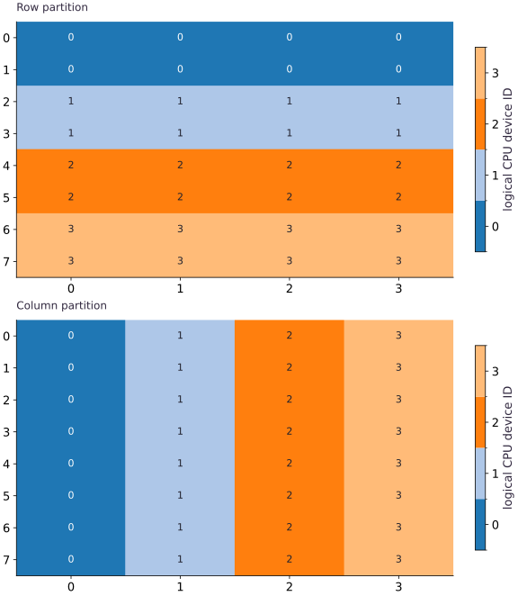

# Arrays, meshes, and sharding

Phase 09: Distributed training · about 80 minutes · 4 logical CPU devices

## What you will be able to do

- Translate a PartitionSpec into local shard shapes.
- Inspect shard indices and verify values.
- Explain communication needs of a global reduction.
- Repair uneven batch statistics with padding and masks.

## The problem

We can split examples across devices, split features across devices, or keep a full copy on each one. Let’s make those choices visible on four logical CPU devices. You’ll inspect the pieces and see why some reductions must combine results. No cluster is needed, and these observations do not measure accelerator performance.

## The idea

A Mesh names device axes, a PartitionSpec maps array dimensions to those axes, and NamedSharding combines both into a placement description. The numerical array and its placement are separate objects. Correct values do not prove correct placement, and a placement diagram is not proof of performance.

## Read the mapping from left to right

Start with eight rows and four columns. Our one-dimensional mesh contains four devices along data. `P("data",None)` partitions eight rows into four groups of two and preserves four features per shard. `P(None,"data")` leaves rows intact and assigns one of four columns to each device. The same global shape supports both arrangements.

None means an array dimension is not partitioned by this specification, not that the values are missing. `P()` replicates the whole array. A device mesh axis may not be reused across multiple array dimensions within one PartitionSpec. More complex two-dimensional meshes need distinct axis names and a reason for assigning each dimension.

```text
Array (8,4) → P(data,None) → 4 pieces (2,4)
Array (8,4) → P(None,data) → 4 pieces (8,1)
Array (8,4) → P() → 4 full copies (8,4)
```

## Inspect indices rather than guessing ordering

addressable_shards lists pieces this process can access. Each piece carries a device, global index and data. For row partitioning the indices select successive two-row slices; for column partitioning they select individual columns. Compare host[shard.index] with shard.data. This catches a mismatch between the intended assignment and the actual data.

All four devices are addressable here because we have one process. In a multi-process program, the global device set may include devices another process owns. `np.asarray` on a global array that is not fully addressable is not a general multi-host gathering recipe. This lesson deliberately exercises only the single-process case.

## A reduction has a communication requirement

For rows $0$ through $31$ reshaped to $(8,4)$, the first column is $0$,$4$,$8$,$12$,$16$,$20$,$24$,$28$ and sums to $112$. Each row shard can sum its own two rows, but no one shard initially sees all eight. Producing a replicated global column sum requires combining contributions across the data axis.

We use a jitted ordinary sum and declare replicated output. JAX compiles the placement-aware global operation and arranges necessary communication. The source-level need to combine partial sums is a reasoning argument; exact collective lowering is compiler/version dependent and would require lowered code or profiler evidence to characterize. This CPU lesson does not estimate accelerator communication latency.

```text
partial sums device 0: [4,6,8,10]
partial sums device 1: [20,22,24,26]
partial sums device 2: [36,38,40,42]
partial sums device 3: [52,54,56,58]
combine → [112,120,128,136]
```

## Choose placement for the operation you will perform

Elementwise functions naturally preserve local independence. Reductions across a partitioned dimension and matrix multiplications can require communication. Choosing columns instead of rows changes which values are locally available; it does not alter the mathematical answer.

device_put from a host NumPy array places that array according to the requested sharding. Moving an already placed JAX array to a different sharding is a resharding operation. Host reconstruction is useful for our tiny verification case but should not be inserted into a real training loop. The experiments compare two layouts for correctness, not speed. Save global shapes, specs and shard tables as the evidence needed to reason about a future workload.

## Start a fresh CPU runtime

Create main.py in your course workspace. Paste this block first. If using a notebook, restart its kernel before running any cell.

```python
import jax
# Run this file in a fresh process; in a notebook restart the kernel first.
jax.config.update("jax_platforms", "cpu")
jax.config.update("jax_num_cpu_devices", 4)
import jax.numpy as jnp
import numpy as np
from jax.sharding import Mesh, NamedSharding, PartitionSpec as P
devices = jax.devices("cpu")
if len(devices) != 4:
    raise RuntimeError("Expected four CPU devices. Restart the notebook kernel, then Run all; do not run an earlier JAX cell first.")
mesh = Mesh(np.array(devices), ("data",))
rows = NamedSharding(mesh, P("data", None))
replicated = NamedSharding(mesh, P())
```

Configuration happens before `devices()` or array creation initializes a backend. This file explicitly chooses CPU even on a GPU machine.

## Place and compute

Append this block in the same file. Predict the shapes and values before running.

```python
host = np.arange(32, dtype=np.float32).reshape(8,4)
x = jax.device_put(host, rows)
columns = NamedSharding(mesh, P(None, "data"))
x_columns = jax.device_put(host, columns)
sum_rows = jax.jit(lambda a:a.sum(axis=0), in_shardings=rows, out_shardings=replicated)(x)
sum_rows.block_until_ready()
```

Mesh axis names describe placement. They are separate from the numerical array dimensions.

## Inspect and verify

Append the checks, save the file and run python main.py with the setup lesson environment.

```python
np.testing.assert_array_equal(np.asarray(sum_rows), np.array([112,120,128,136],dtype=np.float32))
for shard in x.addressable_shards:
    assert shard.data.shape == (2,4)
    np.testing.assert_array_equal(np.asarray(shard.data), host[shard.index])
for shard in x_columns.addressable_shards:
    assert shard.data.shape == (8,1)
    np.testing.assert_array_equal(np.asarray(shard.data), host[shard.index])
print("Row-shard shapes:", [s.data.shape for s in x.addressable_shards])
print("Column-shard shapes:", [s.data.shape for s in x_columns.addressable_shards])
print("Column sums:", np.asarray(sum_rows))
```

Assertions compare against host calculations or hand-derived values; printing a sharding object alone does not establish correctness.

## Run the example

```python
import jax
# Run this file in a fresh process; in a notebook restart the kernel first.
jax.config.update("jax_platforms", "cpu")
jax.config.update("jax_num_cpu_devices", 4)
import jax.numpy as jnp
import numpy as np
from jax.sharding import Mesh, NamedSharding, PartitionSpec as P
devices = jax.devices("cpu")
if len(devices) != 4:
    raise RuntimeError("Expected four CPU devices. Restart the notebook kernel, then Run all; do not run an earlier JAX cell first.")
mesh = Mesh(np.array(devices), ("data",))
rows = NamedSharding(mesh, P("data", None))
replicated = NamedSharding(mesh, P())

host = np.arange(32, dtype=np.float32).reshape(8,4)
x = jax.device_put(host, rows)
columns = NamedSharding(mesh, P(None, "data"))
x_columns = jax.device_put(host, columns)
sum_rows = jax.jit(lambda a:a.sum(axis=0), in_shardings=rows, out_shardings=replicated)(x)
sum_rows.block_until_ready()

np.testing.assert_array_equal(np.asarray(sum_rows), np.array([112,120,128,136],dtype=np.float32))
for shard in x.addressable_shards:
    assert shard.data.shape == (2,4)
    np.testing.assert_array_equal(np.asarray(shard.data), host[shard.index])
for shard in x_columns.addressable_shards:
    assert shard.data.shape == (8,1)
    np.testing.assert_array_equal(np.asarray(shard.data), host[shard.index])
print("Row-shard shapes:", [s.data.shape for s in x.addressable_shards])
print("Column-shard shapes:", [s.data.shape for s in x_columns.addressable_shards])
print("Column sums:", np.asarray(sum_rows))
```

Expected: Four row shards $(2,4)$; four column shards $(8,1)$. Column sums $[112,120,128,136]$.

## Row sharding and column sharding place the same array differently

**Predict:** Which dimension is split across devices in each panel?



**Recorded CPU computation**

### Read the figure

Both panels represent the same global array with shape $(8,4)$. Each cell’s number and color identify its owning logical device, not the array value stored there. Device colors are categorical and do not rank speed or capacity.

In the upper panel, each device owns two complete rows: device $0$ owns rows $0$ and $1$, for example. In the lower panel, each device owns one complete column across all eight rows. The horizontal bands become vertical bands when the partitioned axis changes.

### Connect it to the computation

Each device owns eight scalar entries in either layout, but their local shapes differ: $(2,4)$ for row partitioning and $(8,1)$ for column partitioning. Equal local element counts do not mean that the same operations will have the same communication needs.

For example, a whole row is locally available in the upper layout but split across devices in the lower one. A row-wise reduction therefore has different placement implications. The figure establishes ownership only; communication volume and execution time are not measured, and these four logical devices share one CPU host.

```python
panels = []
for name, array in [('Row partition', x), ('Column partition', x_columns)]:
    owner = np.empty(host.shape, dtype=int)
    for s in array.addressable_shards:
        owner[s.index] = s.device.id
    panels.append({'kind': 'heatmap', 'title': name, 'values': owner.tolist(), 'unit': 'logical CPU device ID'})
visual_data = {'kind': 'panels', 'panels': panels}
```

## Recorded reference execution

CPU run: 2026-10-06T01:24:34.338301+00:00. JAX 0.9.2.

```text
Row-shard shapes: [(2, 4), (2, 4), (2, 4), (2, 4)]
Column-shard shapes: [(8, 1), (8, 1), (8, 1), (8, 1)]
Column sums: [112. 120. 128. 136.]
Row-shard shapes: [(2, 4), (2, 4), (2, 4), (2, 4)]
Column-shard shapes: [(8, 1), (8, 1), (8, 1), (8, 1)]
Column sums: [112. 120. 128. 136.]
Resharded values preserved
Row sums: [  6.  22.  38.  54.  70.  86. 102. 118.]
Expected indivisible batch
Expected indivisible batch
PASS: distributed-01

```

## Reshard the same global values

**Predict before running:** Moving $x$ from row partitioning to column partitioning changes local shapes. Does it change the global values?

```python
moved = jax.device_put(x, columns)
np.testing.assert_array_equal(np.asarray(moved), host)
assert all(s.data.shape == (8,1) for s in moved.addressable_shards)
print("Resharded values preserved")
```

**Expected:** Global array unchanged; local shards now $(8,1)$.

Resharding changes ownership of values, not their mathematical identity.

## Reduce a dimension that is not partitioned

**Predict before running:** Sum each row. Predict the output shape and which mesh axis should partition it.

```python
vector_rows = NamedSharding(mesh, P("data"))
per_row = jax.jit(lambda a:a.sum(axis=1), in_shardings=rows, out_shardings=vector_rows)(x)
np.testing.assert_array_equal(np.asarray(per_row), np.arange(6,119,16,dtype=np.float32))
assert all(s.data.shape == (2,) for s in per_row.addressable_shards)
print("Row sums:", np.asarray(per_row))
```

**Expected:** Row sums $[6,22,38,54,70,86,102,118]$; local shapes $(2,)$.

All four columns for a row are already local in row partitioning; this reduction does not mathematically require combining data-axis pieces.

## Make it yours

Compare row and column layouts of a $(12,8)$ array, and repair a ten-row mean with padding plus an explicit mask.

<details><summary>Reference solution</summary>

```python
other = np.arange(96,dtype=np.float32).reshape(12,8)
for spec, expected in [(rows,(3,8)),(columns,(12,2))]:
    placed = jax.device_put(other,spec)
    for shard in placed.addressable_shards:
        assert shard.data.shape == expected
        np.testing.assert_array_equal(np.asarray(shard.data),other[shard.index])

original = np.arange(40,dtype=np.float32).reshape(10,4)
try:
    jax.device_put(original, rows)
except ValueError:
    print("Expected indivisible batch")
else:
    raise AssertionError("Expected divisibility failure")
padded = jax.device_put(np.pad(original,((0,2),(0,0))),rows)
mask_sharding = NamedSharding(mesh,P("data"))
mask = jax.device_put(np.array([1]*10+[0]*2,dtype=np.float32),mask_sharding)
masked_mean = jax.jit(lambda a,m:(a*m[:,None]).sum(axis=0)/m.sum(),in_shardings=(rows,mask_sharding),out_shardings=replicated)(padded,mask)
np.testing.assert_allclose(np.asarray(masked_mean),original.mean(axis=0),rtol=1e-6)
assert not np.allclose(np.asarray(padded.mean(axis=0)), original.mean(axis=0))
```

</details>

## Change both dimensions

**Challenge**

Use a $(12,8)$ array. Verify row and column layouts and predict every local shape.

<details><summary>Hint</summary>

Four devices divide twelve rows or eight columns.

</details>

<details><summary>Reference solution and reasoning</summary>

```python
other = np.arange(96,dtype=np.float32).reshape(12,8)
for spec, expected in [(rows,(3,8)),(columns,(12,2))]:
    placed = jax.device_put(other,spec)
    for shard in placed.addressable_shards:
        assert shard.data.shape == expected
        np.testing.assert_array_equal(np.asarray(shard.data),other[shard.index])
```

The row layout owns three complete feature vectors per device; the column layout owns two features for every observation.

</details>

## Pad an uneven batch without corrupting its mean

**Challenge**

Ten observations cannot be row-partitioned over four devices. Pad to twelve and use a mask to recover the true column mean. Demonstrate the wrong unmasked mean.

<details><summary>Hint</summary>

The divisor is the sum of the mask, not padded length.

</details>

<details><summary>Reference solution and reasoning</summary>

```python
original = np.arange(40,dtype=np.float32).reshape(10,4)
try:
    jax.device_put(original, rows)
except ValueError:
    print("Expected indivisible batch")
else:
    raise AssertionError("Expected divisibility failure")
padded = jax.device_put(np.pad(original,((0,2),(0,0))),rows)
mask_sharding = NamedSharding(mesh,P("data"))
mask = jax.device_put(np.array([1]*10+[0]*2,dtype=np.float32),mask_sharding)
masked_mean = jax.jit(lambda a,m:(a*m[:,None]).sum(axis=0)/m.sum(),in_shardings=(rows,mask_sharding),out_shardings=replicated)(padded,mask)
np.testing.assert_allclose(np.asarray(masked_mean),original.mean(axis=0),rtol=1e-6)
assert not np.allclose(np.asarray(padded.mean(axis=0)), original.mean(axis=0))
```

Padding repairs the shape but adds artificial rows. The mask keeps them out of both numerator and denominator. Checking only divisibility would miss this statistical error.

</details>

## Check your understanding

With row sharding, why does a global column sum need results from other devices?

1. Each device initially holds only some rows.
2. Every sum requires host Python.
3. Partitioning changes the mathematical definition of sum.

<details><summary>Answer and explanation</summary>

Each device initially holds only some rows.

The reduction spans the partitioned row dimension, so partial contributions must be combined.

</details>

## Diagnose the result

Padding repairs the shape but adds artificial rows. The mask keeps them out of both numerator and denominator. Checking only divisibility would miss this statistical error.

## Carry forward

- Read the mapping from left to right
- Inspect indices rather than guessing ordering
- A reduction has a communication requirement
- Choose placement for the operation you will perform

## Keep your evidence

Padding repairs the shape but adds artificial rows. The mask keeps them out of both numerator and denominator. Checking only divisibility would miss this statistical error.

Keep predictions, modified code, observed results, and reasoning. A checkpoint alone does not demonstrate the exercise.

## Primary references

- [JAX CPU device configuration (set before initialization)](https://docs.jax.dev/en/latest/config_options.html#num-cpu-devices)
- [Distributed arrays and automatic parallelization](https://docs.jax.dev/en/latest/201/sharding.html)

