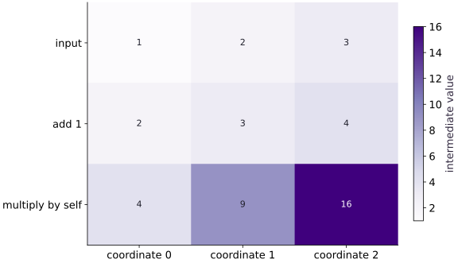

# Read your first jaxpr

Phase 14: Autodiff & JAX internals · about 90 minutes · CPU

## What you will be able to do

- Translate jaxpr variables and array types into a data-flow diagram.
- Compare a forward computation with its gradient program.
- Distinguish a closed-over array constant from a function input.
- Diagnose a traced Python branch and verify a lax.cond repair.
- Compare an unrolled loop with a scan without claiming a speedup.

## The problem

Your function returns the right answer. Now let’s look inside the computation JAX traced. We’ll start with three operations, calculate each intermediate value ourselves, and match them to a jaxpr. Then we’ll see what changes after differentiation. The printed representation is a learning tool, not a measurement of execution speed.

## The idea

A jaxpr records primitive operations and the values that connect them. Read it as a data-flow program with shapes and dtypes, not as a literal description of final hardware instructions or Python execution order.

## Read a jaxpr as a typed computation

Start at the inputs and trace one intermediate to its consumers. For a reduction, identify the consumed axes and resulting shape. Distinguish array inputs from closed constants: both can affect the output, but they enter the program differently.

Then connect each primitive to the corresponding part of the original expression. A variable name in a printed jaxpr is a local label, not a stable API to test verbatim.

The intermediate-value heatmap is a numerical aid. Pair it with the typed dependency graph to explain how those values were produced. Lowering and compilation can change representation later; a primitive count alone does not predict executed kernel count or runtime.

### Pause and reason

Why avoid a correctness test that compares the entire printed jaxpr string?

<details><summary>Compare your reasoning</summary>

Formatting, names and primitive details can change across versions. Test intended structure where appropriate and verify numerical behavior independently.

</details>

## Compute the values before reading the representation

Start with $x=[1, 2, 3]$. Adding $1$ gives $[2, 3, 4]$. Elementwise multiplication of this vector by itself gives $[4, 9, 16]$. The sum is $29$. The first two operations retain shape $(3,)$, while the reduction produces a scalar, whose array shape is ().

The derivative of each $(x_i+1)^2$ is $2(x_i+1)$, so the gradient at this input is $[4, 6, 8]$. A different implementation could produce the same values with different primitives. We use multiplication explicitly to keep this first trace readable. Do not infer an algorithm from the spelling of a Python expression alone.

```text
x: f32[3] = [1, 2, 3]
   │ add scalar 1
   ▼
shifted: f32[3] = [2, 3, 4]
   │ multiply by shifted
   ▼
squared: f32[3] = [4, 9, 16]
   │ reduce_sum over axis 0
   ▼
result: f32[] = 29
```

## Read one equation at a time

In a typical printout the input is named a, the shifted vector b, the squared vector c, and the scalar result $d$. These names are generated; they are not your Python variable names and can change across versions. An equation such as `b:f32[3] = add a 1.0:f32[]` binds a new value rather than mutating a. f32 means float32, $[3]$ denotes a length-three vector, and [] denotes a scalar.

The lambda header lists closed constants before its semicolon and ordinary input variables after it. The let block lists equations; the final in (...) lists returned values. Parameters in brackets belong to a primitive, for example reduction axes. Our script iterates over eqns and prints primitive names and output shapes so you can relate the structured object to the text. Treat exact formatting and generated names as version-dependent details.

```text
{ lambda ; a:f32[3]. let
    b:f32[3] = add a 1.0:f32[]
    c:f32[3] = mul b b
    d:f32[] = reduce_sum[...] c
  in (d,) }
Illustrative excerpt: actual reduction parameters may differ.
```

## Trace an abstract signature, not the sample’s values

make_jaxpr uses an example array to establish an abstract input shape and dtype. It does not use the ordinary data values as Python control-flow decisions. Calling the same function with another float32 length-three array follows the same computation structure. A length-four input changes the types in the representation, even though the algorithm is still add, multiply, sum.

This is why if $x$$[0]$ > $0$ cannot select a Python branch during ordinary tracing: the comparison produces a traced boolean, not a concrete Python truth value. Use array-compatible control flow such as lax.cond with compatible branch result types. Moving the predicate into a static argument is a different design and may trigger separate traces; it is not a universal repair.

## Inspect the gradient as another program

`make_jaxpr(grad(shifted_square_sum))(x)` asks JAX to trace the transformed derivative function. You will see additional operations that propagate a scalar output sensitivity back to vector inputs, including multiplication and broadcasting. Some forward operations may remain; their exact arrangement depends on transformations and JAX’s implementation.

Count the equations as a descriptive observation, then verify the numerical derivative independently at multiple inputs. More equations do not automatically mean slower execution: lowering, fusion, memory movement and hardware scheduling affect runtime. A jaxpr can tell you what was traced; profiling answers where time is spent.

## Separate data inputs from captured constants

An array defined outside a function and read by it can appear as a closed constant. In the exercise below the offset vector is $[1, 2, 3]$; $x$ remains the ordinary input. Inspect closed.consts and jaxpr.constvars, then compare with a version that takes the offset as an explicit second argument. The explicit version has two input variables.

This distinction matters for clarity and reusable function signatures. It does not prove that a constant occupies a particular device memory buffer or is copied on every call. Later compiler stages can represent constants differently. Save the traced structure without presenting it as a memory trace.

## Compare Python unrolling with structured iteration

A Python loop with a fixed range is executed during tracing, so its repeated array operations can appear repeatedly in the outer jaxpr. lax.scan represents a loop with a nested body and a carry contract; the outer equation list includes the loop primitive rather than simply expanding every iteration.

Inspect both representations for a four-step recurrence and verify they return the same result. The body jaxpr still contains operations, so counting only outer equations would hide work. This comparison illustrates representation, not a benchmark. For an actual performance claim, measure compilation and synchronized execution separately on the intended hardware.

## 1. Establish the input signature

Create main.py in the activated setup environment and add the imports and float32 vector below. Calculate $[2, 3, 4]$ → $[4, 9, 16]$ → $29$ on paper.

```python
# Step 1 — 1. Establish the input signature: The vector has shape (3,) and dtype float32; these determine the...
# Import jax for this computation.
import jax
import jax.numpy as jnp

# Initialize array `x` with explicit values and shape.
x = jnp.array([1., 2., 3.], dtype=jnp.float32)
```

The vector has shape $(3,)$ and dtype float32; these determine the abstract input type.

## 2. Write the pure function

Append this function. It reads its argument and returns one scalar; no global mutation or Python branch is involved.

```python
# Step 2 — 2. Write the pure function: Each assignment names a new value.
def shifted_square_sum(x):
    # Evaluate `shifted` from the current inputs and state.
    shifted = x + 1.
    # Evaluate `squared` from the current inputs and state.
    squared = shifted * shifted
    # Return `jnp.sum(squared)` to the caller.
    return jnp.sum(squared)
```

Each assignment names a new value. sum reduces the three squared values to a scalar.

## 3. Inspect and independently verify

Append this block and run python main.py. Match each printed operation to the flow above, then compare the assertions with your paper calculation.

```python
# Step 3 — 3. Inspect and independently verify: Forward operations include add, mul and reduce_sum, with output...
# Trace or lower the function to inspect its compiler representation (`closed`).
closed = jax.make_jaxpr(shifted_square_sum)(x)
# Print the observed values to compare against the expected result.
print("Forward program:")
# Print diagnostic summary of the computed outputs.
print(closed)
# Iterate over `equation` to step through the computation:
for equation in closed.jaxpr.eqns:
    # Print diagnostic summary of the computed outputs.
    print("Operation:", equation.primitive.name,
          "output shapes:", [v.aval.shape for v in equation.outvars])
# Run `shifted_square_sum` to compute `value`.
value = shifted_square_sum(x)
# Differentiate the objective to obtain `gradient` via automatic differentiation.
gradient = jax.grad(shifted_square_sum)(x)
# Print the observed values to compare against the expected result.
print("Value / gradient:", value, gradient)
# Verify that the numerical values match the expected reference within tolerance.
assert jnp.allclose(value, 29.)
# Verify that the output satisfies the expected shape, finite-value, or numerical contract.
assert jnp.allclose(gradient, jnp.array([4., 6., 8.]))
```

Forward operations include add, mul and reduce_sum, with output shapes $(3,)$, $(3,)$, (). Value: $29.0$; gradient: $[4., 6., 8.]$. Variable names and printed primitive parameters may vary by JAX version.

## Run the example

```python
# Step 1 — 1. Establish the input signature: The vector has shape (3,) and dtype float32; these determine the...
# Import jax for this computation.
import jax
import jax.numpy as jnp

# Initialize array `x` with explicit values and shape.
x = jnp.array([1., 2., 3.], dtype=jnp.float32)
# Step 2 — 2. Write the pure function: Each assignment names a new value.
def shifted_square_sum(x):
    # Evaluate `shifted` from the current inputs and state.
    shifted = x + 1.
    # Evaluate `squared` from the current inputs and state.
    squared = shifted * shifted
    # Return `jnp.sum(squared)` to the caller.
    return jnp.sum(squared)

# Step 3 — 3. Inspect and independently verify: Forward operations include add, mul and reduce_sum, with output...
# Trace or lower the function to inspect its compiler representation (`closed`).
closed = jax.make_jaxpr(shifted_square_sum)(x)
# Print the observed values to compare against the expected result.
print("Forward program:")
# Print diagnostic summary of the computed outputs.
print(closed)
# Iterate over `equation` to step through the computation:
for equation in closed.jaxpr.eqns:
    # Print diagnostic summary of the computed outputs.
    print("Operation:", equation.primitive.name,
          "output shapes:", [v.aval.shape for v in equation.outvars])
# Run `shifted_square_sum` to compute `value`.
value = shifted_square_sum(x)
# Differentiate the objective to obtain `gradient` via automatic differentiation.
gradient = jax.grad(shifted_square_sum)(x)
# Print the observed values to compare against the expected result.
print("Value / gradient:", value, gradient)
# Verify that the numerical values match the expected reference within tolerance.
assert jnp.allclose(value, 29.)
# Verify that the output satisfies the expected shape, finite-value, or numerical contract.
assert jnp.allclose(gradient, jnp.array([4., 6., 8.]))
```

Expected: Forward operations include add, mul and reduce_sum, with output shapes $(3,)$, $(3,)$, (). Value: $29.0$; gradient: $[4., 6., 8.]$. Variable names and printed primitive parameters may vary by JAX version.

## Follow values through the jaxpr operations

**Predict:** Which operation reduces an array to one scalar?



**Recorded CPU computation**

### Read the figure

Columns track the three array coordinates, while rows track stages of a computation. The first row is input $(1,2,3)$. Adding $1$ produces $(2,3,4)$, and multiplying those values by themselves produces $(4,9,16)$.

Follow one column downward: the final coordinate changes from $3$ to $4$ to $16$. Its darker bottom cell reflects a larger intermediate value, not a more expensive operation or longer runtime.

### Connect it to the computation

The final reduction adds the bottom row to obtain $4+9+16=29$. That scalar is not another row in the heatmap because it no longer has three separate coordinates. This change of shape connects the elementwise operations to the reduction in the jaxpr.

A jaxpr describes operations and abstract values. The figure supplies concrete intermediate values for this one input, making that program easier to trace by hand. Changing the input changes these numbers without necessarily changing the jaxpr’s structure.

```python
# Compute figure data for: Follow values through the jaxpr operations
# Combine or mask array elements to form `visual_data`.
visual_data = {'kind': 'heatmap', 'values': jnp.stack([x, x + 1, (x + 1) ** 2]).tolist(), 'rows': ['input', 'add 1', 'multiply by self'], 'columns': ['coordinate 0', 'coordinate 1', 'coordinate 2'], 'unit': 'intermediate value'}
```

## Recorded reference execution

CPU run: 2026-10-08T14:05:42.881459+00:00. JAX 0.9.2.

```text
Forward program:
{ lambda ; a:f32[3]. let
    b:f32[3] = add a 1.0:f32[]
    c:f32[3] = mul b b
    d:f32[] = reduce_sum[axes=(0,) out_sharding=None] c
  in (d,) }
Operation: add output shapes: [(3,)]
Operation: mul output shapes: [(3,)]
Operation: reduce_sum output shapes: [()]
Value / gradient: 29.0 [4. 6. 8.]
Forward program:
{ lambda ; a:f32[3]. let
    b:f32[3] = add a 1.0:f32[]
    c:f32[3] = mul b b
    d:f32[] = reduce_sum[axes=(0,) out_sharding=None] c
  in (d,) }
Operation: add output shapes: [(3,)]
Operation: mul output shapes: [(3,)]
Operation: reduce_sum output shapes: [()]
Value / gradient: 29.0 [4. 6. 8.]
Derivative program: { lambda ; a:f32[3]. let
    b:f32[3] = add a 1.0:f32[]
    c:f32[3] = mul b b
    _:f32[] = reduce_sum[axes=(0,) out_sharding=None] c
    d:f32[3] = broadcast_in_dim 1.0:f32[]
    e:f32[3] = mul b d
    f:f32[3] = mul d b
    g:f32[3] = add_any e f
  in (g,) }
Captured: { lambda a:f32[3]; b:f32[3]. let
    c:f32[3] = add b a
    d:f32[] = reduce_sum[axes=(0,) out_sharding=None] c
  in (d,) }
Explicit: { lambda ; a:f32[3] b:f32[3]. let
    c:f32[3] = add a b
    d:f32[] = reduce_sum[axes=(0,) out_sharding=None] c
  in (d,) }
{ lambda ; a:f32[3]. let
    b:f32[3] = add a 2.0:f32[]
    c:f32[3] = mul b b
    d:f32[] = reduce_sum[axes=(0,) out_sharding=None] c
  in (d,) }
Unrolled: { lambda ; a:f32[]. let
    b:f32[] = mul 0.5:f32[] a
    c:f32[] = add b 1.0:f32[]
    d:f32[] = mul 0.5:f32[] c
    e:f32[] = add d 1.0:f32[]
    f:f32[] = mul 0.5:f32[] e
    g:f32[] = add f 1.0:f32[]
    h:f32[] = mul 0.5:f32[] g
    i:f32[] = add h 1.0:f32[]
  in (i,) }
Scanned: { lambda ; a:f32[]. let
    b:f32[] _:f32[4] = scan[
      _split_transpose=False
      jaxpr={ lambda ; c:f32[]. let
          d:f32[] = mul 0.5:f32[] c
          e:f32[] = add d 1.0:f32[]
        in (e, e) }
      length=4
      linear=(False,)
      num_carry=1
      num_consts=0
      reverse=False
      unroll=1
    ] a
  in (b,) }
Expected failure: traced boolean used by Python if
Repaired: { lambda ; a:f32[3]. let
    b:f32[1] = slice[limit_indices=(1,) start_indices=(0,) strides=None] a
    c:f32[] = squeeze[dimensions=(0,)] b
    d:bool[] = gt c 0.0:f32[]
    e:i32[] = convert_element_type[new_dtype=int32 weak_type=False] d
    f:f32[] = cond[
      branches=(
        { lambda ; g:f32[3]. let
            h:f32[] = reduce_sum[axes=(0,) out_sharding=None] g
            i:f32[] = neg h
          in (i,) }
        { lambda ; j:f32[3]. let
            k:f32[] = reduce_sum[axes=(0,) out_sharding=None] j
          in (k,) }
      )
    ] e a
  in (f,) }
PASS: internals-01

```

## Trace and verify the derivative

**Predict before running:** Which intermediate values and shapes will the derivative need? Write the analytic gradient for $[-1, 0, 2]$ before running.

```python
# Experiment — Trace and verify the derivative: The new input checks the derivative independently of the...
# Differentiate the objective to obtain `derivative_program` via automatic differentiation.
derivative_program = jax.make_jaxpr(jax.grad(shifted_square_sum))(x)
# Print the observed values to compare against the expected result.
print("Derivative program:", derivative_program)
# Initialize array `other` with explicit values and shape.
other = jnp.array([-1., 0., 2.])
# Verify that the numerical values match the expected reference within tolerance.
assert jnp.allclose(shifted_square_sum(other), 10.)
# Verify that the output satisfies the expected shape, finite-value, or numerical contract.
assert jnp.allclose(jax.grad(shifted_square_sum)(other), jnp.array([0., 2., 6.]))
# Verify that the output satisfies the expected shape, finite-value, or numerical contract.
assert jnp.allclose(jax.grad(shifted_square_sum)(other), 2*(other+1))
```

**Expected:** At $[-1, 0, 2]$, value $10$ and gradient $[0, 2, 6]$. The derivative trace contains extra sensitivity operations.

The new input checks the derivative independently of the original sample; trace inspection alone is not a numerical test.

## Inspect a captured array

**Predict before running:** Will the offset vector appear as a second ordinary input in the captured version?

```python
# Experiment — Inspect a captured array: The function signature determines ordinary inputs; closed...
# Initialize array `offset` with explicit values and shape.
offset = jnp.array([1., 2., 3.])
# Function `captured(z)` implementing this stage's computation:
def captured(z):
    # Return `jnp.sum(z + offset)` to the caller.
    return jnp.sum(z + offset)
# Function `explicit(z, offset)` implementing this stage's computation:
def explicit(z, offset):
    # Return `jnp.sum(z + offset)` to the caller.
    return jnp.sum(z + offset)
# Trace or lower the function to inspect its compiler representation (`captured_program`).
captured_program = jax.make_jaxpr(captured)(x)
# Trace or lower the function to inspect its compiler representation (`explicit_program`).
explicit_program = jax.make_jaxpr(explicit)(x, offset)
# Print the observed values to compare against the expected result.
print("Captured:", captured_program)
# Print diagnostic summary of the computed outputs.
print("Explicit:", explicit_program)
# Verify contract: `len(captured_program.jaxpr.invars) == 1`.
assert len(captured_program.jaxpr.invars) == 1
# Verify that the output satisfies the expected shape, finite-value, or numerical contract.
assert len(explicit_program.jaxpr.invars) == 2
# Verify that the output satisfies the expected shape, finite-value, or numerical contract.
assert jnp.allclose(captured(x), explicit(x, offset))
```

**Expected:** Captured version has one ordinary input; explicit version has two. Both return $12$.

The function signature determines ordinary inputs; closed constants are represented separately.

## Make it yours

Change the scalar offset from $1$ to $2$. Draw the new value flow for $[1, 2, 3]$, calculate the sum and gradient by hand, then inspect both jaxprs. Explain which structural features remain and which values change.

### How to write this exercise — Step-by-step recipe & starter scaffold

**Key functions & syntax to use:**
- `jnp.array(values, dtype=...)` — Constructs an immutable device-backed JAX array from Python/NumPy values.
- `x.sum(axis=...) / x.mean(axis=..., keepdims=...)` — Reduces values along the named `axis` (the axis you name is collapsed unless `keepdims=True`).
- `jnp.allclose(actual, expected, rtol=..., atol=...)` — Checks that two arrays match elementwise within floating-point tolerance.
- `jax.grad(loss_fn)(params, ...)` — Transforms a scalar-output function into a function returning the gradient PyTree with the same structure as `params`.

**Step-by-step implementation plan:**
1. Evaluate `shifted` from the current inputs and state.
2. Return `jnp.sum(shifted * shifted)` to the caller.
3. Print the observed values to compare against the expected result.
4. Verify that the numerical values match the expected reference within tolerance.
5. Verify that the output satisfies the expected shape, finite-value, or numerical contract.

**Starter code scaffold (fill in the TODOs):**

```python
# Exercise solution: Change the scalar offset from 1 to 2.
def shifted_two(z):
    # Evaluate `shifted` from the current inputs and state.
    shifted = ...  # TODO: compute shifted
    # Return `jnp.sum(shifted * shifted)` to the caller.
    return ...  # TODO: return computed result
# Print the observed values to compare against the expected result.
print(jax.make_jaxpr(shifted_two)(x))
# Verify that the numerical values match the expected reference within tolerance.
assert jnp.allclose(shifted_two(x), 50.)  # TODO: complete assertion check
# Verify that the output satisfies the expected shape, finite-value, or numerical contract.
assert jnp.allclose(jax.grad(shifted_two)(x), jnp.array([6., 8., 10.]))  # TODO: complete assertion check
```

<details><summary>Reference solution</summary>

```python
# Exercise solution: Change the scalar offset from 1 to 2.
def shifted_two(z):
    # Evaluate `shifted` from the current inputs and state.
    shifted = z + 2.
    # Return `jnp.sum(shifted * shifted)` to the caller.
    return jnp.sum(shifted * shifted)
# Print the observed values to compare against the expected result.
print(jax.make_jaxpr(shifted_two)(x))
# Verify that the numerical values match the expected reference within tolerance.
assert jnp.allclose(shifted_two(x), 50.)
# Verify that the output satisfies the expected shape, finite-value, or numerical contract.
assert jnp.allclose(jax.grad(shifted_two)(x), jnp.array([6., 8., 10.]))
```

</details>

## Compare unrolled and scanned recurrences

**Transfer / diagnosis**

Implement four repetitions of $z\leftarrow0.5z+1$ using a fixed Python loop and scan. Print both representations and check the final result from $z=0$.

<details><summary>Hint</summary>

The exact four-step result is $1.875$; scan carries a scalar.

</details>

### How to write: Compare unrolled and scanned recurrences — Step-by-step recipe & starter scaffold

**Key functions & syntax to use:**
- `jnp.array(values, dtype=...)` — Constructs an immutable device-backed JAX array from Python/NumPy values.
- `jnp.allclose(actual, expected, rtol=..., atol=...)` — Checks that two arrays match elementwise within floating-point tolerance.
- `jax.lax.scan(step_fn, init_carry, xs, length=...)` — Compiles a sequential loop where `step_fn(carry, x)` returns `(next_carry, y)`, returning `(final_carry, stacked_ys)`.

**Step-by-step implementation plan:**
1. Repeat the update loop over `range(4)` steps:
2. Evaluate `z` from the current inputs and state.
3. Return `z` to the caller.
4. Define `scanned(z)` to carry state across steps with `jax.lax.scan`:
5. Function `step(carry, _)` implementing this stage's computation:

**Starter code scaffold (fill in the TODOs):**

```python
# Compare unrolled and scanned recurrences (Transfer / diagnosis): The outer scan equation has a nested body.
def unrolled(z):
    # Repeat the update loop over `range(4)` steps:
    for _ in range(4):
        # Evaluate `z` from the current inputs and state.
        z = ...  # TODO: compute z
    # Return `z` to the caller.
    return ...  # TODO: return computed result
# Define `scanned(z)` to carry state across steps with `jax.lax.scan`:
def scanned(z):
    # Function `step(carry, _)` implementing this stage's computation:
    def step(carry, _):
        # Evaluate `new` from the current inputs and state.
        new = ...  # TODO: compute new
        # Return `(new, new)` to the caller.
        return ...  # TODO: return computed result
    # Return `jax.lax.scan(step, z, None, length=4)[0]` to the caller.
    return jax.lax.scan(step, z, None, length = ...  # TODO: compute return jax.lax.scan(step, z, None, length
# Print the observed values to compare against the expected result.
print("Unrolled:", jax.make_jaxpr(unrolled)(jnp.array(0.)))
# Print diagnostic summary of the computed outputs.
print("Scanned:", jax.make_jaxpr(scanned)(jnp.array(0.)))
# Verify that the numerical values match the expected reference within tolerance.
assert jnp.allclose(unrolled(jnp.array(0.)), 1.875)  # TODO: complete assertion check
# Verify that the output satisfies the expected shape, finite-value, or numerical contract.
assert jnp.allclose(scanned(jnp.array(0.)), 1.875)  # TODO: complete assertion check
```

<details><summary>Reference solution and reasoning</summary>

```python
# Compare unrolled and scanned recurrences (Transfer / diagnosis): The outer scan equation has a nested body.
def unrolled(z):
    # Repeat the update loop over `range(4)` steps:
    for _ in range(4):
        # Evaluate `z` from the current inputs and state.
        z = 0.5*z + 1.
    # Return `z` to the caller.
    return z
# Define `scanned(z)` to carry state across steps with `jax.lax.scan`:
def scanned(z):
    # Function `step(carry, _)` implementing this stage's computation:
    def step(carry, _):
        # Evaluate `new` from the current inputs and state.
        new = 0.5*carry + 1.
        # Return `(new, new)` to the caller.
        return new, new
    # Return `jax.lax.scan(step, z, None, length=4)[0]` to the caller.
    return jax.lax.scan(step, z, None, length=4)[0]
# Print the observed values to compare against the expected result.
print("Unrolled:", jax.make_jaxpr(unrolled)(jnp.array(0.)))
# Print diagnostic summary of the computed outputs.
print("Scanned:", jax.make_jaxpr(scanned)(jnp.array(0.)))
# Verify that the numerical values match the expected reference within tolerance.
assert jnp.allclose(unrolled(jnp.array(0.)), 1.875)
# Verify that the output satisfies the expected shape, finite-value, or numerical contract.
assert jnp.allclose(scanned(jnp.array(0.)), 1.875)
```

The outer scan equation has a nested body. Equal numeric results and a shorter outer list do not establish a speedup.

</details>

## Reproduce and repair a traced boolean failure

**Transfer / diagnosis**

Write a Python branch that chooses `sum(z)` or −`sum(z)` based on $z$$[0]$>$0$. Reproduce the make_jaxpr error, replace the branch with cond, and verify positive and negative cases.

<details><summary>Hint</summary>

Both cond branches must return matching scalar types.

</details>

### How to write: Reproduce and repair a traced boolean failure — Step-by-step recipe & starter scaffold

**Key functions & syntax to use:**
- `x.sum(axis=...) / x.mean(axis=..., keepdims=...)` — Reduces values along the named `axis` (the axis you name is collapsed unless `keepdims=True`).
- `jnp.allclose(actual, expected, rtol=..., atol=...)` — Checks that two arrays match elementwise within floating-point tolerance.
- `jax.jit(fn) / @jax.jit` — Traces `fn` with abstract shapes and compiles a fused XLA executable cached by input shape and dtype.

**Step-by-step implementation plan:**
1. Branch on condition `z[0] > 0`:
2. Return `-jnp.sum(z)` to the caller.
3. Run the boundary check and catch the expected exception:
4. Function `repaired(z)` implementing this stage's computation:
5. Return `jax.lax.cond(z[0] > 0, lambda v: jnp.sum(v), lambda v: -jnp.sum(v), z)` to the caller.

**Starter code scaffold (fill in the TODOs):**

```python
# Reproduce and repair a traced boolean failure (Transfer / diagnosis): The repair makes runtime control flow explicit and verifies...
def bad_branch(z):
    # Branch on condition `z[0] > 0`:
    if z[0] > 0:
        return ...  # TODO: return computed result
    # Return `-jnp.sum(z)` to the caller.
    return ...  # TODO: return computed result
# Run the boundary check and catch the expected exception:
try:
    jax.make_jaxpr(bad_branch)(x)
except jax.errors.TracerBoolConversionError:
    print("Expected failure: traced boolean used by Python if")
else:
    raise AssertionError("expected tracing failure")
# Function `repaired(z)` implementing this stage's computation:
def repaired(z):
    # Return `jax.lax.cond(z[0] > 0, lambda v: jnp.sum(v), lambda v: -jnp.sum(v), z)` to the caller.
    return ...  # TODO: return computed result
# Print the observed values to compare against the expected result.
print("Repaired:", jax.make_jaxpr(repaired)(x))
# Verify that the numerical values match the expected reference within tolerance.
assert jnp.allclose(jax.jit(repaired)(x), 6.)  # TODO: complete assertion check
# Verify that the output satisfies the expected shape, finite-value, or numerical contract.
assert jnp.allclose(jax.jit(repaired)(-x), 6.)  # TODO: complete assertion check
```

<details><summary>Reference solution and reasoning</summary>

```python
# Reproduce and repair a traced boolean failure (Transfer / diagnosis): The repair makes runtime control flow explicit and verifies...
def bad_branch(z):
    # Branch on condition `z[0] > 0`:
    if z[0] > 0:
        return jnp.sum(z)
    # Return `-jnp.sum(z)` to the caller.
    return -jnp.sum(z)
# Run the boundary check and catch the expected exception:
try:
    jax.make_jaxpr(bad_branch)(x)
except jax.errors.TracerBoolConversionError:
    print("Expected failure: traced boolean used by Python if")
else:
    raise AssertionError("expected tracing failure")
# Function `repaired(z)` implementing this stage's computation:
def repaired(z):
    # Return `jax.lax.cond(z[0] > 0, lambda v: jnp.sum(v), lambda v: -jnp.sum(v), z)` to the caller.
    return jax.lax.cond(z[0] > 0, lambda v: jnp.sum(v), lambda v: -jnp.sum(v), z)
# Print the observed values to compare against the expected result.
print("Repaired:", jax.make_jaxpr(repaired)(x))
# Verify that the numerical values match the expected reference within tolerance.
assert jnp.allclose(jax.jit(repaired)(x), 6.)
# Verify that the output satisfies the expected shape, finite-value, or numerical contract.
assert jnp.allclose(jax.jit(repaired)(-x), 6.)
```

The repair makes runtime control flow explicit and verifies both branches; it does not force the input array to become static.

</details>

## Check your understanding

A jaxpr has more equations after grad. What can you conclude from that observation alone?

1. The derivative must run slower on every device.
2. The traced derivative has a different computation structure; runtime needs separate measurement.
3. Every equation corresponds to one hardware kernel.

<details><summary>Answer and explanation</summary>

The traced derivative has a different computation structure; runtime needs separate measurement.

A jaxpr describes traced primitives. Compiler transformations and hardware execution determine kernel boundaries and timing.

</details>

## Diagnose the result

If make_jaxpr fails, reduce the example and read the first tracing error. A Python boolean conversion asks for a value unavailable during tracing; a branch shape mismatch violates the cond output contract. After fixing it, trace again and test numeric behavior on both sides of the branch. Do not hard-code generated variable letters or an exact full jaxpr string as a correctness test.

## Carry forward

- Follow shapes and dependencies rather than generated variable names.
- Check transformed functions with independent numerical expectations.
- Closed constants, nested jaxprs and ordinary inputs describe different parts of the traced program.
- Use profiling for performance claims and lowering inspection for compiler-stage questions.

## Keep your evidence

Save your annotated forward and derivative traces, offset-2 hand calculation, captured/explicit input comparison, unrolled/scan comparison and traced-branch error with both repaired numeric tests.

Keep predictions, modified code, observed results, and reasoning. A checkpoint alone does not demonstrate the exercise.

## Primary references

- [The jaxpr language](https://docs.jax.dev/en/latest/601/jaxpr.html)
- [make_jaxpr API](https://docs.jax.dev/en/latest/_autosummary/jax.make_jaxpr.html)
- [Tracing errors](https://docs.jax.dev/en/latest/errors.html)

