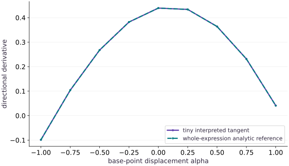

# Lowering, compilation, and a tiny transformation

Phase 14: Autodiff & JAX internals · about 130 minutes · CPU

## What you will be able to do

- Interpret literals, captured constants and variables in a supported flat jaxpr.
- Implement actual forward derivative rules without calling jax.jvp inside the interpreter.
- Reject unsupported operations and mismatched signatures explicitly.
- Compare interpreted, JAX, analytic and compiled transformed results.

## The problem

Reading a jaxpr tells you what operations exist, but implementing one small transformation makes its rules concrete. Can we propagate a value and a directional derivative through a traced program, compile that transformed computation, and clearly reject programs we do not support?

## The idea

A small interpreter makes program transformations concrete: read operations and propagate additional information through them. Keep tracing, interpretation, lowering and compilation as distinct stages so the exercise's scope stays clear.

## Locate your transformation in the compilation pipeline

Imagine an interpreter carrying a value and a directional derivative through each supported operation. Addition combines both pairs; multiplication applies the product rule. The interpreter must explicitly define behavior for every primitive it accepts.

Reject unsupported operations instead of silently passing them through with a made-up derivative. Compare the transformed result with an analytic or independently calculated direction on a small composition.

The directional-derivative curve checks the bounded interpreter example. It is separate from a general-purpose compiler or support for all JAX primitives. Identify which stage your code implements and which later stages JAX supplies.

### Pause and reason

What should a tiny interpreter do when it sees a primitive without a defined rule?

<details><summary>Compare your reasoning</summary>

Raise a clear unsupported-operation error. A plausible fallback would hide a gap in the transformation's mathematical contract.

</details>

## Treat a jaxpr as a typed data-flow program

A closed jaxpr contains input variables, captured constants, equations and output variables. Each equation reads already-defined values and writes new values. Its variable names are presentation details; the object identities and data dependencies carry meaning. We use the public extension namespace for the Literal type, and inspect the installed JAX representation rather than matching printed variable names. The executed environment is JAX 0.9.2, where the closed trace exposes .jaxpr and .consts separately. Newer documentation may describe a unified representation; inspect the installed version and rerun these contracts when upgrading.

## Attach a tangent to every value

For addition, add both primals and tangents. For multiplication, the tangent is $\dot a b+a\dot b$, not the product of the tangents. For sine, multiply the incoming tangent by the cosine of the primal. Reduction sums both values over the same axes. Literals and captured constants have zero tangent with respect to the explicit input. That last qualifier matters: making a formerly captured parameter an input changes the derivative contract.

$$
(a,\dot a)\cdot(b,\dot b)=(ab,\dot a b+a\dot b),\qquad \sin(a,\dot a)=(\sin a,\cos a\,\dot a)
$$

## A small supported subset is an enforceable boundary

The interpreter supports add, multiply, negate, sine and sum-reduction. It rejects effects, unsupported primitives, multiple-result primitives, explicit reduction placement, integer inputs and signature mismatches. It does not interpret nested jit calls, conditionals, scan, random state, complex differentiation or custom derivatives. Silent fallback to executing an unknown primitive would produce a value without a justified derivative, so the explicit exception is essential.

## Verify a complete transformed program

Our example is $F(x)=\sum_i(x_i\sin x_i+c_i)$, with captured offset $c$. Its analytic directional derivative is $\sum_i(\sin x_i+x_i\cos x_i)v_i$. The interpreter implements that derivative through local primitive rules, while the reference derives it from the whole expression. Comparing those approaches checks both the local rules and how they are composed.

## Trace, lower and compile are separate stages

make_jaxpr exposes a JAX-level program. Lowering converts a traced computation toward compiler input, and compile produces an executable specialized to the signature and target. We lower the transformed interpreter, not just the original function. The interpreter’s Python loop runs during tracing; its arithmetic becomes the program that executes later. StableHLO text is useful for inspection, but its length or equation count is not a runtime measurement.

## Specialization is part of the artifact contract

The ahead-of-time executable accepts the same array shapes and dtypes used for lowering. A changed shape requires retracing and recompilation; the compiled callable does not automatically create a new specialization. We deliberately test rejection rather than assuming shape polymorphism. Numeric input values may change within the same signature, and we test those changed values separately. Compiled artifact portability across devices or JAX versions is not established here.

## Define a deliberately small derivative interpreter

Create main.py for the first block, then append subsequent blocks in order using your course CPU environment.

```python
# Step 1 — Define a deliberately small derivative interpreter: Each environment entry stores a primal and its tangent.
# Import jax for this computation.
import jax
# Update state in place with the new values.
jax.config.update("jax_enable_x64", True)
# Import jax.numpy for this computation.
import jax.numpy as jnp
import numpy as np

from jax.extend import core

# Function `tiny_jvp(closed, primals, tangents)` implementing this stage's computation:
def tiny_jvp(closed,primals,tangents):
    """Interpret a pure flat jaxpr with floating inputs and explicit tangent rules."""
    # Compute `program` from `closed.jaxpr`
    program=closed.jaxpr
    # Guard input contract (`program.effects`) and fail fast if violated.
    if program.effects:
        raise NotImplementedError("effects are outside this interpreter")
    # Guard input contract (`len(primals) != len(program.invars) or len(tangents) != len(primals)`) and fail fast if violated.
    if len(primals)!=len(program.invars) or len(tangents)!=len(primals):
        raise ValueError("one primal and tangent per input variable required")
    # Compute `values` from `{}`
    values={}
    directions={}
    # Function `put(var, value, tangent)` implementing this stage's computation:
    def put(var,value,tangent):
        # Compute `values[var]` from `value`
        values[var]=value
        directions[var]=tangent
    # Iterate over `(var, constant)` to step through the computation:
    for var,constant in zip(program.constvars,closed.consts):
        # Allocate initialized array `` with the specified shape and dtype.
        put(var,constant,jnp.zeros_like(constant))
    # Iterate over `(var, value, tangent)` to step through the computation:
    for var,value,tangent in zip(program.invars,primals,tangents):
        # Guard input contract (`value.shape != var.aval.shape or value.dtype != var.aval.dtype`) and fail fast if violated.
        if value.shape!=var.aval.shape or value.dtype!=var.aval.dtype:
            raise ValueError("primal shape/dtype differs from traced signature")
        # Guard input contract (`tangent.shape != value.shape or tangent.dtype != value.dtype`) and fail fast if violated.
        if tangent.shape!=value.shape or tangent.dtype!=value.dtype:
            raise ValueError("tangent shape/dtype must match its primal")
        # Guard input contract (`not jnp.issubdtype(value.dtype, jnp.floating)`) and fail fast if violated.
        if not jnp.issubdtype(value.dtype,jnp.floating):
            raise ValueError("this teaching interpreter requires real floating inputs")
        # Run `put` to perform the next check or state transition.
        put(var,value,tangent)
    # Function `read(atom)` implementing this stage's computation:
    def read(atom):
        # Branch on condition `isinstance(atom, core.Literal)`:
        if isinstance(atom,core.Literal):
            return atom.val,jnp.zeros_like(atom.val)
        # Return `(values[atom], directions[atom])` to the caller.
        return values[atom],directions[atom]
    # Loop over `equation` in `program.eqns`:
    for equation in program.eqns:
        # Compute `name` from `equation.primitive.name`
        name=equation.primitive.name
        # Guard input contract (`name not in {'add', 'mul', 'neg', 'sin', 'reduce_sum'}`) and fail fast if violated.
        if name not in {"add","mul","neg","sin","reduce_sum"}:
            raise NotImplementedError("unsupported primitive: "+name)
        # Guard input contract (`len(equation.outvars) != 1`) and fail fast if violated.
        if len(equation.outvars)!=1:
            raise NotImplementedError("multiple-result primitives are outside this interpreter")
        # Compute `operands` from `[read(atom) for atom in equation.invars]`
        operands=[read(atom) for atom in equation.invars]
        # Compute `a,da` from `operands[0]`
        a,da=operands[0]
        # Branch on condition `name == 'add'`:
        if name=="add":
            b,db=operands[1]
            result,tangent=a+b,da+db
        elif name=="mul":
            b,db=operands[1]
            result,tangent=a*b,da*b+a*db
        elif name=="neg":result,tangent=-a,-da
        elif name=="sin":result,tangent=jnp.sin(a),jnp.cos(a)*da
        else:
            if equation.params.get("out_sharding") is not None:
                raise NotImplementedError("explicit reduction placement is outside this interpreter")
            axes=equation.params["axes"]
            result,tangent=jnp.sum(a,axis=axes),jnp.sum(da,axis=axes)
        # Run `put` to perform the next check or state transition.
        put(equation.outvars[0],result,tangent)
    # Compute `output` from `[read(var) for var in program.outvars]`
    output=[read(var) for var in program.outvars]
    # Return `(tuple((v for v, _ in output)), tuple((t for _, t in output)))` to the caller.
    return tuple(v for v,_ in output),tuple(t for _,t in output)
```

Each environment entry stores a primal and its tangent. Constants and literals receive zero tangents. Every supported primitive has a written derivative rule; unknown operations fail explicitly.

## Trace a program and verify the transformed result

Create main.py for the first block, then append subsequent blocks in order using your course CPU environment.

```python
# Step 2 — Trace a program and verify the transformed result: The traced closed constant contributes to the primal but not the...
# Construct `offset` via `jnp.array([0.1,0.2,0.3])`
offset=jnp.array([0.1,0.2,0.3])
# Function `program(x)` implementing this stage's computation:
def program(x):
    # Return `jnp.sum(jnp.sin(x) * x + offset)` to the caller.
    return jnp.sum(jnp.sin(x)*x+offset)
# Construct `x` via `jnp.array([-0.8,0.4,1.1])`
x=jnp.array([-0.8,0.4,1.1])
direction=jnp.array([0.3,-0.2,0.7])
# Trace or lower the function to inspect its compiler representation (`closed`).
closed=jax.make_jaxpr(program)(x)
# Run `tiny_jvp` to compute `(primal_outputs, tangent_outputs)`.
primal_outputs,tangent_outputs=tiny_jvp(closed,(x,),(direction,))
# Aggregate array values to compute `reference_value`.
reference_value=np.sum(np.sin(np.asarray(x))*np.asarray(x)+np.asarray(offset))
# Convert `reference_tangent` to a host NumPy array for inspection or verification.
reference_tangent=np.dot(np.sin(np.asarray(x))+np.asarray(x)*np.cos(np.asarray(x)),np.asarray(direction))
# Compute `np.testing.assert_allclose(primal_outputs[0],reference_value,rtol` as `1e-12)`.
np.testing.assert_allclose(primal_outputs[0],reference_value,rtol=1e-12)
# Compute `np.testing.assert_allclose(tangent_outputs[0],reference_tangent,rtol` as `1e-12)`.
np.testing.assert_allclose(tangent_outputs[0],reference_tangent,rtol=1e-12)
# Compute `np.testing.assert_allclose(tangent_outputs[0],jax.jvp(program,(x,),(direction,))[1],rtol` as `1e-12)`.
np.testing.assert_allclose(tangent_outputs[0],jax.jvp(program,(x,),(direction,))[1],rtol=1e-12)
# Print diagnostic summary of the computed outputs.
print("Supported primitives:",[e.primitive.name for e in closed.jaxpr.eqns])
# Print diagnostic summary of the computed outputs.
print("Interpreted primal and tangent:",float(primal_outputs[0]),float(tangent_outputs[0]))
```

The traced closed constant contributes to the primal but not the input derivative. The interpreter performs genuine forward derivative propagation rather than delegating to jax.jvp.

## Lower and compile the transformation itself

Create main.py for the first block, then append subsequent blocks in order using your course CPU environment.

```python
# Step 3 — Lower and compile the transformation itself: The Python interpreter runs while tracing the transformed...
transformed=lambda value,tangent:tiny_jvp(closed,(value,),(tangent,))
# Wrap with `jax.jit` (`lowered`) so XLA traces and compiles the function.
lowered=jax.jit(transformed).lower(x,direction)
# Trace or lower the function to inspect its compiler representation (`stablehlo`).
stablehlo=str(lowered.compiler_ir(dialect="stablehlo"))
# Assert invariant `len(stablehlo)>0` holds
assert len(stablehlo)>0
# Trace or lower the function to inspect its compiler representation (`compiled`).
compiled=lowered.compile()
# Run `compiled` to compute `(compiled_primal, compiled_tangent)`.
compiled_primal,compiled_tangent=compiled(x,direction)
# Compute `np.testing.assert_allclose(compiled_primal[0],reference_value,rtol` as `1e-12)`.
np.testing.assert_allclose(compiled_primal[0],reference_value,rtol=1e-12)
# Compute `np.testing.assert_allclose(compiled_tangent[0],reference_tangent,rtol` as `1e-12)`.
np.testing.assert_allclose(compiled_tangent[0],reference_tangent,rtol=1e-12)
# Compute `shape_rejected` as `False`.
shape_rejected=False
# Run the boundary check and catch the expected exception:
try:
    compiled(jnp.ones(4),jnp.ones(4))
except TypeError:
    shape_rejected=True
# Assert invariant `shape_rejected` holds
assert shape_rejected
# Print diagnostic summary of the computed outputs.
print("Lowered IR characters:",len(stablehlo))
# Print diagnostic summary of the computed outputs.
print("Compiled transformed outputs match; changed shape explicitly rejected")
```

The Python interpreter runs while tracing the transformed function; its JAX arithmetic becomes a new compiled program. The ahead-of-time executable is specialized to the recorded input signature.

## Run the example

```python
# Step 1 — Define a deliberately small derivative interpreter: Each environment entry stores a primal and its tangent.
# Import jax for this computation.
import jax
# Update state in place with the new values.
jax.config.update("jax_enable_x64", True)
# Import jax.numpy for this computation.
import jax.numpy as jnp
import numpy as np

from jax.extend import core

# Function `tiny_jvp(closed, primals, tangents)` implementing this stage's computation:
def tiny_jvp(closed,primals,tangents):
    """Interpret a pure flat jaxpr with floating inputs and explicit tangent rules."""
    # Compute `program` from `closed.jaxpr`
    program=closed.jaxpr
    # Guard input contract (`program.effects`) and fail fast if violated.
    if program.effects:
        raise NotImplementedError("effects are outside this interpreter")
    # Guard input contract (`len(primals) != len(program.invars) or len(tangents) != len(primals)`) and fail fast if violated.
    if len(primals)!=len(program.invars) or len(tangents)!=len(primals):
        raise ValueError("one primal and tangent per input variable required")
    # Compute `values` from `{}`
    values={}
    directions={}
    # Function `put(var, value, tangent)` implementing this stage's computation:
    def put(var,value,tangent):
        # Compute `values[var]` from `value`
        values[var]=value
        directions[var]=tangent
    # Iterate over `(var, constant)` to step through the computation:
    for var,constant in zip(program.constvars,closed.consts):
        # Allocate initialized array `` with the specified shape and dtype.
        put(var,constant,jnp.zeros_like(constant))
    # Iterate over `(var, value, tangent)` to step through the computation:
    for var,value,tangent in zip(program.invars,primals,tangents):
        # Guard input contract (`value.shape != var.aval.shape or value.dtype != var.aval.dtype`) and fail fast if violated.
        if value.shape!=var.aval.shape or value.dtype!=var.aval.dtype:
            raise ValueError("primal shape/dtype differs from traced signature")
        # Guard input contract (`tangent.shape != value.shape or tangent.dtype != value.dtype`) and fail fast if violated.
        if tangent.shape!=value.shape or tangent.dtype!=value.dtype:
            raise ValueError("tangent shape/dtype must match its primal")
        # Guard input contract (`not jnp.issubdtype(value.dtype, jnp.floating)`) and fail fast if violated.
        if not jnp.issubdtype(value.dtype,jnp.floating):
            raise ValueError("this teaching interpreter requires real floating inputs")
        # Run `put` to perform the next check or state transition.
        put(var,value,tangent)
    # Function `read(atom)` implementing this stage's computation:
    def read(atom):
        # Branch on condition `isinstance(atom, core.Literal)`:
        if isinstance(atom,core.Literal):
            return atom.val,jnp.zeros_like(atom.val)
        # Return `(values[atom], directions[atom])` to the caller.
        return values[atom],directions[atom]
    # Loop over `equation` in `program.eqns`:
    for equation in program.eqns:
        # Compute `name` from `equation.primitive.name`
        name=equation.primitive.name
        # Guard input contract (`name not in {'add', 'mul', 'neg', 'sin', 'reduce_sum'}`) and fail fast if violated.
        if name not in {"add","mul","neg","sin","reduce_sum"}:
            raise NotImplementedError("unsupported primitive: "+name)
        # Guard input contract (`len(equation.outvars) != 1`) and fail fast if violated.
        if len(equation.outvars)!=1:
            raise NotImplementedError("multiple-result primitives are outside this interpreter")
        # Compute `operands` from `[read(atom) for atom in equation.invars]`
        operands=[read(atom) for atom in equation.invars]
        # Compute `a,da` from `operands[0]`
        a,da=operands[0]
        # Branch on condition `name == 'add'`:
        if name=="add":
            b,db=operands[1]
            result,tangent=a+b,da+db
        elif name=="mul":
            b,db=operands[1]
            result,tangent=a*b,da*b+a*db
        elif name=="neg":result,tangent=-a,-da
        elif name=="sin":result,tangent=jnp.sin(a),jnp.cos(a)*da
        else:
            if equation.params.get("out_sharding") is not None:
                raise NotImplementedError("explicit reduction placement is outside this interpreter")
            axes=equation.params["axes"]
            result,tangent=jnp.sum(a,axis=axes),jnp.sum(da,axis=axes)
        # Run `put` to perform the next check or state transition.
        put(equation.outvars[0],result,tangent)
    # Compute `output` from `[read(var) for var in program.outvars]`
    output=[read(var) for var in program.outvars]
    # Return `(tuple((v for v, _ in output)), tuple((t for _, t in output)))` to the caller.
    return tuple(v for v,_ in output),tuple(t for _,t in output)

# Step 2 — Trace a program and verify the transformed result: The traced closed constant contributes to the primal but not the...
# Construct `offset` via `jnp.array([0.1,0.2,0.3])`
offset=jnp.array([0.1,0.2,0.3])
# Function `program(x)` implementing this stage's computation:
def program(x):
    # Return `jnp.sum(jnp.sin(x) * x + offset)` to the caller.
    return jnp.sum(jnp.sin(x)*x+offset)
# Construct `x` via `jnp.array([-0.8,0.4,1.1])`
x=jnp.array([-0.8,0.4,1.1])
direction=jnp.array([0.3,-0.2,0.7])
# Trace or lower the function to inspect its compiler representation (`closed`).
closed=jax.make_jaxpr(program)(x)
# Run `tiny_jvp` to compute `(primal_outputs, tangent_outputs)`.
primal_outputs,tangent_outputs=tiny_jvp(closed,(x,),(direction,))
# Aggregate array values to compute `reference_value`.
reference_value=np.sum(np.sin(np.asarray(x))*np.asarray(x)+np.asarray(offset))
# Convert `reference_tangent` to a host NumPy array for inspection or verification.
reference_tangent=np.dot(np.sin(np.asarray(x))+np.asarray(x)*np.cos(np.asarray(x)),np.asarray(direction))
# Compute `np.testing.assert_allclose(primal_outputs[0],reference_value,rtol` as `1e-12)`.
np.testing.assert_allclose(primal_outputs[0],reference_value,rtol=1e-12)
# Compute `np.testing.assert_allclose(tangent_outputs[0],reference_tangent,rtol` as `1e-12)`.
np.testing.assert_allclose(tangent_outputs[0],reference_tangent,rtol=1e-12)
# Compute `np.testing.assert_allclose(tangent_outputs[0],jax.jvp(program,(x,),(direction,))[1],rtol` as `1e-12)`.
np.testing.assert_allclose(tangent_outputs[0],jax.jvp(program,(x,),(direction,))[1],rtol=1e-12)
# Print diagnostic summary of the computed outputs.
print("Supported primitives:",[e.primitive.name for e in closed.jaxpr.eqns])
# Print diagnostic summary of the computed outputs.
print("Interpreted primal and tangent:",float(primal_outputs[0]),float(tangent_outputs[0]))

# Step 3 — Lower and compile the transformation itself: The Python interpreter runs while tracing the transformed...
transformed=lambda value,tangent:tiny_jvp(closed,(value,),(tangent,))
# Wrap with `jax.jit` (`lowered`) so XLA traces and compiles the function.
lowered=jax.jit(transformed).lower(x,direction)
# Trace or lower the function to inspect its compiler representation (`stablehlo`).
stablehlo=str(lowered.compiler_ir(dialect="stablehlo"))
# Assert invariant `len(stablehlo)>0` holds
assert len(stablehlo)>0
# Trace or lower the function to inspect its compiler representation (`compiled`).
compiled=lowered.compile()
# Run `compiled` to compute `(compiled_primal, compiled_tangent)`.
compiled_primal,compiled_tangent=compiled(x,direction)
# Compute `np.testing.assert_allclose(compiled_primal[0],reference_value,rtol` as `1e-12)`.
np.testing.assert_allclose(compiled_primal[0],reference_value,rtol=1e-12)
# Compute `np.testing.assert_allclose(compiled_tangent[0],reference_tangent,rtol` as `1e-12)`.
np.testing.assert_allclose(compiled_tangent[0],reference_tangent,rtol=1e-12)
# Compute `shape_rejected` as `False`.
shape_rejected=False
# Run the boundary check and catch the expected exception:
try:
    compiled(jnp.ones(4),jnp.ones(4))
except TypeError:
    shape_rejected=True
# Assert invariant `shape_rejected` holds
assert shape_rejected
# Print diagnostic summary of the computed outputs.
print("Lowered IR characters:",len(stablehlo))
# Print diagnostic summary of the computed outputs.
print("Compiled transformed outputs match; changed shape explicitly rejected")
```

Expected: The program contains sin, mul, add and reduce_sum. Interpreted and compiled primal/tangent values match analytic and JAX references; a changed compiled shape is rejected.

## A composed interpreter tracks the analytic directional derivative

**Predict:** As the base point moves along a line, should its directional derivative remain constant?



**Recorded CPU computation**

### Read the figure

The horizontal axis is a scalar displacement $\alpha$ of the base point $x+\alpha v$. The vertical axis is the directional derivative of the scalar program along the fixed direction $v$. Each point comes from a new evaluation of the same supported trace at a shape-compatible input.

The interpreter and analytic curves overlap. Their derivative is about $-0.09853$ at $\alpha=-1$, rises to a sampled peak of about $0.43913$ at the original point $\alpha=0$, then falls to about $0.04102$ at $\alpha=1$. The sign change and nonmonotone shape reflect a changing Jacobian, not disagreement between the two methods.

### Connect it to the computation

The interpreter obtains each value by composing local tangent rules; the reference directly evaluates $\sum_i(\sin z_i+z_i\cos z_i)v_i$ at $z=x+\alpha v$. The code also checks the middle point against JAX’s JVP and checks the lowered, compiled transformed program.

Agreement applies to this primitive subset and tested inputs. It does not validate an unsupported operation, nested control flow, compiler performance or device portability. Those require new rules and new evidence rather than extrapolation from this plot.

```python
# Compute figure data for: A composed interpreter tracks the analytic directional derivative
# Generate a uniform grid of points in `alphas`.
alphas=np.linspace(-1,1,9)
# Compute `interpreted` from `[]`
interpreted=[]
analytic=[]
# Loop over `alpha` in `alphas`:
for alpha in alphas:
    # Compute `point` from `x+alpha*direction`
    point=x+alpha*direction
    # Append the current step result to `interpreted`.
    interpreted.append(float(tiny_jvp(closed,(point,),(direction,))[1][0]))
    # Convert `host` to a host NumPy array for inspection or verification.
    host=np.asarray(point)
    # Convert `` to a host NumPy array for inspection or verification.
    analytic.append(float(np.dot(np.sin(host)+host*np.cos(host),np.asarray(direction))))
# Compute `visual_data` from `{'kind':'line','x':alphas.tolist(),'xlabel':'base-po...`
visual_data={'kind':'line','x':alphas.tolist(),'xlabel':'base-point displacement alpha','ylabel':'directional derivative','series':[{'label':'tiny interpreted tangent','y':interpreted},{'label':'whole-expression analytic reference','y':analytic}]}
```

## Recorded reference execution

CPU run: 2026-10-08T14:05:51.428412+00:00. JAX 0.9.2.

```text
Supported primitives: ['sin', 'mul', 'add', 'reduce_sum']
Interpreted primal and tangent: 2.3099803057106576 0.4391291800455618
Lowered IR characters: 1421
Compiled transformed outputs match; changed shape explicitly rejected
Supported primitives: ['sin', 'mul', 'add', 'reduce_sum']
Interpreted primal and tangent: 2.3099803057106576 0.4391291800455618
Lowered IR characters: 1421
Compiled transformed outputs match; changed shape explicitly rejected
Expected unsupported primitive: unsupported primitive: exp
Changed-value compiled tangent: 0.5640324983393596
Changed polynomial transformed and compiled
Explicit offset tangent contribution: -0.09999999999999998
Multiple output contract and malformed tangent rejection verified
PASS: internals-04

```

## Exercise an unsupported primitive

**Predict before running:** If a new function uses exp, should the interpreter guess a derivative or stop?

```python
# Experiment — Exercise an unsupported primitive: A numerical result without a supported tangent rule would...
# Trace or lower the function to inspect its compiler representation (`unsupported`).
unsupported=jax.make_jaxpr(lambda z:jnp.sum(jnp.exp(z)))(x)
# Compute `rejected` as `False`.
rejected=False
# Run the boundary check and catch the expected exception:
try:
    tiny_jvp(unsupported,(x,),(direction,))
except NotImplementedError as error:
    rejected=True
    assert "exp" in str(error)
    print("Expected unsupported primitive:",error)
# Assert invariant `rejected` holds
assert rejected
```

**Expected:** An explicit unsupported primitive: exp error is raised.

A numerical result without a supported tangent rule would falsely advertise derivative coverage. Add and verify a rule before accepting the new program.

## Change values while preserving the compiled signature

**Predict before running:** Can an executable specialized to three float64 values accept different values of that same shape?

```python
# Experiment — Change values while preserving the compiled signature: Specialization constrains abstract shape/dtype contracts.
# Construct `changed` via `x+jnp.array([0.1,-0.4,0.2])`
changed=x+jnp.array([0.1,-0.4,0.2])
# Run `compiled` to compute `(cp, ct)`.
cp,ct=compiled(changed,direction)
# Aggregate array values to compute `expected`.
expected=np.sum(np.sin(np.asarray(changed))*np.asarray(changed)+np.asarray(offset))
# Convert `expected_d` to a host NumPy array for inspection or verification.
expected_d=np.dot(np.sin(np.asarray(changed))+np.asarray(changed)*np.cos(np.asarray(changed)),np.asarray(direction))
# Compute `np.testing.assert_allclose(cp[0],expected,rtol` as `1e-12)`.
np.testing.assert_allclose(cp[0],expected,rtol=1e-12)
# Compute `np.testing.assert_allclose(ct[0],expected_d,rtol` as `1e-12)`.
np.testing.assert_allclose(ct[0],expected_d,rtol=1e-12)
# Print the observed values to compare against the expected result.
print("Changed-value compiled tangent:",float(ct[0]))
```

**Expected:** Both compiled outputs agree on a new point without changing the signature.

Specialization constrains abstract shape/dtype contracts. It does not mean every input number is frozen into the program; captured constants are a separate matter.

## Make it yours

Trace a new polynomial using only supported primitives, verify its interpreted derivative at two points, and compile that transformed computation independently.

### How to write this exercise — Step-by-step recipe & starter scaffold

**Key functions & syntax to use:**
- `x.sum(axis=...) / x.mean(axis=..., keepdims=...)` — Reduces values along the named `axis` (the axis you name is collapsed unless `keepdims=True`).
- `jnp.allclose(actual, expected, rtol=..., atol=...)` — Checks that two arrays match elementwise within floating-point tolerance.
- `jax.jit(fn) / @jax.jit` — Traces `fn` with abstract shapes and compiles a fused XLA executable cached by input shape and dtype.

**Step-by-step implementation plan:**
1. Return `jnp.sum(z * z + -2.0 * z)` to the caller.
2. Trace or lower the function to inspect its compiler representation (`poly_closed`).
3. Wrap with `jax.jit` (`poly_transform`) so XLA traces and compiles the function.
4. Iterate over `point` to step through the computation:
5. Run `poly_transform` to compute `(pv, pt)`.

**Starter code scaffold (fill in the TODOs):**

```python
# Exercise solution: Trace a new polynomial using only supported primitives, verify its...
def polynomial(z):
    # Return `jnp.sum(z * z + -2.0 * z)` to the caller.
    return ...  # TODO: return computed result
# Trace or lower the function to inspect its compiler representation (`poly_closed`).
poly_closed = jax.make_jaxpr(...)  # TODO: compute poly_closed
# Wrap with `jax.jit` (`poly_transform`) so XLA traces and compiles the function.
poly_transform = jax.jit(...)  # TODO: compute poly_transform
# Iterate over `point` to step through the computation:
for point in (x,x+0.6):
    # Run `poly_transform` to compute `(pv, pt)`.
    pv,pt = poly_transform(...)  # TODO: compute pv,pt
    # Convert `` to a host NumPy array for inspection or verification.
    np.testing.assert_allclose(pv[0],np.sum(np.asarray(point)**2-2*np.asarray(point)),rtol=1e-12)
    # Convert `` to a host NumPy array for inspection or verification.
    np.testing.assert_allclose(pt[0],np.dot(2*np.asarray(point)-2,np.asarray(direction)),rtol=1e-12)
# Print the observed values to compare against the expected result.
print("Changed polynomial transformed and compiled")
```

<details><summary>Reference solution</summary>

```python
# Exercise solution: Trace a new polynomial using only supported primitives, verify its...
def polynomial(z):
    # Return `jnp.sum(z * z + -2.0 * z)` to the caller.
    return jnp.sum(z*z+(-2.0)*z)
# Trace or lower the function to inspect its compiler representation (`poly_closed`).
poly_closed=jax.make_jaxpr(polynomial)(x)
# Wrap with `jax.jit` (`poly_transform`) so XLA traces and compiles the function.
poly_transform=jax.jit(lambda point,seed:tiny_jvp(poly_closed,(point,),(seed,)))
# Iterate over `point` to step through the computation:
for point in (x,x+0.6):
    # Run `poly_transform` to compute `(pv, pt)`.
    pv,pt=poly_transform(point,direction)
    # Convert `` to a host NumPy array for inspection or verification.
    np.testing.assert_allclose(pv[0],np.sum(np.asarray(point)**2-2*np.asarray(point)),rtol=1e-12)
    # Convert `` to a host NumPy array for inspection or verification.
    np.testing.assert_allclose(pt[0],np.dot(2*np.asarray(point)-2,np.asarray(direction)),rtol=1e-12)
# Print the observed values to compare against the expected result.
print("Changed polynomial transformed and compiled")
```

</details>

## Make a constant into a differentiable input

**Practice**

Replace the captured offset by an explicit argument, seed that argument with a nonzero direction, and verify its contribution to the total tangent.

<details><summary>Hint</summary>

The new program has two input variables and needs two tangent arguments.

</details>

### How to write: Make a constant into a differentiable input — Step-by-step recipe & starter scaffold

**Key functions & syntax to use:**
- `jnp.array(values, dtype=...)` — Constructs an immutable device-backed JAX array from Python/NumPy values.
- `x.sum(axis=...) / x.mean(axis=..., keepdims=...)` — Reduces values along the named `axis` (the axis you name is collapsed unless `keepdims=True`).
- `jnp.allclose(actual, expected, rtol=..., atol=...)` — Checks that two arrays match elementwise within floating-point tolerance.

**Step-by-step implementation plan:**
1. Return `jnp.sum(jnp.sin(z) * z + c)` to the caller.
2. Trace or lower the function to inspect its compiler representation (`explicit_closed`).
3. Construct `constant_direction` via `jnp.array([.2,.1,-.4])`
4. Run `tiny_jvp` to compute `(ev, et)`.
5. Convert `` to a host NumPy array for inspection or verification.

**Starter code scaffold (fill in the TODOs):**

```python
# Make a constant into a differentiable input (Practice): Zero tangent belonged to a captured constant relative to the...
def explicit(z,c):
    # Return `jnp.sum(jnp.sin(z) * z + c)` to the caller.
    return ...  # TODO: return computed result
# Trace or lower the function to inspect its compiler representation (`explicit_closed`).
explicit_closed = jax.make_jaxpr(...)  # TODO: compute explicit_closed
# Construct `constant_direction` via `jnp.array([.2,.1,-.4])`
constant_direction = jnp.array(...)  # TODO: compute constant_direction
# Run `tiny_jvp` to compute `(ev, et)`.
ev,et = tiny_jvp(...)  # TODO: compute ev,et
# Convert `` to a host NumPy array for inspection or verification.
np.testing.assert_allclose(et[0],reference_tangent+np.sum(np.asarray(constant_direction)),rtol=1e-12)
# Print the observed values to compare against the expected result.
print("Explicit offset tangent contribution:",float(jnp.sum(constant_direction)))
```

<details><summary>Reference solution and reasoning</summary>

```python
# Make a constant into a differentiable input (Practice): Zero tangent belonged to a captured constant relative to the...
def explicit(z,c):
    # Return `jnp.sum(jnp.sin(z) * z + c)` to the caller.
    return jnp.sum(jnp.sin(z)*z+c)
# Trace or lower the function to inspect its compiler representation (`explicit_closed`).
explicit_closed=jax.make_jaxpr(explicit)(x,offset)
# Construct `constant_direction` via `jnp.array([.2,.1,-.4])`
constant_direction=jnp.array([.2,.1,-.4])
# Run `tiny_jvp` to compute `(ev, et)`.
ev,et=tiny_jvp(explicit_closed,(x,offset),(direction,constant_direction))
# Convert `` to a host NumPy array for inspection or verification.
np.testing.assert_allclose(et[0],reference_tangent+np.sum(np.asarray(constant_direction)),rtol=1e-12)
# Print the observed values to compare against the expected result.
print("Explicit offset tangent contribution:",float(jnp.sum(constant_direction)))
```

Zero tangent belonged to a captured constant relative to the old input signature. An explicit input is allowed to vary, so its seed must propagate.

</details>

## Verify multiple outputs and negation

**Challenge**

Trace a supported function returning both a scalar sum and a negated vector. Check the tuple of primal/tangent outputs and reject a mismatched tangent shape.

<details><summary>Hint</summary>

Multiple program outputs are supported even though each supported primitive returns one result.

</details>

### How to write: Verify multiple outputs and negation — Step-by-step recipe & starter scaffold

**Key functions & syntax to use:**
- `jnp.zeros / jnp.ones(shape, dtype=...)` — Allocates a tensor of the given `shape` initialized with constants.
- `x.sum(axis=...) / x.mean(axis=..., keepdims=...)` — Reduces values along the named `axis` (the axis you name is collapsed unless `keepdims=True`).
- `jnp.allclose(actual, expected, rtol=..., atol=...)` — Checks that two arrays match elementwise within floating-point tolerance.

**Step-by-step implementation plan:**
1. Aggregate array values to compute `multi`.
2. Trace or lower the function to inspect its compiler representation (`multi_closed`).
3. Run `tiny_jvp` to compute `(mp, mt)`.
4. Convert `` to a host NumPy array for inspection or verification.
5. Convert `` to a host NumPy array for inspection or verification.

**Starter code scaffold (fill in the TODOs):**

```python
# Verify multiple outputs and negation (Challenge): Output structure and primitive result structure are distinct.
# Aggregate array values to compute `multi`.
multi = ...  # TODO: compute multi
# Trace or lower the function to inspect its compiler representation (`multi_closed`).
multi_closed = jax.make_jaxpr(...)  # TODO: compute multi_closed
# Run `tiny_jvp` to compute `(mp, mt)`.
mp,mt = tiny_jvp(...)  # TODO: compute mp,mt
# Convert `` to a host NumPy array for inspection or verification.
np.testing.assert_allclose(mp[0],np.sum(np.asarray(x)**2),rtol=1e-12)
# Convert `` to a host NumPy array for inspection or verification.
np.testing.assert_allclose(mp[1],-np.asarray(x),rtol=1e-12)
# Convert `` to a host NumPy array for inspection or verification.
np.testing.assert_allclose(mt[0],2*np.dot(np.asarray(x),np.asarray(direction)),rtol=1e-12)
# Convert `` to a host NumPy array for inspection or verification.
np.testing.assert_allclose(mt[1],-np.asarray(direction),rtol=1e-12)
# Compute `rejected` as `False`.
rejected = ...  # TODO: compute rejected
# Run the boundary check and catch the expected exception:
try:tiny_jvp(multi_closed,(x,),(jnp.ones(2),))
except ValueError:rejected=True
# Assert invariant `rejected` holds
assert rejected  # TODO: complete assertion check
# Print the observed values to compare against the expected result.
print("Multiple output contract and malformed tangent rejection verified")
```

<details><summary>Reference solution and reasoning</summary>

```python
# Verify multiple outputs and negation (Challenge): Output structure and primitive result structure are distinct.
# Aggregate array values to compute `multi`.
multi=lambda z:(jnp.sum(z*z),-z)
# Trace or lower the function to inspect its compiler representation (`multi_closed`).
multi_closed=jax.make_jaxpr(multi)(x)
# Run `tiny_jvp` to compute `(mp, mt)`.
mp,mt=tiny_jvp(multi_closed,(x,),(direction,))
# Convert `` to a host NumPy array for inspection or verification.
np.testing.assert_allclose(mp[0],np.sum(np.asarray(x)**2),rtol=1e-12)
# Convert `` to a host NumPy array for inspection or verification.
np.testing.assert_allclose(mp[1],-np.asarray(x),rtol=1e-12)
# Convert `` to a host NumPy array for inspection or verification.
np.testing.assert_allclose(mt[0],2*np.dot(np.asarray(x),np.asarray(direction)),rtol=1e-12)
# Convert `` to a host NumPy array for inspection or verification.
np.testing.assert_allclose(mt[1],-np.asarray(direction),rtol=1e-12)
# Compute `rejected` as `False`.
rejected=False
# Run the boundary check and catch the expected exception:
try:tiny_jvp(multi_closed,(x,),(jnp.ones(2),))
except ValueError:rejected=True
# Assert invariant `rejected` holds
assert rejected
# Print the observed values to compare against the expected result.
print("Multiple output contract and malformed tangent rejection verified")
```

Output structure and primitive result structure are distinct. The interpreter returns a flat tuple matching the jaxpr outputs, not an arbitrary original Python pytree.

</details>

## Check your understanding

Why does the tiny interpreter raise an error for an unsupported primitive instead of calling that primitive directly?

1. Every unsupported primitive is mathematically nondifferentiable.
2. Executing a primal without a verified tangent rule would silently break the derivative contract.
3. Compiled JAX cannot run exponentials.

<details><summary>Answer and explanation</summary>

Executing a primal without a verified tangent rule would silently break the derivative contract.

The missing piece is this interpreter’s derivative rule and semantics, not necessarily JAX support or mathematical differentiability. Explicit rejection keeps the supported contract honest.

</details>

## Diagnose the result

If primals match but tangents fail, audit multiplication’s two terms and zero tangents for constants. If an unknown primitive appears, stop and inspect its semantics instead of bypassing the error. If compilation rejects a changed shape, rebuild the trace and executable for that signature. Do not infer speed or optimization quality from IR text length.

## Carry forward

- Treat a jaxpr as a typed data-flow program
- Attach a tangent to every value
- A small supported subset is an enforceable boundary
- Verify a complete transformed program
- Trace, lower and compile are separate stages
- Specialization is part of the artifact contract

## Keep your evidence

Annotated primitive rules, constant/literal handling, independent expression oracles, changed compiled values and explicit unsupported/signature errors. Keep the environment, observed outputs and your explanation of the figure.

Save your predictions, modified code, terminal outputs, and reasoning in your engineering portfolio.

## Primary references

- [JAX automatic differentiation cookbook](https://docs.jax.dev/en/latest/notebooks/autodiff_cookbook.html)
- [Custom JVP and VJP rules](https://docs.jax.dev/en/latest/notebooks/Custom_derivative_rules_for_Python_code.html)
- [Ahead-of-time lowering and compilation](https://docs.jax.dev/en/latest/aot.html)
- [The jaxpr language](https://docs.jax.dev/en/latest/601/jaxpr.html)

