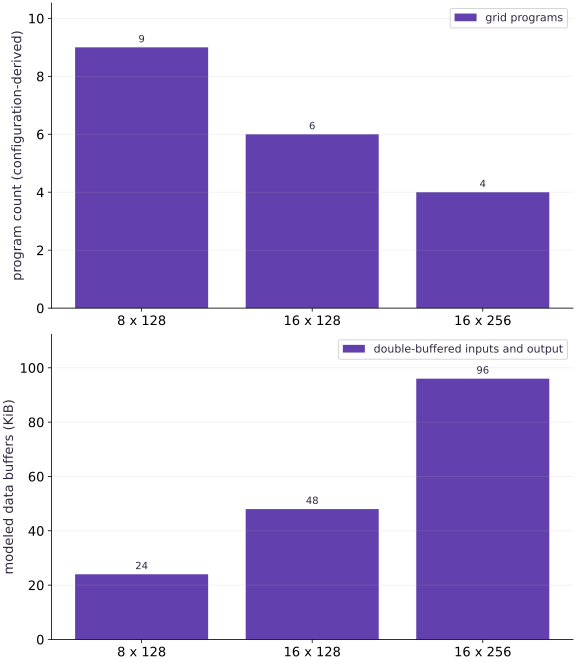

# Tiling, memory, and pipelining

Phase 13: Pallas kernels · about 120 minutes · CPU

## What you will be able to do

- Execute actual emit_pipeline semantics under explicit CPU TPU-layout simulation.
- Compare synchronous and buffered schedules against an independent oracle.
- Explain tile count, padding and modeled local-buffer footprint separately.
- Distinguish correctness of scheduling from measured transfer/compute overlap.

## The problem

A larger tile reduces the number of kernel invocations, but it also consumes more local memory and may compute more padded values. Can we make those tradeoffs concrete and execute a real buffered pipeline without claiming that CPU simulation measures TPU overlap?

## The idea

Pipelining overlaps stages such as loading, computing and storing by giving work separate buffers and a valid schedule. The key question is when each buffer becomes safe to reuse, not merely how many buffers exist.

## A buffer cannot be reused while a consumer still needs it

Draw time across the page and a separate lane for load, compute and store. Label buffers by identity and mark the last use of each version. Loading new data too early can overwrite values still needed by computation.

Larger tiles may reduce program count while increasing local storage and per-program work. The lesson's bars expose those modeled tradeoffs. Fewer programs alone is not proof of lower runtime.

Keep illustrative overlap separate from measured overlap. The CPU interpretation and race checks validate bounded aspects of the schedule; a device trace and completed measurements are needed to claim TPU performance. Buffer-count changes should be checked against both correctness and the actual target constraints.

### Pause and reason

Why is double buffering not automatically faster?

<details><summary>Compare your reasoning</summary>

It requires useful overlap and enough resources without creating another bottleneck. Correct buffer lifetimes establish validity; measured target behavior establishes any performance benefit.

</details>

## Keep one numerical operation while changing data movement

The arithmetic body remains unchanged from the first lesson. The outer kernel receives entire buffers in a global-memory space, and the inner pipeline sees block-local references. This separation lets us change the movement schedule without changing the mathematical result. If a new schedule changes values, it is a correctness regression rather than a performance tradeoff.

## What buffering is trying to overlap

A pipeline can start bringing the next tile into a different buffer while the current tile is being processed. Reusing a buffer too early risks overwriting data still being read; consuming it before its transfer completes risks stale or uninitialized data. The emitter manages copies and waits. We compare two versus three input slots while keeping two output slots: installed JAX 0.9.2 rejects output buffer counts above two. A third input slot consumes more local memory and may or may not hide additional latency.

## Use the appropriate interpreter for memory operations

Ordinary interpret=True is enough for the first lesson’s arithmetic grid, but does not supply all TPU layout information required by this installed pipeline API. Here pltpu.InterpretParams simulates memory spaces and synchronization; an AbstractMesh specifies a simulated TPU v5 lite layout. The actual backend remains CPU. This is JAX 0.9.2 API usage, and its signature should be rechecked when upgrading. The simulated device label must never appear as the actual device in a performance receipt.

## Use synchronous execution as a debugging comparison

no_pipelining=True requests synchronous copies through the same pipeline. Agreement with the buffered result helps isolate scheduling errors while preserving arithmetic and windows. The interpreter enables race detection, but passing these cases does not prove every target interleaving, layout or compiler path. If a TPU interpretation exception occurs, the documented interpreter state-reset procedure is required before reusing that mode in the same process; fresh-process checks avoid carrying failed state into later evidence.

## Count the cost of a tile choice

For a logical $(17,257)$ matrix, blocks $(8,128)$, $(16,128)$ and $(16,256)$ use $9$, $6$ and $4$ programs. Their padded work grows from $9216$ to $12288$ to $16384$ elements. The corresponding modeled double-buffered data storage grows from $24$ to $48$ to $96$ KiB for two inputs and one output in float32. Fewer programs therefore does not automatically mean less work or lower memory use.

$$
B_{\mathrm{model}}=(2n_{\mathrm{input\ buffers}}+2)\,B_mB_n\,\mathrm{bytes\ per\ element}
$$

## Only target measurements can rank pipeline speed

CPU simulation may execute callbacks, bookkeeping and race tracking that have no relation to TPU throughput. Do not time it and call the result a kernel benchmark. The project’s target runner can execute the actual synchronous or buffered TPU branch without fallback; its correctness checks and synchronized baseline comparison must pass before interpreting latency. No such target performance receipt is available here.

## Reuse the checked arithmetic and add a real pipeline

Create main.py for the first block, then append each block in order in your course CPU environment.

```python
# Step 1 — Reuse the checked arithmetic and add a real pipeline: The outer kernel receives global-memory references and emits an...
# Import jax for this computation.
import jax
import jax.numpy as jnp
import numpy as np
from jax.experimental import pallas as pl
from jax.experimental.pallas import tpu as pltpu

# Function `validate_pair(x, y, block)` implementing this stage's computation:
def validate_pair(x,y,block):
    # Guard input contract (`x.ndim != 2 or x.shape != y.shape or min(x.shape) < 1`) and fail fast if violated.
    if x.ndim!=2 or x.shape!=y.shape or min(x.shape)<1:
        raise ValueError("inputs must be nonempty matrices with identical shapes")
    # Guard input contract (`x.dtype != y.dtype or x.dtype not in (jnp.float32, jnp.bfloat16)`) and fail fast if violated.
    if x.dtype!=y.dtype or x.dtype not in (jnp.float32,jnp.bfloat16):
        raise ValueError("matching float32 or bfloat16 inputs required")
    # Guard input contract (`len(block) != 2 or any((not isinstance(n, int) or n < 1 for n in block))`) and fail fast if violated.
    if len(block)!=2 or any(not isinstance(n,int) or n<1 for n in block):
        raise ValueError("two positive integer block dimensions required")

# Function `pad_pair(x, y, block)` implementing this stage's computation:
def pad_pair(x,y,block):
    # Run `validate_pair` to perform the next check or state transition.
    validate_pair(x,y,block)
    # Evaluate `(m, n)` from the current inputs and state.
    # Compute `m,n` from `x.shape`
    m,n=x.shape
    bm,bn=block
    # Compute `padded` from `((m+bm-1)//bm*bm,(n+bn-1)//bn*bn)`
    padded=((m+bm-1)//bm*bm,(n+bn-1)//bn*bn)
    # Combine or mask array elements to form `pads`.
    pads=((0,padded[0]-m),(0,padded[1]-n))
    # Return `(jnp.pad(x, pads), jnp.pad(y, pads), padded)` to the caller.
    return jnp.pad(x,pads),jnp.pad(y,pads),padded

# Function `axpy_body(x_ref, y_ref, out_ref)` implementing this stage's computation:
def axpy_body(x_ref,y_ref,out_ref):
    # Cast or evaluate `result` in explicit floating-point precision.
    result=2.0*x_ref[...].astype(jnp.float32)+y_ref[...].astype(jnp.float32)
    # Run `result.astype` to compute `out_ref[...]`.
    out_ref[...]=result.astype(out_ref.dtype)

# Function `blocked_axpy(x, y, block)` implementing this stage's computation:
def blocked_axpy(x,y,block=(2,4)):
    # Combine or mask array elements to form `(px, py, padded)`.
    px,py,padded=pad_pair(x,y,block)
    # Compute `bm,bn` from `block`
    bm,bn=block
    # Invoke custom Pallas kernel or tile specification (`spec`).
    spec=pl.BlockSpec(block,lambda i,j:(i,j))
    # Combine or mask array elements to form `out`.
    out=pl.pallas_call(axpy_body,
        out_shape=jax.ShapeDtypeStruct(padded,x.dtype),
        grid=(padded[0]//bm,padded[1]//bn),
        in_specs=(spec,spec),out_specs=spec,interpret=True)(px,py)
    # Return `out[:x.shape[0], :x.shape[1]]` to the caller.
    return out[:x.shape[0],:x.shape[1]]

# Function `pipelined_axpy(x, y, block, buffers, ...)` implementing this stage's computation:
def pipelined_axpy(x,y,block=(8,128),buffers=2,no_pipelining=False,mode="simulate"):
    # Combine or mask array elements to form `(px, py, padded)`.
    px,py,padded=pad_pair(x,y,block)
    # Compute `bm,bn` from `block`
    bm,bn=block
    # Guard input contract (`bm % 8 or bn % 128`) and fail fast if violated.
    if bm%8 or bn%128:
        raise ValueError("pipeline blocks must be multiples of (8,128)")
    # Guard input contract (`buffers not in (2, 3)`) and fail fast if violated.
    if buffers not in (2,3):
        raise ValueError("this lab supports two or three buffers")
    # Guard input contract (`mode not in ('simulate', 'tpu')`) and fail fast if violated.
    if mode not in ("simulate","tpu"):
        raise ValueError("mode must explicitly be simulate or tpu")
    # Guard input contract (`mode == 'tpu' and (jax.default_backend() != 'tpu' or any((not isinstance(a, jax.core.Tracer) and any((d.platform != 'tpu' for d in a.devices())) for a in (x, y))))`) and fail fast if violated.
    if mode=="tpu" and (jax.default_backend()!="tpu" or any(not isinstance(a,jax.core.Tracer) and any(d.platform!="tpu" for d in a.devices()) for a in (x,y))):
        raise RuntimeError("Real TPU inputs/backend required; simulation fallback is disabled")
    # Invoke custom Pallas kernel or tile specification (`spec`).
    spec=pl.BlockSpec(block,lambda i,j:(i,j),pipeline_mode=pl.Buffered(buffer_count=buffers))
    # Invoke custom Pallas kernel or tile specification (`output_spec`).
    output_spec=pl.BlockSpec(block,lambda i,j:(i,j),pipeline_mode=pl.Buffered(buffer_count=2))
    # Function `outer(x_hbm, y_hbm, out_hbm)` implementing this stage's computation:
    def outer(x_hbm,y_hbm,out_hbm):
        # Combine or mask array elements to form ``.
        pltpu.emit_pipeline(axpy_body,grid=(padded[0]//bm,padded[1]//bn),
            in_specs=(spec,spec),out_specs=output_spec,
            no_pipelining=no_pipelining)(x_hbm,y_hbm,out_hbm)
    # Invoke custom Pallas kernel or tile specification (`whole`).
    whole=pl.BlockSpec(memory_space=pl.ANY)
    # Run `pltpu.InterpretParams` to compute `interpretation`.
    interpretation=pltpu.InterpretParams(detect_races=True) if mode=="simulate" else False
    # Combine or mask array elements to form `call`.
    call=pl.pallas_call(outer,out_shape=jax.ShapeDtypeStruct(padded,x.dtype),
        in_specs=(whole,whole),out_specs=whole,interpret=interpretation)
    # Branch on condition `mode == 'simulate'`:
    if mode=="simulate":
        # This describes a SIMULATED TPU layout, not the machine running the code.
        abstract=jax.sharding.AbstractMesh((1,),("simulated_device",),
            abstract_device=jax.sharding.AbstractDevice(device_kind="TPU v5 lite",num_cores=1))
        with jax.sharding.use_abstract_mesh(abstract):
            output=call(px,py)
    else:
        output=call(px,py)
    # Return `output[:x.shape[0], :x.shape[1]]` to the caller.
    return output[:x.shape[0],:x.shape[1]]
```

The outer kernel receives global-memory references and emits an actual TPU pipeline. BlockSpecs describe its VMEM windows; the pipeline manages buffer copies and waits. CPU execution uses the TPU interpreter with explicitly simulated layout metadata.

## Compare synchronous and buffered pipeline semantics

Create main.py for the first block, then append each block in order in your course CPU environment.

```python
# Step 2 — Compare synchronous and buffered pipeline semantics: Both schedules execute real pipeline semantics under CPU simulation.
# Construct and reshape `x` into the target tensor dimensions.
x=jnp.linspace(-1,1,17*257,dtype=jnp.float32).reshape(17,257)
# Compute `y` from `jnp.full_like(x,.25)`
y=jnp.full_like(x,.25)
# Convert `reference` to a host NumPy array for inspection or verification.
reference=2*np.asarray(x)+np.asarray(y)
# Run `pipelined_axpy` to compute `synchronous`.
synchronous=pipelined_axpy(x,y,no_pipelining=True)
# Run `pipelined_axpy` to compute `buffered`.
buffered=pipelined_axpy(x,y,no_pipelining=False)
# Check numerical equivalence within tolerance: `np.testing.assert_allclose(synchronous,reference,rtol=1e-6,atol=1...`
np.testing.assert_allclose(synchronous,reference,rtol=1e-6,atol=1e-6)
# Check numerical equivalence within tolerance: `np.testing.assert_allclose(buffered,reference,rtol=1e-6,atol=1e-6)`
np.testing.assert_allclose(buffered,reference,rtol=1e-6,atol=1e-6)
# Execute `np.testing.assert_array_equal(synchronous,buffered)`
np.testing.assert_array_equal(synchronous,buffered)
# Print the observed values to compare against the expected result.
print("Actual backend:",jax.default_backend(),"simulated layout: TPU v5 lite")
# Print diagnostic summary of the computed outputs.
print("Synchronous/buffered endpoints:",float(buffered[0,0]),float(buffered[-1,-1]))
```

Both schedules execute real pipeline semantics under CPU simulation. Equality checks copies, writes and tails; it is distinct from that transfers overlap with computation on a real TPU.

## Quantify tile tradeoffs before measuring hardware

Create main.py for the first block, then append each block in order in your course CPU environment.

```python
# Step 3 — Quantify tile tradeoffs before measuring hardware: This footprint counts only the declared data buffers.
configurations=[(8,128),(16,128),(16,256)]
# Compute `metadata` from `[]`
metadata=[]
# Iterate over `(bm, bn)` to step through the computation:
for bm,bn in configurations:
    # Evaluate `gm` from the current inputs and state.
    # Compute `gm` from `(17+bm-1)//bm`
    gm=(17+bm-1)//bm
    gn=(257+bn-1)//bn
    # Evaluate `programs` from the current inputs and state.
    # Compute `programs` from `gm*gn`
    programs=gm*gn
    padded_elements=programs*bm*bn
    # Two input buffers and one output buffer, each double buffered, FP32.
    modeled_buffer_bytes=3*2*bm*bn*4
    # Combine or mask array elements to form ``.
    metadata.append((programs,padded_elements,modeled_buffer_bytes))
    # Run `pipelined_axpy` to compute `result`.
    result=pipelined_axpy(x,y,(bm,bn))
    # Check numerical equivalence within tolerance: `np.testing.assert_allclose(result,reference,rtol=1e-6,atol=1e-6)`
    np.testing.assert_allclose(result,reference,rtol=1e-6,atol=1e-6)
# Print the observed values to compare against the expected result.
print("programs, padded elements, modeled data-buffer bytes:",metadata)
```

This footprint counts only the declared data buffers. It excludes runtime bookkeeping, semaphores, compiler scratch, register allocation and target-specific layout padding; it is not a measured device-memory statistic.

## Run the example

```python
# Step 1 — Reuse the checked arithmetic and add a real pipeline: The outer kernel receives global-memory references and emits an...
# Import jax for this computation.
import jax
import jax.numpy as jnp
import numpy as np
from jax.experimental import pallas as pl
from jax.experimental.pallas import tpu as pltpu

# Function `validate_pair(x, y, block)` implementing this stage's computation:
def validate_pair(x,y,block):
    # Guard input contract (`x.ndim != 2 or x.shape != y.shape or min(x.shape) < 1`) and fail fast if violated.
    if x.ndim!=2 or x.shape!=y.shape or min(x.shape)<1:
        raise ValueError("inputs must be nonempty matrices with identical shapes")
    # Guard input contract (`x.dtype != y.dtype or x.dtype not in (jnp.float32, jnp.bfloat16)`) and fail fast if violated.
    if x.dtype!=y.dtype or x.dtype not in (jnp.float32,jnp.bfloat16):
        raise ValueError("matching float32 or bfloat16 inputs required")
    # Guard input contract (`len(block) != 2 or any((not isinstance(n, int) or n < 1 for n in block))`) and fail fast if violated.
    if len(block)!=2 or any(not isinstance(n,int) or n<1 for n in block):
        raise ValueError("two positive integer block dimensions required")

# Function `pad_pair(x, y, block)` implementing this stage's computation:
def pad_pair(x,y,block):
    # Run `validate_pair` to perform the next check or state transition.
    validate_pair(x,y,block)
    # Evaluate `(m, n)` from the current inputs and state.
    # Compute `m,n` from `x.shape`
    m,n=x.shape
    bm,bn=block
    # Compute `padded` from `((m+bm-1)//bm*bm,(n+bn-1)//bn*bn)`
    padded=((m+bm-1)//bm*bm,(n+bn-1)//bn*bn)
    # Combine or mask array elements to form `pads`.
    pads=((0,padded[0]-m),(0,padded[1]-n))
    # Return `(jnp.pad(x, pads), jnp.pad(y, pads), padded)` to the caller.
    return jnp.pad(x,pads),jnp.pad(y,pads),padded

# Function `axpy_body(x_ref, y_ref, out_ref)` implementing this stage's computation:
def axpy_body(x_ref,y_ref,out_ref):
    # Cast or evaluate `result` in explicit floating-point precision.
    result=2.0*x_ref[...].astype(jnp.float32)+y_ref[...].astype(jnp.float32)
    # Run `result.astype` to compute `out_ref[...]`.
    out_ref[...]=result.astype(out_ref.dtype)

# Function `blocked_axpy(x, y, block)` implementing this stage's computation:
def blocked_axpy(x,y,block=(2,4)):
    # Combine or mask array elements to form `(px, py, padded)`.
    px,py,padded=pad_pair(x,y,block)
    # Compute `bm,bn` from `block`
    bm,bn=block
    # Invoke custom Pallas kernel or tile specification (`spec`).
    spec=pl.BlockSpec(block,lambda i,j:(i,j))
    # Combine or mask array elements to form `out`.
    out=pl.pallas_call(axpy_body,
        out_shape=jax.ShapeDtypeStruct(padded,x.dtype),
        grid=(padded[0]//bm,padded[1]//bn),
        in_specs=(spec,spec),out_specs=spec,interpret=True)(px,py)
    # Return `out[:x.shape[0], :x.shape[1]]` to the caller.
    return out[:x.shape[0],:x.shape[1]]

# Function `pipelined_axpy(x, y, block, buffers, ...)` implementing this stage's computation:
def pipelined_axpy(x,y,block=(8,128),buffers=2,no_pipelining=False,mode="simulate"):
    # Combine or mask array elements to form `(px, py, padded)`.
    px,py,padded=pad_pair(x,y,block)
    # Compute `bm,bn` from `block`
    bm,bn=block
    # Guard input contract (`bm % 8 or bn % 128`) and fail fast if violated.
    if bm%8 or bn%128:
        raise ValueError("pipeline blocks must be multiples of (8,128)")
    # Guard input contract (`buffers not in (2, 3)`) and fail fast if violated.
    if buffers not in (2,3):
        raise ValueError("this lab supports two or three buffers")
    # Guard input contract (`mode not in ('simulate', 'tpu')`) and fail fast if violated.
    if mode not in ("simulate","tpu"):
        raise ValueError("mode must explicitly be simulate or tpu")
    # Guard input contract (`mode == 'tpu' and (jax.default_backend() != 'tpu' or any((not isinstance(a, jax.core.Tracer) and any((d.platform != 'tpu' for d in a.devices())) for a in (x, y))))`) and fail fast if violated.
    if mode=="tpu" and (jax.default_backend()!="tpu" or any(not isinstance(a,jax.core.Tracer) and any(d.platform!="tpu" for d in a.devices()) for a in (x,y))):
        raise RuntimeError("Real TPU inputs/backend required; simulation fallback is disabled")
    # Invoke custom Pallas kernel or tile specification (`spec`).
    spec=pl.BlockSpec(block,lambda i,j:(i,j),pipeline_mode=pl.Buffered(buffer_count=buffers))
    # Invoke custom Pallas kernel or tile specification (`output_spec`).
    output_spec=pl.BlockSpec(block,lambda i,j:(i,j),pipeline_mode=pl.Buffered(buffer_count=2))
    # Function `outer(x_hbm, y_hbm, out_hbm)` implementing this stage's computation:
    def outer(x_hbm,y_hbm,out_hbm):
        # Combine or mask array elements to form ``.
        pltpu.emit_pipeline(axpy_body,grid=(padded[0]//bm,padded[1]//bn),
            in_specs=(spec,spec),out_specs=output_spec,
            no_pipelining=no_pipelining)(x_hbm,y_hbm,out_hbm)
    # Invoke custom Pallas kernel or tile specification (`whole`).
    whole=pl.BlockSpec(memory_space=pl.ANY)
    # Run `pltpu.InterpretParams` to compute `interpretation`.
    interpretation=pltpu.InterpretParams(detect_races=True) if mode=="simulate" else False
    # Combine or mask array elements to form `call`.
    call=pl.pallas_call(outer,out_shape=jax.ShapeDtypeStruct(padded,x.dtype),
        in_specs=(whole,whole),out_specs=whole,interpret=interpretation)
    # Branch on condition `mode == 'simulate'`:
    if mode=="simulate":
        # This describes a SIMULATED TPU layout, not the machine running the code.
        abstract=jax.sharding.AbstractMesh((1,),("simulated_device",),
            abstract_device=jax.sharding.AbstractDevice(device_kind="TPU v5 lite",num_cores=1))
        with jax.sharding.use_abstract_mesh(abstract):
            output=call(px,py)
    else:
        output=call(px,py)
    # Return `output[:x.shape[0], :x.shape[1]]` to the caller.
    return output[:x.shape[0],:x.shape[1]]

# Step 2 — Compare synchronous and buffered pipeline semantics: Both schedules execute real pipeline semantics under CPU simulation.
# Construct and reshape `x` into the target tensor dimensions.
x=jnp.linspace(-1,1,17*257,dtype=jnp.float32).reshape(17,257)
# Compute `y` from `jnp.full_like(x,.25)`
y=jnp.full_like(x,.25)
# Convert `reference` to a host NumPy array for inspection or verification.
reference=2*np.asarray(x)+np.asarray(y)
# Run `pipelined_axpy` to compute `synchronous`.
synchronous=pipelined_axpy(x,y,no_pipelining=True)
# Run `pipelined_axpy` to compute `buffered`.
buffered=pipelined_axpy(x,y,no_pipelining=False)
# Check numerical equivalence within tolerance: `np.testing.assert_allclose(synchronous,reference,rtol=1e-6,atol=1...`
np.testing.assert_allclose(synchronous,reference,rtol=1e-6,atol=1e-6)
# Check numerical equivalence within tolerance: `np.testing.assert_allclose(buffered,reference,rtol=1e-6,atol=1e-6)`
np.testing.assert_allclose(buffered,reference,rtol=1e-6,atol=1e-6)
# Execute `np.testing.assert_array_equal(synchronous,buffered)`
np.testing.assert_array_equal(synchronous,buffered)
# Print the observed values to compare against the expected result.
print("Actual backend:",jax.default_backend(),"simulated layout: TPU v5 lite")
# Print diagnostic summary of the computed outputs.
print("Synchronous/buffered endpoints:",float(buffered[0,0]),float(buffered[-1,-1]))

# Step 3 — Quantify tile tradeoffs before measuring hardware: This footprint counts only the declared data buffers.
configurations=[(8,128),(16,128),(16,256)]
# Compute `metadata` from `[]`
metadata=[]
# Iterate over `(bm, bn)` to step through the computation:
for bm,bn in configurations:
    # Evaluate `gm` from the current inputs and state.
    # Compute `gm` from `(17+bm-1)//bm`
    gm=(17+bm-1)//bm
    gn=(257+bn-1)//bn
    # Evaluate `programs` from the current inputs and state.
    # Compute `programs` from `gm*gn`
    programs=gm*gn
    padded_elements=programs*bm*bn
    # Two input buffers and one output buffer, each double buffered, FP32.
    modeled_buffer_bytes=3*2*bm*bn*4
    # Combine or mask array elements to form ``.
    metadata.append((programs,padded_elements,modeled_buffer_bytes))
    # Run `pipelined_axpy` to compute `result`.
    result=pipelined_axpy(x,y,(bm,bn))
    # Check numerical equivalence within tolerance: `np.testing.assert_allclose(result,reference,rtol=1e-6,atol=1e-6)`
    np.testing.assert_allclose(result,reference,rtol=1e-6,atol=1e-6)
# Print the observed values to compare against the expected result.
print("programs, padded elements, modeled data-buffer bytes:",metadata)
```

Expected: Synchronous and buffered CPU simulations agree with NumPy and each other; endpoints -1.75 and 2.25. Tile program counts [9,6,4], padded elements [9216,12288,16384], modeled data buffers [24576,49152,98304] bytes.

## Fewer tile programs can require more work and local storage

**Predict:** Will the tile configuration with the fewest programs also minimize padding and buffer footprint?



**Recorded CPU computation**

### Read the figure

The first panel shows logical kernel-program counts for three tile shapes on the same $(17,257)$ matrix: $9$, $6$ and $4$. The second panel shows modeled double-buffered data storage: $24$, $48$ and $96$ KiB. These are exact configuration-derived counts, not measured timing or device-memory counters.

The largest tile has fewer programs but four times the modeled data-buffer footprint of the smallest. Its padded element count also rises from $9216$ to $16384$, even though the logical matrix still contains only $4369$ elements.

### Connect it to the computation

Every pictured configuration also runs through the actual Pallas pipeline in CPU simulation and matches the same NumPy result. The figure explains the resource tradeoff that remains after correctness is established.

The footprint omits semaphores, bookkeeping, layout padding, registers and compiler scratch. It is distinct from total VMEM use or speedup. A real TPU trace and synchronized timing are needed to learn whether a larger tile improves reuse enough to offset its costs.

```python
# Compute figure data for: Fewer tile programs can require more work and local storage
# Compute `labels` from `['8 x 128','16 x 128','16 x 256']`
labels=['8 x 128','16 x 128','16 x 256']
# Compute `visual_data` from `{'panels':[{'kind':'bar','labels':labels,'ylabel':'p...`
visual_data={'panels':[{'kind':'bar','labels':labels,'ylabel':'program count (configuration-derived)','series':[{'label':'grid programs','y':[row[0] for row in metadata]}]},{'kind':'bar','labels':labels,'ylabel':'modeled data buffers (KiB)','series':[{'label':'double-buffered inputs and output','y':[row[2]/1024 for row in metadata]}]}]}
```

## Recorded reference execution

CPU run: 2026-10-08T14:05:30.554746+00:00. JAX 0.9.2.

```text
Actual backend: cpu simulated layout: TPU v5 lite
Synchronous/buffered endpoints: -1.75 2.25
programs, padded elements, modeled data-buffer bytes: [(9, 9216, 24576), (6, 12288, 49152), (4, 16384, 98304)]
Actual backend: cpu simulated layout: TPU v5 lite
Synchronous/buffered endpoints: -1.75 2.25
programs, padded elements, modeled data-buffer bytes: [(9, 9216, 24576), (6, 12288, 49152), (4, 16384, 98304)]
Three-buffer schedule matches the two-buffer result
Single-tile pipeline checked
Changed shape, dtype and schedules verified
Unsupported pipeline tile rejected
Tile, two/three-input-slot modeled bytes: (8, 128) 24576 32768
Tile, two/three-input-slot modeled bytes: (16, 128) 49152 65536
Tile, two/three-input-slot modeled bytes: (16, 256) 98304 131072
PASS: kernels-03

```

## Change input buffer count without changing the result

**Predict before running:** Can adding a third slot to each input change the numerical answer?

```python
# Experiment — Change input buffer count without changing the result: More input buffering changes potential overlap and storage, not...
three=pipelined_axpy(x,y,buffers=3)
# Check numerical equivalence within tolerance: `np.testing.assert_allclose(three,reference,rtol=1e-6,atol=1e-6)`
np.testing.assert_allclose(three,reference,rtol=1e-6,atol=1e-6)
# Execute `np.testing.assert_array_equal(three,buffered)`
np.testing.assert_array_equal(three,buffered)
# Print the observed values to compare against the expected result.
print("Three-buffer schedule matches the two-buffer result")
```

**Expected:** Two and three input slots produce the same logical result; outputs retain two slots.

More input buffering changes potential overlap and storage, not arithmetic. This installed emitter only supports up to two output slots. A speed benefit remains a target measurement question.

## Check a one-tile pipeline

**Predict before running:** What work can be overlapped when there is only one tile?

```python
# Experiment — Check a one-tile pipeline: A one-tile pipeline has no next tile with which to overlap its...
# Construct and reshape `small_x` into the target tensor dimensions.
small_x=jnp.arange(8*128,dtype=jnp.float32).reshape(8,128)/100
# Construct `small_y` via `jnp.ones_like(small_x)`
small_y=jnp.ones_like(small_x)
# Run `pipelined_axpy` to compute `small`.
small=pipelined_axpy(small_x,small_y)
# Convert `` to a host NumPy array for inspection or verification.
np.testing.assert_allclose(small,2*np.asarray(small_x)+1,rtol=1e-6,atol=1e-6)
# Print the observed values to compare against the expected result.
print("Single-tile pipeline checked")
```

**Expected:** The one-tile result matches the oracle.

A one-tile pipeline has no next tile with which to overlap its initial fetch. Prologue and drain overhead can dominate small workloads; correctness does not imply a benefit.

## Make it yours

Use a (9,129) random fixture and verify synchronous, double-input-buffered and triple-input-buffered pipelines for both float32 and bfloat16 represented-input contracts. Keep output buffering at two slots.

### How to write this exercise — Step-by-step recipe & starter scaffold

**Key functions & syntax to use:**
- `a(...)` — Call `a` with your updated parameters or inputs from this lesson's workspace.
- `random.default_rng(...)` — Call `random.default_rng` with your updated parameters or inputs from this lesson's workspace.

**Step-by-step implementation plan:**
1. Iterate over `dtype` to step through the computation:
2. Create device-backed JAX array `a`.
3. Create device-backed JAX array `b`.
4. Cast or evaluate `expected` in explicit floating-point precision.
5. Loop over `(buffers, sync)` in `[(2, True), (2, False), (3, False)]`:

**Starter code scaffold (fill in the TODOs):**

```python
# Exercise solution: Use a (9,129) random fixture and verify synchronous,...
rng = np.random.default_rng(...)  # TODO: compute rng
# Iterate over `dtype` to step through the computation:
for dtype in (jnp.float32,jnp.bfloat16):
    # Create device-backed JAX array `a`.
    a = jnp.asarray(...)  # TODO: compute a
    # Create device-backed JAX array `b`.
    b = jnp.asarray(...)  # TODO: compute b
    # Cast or evaluate `expected` in explicit floating-point precision.
    expected = ...  # TODO: compute expected
    # Loop over `(buffers, sync)` in `[(2, True), (2, False), (3, False)]`:
    for buffers,sync in [(2,True),(2,False),(3,False)]:
        # Run `pipelined_axpy` to compute `result`.
        result = pipelined_axpy(...)  # TODO: compute result
        # Convert `` to a host NumPy array for inspection or verification.
        np.testing.assert_array_equal(np.asarray(result),np.asarray(expected))
# Print the observed values to compare against the expected result.
print("Changed shape, dtype and schedules verified")
```

<details><summary>Reference solution</summary>

```python
# Exercise solution: Use a (9,129) random fixture and verify synchronous,...
rng=np.random.default_rng(23)
# Iterate over `dtype` to step through the computation:
for dtype in (jnp.float32,jnp.bfloat16):
    # Create device-backed JAX array `a`.
    a=jnp.asarray(rng.normal(size=(9,129)),dtype=dtype)
    # Create device-backed JAX array `b`.
    b=jnp.asarray(rng.normal(size=(9,129)),dtype=dtype)
    # Cast or evaluate `expected` in explicit floating-point precision.
    expected=(2*a.astype(jnp.float32)+b.astype(jnp.float32)).astype(dtype)
    # Loop over `(buffers, sync)` in `[(2, True), (2, False), (3, False)]`:
    for buffers,sync in [(2,True),(2,False),(3,False)]:
        # Run `pipelined_axpy` to compute `result`.
        result=pipelined_axpy(a,b,buffers=buffers,no_pipelining=sync)
        # Convert `` to a host NumPy array for inspection or verification.
        np.testing.assert_array_equal(np.asarray(result),np.asarray(expected))
# Print the observed values to compare against the expected result.
print("Changed shape, dtype and schedules verified")
```

</details>

## Reject an unsupported pipeline tile

**Practice**

Try a (3,5) block and verify that the pipeline wrapper refuses it rather than using the permissive arithmetic interpreter as a hidden fallback.

<details><summary>Hint</summary>

The pipeline lab deliberately uses a conservative TPU-compatible tile family.

</details>

### How to write: Reject an unsupported pipeline tile — Step-by-step recipe & starter scaffold

**Key functions & syntax to use:**
- `tile(...)` — Call `tile` with your updated parameters or inputs from this lesson's workspace.
- `pipelined_axpy(...)` — Call `pipelined_axpy` with your updated parameters or inputs from this lesson's workspace.
- `assert condition` — Verify that the observed output shape, status, or numerical value satisfies the contract.

**Step-by-step implementation plan:**
1. Run the boundary check and catch the expected exception:
2. Assert invariant `rejected` holds
3. Print the observed values to compare against the expected result.

**Starter code scaffold (fill in the TODOs):**

```python
# Reject an unsupported pipeline tile (Practice): Different wrappers may expose different supported contracts.
rejected = ...  # TODO: compute rejected
# Run the boundary check and catch the expected exception:
try:pipelined_axpy(x,y,(3,5))
except ValueError:rejected=True
# Assert invariant `rejected` holds
assert rejected  # TODO: complete assertion check
# Print the observed values to compare against the expected result.
print("Unsupported pipeline tile rejected")
```

<details><summary>Reference solution and reasoning</summary>

```python
# Reject an unsupported pipeline tile (Practice): Different wrappers may expose different supported contracts.
rejected=False
# Run the boundary check and catch the expected exception:
try:pipelined_axpy(x,y,(3,5))
except ValueError:rejected=True
# Assert invariant `rejected` holds
assert rejected
# Print the observed values to compare against the expected result.
print("Unsupported pipeline tile rejected")
```

Different wrappers may expose different supported contracts. A narrower explicit contract is safer than implying the generic interpreter established target compatibility.

</details>

## Estimate the price of a third input buffer

**Challenge**

Compute the declared data-buffer footprint for two and three input slots at each tile size, with two output slots in both cases. State at least two omitted memory costs.

<details><summary>Hint</summary>

Count two input arrays and one output array separately because their buffer counts differ.

</details>

### How to write: Estimate the price of a third input buffer — Step-by-step recipe & starter scaffold

**Key functions & syntax to use:**
- `buffer(...)` — Call `buffer` with your updated parameters or inputs from this lesson's workspace.
- `assert condition` — Verify that the observed output shape, status, or numerical value satisfies the contract.

**Step-by-step implementation plan:**
1. Iterate over `(bm, bn)` to step through the computation:
2. Evaluate `two` from the current inputs and state.
3. Compute `two` from `(2*2+2)*bm*bn*4`
4. Assert invariant `three*3==two*4` holds
5. Print the observed values to compare against the expected result.

**Starter code scaffold (fill in the TODOs):**

```python
# Estimate the price of a third input buffer (Challenge): A third slot for each input increases this limited...
# Iterate over `(bm, bn)` to step through the computation:
for bm,bn in configurations:
    # Evaluate `two` from the current inputs and state.
    # Compute `two` from `(2*2+2)*bm*bn*4`
    two = ...  # TODO: compute two
    three = ...  # TODO: compute three
    # Assert invariant `three*3==two*4` holds
    assert three*3  # TODO: complete assertion check
    # Print the observed values to compare against the expected result.
    print("Tile, two/three-input-slot modeled bytes:",(bm,bn),two,three)
```

<details><summary>Reference solution and reasoning</summary>

```python
# Estimate the price of a third input buffer (Challenge): A third slot for each input increases this limited...
# Iterate over `(bm, bn)` to step through the computation:
for bm,bn in configurations:
    # Evaluate `two` from the current inputs and state.
    # Compute `two` from `(2*2+2)*bm*bn*4`
    two=(2*2+2)*bm*bn*4
    three=(2*3+2)*bm*bn*4
    # Assert invariant `three*3==two*4` holds
    assert three*3==two*4
    # Print the observed values to compare against the expected result.
    print("Tile, two/three-input-slot modeled bytes:",(bm,bn),two,three)
```

A third slot for each input increases this limited data-buffer model by one third. Output buffering stays at two slots. The estimate excludes registers, semaphores, compiler scratch and layout effects.

</details>

## Check your understanding

The three-buffer simulation is correct and has fewer grid programs after a tile change. Can you conclude the TPU version is faster?

1. Yes; program count determines runtime.
2. Yes; simulation latency is the TPU latency.
3. No; padding, local memory and actual target overlap must be measured with synchronized target execution.

<details><summary>Answer and explanation</summary>

No; padding, local memory and actual target overlap must be measured with synchronized target execution.

Simulation establishes tested semantics. Buffering and tile changes affect several costs, and only actual target measurements can rank performance.

</details>

## Diagnose the result

If the buffered result differs from synchronous execution, keep arithmetic and tile geometry fixed while inspecting copies, ownership and synchronization. If the interpreter cannot infer TPU layout on CPU, choose the documented TPU simulation API and label the metadata as simulated. If a larger tile uses fewer programs but more padded work, neither count alone ranks its performance.

## Carry forward

- Keep one numerical operation while changing data movement
- What buffering is trying to overlap
- Use the appropriate interpreter for memory operations
- Use synchronous execution as a debugging comparison
- Count the cost of a tile choice
- Only target measurements can rank pipeline speed

## Keep your evidence

Synchronous/buffered CPU simulation agreement, two/three input slots, unchanged output buffering, correctness across tiles and modeled footprint counts. Keep the environment, observed outputs and your explanation of the figure.

Save your predictions, modified code, terminal outputs, and reasoning in your engineering portfolio.

## Primary references

- [Pallas grids and block specifications](https://docs.jax.dev/en/latest/pallas/grid_blockspec.html)
- [Writing TPU kernels: layout and memory restrictions](https://docs.jax.dev/en/latest/pallas/tpu/details.html)
- [TPU pipelining and emit_pipeline](https://docs.jax.dev/en/latest/pallas/tpu/pipelining.html)
- [TPU interpretation is simulation, not target execution](https://docs.jax.dev/en/latest/_autosummary/jax.experimental.pallas.tpu.InterpretParams.html)

