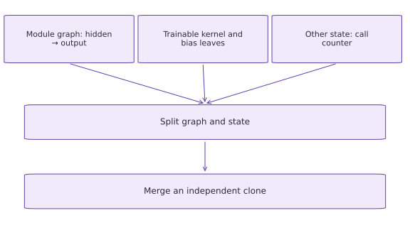

# Model and state with Flax NNX

Phase 05: Neural network training · about 80 minutes · CPU

## What you will be able to do

- Move the explicit equations into a module
- Separate parameter state from diagnostic state
- Reconstruct an independent graph from a snapshot
- Check a library forward pass independently

## The problem

A model library can organize weights for us, but we still want to see what is being learned. We’ll build a small Flax NNX module, compare its predictions with NumPy, and inspect its state. A diagnostic counter will help us distinguish trainable parameters from other values a model carries.

## The idea

NNX represents modules as object graphs with typed variables. Param marks trainable arrays; an ordinary Variable can hold other state. The graph also contains static Python structure such as layer widths. Use NNX transforms for these mutable graph objects, or explicitly split graph definition and array state when a pure function is needed.

## Move the explicit equations into a module

A module groups the same equations from the previous lesson with the arrays that they use. `nnx.Linear` owns a kernel and bias; `hidden( x )` computes $xW+b$. A second Linear consumes tanh of the hidden values. The constructor must know the feature dimensions, so an input feature mismatch is a contract error rather than a request to infer a new model. Our width-three example has $6+3+3+1=13$ trainable scalars. A batch dimension can vary without adding parameters. Class-based organization has not changed the mathematics.

## Separate parameter state from diagnostic state

The calls counter is an ordinary `nnx.Variable`, not `nnx.Param.` Calling the model with `record=True` increments it as a deliberate teaching example. It is not a learned weight and should not enter optimizer updates. `nnx.state(model, nnx.Param)` selects trainable variables; `nnx.state(model, nnx.Not(nnx.Param))` selects the remaining state. A real model may have batch-normalization statistics or dropout RNG counts in this second category. Excluding a variable from gradients does not make it immutable. You still need to specify when forward passes may change it.

```text
model
├─ hidden: kernel, bias [Param]
├─ out: kernel, bias [Param]
└─ calls: diagnostic counter [Variable]
```

## Reconstruct an independent graph from a snapshot

`nnx.split` separates the graph definition from dynamic state; `nnx.merge` reconstructs a module from those pieces. In the tested Flax version, merging the original State can reuse Variable objects; map a copying function over state leaves to reconstruct independent typed state first. Think of graph definition as the wiring and state as the current array contents. This is an in-memory demonstration, not a durable checkpoint format. The copied-state clone starts with identical values and independent mutable variables, which we verify below. Incrementing its counter must not increment the original. Copying an attribute reference, in contrast, may share a module. Explicitly test independence rather than assuming any assignment or shallow copy creates a training snapshot.

## Check a library forward pass independently

Reading model.hidden.kernel[...] retrieves its array contents in the tested Flax API. Compute the affine maps and tanh with NumPy using those arrays and compare the logits on several observations. This verifies the wiring, activation placement, and squeeze axis; it does not independently validate the initializer. Then change one output bias and predict the exact added logit shift. Keep this algebraic test separate from classification accuracy. A library refactor can preserve predictions but change state ownership, so both numerical and ownership checks are necessary.

## 1. Define typed state and the model

Create main.py. From the repository root, run python3 -m pip install -$r$ requirements-cpu.txt in your activated environment; the course pins Flax 0.12.6. Copy the model before adding any optimizer.

```python
from flax import nnx
import jax
import jax.numpy as jnp
import numpy as np
class TinyMLP(nnx.Module):
    def __init__(self,seed=0):
        rngs=nnx.Rngs(seed)
        self.hidden=nnx.Linear(2,3,rngs=rngs)
        self.out=nnx.Linear(3,1,rngs=rngs)
        self.calls=nnx.Variable(jnp.array(0,dtype=jnp.int32))
    def __call__(self,x,record=False):
        if record:self.calls[...] += 1
        return self.out(nnx.tanh(self.hidden(x))).squeeze(-1)
model=TinyMLP()
batch=jnp.array([[1.,2.],[-1.,.5],[0.,0.]])
```

`nnx.Rngs` manages initializer keys. The optional diagnostic counter changes only when explicitly requested.

## 2. Verify equations and inspect the filters

Append an independent NumPy computation. Count only `nnx.Param` leaves, not the counter.

```python
scores=model(batch,record=True)
h=np.tanh(np.asarray(batch)@np.asarray(model.hidden.kernel[...])+np.asarray(model.hidden.bias[...]))
expected=(h@np.asarray(model.out.kernel[...])+np.asarray(model.out.bias[...])).squeeze(-1)
np.testing.assert_allclose(scores,expected,rtol=1e-5,atol=1e-6)
param_state=nnx.state(model,nnx.Param)
other_state=nnx.state(model,nnx.Not(nnx.Param))
assert sum(a.size for a in jax.tree.leaves(param_state))==13
assert sum(a.size for a in jax.tree.leaves(other_state))==1
assert int(model.calls[...])==1
```

The matching forward pass verifies the network wiring. The filters identify $13$ learned scalars and one unlearned state scalar.

## 3. Split, merge, and test independence

Append the clone test. Predict which counter changes when the clone executes.

```python
graphdef,state=nnx.split(model)
clone=nnx.merge(graphdef,jax.tree.map(lambda a:jnp.array(a,copy=True),state))
np.testing.assert_allclose(clone(batch),model(batch),rtol=1e-6)
clone(batch,record=True)
assert int(clone.calls[...])==2 and int(model.calls[...])==1
grads=nnx.grad(lambda m:jnp.mean(m(batch)**2))(model)
assert sum(a.size for a in jax.tree.leaves(grads))==13
assert 'calls' not in grads
print('Trainable scalars: 13; other state: 1; clone counters:',int(model.calls[...]),int(clone.calls[...]))
```

`nnx.grad` differentiates Param variables by default. Counter independence is a state-ownership invariant, not a performance measurement.

## Run the example

```python
from flax import nnx
import jax
import jax.numpy as jnp
import numpy as np
class TinyMLP(nnx.Module):
    def __init__(self,seed=0):
        rngs=nnx.Rngs(seed)
        self.hidden=nnx.Linear(2,3,rngs=rngs)
        self.out=nnx.Linear(3,1,rngs=rngs)
        self.calls=nnx.Variable(jnp.array(0,dtype=jnp.int32))
    def __call__(self,x,record=False):
        if record:self.calls[...] += 1
        return self.out(nnx.tanh(self.hidden(x))).squeeze(-1)
model=TinyMLP()
batch=jnp.array([[1.,2.],[-1.,.5],[0.,0.]])

scores=model(batch,record=True)
h=np.tanh(np.asarray(batch)@np.asarray(model.hidden.kernel[...])+np.asarray(model.hidden.bias[...]))
expected=(h@np.asarray(model.out.kernel[...])+np.asarray(model.out.bias[...])).squeeze(-1)
np.testing.assert_allclose(scores,expected,rtol=1e-5,atol=1e-6)
param_state=nnx.state(model,nnx.Param)
other_state=nnx.state(model,nnx.Not(nnx.Param))
assert sum(a.size for a in jax.tree.leaves(param_state))==13
assert sum(a.size for a in jax.tree.leaves(other_state))==1
assert int(model.calls[...])==1

graphdef,state=nnx.split(model)
clone=nnx.merge(graphdef,jax.tree.map(lambda a:jnp.array(a,copy=True),state))
np.testing.assert_allclose(clone(batch),model(batch),rtol=1e-6)
clone(batch,record=True)
assert int(clone.calls[...])==2 and int(model.calls[...])==1
grads=nnx.grad(lambda m:jnp.mean(m(batch)**2))(model)
assert sum(a.size for a in jax.tree.leaves(grads))==13
assert 'calls' not in grads
print('Trainable scalars: 13; other state: 1; clone counters:',int(model.calls[...]),int(clone.calls[...]))
```

Expected: Trainable scalars: $13$; other state: $1$; original and cloned counters are $1$ and $2$.

## Separate graph structure from trainable and other state

**Predict:** Should the call counter receive a gradient?



**Conceptual diagram**

### Read the figure

The three boxes across the top separate the model’s module graph, trainable parameters, and other mutable state. Their arrows meet at the split operation, then continue to the construction of an independent clone. They are parallel ingredients, not three training steps.

In this example the trainable kernels and biases contain $13$ scalars. The call counter is one additional state value. It belongs to the model’s state but is not a parameter that gradient descent should optimize.

### Connect it to the computation

The graph describes how the modules are connected; the state supplies their current values. Splitting and merging preserve both roles. Copying the state before merging lets the clone evolve independently while initially producing the same predictions.

The code makes that independence visible through a check: after a recorded call on the clone, its counter is $2$, while the original counter stays $1$. The diagram explains what must be carried across the boundary; the assertions provide evidence of equal predictions, separate counters, and gradients restricted to trainable parameters.

## Recorded reference execution

CPU run: 2026-10-06T01:23:35.723749+00:00. JAX 0.9.2.

```text
Trainable scalars: 13; other state: 1; clone counters: 1 2
Trainable scalars: 13; other state: 1; clone counters: 1 2
Clone logits shifted by one; original parameters unchanged.
PASS: networks-02

```

## Bias shifts every score equally

**Predict before running:** Adding $0.25$ to the output bias should do what to each logit?

```python
before=np.asarray(model(batch))
saved=model.out.bias[...]
model.out.bias[...] = saved+.25
np.testing.assert_allclose(model(batch),before+.25,atol=1e-6)
model.out.bias[...] = saved
```

**Expected:** All logits increase by $0.25$.

An affine output bias changes the decision threshold uniformly; the hidden representation is unchanged.

## Repeated construction reproduces state

**Predict before running:** Will two modules initialized with the same seed produce equal parameters?

```python
replay=TinyMLP(0)
for a,b in zip(jax.tree.leaves(nnx.state(replay,nnx.Param)),jax.tree.leaves(param_state)):
    np.testing.assert_array_equal(a,b)
different=TinyMLP(1)
assert not np.array_equal(np.asarray(different.hidden.kernel[...]),np.asarray(model.hidden.kernel[...]))
```

**Expected:** Equal seeds reproduce the parameter arrays; a changed seed changes the hidden kernel.

Replay is checked in one pinned environment. Seeds alone do not promise identical bytes across package versions or backends.

## Make it yours

Apply the model to one new row and to five rows. Verify the scalar parameter count stays $13$ and the batch axis survives.

<details><summary>Reference solution</summary>

```python
single=jnp.array([[.3,-.7]])
assert model(single).shape==(1,)
assert model(jnp.repeat(single,5,axis=0)).shape==(5,)
assert sum(a.size for a in jax.tree.leaves(nnx.state(model,nnx.Param)))==13
```

</details>

## Change a clone without changing its source

**Transfer**

Increase only the cloned model’s output bias by one. Predict the change in every logit and verify the original model’s parameter leaves remain unchanged.

<details><summary>Hint</summary>

Snapshot the original parameters before editing clone.out.bias.

</details>

<details><summary>Reference solution and reasoning</summary>

```python
original_leaves=[np.array(a,copy=True) for a in jax.tree.leaves(nnx.state(model,nnx.Param))]
old_clone=np.asarray(clone(batch)).copy()
clone.out.bias[...] = clone.out.bias[...] + 1.
np.testing.assert_allclose(clone(batch),old_clone+1.,rtol=1e-5,atol=1e-6)
for before,after in zip(original_leaves,jax.tree.leaves(nnx.state(model,nnx.Param))):
    np.testing.assert_array_equal(before,after)
print('Clone logits shifted by one; original parameters unchanged.')
```

The bias is broadcast over observations, so every logit shifts equally. Comparing original leaves detects accidental aliasing; equal parameter counts cannot detect that bug.

</details>

## Diagnose a shared module reference

**Intermediate**

Assign `shared = model`, increment its counter, and demonstrate why this is not a snapshot. Then reconstruct an independent module.

<details><summary>Hint</summary>

Assignment changes which name refers to the same object.

</details>

<details><summary>Reference solution and reasoning</summary>

```python
saved_count=int(model.calls[...])
shared=model
shared(batch,record=True)
assert int(model.calls[...])==saved_count+1
graph,state=nnx.split(model)
independent=nnx.merge(graph,jax.tree.map(lambda a:jnp.array(a,copy=True),state))
independent(batch,record=True)
assert int(model.calls[...])==saved_count+1
assert int(independent.calls[...])==saved_count+2
```

Sharing a graph is useful for tied layers but wrong for an independent evaluation copy. Split, copy state, and merge supply independent variables in this example.

</details>

## Check your understanding

What does excluding the counter from `nnx.Param` guarantee?

1. It is excluded from parameter gradients, but may still change in a forward pass
2. It can never change
3. It is automatically saved to disk

<details><summary>Answer and explanation</summary>

It is excluded from parameter gradients, but may still change in a forward pass

Trainability and mutability are different properties. Filtering controls differentiation; the forward function still controls state updates.

</details>

## Diagnose the result

If evaluation changes state, inspect every nonparameter variable and forward flag. If a clone changes the original, inspect shared references. If an NNX module fails under a raw JAX transform, use nnx transformations or split it into graph/state deliberately instead of hiding the error.

## Carry forward

- Move the explicit equations into a module
- Separate parameter state from diagnostic state
- Reconstruct an independent graph from a snapshot
- Check a library forward pass independently

## Keep your evidence

Keep the NumPy forward comparison, count of 13 trainable scalars and one diagnostic counter, counter independence after copying state, and logits for batch size one and five.

Keep predictions, modified code, observed results, and reasoning. A checkpoint alone does not demonstrate the exercise.

## Primary references

- [Flax NNX basics](https://flax.readthedocs.io/en/latest/nnx_basics.html)
- [NNX module and pytree guide](https://flax.readthedocs.io/en/latest/guides/pytree.html)

