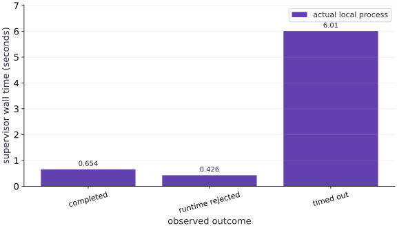

# Accelerator jobs and runtime lifecycle

Phase 16: Workload operations · about 90 minutes · CPU

## What you will be able to do

- Launch and reap a real bounded subprocess with explicit runtime requirements.
- Distinguish successful completion, worker failure and supervisor timeout.
- Keep configuration and observed runtime evidence with the run artifact.

## The problem

A training command starts, but that does not tell us whether its runtime is correct, its initialization finished, or its process will ever exit. We will supervise a real small JAX worker through success, rejected runtime requirements and an intentionally stalled update. The result will contain observed process outcomes rather than a list of assumed job statuses.

## The idea

Workload lifecycle states describe what a job can do now. Creation, startup, readiness, execution, completion and failure are different transitions. Observing the process alone is separate from that its useful work is available.

## A running process is not necessarily a ready service

A process can exist while loading weights, waiting for resources or failing repeated health checks. A ready state should correspond to a concrete capability, such as accepting a validated inference request, rather than elapsed startup time.

Attach each transition to an observed event and define timeouts. If a job is rejected before launch, do not record that as a completed training run. If it terminates, preserve whether useful work completed or a failure interrupted it.

The lifetime bars compare actual process intervals in this fixture. They do not by themselves show readiness or accelerator utilization. Use the state timeline to explain what each interval includes.

$$
\text{State}_{\text{job}} \in \{\texttt{provisioned}, \texttt{started}, \texttt{completed}, \texttt{timed\_out}, \texttt{cleaned\_up}\}
$$

### Pause and reason

Why separate startup duration from useful execution duration?

<details><summary>Compare your reasoning</summary>

They have different causes and operational effects. Provisioning or loading changes may improve startup without changing the numerical workload's speed.

</details>

## Separate intent from observation

The configuration requests CPU and at least one device. The started event records what JAX actually discovered. Requesting $999$ devices should fail before training rather than silently run on fewer resources. An exit code of zero alone is insufficient: a worker that exits early without its completed event did not satisfy our job contract. Conversely, the last progress event is not proof of completion.

## The process handle is the lifecycle authority

The supervisor owns a Popen handle and calls communicate with a deadline. On timeout it requests termination, waits briefly, then kills and reaps if needed. Merely writing timed_out into a JSON file would leave the actual worker alive. Exit values differ by platform: on POSIX a signal can appear as a negative return code, so our checks require a nonzero outcome rather than one portable magic number. This worker does not spawn descendants; a production process tree needs its own process-group or scheduler cancellation contract.

## Ready means initialization finished

The worker imports JAX, validates the device contract, constructs data and compiles one update using a disposable result. It waits for that warmup result before emitting ready. The real parameters, momentum and random key remain unchanged during warmup. This makes the first progress event a genuine update from initial state, and keeps compile time separate from steady update time. A started process can still fail before ready.

## Configuration should reject nonsense early

Total steps, batch size, checkpoint cadence and minimum device count must be positive integers. The minibatch cannot exceed the $64$-example fixture when sampling without replacement. Momentum lies in $[0,1)$, and learning rate is positive under this example’s bounded configuration. These validation choices document the teaching workload, not all valid optimizers. The worker command is an argument list and does not invoke a shell.

## Treat a deadline as evidence, not a diagnosis

The lab inserts a real sleep after initialization and emits stall_injected. The supervisor times out and terminates the child. In an actual job, reaching a deadline would not by itself distinguish slow compilation, input starvation, deadlock or a workload that simply needs more time. Keep the last event, stderr and runtime contract before choosing a repair. Our intentional event makes this particular test diagnosable without pretending to emulate every failure.

## Transfer the contract to available hardware

On a separately prepared accelerator host from the TPU course (`phase-tpu`), the same `launch` function accepts `backend='tpu'` (or `gpu`) and a required `min_devices` count. It requests that backend through `JAX_PLATFORMS` and records discovery; missing runtime support fails immediately before training starts. You can also run the portable TPU launcher (`resources/tpu-gcp/launch.py --platform tpu`) over SSH and copy the run folder back before deleting the TPU VM. Do not run that path on a laptop and call failure a hardware benchmark. Multi-host initialization, scheduler allocation, credentials, preemption signals and target-specific installation remain additional deployment contracts. No cloud resource is provisioned automatically by this lesson.

**Supervise a bounded TPU worker on a Cloud TPU VM and copy back the run record**

```bash
# Supervise a bounded TPU worker on a Cloud TPU VM and copy back the run record
gcloud compute tpus tpu-vm scp exercises/operations-01.py $TPU_NAME:~/jax-tpu-lab/ --zone=$ZONE
gcloud compute tpus tpu-vm ssh $TPU_NAME --zone=$ZONE \
  --command="JAX_PLATFORMS=tpu ~/jax-tpu-lab/.venv/bin/python -c 'import operations_01 as op; r = op.launch(\"/tmp/tpu-ops-run\", dict(backend=\"tpu\", min_devices=1, steps=4)); assert r[\"status\"] == \"completed\"; print(r[\"events\"][0], r[\"events\"][-1])'"
```

**Expected:** Launches the supervised worker on the TPU VM with backend='tpu', verifies that started reports backend='tpu' and device_count >= 1, and records completed status in /tmp/tpu-ops-run/run.json.

## Create the local artifact helpers

Create main.py with this block. Run python3 main.py in the CPU course environment.

```python
# Step 1: Create the local artifact helpers
"""Bounded local JAX subprocess supervisor and lifecycle verifier."""
# Import pathlib (Path) for this computation.
from pathlib import Path
import hashlib
import json
import math
import os
import subprocess
import sys
import tempfile
import time


# Function `digest(value)` implementing this stage's computation:
def digest(value):
    # Return `hashlib.sha256(json.dumps(value, sort_keys=True, separators=(',', ':'), allow_nan=False).encode()).hexdigest()` to the caller.
    return hashlib.sha256(json.dumps(value, sort_keys=True, separators=(',', ':'), allow_nan=False).encode()).hexdigest()


# Function `atomic_json(path, value)` implementing this stage's computation:
def atomic_json(path, value):
    """Replace one local JSON file only after its bytes have been flushed."""
    # Compute `path` as `Path(path)`.
    path = Path(path)
    path.parent.mkdir(parents=True, exist_ok=True)
    # Run `tempfile.mkstemp` to compute `(fd, temporary)`.
    fd, temporary = tempfile.mkstemp(prefix=path.name+'.', suffix='.tmp', dir=path.parent)
    # Run the boundary check and catch the expected exception:
    try:
        # Enter `os.fdopen(fd, 'w')` context block:
        with os.fdopen(fd, 'w') as stream:
            json.dump(value, stream, sort_keys=True, allow_nan=False)
            stream.flush()
            os.fsync(stream.fileno())
        os.replace(temporary, path)
    finally:
        if os.path.exists(temporary):
            os.unlink(temporary)
```

The only filesystem writes are to the caller-selected run directory. Stable JSON encoding makes hashes reproducible.

## Define the supervised worker

Append this block to main.py. Run python3 main.py in the CPU course environment.

```python
# This file is materialized only inside the caller-owned temporary run folder.
WORKER = r'''
import hashlib, json, os, sys, time
from pathlib import Path
import jax
import jax.numpy as jnp
import numpy as np
root = Path(sys.argv[1])
cfg = json.loads((root/'config.json').read_text())
worker_hash = hashlib.sha256(Path(__file__).read_bytes()).hexdigest()
def emit(event, **fields):
    print(json.dumps(dict(event=event, monotonic_s=time.monotonic(), **fields)), flush=True)
def digest(value):
    return hashlib.sha256(json.dumps(value,sort_keys=True,separators=(',', ':'),allow_nan=False).encode()).hexdigest()
def write_checkpoint(state):
    target = root/'checkpoint.json'
    temporary = root/'checkpoint.pending'
    with temporary.open('w') as stream:
        json.dump(dict(state,checksum=digest(state)),stream,sort_keys=True,allow_nan=False)
        stream.flush()
        os.fsync(stream.fileno())
    os.replace(temporary,target)
    emit('checkpoint',step=state['step'],state_hash=digest(state))
try:
    emit('started',pid=os.getpid(),backend=jax.default_backend(),device_count=jax.device_count())
    if jax.default_backend() != cfg['backend'] or jax.device_count() < cfg['min_devices']:
        raise ValueError('runtime backend/device contract failed')
    x = jnp.linspace(-1.,1.,64)
    y = 2*x+1
    data_hash = digest(dict(x=np.asarray(x).tolist(),y=np.asarray(y).tolist()))
    training = {name:cfg[name] for name in ('seed','learning_rate','momentum','batch_size')}
    config_hash = digest(training)
    if cfg['resume']:
        saved = json.loads((root/'checkpoint.json').read_text())
        checksum = saved.pop('checksum',None)
        if checksum != digest(saved) or saved.get('worker_hash') != worker_hash:
            raise ValueError('checkpoint checksum/source mismatch')
        if saved['schema_version'] != 1 or saved['config_hash'] != config_hash or saved['data_hash'] != data_hash:
            raise ValueError('checkpoint provenance mismatch')
        state = saved
        step = saved['step']
        params=jnp.array(saved['params'])
        velocity=jnp.array(saved['velocity'])
        key=jnp.array(saved['key'],dtype=jnp.uint32)
        if not isinstance(step,int) or isinstance(step,bool) or step < 0 or step > cfg['steps'] or params.shape != (2,) or velocity.shape != (2,) or key.shape != (2,):
            raise ValueError('invalid checkpoint state shape or step')
        if not bool(jnp.all(jnp.isfinite(params))) or not bool(jnp.all(jnp.isfinite(velocity))):
            raise ValueError('nonfinite checkpoint state')
        emit('restored',step=step,state_hash=digest(saved))
    else:
        step=0
        params=jnp.zeros(2)
        velocity=jnp.zeros(2)
        key=jax.random.PRNGKey(cfg['seed'])
    def update(params,velocity,key):
        key, sample = jax.random.split(key)
        indices=jax.random.choice(sample,64,(cfg['batch_size'],),replace=False)
        objective=lambda p:jnp.mean((p[0]*x[indices]+p[1]-y[indices])**2)
        loss, grad=jax.value_and_grad(objective)(params)
        velocity=cfg['momentum']*velocity+grad
        params=params-cfg['learning_rate']*velocity
        return params,velocity,key,loss
    compiled=jax.jit(update)
    # Compile and synchronize once without consuming actual training state.
    begin=time.perf_counter()
    warm=compiled(params,velocity,key)
    jax.block_until_ready(warm)
    emit('ready',compile_warmup_s=time.perf_counter()-begin,step=step)
    while step < cfg['steps']:
        if cfg.get('stall_at') == step:
            emit('stall_injected',step=step)
            time.sleep(cfg.get('stall_seconds',10.))
        begin=time.perf_counter()
        params,velocity,key,loss=compiled(params,velocity,key)
        jax.block_until_ready((params,velocity,key,loss))
        elapsed=time.perf_counter()-begin
        step+=1
        state=dict(schema_version=1,worker_hash=worker_hash,step=step,params=np.asarray(params).tolist(),velocity=np.asarray(velocity).tolist(),key=np.asarray(key).tolist(),config_hash=config_hash,data_hash=data_hash)
        emit('progress',step=step,loss=float(loss),examples=cfg['batch_size'],update_s=elapsed,state_hash=digest(state))
        if step % cfg['checkpoint_every'] == 0 or step == cfg['steps']:
            write_checkpoint(state)
        if cfg.get('fail_after') == step:
            raise RuntimeError('controlled failure after update')
    write_checkpoint(state)
    emit('completed',step=step,state_hash=digest(state))
except Exception as error:
    emit('failed',kind=type(error).__name__,message=str(error))
    raise SystemExit(23)
'''
```

The string is a real Python program launched in a separate process. It emits structured events, synchronizes JAX updates and preserves complete state.

## Add bounded launch and result collection

Append this block to main.py. Run python3 main.py in the CPU course environment.

```python
# Step 3 — Add bounded launch and result collection: The supervisor owns the child handle, captures its output and...
def default_config(**changes):
    # Evaluate `seed=3, learning_rate=0.04, momentum=0.8, batch_size=8, steps=8, checkpoint_every=2, backend='cpu', min_devices=1, resume=False, fail_after=None, stall_at=None, stall_seconds=10.0` and convert the result into Python scalar/collection `cfg`.
    cfg=dict(seed=3,learning_rate=.04,momentum=.8,batch_size=8,steps=8,
             checkpoint_every=2,backend='cpu',min_devices=1,resume=False,
             fail_after=None,stall_at=None,stall_seconds=10.)
    # Update state in place with the new values.
    cfg.update(changes)
    # Iterate over `name` to step through the computation:
    for name in ('steps','checkpoint_every','batch_size','min_devices'):
        # Guard input contract (`not isinstance(cfg[name], int) or isinstance(cfg[name], bool) or cfg[name] < 1`) and fail fast if violated.
        if not isinstance(cfg[name],int) or isinstance(cfg[name],bool) or cfg[name] < 1:
            raise ValueError(name+' must be a positive integer')
    # Guard input contract (`cfg['batch_size'] > 64 or not 0 <= cfg['momentum'] < 1 or (not 0 < cfg['learning_rate'] < 1)`) and fail fast if violated.
    if cfg['batch_size'] > 64 or not 0 <= cfg['momentum'] < 1 or not 0 < cfg['learning_rate'] < 1:
        raise ValueError('invalid training configuration')
    # Return `cfg` to the caller.
    return cfg


# Function `launch(root, config, timeout)` implementing this stage's computation:
def launch(root, config=None, timeout=10.):
    # Compute `root` as `Path(root)`.
    root=Path(root)
    root.mkdir(parents=True,exist_ok=True)
    # Run `default_config` to compute `cfg`.
    cfg=default_config(**(config or {}))
    # Guard input contract (`timeout <= 0`) and fail fast if violated.
    if timeout <= 0:
        raise ValueError('timeout must be positive')
    # Run `atomic_json` to perform the next check or state transition.
    atomic_json(root/'config.json',cfg)
    # Compute `worker` as `root/'worker.py'`.
    worker=root/'worker.py'
    worker.write_text(WORKER)
    # Configure environment variable before initializing the runtime.
    env=dict(os.environ,JAX_PLATFORMS=cfg['backend'],PYTHONUNBUFFERED='1')
    # Record execution timing or profiler trace in `started`.
    started=time.perf_counter()
    # Read or serialize artifact data on disk (`process`).
    process=subprocess.Popen([sys.executable,str(worker),str(root)],stdout=subprocess.PIPE,stderr=subprocess.PIPE,text=True,env=env)
    # Compute `timed_out` as `False`.
    timed_out=False
    try:
        stdout,stderr=process.communicate(timeout=timeout)
    except subprocess.TimeoutExpired:
        timed_out=True
        process.terminate()
        try:
            stdout,stderr=process.communicate(timeout=1.)
        except subprocess.TimeoutExpired:
            process.kill()
            stdout,stderr=process.communicate(timeout=1.)
    # Record execution timing or profiler trace in `wall`.
    wall=time.perf_counter()-started
    # Compute `events` from `[]`
    events=[]
    malformed=[]
    # Loop over `line` in `stdout.splitlines()`:
    for line in stdout.splitlines():
        # Branch on condition `not line.strip()`:
        if not line.strip():
            continue
        try:
            event=json.loads(line)
            if not isinstance(event,dict) or 'event' not in event:
                raise ValueError('not an event')
            events.append(event)
        except (ValueError,TypeError):
            malformed.append(line)
    # Compute `status` from `'timed_out' if timed_out else 'completed' if process...`
    status='timed_out' if timed_out else 'completed' if process.returncode == 0 and not malformed and events and events[-1]['event']=='completed' else 'failed'
    # Compute deterministic cryptographic digest `result` for provenance verification.
    result=dict(status=status,returncode=process.returncode,wall_s=wall,events=events,stderr=stderr,
                worker_hash=hashlib.sha256(WORKER.encode()).hexdigest(),config=cfg,malformed_stdout=malformed)
    # Run `atomic_json` to perform the next check or state transition.
    atomic_json(root/'run.json',result)
    # Return `result` to the caller.
    return result
```

The supervisor owns the child handle, captures its output and always waits for termination after a timeout.

## Exercise all three lifecycle outcomes

Append this block to main.py. Run python3 main.py in the CPU course environment.

```python
# Step 4 — Exercise all three lifecycle outcomes: Each outcome comes from a real subprocess.
# Create an isolated temporary directory to run and inspect artifacts safely:
with tempfile.TemporaryDirectory(prefix='ops-lifecycle-') as folder:
    # Read or serialize artifact data on disk (`base`).
    base = Path(folder)
    # Run `launch` to compute `successful`.
    successful = launch(base/'success')
    # Run `launch` to compute `rejected`.
    rejected = launch(base/'wrong-runtime',dict(min_devices=999))
    # Run `launch` to compute `stalled`.
    stalled = launch(base/'timeout',dict(stall_at=0,stall_seconds=20),timeout=6)
# Assert invariant `successful['status'] == 'completed'` holds
assert successful['status'] == 'completed'
# Assert invariant `rejected['status'] == 'failed' and rejected['returncode'] != 0` holds
assert rejected['status'] == 'failed' and rejected['returncode'] != 0
# Assert invariant `stalled['status'] == 'timed_out' and stalled['returncode'] != 0` holds
assert stalled['status'] == 'timed_out' and stalled['returncode'] != 0
# Assert invariant `any(e['event']=='stall_injected' for e in stalled['events'])` holds
assert any(e['event']=='stall_injected' for e in stalled['events'])
# Print the observed values to compare against the expected result.
print('statuses:',successful['status'],rejected['status'],stalled['status'])
# Print diagnostic summary of the computed outputs.
print('actual exit codes:',successful['returncode'],rejected['returncode'],stalled['returncode'])
```

Each outcome comes from a real subprocess. Temporary directories contain and clean up every artifact.

## Run the example

```python
# Complete runnable example (operations-01)
"""Bounded local JAX subprocess supervisor and lifecycle verifier."""
# Import pathlib (Path) for this computation.
from pathlib import Path
import hashlib
import json
import math
import os
import subprocess
import sys
import tempfile
import time


# Function `digest(value)` implementing this stage's computation:
def digest(value):
    # Return `hashlib.sha256(json.dumps(value, sort_keys=True, separators=(',', ':'), allow_nan=False).encode()).hexdigest()` to the caller.
    return hashlib.sha256(json.dumps(value, sort_keys=True, separators=(',', ':'), allow_nan=False).encode()).hexdigest()


# Function `atomic_json(path, value)` implementing this stage's computation:
def atomic_json(path, value):
    """Replace one local JSON file only after its bytes have been flushed."""
    # Compute `path` as `Path(path)`.
    path = Path(path)
    path.parent.mkdir(parents=True, exist_ok=True)
    # Run `tempfile.mkstemp` to compute `(fd, temporary)`.
    fd, temporary = tempfile.mkstemp(prefix=path.name+'.', suffix='.tmp', dir=path.parent)
    # Run the boundary check and catch the expected exception:
    try:
        # Enter `os.fdopen(fd, 'w')` context block:
        with os.fdopen(fd, 'w') as stream:
            json.dump(value, stream, sort_keys=True, allow_nan=False)
            stream.flush()
            os.fsync(stream.fileno())
        os.replace(temporary, path)
    finally:
        if os.path.exists(temporary):
            os.unlink(temporary)

# This file is materialized only inside the caller-owned temporary run folder.
WORKER = r'''
import hashlib, json, os, sys, time
from pathlib import Path
import jax
import jax.numpy as jnp
import numpy as np
root = Path(sys.argv[1])
cfg = json.loads((root/'config.json').read_text())
worker_hash = hashlib.sha256(Path(__file__).read_bytes()).hexdigest()
def emit(event, **fields):
    print(json.dumps(dict(event=event, monotonic_s=time.monotonic(), **fields)), flush=True)
def digest(value):
    return hashlib.sha256(json.dumps(value,sort_keys=True,separators=(',', ':'),allow_nan=False).encode()).hexdigest()
def write_checkpoint(state):
    target = root/'checkpoint.json'
    temporary = root/'checkpoint.pending'
    with temporary.open('w') as stream:
        json.dump(dict(state,checksum=digest(state)),stream,sort_keys=True,allow_nan=False)
        stream.flush()
        os.fsync(stream.fileno())
    os.replace(temporary,target)
    emit('checkpoint',step=state['step'],state_hash=digest(state))
try:
    emit('started',pid=os.getpid(),backend=jax.default_backend(),device_count=jax.device_count())
    if jax.default_backend() != cfg['backend'] or jax.device_count() < cfg['min_devices']:
        raise ValueError('runtime backend/device contract failed')
    x = jnp.linspace(-1.,1.,64)
    y = 2*x+1
    data_hash = digest(dict(x=np.asarray(x).tolist(),y=np.asarray(y).tolist()))
    training = {name:cfg[name] for name in ('seed','learning_rate','momentum','batch_size')}
    config_hash = digest(training)
    if cfg['resume']:
        saved = json.loads((root/'checkpoint.json').read_text())
        checksum = saved.pop('checksum',None)
        if checksum != digest(saved) or saved.get('worker_hash') != worker_hash:
            raise ValueError('checkpoint checksum/source mismatch')
        if saved['schema_version'] != 1 or saved['config_hash'] != config_hash or saved['data_hash'] != data_hash:
            raise ValueError('checkpoint provenance mismatch')
        state = saved
        step = saved['step']
        params=jnp.array(saved['params'])
        velocity=jnp.array(saved['velocity'])
        key=jnp.array(saved['key'],dtype=jnp.uint32)
        if not isinstance(step,int) or isinstance(step,bool) or step < 0 or step > cfg['steps'] or params.shape != (2,) or velocity.shape != (2,) or key.shape != (2,):
            raise ValueError('invalid checkpoint state shape or step')
        if not bool(jnp.all(jnp.isfinite(params))) or not bool(jnp.all(jnp.isfinite(velocity))):
            raise ValueError('nonfinite checkpoint state')
        emit('restored',step=step,state_hash=digest(saved))
    else:
        step=0
        params=jnp.zeros(2)
        velocity=jnp.zeros(2)
        key=jax.random.PRNGKey(cfg['seed'])
    def update(params,velocity,key):
        key, sample = jax.random.split(key)
        indices=jax.random.choice(sample,64,(cfg['batch_size'],),replace=False)
        objective=lambda p:jnp.mean((p[0]*x[indices]+p[1]-y[indices])**2)
        loss, grad=jax.value_and_grad(objective)(params)
        velocity=cfg['momentum']*velocity+grad
        params=params-cfg['learning_rate']*velocity
        return params,velocity,key,loss
    compiled=jax.jit(update)
    # Compile and synchronize once without consuming actual training state.
    begin=time.perf_counter()
    warm=compiled(params,velocity,key)
    jax.block_until_ready(warm)
    emit('ready',compile_warmup_s=time.perf_counter()-begin,step=step)
    while step < cfg['steps']:
        if cfg.get('stall_at') == step:
            emit('stall_injected',step=step)
            time.sleep(cfg.get('stall_seconds',10.))
        begin=time.perf_counter()
        params,velocity,key,loss=compiled(params,velocity,key)
        jax.block_until_ready((params,velocity,key,loss))
        elapsed=time.perf_counter()-begin
        step+=1
        state=dict(schema_version=1,worker_hash=worker_hash,step=step,params=np.asarray(params).tolist(),velocity=np.asarray(velocity).tolist(),key=np.asarray(key).tolist(),config_hash=config_hash,data_hash=data_hash)
        emit('progress',step=step,loss=float(loss),examples=cfg['batch_size'],update_s=elapsed,state_hash=digest(state))
        if step % cfg['checkpoint_every'] == 0 or step == cfg['steps']:
            write_checkpoint(state)
        if cfg.get('fail_after') == step:
            raise RuntimeError('controlled failure after update')
    write_checkpoint(state)
    emit('completed',step=step,state_hash=digest(state))
except Exception as error:
    emit('failed',kind=type(error).__name__,message=str(error))
    raise SystemExit(23)
'''

# Step 3 — Add bounded launch and result collection: The supervisor owns the child handle, captures its output and...
def default_config(**changes):
    # Evaluate `seed=3, learning_rate=0.04, momentum=0.8, batch_size=8, steps=8, checkpoint_every=2, backend='cpu', min_devices=1, resume=False, fail_after=None, stall_at=None, stall_seconds=10.0` and convert the result into Python scalar/collection `cfg`.
    cfg=dict(seed=3,learning_rate=.04,momentum=.8,batch_size=8,steps=8,
             checkpoint_every=2,backend='cpu',min_devices=1,resume=False,
             fail_after=None,stall_at=None,stall_seconds=10.)
    # Update state in place with the new values.
    cfg.update(changes)
    # Iterate over `name` to step through the computation:
    for name in ('steps','checkpoint_every','batch_size','min_devices'):
        # Guard input contract (`not isinstance(cfg[name], int) or isinstance(cfg[name], bool) or cfg[name] < 1`) and fail fast if violated.
        if not isinstance(cfg[name],int) or isinstance(cfg[name],bool) or cfg[name] < 1:
            raise ValueError(name+' must be a positive integer')
    # Guard input contract (`cfg['batch_size'] > 64 or not 0 <= cfg['momentum'] < 1 or (not 0 < cfg['learning_rate'] < 1)`) and fail fast if violated.
    if cfg['batch_size'] > 64 or not 0 <= cfg['momentum'] < 1 or not 0 < cfg['learning_rate'] < 1:
        raise ValueError('invalid training configuration')
    # Return `cfg` to the caller.
    return cfg


# Function `launch(root, config, timeout)` implementing this stage's computation:
def launch(root, config=None, timeout=10.):
    # Compute `root` as `Path(root)`.
    root=Path(root)
    root.mkdir(parents=True,exist_ok=True)
    # Run `default_config` to compute `cfg`.
    cfg=default_config(**(config or {}))
    # Guard input contract (`timeout <= 0`) and fail fast if violated.
    if timeout <= 0:
        raise ValueError('timeout must be positive')
    # Run `atomic_json` to perform the next check or state transition.
    atomic_json(root/'config.json',cfg)
    # Compute `worker` as `root/'worker.py'`.
    worker=root/'worker.py'
    worker.write_text(WORKER)
    # Configure environment variable before initializing the runtime.
    env=dict(os.environ,JAX_PLATFORMS=cfg['backend'],PYTHONUNBUFFERED='1')
    # Record execution timing or profiler trace in `started`.
    started=time.perf_counter()
    # Read or serialize artifact data on disk (`process`).
    process=subprocess.Popen([sys.executable,str(worker),str(root)],stdout=subprocess.PIPE,stderr=subprocess.PIPE,text=True,env=env)
    # Compute `timed_out` as `False`.
    timed_out=False
    try:
        stdout,stderr=process.communicate(timeout=timeout)
    except subprocess.TimeoutExpired:
        timed_out=True
        process.terminate()
        try:
            stdout,stderr=process.communicate(timeout=1.)
        except subprocess.TimeoutExpired:
            process.kill()
            stdout,stderr=process.communicate(timeout=1.)
    # Record execution timing or profiler trace in `wall`.
    wall=time.perf_counter()-started
    # Compute `events` from `[]`
    events=[]
    malformed=[]
    # Loop over `line` in `stdout.splitlines()`:
    for line in stdout.splitlines():
        # Branch on condition `not line.strip()`:
        if not line.strip():
            continue
        try:
            event=json.loads(line)
            if not isinstance(event,dict) or 'event' not in event:
                raise ValueError('not an event')
            events.append(event)
        except (ValueError,TypeError):
            malformed.append(line)
    # Compute `status` from `'timed_out' if timed_out else 'completed' if process...`
    status='timed_out' if timed_out else 'completed' if process.returncode == 0 and not malformed and events and events[-1]['event']=='completed' else 'failed'
    # Compute deterministic cryptographic digest `result` for provenance verification.
    result=dict(status=status,returncode=process.returncode,wall_s=wall,events=events,stderr=stderr,
                worker_hash=hashlib.sha256(WORKER.encode()).hexdigest(),config=cfg,malformed_stdout=malformed)
    # Run `atomic_json` to perform the next check or state transition.
    atomic_json(root/'run.json',result)
    # Return `result` to the caller.
    return result

# Step 4 — Exercise all three lifecycle outcomes: Each outcome comes from a real subprocess.
# Create an isolated temporary directory to run and inspect artifacts safely:
with tempfile.TemporaryDirectory(prefix='ops-lifecycle-') as folder:
    # Read or serialize artifact data on disk (`base`).
    base = Path(folder)
    # Run `launch` to compute `successful`.
    successful = launch(base/'success')
    # Run `launch` to compute `rejected`.
    rejected = launch(base/'wrong-runtime',dict(min_devices=999))
    # Run `launch` to compute `stalled`.
    stalled = launch(base/'timeout',dict(stall_at=0,stall_seconds=20),timeout=6)
# Assert invariant `successful['status'] == 'completed'` holds
assert successful['status'] == 'completed'
# Assert invariant `rejected['status'] == 'failed' and rejected['returncode'] != 0` holds
assert rejected['status'] == 'failed' and rejected['returncode'] != 0
# Assert invariant `stalled['status'] == 'timed_out' and stalled['returncode'] != 0` holds
assert stalled['status'] == 'timed_out' and stalled['returncode'] != 0
# Assert invariant `any(e['event']=='stall_injected' for e in stalled['events'])` holds
assert any(e['event']=='stall_injected' for e in stalled['events'])
# Print the observed values to compare against the expected result.
print('statuses:',successful['status'],rejected['status'],stalled['status'])
# Print diagnostic summary of the computed outputs.
print('actual exit codes:',successful['returncode'],rejected['returncode'],stalled['returncode'])
```

Expected: The actual child outcomes are completed, failed and timed_out. A worker requirement failure exits nonzero; the stalled worker is terminated and reaped.

## Three actual process lifetimes

**Predict:** Will the runtime-rejected job spend time training?



**Recorded CPU computation**

### Read the figure

The horizontal categories identify three actual child runs. The vertical axis is supervisor wall-clock seconds, from launch to reaped exit. The timeout bar reflects the configured deadline plus cancellation overhead. The failure bar includes Python and JAX startup before the runtime check rejects the job. These are measured durations, so their exact values vary across hosts and reruns.

### Connect it to the computation

Compare the bars with the event traces, not by height alone. The completed run contains progress and a completed event; the rejected run has no progress; the stalled run reaches ready but never finishes. A shorter failing bar does not mean an efficient job. This plot demonstrates lifecycle measurement on the local CPU, not accelerator throughput.

```python
# Compute figure data for: Three actual process lifetimes
# Compute `visual_data` from `{'kind':'bar','labels':['completed','runtime rejecte...`
visual_data={'kind':'bar','labels':['completed','runtime rejected','timed out'],'xlabel':'observed outcome','ylabel':'supervisor wall time (seconds)','series':[{'label':'actual local process','y':[successful['wall_s'],rejected['wall_s'],stalled['wall_s']]}]}
```

## Recorded reference execution

CPU run: 2026-10-08T14:06:52.144758+00:00. JAX 0.9.2.

```text
statuses: completed failed timed_out
actual exit codes: 0 23 -15
statuses: completed failed timed_out
actual exit codes: 0 23 -15
timed-out worker events: ['started', 'ready', 'stall_injected']
PASS: operations-01

```

## A child that fails before training

**Predict before running:** Can an impossible device requirement produce valid training progress?

```python
# Experiment — A child that fails before training: This check links the failure classification to a concrete...
# Assert that `any(e['event']=='failed' and 'runtime' in e['message'] for e in rejected['events'])`.
assert any(e['event']=='failed' and 'runtime' in e['message'] for e in rejected['events'])
# Assert invariant `not any(e['event']=='progress' for e in rejected['events'])` holds
assert not any(e['event']=='progress' for e in rejected['events'])
```

**Expected:** The runtime mismatch is recorded, and no update event exists.

This check links the failure classification to a concrete boundary in the worker lifecycle.

## A started process need not be ready

**Predict before running:** Which events occur before the injected stall?

```python
# Experiment — A started process need not be ready: The sequence rules out startup failure in this controlled drill.
names=[e['event'] for e in stalled['events']]
# Assert that `names.index('started') < names.index('ready') < names.index('stall_injected')`.
assert names.index('started') < names.index('ready') < names.index('stall_injected')
# Assert invariant `'completed' not in names` holds
assert 'completed' not in names
# Print the observed values to compare against the expected result.
print('timed-out worker events:',names)
```

**Expected:** The worker reaches ready, then stalls before its first update.

The sequence rules out startup failure in this controlled drill. A different trace would demand a different diagnosis.

## Make it yours

Launch a changed job with $3$ updates and batch size $5$. Verify the observed progress steps and completion event rather than relying only on its exit code.

### How to write this exercise — Step-by-step recipe & starter scaffold

**Key functions & syntax to use:**
- `tempfile.TemporaryDirectory(...)` — Call `tempfile.TemporaryDirectory` with your updated parameters or inputs from this lesson's workspace.
- `launch(...)` — Call `launch` with your updated parameters or inputs from this lesson's workspace.
- `assert condition` — Verify that the observed output shape, status, or numerical value satisfies the contract.

**Step-by-step implementation plan:**
1. Create an isolated temporary directory to run and inspect artifacts safely:
2. Run `launch` to compute `short`.
3. Assert invariant `short['status']=='completed'` holds
4. Assert invariant `[e['step'] for e in short['events'] if e['event']=='progress']==[1` holds
5. Assert invariant `short['events'][-1]['step']==3` holds

**Starter code scaffold (fill in the TODOs):**

```python
# Exercise solution: Launch a changed job with 3 updates and batch size 5.
# Create an isolated temporary directory to run and inspect artifacts safely:
with tempfile.TemporaryDirectory() as folder:
    # Run `launch` to compute `short`.
    short = launch(...)  # TODO: compute short
# Assert invariant `short['status']=='completed'` holds
assert short['status']  # TODO: complete assertion check
# Assert invariant `[e['step'] for e in short['events'] if e['event']=='progress']==[1` holds
assert [e['step'] for e  # TODO: complete assertion check
# Assert invariant `short['events'][-1]['step']==3` holds
assert short['events'][-1]['step']  # TODO: complete assertion check
```

<details><summary>Reference solution</summary>

```python
# Exercise solution: Launch a changed job with 3 updates and batch size 5.
# Create an isolated temporary directory to run and inspect artifacts safely:
with tempfile.TemporaryDirectory() as folder:
    # Run `launch` to compute `short`.
    short=launch(folder,dict(steps=3,batch_size=5))
# Assert invariant `short['status']=='completed'` holds
assert short['status']=='completed'
# Assert invariant `[e['step'] for e in short['events'] if e['event']=='progress']==[1` holds
assert [e['step'] for e in short['events'] if e['event']=='progress']==[1,2,3]
# Assert invariant `short['events'][-1]['step']==3` holds
assert short['events'][-1]['step']==3
```

</details>

## Reject invalid work before spawning

**Transfer / diagnosis**

Try a zero step budget and an oversized minibatch. Require a clear configuration error for each.

<details><summary>Hint</summary>

Call default_config directly; no child should be needed.

</details>

### How to write: Reject invalid work before spawning — Step-by-step recipe & starter scaffold

**Key functions & syntax to use:**
- `spawning(...)` — Call `spawning` with your updated parameters or inputs from this lesson's workspace.
- `default_config(...)` — Call `default_config` with your updated parameters or inputs from this lesson's workspace.

**Step-by-step implementation plan:**
1. Iterate over `values` to step through the computation:

**Starter code scaffold (fill in the TODOs):**

```python
# Reject invalid work before spawning (Transfer / diagnosis): Validation makes an impossible workload fail at the caller...
# Iterate over `values` to step through the computation:
for values in [dict(steps=0),dict(batch_size=65)]:
    try:
        default_config(**values)
    except ValueError:
        pass
    else:
        raise AssertionError('invalid work accepted')
```

<details><summary>Reference solution and reasoning</summary>

```python
# Reject invalid work before spawning (Transfer / diagnosis): Validation makes an impossible workload fail at the caller...
# Iterate over `values` to step through the computation:
for values in [dict(steps=0),dict(batch_size=65)]:
    try:
        default_config(**values)
    except ValueError:
        pass
    else:
        raise AssertionError('invalid work accepted')
```

Validation makes an impossible workload fail at the caller boundary instead of consuming runtime first.

</details>

## Preserve a successful checkpoint

**Transfer / diagnosis**

Run $4$ updates in a temporary directory and verify that the final checkpoint and run record both refer to the completed work.

<details><summary>Hint</summary>

Read the files before leaving the temporary-directory context.

</details>

### How to write: Preserve a successful checkpoint — Step-by-step recipe & starter scaffold

**Key functions & syntax to use:**
- `checkpoint(...)` — Call `checkpoint` with your updated parameters or inputs from this lesson's workspace.
- `tempfile.TemporaryDirectory(...)` — Call `tempfile.TemporaryDirectory` with your updated parameters or inputs from this lesson's workspace.
- `assert condition` — Verify that the observed output shape, status, or numerical value satisfies the contract.

**Step-by-step implementation plan:**
1. Create an isolated temporary directory to run and inspect artifacts safely:
2. Run `launch` to compute `result`.
3. Read or serialize artifact data on disk (`saved`).
4. Read or serialize artifact data on disk (`record`).
5. Assert invariant `saved['step']==4 and record['status']=='completed'` holds

**Starter code scaffold (fill in the TODOs):**

```python
# Preserve a successful checkpoint (Transfer / diagnosis): A status and a durable artifact should agree about what was...
# Create an isolated temporary directory to run and inspect artifacts safely:
with tempfile.TemporaryDirectory() as folder:
    # Run `launch` to compute `result`.
    result = launch(...)  # TODO: compute result
    # Read or serialize artifact data on disk (`saved`).
    saved = json.loads(...)  # TODO: compute saved
    # Read or serialize artifact data on disk (`record`).
    record = json.loads(...)  # TODO: compute record
    # Assert invariant `saved['step']==4 and record['status']=='completed'` holds
    assert saved['step']  # TODO: complete assertion check
    # Assert invariant `record['worker_hash']==saved['worker_hash']` holds
    assert record['worker_hash']  # TODO: complete assertion check
```

<details><summary>Reference solution and reasoning</summary>

```python
# Preserve a successful checkpoint (Transfer / diagnosis): A status and a durable artifact should agree about what was...
# Create an isolated temporary directory to run and inspect artifacts safely:
with tempfile.TemporaryDirectory() as folder:
    # Run `launch` to compute `result`.
    result=launch(folder,dict(steps=4))
    # Read or serialize artifact data on disk (`saved`).
    saved=json.loads((Path(folder)/'checkpoint.json').read_text())
    # Read or serialize artifact data on disk (`record`).
    record=json.loads((Path(folder)/'run.json').read_text())
    # Assert invariant `saved['step']==4 and record['status']=='completed'` holds
    assert saved['step']==4 and record['status']=='completed'
    # Assert invariant `record['worker_hash']==saved['worker_hash']` holds
    assert record['worker_hash']==saved['worker_hash']
```

A status and a durable artifact should agree about what was completed; neither should be assumed from the command alone.

</details>

## Check your understanding

What must a timeout handler do beyond recording a timeout status?

1. Leave the child running so it might finish later
2. Terminate or kill as required, then wait for the actual child to exit
3. Delete the last log line

<details><summary>Answer and explanation</summary>

Terminate or kill as required, then wait for the actual child to exit

The supervisor must resolve the actual process lifetime. A status label does not stop computation or release process resources.

</details>

## Diagnose the result

Use the last structured event to locate the boundary: no ready event points toward runtime or initialization; ready without progress points toward update/input work; completed with a nonzero exit still requires investigation. Preserve stderr. Verify the child has exited before retrying so two runs do not write the same checkpoint.

## Carry forward

- A requested runtime and an observed runtime are separate facts.
- A process deadline needs cancellation and reaping, not just a status string.

## Keep your evidence

Keep actual child exit codes, bounded timeout/termination output and proof that children were reaped. Distinguish launch failure, failed preflight, slow work and a stalled job.

Save your predictions, modified code, terminal outputs, and reasoning in your engineering portfolio.

## Primary references

- [Python subprocess management](https://docs.python.org/3/library/subprocess.html)
- [Python os.replace and fsync](https://docs.python.org/3/library/os.html#os.replace)
- [JAX asynchronous dispatch and synchronization](https://docs.jax.dev/en/latest/async_dispatch.html)
- [JAX device discovery](https://docs.jax.dev/en/latest/_autosummary/jax.devices.html)

