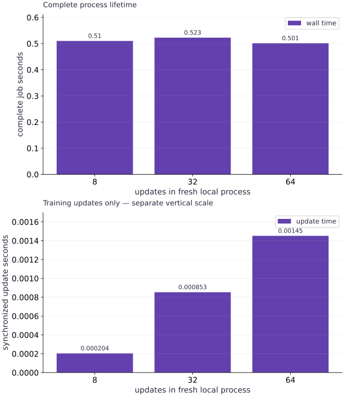

# Capacity, utilization, and operating cost

Phase 16: Workload operations · about 90 minutes · CPU

## What you will be able to do

- Measure end-to-end local service time at more than one workload length.
- Compute offered load, worker reserve and illustrative cost with consistent units.
- Identify assumptions that prevent a CPU fixture from establishing accelerator fleet capacity.

## The problem

A short local training job finishes quickly. How many workers would a stream of jobs require, and what can this measurement actually tell us about cost? We will measure complete CPU jobs of several lengths, separate update work from startup overhead and apply transparent capacity arithmetic to explicitly hypothetical arrival rates and prices.

## The idea

Operating cost depends on resource allocation, runtime and the billing model. A workload's fraction of time in useful updates is not the same as device utilization. Keep cost accounting and performance measurements explicit.

## Account for billed time as well as useful work

A job may spend time provisioning, loading, compiling, updating and shutting down. For short jobs, fixed startup costs can dominate even if the update loop is efficient. Reusing a warm service changes that tradeoff but introduces its own allocation costs.

Track the resource count and billed interval under the actual pricing assumptions. If a rate is hypothetical, label the resulting cost as modeled. A duration multiplied by an assumed price is not an invoice.

The timing panels compare different intervals. Their ratios can describe job-level busy fraction, but they do not measure accelerator instruction or memory utilization. Choose the metric that answers the operational question before optimizing it.

### Pause and reason

Can a high fraction of time in the update loop prove high accelerator utilization?

<details><summary>Compare your reasoning</summary>

No. The loop can wait on data, synchronization or inefficient kernels. Device utilization requires suitable device observations in addition to job timing.

</details>

## Measure the service boundary you intend to provision

We run jobs with $8$, $32$ and $64$ updates in fresh child processes. Supervisor wall time includes imports, runtime startup, compilation, updates, logs and checkpoints. If a production worker stays warm across many jobs, this measurement overstates repeated startup cost; if production adds queueing or remote data, it understates those delays. Write the boundary alongside the number. We use the maximum of these three local observations as an illustrative conservative input, not a statistical tail estimate.

## Convert seconds into worker demand

Let $\lambda$ be arrivals per hour, $t$ seconds per job and $m$ workers, each running one job at a time. Offered demand is $\lambda t/3600$ worker-hours per hour. Nominal load is this demand divided by $m$. The units cancel to a fraction. A load above one means average demand exceeds nominal capacity under the model; a load below one does not guarantee a latency target.

$$
\rho=\frac{\lambda t}{3600m}
$$

## State the reserve rather than hiding it

For reserve fraction $r$, require nominal load no greater than $1-r$. The smallest integer worker count in this simple model is the ceiling below, with at least one worker in our function. For $90$-second jobs arriving $80$ times an hour, demand is $2$ worker-hours per hour. A $25$% reserve requires at least $3$ workers; four workers would run at nominal load $0.5$.

$$
m_{\min}=\left\lceil\frac{\lambda t}{3600(1-r)}\right\rceil
$$

## A cost number needs a declared price model

We use an invented planning rate of $1.50$ currency units per worker-hour, explicitly not a current cloud price. Reserving two workers for an hour costs $3$ under that model, whether busy or idle. A job’s active-time cost is $pt/3600$ for hourly rate $p$, but dividing the reserved hourly bill by actual completed jobs can produce a different cost per completion. Include idle capacity, failed attempts, storage and transfer charges when those belong to the real budget.

## Do not confuse duty fraction with hardware utilization

The worker records seconds inside synchronized compiled updates. Dividing their sum by job wall time is an application duty fraction. A small value in a tiny job mostly reflects startup and operational overhead. It does not measure CPU core occupancy, accelerator compute utilization, memory-bandwidth pressure or scheduler allocation. Those require their own target-specific measurements. Increasing update count can amortize startup without making each update intrinsically faster.

## Capacity is a distribution, not just a mean

Real arrivals can burst, job durations can vary, failures consume retries, and a worker may be unavailable. Three short measurements cannot estimate a high percentile reliably. Retain individual timings, choose a larger representative study on the actual target, and test the queue/latency objective before buying capacity. The local examples execute real jobs; all arrival, reserve and price scenarios remain labeled assumptions.

## Create the local artifact helpers

Create main.py with this block. Run python3 main.py in the CPU course environment.

```python
# Step 1: Create the local artifact helpers
"""Bounded local JAX workload operations. No scheduler, cloud, or GPU emulator."""
# Import pathlib (Path) for this computation.
from pathlib import Path
import hashlib
import json
import math
import os
import subprocess
import sys
import tempfile
import time


# Function `digest(value)` implementing this stage's computation:
def digest(value):
    # Return `hashlib.sha256(json.dumps(value, sort_keys=True, separators=(',', ':'), allow_nan=False).encode()).hexdigest()` to the caller.
    return hashlib.sha256(json.dumps(value, sort_keys=True, separators=(',', ':'), allow_nan=False).encode()).hexdigest()


# Function `atomic_json(path, value)` implementing this stage's computation:
def atomic_json(path, value):
    """Replace one local JSON file only after its bytes have been flushed."""
    # Read or serialize artifact data on disk (`path`).
    # Execute the next step of the computation.
    path = Path(path)
    path.parent.mkdir(parents=True, exist_ok=True)
    # Run `tempfile.mkstemp` to compute `(fd, temporary)`.
    fd, temporary = tempfile.mkstemp(prefix=path.name+'.', suffix='.tmp', dir=path.parent)
    # Run the boundary check and catch the expected exception:
    try:
        # Enter `os.fdopen(fd, 'w')` context block:
        with os.fdopen(fd, 'w') as stream:
            json.dump(value, stream, sort_keys=True, allow_nan=False)
            stream.flush()
            os.fsync(stream.fileno())
        os.replace(temporary, path)
    finally:
        if os.path.exists(temporary): os.unlink(temporary)
```

The only filesystem writes are to the caller-selected run directory. Stable JSON encoding makes hashes reproducible.

## Define the supervised worker

Append this block to main.py. Run python3 main.py in the CPU course environment.

```python
# This file is materialized only inside the caller-owned temporary run folder.
WORKER = r'''
import hashlib, json, os, sys, time
from pathlib import Path
import jax
import jax.numpy as jnp
import numpy as np
root = Path(sys.argv[1])
cfg = json.loads((root/'config.json').read_text())
worker_hash = hashlib.sha256(Path(__file__).read_bytes()).hexdigest()
def emit(event, **fields):
    print(json.dumps(dict(event=event, monotonic_s=time.monotonic(), **fields)), flush=True)
def digest(value):
    return hashlib.sha256(json.dumps(value,sort_keys=True,separators=(',', ':'),allow_nan=False).encode()).hexdigest()
def write_checkpoint(state):
    target = root/'checkpoint.json'
    temporary = root/'checkpoint.pending'
    with temporary.open('w') as stream:
        json.dump(dict(state,checksum=digest(state)),stream,sort_keys=True,allow_nan=False)
        stream.flush()
        os.fsync(stream.fileno())
    os.replace(temporary,target)
    emit('checkpoint',step=state['step'],state_hash=digest(state))
try:
    emit('started',pid=os.getpid(),backend=jax.default_backend(),device_count=jax.device_count())
    if jax.default_backend() != cfg['backend'] or jax.device_count() < cfg['min_devices']:
        raise ValueError('runtime backend/device contract failed')
    x = jnp.linspace(-1.,1.,64)
    y = 2*x+1
    data_hash = digest(dict(x=np.asarray(x).tolist(),y=np.asarray(y).tolist()))
    training = {name:cfg[name] for name in ('seed','learning_rate','momentum','batch_size')}
    config_hash = digest(training)
    if cfg['resume']:
        saved = json.loads((root/'checkpoint.json').read_text())
        checksum = saved.pop('checksum',None)
        if checksum != digest(saved) or saved.get('worker_hash') != worker_hash:
            raise ValueError('checkpoint checksum/source mismatch')
        if saved['schema_version'] != 1 or saved['config_hash'] != config_hash or saved['data_hash'] != data_hash:
            raise ValueError('checkpoint provenance mismatch')
        state = saved
        step = saved['step']
        params=jnp.array(saved['params'])
        velocity=jnp.array(saved['velocity'])
        key=jnp.array(saved['key'],dtype=jnp.uint32)
        if not isinstance(step,int) or isinstance(step,bool) or step < 0 or step > cfg['steps'] or params.shape != (2,) or velocity.shape != (2,) or key.shape != (2,):
            raise ValueError('invalid checkpoint state shape or step')
        if not bool(jnp.all(jnp.isfinite(params))) or not bool(jnp.all(jnp.isfinite(velocity))):
            raise ValueError('nonfinite checkpoint state')
        emit('restored',step=step,state_hash=digest(saved))
    else:
        step=0
        params=jnp.zeros(2)
        velocity=jnp.zeros(2)
        key=jax.random.PRNGKey(cfg['seed'])
    def update(params,velocity,key):
        key, sample = jax.random.split(key)
        indices=jax.random.choice(sample,64,(cfg['batch_size'],),replace=False)
        objective=lambda p:jnp.mean((p[0]*x[indices]+p[1]-y[indices])**2)
        loss, grad=jax.value_and_grad(objective)(params)
        velocity=cfg['momentum']*velocity+grad
        params=params-cfg['learning_rate']*velocity
        return params,velocity,key,loss
    compiled=jax.jit(update)
    # Compile and synchronize once without consuming actual training state.
    begin=time.perf_counter()
    warm=compiled(params,velocity,key)
    jax.block_until_ready(warm)
    emit('ready',compile_warmup_s=time.perf_counter()-begin,step=step)
    while step < cfg['steps']:
        if cfg.get('stall_at') == step:
            emit('stall_injected',step=step)
            time.sleep(cfg.get('stall_seconds',10.))
        begin=time.perf_counter()
        params,velocity,key,loss=compiled(params,velocity,key)
        jax.block_until_ready((params,velocity,key,loss))
        elapsed=time.perf_counter()-begin
        step+=1
        state=dict(schema_version=1,worker_hash=worker_hash,step=step,params=np.asarray(params).tolist(),velocity=np.asarray(velocity).tolist(),key=np.asarray(key).tolist(),config_hash=config_hash,data_hash=data_hash)
        emit('progress',step=step,loss=float(loss),examples=cfg['batch_size'],update_s=elapsed,state_hash=digest(state))
        if step % cfg['checkpoint_every'] == 0 or step == cfg['steps']:
            write_checkpoint(state)
        if cfg.get('fail_after') == step:
            raise RuntimeError('controlled failure after update')
    write_checkpoint(state)
    emit('completed',step=step,state_hash=digest(state))
except Exception as error:
    emit('failed',kind=type(error).__name__,message=str(error))
    raise SystemExit(23)
'''
```

The string is a real Python program launched in a separate process. It emits structured events, synchronizes JAX updates and preserves complete state.

## Add bounded launch and result collection

Append this block to main.py. Run python3 main.py in the CPU course environment.

```python
# Step 3 — Add bounded launch and result collection: The supervisor owns the child handle, captures its output and...
def default_config(**changes):
    # Evaluate `seed=3, learning_rate=0.04, momentum=0.8, batch_size=8, steps=8, checkpoint_every=2, backend='cpu', min_devices=1, resume=False, fail_after=None, stall_at=None, stall_seconds=10.0` and convert the result into Python scalar/collection `cfg`.
    cfg=dict(seed=3,learning_rate=.04,momentum=.8,batch_size=8,steps=8,
             checkpoint_every=2,backend='cpu',min_devices=1,resume=False,
             fail_after=None,stall_at=None,stall_seconds=10.)
    # Update state in place with the new values.
    cfg.update(changes)
    # Iterate over `name` to step through the computation:
    for name in ('steps','checkpoint_every','batch_size','min_devices'):
        # Guard input contract (`not isinstance(cfg[name], int) or isinstance(cfg[name], bool) or cfg[name] < 1`) and fail fast if violated.
        if not isinstance(cfg[name],int) or isinstance(cfg[name],bool) or cfg[name] < 1: raise ValueError(name+' must be a positive integer')
    # Guard input contract (`cfg['batch_size'] > 64 or not 0 <= cfg['momentum'] < 1 or (not 0 < cfg['learning_rate'] < 1)`) and fail fast if violated.
    if cfg['batch_size'] > 64 or not 0 <= cfg['momentum'] < 1 or not 0 < cfg['learning_rate'] < 1:
        raise ValueError('invalid training configuration')
    # Return `cfg` to the caller.
    return cfg


# Function `launch(root, config, timeout)` implementing this stage's computation:
def launch(root, config=None, timeout=10.):
    # Read or serialize artifact data on disk (`root`).
    # Execute the next step of the computation.
    root=Path(root)
    root.mkdir(parents=True,exist_ok=True)
    # Run `default_config` to compute `cfg`.
    cfg=default_config(**(config or {}))
    # Guard input contract (`timeout <= 0`) and fail fast if violated.
    if timeout <= 0: raise ValueError('timeout must be positive')
    # Run `atomic_json` to perform the next check or state transition.
    atomic_json(root/'config.json',cfg)
    # Evaluate `worker` from the current inputs and state.
    # Read or serialize artifact data on disk (``).
    worker=root/'worker.py'
    worker.write_text(WORKER)
    # Configure environment variable before initializing the runtime.
    env=dict(os.environ,JAX_PLATFORMS=cfg['backend'],PYTHONUNBUFFERED='1')
    # Record execution timing or profiler trace in `started`.
    started=time.perf_counter()
    # Read or serialize artifact data on disk (`process`).
    process=subprocess.Popen([sys.executable,str(worker),str(root)],stdout=subprocess.PIPE,stderr=subprocess.PIPE,text=True,env=env)
    # Compute `timed_out` from `False`
    timed_out=False
    try:
        stdout,stderr=process.communicate(timeout=timeout)
    except subprocess.TimeoutExpired:
        timed_out=True
        process.terminate()
        try: stdout,stderr=process.communicate(timeout=1.)
        except subprocess.TimeoutExpired:
            process.kill()
            stdout,stderr=process.communicate(timeout=1.)
    # Record execution timing or profiler trace in `wall`.
    wall=time.perf_counter()-started
    # Evaluate `events` from the current inputs and state.
    # Compute `events` from `[]`
    events=[]
    malformed=[]
    # Loop over `line` in `stdout.splitlines()`:
    for line in stdout.splitlines():
        # Branch on condition `not line.strip()`:
        if not line.strip(): continue
        try:
            event=json.loads(line)
            if not isinstance(event,dict) or 'event' not in event: raise ValueError('not an event')
            events.append(event)
        except (ValueError,TypeError): malformed.append(line)
    # Compute `status` from `'timed_out' if timed_out else 'completed' if process...`
    status='timed_out' if timed_out else 'completed' if process.returncode == 0 and not malformed and events and events[-1]['event']=='completed' else 'failed'
    # Compute deterministic cryptographic digest `result` for provenance verification.
    result=dict(status=status,returncode=process.returncode,wall_s=wall,events=events,stderr=stderr,
                worker_hash=hashlib.sha256(WORKER.encode()).hexdigest(),config=cfg,malformed_stdout=malformed)
    # Run `atomic_json` to perform the next check or state transition.
    atomic_json(root/'run.json',result)
    # Return `result` to the caller.
    return result
```

The supervisor owns the child handle, captures its output and always waits for termination after a timeout.

## Add metric summaries and capacity arithmetic

Append this block to main.py. Run python3 main.py in the CPU course environment.

```python
# Step 4 — Add metric summaries and capacity arithmetic: Keep measured quantities separate from invented planning inputs...
def summarize(result):
    # Compute `updates` from `[e for e in result['events'] if e['event']=='progress']`
    updates=[e for e in result['events'] if e['event']=='progress']
    # Compute `checkpoints` from `[e['step'] for e in result['events'] if e['event']==...`
    checkpoints=[e['step'] for e in result['events'] if e['event']=='checkpoint']
    # Run `sum` to compute `count`.
    # Run `sum` to compute `update_s`.
    count=sum(e['examples'] for e in updates)
    update_s=sum(e['update_s'] for e in updates)
    # Run `max` to compute `latest`.
    latest=max((e['step'] for e in updates),default=0)
    # Run `max` to compute `checkpoint`.
    checkpoint=max(checkpoints,default=0)
    # Return `dict(status=result['status'], updates=len(updates), examples=count, last_step=latest, checkpoint_step=checkpoint, uncheckpointed_updates=max(0, latest - checkpoint), update_s=update_s, update_examples_per_s=count / update_s if update_s else 0.0, job_examples_per_s=count / result['wall_s'] if result['wall_s'] else 0.0, update_duty_fraction=update_s / result['wall_s'] if result['wall_s'] else 0.0)` to the caller.
    return dict(status=result['status'],updates=len(updates),examples=count,last_step=latest,checkpoint_step=checkpoint,
                uncheckpointed_updates=max(0,latest-checkpoint),update_s=update_s,
                update_examples_per_s=count/update_s if update_s else 0.,
                job_examples_per_s=count/result['wall_s'] if result['wall_s'] else 0.,
                update_duty_fraction=update_s/result['wall_s'] if result['wall_s'] else 0.)

# Function `capacity(measured_job_s, arrivals_per_hour, workers, hourly_rate, ...)` implementing this stage's computation:
def capacity(measured_job_s, arrivals_per_hour, workers, hourly_rate, reserve_fraction=.25):
    """Illustrative one-job-per-worker plan; inputs are not cloud price discovery."""
    # Compute `values` from `[measured_job_s,arrivals_per_hour,hourly_rate,reserv...`
    values=[measured_job_s,arrivals_per_hour,hourly_rate,reserve_fraction]
    # Guard input contract (`any((not math.isfinite(x) for x in values)) or measured_job_s <= 0 or arrivals_per_hour < 0 or (hourly_rate < 0)`) and fail fast if violated.
    if any(not math.isfinite(x) for x in values) or measured_job_s <= 0 or arrivals_per_hour < 0 or hourly_rate < 0:
        raise ValueError('invalid finite capacity inputs')
    # Guard input contract (`not isinstance(workers, int) or isinstance(workers, bool) or workers < 1 or (not 0 <= reserve_fraction < 1)`) and fail fast if violated.
    if not isinstance(workers,int) or isinstance(workers,bool) or workers < 1 or not 0 <= reserve_fraction < 1:
        raise ValueError('invalid workers or reserve')
    # Compute `offered` from `arrivals_per_hour*measured_job_s/3600`
    offered=arrivals_per_hour*measured_job_s/3600
    # Compute `load` from `offered/workers`
    load=offered/workers
    # Run `max` to compute `required`.
    required=max(1,math.ceil(offered/(1-reserve_fraction)))
    # Return `dict(offered_worker_hours_per_hour=offered, load_fraction=load, minimum_workers_with_reserve=required, hourly_budget=workers * hourly_rate, hypothetical_cost_per_job=measured_job_s * hourly_rate / 3600, within_reserve=load <= 1 - reserve_fraction)` to the caller.
    return dict(offered_worker_hours_per_hour=offered,load_fraction=load,
                minimum_workers_with_reserve=required,hourly_budget=workers*hourly_rate,
                hypothetical_cost_per_job=measured_job_s*hourly_rate/3600,
                within_reserve=load <= 1-reserve_fraction)
```

Keep measured quantities separate from invented planning inputs and validate the units.

## Measure jobs before evaluating assumptions

Append this block to main.py. Run python3 main.py in the CPU course environment.

```python
# Step 5 — Measure jobs before evaluating assumptions: Every duration comes from a completed child; arrival and price...
samples=[]
# Create an isolated temporary directory to run and inspect artifacts safely:
with tempfile.TemporaryDirectory(prefix='ops-capacity-') as folder:
    # Loop over `steps` in `[8, 32, 64]`:
    for steps in [8,32,64]:
        # Read or serialize artifact data on disk (`run`).
        run=launch(Path(folder)/str(steps),dict(steps=steps))
        # Assert invariant `run['status']=='completed'` holds
        assert run['status']=='completed'
        # Append the current step result to `samples`.
        samples.append((steps,run,summarize(run)))
# Run `max` to compute `measured`.
measured=max(run['wall_s'] for _,run,_ in samples)
# Run `capacity` to compute `plan`.
plan=capacity(measured_job_s=measured,arrivals_per_hour=600,workers=2,hourly_rate=1.5,reserve_fraction=.25)
# Assert invariant `plan['hourly_budget']==3.` holds
assert plan['hourly_budget']==3.
# Print the observed values to compare against the expected result.
print('measured local job seconds:',[r['wall_s'] for _,r,_ in samples])
# Print diagnostic summary of the computed outputs.
print('illustrative capacity plan:',plan)
# Print diagnostic summary of the computed outputs.
print('assumptions: 600 arrivals/hour, 2 workers, hypothetical 1.50 per worker-hour, 25% reserve')
```

Every duration comes from a completed child; arrival and price inputs are labeled hypothetical.

## Run the example

```python
# Complete runnable example (operations-05)
"""Bounded local JAX workload operations. No scheduler, cloud, or GPU emulator."""
# Import pathlib (Path) for this computation.
from pathlib import Path
import hashlib
import json
import math
import os
import subprocess
import sys
import tempfile
import time


# Function `digest(value)` implementing this stage's computation:
def digest(value):
    # Return `hashlib.sha256(json.dumps(value, sort_keys=True, separators=(',', ':'), allow_nan=False).encode()).hexdigest()` to the caller.
    return hashlib.sha256(json.dumps(value, sort_keys=True, separators=(',', ':'), allow_nan=False).encode()).hexdigest()


# Function `atomic_json(path, value)` implementing this stage's computation:
def atomic_json(path, value):
    """Replace one local JSON file only after its bytes have been flushed."""
    # Read or serialize artifact data on disk (`path`).
    # Execute the next step of the computation.
    path = Path(path)
    path.parent.mkdir(parents=True, exist_ok=True)
    # Run `tempfile.mkstemp` to compute `(fd, temporary)`.
    fd, temporary = tempfile.mkstemp(prefix=path.name+'.', suffix='.tmp', dir=path.parent)
    # Run the boundary check and catch the expected exception:
    try:
        # Enter `os.fdopen(fd, 'w')` context block:
        with os.fdopen(fd, 'w') as stream:
            json.dump(value, stream, sort_keys=True, allow_nan=False)
            stream.flush()
            os.fsync(stream.fileno())
        os.replace(temporary, path)
    finally:
        if os.path.exists(temporary): os.unlink(temporary)

# This file is materialized only inside the caller-owned temporary run folder.
WORKER = r'''
import hashlib, json, os, sys, time
from pathlib import Path
import jax
import jax.numpy as jnp
import numpy as np
root = Path(sys.argv[1])
cfg = json.loads((root/'config.json').read_text())
worker_hash = hashlib.sha256(Path(__file__).read_bytes()).hexdigest()
def emit(event, **fields):
    print(json.dumps(dict(event=event, monotonic_s=time.monotonic(), **fields)), flush=True)
def digest(value):
    return hashlib.sha256(json.dumps(value,sort_keys=True,separators=(',', ':'),allow_nan=False).encode()).hexdigest()
def write_checkpoint(state):
    target = root/'checkpoint.json'
    temporary = root/'checkpoint.pending'
    with temporary.open('w') as stream:
        json.dump(dict(state,checksum=digest(state)),stream,sort_keys=True,allow_nan=False)
        stream.flush()
        os.fsync(stream.fileno())
    os.replace(temporary,target)
    emit('checkpoint',step=state['step'],state_hash=digest(state))
try:
    emit('started',pid=os.getpid(),backend=jax.default_backend(),device_count=jax.device_count())
    if jax.default_backend() != cfg['backend'] or jax.device_count() < cfg['min_devices']:
        raise ValueError('runtime backend/device contract failed')
    x = jnp.linspace(-1.,1.,64)
    y = 2*x+1
    data_hash = digest(dict(x=np.asarray(x).tolist(),y=np.asarray(y).tolist()))
    training = {name:cfg[name] for name in ('seed','learning_rate','momentum','batch_size')}
    config_hash = digest(training)
    if cfg['resume']:
        saved = json.loads((root/'checkpoint.json').read_text())
        checksum = saved.pop('checksum',None)
        if checksum != digest(saved) or saved.get('worker_hash') != worker_hash:
            raise ValueError('checkpoint checksum/source mismatch')
        if saved['schema_version'] != 1 or saved['config_hash'] != config_hash or saved['data_hash'] != data_hash:
            raise ValueError('checkpoint provenance mismatch')
        state = saved
        step = saved['step']
        params=jnp.array(saved['params'])
        velocity=jnp.array(saved['velocity'])
        key=jnp.array(saved['key'],dtype=jnp.uint32)
        if not isinstance(step,int) or isinstance(step,bool) or step < 0 or step > cfg['steps'] or params.shape != (2,) or velocity.shape != (2,) or key.shape != (2,):
            raise ValueError('invalid checkpoint state shape or step')
        if not bool(jnp.all(jnp.isfinite(params))) or not bool(jnp.all(jnp.isfinite(velocity))):
            raise ValueError('nonfinite checkpoint state')
        emit('restored',step=step,state_hash=digest(saved))
    else:
        step=0
        params=jnp.zeros(2)
        velocity=jnp.zeros(2)
        key=jax.random.PRNGKey(cfg['seed'])
    def update(params,velocity,key):
        key, sample = jax.random.split(key)
        indices=jax.random.choice(sample,64,(cfg['batch_size'],),replace=False)
        objective=lambda p:jnp.mean((p[0]*x[indices]+p[1]-y[indices])**2)
        loss, grad=jax.value_and_grad(objective)(params)
        velocity=cfg['momentum']*velocity+grad
        params=params-cfg['learning_rate']*velocity
        return params,velocity,key,loss
    compiled=jax.jit(update)
    # Compile and synchronize once without consuming actual training state.
    begin=time.perf_counter()
    warm=compiled(params,velocity,key)
    jax.block_until_ready(warm)
    emit('ready',compile_warmup_s=time.perf_counter()-begin,step=step)
    while step < cfg['steps']:
        if cfg.get('stall_at') == step:
            emit('stall_injected',step=step)
            time.sleep(cfg.get('stall_seconds',10.))
        begin=time.perf_counter()
        params,velocity,key,loss=compiled(params,velocity,key)
        jax.block_until_ready((params,velocity,key,loss))
        elapsed=time.perf_counter()-begin
        step+=1
        state=dict(schema_version=1,worker_hash=worker_hash,step=step,params=np.asarray(params).tolist(),velocity=np.asarray(velocity).tolist(),key=np.asarray(key).tolist(),config_hash=config_hash,data_hash=data_hash)
        emit('progress',step=step,loss=float(loss),examples=cfg['batch_size'],update_s=elapsed,state_hash=digest(state))
        if step % cfg['checkpoint_every'] == 0 or step == cfg['steps']:
            write_checkpoint(state)
        if cfg.get('fail_after') == step:
            raise RuntimeError('controlled failure after update')
    write_checkpoint(state)
    emit('completed',step=step,state_hash=digest(state))
except Exception as error:
    emit('failed',kind=type(error).__name__,message=str(error))
    raise SystemExit(23)
'''

# Step 3 — Add bounded launch and result collection: The supervisor owns the child handle, captures its output and...
def default_config(**changes):
    # Evaluate `seed=3, learning_rate=0.04, momentum=0.8, batch_size=8, steps=8, checkpoint_every=2, backend='cpu', min_devices=1, resume=False, fail_after=None, stall_at=None, stall_seconds=10.0` and convert the result into Python scalar/collection `cfg`.
    cfg=dict(seed=3,learning_rate=.04,momentum=.8,batch_size=8,steps=8,
             checkpoint_every=2,backend='cpu',min_devices=1,resume=False,
             fail_after=None,stall_at=None,stall_seconds=10.)
    # Update state in place with the new values.
    cfg.update(changes)
    # Iterate over `name` to step through the computation:
    for name in ('steps','checkpoint_every','batch_size','min_devices'):
        # Guard input contract (`not isinstance(cfg[name], int) or isinstance(cfg[name], bool) or cfg[name] < 1`) and fail fast if violated.
        if not isinstance(cfg[name],int) or isinstance(cfg[name],bool) or cfg[name] < 1: raise ValueError(name+' must be a positive integer')
    # Guard input contract (`cfg['batch_size'] > 64 or not 0 <= cfg['momentum'] < 1 or (not 0 < cfg['learning_rate'] < 1)`) and fail fast if violated.
    if cfg['batch_size'] > 64 or not 0 <= cfg['momentum'] < 1 or not 0 < cfg['learning_rate'] < 1:
        raise ValueError('invalid training configuration')
    # Return `cfg` to the caller.
    return cfg


# Function `launch(root, config, timeout)` implementing this stage's computation:
def launch(root, config=None, timeout=10.):
    # Read or serialize artifact data on disk (`root`).
    # Execute the next step of the computation.
    root=Path(root)
    root.mkdir(parents=True,exist_ok=True)
    # Run `default_config` to compute `cfg`.
    cfg=default_config(**(config or {}))
    # Guard input contract (`timeout <= 0`) and fail fast if violated.
    if timeout <= 0: raise ValueError('timeout must be positive')
    # Run `atomic_json` to perform the next check or state transition.
    atomic_json(root/'config.json',cfg)
    # Evaluate `worker` from the current inputs and state.
    # Read or serialize artifact data on disk (``).
    worker=root/'worker.py'
    worker.write_text(WORKER)
    # Configure environment variable before initializing the runtime.
    env=dict(os.environ,JAX_PLATFORMS=cfg['backend'],PYTHONUNBUFFERED='1')
    # Record execution timing or profiler trace in `started`.
    started=time.perf_counter()
    # Read or serialize artifact data on disk (`process`).
    process=subprocess.Popen([sys.executable,str(worker),str(root)],stdout=subprocess.PIPE,stderr=subprocess.PIPE,text=True,env=env)
    # Compute `timed_out` from `False`
    timed_out=False
    try:
        stdout,stderr=process.communicate(timeout=timeout)
    except subprocess.TimeoutExpired:
        timed_out=True
        process.terminate()
        try: stdout,stderr=process.communicate(timeout=1.)
        except subprocess.TimeoutExpired:
            process.kill()
            stdout,stderr=process.communicate(timeout=1.)
    # Record execution timing or profiler trace in `wall`.
    wall=time.perf_counter()-started
    # Evaluate `events` from the current inputs and state.
    # Compute `events` from `[]`
    events=[]
    malformed=[]
    # Loop over `line` in `stdout.splitlines()`:
    for line in stdout.splitlines():
        # Branch on condition `not line.strip()`:
        if not line.strip(): continue
        try:
            event=json.loads(line)
            if not isinstance(event,dict) or 'event' not in event: raise ValueError('not an event')
            events.append(event)
        except (ValueError,TypeError): malformed.append(line)
    # Compute `status` from `'timed_out' if timed_out else 'completed' if process...`
    status='timed_out' if timed_out else 'completed' if process.returncode == 0 and not malformed and events and events[-1]['event']=='completed' else 'failed'
    # Compute deterministic cryptographic digest `result` for provenance verification.
    result=dict(status=status,returncode=process.returncode,wall_s=wall,events=events,stderr=stderr,
                worker_hash=hashlib.sha256(WORKER.encode()).hexdigest(),config=cfg,malformed_stdout=malformed)
    # Run `atomic_json` to perform the next check or state transition.
    atomic_json(root/'run.json',result)
    # Return `result` to the caller.
    return result

# Step 4 — Add metric summaries and capacity arithmetic: Keep measured quantities separate from invented planning inputs...
def summarize(result):
    # Compute `updates` from `[e for e in result['events'] if e['event']=='progress']`
    updates=[e for e in result['events'] if e['event']=='progress']
    # Compute `checkpoints` from `[e['step'] for e in result['events'] if e['event']==...`
    checkpoints=[e['step'] for e in result['events'] if e['event']=='checkpoint']
    # Run `sum` to compute `count`.
    # Run `sum` to compute `update_s`.
    count=sum(e['examples'] for e in updates)
    update_s=sum(e['update_s'] for e in updates)
    # Run `max` to compute `latest`.
    latest=max((e['step'] for e in updates),default=0)
    # Run `max` to compute `checkpoint`.
    checkpoint=max(checkpoints,default=0)
    # Return `dict(status=result['status'], updates=len(updates), examples=count, last_step=latest, checkpoint_step=checkpoint, uncheckpointed_updates=max(0, latest - checkpoint), update_s=update_s, update_examples_per_s=count / update_s if update_s else 0.0, job_examples_per_s=count / result['wall_s'] if result['wall_s'] else 0.0, update_duty_fraction=update_s / result['wall_s'] if result['wall_s'] else 0.0)` to the caller.
    return dict(status=result['status'],updates=len(updates),examples=count,last_step=latest,checkpoint_step=checkpoint,
                uncheckpointed_updates=max(0,latest-checkpoint),update_s=update_s,
                update_examples_per_s=count/update_s if update_s else 0.,
                job_examples_per_s=count/result['wall_s'] if result['wall_s'] else 0.,
                update_duty_fraction=update_s/result['wall_s'] if result['wall_s'] else 0.)

# Function `capacity(measured_job_s, arrivals_per_hour, workers, hourly_rate, ...)` implementing this stage's computation:
def capacity(measured_job_s, arrivals_per_hour, workers, hourly_rate, reserve_fraction=.25):
    """Illustrative one-job-per-worker plan; inputs are not cloud price discovery."""
    # Compute `values` from `[measured_job_s,arrivals_per_hour,hourly_rate,reserv...`
    values=[measured_job_s,arrivals_per_hour,hourly_rate,reserve_fraction]
    # Guard input contract (`any((not math.isfinite(x) for x in values)) or measured_job_s <= 0 or arrivals_per_hour < 0 or (hourly_rate < 0)`) and fail fast if violated.
    if any(not math.isfinite(x) for x in values) or measured_job_s <= 0 or arrivals_per_hour < 0 or hourly_rate < 0:
        raise ValueError('invalid finite capacity inputs')
    # Guard input contract (`not isinstance(workers, int) or isinstance(workers, bool) or workers < 1 or (not 0 <= reserve_fraction < 1)`) and fail fast if violated.
    if not isinstance(workers,int) or isinstance(workers,bool) or workers < 1 or not 0 <= reserve_fraction < 1:
        raise ValueError('invalid workers or reserve')
    # Compute `offered` from `arrivals_per_hour*measured_job_s/3600`
    offered=arrivals_per_hour*measured_job_s/3600
    # Compute `load` from `offered/workers`
    load=offered/workers
    # Run `max` to compute `required`.
    required=max(1,math.ceil(offered/(1-reserve_fraction)))
    # Return `dict(offered_worker_hours_per_hour=offered, load_fraction=load, minimum_workers_with_reserve=required, hourly_budget=workers * hourly_rate, hypothetical_cost_per_job=measured_job_s * hourly_rate / 3600, within_reserve=load <= 1 - reserve_fraction)` to the caller.
    return dict(offered_worker_hours_per_hour=offered,load_fraction=load,
                minimum_workers_with_reserve=required,hourly_budget=workers*hourly_rate,
                hypothetical_cost_per_job=measured_job_s*hourly_rate/3600,
                within_reserve=load <= 1-reserve_fraction)

# Step 5 — Measure jobs before evaluating assumptions: Every duration comes from a completed child; arrival and price...
samples=[]
# Create an isolated temporary directory to run and inspect artifacts safely:
with tempfile.TemporaryDirectory(prefix='ops-capacity-') as folder:
    # Loop over `steps` in `[8, 32, 64]`:
    for steps in [8,32,64]:
        # Read or serialize artifact data on disk (`run`).
        run=launch(Path(folder)/str(steps),dict(steps=steps))
        # Assert invariant `run['status']=='completed'` holds
        assert run['status']=='completed'
        # Append the current step result to `samples`.
        samples.append((steps,run,summarize(run)))
# Run `max` to compute `measured`.
measured=max(run['wall_s'] for _,run,_ in samples)
# Run `capacity` to compute `plan`.
plan=capacity(measured_job_s=measured,arrivals_per_hour=600,workers=2,hourly_rate=1.5,reserve_fraction=.25)
# Assert invariant `plan['hourly_budget']==3.` holds
assert plan['hourly_budget']==3.
# Print the observed values to compare against the expected result.
print('measured local job seconds:',[r['wall_s'] for _,r,_ in samples])
# Print diagnostic summary of the computed outputs.
print('illustrative capacity plan:',plan)
# Print diagnostic summary of the computed outputs.
print('assumptions: 600 arrivals/hour, 2 workers, hypothetical 1.50 per worker-hour, 25% reserve')
```

Expected: Three actual local durations feed a first-order plan whose arrival rate, worker count, reserve and price are explicitly hypothetical. No hardware utilization or cloud-cost claim is inferred from CPU timings.

## Short jobs spend time outside the update loop

**Predict:** Will doubling the number of updates double total process time?



**Recorded CPU computation**

### Read the figure

The horizontal categories in both panels are actual jobs with $8$, $32$ and $64$ updates. The upper panel shows complete supervisor wall time in seconds. The lower panel shows the sum of synchronized update times in seconds. The panels use separate linear vertical scales, so compare their labeled numerical values rather than bar heights across panels. The labels retain the actual measurements from this run.

### Connect it to the computation

The lower-panel values are much smaller than the complete-job values because startup, compilation, logging and checkpoint writes are outside the update timer. Calculate each pair’s ratio from its labels to see how much of the short job is spent in measured updates. The ratio can be large for such small workloads. Host scheduling and filesystem work vary, so close wall-time values need not increase monotonically with update count. This figure explains timing boundaries and startup amortization; it does not measure hardware utilization or prove scaling on an accelerator.

```python
# Compute figure data for: Short jobs spend time outside the update loop
# Compute `visual_data` from `{'panels':[{'kind':'bar','labels':[str(n) for n,_,_ ...`
visual_data={'panels':[{'kind':'bar','labels':[str(n) for n,_,_ in samples],'xlabel':'updates in fresh local process','ylabel':'complete job seconds','title':'Complete process lifetime','series':[{'label':'wall time','y':[r['wall_s'] for _,r,_ in samples]}]},{'kind':'bar','labels':[str(n) for n,_,_ in samples],'xlabel':'updates in fresh local process','ylabel':'synchronized update seconds','title':'Training updates only — separate vertical scale','series':[{'label':'update time','y':[st['update_s'] for _,_,st in samples]}]}]}
```

## Recorded reference execution

CPU run: 2026-10-08T14:07:33.031647+00:00. JAX 0.9.2.

```text
measured local job seconds: [0.6653099581599236, 0.6619620830751956, 0.6629581670276821]
illustrative capacity plan: {'offered_worker_hours_per_hour': 0.11088499302665393, 'load_fraction': 0.055442496513326965, 'minimum_workers_with_reserve': 1, 'hourly_budget': 3.0, 'hypothetical_cost_per_job': 0.0002772124825666348, 'within_reserve': True}
assumptions: 600 arrivals/hour, 2 workers, hypothetical 1.50 per worker-hour, 25% reserve
measured local job seconds: [0.6668672077357769, 0.6649332502856851, 0.7188250827603042]
illustrative capacity plan: {'offered_worker_hours_per_hour': 0.1198041804600507, 'load_fraction': 0.05990209023002535, 'minimum_workers_with_reserve': 1, 'hourly_budget': 3.0, 'hypothetical_cost_per_job': 0.00029951045115012676, 'within_reserve': True}
assumptions: 600 arrivals/hour, 2 workers, hypothetical 1.50 per worker-hour, 25% reserve
nominal load at two demand scenarios: 0.05990209023002535 0.1198041804600507
required workers under changed hypothetical reserve: 1
PASS: operations-05

```

## Check units with known arithmetic

**Predict before running:** What load and minimum worker count follow from $90$-second jobs arriving $80$ times per hour?

```python
# Experiment — Check units with known arithmetic: This independent arithmetic checks the calculator without...
known=capacity(90.,80.,4,2.,.25)
# Assert invariant `known['offered_worker_hours_per_hour']==2.` holds
assert known['offered_worker_hours_per_hour']==2.
# Assert invariant `known['load_fraction']==.5` holds
assert known['load_fraction']==.5
# Assert invariant `known['minimum_workers_with_reserve']==3` holds
assert known['minimum_workers_with_reserve']==3
# Assert invariant `known['hypothetical_cost_per_job']==.05` holds
assert known['hypothetical_cost_per_job']==.05
# Assert invariant `known['hourly_budget']==8.` holds
assert known['hourly_budget']==8.
```

**Expected:** Demand, load, reserve and cost match a hand calculation.

This independent arithmetic checks the calculator without treating invented inputs as measured infrastructure.

## Double the arrivals without changing the job

**Predict before running:** Does doubling demand require a proportional change in measured update speed?

```python
# Experiment — Double the arrivals without changing the job: Demand changes the required capacity; it does not automatically...
one=capacity(measured,600,2,1.5,.25)
# Run `capacity` to compute `two`.
two=capacity(measured,1200,2,1.5,.25)
# Check numerical equivalence within tolerance: `abs(two['load_fraction']-2*one['load_fraction'])<1e-12`
assert abs(two['load_fraction']-2*one['load_fraction'])<1e-12
# Assert invariant `two['hypothetical_cost_per_job']==one['hypothetical_cost_per_job']` holds
assert two['hypothetical_cost_per_job']==one['hypothetical_cost_per_job']
# Print the observed values to compare against the expected result.
print('nominal load at two demand scenarios:',one['load_fraction'],two['load_fraction'])
```

**Expected:** Nominal load doubles while per-job active-time cost stays fixed under the same simple model.

Demand changes the required capacity; it does not automatically make each job faster or slower in a model without contention.

## Make it yours

Using the measured service-time input, calculate the minimum worker count for $1200$ arrivals per hour with $40$% reserve, then independently verify that the chosen count satisfies the load bound.

### How to write this exercise — Step-by-step recipe & starter scaffold

**Key functions & syntax to use:**
- `capacity(...)` — Call `capacity` with your updated parameters or inputs from this lesson's workspace.
- `assert condition` — Verify that the observed output shape, status, or numerical value satisfies the contract.

**Step-by-step implementation plan:**
1. Compute `required` from `changed['minimum_workers_with_reserve']`
2. Compute `demand` from `1200*measured/3600`
3. Assert invariant `demand/required <= .6 + 1e-12` holds
4. Branch on condition `required > 1`:
5. Print the observed values to compare against the expected result.

**Starter code scaffold (fill in the TODOs):**

```python
# Exercise solution: Using the measured service-time input, calculate the minimum worker...
changed = capacity(...)  # TODO: compute changed
# Compute `required` from `changed['minimum_workers_with_reserve']`
required = ...  # TODO: compute required
# Compute `demand` from `1200*measured/3600`
demand = ...  # TODO: compute demand
# Assert invariant `demand/required <= .6 + 1e-12` holds
assert demand/required  # TODO: complete assertion check
# Branch on condition `required > 1`:
if required>1: assert demand/(required-1) > .6
# Print the observed values to compare against the expected result.
print('required workers under changed hypothetical reserve:',required)
```

<details><summary>Reference solution</summary>

```python
# Exercise solution: Using the measured service-time input, calculate the minimum worker...
changed=capacity(measured,1200,2,1.5,.4)
# Compute `required` from `changed['minimum_workers_with_reserve']`
required=changed['minimum_workers_with_reserve']
# Compute `demand` from `1200*measured/3600`
demand=1200*measured/3600
# Assert invariant `demand/required <= .6 + 1e-12` holds
assert demand/required <= .6 + 1e-12
# Branch on condition `required > 1`:
if required>1: assert demand/(required-1) > .6
# Print the observed values to compare against the expected result.
print('required workers under changed hypothetical reserve:',required)
```

</details>

## Account for failed attempts

**Transfer / diagnosis**

Assume $100$ completed jobs require $125$ equal-duration attempts. Compare active-time cost per attempt with active-time cost per completion.

<details><summary>Hint</summary>

Every attempt consumes resources under this hypothetical model.

</details>

### How to write: Account for failed attempts — Step-by-step recipe & starter scaffold

**Key functions & syntax to use:**
- `attempts(...)` — Call `attempts` with your updated parameters or inputs from this lesson's workspace.
- `abs(...)` — Call `abs` with your updated parameters or inputs from this lesson's workspace.
- `assert condition` — Verify that the observed output shape, status, or numerical value satisfies the contract.

**Step-by-step implementation plan:**
1. Compute `per_completion` from `125*per_attempt/100`
2. Check numerical equivalence within tolerance: `abs(per_completion-1.25*per_attempt)<1e-12`

**Starter code scaffold (fill in the TODOs):**

```python
# Account for failed attempts (Transfer / diagnosis): Failure overhead belongs in the budget even when it does not...
per_attempt = ...  # TODO: compute per_attempt
# Compute `per_completion` from `125*per_attempt/100`
per_completion = ...  # TODO: compute per_completion
# Check numerical equivalence within tolerance: `abs(per_completion-1.25*per_attempt)<1e-12`
assert abs(per_completion-1.25*per_attempt)  # TODO: complete assertion check
```

<details><summary>Reference solution and reasoning</summary>

```python
# Account for failed attempts (Transfer / diagnosis): Failure overhead belongs in the budget even when it does not...
per_attempt=measured*1.5/3600
# Compute `per_completion` from `125*per_attempt/100`
per_completion=125*per_attempt/100
# Check numerical equivalence within tolerance: `abs(per_completion-1.25*per_attempt)<1e-12`
assert abs(per_completion-1.25*per_attempt)<1e-12
```

Failure overhead belongs in the budget even when it does not count as successful throughput.

</details>

## Reject impossible capacity inputs

**Transfer / diagnosis**

Try a full reserve, zero workers and a nonfinite measured duration.

<details><summary>Hint</summary>

A plan should not silently divide by zero or emit a meaningless worker count.

</details>

### How to write: Reject impossible capacity inputs — Step-by-step recipe & starter scaffold

**Key functions & syntax to use:**
- `inputs(...)` — Call `inputs` with your updated parameters or inputs from this lesson's workspace.
- `inputs.update(...)` — Call `inputs.update` with your updated parameters or inputs from this lesson's workspace.

**Step-by-step implementation plan:**
1. Iterate over `change` to step through the computation:
2. Evaluate `measured_job_s=measured, arrivals_per_hour=600, workers=2, hourly_rate=1.5` and convert the result into Python scalar/collection `inputs`.
3. Execute the next step of the computation.
4. Run the boundary check and catch the expected exception:

**Starter code scaffold (fill in the TODOs):**

```python
# Reject impossible capacity inputs (Transfer / diagnosis): Input validation makes the assumptions visible and prevents...
# Iterate over `change` to step through the computation:
for change in [dict(reserve_fraction=1.),dict(workers=0),dict(measured_job_s=float('nan'))]:
    # Evaluate `measured_job_s=measured, arrivals_per_hour=600, workers=2, hourly_rate=1.5` and convert the result into Python scalar/collection `inputs`.
    # Execute the next step of the computation.
    inputs = dict(...)  # TODO: compute inputs
    inputs.update(change)
    # Run the boundary check and catch the expected exception:
    try:capacity(**inputs)
    except ValueError:pass
    else:raise AssertionError('invalid plan accepted')
```

<details><summary>Reference solution and reasoning</summary>

```python
# Reject impossible capacity inputs (Transfer / diagnosis): Input validation makes the assumptions visible and prevents...
# Iterate over `change` to step through the computation:
for change in [dict(reserve_fraction=1.),dict(workers=0),dict(measured_job_s=float('nan'))]:
    # Evaluate `measured_job_s=measured, arrivals_per_hour=600, workers=2, hourly_rate=1.5` and convert the result into Python scalar/collection `inputs`.
    # Execute the next step of the computation.
    inputs=dict(measured_job_s=measured,arrivals_per_hour=600,workers=2,hourly_rate=1.5)
    inputs.update(change)
    # Run the boundary check and catch the expected exception:
    try:capacity(**inputs)
    except ValueError:pass
    else:raise AssertionError('invalid plan accepted')
```

Input validation makes the assumptions visible and prevents numeric output from looking authoritative when the inputs are invalid.

</details>

## Check your understanding

Which claim is supported by the measured update duty fraction?

1. The fraction of local job wall time inside synchronized updates
2. The accelerator will be occupied by the same fraction
3. The same worker count meets any bursty arrival pattern

<details><summary>Answer and explanation</summary>

The fraction of local job wall time inside synchronized updates

The timing boundary is an application measurement. Hardware occupancy and queue latency require additional evidence from the actual target workload.

</details>

## Diagnose the result

If estimated cost is unexpectedly low, check seconds-to-hours conversion, idle reserved capacity and repeated failed attempts. If worker count looks sufficient but latency is poor, inspect burstiness and service-time variation. If longer jobs look faster per example, separate startup amortization from changes in the compiled update itself.

## Carry forward

- Carry units and assumptions through every capacity calculation.
- Measured local duration can inform a bounded model without pretending to establish fleet performance.

## Keep your evidence

Keep measured job/update samples and independent unit calculations. Label demand, reserve and price assumptions as hypothetical before deriving a resource plan.

Save your predictions, modified code, terminal outputs, and reasoning in your engineering portfolio.

## Primary references

- [Python subprocess management](https://docs.python.org/3/library/subprocess.html)
- [Python os.replace and fsync](https://docs.python.org/3/library/os.html#os.replace)
- [JAX asynchronous dispatch and synchronization](https://docs.jax.dev/en/latest/async_dispatch.html)
- [JAX device discovery](https://docs.jax.dev/en/latest/_autosummary/jax.devices.html)

