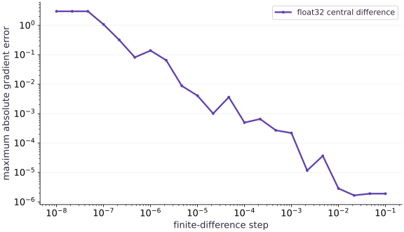

# Gradient checking and numerical accuracy

Phase 04: Math & optimization · about 80 minutes · CPU

## What you will be able to do

- Build an independent derivative estimate
- Separate truncation error from cancellation
- Test directions as well as coordinates
- Recognize what a gradient check cannot prove
- Do not mistake a kink for a smooth derivative

## The problem

JAX can differentiate your loss, but how can you check the answer independently? We’ll nudge one weight a little in each direction and compare the change in loss with the reported gradient. You’ll also see why making the nudge smaller and smaller eventually hurts a floating-point calculation.

## The idea

A finite difference estimates a derivative by comparing nearby function values. It gives us an independent check on autodiff, but it introduces its own approximation and floating-point errors. The perturbation must be small enough to be local and large enough to produce a resolvable difference.

## Explain why a smaller perturbation can be worse

For a centered difference, evaluate the function on both sides of the point, subtract, and divide by twice the perturbation. With a quadratic, the centered formula has an exact cancellation of its truncation term in real arithmetic. That special case should not be described as a universal error curve for every smooth function.

In floating point, the two function values can become almost indistinguishable as the perturbation shrinks. Subtracting them loses useful information, and dividing by a tiny number amplifies the error. The smallest perturbation is therefore not automatically the best check.

Read the saved error plot using its logarithmic axes and actual minimum region. Keep dtype, parameter scale and tolerance together. Compare several perturbations, then use an analytic derivative where available to decide whether disagreement comes from autodiff or the numerical oracle.

### Pause and reason

A gradient check fails only at the smallest perturbations. What should you try before changing the model?

<details><summary>Compare your reasoning</summary>

Inspect dtype and cancellation, increase the perturbation, and compare across a range. A fragile finite-difference estimate is not sufficient evidence that the autodiff gradient is wrong.

</details>

## Build an independent derivative estimate

Our objective is $(w_0-2)^2+(w_1+1)^2$. At $[0.5, 0.25]$, the derivative is $[-3, 2.5]$. This formula comes from elementary differentiation, so it can check the automatic result without invoking another autodiff API. The function returns a scalar because grad requires a scalar output.

Central differences probe each coordinate along a basis vector: hold all other coordinates fixed, evaluate at $w+h e_i$ and $w-h e_i$, then divide the difference by $2h$. vmap batches these independent probes; it does not make the approximation exact. In the formula, $e_i$ is a vector with a $1$ in position $i$ and zeros elsewhere. It lets us move just one weight while keeping the others fixed. The symbol $\approx$ reminds us that this is an estimate.

$$
\frac{\partial L}{\partial w_i}\approx\frac{L(w+h e_i)-L(w-h e_i)}{2h}
$$

## Separate truncation error from cancellation

For a general smooth function, central difference has an approximation error that typically shrinks quadratically with $h$ near a regular point. This quadratic objective is special: its central difference is exact in real arithmetic. Any discrepancy here mainly exposes floating-point effects. Do not use it alone to demonstrate a universal error curve.

Float32 cannot represent every nearby number. With an extremely small step, the two perturbed inputs can round to the same stored value. Subtracting their function values then gives zero rather than the derivative. A step sweep is evidence about this computation, not a recipe that works at every scale.

## Test directions as well as coordinates

A directional derivative compares $\nabla L(w)^\mathsf{T}v$ with a finite difference along the direction vector $v$. This is useful for large parameter trees because a few directions cost fewer evaluations than probing every scalar. It can miss an error orthogonal to all tested directions, so combine it with several points and known structural cases.

An allclose check permits absolute error near zero and relative error for larger values. Record the actual difference and dtype alongside a pass/fail result. Relaxing a tolerance until a broken calculation passes removes the value of the check.

## Recognize what a gradient check cannot prove

Autodiff differentiates the supplied program. If the loss accidentally omits a feature or uses the wrong targets, a perfect derivative check of that wrong loss can still pass. Compare expected predictions and loss values first, then derivatives.

At a kink such as `abs(0)`, a classical derivative does not exist. A symmetric finite difference can report zero while autodiff follows an implementation convention. Check smooth points on either side and document the boundary instead of treating the mismatch as automatic evidence of a JAX defect.

## Do not mistake a kink for a smooth derivative

The function $f(x)=|x|$ has slope $-1$ for negative inputs and $1$ for positive inputs. There is no classical derivative at zero because the one-sided slopes disagree. A symmetric finite difference at zero nevertheless returns zero. This is a property of the probe, not a proof of differentiability. For a piecewise model, first test points that stay inside a smooth region, then document the boundary convention separately.

## 1. Prepare the inputs

Create a file named main.py in your activated learning environment. Add these imports and inputs first. Shapes and numeric types are part of the experiment.

```python
# Step 1 — 1. Prepare the inputs: This block establishes the values used by the following steps; run...
# Import jax for this computation.
import jax
import jax.numpy as jnp
```

This block establishes the values used by the following steps; run the completed file after step $3$.

## 2. Define the computation

Append this block below the inputs. Before proceeding, trace which values are inputs, predictions, and state.

```python
# Step 2 — 2. Define the computation: Each row of basis perturbs one coordinate.
def objective(w):
    # Return `jnp.sum((w - jnp.array([2.0, -1.0])) ** 2)` to the caller.
    return jnp.sum((w - jnp.array([2., -1.])) ** 2)
# Initialize array `w` with explicit values and shape.
w = jnp.array([0.5, 0.25], dtype=jnp.float32)
# Evaluate `h` from the current inputs and state.
h = 1e-2
# Initialize array `basis` with explicit values and shape.
basis = jnp.eye(2)
# Vectorize across the batch dimension with `jax.vmap` (`finite`).
finite = jax.vmap(lambda e: (objective(w+h*e)-objective(w-h*e))/(2*h))(basis)
# Differentiate the objective to obtain `automatic` via automatic differentiation.
automatic = jax.grad(objective)(w)
# Initialize array `analytic` with explicit values and shape.
analytic = 2 * (w - jnp.array([2., -1.]))
```

Each row of basis perturbs one coordinate. vmap returns both central differences; automatic and analytic are separate references for comparison.

## 3. Measure and verify

Append the remaining block, then run python main.py in the terminal. Compare the printed result with the expected output below. Assertions stop execution if the contract fails.

```python
# Step 3 — 3. Measure and verify: Both gradients are approximately [-3., 2.5].
# Print the observed values to compare against the expected result.
print("Finite difference:", finite)
# Print diagnostic summary of the computed outputs.
print("Autodiff:", automatic)
# Verify that the numerical values match the expected reference within tolerance.
assert jnp.allclose(automatic, analytic)
# Verify that the output satisfies the expected shape, finite-value, or numerical contract.
assert jnp.allclose(finite, automatic, atol=2e-4, rtol=2e-4)
```

Both gradients are approximately $[-3., 2.5]$. The analytic and autodiff gradients agree; finite differences agree within tolerance.

## Run the example

```python
# Step 1 — 1. Prepare the inputs: This block establishes the values used by the following steps; run...
# Import jax for this computation.
import jax
import jax.numpy as jnp
# Step 2 — 2. Define the computation: Each row of basis perturbs one coordinate.
def objective(w):
    # Return `jnp.sum((w - jnp.array([2.0, -1.0])) ** 2)` to the caller.
    return jnp.sum((w - jnp.array([2., -1.])) ** 2)
# Initialize array `w` with explicit values and shape.
w = jnp.array([0.5, 0.25], dtype=jnp.float32)
# Evaluate `h` from the current inputs and state.
h = 1e-2
# Initialize array `basis` with explicit values and shape.
basis = jnp.eye(2)
# Vectorize across the batch dimension with `jax.vmap` (`finite`).
finite = jax.vmap(lambda e: (objective(w+h*e)-objective(w-h*e))/(2*h))(basis)
# Differentiate the objective to obtain `automatic` via automatic differentiation.
automatic = jax.grad(objective)(w)
# Initialize array `analytic` with explicit values and shape.
analytic = 2 * (w - jnp.array([2., -1.]))
# Step 3 — 3. Measure and verify: Both gradients are approximately [-3., 2.5].
# Print the observed values to compare against the expected result.
print("Finite difference:", finite)
# Print diagnostic summary of the computed outputs.
print("Autodiff:", automatic)
# Verify that the numerical values match the expected reference within tolerance.
assert jnp.allclose(automatic, analytic)
# Verify that the output satisfies the expected shape, finite-value, or numerical contract.
assert jnp.allclose(finite, automatic, atol=2e-4, rtol=2e-4)
```

Expected: Both gradients are approximately $[-3., 2.5]$. The analytic and autodiff gradients agree; finite differences agree within tolerance.

## Smaller perturbations eventually lose accuracy

**Predict:** Will shrinking the finite-difference step always improve the answer?



**Recorded CPU computation**

### Read the figure

The horizontal axis is the finite-difference step $h$, increasing from left to right. The vertical axis is the largest absolute discrepancy between the numerical gradient and the analytic gradient. Both axes are logarithmic: a change by one power of ten represents a tenfold change, not an equal additive increment.

At the smallest steps, the error stays near $3$. Moving right to steps around $10^{-2}$ brings it down to a few times $10^{-6}$, with small irregular rises along the way. All displayed errors are positive; none of the plotted estimates is exactly equal to the analytic gradient.

### Connect it to the computation

At very small steps, float32 rounding makes the two nearby function evaluations indistinguishable or nearly so. Their subtraction then loses the change we are trying to measure. Dividing that damaged difference by an even smaller step does not repair it. The left-hand plateau is therefore a failure of the numerical estimate, not evidence that autodiff is wrong.

This particular objective is quadratic, so a central difference has no truncation error in exact arithmetic. Do not expect a pronounced U-shaped error curve on the right of this example. For a general nonlinear objective, overly large steps can introduce truncation error too. Check several step sizes and look for agreement across a useful range, rather than choosing the smallest available step.

```python
# Compute figure data for: Smaller perturbations eventually lose accuracy
# Run `jnp.logspace` to compute `steps`.
steps = jnp.logspace(-8.0, -1.0, 22)
# Evaluate `errors` from the current inputs and state.
errors = []
# Loop over `h_plot` in `steps`:
for h_plot in steps:
    # Vectorize across the batch dimension without a Python loop (`estimate`).
    estimate = jax.vmap(lambda e: (objective(w + h_plot * e) - objective(w - h_plot * e)) / (2 * h_plot))(basis)
    # Reduce across the target axis to summarize ``.
    errors.append(float(jnp.max(jnp.abs(estimate - analytic))))
# Evaluate `visual_data` from the current inputs and state.
visual_data = {'kind': 'line', 'x': steps.tolist(), 'xscale': 'log', 'xlabel': 'finite-difference step', 'ylabel': 'maximum absolute gradient error', 'series': [{'label': 'float32 central difference', 'y': errors}]}
# Evaluate `visual_data['yscale']` from the current inputs and state.
visual_data['yscale'] = 'log'
```

## Recorded reference execution

CPU run: 2026-10-08T14:01:57.919503+00:00. JAX 0.9.2.

```text
Finite difference: [-2.9999971  2.4999976]
Autodiff: [-3.   2.5]
Finite difference: [-2.9999971  2.4999976]
Autodiff: [-3.   2.5]
h / max error: 0.1 1.9073486328125e-06
h / max error: 0.01 2.86102294921875e-06
h / max error: 0.0001 0.0004978179931640625
h / max error: 1e-08 3.0
PASS: optimization-02

```

## Sweep the perturbation size

**Predict before running:** Will $10^{-8}$ produce a more accurate estimate than $10^{-2}$ in float32?

```python
# Experiment — Sweep the perturbation size: Nearby float32 inputs can coincide, so reducing the step does...
# Iterate over `step_size` to step through the computation:
for step_size in [1e-1, 1e-2, 1e-4, 1e-8]:
    # Vectorize across the batch dimension with `jax.vmap` (`estimate`).
    estimate = jax.vmap(lambda e: (objective(w+step_size*e)-objective(w-step_size*e))/(2*step_size))(basis)
    # Print the observed values to compare against the expected result.
    print("h / max error:", step_size, float(jnp.max(jnp.abs(estimate-analytic))))
# Vectorize across the batch dimension with `jax.vmap` (`tiny`).
tiny = jax.vmap(lambda e: (objective(w+1e-8*e)-objective(w-1e-8*e))/(2e-8))(basis)
# Verify that the numerical values match the expected reference within tolerance.
assert not jnp.allclose(tiny, analytic, atol=1e-3)
```

**Expected:** The tiny-step check fails; exact intermediate errors depend on backend arithmetic.

Nearby float32 inputs can coincide, so reducing the step does not monotonically improve a check.

## Check a new direction

**Predict before running:** For direction $[1, -2]$, predict grad dot direction before evaluation.

```python
# Experiment — Check a new direction: A new projection supplies a separate numerical check, though it...
# Initialize array `direction` with explicit values and shape.
direction = jnp.array([1., -2.])
# Evaluate `directional` from the current inputs and state.
directional = (objective(w+h*direction)-objective(w-h*direction))/(2*h)
# Verify that the numerical values match the expected reference within tolerance.
assert jnp.allclose(directional, -8., atol=2e-4)
# Verify that the output satisfies the expected shape, finite-value, or numerical contract.
assert jnp.allclose(jnp.dot(automatic, direction), -8.)
```

**Expected:** Directional derivative $-8$ within tolerance.

A new projection supplies a separate numerical check, though it does not test every direction.

## A symmetric probe can hide a kink

**Predict before running:** What does a symmetric finite difference of $|x|$ report at $x=0$, and what do the one-sided slopes report?

```python
# Experiment — A symmetric probe can hide a kink: Agreement with one numerical probe can conceal nondifferentiability.
h_kink = 0.01
# Evaluate `symmetric` from the current inputs and state.
symmetric = (jnp.abs(h_kink)-jnp.abs(-h_kink))/(2*h_kink)
# Evaluate `left` from the current inputs and state.
left = (jnp.abs(0.)-jnp.abs(-h_kink))/h_kink
# Evaluate `right` from the current inputs and state.
right = (jnp.abs(h_kink)-jnp.abs(0.))/h_kink
# Verify that the numerical values match the expected reference within tolerance.
assert jnp.allclose(symmetric,0.)
# Verify that the output satisfies the expected shape, finite-value, or numerical contract.
assert jnp.allclose(left,-1.) and jnp.allclose(right,1.)
# Verify that the output satisfies the expected shape, finite-value, or numerical contract.
assert jnp.allclose(jax.grad(jnp.abs)(jnp.array(-2.)),-1.)
# Verify that the output satisfies the expected shape, finite-value, or numerical contract.
assert jnp.allclose(jax.grad(jnp.abs)(jnp.array(2.)),1.)
```

**Expected:** The symmetric estimate is $0$; left and right slopes are $-1$ and $1$.

Agreement with one numerical probe can conceal nondifferentiability. Choose probes that test the assumption your claim needs.

## Make it yours

Check the gradient again at $w=[2., -1.]$. Explain why this checks a minimum but does not prove correctness everywhere.

### How to write this exercise — Step-by-step recipe & starter scaffold

**Key functions & syntax to use:**
- `jnp.array(values, dtype=...)` — Constructs an immutable device-backed JAX array from Python/NumPy values.
- `jnp.zeros / jnp.ones(shape, dtype=...)` — Allocates a tensor of the given `shape` initialized with constants.
- `jnp.allclose(actual, expected, rtol=..., atol=...)` — Checks that two arrays match elementwise within floating-point tolerance.
- `jax.grad(loss_fn)(params, ...)` — Transforms a scalar-output function into a function returning the gradient PyTree with the same structure as `params`.

**Step-by-step implementation plan:**
1. Initialize array `minimum` with explicit values and shape.
2. Verify that the numerical values match the expected reference within tolerance.
3. Verify that the output satisfies the expected shape, finite-value, or numerical contract.

**Starter code scaffold (fill in the TODOs):**

```python
# Exercise solution: Check the gradient again at w=[2., -1.].
# Initialize array `minimum` with explicit values and shape.
minimum = jnp.array(...)  # TODO: compute minimum
# Verify that the numerical values match the expected reference within tolerance.
assert jnp.allclose(jax.grad(objective)(minimum), jnp.zeros(2))  # TODO: complete assertion check
# Verify that the output satisfies the expected shape, finite-value, or numerical contract.
assert jnp.allclose(objective(minimum), 0.)  # TODO: complete assertion check
```

<details><summary>Reference solution</summary>

```python
# Exercise solution: Check the gradient again at w=[2., -1.].
# Initialize array `minimum` with explicit values and shape.
minimum = jnp.array([2., -1.])
# Verify that the numerical values match the expected reference within tolerance.
assert jnp.allclose(jax.grad(objective)(minimum), jnp.zeros(2))
# Verify that the output satisfies the expected shape, finite-value, or numerical contract.
assert jnp.allclose(objective(minimum), 0.)
```

</details>

## Move to a different smooth objective

**Transfer / diagnosis**

Check the derivative of `sum(sin(z))` at $[0.2, -0.7]$ using cosine and central differences.

<details><summary>Hint</summary>

Use cosine as the analytic reference; here truncation error also matters.

</details>

### How to write: Move to a different smooth objective — Step-by-step recipe & starter scaffold

**Key functions & syntax to use:**
- `jnp.array(values, dtype=...)` — Constructs an immutable device-backed JAX array from Python/NumPy values.
- `jnp.zeros / jnp.ones(shape, dtype=...)` — Allocates a tensor of the given `shape` initialized with constants.
- `x.sum(axis=...) / x.mean(axis=..., keepdims=...)` — Reduces values along the named `axis` (the axis you name is collapsed unless `keepdims=True`).
- `jnp.allclose(actual, expected, rtol=..., atol=...)` — Checks that two arrays match elementwise within floating-point tolerance.

**Step-by-step implementation plan:**
1. Initialize array `z` with explicit values and shape.
2. Function `trig_loss(z)` implementing this stage's computation:
3. Return `jnp.sum(jnp.sin(z))` to the caller.
4. Vectorize across the batch dimension with `jax.vmap` (`fd`).
5. Verify that the numerical values match the expected reference within tolerance.

**Starter code scaffold (fill in the TODOs):**

```python
# Move to a different smooth objective (Transfer / diagnosis): The analytic reference checks a nonquadratic function at a...
# Initialize array `z` with explicit values and shape.
z = jnp.array(...)  # TODO: compute z
# Function `trig_loss(z)` implementing this stage's computation:
def trig_loss(z):
    # Return `jnp.sum(jnp.sin(z))` to the caller.
    return ...  # TODO: return computed result
# Vectorize across the batch dimension with `jax.vmap` (`fd`).
fd = jax.vmap(...)  # TODO: compute fd
# Verify that the numerical values match the expected reference within tolerance.
assert jnp.allclose(jax.grad(trig_loss)(z), jnp.cos(z))  # TODO: complete assertion check
# Verify that the output satisfies the expected shape, finite-value, or numerical contract.
assert jnp.allclose(fd, jnp.cos(z), atol=5e-5, rtol=5e-5)  # TODO: complete assertion check
```

<details><summary>Reference solution and reasoning</summary>

```python
# Move to a different smooth objective (Transfer / diagnosis): The analytic reference checks a nonquadratic function at a...
# Initialize array `z` with explicit values and shape.
z = jnp.array([0.2, -0.7])
# Function `trig_loss(z)` implementing this stage's computation:
def trig_loss(z):
    # Return `jnp.sum(jnp.sin(z))` to the caller.
    return jnp.sum(jnp.sin(z))
# Vectorize across the batch dimension with `jax.vmap` (`fd`).
fd = jax.vmap(lambda e: (trig_loss(z+1e-2*e)-trig_loss(z-1e-2*e))/(2e-2))(jnp.eye(2))
# Verify that the numerical values match the expected reference within tolerance.
assert jnp.allclose(jax.grad(trig_loss)(z), jnp.cos(z))
# Verify that the output satisfies the expected shape, finite-value, or numerical contract.
assert jnp.allclose(fd, jnp.cos(z), atol=5e-5, rtol=5e-5)
```

The analytic reference checks a nonquadratic function at a new point.

</details>

## Catch the wrong objective despite correct gradients

**Transfer / diagnosis**

A model is meant to use both coordinates. Show that an objective omitting the second coordinate has a correct derivative for itself but fails the intended analytic reference. Repair it.

<details><summary>Hint</summary>

Differentiate $(z_0-2)^2$ and compare both coordinates.

</details>

### How to write: Catch the wrong objective despite correct gradients — Step-by-step recipe & starter scaffold

**Key functions & syntax to use:**
- `jnp.array(values, dtype=...)` — Constructs an immutable device-backed JAX array from Python/NumPy values.
- `jnp.allclose(actual, expected, rtol=..., atol=...)` — Checks that two arrays match elementwise within floating-point tolerance.
- `jax.grad(loss_fn)(params, ...)` — Transforms a scalar-output function into a function returning the gradient PyTree with the same structure as `params`.

**Step-by-step implementation plan:**
1. Return `(z[0] - 2.0) ** 2` to the caller.
2. Differentiate the objective to obtain `bad` via automatic differentiation.
3. Verify that the numerical values match the expected reference within tolerance.
4. Verify that the output satisfies the expected shape, finite-value, or numerical contract.
5. Verify that the output satisfies the expected shape, finite-value, or numerical contract.

**Starter code scaffold (fill in the TODOs):**

```python
# Catch the wrong objective despite correct gradients (Transfer / diagnosis): The omitted term is a specification error; numerical...
def incomplete(z):
    # Return `(z[0] - 2.0) ** 2` to the caller.
    return ...  # TODO: return computed result
# Differentiate the objective to obtain `bad` via automatic differentiation.
bad = jax.grad(...)  # TODO: compute bad
# Verify that the numerical values match the expected reference within tolerance.
assert jnp.allclose(bad, jnp.array([-3., 0.]))  # TODO: complete assertion check
# Verify that the output satisfies the expected shape, finite-value, or numerical contract.
assert not jnp.allclose(bad, analytic)  # TODO: complete assertion check
# Verify that the output satisfies the expected shape, finite-value, or numerical contract.
assert jnp.allclose(jax.grad(objective)(w), analytic)  # TODO: complete assertion check
```

<details><summary>Reference solution and reasoning</summary>

```python
# Catch the wrong objective despite correct gradients (Transfer / diagnosis): The omitted term is a specification error; numerical...
def incomplete(z):
    # Return `(z[0] - 2.0) ** 2` to the caller.
    return (z[0]-2.)**2
# Differentiate the objective to obtain `bad` via automatic differentiation.
bad = jax.grad(incomplete)(w)
# Verify that the numerical values match the expected reference within tolerance.
assert jnp.allclose(bad, jnp.array([-3., 0.]))
# Verify that the output satisfies the expected shape, finite-value, or numerical contract.
assert not jnp.allclose(bad, analytic)
# Verify that the output satisfies the expected shape, finite-value, or numerical contract.
assert jnp.allclose(jax.grad(objective)(w), analytic)
```

The omitted term is a specification error; numerical differentiation of the same incomplete loss would not expose it.

</details>

## Check your understanding

Does passing one gradient check prove a loss implementation is correct for all inputs?

1. Yes, autodiff is an oracle
2. No; it is evidence at tested inputs and must be combined with shape and objective checks
3. Only on TPU

<details><summary>Answer and explanation</summary>

No; it is evidence at tested inputs and must be combined with shape and objective checks

Independent gradient calculations help expose errors, but finite test cases do not prove all behavior.

</details>

## Diagnose the result

If the finite-difference check fails, sweep several step sizes before changing the model. Inspect dtype, reduction axes, and whether the point crosses a nonsmooth operation.

## Carry forward

- Nearby float32 inputs can coincide, so reducing the step does not monotonically improve a check.
- A new projection supplies a separate numerical check, though it does not test every direction.

## Keep your evidence

Save analytic and numerical derivatives, the step-size/error table with dtype, the nonquadratic transfer check, and the omitted-term failure/repair. Add the one-sided slopes showing why a symmetric probe cannot certify differentiability at a kink.

Save your predictions, modified code, terminal outputs, and reasoning in your engineering portfolio.

## Primary references

- [Automatic differentiation](https://docs.jax.dev/en/latest/automatic-differentiation.html)
- [JAX default dtypes](https://docs.jax.dev/en/latest/default_dtypes.html)

