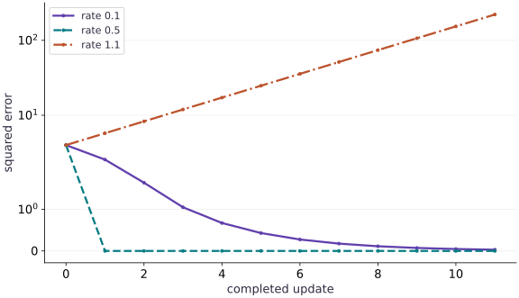

# Write gradient descent yourself

Phase 04: Math & optimization · about 80 minutes · CPU

## What you will be able to do

- Derive one update before writing the loop
- Read the learning rate through curvature
- Make the trajectory part of the state contract
- Diagnose dynamics instead of only the final number
- Use stopping evidence that survives rescaling

## The problem

You now have a loss and a gradient. Let’s use them to move a weight toward a better value. We’ll calculate the first two updates ourselves, turn the update into a loop, and try a step size that is too large. Watching the whole path will tell us more than looking only at the final loss.

## The idea

Gradient descent subtracts a scaled gradient from the current parameters. The gradient points toward local increase; its negative gives a local descent direction. A sufficiently large step can cross the useful local region and increase the loss instead.

## The sign tells you which way to step

Take $L(w)=(w-3)^2$, starting from $w=0$. The derivative is $-6$. With learning rate $0.1$, the update gives $w=0.6$, and the loss falls from $9$ to $5.76$. The negative derivative produces a positive parameter change because we subtract it.

With learning rate $1.1$, the first update jumps to $6.6$. The new loss is $12.96$, larger than the starting loss. The derivative was correct in both cases; the step length changed the outcome.

When the loss plot rises, inspect the parameter trajectory and update norm before changing the derivative implementation. Loss hides the side of the minimum on which the parameter lies. A signed trajectory exposes overshoot.

### Pause and reason

Does a correct gradient guarantee that any positive learning rate reduces the loss?

<details><summary>Compare your reasoning</summary>

No. The gradient describes local behavior. Step-size stability depends on the objective's curvature and the update rule; the worked large-step case increases the loss despite the correct derivative.

</details>

## Derive one update before writing the loop

Starting at $w=0$, our gradient is $-4$. Subtracting $0.1$ times $-4$ gives $w=0.4$, whose loss is $2.56$. A second step gives $w=0.72$ and loss $1.6384$. These two hand-computed steps check the sign, learning rate, and whether your history records loss before or after the update.

Define the error $e=w-2$. The next error is $(1-2\eta)e$. This recurrence explains the whole trajectory for this quadratic. An optimizer update must follow the negative gradient; adding it moves away from the minimum. The subscript $k$ counts updates. The symbol $\eta$ is the learning rate, and $e_k=w_k-2$ is the remaining error. Focus on the multiplier $1-2\eta$: its magnitude tells us whether this particular error shrinks.

$$
\begin{aligned}w_{k+1}&=w_k-\eta\,2(w_k-2)\\0&\longrightarrow0.4\longrightarrow0.72\quad(\eta=0.1)\\e_k&=(1-2\eta)^k e_0\end{aligned}
$$

## Read the learning rate through curvature

Rates between $0$ and $0.5$ approach the optimum without crossing it. A rate of $0.5$ reaches it in one ideal step. Rates between $0.5$ and $1$ alternate around the optimum with shrinking error. A rate of $1$ alternates forever; values above $1$ grow in magnitude. These statements follow from the error multiplier for this specific loss.

For $L=a(w-c)^2$ with positive a, the stable interval is $0<\eta<\frac{1}{a}$. Scaling a loss changes the curvature and the safe update scale. There is no universal threshold such as $0.1$ for neural networks.

## Make the trajectory part of the state contract

scan carries the current scalar parameter and stacks one post-update loss per iteration. Its carry must retain a fixed shape and dtype. Our finite step count is a Python integer at construction; if you wrap train in jit, that length must be static or you must choose a different loop formulation.

Keep initial loss separately so you can interpret the first history entry. For this implementation, history$[0]$ is $2.56$, not $4$. A graph without this convention can make two correct training loops look off by one.

## Diagnose dynamics instead of only the final number

Plotting or printing the first few weights and losses reveals a sign error or an overly aggressive step much earlier than waiting for NaN. In this small problem the recurrence is an independent oracle for all tested steps. In larger models use loss, gradient norm, update norm, dtype and finite-value checks.

A deterministic loop should not be “fixed” by changing a random seed. Reproduce the failing rate, derive its error multiplier, lower it according to the model curvature, and check both the trajectory and the endpoint.

## Use stopping evidence that survives rescaling

A small change in the weights does not prove convergence: it can mean the learning rate is tiny. For $L(w)=(w-2)^2$ at $w=0$, the gradient is $-4$. A rate of $10^{-8}$ changes the weight by only $4\times10^{-8}$, while it remains far from the solution. Inspect the objective, gradient magnitude, update magnitude and held-out behavior together. Relative tolerances can help across scales, but no single stopping test certifies a global optimum for a general nonconvex model.

## 1. Prepare the inputs

Create a file named main.py in your activated learning environment. Add these imports and inputs first. Shapes and numeric types are part of the experiment.

```python
import jax
import jax.numpy as jnp
```

This block establishes the values used by the following steps; run the completed file after step $3$.

## 2. Define the computation

Append this block below the inputs. Before proceeding, trace which values are inputs, predictions, and state.

```python
def loss(w):
    return (w - 2.) ** 2
def train(initial, rate, steps):
    def step(w, _):
        next_w = w - rate * jax.grad(loss)(w)
        return next_w, loss(next_w)
    return jax.lax.scan(step, jnp.array(initial), None, length=steps)
```

train defines a state transition that subtracts the derivative. scan retains the new parameter and records its post-update loss for exactly steps iterations.

## 3. Measure and verify

Append the remaining block, then run python main.py in the terminal. Compare the printed result with the expected output below. Assertions stop execution if the contract fails.

```python
final, history = train(0., 0.1, 60)
print("Final weight:", float(final))
print("Final loss:", float(history[-1]))
assert jnp.allclose(final, 2., atol=1e-4)
assert history[-1] < 1e-8
assert jnp.all(jnp.diff(history) <= 1e-7)
```

The weight approaches $2.0$ and the final loss is below $10^{-8}$.

## Run the example

```python
import jax
import jax.numpy as jnp
def loss(w):
    return (w - 2.) ** 2
def train(initial, rate, steps):
    def step(w, _):
        next_w = w - rate * jax.grad(loss)(w)
        return next_w, loss(next_w)
    return jax.lax.scan(step, jnp.array(initial), None, length=steps)
final, history = train(0., 0.1, 60)
print("Final weight:", float(final))
print("Final loss:", float(history[-1]))
assert jnp.allclose(final, 2., atol=1e-4)
assert history[-1] < 1e-8
assert jnp.all(jnp.diff(history) <= 1e-7)
```

Expected: The weight approaches $2.0$ and the final loss is below $10^{-8}$.

## Gradient descent trades step size for stability

**Predict:** Which rate will cause errors to grow rather than shrink?



**Recorded CPU computation**

### Read the figure

The horizontal axis counts completed updates, including the initial state at $0$. The vertical axis is squared error. It uses a symmetric-log scale: values near zero are on a linear region, while large values are compressed logarithmically. That lets the zero-loss trajectory remain visible.

All three curves begin at loss $4$. Learning rate $0.1$ decreases it gradually; rate $0.5$ reaches zero after one update and stays there. Rate $1.1$ increases it from $4$ to $5.76$, then beyond $200$ by the last plotted update.

### Connect it to the computation

Here the loss is $(w-2)^2$. One update multiplies the weight error $w-2$ by $1-2\eta$. The three rates therefore multiply that error by $0.8$, $0$, and $-1.2$, respectively. Squaring gives loss multipliers $0.64$, $0$, and $1.44$.

The large rate crosses the optimum and lands farther away on each step. The loss plot shows the growing distance, while the sign change follows from the update equation; loss alone does not reveal which side the weight is on. The one-step success of rate $0.5$ depends on this simple quadratic’s curvature and is not a universal best learning rate.

```python
rates = [0.1, 0.5, 1.1]
series = []
for rate_plot in rates:
    position_plot = jnp.array(0.0)
    losses = []
    for _ in range(12):
        losses.append(float((position_plot - 2) ** 2))
        position_plot = position_plot - rate_plot * 2 * (position_plot - 2)
    series.append({'label': 'rate ' + str(rate_plot), 'y': losses})
visual_data = {'kind': 'line', 'x': list(range(12)), 'xlabel': 'completed update', 'ylabel': 'squared error', 'yscale': 'symlog', 'series': series}
```

## Recorded reference execution

CPU run: 2026-10-06T21:57:00.092819+00:00. JAX 0.9.2.

```text
Final weight: 1.9999969005584717
Final loss: 9.606537787476555e-12
Final weight: 1.9999969005584717
Final loss: 9.606537787476555e-12
First two post-update losses: [2.5600002 1.6384   ]
PASS: optimization-03

```

## Check the first two steps

**Predict before running:** Does history contain the initial loss or the post-update loss?

```python
two_w, two_losses = train(0., 0.1, 2)
assert jnp.allclose(two_w, 0.72)
assert jnp.allclose(two_losses, jnp.array([2.56, 1.6384]))
print("First two post-update losses:", two_losses)
```

**Expected:** $[2.56, 1.6384]$, with final weight $0.72$.

A hand-derived trajectory checks update sign and the recording convention.

## Test the edge of stability

**Predict before running:** What does rate $1$ do after five steps from zero?

```python
edge_w, edge_losses = train(0., 1., 5)
assert jnp.allclose(edge_w, 4.)
assert jnp.allclose(edge_losses, jnp.full(5, 4.))
```

**Expected:** The weight alternates $0$ and $4$; loss remains $4$.

Magnitude-one error multipliers do not contract even though the loop remains finite.

## A tiny update far from the solution

**Predict before running:** Can a parameter-change threshold of $10^{-6}$ declare success while the gradient magnitude is $4$?

```python
far = jnp.array(0.)
quadratic = lambda value: (value-2.)**2
grad_far = jax.grad(quadratic)(far)
next_far = far - 1e-8*grad_far
assert jnp.abs(next_far-far)<1e-6
assert jnp.abs(grad_far)>3.
assert quadratic(next_far)>3.9
```

**Expected:** The update is below the threshold, but the objective is still near $4$.

A stopping rule must distinguish lack of progress from reaching a useful solution.

## Make it yours

Run ten steps with learning rate $1.1$. Predict whether the error contracts before executing; show evidence of divergence.

<details><summary>Reference solution</summary>

```python
unstable, unstable_history = train(0., 1.1, 10)
assert unstable_history[-1] > loss(0.)
assert abs(1 - 2 * 1.1) > 1
```

</details>

## Transfer the stability analysis

**Transfer / diagnosis**

For $4(w-3)^2$, derive a stable rate and verify convergence from zero.

<details><summary>Hint</summary>

The error multiplier is $1-8\eta$; use $\eta=0.1$.

</details>

<details><summary>Reference solution and reasoning</summary>

```python
def scaled_loss(w):
    return 4*(w-3.)**2
def scaled_step(w, _):
    new = w-0.1*jax.grad(scaled_loss)(w)
    return new, scaled_loss(new)
scaled_w, scaled_history = jax.lax.scan(scaled_step, jnp.array(0.), None, length=20)
assert jnp.allclose(scaled_w, 3., atol=1e-5)
assert jnp.all(jnp.diff(scaled_history) <= 1e-6)
```

Changing curvature changes the stability interval to $0<\eta<0.25$.

</details>

## Reproduce an uphill update and repair it

**Transfer / diagnosis**

Show how adding the gradient increases loss, then verify subtraction at the same starting point.

<details><summary>Hint</summary>

The derivative at zero is $-4$.

</details>

<details><summary>Reference solution and reasoning</summary>

```python
uphill = 0. + 0.1*jax.grad(loss)(0.)
downhill = 0. - 0.1*jax.grad(loss)(0.)
assert loss(uphill) > loss(0.)
assert loss(downhill) < loss(0.)
assert jnp.allclose(downhill, 0.4)
```

The sign error is isolated using the same input and rate; the repaired first step matches the analytic result.

</details>

## Check your understanding

What makes rate $1.1$ unstable for this particular quadratic?

1. The error multiplier has magnitude greater than one
2. scan cannot differentiate scalar weights
3. All learning rates above $0.01$ are unstable

<details><summary>Answer and explanation</summary>

The error multiplier has magnitude greater than one

The recurrence multiplies the error by $-1.2$, so its magnitude grows while its sign alternates.

</details>

## Diagnose the result

Record the loss trajectory and parameter values. An alternating, growing error here follows from the update equation; changing the PRNG seed cannot fix it.

## Carry forward

- A hand-derived trajectory checks update sign and the recording convention.
- Magnitude-one error multipliers do not contract even though the loop remains finite.

## Keep your evidence

Keep the two hand-computed steps, rate stability derivation, edge/divergent runs, scaled-curvature transfer and uphill-update repair. Include the tiny-update counterexample and explain your stopping criteria.

Keep predictions, modified code, observed results, and reasoning. A checkpoint alone does not demonstrate the exercise.

## Primary references

- [lax.scan contract](https://docs.jax.dev/en/latest/_autosummary/jax.lax.scan.html)
- [grad API](https://docs.jax.dev/en/latest/_autosummary/jax.grad.html)

