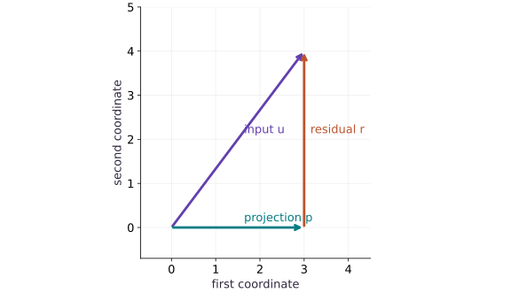

# Vectors, norms, and projections

Phase 04: Math & optimization · about 60 minutes · CPU

## What you will be able to do

- Read a dot product geometrically and separate a vector into a projection and an orthogonal residual.
- Read length and alignment separately
- Find the closest point on a line
- Use orthogonality as an independent check
- Know when the formula is undefined

## The problem

When a model multiplies features by weights, what is it measuring? Start with two arrows you can draw on paper. We will measure length, alignment and the part of one arrow that lies along the other. These ideas make regression and gradient directions easier to reason about.

## The idea

Projecting a vector onto a direction keeps the part parallel to that direction. The residual is what the direction cannot explain. This small geometric idea will reappear in least squares, gradient components and constrained updates.

## A projection explains what remains

Take $v=(3,4)$ and direction $u=(1,0)$. The projection is $(3,0)$, leaving residual $(0,4)$. Their sum recovers $v$, and the residual is perpendicular to $u$. The original norm is $5$, consistent with the right triangle.

Now replace $u$ by $(2,0)$. The direction has not changed, so the projected vector should not change. The coefficient must adjust for the direction's squared norm. Forgetting that denominator makes the result depend on an arbitrary scaling of the direction.

Read the vector figure by following the projection and then the residual to the original endpoint. Use equal axis scale: otherwise a mathematically right angle may not look right on the page.

### Pause and reason

What happens if the direction vector is zero?

<details><summary>Compare your reasoning</summary>

It defines no direction and has zero squared norm, so the usual projection formula is undefined. Reject that input or define a separate application-specific convention explicitly.

</details>

## Read length and alignment separately

Let $u=(3,4)$ and $a=(1,0)$. The length of $u$ is $5$, and $u^\mathsf{T}a=3$. The dot product is not a distance or a probability: reversing $a$ changes its sign. For nonzero vectors, dividing by both lengths gives the cosine of their angle, here $3/5$. In higher dimensions we use exactly the same sum, even when we cannot draw all the axes.

$$
\|u\|_2=\sqrt{\sum_i u_i^2},\qquad u^\mathsf{T}a=\sum_i u_i a_i
$$

## Find the closest point on a line

Points on the line through $a$ have the form $ca$, where $c$ is a scalar. Choose the point nearest $u$. Its coefficient is $c=(a^\mathsf{T}u)/(a^\mathsf{T}a)$. For our axis direction, $c=3$, so the projection is $p=(3,0)$ and the leftover is $r=u-p=(0,4)$. Notice that the coefficient depends on how long we draw $a$; the projected point does not.

$$
p=\frac{a^\mathsf{T}u}{a^\mathsf{T}a}a,\qquad r=u-p,\qquad a^\mathsf{T}r=0
$$

## Use orthogonality as an independent check

Orthogonal means perpendicular; algebraically, the dot product is zero. Because $p$ and $r$ are perpendicular, their squared lengths add to the squared length of $u$: $9+16=25$. We check both this identity and the leftover dot product. Matching a library projection to a copy of the same formula would give less independent evidence. For float32 calculations, a small absolute tolerance allows rounding near zero.

## Know when the formula is undefined

The zero vector has no direction. Projecting onto it would divide by $0$, and cosine similarity with it is also undefined. Our eager teaching helper raises a clear error for that input. A compiled application needs a separately defined policy, such as a validity mask or input validation before compilation. Adding a tiny constant silently changes the mathematical question; explain that policy if you choose it.

## Draw the two vectors

Create main.py in your activated CPU course environment. Add the vectors and verify their lengths before adding a projection.

```python
# Step 1 — Draw the two vectors: The length is 5; the component along the horizontal unit direction...
# Import jax.numpy for this computation.
import jax.numpy as jnp
# Construct `u` via `jnp.array([3.0, 4.0])`
u = jnp.array([3.0, 4.0])
# Construct `a` via `jnp.array([1.0, 0.0])`
a = jnp.array([1.0, 0.0])
# Verify that the numerical values match the expected reference within tolerance.
assert jnp.allclose(jnp.linalg.norm(u), 5.0)
# Check numerical equivalence within tolerance: `jnp.allclose(jnp.dot(u, a), 3.0)`
assert jnp.allclose(jnp.dot(u, a), 3.0)
```

The length is $5$; the component along the horizontal unit direction is $3$.

## Build the projection

Append this eager helper. Keep the input check outside any jitted function in this exercise.

```python
# Step 2 — Build the projection: The leftover r contains what the chosen direction cannot explain.
def project(u, a):
    # Run `jnp.dot` to compute `denominator`.
    denominator = jnp.dot(a, a)
    # Guard input contract (`float(denominator) == 0.0`) and fail fast if violated.
    if float(denominator) == 0.0:
        raise ValueError('Projection needs a nonzero direction')
    # Return `jnp.dot(a, u) / denominator * a` to the caller.
    return jnp.dot(a, u) / denominator * a
# Run `project` to compute `p`.
p = project(u, a)
# Compute `r` from `u - p`
r = u - p
```

The leftover $r$ contains what the chosen direction cannot explain.

## Check with geometry

Append these assertions and run python main.py. Compare with your drawing before reading the experiment.

```python
# Step 3 — Check with geometry: You should see [3,0] and [0,4]; the squared lengths sum to 25.
# Verify that the numerical values match the expected reference within tolerance.
assert jnp.allclose(p, jnp.array([3.0, 0.0]))
# Check numerical equivalence within tolerance: `jnp.allclose(jnp.dot(a, r), 0.0, atol=1e-06)`
assert jnp.allclose(jnp.dot(a, r), 0.0, atol=1e-06)
# Check numerical equivalence within tolerance: `jnp.allclose(jnp.dot(p, p) + jnp.dot(r, r), jnp.dot(u, u))`
assert jnp.allclose(jnp.dot(p, p) + jnp.dot(r, r), jnp.dot(u, u))
# Print the observed values to compare against the expected result.
print('projection / residual:', p, r)
```

You should see $[3,0]$ and $[0,4]$; the squared lengths sum to $25$.

## Run the example

```python
# Step 1 — Draw the two vectors: The length is 5; the component along the horizontal unit direction...
# Import jax.numpy for this computation.
import jax.numpy as jnp
# Construct `u` via `jnp.array([3.0, 4.0])`
u = jnp.array([3.0, 4.0])
# Construct `a` via `jnp.array([1.0, 0.0])`
a = jnp.array([1.0, 0.0])
# Verify that the numerical values match the expected reference within tolerance.
assert jnp.allclose(jnp.linalg.norm(u), 5.0)
# Check numerical equivalence within tolerance: `jnp.allclose(jnp.dot(u, a), 3.0)`
assert jnp.allclose(jnp.dot(u, a), 3.0)

# Step 2 — Build the projection: The leftover r contains what the chosen direction cannot explain.
def project(u, a):
    # Run `jnp.dot` to compute `denominator`.
    denominator = jnp.dot(a, a)
    # Guard input contract (`float(denominator) == 0.0`) and fail fast if violated.
    if float(denominator) == 0.0:
        raise ValueError('Projection needs a nonzero direction')
    # Return `jnp.dot(a, u) / denominator * a` to the caller.
    return jnp.dot(a, u) / denominator * a
# Run `project` to compute `p`.
p = project(u, a)
# Compute `r` from `u - p`
r = u - p

# Step 3 — Check with geometry: You should see [3,0] and [0,4]; the squared lengths sum to 25.
# Verify that the numerical values match the expected reference within tolerance.
assert jnp.allclose(p, jnp.array([3.0, 0.0]))
# Check numerical equivalence within tolerance: `jnp.allclose(jnp.dot(a, r), 0.0, atol=1e-06)`
assert jnp.allclose(jnp.dot(a, r), 0.0, atol=1e-06)
# Check numerical equivalence within tolerance: `jnp.allclose(jnp.dot(p, p) + jnp.dot(r, r), jnp.dot(u, u))`
assert jnp.allclose(jnp.dot(p, p) + jnp.dot(r, r), jnp.dot(u, u))
# Print the observed values to compare against the expected result.
print('projection / residual:', p, r)
```

Expected: Projection $[3,0]$, residual $[0,4]$. Both orthogonality and the length identity pass.

## Projection and leftover form a right triangle

**Predict:** Which part of $(3,4)$ is explained by the horizontal direction?



**Recorded CPU computation**

### Read the figure

Both axes are ordinary vector coordinates. The diagonal arrow goes from the origin to $u=(3,4)$. The horizontal arrow reaches the projection $p=(3,0)$, and the vertical arrow then goes from that point up to $u$.

Follow the horizontal and vertical arrows tip to tail: together they reproduce the diagonal arrow. Although the residual arrow is drawn starting at $(3,0)$, its displacement is $r=(0,4)$, not $(3,4)$.

### Connect it to the computation

We projected onto the horizontal direction. The residual is perpendicular to that direction, so its dot product with $(1,0)$ is zero. This right angle explains why moving the projection along the horizontal line cannot remove the remaining vertical error.

The lengths form a familiar check: $\lVert p\rVert=3$, $\lVert r\rVert=4$, and $\lVert u\rVert=5$, with $3^2+4^2=5^2$. Projection separates the part represented by the chosen direction from the part that direction cannot represent.

```python
# Compute figure data for: Projection and leftover form a right triangle
# Compute `visual_data` from `{'kind': 'vectors', 'arrows': [{'label': 'input u', ...`
visual_data = {'kind': 'vectors', 'arrows': [{'label': 'input u', 'start': [0, 0], 'end': u.tolist()}, {'label': 'projection p', 'start': [0, 0], 'end': p.tolist()}, {'label': 'residual r', 'start': p.tolist(), 'end': u.tolist()}]}
```

## Recorded reference execution

CPU run: 2026-10-08T14:01:46.335968+00:00. JAX 0.9.2.

```text
projection / residual: [3. 0.] [0. 4.]
projection / residual: [3. 0.] [0. 4.]
PASS: optimization-05

```

## Rescale the direction

**Predict before running:** If the direction becomes $2a$, does the projected point double?

```python
# Experiment — Rescale the direction: A line does not change when its nonzero direction is rescaled.
# Verify that the numerical values match the expected reference within tolerance.
assert jnp.allclose(project(u, 2 * a), p)
# Check numerical equivalence within tolerance: `jnp.allclose(project(u, -a), p)`
assert jnp.allclose(project(u, -a), p)
# Check numerical equivalence within tolerance: `jnp.allclose(jnp.dot(u, 2 * a), 2 * jnp.dot(u, a))`
assert jnp.allclose(jnp.dot(u, 2 * a), 2 * jnp.dot(u, a))
```

**Expected:** The projection stays fixed; the raw dot product doubles.

A line does not change when its nonzero direction is rescaled. A dot product alone does change.

## Rotate the line

**Predict before running:** For $a=(1,1)$, predict the projection coefficient and leftover.

```python
# Experiment — Rotate the line: Changing direction changes what can be explained; merely...
# Construct `diagonal` via `jnp.array([1.0, 1.0])`
diagonal = jnp.array([1.0, 1.0])
# Run `project` to compute `p2`.
p2 = project(u, diagonal)
# Verify that the numerical values match the expected reference within tolerance.
assert jnp.allclose(p2, jnp.array([3.5, 3.5]))
# Check numerical equivalence within tolerance: `jnp.allclose(jnp.dot(diagonal, u - p2), 0.0, atol=1e-06)`
assert jnp.allclose(jnp.dot(diagonal, u - p2), 0.0, atol=1e-06)
```

**Expected:** Projection $[3.5,3.5]$, residual $[-0.5,0.5]$.

Changing direction changes what can be explained; merely changing its length does not.

## Make it yours

Project $u=(2,-1,2)$ onto $a=(1,0,1)$. Check the residual by hand first.

### How to write this exercise — Step-by-step recipe & starter scaffold

**Key functions & syntax to use:**
- `jnp.array(values, dtype=...)` — Constructs an immutable device-backed JAX array from Python/NumPy values.
- `jnp.allclose(actual, expected, rtol=..., atol=...)` — Checks that two arrays match elementwise within floating-point tolerance.

**Step-by-step implementation plan:**
1. Construct `u3` via `jnp.array([2.0, -1.0, 2.0])`
2. Construct `a3` via `jnp.array([1.0, 0.0, 1.0])`
3. Run `project` to compute `p3`.
4. Verify that the numerical values match the expected reference within tolerance.
5. Check numerical equivalence within tolerance: `jnp.allclose(jnp.dot(a3, u3 - p3), 0.0)`

**Starter code scaffold (fill in the TODOs):**

```python
# Exercise solution: Project u=(2,-1,2) onto a=(1,0,1).
# Construct `u3` via `jnp.array([2.0, -1.0, 2.0])`
u3 = jnp.array(...)  # TODO: compute u3
# Construct `a3` via `jnp.array([1.0, 0.0, 1.0])`
a3 = jnp.array(...)  # TODO: compute a3
# Run `project` to compute `p3`.
p3 = project(...)  # TODO: compute p3
# Verify that the numerical values match the expected reference within tolerance.
assert jnp.allclose(p3, jnp.array([2.0, 0.0, 2.0]))  # TODO: complete assertion check
# Check numerical equivalence within tolerance: `jnp.allclose(jnp.dot(a3, u3 - p3), 0.0)`
assert jnp.allclose(jnp.dot(a3, u3 - p3), 0.0)  # TODO: complete assertion check
```

<details><summary>Reference solution</summary>

```python
# Exercise solution: Project u=(2,-1,2) onto a=(1,0,1).
# Construct `u3` via `jnp.array([2.0, -1.0, 2.0])`
u3 = jnp.array([2.0, -1.0, 2.0])
# Construct `a3` via `jnp.array([1.0, 0.0, 1.0])`
a3 = jnp.array([1.0, 0.0, 1.0])
# Run `project` to compute `p3`.
p3 = project(u3, a3)
# Verify that the numerical values match the expected reference within tolerance.
assert jnp.allclose(p3, jnp.array([2.0, 0.0, 2.0]))
# Check numerical equivalence within tolerance: `jnp.allclose(jnp.dot(a3, u3 - p3), 0.0)`
assert jnp.allclose(jnp.dot(a3, u3 - p3), 0.0)
```

</details>

## Handle an undefined direction

**Transfer / diagnosis**

Show that a zero direction produces a clear input error instead of a misleading projection.

<details><summary>Hint</summary>

Use a try/except block; a silent successful result should fail the check.

</details>

### How to write: Handle an undefined direction — Step-by-step recipe & starter scaffold

**Key functions & syntax to use:**
- `direction(...)` — Call `direction` with your updated parameters or inputs from this lesson's workspace.
- `project(...)` — Call `project` with your updated parameters or inputs from this lesson's workspace.
- `assert condition` — Verify that the observed output shape, status, or numerical value satisfies the contract.

**Step-by-step implementation plan:**
1. Run the boundary check and catch the expected exception:

**Starter code scaffold (fill in the TODOs):**

```python
# Handle an undefined direction (Transfer / diagnosis): Rejecting an undefined input is part of the function contract.
# Run the boundary check and catch the expected exception:
try:
    project(u, jnp.zeros_like(a))
except ValueError as exc:
    assert 'nonzero'  # TODO: complete assertion check
else:
    raise AssertionError('Zero direction was accepted')
```

<details><summary>Reference solution and reasoning</summary>

```python
# Handle an undefined direction (Transfer / diagnosis): Rejecting an undefined input is part of the function contract.
# Run the boundary check and catch the expected exception:
try:
    project(u, jnp.zeros_like(a))
except ValueError as exc:
    assert 'nonzero' in str(exc)
else:
    raise AssertionError('Zero direction was accepted')
```

Rejecting an undefined input is part of the function contract.

</details>

## Use two perpendicular directions

**Transfer / diagnosis**

Reconstruct $u$ from projections onto $(1,1)$ and $(1,-1)$. Would adding independent projections still work for arbitrary nonorthogonal directions?

<details><summary>Hint</summary>

Check the directions have zero dot product. Nonorthogonal directions can count the same component twice.

</details>

### How to write: Use two perpendicular directions — Step-by-step recipe & starter scaffold

**Key functions & syntax to use:**
- `jnp.array(values, dtype=...)` — Constructs an immutable device-backed JAX array from Python/NumPy values.
- `jnp.allclose(actual, expected, rtol=..., atol=...)` — Checks that two arrays match elementwise within floating-point tolerance.

**Step-by-step implementation plan:**
1. Construct `a1` via `jnp.array([1.0, 1.0])`
2. Construct `a2` via `jnp.array([1.0, -1.0])`
3. Verify that the numerical values match the expected reference within tolerance.
4. Check numerical equivalence within tolerance: `not jnp.allclose(project(u, a) + project(u, a1), u)`

**Starter code scaffold (fill in the TODOs):**

```python
# Use two perpendicular directions (Transfer / diagnosis): Adding separate projections reconstructs a vector in an...
# Construct `a1` via `jnp.array([1.0, 1.0])`
a1 = jnp.array(...)  # TODO: compute a1
# Construct `a2` via `jnp.array([1.0, -1.0])`
a2 = jnp.array(...)  # TODO: compute a2
# Verify that the numerical values match the expected reference within tolerance.
assert jnp.allclose(project(u, a1) + project(u, a2), u)  # TODO: complete assertion check
# Check numerical equivalence within tolerance: `not jnp.allclose(project(u, a) + project(u, a1), u)`
assert not jnp.allclose(project(u, a) + project(u, a1), u)  # TODO: complete assertion check
```

<details><summary>Reference solution and reasoning</summary>

```python
# Use two perpendicular directions (Transfer / diagnosis): Adding separate projections reconstructs a vector in an...
# Construct `a1` via `jnp.array([1.0, 1.0])`
a1 = jnp.array([1.0, 1.0])
# Construct `a2` via `jnp.array([1.0, -1.0])`
a2 = jnp.array([1.0, -1.0])
# Verify that the numerical values match the expected reference within tolerance.
assert jnp.allclose(project(u, a1) + project(u, a2), u)
# Check numerical equivalence within tolerance: `not jnp.allclose(project(u, a) + project(u, a1), u)`
assert not jnp.allclose(project(u, a) + project(u, a1), u)
```

Adding separate projections reconstructs a vector in an orthogonal basis. Correlated feature directions require a joint least-squares solve.

</details>

## Check your understanding

Does doubling a nonzero direction double the projection onto its line?

1. Yes, because the dot product doubles
2. No; the coefficient and direction rescale in opposite ways
3. Only when the vectors are perpendicular

<details><summary>Answer and explanation</summary>

No; the coefficient and direction rescale in opposite ways

The line is unchanged, so its closest point is unchanged. The coefficient absorbs the rescaling.

</details>

## Diagnose the result

If the leftover is not perpendicular, check the denominator: it is $a^\mathsf{T}a$, not the length of $a$. If cosine exceeds its expected range, check normalization and rounding; first reject zero-length inputs.

## Carry forward

- A line does not change when its nonzero direction is rescaled. A dot product alone does change.
- Changing direction changes what can be explained; merely changing its length does not.

## Keep your evidence

Keep the hand-computed projection, perpendicular-residual check, rescaling experiment, zero-direction repair and changed-basis calculation.

Save your predictions, modified code, terminal outputs, and reasoning in your engineering portfolio.

## Primary references

- [JAX vector norms](https://docs.jax.dev/en/latest/_autosummary/jax.numpy.linalg.norm.html)
- [MIT: projections and least squares](https://ocw.mit.edu/courses/18-06-linear-algebra-spring-2010/resources/lecture-16-projection-matrices-and-least-squares/)

