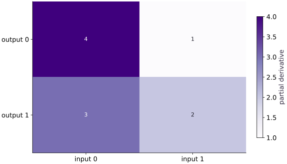

# The chain rule, Jacobians, and directions

Phase 04: Math & optimization · about 80 minutes · CPU

## What you will be able to do

- Compute a small Jacobian by hand and connect forward sensitivities to reverse-mode gradients.
- Build a Jacobian one entry at a time
- Push an input direction forward
- Pull output sensitivity backward
- Check both sides of the same calculation

## The problem

One model input can affect several outputs. How does a small input change move those outputs, and how does a loss send sensitivity back? We will work through one tiny vector function before asking JAX to do the same calculation.

## The idea

A derivative is a local sensitivity. For a vector function, collect the output-by-input sensitivities into a Jacobian. Forward mode applies it to an input direction. Reverse mode applies its transpose to output sensitivities. The chain rule connects these local calculations through a larger program.

## Build a Jacobian one entry at a time

Let $f(x)=(x_0^2+x_1,\;x_0x_1)$, where $x=(x_0,x_1)$. The first output changes at rates $2x_0$ and $1$; the second changes at rates $x_1$ and $x_0$. Rows describe outputs, columns describe inputs. At $x=(2,3)$, the output is $(7,6)$ and the Jacobian is $J=\begin{pmatrix}4&1\\3&2\end{pmatrix}$.

$$
J_{ij}=\frac{\partial f_i}{\partial x_j},\qquad J\in\mathbb{R}^{m\times d}\ \text{for}\ f:\mathbb{R}^d\to\mathbb{R}^m
$$

## Push an input direction forward

Choose $v=(1,-1)$. A small move $\varepsilon v$ in the input changes the output by approximately $\varepsilon Jv$. Here $Jv=(3,1)$: the first output moves three times as fast as the second along this direction. `jax.jvp` returns both the ordinary output and this directional sensitivity. It can compute the product without storing the full Jacobian.

$$
f(x+\varepsilon v)\approx f(x)+\varepsilon Jv
$$

## Pull output sensitivity backward

Suppose the scalar loss is $L(x)=\tfrac12\|f(x)\|_2^2$. Its derivative with respect to the outputs is $c=f(x)=(7,6)$. The chain rule gives $\nabla_x L=J^\mathsf{T}c=(46,19)$. `jax.vjp` returns the output and a pullback function. Passing $c$ into that function returns input sensitivities. The pullback result is a tuple because a function can have several inputs.

$$
\nabla_x L=J^\mathsf{T}\nabla_f L
$$

## Check both sides of the same calculation

The identity $c^\mathsf{T}(Jv)=v^\mathsf{T}(J^\mathsf{T}c)$ checks that forward and reverse products agree. We also compare against the hand matrix and central differences so our evidence is not only two autodiff APIs agreeing. `jax.grad` needs a scalar output; use a Jacobian or a selected output direction for a vector function. These local derivatives do not describe a large move exactly.

## Write the vector function

Create main.py. Define the function, its input and the hand-derived Jacobian.

```python
import jax
import jax.numpy as jnp

def f(x):
    return jnp.array([x[0] ** 2 + x[1], x[0] * x[1]])
x = jnp.array([2.0, 3.0])
v = jnp.array([1.0, -1.0])
J = jnp.array([[4.0, 1.0], [3.0, 2.0]])
assert jnp.allclose(f(x), jnp.array([7.0, 6.0]))
```

The matrix is written from the derivatives, not obtained from an autodiff call.

## Push a direction and pull a sensitivity

Append these two transformations; predict both products first.

```python
out, jv = jax.jvp(f, (x,), (v,))
_, pullback = jax.vjp(f, x)
c = out
jt_c = pullback(c)[0]
assert jnp.allclose(jv, jnp.array([3.0, 1.0]))
assert jnp.allclose(jt_c, jnp.array([46.0, 19.0]))
```

Forward mode follows an input direction; reverse mode starts with output sensitivity.

## Connect to a scalar loss

Append the scalar objective and independent matrix checks, then run python main.py.

```python
def loss(x):
    return 0.5 * jnp.sum(f(x) ** 2)
assert jnp.allclose(jax.jacfwd(f)(x), J)
assert jnp.allclose(jax.grad(loss)(x), J.T @ c)
assert jnp.allclose(jnp.dot(c, jv), jnp.dot(v, jt_c))
print('Jv / loss gradient:', jv, jt_c)
```

Both routes give directional loss derivative $27$.

## Run the example

```python
import jax
import jax.numpy as jnp

def f(x):
    return jnp.array([x[0] ** 2 + x[1], x[0] * x[1]])
x = jnp.array([2.0, 3.0])
v = jnp.array([1.0, -1.0])
J = jnp.array([[4.0, 1.0], [3.0, 2.0]])
assert jnp.allclose(f(x), jnp.array([7.0, 6.0]))

out, jv = jax.jvp(f, (x,), (v,))
_, pullback = jax.vjp(f, x)
c = out
jt_c = pullback(c)[0]
assert jnp.allclose(jv, jnp.array([3.0, 1.0]))
assert jnp.allclose(jt_c, jnp.array([46.0, 19.0]))

def loss(x):
    return 0.5 * jnp.sum(f(x) ** 2)
assert jnp.allclose(jax.jacfwd(f)(x), J)
assert jnp.allclose(jax.grad(loss)(x), J.T @ c)
assert jnp.allclose(jnp.dot(c, jv), jnp.dot(v, jt_c))
print('Jv / loss gradient:', jv, jt_c)
```

Expected: Forward product $[3,1]$, reverse product $[46,19]$, directional loss derivative $27$.

## A Jacobian maps inputs to output sensitivities

**Predict:** Which output is more sensitive to the first input at $(2,3)$?



**Recorded CPU computation**

### Read the figure

Rows identify output coordinates and columns identify input coordinates. Each cell is a partial derivative evaluated at the example input $(2,3)$. The matrix is $J=\begin{pmatrix}4&1\\3&2\end{pmatrix}$, and darker cells indicate larger positive sensitivity here.

Read down the first column: a small increase in input $0$, holding input $1$ fixed, changes the two outputs by approximately $4$ and $3$ times that increase. Read across the first row to see how both inputs influence output $0$.

### Connect it to the computation

For a joint input change in direction $v=(1,-1)$, multiply the whole matrix by that direction: $Jv=(3,1)$. The second input’s decrease offsets some of the first input’s increase. Looking only at the darkest cell would miss that interaction.

These are local sensitivities, not model weights, probabilities, or final output values. The entries can change at another input. To check the interpretation, take a small step $\epsilon v$ and compare the output change with $\epsilon Jv$.

```python
visual_data = {'kind': 'heatmap', 'values': jax.jacfwd(f)(x).tolist(), 'rows': ['output 0', 'output 1'], 'columns': ['input 0', 'input 1'], 'unit': 'partial derivative'}
```

## Recorded reference execution

CPU run: 2026-10-06T01:23:06.753454+00:00. JAX 0.9.2.

```text
Jv / loss gradient: [3. 1.] [46. 19.]
Jv / loss gradient: [3. 1.] [46. 19.]
PASS: optimization-07

```

## Check a finite input move

**Predict before running:** Does the central difference along $v$ agree with $Jv$ at step $0.01$?

```python
h = 0.01
fd = (f(x + h * v) - f(x - h * v)) / (2 * h)
assert jnp.allclose(fd, J @ v, atol=0.0001, rtol=0.0001)
```

**Expected:** The finite-direction and hand-matrix results agree within float32 tolerance.

A numerical perturbation provides a check independent of autodiff.

## Change the point

**Predict before running:** At $x=(0,1)$, which Jacobian entries change?

```python
x2 = jnp.array([0.0, 1.0])
J2 = jnp.array([[0.0, 1.0], [1.0, 0.0]])
assert jnp.allclose(jax.jacrev(f)(x2), J2)
assert jnp.allclose(jax.jvp(f, (x2,), (v,))[1], J2 @ v)
```

**Expected:** The new Jacobian swaps the direction coordinates.

The Jacobian describes sensitivity at the current point; it is not generally constant.

## Make it yours

Replace the scalar loss by $L(x)=f_0(x)+2f_1(x)$. Predict its gradient at $(2,3)$ before using `grad`.

<details><summary>Reference solution</summary>

```python
def weighted_loss(x):
    return f(x)[0] + 2 * f(x)[1]
assert jnp.allclose(jax.grad(weighted_loss)(x), jnp.array([10.0, 5.0]))
```

</details>

## Find the broken derivative path

**Transfer / diagnosis**

A colleague wraps the first input in `jax.lax.stop_gradient`. The forward outputs are unchanged. Show why the gradient no longer matches the intended mathematical function.

<details><summary>Hint</summary>

Compare the derivative of the sum of outputs with $J^\mathsf{T}(1,1)$.

</details>

<details><summary>Reference solution and reasoning</summary>

```python
def detached(x):
    a = jax.lax.stop_gradient(x[0])
    return jnp.array([a * a + x[1], a * x[1]])
assert jnp.allclose(detached(x), f(x))
assert jnp.allclose(jax.grad(lambda z: jnp.sum(detached(z)))(x), jnp.array([0.0, 3.0]))
assert jnp.allclose(jax.grad(lambda z: jnp.sum(f(z)))(x), jnp.array([7.0, 3.0]))
```

Equal forward values do not imply equal differentiation behavior when derivative rules are deliberately changed.

</details>

## Transfer to unequal dimensions

**Transfer / diagnosis**

For a matrix $A\in\mathbb{R}^{3\times2}$, check that the VJP of $Ax$ maps an output sensitivity of length $3$ into a vector of length $2$.

<details><summary>Hint</summary>

The reference is $A^\mathsf{T}c$, not $Ac$.

</details>

<details><summary>Reference solution and reasoning</summary>

```python
A = jnp.array([[1.0, 0.0], [0.0, 2.0], [1.0, 1.0]])
c3 = jnp.array([1.0, -1.0, 2.0])
_, back = jax.vjp(lambda z: A @ z, x)
assert back(c3)[0].shape == (2,)
assert jnp.allclose(back(c3)[0], jnp.array([3.0, 0.0]))
```

Unequal input and output dimensions make a mistaken transpose visible.

</details>

## Check your understanding

Which object does a reverse-mode pullback map to input sensitivity?

1. An output sensitivity vector
2. An arbitrary input direction
3. Only a scalar learning rate

<details><summary>Answer and explanation</summary>

An output sensitivity vector

A VJP multiplies an output sensitivity by the transposed Jacobian. A JVP instead propagates an input direction forward.

</details>

## Diagnose the result

If shapes fail, write output-by-input Jacobian dimensions on paper. If values match but derivatives do not, inspect stop_gradient, indexing, nondifferentiable operations and the scalar loss definition.

## Carry forward

- A numerical perturbation provides a check independent of autodiff.
- The Jacobian describes sensitivity at the current point; it is not generally constant.

## Keep your evidence

Keep the handwritten Jacobian, JVP and VJP checks, adjoint identity, finite-direction check and stop-gradient diagnosis.

Keep predictions, modified code, observed results, and reasoning. A checkpoint alone does not demonstrate the exercise.

## Primary references

- [JAX autodiff cookbook: JVPs and VJPs](https://docs.jax.dev/en/latest/301/cookbook.html)

