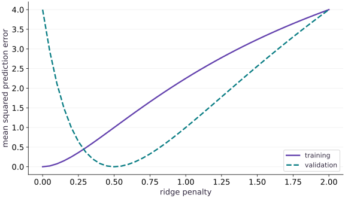

# Regularization and honest validation

Phase 04: Math & optimization · about 75 minutes · CPU

## What you will be able to do

- Derive a ridge solution, distinguish data loss from penalized loss, and select a penalty using held-out data.
- State the exact objective
- Work through shrinkage by hand
- Keep fitting, choosing and reporting separate
- Choose which parameters to penalize

## The problem

A model can fit the training data closely and still make poor predictions on new data. Can we trade a little training fit for a simpler model? We will make that tradeoff visible with a dataset small enough to solve by hand, while keeping the validation data separate from fitting.

## The idea

Regularization changes which solutions training prefers. Validation helps choose settings using data that did not fit the model, and a final test estimates performance after those choices are fixed. Keeping these jobs separate makes the reported result interpretable.

## Give each split one job

Imagine trying several penalty strengths. For each setting, fit weights on the training split, then score the frozen result on validation. Pick a setting using those validation results. Repeatedly using test performance to make that choice quietly turns the test into another validation set.

Preprocessing belongs inside the same boundary: fit means, scales and feature selection using training data only. Applying a transformation to validation is allowed; allowing validation to choose the transformation's fitted statistics changes the experiment.

The regularization plot may show training error improving while validation error worsens. That gap motivates model selection, but one small fixture does not prove a universal best penalty. Preserve split identities and the selection rule so another person can reconstruct the decision.

### Pause and reason

After selecting a penalty, you inspect the test score and change the penalty again. What has changed?

<details><summary>Compare your reasoning</summary>

The test data has influenced model selection. Its score no longer represents a single untouched final evaluation under the original protocol. Use a fresh evaluation protocol or disclose the repeated selection.

</details>

## State the exact objective

Let $n$ be the training sample count and $\lambda\ge0$ the penalty strength. We use mean squared error plus $\lambda\|w\|_2^2$, without a factor of one half. Differentiating gives $2X^\mathsf{T}(Xw-y)/n+2\lambda w$. Setting it to zero gives the linear system below. Other conventions change the numerical meaning of the same penalty value, so copy the objective along with a reported hyperparameter.

$$
L_\lambda(w)=\frac1n\|Xw-y\|_2^2+\lambda\|w\|_2^2,\qquad (X^\mathsf{T}X+n\lambda I)w=X^\mathsf{T}y
$$

## Work through shrinkage by hand

Train a slope without a bias on inputs $(-1,1)$ and targets $(-3,3)$. The data loss is $(w-3)^2$, so the ridge solution is $w=3/(1+\lambda)$. At $\lambda=0$, it fits the training slope $3$. At $\lambda=1/2$, it gives slope $2$. Our deliberately constructed validation targets follow slope $2$, making the tradeoff easy to inspect. Real validation curves are noisier and do not guarantee that positive regularization helps.

## Keep fitting, choosing and reporting separate

Fit weights on training examples for each candidate $\lambda$. Choose using validation prediction loss, not the training objective with its penalty. Validation targets must never enter the fit or preprocessing statistics. After many choices, validation itself can be overfit; a final untouched test set estimates the selected procedure. This tiny exercise has a training and validation split only, so its result is a demonstration, not a final generalization estimate.

## Choose which parameters to penalize

A bias can represent the overall target level, so many models exclude it from weight regularization. For an augmented parameter vector $(w,b)$, use a diagonal penalty mask with entries $(1,0)$. Scaling a feature also changes the size of its coefficient, and therefore the penalty. Standardize using training statistics when that matches your modeling choice, then reuse those statistics unchanged for validation and inference. Ridge adds curvature in penalized directions; it cannot repair leaked data or a wrong target.

## Create separate training and validation examples

Create main.py. Keep validation arrays separate from the solver inputs.

```python
import jax
import jax.numpy as jnp
X = jnp.array([[-1.0], [1.0]])
y = jnp.array([-3.0, 3.0])
Xv = jnp.array([[-2.0], [2.0]])
yv = jnp.array([-4.0, 4.0])

def ridge(X, y, lam):
    return jnp.linalg.solve(X.T @ X + X.shape[0] * lam * jnp.eye(X.shape[1]), X.T @ y)

def mse(w, X, y):
    return jnp.mean((X @ w - y) ** 2)
```

The helper solves the explicitly stated mean-loss convention. We use a small well-conditioned system here; this is not a general replacement for robust least-squares algorithms.

## Verify the penalized optimum

Append the hand solution and its gradient check.

```python
lam = 0.5
w = ridge(X, y, lam)
objective = lambda w: mse(w, X, y) + lam * jnp.dot(w, w)
assert jnp.allclose(w, jnp.array([2.0]), atol=1e-06)
assert jnp.allclose(jax.grad(objective)(w), jnp.zeros(1), atol=1e-06)
```

The data gradient and penalty gradient cancel at $w=2$.

## Separate the quantities you report

Append the three losses and run python main.py.

```python
train = mse(w, X, y)
validation = mse(w, Xv, yv)
penalized = objective(w)
assert jnp.allclose(jnp.array([train, validation, penalized]), jnp.array([1.0, 0.0, 3.0]))
print('train / validation / objective:', train, validation, penalized)
```

Training prediction loss is $1$, validation loss is $0$, and the penalized objective is $3$. They answer different questions.

## Run the example

```python
import jax
import jax.numpy as jnp
X = jnp.array([[-1.0], [1.0]])
y = jnp.array([-3.0, 3.0])
Xv = jnp.array([[-2.0], [2.0]])
yv = jnp.array([-4.0, 4.0])

def ridge(X, y, lam):
    return jnp.linalg.solve(X.T @ X + X.shape[0] * lam * jnp.eye(X.shape[1]), X.T @ y)

def mse(w, X, y):
    return jnp.mean((X @ w - y) ** 2)

lam = 0.5
w = ridge(X, y, lam)
objective = lambda w: mse(w, X, y) + lam * jnp.dot(w, w)
assert jnp.allclose(w, jnp.array([2.0]), atol=1e-06)
assert jnp.allclose(jax.grad(objective)(w), jnp.zeros(1), atol=1e-06)

train = mse(w, X, y)
validation = mse(w, Xv, yv)
penalized = objective(w)
assert jnp.allclose(jnp.array([train, validation, penalized]), jnp.array([1.0, 0.0, 3.0]))
print('train / validation / objective:', train, validation, penalized)
```

Expected: The regularized slope is $2$; data loss and penalized objective are reported separately.

## Training error and validation error select different penalties

**Predict:** Does the smallest training error imply the best validation result?



**Recorded CPU computation**

### Read the figure

The horizontal axis varies the ridge penalty $\lambda$. For each penalty, the model is fitted again. The vertical axis shows mean squared prediction error on training and validation data; it does not include the penalty term.

At $\lambda=0$, training error is zero and validation error is $4$. At $\lambda=0.5$, training error rises to $1$, but validation error falls to zero. Increasing the penalty to $2$ makes both errors $4$. The validation curve therefore has a minimum between the extremes.

### Connect it to the computation

The fitted weight is $w=3/(1+\lambda)$. The training targets favor slope $3$, while the validation targets in this constructed example favor slope $2$. Moderate shrinkage moves the model toward the validation relationship; too much shrinkage moves it past that relationship and toward underfitting.

Select the penalty using the validation minimum, not the intersection of the curves or the smallest training error. Here that choice is $0.5$. A zero validation error is a property of this tiny synthetic example, not a promise that regularization removes all error on real data.

```python
grid = jnp.linspace(0.0, 2.0, 41)
visual_data = {'kind': 'line', 'x': grid.tolist(), 'xlabel': 'ridge penalty', 'ylabel': 'mean squared prediction error', 'series': [{'label': 'training', 'y': [float(mse(ridge(X, y, float(a)), X, y)) for a in grid]}, {'label': 'validation', 'y': [float(mse(ridge(X, y, float(a)), Xv, yv)) for a in grid]}]}
```

## Recorded reference execution

CPU run: 2026-10-06T22:59:22.884932+00:00. JAX 0.9.2.

```text
train / validation / objective: 1.0 0.0 3.0
train / validation / objective: 1.0 0.0 3.0
penalty / train / validation: [0.  0.5 2. ] [0. 1. 4.] [4. 0. 4.]
PASS: optimization-10

```

## Sweep the penalty

**Predict before running:** Will the penalty with the lowest training error also have the lowest validation error?

```python
candidates = jnp.array([0.0, 0.5, 2.0])
fits = jnp.stack([ridge(X, y, float(a)) for a in candidates])
training = jnp.array([mse(a, X, y) for a in fits])
validation = jnp.array([mse(a, Xv, yv) for a in fits])
assert jnp.allclose(fits[:, 0], jnp.array([3.0, 2.0, 1.0]))
assert jnp.allclose(training, jnp.array([0.0, 1.0, 4.0]))
assert jnp.allclose(validation, jnp.array([4.0, 0.0, 4.0]))
assert int(jnp.argmin(training)) != int(jnp.argmin(validation))
print('penalty / train / validation:', candidates, training, validation)
```

**Expected:** Validation selects $\lambda=0.5$; training error prefers $\lambda=0$.

Regularization deliberately trades training fit against a preference for smaller weights.

## Duplicate the training set

**Predict before running:** If every training example is repeated, should the same mean-loss objective choose different weights?

```python
repeat = ridge(jnp.tile(X, (2, 1)), jnp.tile(y, 2), lam)
assert jnp.allclose(repeat, w, atol=1e-06)
```

**Expected:** The weights stay fixed.

Using a mean data loss keeps the penalty tradeoff unchanged under exact dataset duplication.

## Make it yours

For a target slope of $4$ and penalty $\lambda=1$, derive the fitted slope and verify its gradient.

<details><summary>Reference solution</summary>

```python
y4 = jnp.array([-4.0, 4.0])
w4 = ridge(X, y4, 1.0)
assert jnp.allclose(w4, jnp.array([2.0]))
assert jnp.allclose(jax.grad(lambda z: mse(z, X, y4) + jnp.dot(z, z))(w4), jnp.zeros(1), atol=1e-06)
```

</details>

## Do not accidentally shrink the intercept

**Transfer / diagnosis**

Fit constant targets $(5,5,5)$ using inputs $(-1,0,1)$ and a bias. Compare penalizing only the slope with penalizing both parameters at $\lambda=1$.

<details><summary>Hint</summary>

Use a diagonal mask $\operatorname{diag}(1,0)$.

</details>

<details><summary>Reference solution and reasoning</summary>

```python
x = jnp.array([-1.0, 0.0, 1.0])
A = jnp.stack([x, jnp.ones_like(x)], axis=1)
target = jnp.full((3,), 5.0)
mask = jnp.diag(jnp.array([1.0, 0.0]))
correct = jnp.linalg.solve(A.T @ A + 3 * mask, A.T @ target)
all_penalized = ridge(A, target, 1.0)
assert jnp.allclose(correct, jnp.array([0.0, 5.0]))
assert jnp.allclose(all_penalized, jnp.array([0.0, 2.5]))
```

The mask expresses a modeling choice: shrink feature effects while preserving the constant target level.

</details>

## Catch preprocessing leakage

**Transfer / diagnosis**

Training inputs are $(0,2)$ and validation input is $100$. Compare training-only centering with centering all inputs together. Which can be reused for a truly unseen example?

<details><summary>Hint</summary>

Fit the mean on training data; do not refit it on validation data.

</details>

<details><summary>Reference solution and reasoning</summary>

```python
train_x = jnp.array([0.0, 2.0])
val_x = jnp.array([100.0])
train_mean = jnp.mean(train_x)
leaked_mean = jnp.mean(jnp.concatenate([train_x, val_x]))
assert jnp.allclose(val_x - train_mean, jnp.array([99.0]))
assert not jnp.allclose(train_mean, leaked_mean)
assert jnp.allclose(jnp.mean(train_x - train_mean), 0.0)
```

Validation data must not influence fitted preprocessing. Reusing training statistics preserves the meaning of held-out evaluation.

</details>

## Check your understanding

Which loss should select the penalty in this exercise?

1. The penalized training objective alone
2. Unpenalized validation prediction loss
3. A repeatedly inspected final test loss

<details><summary>Answer and explanation</summary>

Unpenalized validation prediction loss

Validation compares predictive performance of candidates fitted on training data. A separate final test set is for reporting after selection.

</details>

## Diagnose the result

If increasing $\lambda$ improves the penalized objective but worsens predictions, check which quantity is being compared. Inspect the mean-versus-sum convention, bias mask, feature units and where preprocessing statistics were fitted.

## Carry forward

- Regularization deliberately trades training fit against a preference for smaller weights.
- Using a mean data loss keeps the penalty tradeoff unchanged under exact dataset duplication.

## Keep your evidence

Keep the ridge gradient/solve comparison, penalty sweep with separate train/validation losses, duplication check and bias-mask repair.

Keep predictions, modified code, observed results, and reasoning. A checkpoint alone does not demonstrate the exercise.

## Primary references

- [Stanford CS229 notes: regularization and model selection](https://cs229.stanford.edu/notes2022fall/main_notes.pdf)
- [JAX linear solve](https://docs.jax.dev/en/latest/_autosummary/jax.numpy.linalg.solve.html)

