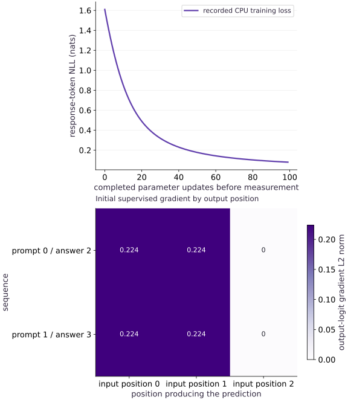

# Supervised fine-tuning with response-only token loss

Phase 18: Post-training: SFT, LoRA, reward models and RLHF · about 105 minutes · CPU

## What you will be able to do

- Align predictions with their target tokens
- Separate the attention mask from the loss mask
- Verify the changed-condition exercise and explain the limits of this fixture.

## The problem

A conversation contains instructions and an answer. If we want to teach answer behavior, which tokens should receive loss? We will shift targets explicitly and exclude prompt tokens without hiding the prompt from the model.

## The idea

Supervised fine-tuning teaches desired responses under a causal prediction objective. Response-only training scores selected target tokens while retaining prompt context. Correct token/role alignment determines which behavior the loss actually rewards.

## Shift the supervision with the target

Input position $t$ predicts target $t+1$. Therefore the response flag used for that loss must describe the target token. At a prompt/response boundary, using the input's flag instead can omit the first response target or score the wrong position.

A prompt position with no direct loss can still influence scored responses through causal attention. Its representations can participate in gradients. “Unscored” is not the same as “absent from computation.”

Aggregate by valid target tokens rather than averaging sequence or batch means blindly. The training plot demonstrates the fixture's masked objective; it is separate from instruction-following across unseen natural-language tasks.

### Pause and reason

Why can prompt-related parameters change during response-only training?

<details><summary>Compare your reasoning</summary>

The prompt influences scored response predictions through the computation. Removing direct loss at prompt positions does not remove all gradient paths through prompt context.

</details>

## Before coding: write the target table

For input tokens $[0,2,4]$, the model at the first position predicts $2$, and at the second predicts $4$. The last position has no target in this sequence. Mark the two targets as answer and end-of-answer, even though the first supervised prediction is made from a prompt token. Write input, next target and target-role mask as three aligned rows before touching the loss.

The model here is a transition table: each current token selects a row of vocabulary logits. It has no long-range attention and cannot distinguish two histories ending in the same token. This makes the shift easy to inspect while keeping the boundary between objective practice and instruction-following explicit.

## Align predictions with their target tokens

Logits at position $t$ predict token $t+1$. Therefore shift the role mask with the target IDs. A prompt position can produce a supervised logit when its next token begins the answer. Masking logits according to the input role instead would drop that first answer token.

## Separate the attention mask from the loss mask

The attention mask controls what the model sees; the response mask controls which predictions are scored. Prompt tokens must remain available as causal context even when predicting them is not the objective. Keep padding and packed-document boundaries out of valid targets. The final input position in this fixture has no next token and contributes no loss.

## Work through sums, counts and unequal answer lengths

Uniform probabilities over five tokens give negative log probability $\log 5$ at each supervised target. One supervised target contributes that amount; three targets contribute $3\log 5$. Dividing total negative log likelihood by total valid targets returns $\log5$ for either batch. The sum returned by response_logps is intentionally not already a mean.

Once probabilities differ, sequence weighting matters. If one answer has token loss $2$ and another has three losses of $1$, a token mean is $1.25$ while a sequence mean is $1.5$. During gradient accumulation, carry numerator and count. Averaging unequal microbatch means changes the training objective.

## Follow the first gradient to the prompt row

For a uniform five-class prediction with correct class $2$, softmax cross-entropy has derivative $-0.8$ for class $2$ and $0.2$ for each other class, before averaging across targets. The negative gradient increases the correct logit. The lookup row for prompt ID $0$ receives this signal because it predicts the first answer token. Excluding all prompt input positions would incorrectly discard that learning signal.

Do not confuse this with permission to inspect future answer tokens. A real causal Transformer must restrict attention independently of which targets count toward the loss. Changing the loss mask cannot repair a noncausal attention mask.

## Choose a reduction and keep its denominator

This lab sums negative log probabilities of response and end tokens, then divides by the total supervised token count. That is a token-weighted loss: longer answers have greater total influence. Equal weighting per sequence is a different objective. Decide deliberately and retain both sequence and token counts.

$$
L_{\mathrm{SFT}}=-\frac{\sum_{b,t}m_{b,t+1}\log p_\theta(x_{b,t+1}\mid x_{b,\le t})}{\sum_{b,t}m_{b,t+1}}
$$

## Fine-tune an identified base model

In a real run record the base checkpoint, tokenizer, chat template, data revision and special-token configuration. Demonstrations may contain personal or sensitive text; use data with appropriate permission and review. Split by source or conversation identity before formatting. This executable table starts from uniform logits to isolate the objective; the LoRA lesson separately trains and freezes a base model before adaptation.

## Check behavior and forgetting separately

A falling demonstration loss is not an instruction-following benchmark. Freeze a validation prompt set, compare answer quality under fixed decoding, and retain a base-task evaluation to detect forgetting. Do not tune prompt formatting or training duration against final test prompts.

## Why the tiny table is not enough for instruction following

Two sequences ending in the same prompt token select exactly the same table row, so they must receive the same next-token distribution. If their intended answers differ because of earlier context, this model cannot represent the task. Demonstrate that collision before replacing the table with a Transformer.

For a real SFT experiment, retain a base checkpoint, tokenizer, chat template and source-group split. Test the exact formatted strings and role spans, compare fixed decoding on held-out prompts, and measure a retained base task for forgetting. Packed sequences require document attention boundaries as well as masks; padding must never become a target merely because it shares an end-token ID.

## 1. Define sequence log-probability sums

Create main.py in your activated course environment. Paste this block, then run python main.py; function definitions alone print nothing.

```python
# Step 1 — 1. Define sequence log-probability sums: The slice removes the final logit and first token.
# Import jax for this computation.
import jax
import jax.numpy as jnp
import numpy as np

# Function `response_logps(logits, tokens, response_mask)` implementing this stage's computation:
def response_logps(logits, tokens, response_mask):
    # logits at t predict token t+1; the role mask belongs to the target token.
    logp = jax.nn.log_softmax(logits[:, :-1, :], axis=-1)
    # Run `jnp.take_along_axis` to compute `selected`.
    selected = jnp.take_along_axis(logp, tokens[:, 1:, None], axis=-1)[..., 0]
    # Return `jnp.sum(jnp.where(response_mask[:, 1:], selected, 0.0), axis=-1)` to the caller.
    return jnp.sum(jnp.where(response_mask[:, 1:], selected, 0.0), axis=-1)

# Function `validate_mask(selected, shape)` implementing this stage's computation:
def validate_mask(selected, shape):
    # Convert `a` to a host NumPy array for inspection or verification.
    a = np.asarray(selected)
    # Guard input contract (`a.shape != shape or a.dtype != np.bool_ or (not a.any())`) and fail fast if violated.
    if a.shape != shape or a.dtype != np.bool_ or not a.any():
        raise ValueError('a nonempty Boolean mask of the target shape is required')
```

The slice removes the final logit and first token. The role mask is shifted with targets, preserving supervision of the first answer token.

## 2. Align prompt, response and target masks

Append this block to main.py and run python main.py again. Keep the earlier blocks above it.

```python
# Token 0/1 is a prompt; 2/3 is its response; 4 marks the end.
tokens = jnp.array([[0, 2, 4], [1, 3, 4]], jnp.int32)
# Construct `roles` via `jnp.array([[False, True, True]] * 2)`
roles = jnp.array([[False, True, True]] * 2)
# Run `validate_mask` to perform the next check or state transition.
validate_mask(roles[:, 1:], tokens[:, 1:].shape)
# Construct `p` via `jnp.zeros((5, 5))`
p = jnp.zeros((5, 5))
# Compute `history` from `[]`
history = []

# Function `sft_objective(p)` implementing this stage's computation:
def sft_objective(p):
    # Return `-jnp.sum(response_logps(p[tokens], tokens, roles)) / jnp.sum(roles[:, 1:])` to the caller.
    return -jnp.sum(response_logps(p[tokens], tokens, roles)) / jnp.sum(roles[:, 1:])

# Differentiate the objective to obtain `step` via automatic differentiation.
step = jax.jit(jax.value_and_grad(sft_objective))
```

Inspect tokens and roles together. Every row has two valid next-token targets, so the loss denominator is four.

## 3. Fit the transition table and check the final position

Append this block to main.py and run python main.py again. Keep the earlier blocks above it.

```python
# Step 3 — 3. Fit the transition table and check the final position: The table learns only local transitions.
for _ in range(100):
    # Run `step` to compute `(value, g)`.
    value, g = step(p)
    # Append the current step result to `history`.
    history.append(float(value))
    # Compute `p` from `p - 0.5 * g`
    p = p - 0.5 * g

# Compute `np.testing.assert_allclose(history[0], np.log(5), atol` as `1e-6)`.
np.testing.assert_allclose(history[0], np.log(5), atol=1e-6)
# Assert invariant `history[-1] < 0.15` holds
assert history[-1] < 0.15
# Assert invariant `np.array_equal(np.argmax(np.asarray(p)[[0, 1]], axis=1), [2, 3])` holds
assert np.array_equal(np.argmax(np.asarray(p)[[0, 1]], axis=1), [2, 3])
# The final position predicts nothing and has no contribution.
base_logits = p[tokens]
# Compute `changed` from `base_logits.at[:, -1, :].set(100.0)`
changed = base_logits.at[:, -1, :].set(100.0)
# Execute `np.testing.assert_allclose(`
np.testing.assert_allclose(
    response_logps(changed, tokens, roles),
    response_logps(base_logits, tokens, roles),
)
# Print the observed values to compare against the expected result.
print('Response-only token NLL initial/final:', history[0], history[-1])
```

The table learns only local transitions. Its falling loss verifies these examples; the context-collision exercise exposes its architectural limit.

## Run the example

```python
# Step 1 — 1. Define sequence log-probability sums: The slice removes the final logit and first token.
# Import jax for this computation.
import jax
import jax.numpy as jnp
import numpy as np

# Function `response_logps(logits, tokens, response_mask)` implementing this stage's computation:
def response_logps(logits, tokens, response_mask):
    # logits at t predict token t+1; the role mask belongs to the target token.
    logp = jax.nn.log_softmax(logits[:, :-1, :], axis=-1)
    # Run `jnp.take_along_axis` to compute `selected`.
    selected = jnp.take_along_axis(logp, tokens[:, 1:, None], axis=-1)[..., 0]
    # Return `jnp.sum(jnp.where(response_mask[:, 1:], selected, 0.0), axis=-1)` to the caller.
    return jnp.sum(jnp.where(response_mask[:, 1:], selected, 0.0), axis=-1)

# Function `validate_mask(selected, shape)` implementing this stage's computation:
def validate_mask(selected, shape):
    # Convert `a` to a host NumPy array for inspection or verification.
    a = np.asarray(selected)
    # Guard input contract (`a.shape != shape or a.dtype != np.bool_ or (not a.any())`) and fail fast if violated.
    if a.shape != shape or a.dtype != np.bool_ or not a.any():
        raise ValueError('a nonempty Boolean mask of the target shape is required')

# Token 0/1 is a prompt; 2/3 is its response; 4 marks the end.
tokens = jnp.array([[0, 2, 4], [1, 3, 4]], jnp.int32)
# Construct `roles` via `jnp.array([[False, True, True]] * 2)`
roles = jnp.array([[False, True, True]] * 2)
# Run `validate_mask` to perform the next check or state transition.
validate_mask(roles[:, 1:], tokens[:, 1:].shape)
# Construct `p` via `jnp.zeros((5, 5))`
p = jnp.zeros((5, 5))
# Compute `history` from `[]`
history = []

# Function `sft_objective(p)` implementing this stage's computation:
def sft_objective(p):
    # Return `-jnp.sum(response_logps(p[tokens], tokens, roles)) / jnp.sum(roles[:, 1:])` to the caller.
    return -jnp.sum(response_logps(p[tokens], tokens, roles)) / jnp.sum(roles[:, 1:])

# Differentiate the objective to obtain `step` via automatic differentiation.
step = jax.jit(jax.value_and_grad(sft_objective))

# Step 3 — 3. Fit the transition table and check the final position: The table learns only local transitions.
for _ in range(100):
    # Run `step` to compute `(value, g)`.
    value, g = step(p)
    # Append the current step result to `history`.
    history.append(float(value))
    # Compute `p` from `p - 0.5 * g`
    p = p - 0.5 * g

# Compute `np.testing.assert_allclose(history[0], np.log(5), atol` as `1e-6)`.
np.testing.assert_allclose(history[0], np.log(5), atol=1e-6)
# Assert invariant `history[-1] < 0.15` holds
assert history[-1] < 0.15
# Assert invariant `np.array_equal(np.argmax(np.asarray(p)[[0, 1]], axis=1), [2, 3])` holds
assert np.array_equal(np.argmax(np.asarray(p)[[0, 1]], axis=1), [2, 3])
# The final position predicts nothing and has no contribution.
base_logits = p[tokens]
# Compute `changed` from `base_logits.at[:, -1, :].set(100.0)`
changed = base_logits.at[:, -1, :].set(100.0)
# Execute `np.testing.assert_allclose(`
np.testing.assert_allclose(
    response_logps(changed, tokens, roles),
    response_logps(base_logits, tokens, roles),
)
# Print the observed values to compare against the expected result.
print('Response-only token NLL initial/final:', history[0], history[-1])
```

Expected: Response-only loss decreases from log(5) to below 0.15.

## Supervised fine-tuning with response-only token loss — recorded experiment

**Predict:** Predict the zero-gradient column before looking at the heatmap. Does a prompt input position necessarily have zero gradient?



**Recorded CPU computation**

### Read the figure

The curve shows response-token mean negative log likelihood before each update. Uniform predictions start at $\log 5\approx1.609$, then fall to about $0.080$. It is the training loss of a five-token table, not a natural-language quality score.

The second panel is an initial-gradient audit, not another training curve. Rows are the two sequences and columns are positions producing logits. The first two columns have equal nonzero gradient norm because they predict answer and end tokens from uniform probabilities. The last column is zero because it has no next-token target. The first column belongs to a prompt input: its nonzero gradient is the evidence that the response mask was shifted with targets. This shows output-logit gradients, not all internal parameter gradients.

### Connect it to the computation

The table learns prompt-to-answer and answer-to-end transitions. The independent gradient check confirms the intended target shift, and the mask exercise changes which target positions count without removing prompt context.

```python
# Compute figure data for: Supervised fine-tuning with response-only token loss — recorded experiment
# Compute `visual_data` from `{'kind':'line','xlabel':'completed parameter updates...`
visual_data={'kind':'line','xlabel':'completed parameter updates before measurement','ylabel':'response-token NLL (nats)','series':[{'label':'recorded CPU training loss','x':list(range(len(history))),'y':history}]}
# Loop over `panel` in `visual_data.get('panels', [visual_data])`:
for panel in visual_data.get('panels',[visual_data]):
    # Compute `panel['x']` from `panel['series'][0]['x']`
    panel['x']=panel['series'][0]['x']

# Allocate initialized array `initial_output_grads` with the specified shape and dtype.
initial_output_grads=jax.grad(lambda values:-jnp.sum(response_logps(values,tokens,roles))/jnp.sum(roles[:,1:]))(jnp.zeros((2,3,5)))
# Convert `extra_panel` to a host NumPy array for inspection or verification.
extra_panel={'kind':'heatmap','values':np.asarray(jnp.linalg.norm(initial_output_grads,axis=-1)).tolist(),'rows':['prompt 0 / answer 2','prompt 1 / answer 3'],'columns':['input position 0','input position 1','input position 2'],'unit':'output-logit gradient L2 norm','xlabel':'position producing the prediction','ylabel':'sequence','title':'Initial supervised gradient by output position'}
# Compute `visual_data` from `{"panels":[*visual_data.get("panels",[visual_data]),...`
visual_data={"panels":[*visual_data.get("panels",[visual_data]),extra_panel]}
```

## Recorded reference execution

CPU run: 2026-10-08T14:07:58.604319+00:00. JAX 0.9.2.

```text
Response-only token NLL initial/final: 1.6094379425048828 0.07985548675060272
Response-only token NLL initial/final: 1.6094379425048828 0.07985548675060272
Prompt rows learn to predict first answers; the final end-token row has no target.
Supervised targets per sequence: [2 3]
Two first-response targets: 0.07894014567136765
No-target SFT batch rejected
Identical final tokens force identical table predictions despite different contexts.
PASS: posttraining-01

```

## Prove the target-mask shift

**Predict before running:** Which table rows should get gradients when only answer and end tokens are supervised?

```python
# Experiment — Prove the target-mask shift: The prediction made at the prompt position is supervised because...
# Differentiate the objective to obtain `g` via automatic differentiation.
g = jax.grad(sft_objective)(jnp.zeros((5, 5)))
# Assert that `np.linalg.norm(np.asarray(g)[0]) > 0 and np.linalg.norm(np.asarray(g)[1]) > 0`.
assert np.linalg.norm(np.asarray(g)[0]) > 0 and np.linalg.norm(np.asarray(g)[1]) > 0
# Convert `` to a host NumPy array for inspection or verification.
np.testing.assert_array_equal(np.asarray(g)[4], 0.0)
# Print the observed values to compare against the expected result.
print('Prompt rows learn to predict first answers; the final end-token row has no target.')
```

**Expected:** Rows for prompt IDs have nonzero gradients; the unused final-token row has zero gradient.

The prediction made at the prompt position is supervised because its target is an answer. Input-role masking would confuse context with target eligibility.

## Check a ragged batch against a scalar loop

**Predict before running:** Will independent token sums recover the response objective when answers have unequal lengths?

```python
# Experiment — Check a ragged batch against a scalar loop: Padding and role masks affect the target after shifting.
# Construct `ragged_tokens` via `jnp.array([[0, 2, 4, 4], [1, 3, 2, 4]])`
ragged_tokens = jnp.array([[0, 2, 4, 4], [1, 3, 2, 4]])
# Construct `ragged_roles` via `jnp.array([[False, True, True, False], [False, True,...`
ragged_roles = jnp.array([[False, True, True, False], [False, True, True, True]])
# Construct and reshape `ragged_logits` into the target tensor dimensions.
ragged_logits = jnp.arange(2 * 4 * 5, dtype=jnp.float32).reshape(2, 4, 5) / 19
# Run `response_logps` to compute `observed`.
observed = response_logps(ragged_logits, ragged_tokens, ragged_roles)
# Convert `arr` to a host NumPy array for inspection or verification.
arr = np.asarray(ragged_logits, dtype=np.float64)
# Compute `expected` from `[]`
expected = []
# Iterate over `row` to step through the computation:
for row in range(2):
    # Compute `total` from `0.0`
    total = 0.0
    # Iterate over `position` to step through the computation:
    for position in range(3):
        # Branch on condition `ragged_roles[row, position + 1]`:
        if ragged_roles[row, position + 1]:
            values = arr[row, position]
            log_normalizer = values.max() + np.log(np.exp(values - values.max()).sum())
            total += values[int(ragged_tokens[row, position + 1])] - log_normalizer
    # Append the current step result to `expected`.
    expected.append(total)
# Compute `np.testing.assert_allclose(observed, expected, atol` as `1e-6)`.
np.testing.assert_allclose(observed, expected, atol=1e-6)
# Print the observed values to compare against the expected result.
print('Supervised targets per sequence:', np.asarray(ragged_roles[:, 1:].sum(1)))
```

**Expected:** The target counts are two and three; scalar sequence sums match the vectorized implementation.

Padding and role masks affect the target after shifting. The host loop makes every included prediction explicit.

## Make it yours

Score only the first response token in each sequence and compare the resulting count and objective.

### How to write this exercise — Step-by-step recipe & starter scaffold

**Key functions & syntax to use:**
- `x.sum(axis=...) / x.mean(axis=..., keepdims=...)` — Reduces values along the named `axis` (the axis you name is collapsed unless `keepdims=True`).
- `jnp.isfinite(x)` — Returns a boolean mask verifying that no element is `NaN` or `Inf`.

**Step-by-step implementation plan:**
1. Aggregate array values to compute `value`.
2. Assert invariant `int(jnp.sum(first_only[:, 1:])) == 2` holds
3. Ensure all array elements remain finite: `np.isfinite(float(value))`
4. Print the observed values to compare against the expected result.

**Starter code scaffold (fill in the TODOs):**

```python
# Exercise solution: Score only the first response token in each sequence and compare the...
first_only = ...  # TODO: compute first_only
# Aggregate array values to compute `value`.
value = ...  # TODO: compute value
    first_only[:, 1:]
)
# Assert invariant `int(jnp.sum(first_only[:, 1:])) == 2` holds
assert int(jnp.sum(first_only[:, 1:]))  # TODO: complete assertion check
# Ensure all array elements remain finite: `np.isfinite(float(value))`
assert np.isfinite(float(value))  # TODO: complete assertion check
# Print the observed values to compare against the expected result.
print('Two first-response targets:', float(value))
```

<details><summary>Reference solution</summary>

```python
# Exercise solution: Score only the first response token in each sequence and compare the...
first_only = roles.at[:, 2].set(False)
# Aggregate array values to compute `value`.
value = -jnp.sum(response_logps(p[tokens], tokens, first_only)) / jnp.sum(
    first_only[:, 1:]
)
# Assert invariant `int(jnp.sum(first_only[:, 1:])) == 2` holds
assert int(jnp.sum(first_only[:, 1:])) == 2
# Ensure all array elements remain finite: `np.isfinite(float(value))`
assert np.isfinite(float(value))
# Print the observed values to compare against the expected result.
print('Two first-response targets:', float(value))
```

</details>

## Reject a batch with no answer targets

**Transfer**

Validate an all-prompt batch before computing the token average.

<details><summary>Hint</summary>

Use the shifted target mask, not the unshifted input mask.

</details>

### How to write: Reject a batch with no answer targets — Step-by-step recipe & starter scaffold

**Key functions & syntax to use:**
- `targets(...)` — Call `targets` with your updated parameters or inputs from this lesson's workspace.
- `validate_mask(...)` — Call `validate_mask` with your updated parameters or inputs from this lesson's workspace.

**Step-by-step implementation plan:**
1. Run the boundary check and catch the expected exception:

**Starter code scaffold (fill in the TODOs):**

```python
# Reject a batch with no answer targets (Transfer): An empty answer mask should trigger a clear skip/rejection...
# Run the boundary check and catch the expected exception:
try:
    validate_mask(jnp.zeros_like(roles[:, 1:]), tokens[:, 1:].shape)
except ValueError:
    print('No-target SFT batch rejected')
else:
    raise AssertionError('empty supervision accepted')
```

<details><summary>Reference solution and reasoning</summary>

```python
# Reject a batch with no answer targets (Transfer): An empty answer mask should trigger a clear skip/rejection...
# Run the boundary check and catch the expected exception:
try:
    validate_mask(jnp.zeros_like(roles[:, 1:]), tokens[:, 1:].shape)
except ValueError:
    print('No-target SFT batch rejected')
else:
    raise AssertionError('empty supervision accepted')
```

An empty answer mask should trigger a clear skip/rejection policy before the update; a fabricated zero objective disguises lost training data.

</details>

## Create a failure this model cannot fix

**Challenge**

Build two contexts ending in token zero but requiring different next tokens. Prove that the transition table gives identical distributions. Name the model capability needed to resolve the conflict.

<details><summary>Hint</summary>

Keep the final input token equal and change an earlier token.

</details>

### How to write: Create a failure this model cannot fix — Step-by-step recipe & starter scaffold

**Key functions & syntax to use:**
- `jnp.array(values, dtype=...)` — Constructs an immutable device-backed JAX array from Python/NumPy values.

**Step-by-step implementation plan:**
1. Construct `contexts` via `jnp.array([[1, 0], [3, 0]])`
2. Compute `last_logits` from `p[contexts[:, -1]]`
3. Execute `np.testing.assert_array_equal(last_logits[0], last_logits[1]`
4. Construct `conflicting_targets` via `jnp.array([2, 3])`
5. Assert invariant `conflicting_targets[0] != conflicting_targets[1]` holds

**Starter code scaffold (fill in the TODOs):**

```python
# Create a failure this model cannot fix (Challenge): A model that conditions on the earlier context can represent...
# Construct `contexts` via `jnp.array([[1, 0], [3, 0]])`
contexts = jnp.array(...)  # TODO: compute contexts
# Compute `last_logits` from `p[contexts[:, -1]]`
last_logits = ...  # TODO: compute last_logits
# Execute `np.testing.assert_array_equal(last_logits[0], last_logits[1]`
np.testing.assert_array_equal(last_logits[0], last_logits[1])
# Construct `conflicting_targets` via `jnp.array([2, 3])`
conflicting_targets = jnp.array(...)  # TODO: compute conflicting_targets
# Assert invariant `conflicting_targets[0] != conflicting_targets[1]` holds
assert conflicting_targets[0]  # TODO: complete assertion check
# Print the observed values to compare against the expected result.
print('Identical final tokens force identical table predictions despite different contexts.')
```

<details><summary>Reference solution and reasoning</summary>

```python
# Create a failure this model cannot fix (Challenge): A model that conditions on the earlier context can represent...
# Construct `contexts` via `jnp.array([[1, 0], [3, 0]])`
contexts = jnp.array([[1, 0], [3, 0]])
# Compute `last_logits` from `p[contexts[:, -1]]`
last_logits = p[contexts[:, -1]]
# Execute `np.testing.assert_array_equal(last_logits[0], last_logits[1]`
np.testing.assert_array_equal(last_logits[0], last_logits[1])
# Construct `conflicting_targets` via `jnp.array([2, 3])`
conflicting_targets = jnp.array([2, 3])
# Assert invariant `conflicting_targets[0] != conflicting_targets[1]` holds
assert conflicting_targets[0] != conflicting_targets[1]
# Print the observed values to compare against the expected result.
print('Identical final tokens force identical table predictions despite different contexts.')
```

A model that conditions on the earlier context can represent this distinction. More iterations on the same transition-table architecture cannot.

</details>

## Check your understanding

Should prompt inputs disappear when using response-only loss?

1. No. They remain context; only their target eligibility changes.
2. Yes. Masking a prompt token out of the loss also removes it from causal attention.
3. No, but the logit produced at the final prompt position must be excluded because its input role is prompt.

<details><summary>Answer and explanation</summary>

No. They remain context; only their target eligibility changes.

Attention visibility and supervised output positions are separate contracts.

</details>

## Diagnose the result

When the first answer token fails to learn, inspect the shifted mask. When answer length changes the metric, compare token versus sequence weighting and retain valid target counts.

## Carry forward

- Shift the role mask with target tokens $t+1$ so the prediction made at the last prompt position still supervises the first response token.
- Keep causal attention visibility separate from the response loss mask, and carry numerator and valid-target counts explicitly when answers have unequal lengths.

## Keep your evidence

Keep shifted target/role masks, valid response-token counts, gradient support and the changed target-selection result.

Save your predictions, modified code, terminal outputs, and reasoning in your engineering portfolio.

## Primary references

- [InstructGPT: supervised demonstrations and preference training](https://arxiv.org/abs/2203.02155)

