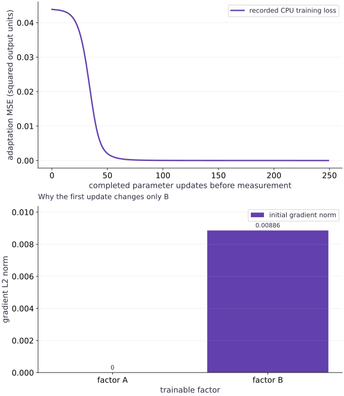

# LoRA: adapt, save and merge low-rank updates

Phase 18: Post-training: SFT, LoRA, reward models and RLHF · about 75 minutes · CPU

## What you will be able to do

- Separate the frozen base from trainable adapters
- Understand initialization and the first gradient
- Verify the changed-condition exercise and explain the limits of this fixture.

## The problem

A trained dense layer already works, but the task changes. Can we fit the change while leaving the original weights untouched? We will first train a base, then learn and audit a low-rank update.

## The idea

LoRA parameterizes a weight change as two smaller matrices. It reduces trainable parameter and optimizer-state counts for selected layers; it does not eliminate activation memory or guarantee a latency improvement. Our changed target is deliberately rank one, which makes the adaptation test exact and interpretable.

## Separate the frozen base from trainable adapters

For input-by-output weights $W_0$, let $A$ have shape $(d,r)$ and $B$ shape $(r,k)$. Compute the base output plus the scaled adapter output. Only the adapter tuple is passed to the gradient function. Keep a copy of $W_0$ and compare it exactly after training.

$$
Y=XW_0+\frac{\alpha}{r}XAB
$$

## Understand initialization and the first gradient

Initialize $A$ randomly and $B$ to zero. The initial adapter output is zero, so predictions match the base. At this first step the gradient with respect to $A$ is zero because it multiplies $B$; the gradient for $B$ can be nonzero. Initializing both factors to zero would block both gradients for this bilinear update.

## Count the right kind of savings

The fixture has $6\times4=24$ base weights and rank $1$, giving $6+4=10$ trainable adapter scalars. The base remains resident. Real memory includes gradients, optimizer state, activations and runtime buffers. A low-bit frozen base plus adapters also needs a quantization policy and supported kernels; this lab does not implement QLoRA.

## Merge only under an explicit serving contract

Without adapter dropout, an inference merge computes $W_{\mathrm{merged}}=W_0+(\alpha/r)AB$. Check outputs on changed inputs before deleting or replacing anything. Keep the unmerged base, adapter and scaling metadata; a second accidental merge adds the update twice. Packed or quantized bases require dequantization/requantization rules rather than a blind in-place add.

## Save the adaptation identity

An adapter artifact needs the base checkpoint hash, target module names, rank, alpha, dtype and exact factor arrays. Match all of these on load. Compare the adapted task and original task separately; low rank does not prevent forgetting, and this rank-one teacher does not predict the rank required by a real task.

## Run the example

```python
import jax
import jax.numpy as jnp
import numpy as np

def lora_forward(x, base, a, b, alpha=1.):
    rank = a.shape[1]
    return x @ base + (alpha/rank) * (x @ a @ b)

x=jnp.asarray(np.random.default_rng(4).normal(size=(24,6)),jnp.float32)
source_w=jnp.arange(24,dtype=jnp.float32).reshape(6,4)/40
base=jnp.zeros_like(source_w)
base_step=jax.jit(jax.grad(lambda w:jnp.mean((x@w-x@source_w)**2)))
for _ in range(150):base=base-.15*base_step(base)
assert float(jnp.mean((x@base-x@source_w)**2))<1e-4
frozen=np.asarray(base).copy()
u=jnp.array([[.2],[-.3],[.1],[.2],[-.1],[.4]])
v=jnp.array([[.5,-.2,.3,.1]])
target=x@(base+u@v)
a=jax.random.normal(jax.random.key(4),(6,1))*.1;b=jnp.zeros((1,4));params=(a,b)
loss=lambda ab:jnp.mean((lora_forward(x,base,*ab,alpha=1.)-target)**2)
step=jax.jit(jax.value_and_grad(loss));history=[]
initial_grads=step(params)[1]
np.testing.assert_array_equal(initial_grads[0],np.zeros((6,1)))
assert np.linalg.norm(initial_grads[1])>0
for _ in range(250):
    value,g=step(params);history.append(float(value));params=jax.tree.map(lambda a,b:a-.4*b,params,g)
a,b=params
assert history[-1]<history[0]*.02
np.testing.assert_array_equal(base,frozen)
merged=base+a@b
np.testing.assert_allclose(lora_forward(x,base,a,b),x@merged,rtol=1e-5,atol=1e-6)
print('LoRA initial/final:',history[0],history[-1],'; trainable:',a.size+b.size,'base:',base.size)

```

Expected: The trained base stays unchanged; 10 adapter scalars fit the rank-one change and merge equivalently.

## LoRA: adapt, save and merge low-rank updates — recorded experiment

**Predict:** Predict what should change during training and what this curve cannot establish.



**Recorded CPU computation**

### Read the figure

The plot is adaptation MSE before each update, falling from about $0.044$ to below $10^{-6}$. It does not include the preceding base-training run. The target update was constructed to have rank one, so this is an achievable representation test rather than a universal LoRA performance claim.

### Connect it to the computation

The first adapter update affects B; later updates can train both factors. The unchanged-base assertion, reloaded adapter and new-input merge comparison are separate evidence from the falling training line.

```python
visual_data={'kind':'line','xlabel':'completed parameter updates before measurement','ylabel':'training objective','series':[{'label':'recorded CPU training loss','x':list(range(len(history))),'y':history}]}
for panel in visual_data.get('panels',[visual_data]):
    panel['x']=panel['series'][0]['x']

```

## Recorded reference execution

CPU run: 2026-10-06T01:27:45.476362+00:00. JAX 0.9.2.

```text
LoRA initial/final: 0.043869297951459885 2.466217665642034e-07 ; trainable: 10 base: 24
Both zero factors produce zero first gradients.
Adapter round trip and merge checked.
New-input merge passes; accidental double merge changes outputs.
PASS: posttraining-02

```

## Show why two zero factors cannot start learning

**Predict before running:** If both factors start at zero, can this first-order update move either one?

```python
zero=(jnp.zeros_like(a),jnp.zeros_like(b))
zero_grad=jax.grad(loss)(zero)
assert all(np.array_equal(np.asarray(g),np.zeros(g.shape)) for g in zero_grad)
print('Both zero factors produce zero first gradients.')
```

**Expected:** Both factor gradients are exactly zero.

Each factor’s derivative contains the other factor. Randomizing one and zeroing the other preserves the initial base output without blocking the whole update.

## Make it yours

Save both adapter factors and their rank/scaling metadata, reload them and check merged versus unmerged predictions.

<details><summary>Reference solution</summary>

```python
import tempfile
from pathlib import Path
with tempfile.TemporaryDirectory() as folder:
    path=Path(folder)/'adapter.npz'
    np.savez(path,a=np.asarray(a),b=np.asarray(b),alpha=np.array(1.),rank=np.array(1))
    with np.load(path,allow_pickle=False) as z:
        assert int(z['rank'])==z['a'].shape[1]
        np.testing.assert_allclose(lora_forward(x,base,z['a'],z['b'],float(z['alpha'])),x@merged,atol=1e-6,rtol=1e-5)
print('Adapter round trip and merge checked.')
```

</details>

## Check the merge on new inputs

**Transfer**

Draw a new input batch and compare the merged layer with the adapter path.

<details><summary>Hint</summary>

The equivalence is algebraic, so a new input should still agree.

</details>

<details><summary>Reference solution and reasoning</summary>

```python
new_x=jnp.asarray(np.random.default_rng(91).normal(size=(7,6)),jnp.float32)
np.testing.assert_allclose(lora_forward(new_x,base,a,b),new_x@merged,atol=1e-6,rtol=1e-5)
assert np.linalg.norm(np.asarray(new_x@(base+2*a@b)-new_x@merged))>1e-3
print('New-input merge passes; accidental double merge changes outputs.')
```

The second check detects an operational merge error that training loss alone would not reveal.

</details>

## Check your understanding

Does LoRA require updating the base weights during adapter training?

1. No. The base is frozen; the selected adapter parameters receive updates.
2. A lower training loss by itself proves the full application is ready.
3. Matching shapes alone establishes the required behavior.

<details><summary>Answer and explanation</summary>

No. The base is frozen; the selected adapter parameters receive updates.

Freeze ownership should be checked in code, not inferred from an adapter-shaped parameter name.

</details>

## Diagnose the result

If neither factor moves, inspect initialization. If merged predictions drift, check factor orientation, rank scaling, dropout, base identity and accidental repeated merges.

## Keep your evidence

Keep base-training evidence, unchanged base arrays, adapter factors/rank/alpha, initial-gradient checks and reloaded/new-input merge parity.

Keep predictions, modified code, observed results, and reasoning. A checkpoint alone does not demonstrate the exercise.

## Primary references

- [LoRA](https://arxiv.org/abs/2106.09685)

