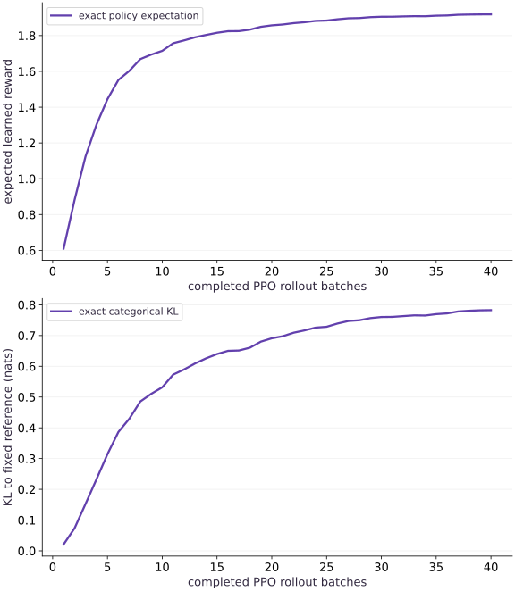

# RLHF mechanics: a frozen reward and PPO policy updates

Phase 18: Post-training: SFT, LoRA, reward models and RLHF · about 75 minutes · CPU

## What you will be able to do

- Keep three identities separate
- Collect actions before optimizing them
- Verify the changed-condition exercise and explain the limits of this fixture.

## The problem

After fitting a reward model, how do its scores change a policy? We will collect actual sampled actions, freeze the behavior probabilities for each rollout batch and inspect improvement together with drift from a fixed reference.

## The idea

This is a one-prompt, one-terminal-action preference bandit. It isolates the reward-model → rollout → policy-update loop used in RLHF. Synthetic preferences supply the reward model; no humans or language generations are used. Existing RL lessons cover trajectories and PPO in an environment; real language PPO adds sequence masks, value estimation and rollout infrastructure.

## Keep three identities separate

The reward model scores outputs. The reference policy anchors the desired deviation penalty and stays fixed. The old behavior policy generated the current batch and remains fixed only while that batch is reused. At the next rollout, old behavior updates to the new policy; the reference does not.

## Collect actions before optimizing them

The code samples terminal response actions from the current categorical policy. It stores their old log probabilities and computes an advantage using the frozen reward minus that policy’s exact expected reward. This exact baseline is available only because the action space is tiny; a general language system needs a suitable baseline or value estimator.

## Clip the surrogate with the advantage sign intact

Form a probability ratio from current and old log probabilities. Take the minimum of unclipped and clipped advantage products. Negative advantages reverse which bound matters; clipping only the ratio and maximizing it indiscriminately changes the algorithm. Advantages and behavior probabilities are detached.

$$
L=-\mathbb E\left[\min(\rho A,\operatorname{clip}(\rho,1-\epsilon,1+\epsilon)A)\right]+\beta D_{\mathrm{KL}}(\pi_\theta\Vert\pi_{\mathrm{ref}})
$$

## Measure reward and reference drift together

For this categorical bandit, compute the KL and expected learned reward exactly by summing over every action. The trainer includes this exact KL directly in the objective; it is not an implementation of every token-level reward-shaping variant. A higher reward with greater KL may be expected, and clipping does not guarantee a global trust region.

## Do not confuse reward optimization with alignment

The model can exploit a weak reward model. Keep independent evaluations, inspect unfavorable cases and fix reward/reference versions during a comparison. Actual human-feedback systems need human data provenance and held-out human judgments. This exercise demonstrates sampled policy optimization against a learned synthetic preference reward only.

## Run the example

```python
import jax
import jax.numpy as jnp
import numpy as np

def preference_loss(w, chosen, rejected):
    margin = (chosen-rejected) @ w
    return jnp.mean(jax.nn.softplus(-margin))

def ppo_loss(logits, old_logps, actions, advantages, reference_logps, beta=.1, clip=.2):
    logp = jax.nn.log_softmax(logits)
    ratios = jnp.exp(logp[actions] - jax.lax.stop_gradient(old_logps))
    advantages = jax.lax.stop_gradient(advantages)
    clipped = jnp.clip(ratios,1.-clip,1.+clip)
    surrogate = jnp.mean(jnp.minimum(ratios*advantages,clipped*advantages))
    # Exact categorical KL in this one-prompt, one-action teaching environment.
    kl = jnp.sum(jnp.exp(logp)*(logp-jax.lax.stop_gradient(reference_logps)))
    return -surrogate + beta*kl

features=jnp.array([[1.,0.],[0.,1.],[-1.,-1.]])
chosen=features[jnp.array([0,0,1])];rejected=features[jnp.array([1,2,2])]
reward_w=jnp.zeros(2)
reward_step=jax.jit(jax.grad(lambda w:preference_loss(w,chosen,rejected)))
for _ in range(100):reward_w=reward_w-.1*reward_step(reward_w)
rewards=jax.lax.stop_gradient(features@reward_w)
# A fixed reference policy and a learned reward, with one terminal response action.
reference=jax.nn.log_softmax(jnp.array([.2,0.,-.2]));theta=jnp.array([.2,0.,-.2])
reference_copy=np.asarray(reference).copy();key=jax.random.key(11);history=[];kl_history=[]
step=jax.jit(jax.value_and_grad(ppo_loss))
for iteration in range(40):
    old=jax.nn.log_softmax(theta);probs=jnp.exp(old)
    key,draw=jax.random.split(key);actions=jax.random.categorical(draw,old,shape=(128,))
    old_selected=jax.lax.stop_gradient(old[actions])
    advantage=jax.lax.stop_gradient(rewards[actions]-jnp.sum(probs*rewards))
    for _ in range(3):
        _,g=step(theta,old_selected,actions,advantage,reference,.2,.2);theta=theta-.15*g
    logp=jax.nn.log_softmax(theta)
    history.append(float(jnp.sum(jnp.exp(logp)*rewards)))
    kl_history.append(float(jnp.sum(jnp.exp(logp)*(logp-reference))))
np.testing.assert_array_equal(reference,reference_copy)
initial_reward=float(jnp.sum(jnp.exp(reference)*rewards))
assert history[-1]>initial_reward and kl_history[-1]>0
# Independent finite-action expectation: no evaluation sampling error here.
np.testing.assert_allclose(history[-1],sum(float(a)*float(b) for a,b in zip(jnp.exp(logp),rewards)),rtol=1e-6)
print('Reward initial/final and final KL:',initial_reward,history[-1],kl_history[-1])
print('Synthetic preference bandit with actual sampled PPO updates; no human ratings or language-generation claim.')

```

Expected: Sampled PPO updates increase exact expected learned reward while the reference stays unchanged.

## RLHF mechanics: a frozen reward and PPO policy updates — recorded experiment

**Predict:** Predict what should change during training and what this curve cannot establish.



**Recorded CPU computation**

### Read the figure

The top panel shows exact expected learned reward after each rollout batch, rising toward the highest-scored action. The bottom panel shows exact KL in nats to the fixed reference. The final reward is about $1.92$, with KL about $0.78$. The axes are different quantities and must not be added as if they shared units.

### Connect it to the computation

The policy concentrates on the action favored by the learned reward, which also moves it away from the reference. These deterministic expectation measurements evaluate a policy trained from random rollouts; they are not sampled human preference scores or a safety assessment.

```python
visual_data={'panels':[{'kind':'line','xlabel':'completed PPO rollout batches','ylabel':'expected learned reward','series':[{'label':'exact policy expectation','x':list(range(1,len(history)+1)),'y':history}]},{'kind':'line','xlabel':'completed PPO rollout batches','ylabel':'KL to fixed reference (nats)','series':[{'label':'exact categorical KL','x':list(range(1,len(kl_history)+1)),'y':kl_history}]}]}
for panel in visual_data.get('panels',[visual_data]):
    panel['x']=panel['series'][0]['x']

```

## Recorded reference execution

CPU run: 2026-10-06T01:27:49.313427+00:00. JAX 0.9.2.

```text
Reward initial/final and final KL: 0.28191882371902466 1.9185447692871094 0.7824773192405701
Synthetic preference bandit with actual sampled PPO updates; no human ratings or language-generation claim.
Clipped surrogate terms: [ 2.4 -1.6]
Reference/final KL: 0.0 0.7824773192405701
Behavior log probabilities and advantages are detached.
PASS: posttraining-04

```

## Inspect both clipping directions

**Predict before running:** For a positive advantage with ratio above the upper bound, and a negative advantage below the lower bound, which product is retained?

```python
ratios=np.array([1.5,.5]);advantages=np.array([2.,-2.])
terms=np.minimum(ratios*advantages,np.clip(ratios,.8,1.2)*advantages)
np.testing.assert_allclose(terms,[2.4,-1.6])
print('Clipped surrogate terms:',terms)
```

**Expected:** The terms are [2.4, -1.6].

The negative-advantage case selects the more negative product. This is why clipping must be applied inside the signed surrogate.

## Make it yours

Check the KL at the fixed reference and compare it with the final policy’s exact KL.

<details><summary>Reference solution</summary>

```python
zero_kl=float(jnp.sum(jnp.exp(reference)*(reference-reference)))
assert zero_kl==0. and kl_history[-1]>zero_kl
print('Reference/final KL:',zero_kl,kl_history[-1])
```

</details>

## Verify detached behavior information

**Transfer**

Differentiate the objective with respect to supplied old log probabilities and advantages; both must be fixed within this update.

<details><summary>Hint</summary>

Use argnums to inspect only those two inputs.

</details>

<details><summary>Reference solution and reasoning</summary>

```python
old_grad,adv_grad=jax.grad(ppo_loss,argnums=(1,3))(theta,old_selected,actions,advantage,reference,.2,.2)
np.testing.assert_array_equal(old_grad,np.zeros(old_grad.shape))
np.testing.assert_array_equal(adv_grad,np.zeros(adv_grad.shape))
print('Behavior log probabilities and advantages are detached.')
```

Detaching is not enough if you recompute old probabilities after every optimizer step. Store their values at collection time and verify identity across all epochs on that batch.

</details>

## Check your understanding

Which policy is refreshed for the next rollout batch?

1. The behavior policy follows the current policy; the reference policy remains frozen.
2. A lower training loss by itself proves the full application is ready.
3. Matching shapes alone establishes the required behavior.

<details><summary>Answer and explanation</summary>

The behavior policy follows the current policy; the reference policy remains frozen.

Behavior identity belongs to the collected data. Reference identity belongs to the regularized objective.

</details>

## Diagnose the result

If ratios always equal one during repeated updates, inspect whether old log probabilities are being recomputed. If reward grows while external quality falls, investigate reward exploitation instead of declaring alignment.

## Keep your evidence

Keep reward/reference identity, collected old probabilities, signed clipping checks, exact reward/KL history and detached behavior information.

Keep predictions, modified code, observed results, and reasoning. A checkpoint alone does not demonstrate the exercise.

## Primary references

- [InstructGPT and RLHF](https://arxiv.org/abs/2203.02155)
- [PPO](https://arxiv.org/abs/1707.06347)

