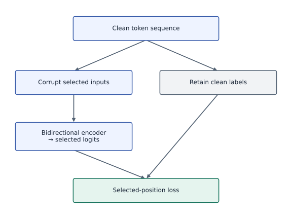
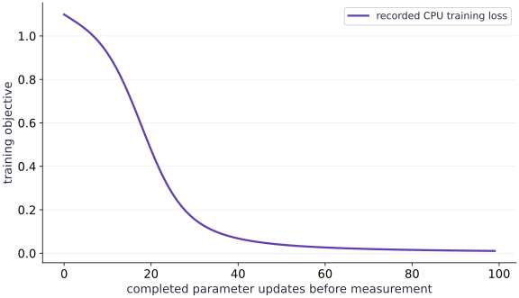

# Masked language modeling: predict hidden tokens

Phase 17: Self-supervised pretraining: masked and contrastive learning · about 105 minutes · CPU

## What you will be able to do

- Separate the clean targets from the corrupted input
- Normalize over selected target positions
- Verify the changed-condition exercise and explain the limits of this fixture.

## The problem

A text model can see a sentence but one word is hidden. What prevents it from copying the answer, and which positions should contribute to its loss? We will train a small bidirectional attention model and audit those two boundaries.

## The idea

Masked language modeling removes selected token information from the model's input and asks it to predict the original tokens. The clean targets remain available to the loss, while the encoder receives only the corrupted sequence.

## Hide the input without hiding the teaching target

Draw a clean sequence splitting into two paths. One supplies labels; the other is corrupted before entering the encoder. Selected-position logits meet the clean labels only at the loss. An arrow from a hidden clean target directly into encoder input would leak the answer.

Bidirectional context means an unmasked token on either side can help prediction. It is separate from the loss-selection mask, which decides which outputs are scored. The current fixture masks selected positions; it is not an implementation of every corruption choice used in BERT.

The loss curve shows learning on the small repeated-token fixture. The probability panel shows which target receives mass at the selected positions. A low fixture loss does not establish robust embeddings or language understanding; changed masks and held-out data test different capabilities.

### Keep clean targets out of encoder inputs

**Predict:** If all visible tokens reveal the same class, what limit does that place on the experiment?



*Conceptual / analytic teaching diagram; not a recorded benchmark.*

Clean tokens fork into labels and a corrupted-input path. Only corrupted inputs enter the encoder. Selected logits meet clean targets at the loss. This makes supervision available without leaking the hidden answer directly into the input.

### Pause and reason

If all visible tokens reveal the same class, what limit does that place on the experiment?

<details><summary>Compare your reasoning</summary>

It makes the objective easy and inspectable, but does not test rich contextual language understanding. Preserve the mechanism check while acknowledging that dataset limitation.

</details>

## Before coding: follow one hidden token

You should be able to turn logits into probabilities and differentiate a scalar loss. Begin with the first clean sequence, $[0,0,0,0]$. Selecting its second position produces input $[0,3,0,0]$, while the target remains $0$. The mask ID $3$ is an input symbol, not a fourth output class. The other visible zeros supply evidence about the missing token. Write down these three objects separately: clean targets, corrupted inputs and the Boolean selection mask. If you cannot say which one enters the encoder, stop before training.

The fixture repeats each token so you can inspect information flow without needing a tokenizer or a large corpus. This simplicity is also its main limitation: a model can solve repetition without learning syntax, word order or meaning.

## Separate the clean targets from the corrupted input

Keep an immutable copy of the original token IDs. The selection mask identifies positions to predict; corruption changes the input tokens, not the targets. Here the extra token ID $3$ means hidden, while output classes are $0,1,2$. Passing clean targets into the encoder would leak the answer. Check the corrupted arrays before the first update.

## Normalize over selected target positions

Compute log-softmax over vocabulary, gather the log probability of each original target, then average only selected positions. For uniform predictions over three classes, the initial loss is $\log 3$, regardless of how many valid positions are selected. Reject an empty mask before entering the jitted step; silently dividing by zero creates an undefined objective.

$$
L=-\frac{\sum_{b,t}m_{bt}\log p_\theta(x_{bt}\mid\widetilde x_b)}{\sum_{b,t}m_{bt}}
$$

## Trace the axes and the gradient

The input IDs have shape $(3,4)$. Looking them up in an embedding table with shape $(4,6)$ produces $(3,4,6)$. Attention scores have shape $(3,4,4)$: the last two axes are query and key positions, not vocabulary classes. The head maps the contextual vectors to logits with shape $(3,4,3)$. Softmax over the final axis now means vocabulary probability. Mixing these two softmax axes gives plausible shapes with the wrong meaning.

Let $M$ be the selected-token count, $p_{btv}$ the vocabulary probability and $x_{bt}$ the original target ID. The derivative below is zero at an unselected output position. It does not say the visible input embeddings have zero gradient: they help predict selected positions through attention.

$$
\frac{\partial L}{\partial z_{btv}}=\frac{m_{bt}}{M}\left(p_{btv}-\mathbf{1}[v=x_{bt}]\right)
$$

## Work out unequal masks before batching

Imagine one sequence contributes one selected token with loss $2$, and another contributes three selected tokens with losses $1,1,1$. The selected-token mean is $(2+3)/4=1.25$. Averaging the two sequence means gives $(2+1)/2=1.5$. Both are well-defined objectives, but they assign different influence to the sequences. Accumulating microbatch losses requires sums and selected counts if you intend to reproduce the token-weighted objective.

Predict which answer appears before running the unequal-mask experiment. Then perturb only unselected target IDs. A correctly reduced objective stays fixed. Next perturb one selected target; the loss should respond unless the competing classes happen to have equal probability.

## Use both sides without using the hidden value

The encoder forms attention scores across every input position. There is no causal triangle: a later visible token is useful evidence here. This tiny model has one attention head, no positional encoding and a linear vocabulary head. Repeated token sequences deliberately avoid word-order ambiguity; a realistic encoder also needs positions, padding handling, residual blocks and a tokenizer.

## Distinguish selection from replacement policy

This lab always replaces selected tokens with the mask ID so information flow is easy to inspect. BERT-style training can mix mask replacement, random replacement and unchanged selected tokens; selection still determines the supervised positions. Keep special/padding tokens ineligible. Track a masking key and regenerate masks under a stated schedule rather than accidentally fixing one easy corruption forever.

## Test a different corruption before claiming progress

The training curve uses one selected position. The code evaluates a second position without additional updates and checks that changing target labels changes the loss. This supports the bounded repeated-token task, not language understanding. A real corpus needs document-separated splits, a frozen tokenizer, mask provenance and downstream evaluation against random initialization.

## Move from this fixture to a corpus deliberately

Keep the objective checker when replacing repeated IDs with tokenized documents. Split by document/source, freeze tokenizer and special-token IDs, exclude padding from selection, and keep an explicit random key for corruption. A full encoder also needs positional information and a tested padding mask. Do not infer these capabilities from this one-head model.

Evaluate a fixed held-out corpus with a documented mask schedule and an aggregate numerator/count. Compare random initialization and a trained checkpoint on the same downstream task. Save one failure case showing a missing dependency, not just an average loss. Moving a mask inside the same three sequences tests corruption transfer; it is not a held-out-language evaluation.

## 1. Define corruption and the selected-token objective

Create main.py in your activated course environment. Paste this block, then run python main.py; function definitions alone print nothing.

```python
import jax
import jax.numpy as jnp
import numpy as np

def masked_ce(logits, targets, selected):
    # Caller validates a nonempty mask before a transformed training step.
    logp = jax.nn.log_softmax(logits, axis=-1)
    nll = -jnp.take_along_axis(logp, targets[..., None], axis=-1)[..., 0]
    return jnp.sum(jnp.where(selected, nll, 0.)) / jnp.sum(selected)

def validate_mask(selected, shape):
    a = np.asarray(selected)
    if a.shape != shape or a.dtype != np.bool_ or not a.any():
        raise ValueError('a nonempty Boolean mask of the target shape is required')

def corrupt_tokens(tokens, selected, mask_id):
    validate_mask(selected, tokens.shape)
    return jnp.where(selected, mask_id, tokens)

def mlm_logits(p, corrupted):
    h = p['embedding'][corrupted]
    # Bidirectional single-head attention, deliberately no causal mask.
    scores = h @ jnp.swapaxes(h, -1, -2) / jnp.sqrt(h.shape[-1])
    context = jax.nn.softmax(scores, axis=-1) @ h
    return context @ p['head']
```

The functions separate the input boundary from the differentiable objective. Read masked_ce from vocabulary normalization to target gather to selected-count reduction.

## 2. Construct a batch whose answers you can inspect

Append this block to main.py and run python main.py again. Keep the earlier blocks above it.

```python
tokens = jnp.array([[0,0,0,0],[1,1,1,1],[2,2,2,2]],jnp.int32)
selected = jnp.array([[False,True,False,False]]*3)
corrupted = corrupt_tokens(tokens,selected,3)
key = jax.random.key(7)
p = {'embedding':jax.random.normal(key,(4,6))*.2,'head':jnp.zeros((6,3))}
loss = lambda p: masked_ce(mlm_logits(p,corrupted),tokens,selected)
step = jax.jit(jax.value_and_grad(loss)); history=[]
```

Before continuing, inspect corrupted: each row must contain mask ID $3$ at the second position. The zero head makes the initial vocabulary distribution uniform.

## 3. Train, then change the corruption

Append this block to main.py and run python main.py again. Keep the earlier blocks above it.

```python
for _ in range(100):
    value,g = step(p); history.append(float(value)); p=jax.tree.map(lambda a,b:a-.4*b,p,g)
assert history[-1] < history[0]*.15
np.testing.assert_allclose(history[0],np.log(3),atol=1e-6)
# Changing the clean target after constructing corrupted input cannot change the forward pass.
changed_targets=tokens.at[:,1].set((tokens[:,1]+1)%3)
assert not np.isclose(float(masked_ce(mlm_logits(p,corrupted),changed_targets,selected)),history[-1])
held_mask=jnp.array([[False,False,True,False]]*3)
held_loss=float(masked_ce(mlm_logits(p,corrupt_tokens(tokens,held_mask,3)),tokens,held_mask))
assert held_loss < .2
print('MLM initial/final/changed-mask:',history[0],history[-1],held_loss)
```

The loop measures loss before each update. The final held-mask test uses the updated parameters; do not compare it as if it were the final recorded pre-update point.

## Run the example

```python
import jax
import jax.numpy as jnp
import numpy as np

def masked_ce(logits, targets, selected):
    # Caller validates a nonempty mask before a transformed training step.
    logp = jax.nn.log_softmax(logits, axis=-1)
    nll = -jnp.take_along_axis(logp, targets[..., None], axis=-1)[..., 0]
    return jnp.sum(jnp.where(selected, nll, 0.)) / jnp.sum(selected)

def validate_mask(selected, shape):
    a = np.asarray(selected)
    if a.shape != shape or a.dtype != np.bool_ or not a.any():
        raise ValueError('a nonempty Boolean mask of the target shape is required')

def corrupt_tokens(tokens, selected, mask_id):
    validate_mask(selected, tokens.shape)
    return jnp.where(selected, mask_id, tokens)

def mlm_logits(p, corrupted):
    h = p['embedding'][corrupted]
    # Bidirectional single-head attention, deliberately no causal mask.
    scores = h @ jnp.swapaxes(h, -1, -2) / jnp.sqrt(h.shape[-1])
    context = jax.nn.softmax(scores, axis=-1) @ h
    return context @ p['head']

tokens = jnp.array([[0,0,0,0],[1,1,1,1],[2,2,2,2]],jnp.int32)
selected = jnp.array([[False,True,False,False]]*3)
corrupted = corrupt_tokens(tokens,selected,3)
key = jax.random.key(7)
p = {'embedding':jax.random.normal(key,(4,6))*.2,'head':jnp.zeros((6,3))}
loss = lambda p: masked_ce(mlm_logits(p,corrupted),tokens,selected)
step = jax.jit(jax.value_and_grad(loss)); history=[]
for _ in range(100):
    value,g = step(p); history.append(float(value)); p=jax.tree.map(lambda a,b:a-.4*b,p,g)
assert history[-1] < history[0]*.15
np.testing.assert_allclose(history[0],np.log(3),atol=1e-6)
# Changing the clean target after constructing corrupted input cannot change the forward pass.
changed_targets=tokens.at[:,1].set((tokens[:,1]+1)%3)
assert not np.isclose(float(masked_ce(mlm_logits(p,corrupted),changed_targets,selected)),history[-1])
held_mask=jnp.array([[False,False,True,False]]*3)
held_loss=float(masked_ce(mlm_logits(p,corrupt_tokens(tokens,held_mask,3)),tokens,held_mask))
assert held_loss < .2
print('MLM initial/final/changed-mask:',history[0],history[-1],held_loss)

```

Expected: Loss starts near 1.099 and ends below 0.02; an unseen mask position remains below 0.2.

## Masked language modeling: predict hidden tokens — recorded experiment

**Predict:** Which cell should dominate each row of final masked-token probabilities, and what would a bright wrong cell tell you?



**Recorded CPU computation**

### Read the figure

The horizontal axis is the number of updates already applied; the vertical axis is selected-token cross-entropy in nats. The first value is about $1.099=\log 3$. It falls to about $0.011$ on the fixed synthetic sequences. This is training loss, not masked-token accuracy on natural text.

The second panel shows final class probabilities at the hidden position: rows are the three examples and columns are vocabulary classes. Read each row as a distribution that sums to one. The largest cell should lie at that row’s target class. This panel uses the parameters after the last update; the loss curve ends just before that update. Confident diagonal predictions establish this repetition task, not general language understanding.

### Connect it to the computation

The zero vocabulary head makes initial predictions uniform. Falling loss shows the trained attention/embedding/head system can use the remaining repeated tokens. A held mask position is checked separately; the plot does not show a held-out corpus or establish transfer quality.

```python
visual_data={'kind':'line','xlabel':'completed parameter updates before measurement','ylabel':'selected-token cross-entropy (nats)','series':[{'label':'recorded CPU training loss','x':list(range(len(history))),'y':history}]}
for panel in visual_data.get('panels',[visual_data]):
    panel['x']=panel['series'][0]['x']

final_probabilities=np.asarray(jax.nn.softmax(mlm_logits(p,corrupted)[:,1,:],axis=-1))
extra_panel={'kind':'heatmap','values':final_probabilities.tolist(),'rows':['target 0','target 1','target 2'],'columns':['class 0','class 1','class 2'],'unit':'masked-token probability','xlabel':'predicted vocabulary class','ylabel':'masked example','title':'Final predictions at the selected position'}
visual_data={"panels":[*visual_data.get("panels",[visual_data]),extra_panel]}

```

## Recorded reference execution

CPU run: 2026-10-06T15:44:09.484401+00:00. JAX 0.9.2.

```text
MLM initial/final/changed-mask: 1.0986123085021973 0.010633035562932491 0.010457751341164112
MLM initial/final/changed-mask: 1.0986123085021973 0.010633035562932491 0.010457751341164112
Unselected output logits have zero direct loss gradient.
Token-weighted / sequence-weighted: 0.6577723026275635 0.51289606
Changed position loss: 0.010457751341164112
Empty mask rejected
Independent masked softmax gradient agrees.
PASS: pretraining-01

```

## Show that unsupervised positions have no direct loss gradient

**Predict before running:** If we change logits only where the selection mask is false, does this masked objective change?

```python
logits=mlm_logits(p,corrupted)
changed_logits=jnp.where(selected[...,None],logits,logits+jnp.array([100.,-50.,7.]))
np.testing.assert_allclose(masked_ce(changed_logits,tokens,selected),masked_ce(logits,tokens,selected),atol=1e-6)
grad_logits=jax.grad(masked_ce)(logits,tokens,selected)
np.testing.assert_array_equal(np.asarray(grad_logits)[~np.asarray(selected)],0.)
print('Unselected output logits have zero direct loss gradient.')
```

**Expected:** Unselected logits do not affect the masked loss and have zero direct gradient.

Visible input tokens can still influence selected predictions through attention. Zero direct gradient at an unselected output is not a claim that visible-token embeddings never learn. The perturbation changes class differences; adding one common scalar to every class would leave softmax unchanged even at supervised positions and would be a weak masking check.

## Use unequal selection counts and a host probability calculation

**Predict before running:** Will token-weighted aggregation equal an unweighted average of sequence losses?

```python
audit_probs=jnp.array([[[.8,.1,.1],[.2,.7,.1],[.2,.3,.5]],[[.1,.6,.3],[.5,.2,.3],[.3,.4,.3]]])
audit_targets=jnp.array([[0,1,2],[1,0,2]])
audit_mask=jnp.array([[True,False,False],[True,True,True]])
audit_logits=jnp.log(audit_probs)
host_losses=-np.log(np.asarray(audit_probs)[np.arange(2)[:,None],np.arange(3)[None,:],np.asarray(audit_targets)])
expected=host_losses[np.asarray(audit_mask)].mean()
observed=float(masked_ce(audit_logits,audit_targets,audit_mask))
np.testing.assert_allclose(observed,expected,atol=1e-6)
sequence_mean=np.mean([host_losses[i][np.asarray(audit_mask[i])].mean() for i in range(2)])
assert not np.isclose(observed,sequence_mean)
print('Token-weighted / sequence-weighted:',observed,sequence_mean)
```

**Expected:** The independent selected-token mean agrees; the sequence-weighted mean differs.

The second sequence supplies three of four selected tokens. Equal sequence weighting gives the first sequence half of the influence instead of one quarter.

## Make it yours

Select the first position instead of the second and evaluate the trained model without updating it.

<details><summary>Reference solution</summary>

```python
first_mask=jnp.array([[True,False,False,False]]*3)
first_loss=float(masked_ce(mlm_logits(p,corrupt_tokens(tokens,first_mask,3)),tokens,first_mask))
assert first_loss<.2
print('Changed position loss:',first_loss)
```

</details>

## Reject a missing learning signal

**Transfer**

Pass an empty selection mask through the public corruption boundary and require a clear failure.

<details><summary>Hint</summary>

Validate outside the transformed objective before dividing by a count.

</details>

<details><summary>Reference solution and reasoning</summary>

```python
try:corrupt_tokens(tokens,jnp.zeros_like(tokens,dtype=bool),3)
except ValueError:print('Empty mask rejected')
else:raise AssertionError('empty mask accepted')
```

A skipped batch requires an explicit training policy. It must not silently become a zero loss or a NaN update.

</details>

## Derive the output gradient without autodiff

**Challenge**

Implement the probability-minus-one-hot formula for the unequal-mask fixture and compare every element with autodiff. Explain where visible context can still receive gradient.

<details><summary>Hint</summary>

Broadcast the mask over vocabulary and divide by the selected count, not the batch size.

</details>

<details><summary>Reference solution and reasoning</summary>

```python
analytic=(jax.nn.softmax(audit_logits,axis=-1)-jax.nn.one_hot(audit_targets,3))*audit_mask[...,None]/audit_mask.sum()
np.testing.assert_allclose(jax.grad(masked_ce)(audit_logits,audit_targets,audit_mask),analytic,atol=1e-6)
print('Independent masked softmax gradient agrees.')
```

This verifies the entire derivative tensor, including zeros at unsupervised outputs. It says nothing by itself about intermediate embedding gradients.

</details>

## Check your understanding

Why are visible input tokens useful even when their output positions are excluded from the loss?

1. They supply context to predictions at selected positions through the encoder.
2. A lower training loss by itself proves the full application is ready.
3. Matching shapes alone establishes the required behavior.

<details><summary>Answer and explanation</summary>

They supply context to predictions at selected positions through the encoder.

The mask controls the supervised outputs, while attention controls how input context influences them.

</details>

## Diagnose the result

If loss is suspiciously perfect at initialization, inspect target leakage and the selection count. If loss becomes NaN, reject empty masks and inspect vocabulary indices before changing the optimizer.

## Carry forward

- The input IDs have shape $(3,4)$. Looking them up in an embedding table with shape $(4,6)$ produces $(3,4,6)$. Attention scores have shape $(3,4,4)$: the last two axes are query and key positions, not vocabulary classes. The head maps the contextual vectors to logits with shape $(3,4,3)$. Softmax over the final axis now means vocabulary probability. Mixing these two softmax axes gives plausible shapes with the wrong meaning.
- Keep the objective checker when replacing repeated IDs with tokenized documents. Split by document/source, freeze tokenizer and special-token IDs, exclude padding from selection, and keep an explicit random key for corruption. A full encoder also needs positional information and a tested padding mask. Do not infer these capabilities from this one-head model.

## Keep your evidence

Keep corrupted inputs, selected-target counts, the log-vocabulary baseline, independent masked-loss checks, trained parameters and changed-mask results.

Keep predictions, modified code, observed results, and reasoning. A checkpoint alone does not demonstrate the exercise.

## Primary references

- [BERT: masked language pretraining](https://arxiv.org/abs/1810.04805)

