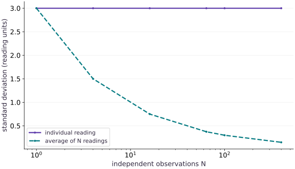

# Distributions and sampling

Phase 11: Probabilistic modeling · about 90 minutes · CPU

## What you will be able to do

- Distinguish samples, density, variance and standard error
- Check normal moments against independent analytic expectations
- Use log-space arithmetic for an extreme mixture likelihood
- Demonstrate both key replay and independent split-key draws

## The problem

A sensor model says that a future reading has mean $2$ and standard deviation $3$. What should a finite collection of simulated readings look like, and how can we check our simulator? We will compare independent formulas with JAX samples, then deliberately underflow a likelihood calculation. This is the numerical foundation for the Bayesian model in the next lesson.

## The idea

A distribution describes variability in outcomes. Averaging independent observations can reduce uncertainty in their mean without removing the spread of individual outcomes. Keep these two uncertainties on separate labels and scales.

## A precise mean does not make individual outcomes predictable

Suppose observations have standard deviation $2$. For $100$ independent observations from the same distribution, the sample mean's standard deviation is $2/\sqrt{100}=0.2$. A new individual observation still has standard deviation $2$.

The standard-error curve is calculated under its sampling assumptions; it is not itself a collection of measured repeated experiments. Correlated observations can reduce the amount of independent information in a batch.

When interpreting a narrow interval, ask what random quantity the interval describes: a mean, a latent parameter or a new observation. More data can make an estimated average precise while the underlying process remains noisy.

### Pause and reason

Does a tenfold smaller standard error mean future individual observations are ten times less variable?

<details><summary>Compare your reasoning</summary>

No. Standard error concerns the estimator of the mean. The observation distribution can retain the same variability.

</details>

## Start with units, not an API

A standard deviation has the same units as a sensor reading. Variance has squared units. To change a standard-normal draw $z$ into a reading, multiply by the standard deviation and add the mean: $x=2+3z$. The expected variance is $9$, not $3$. This is why the scale parameter in our log-density divides the residual before squaring. We assume a strictly positive finite scale; validation belongs at a public input boundary.

$$
p(x\mid\mu,\sigma)=\frac{1}{\sigma\sqrt{2\pi}}\exp\!\left[-\frac12\left(\frac{x-\mu}{\sigma}\right)^2\right],\quad \sigma>0
$$

## One draw and a sample average answer different questions

A single future reading has standard deviation $3$. An average of $N$ independent readings has standard error $3/\sqrt{N}$. More simulation improves an estimate of the model mean; it does not make the next sensor reading less noisy. At $N=20000$, the mean standard error is about $0.0212$. Our deterministic seeded test uses a generous five-standard-error bound and a separate variance check. A statistical tolerance can fail by chance for other seeds, so keep the seed, sample size and actual discrepancy.

## Logarithms preserve ratios that densities lose

A normal log-density is a negative quadratic plus normalization terms. Summing log-densities for independent observations avoids multiplying many small values. A mixture is different: it adds weighted densities, so we use log-sum-exp rather than summing component log-densities. For equal components with log-densities $-1000$ and $-1001$, subtracting the maximum before exponentiation preserves their relative contribution. The ordinary density may still be too small to represent, but its log remains finite.

$$
\log\!\left(\frac{e^a+e^b}{2}\right)=m+\log(e^{a-m}+e^{b-m})-\log 2,\quad m=\max(a,b)
$$

## A random key is part of the experiment

Calling a random function twice with the same key and shape replays the same values in this tested environment. It does not create two independent samples. Split the key before assigning it to separate draws. NumPy and JAX need not return matching random arrays for the same integer seed: compare distributional properties, not bit patterns across libraries. Our sample checks establish a small numerical example, not a universal test of a random-number generator.

## 1. Define a density and its contract

Create main.py in the activated CPU environment. Add the imports and the scalar normal log-density. A scale is a positive standard deviation, not a variance.

```python
# Step 1 — 1. Define a density and its contract: The normalization term matters when comparing different scales;...
# Import math for this computation.
import math
import numpy as np
import jax
import jax.numpy as jnp
from jax.scipy.special import logsumexp

# Function `normal_logpdf(value, loc, scale)` implementing this stage's computation:
def normal_logpdf(value, loc, scale):
    # Return `-0.5 * ((value - loc) / scale) ** 2 - jnp.log(scale) - 0.5 * jnp.log(2 * jnp.pi)` to the caller.
    return -0.5*((value-loc)/scale)**2 - jnp.log(scale) - 0.5*jnp.log(2*jnp.pi)
```

The normalization term matters when comparing different scales; the squared residual alone is not a density.

## 2. Sample with explicit ownership

Append the sampler. Split one parent key before drawing two samples; retain each array so replay and variation can be checked.

```python
# Step 2 — 2. Sample with explicit ownership: The broad mean bound is five analytic standard errors for this...
# Create or split explicit PRNG key(s) (`(key_a, key_b)`) for reproducible randomness.
key_a, key_b = jax.random.split(jax.random.key(23))
# Sample deterministic random values into `a` using an explicit PRNG key.
a = 2. + 3.*jax.random.normal(key_a, (20000,))
# Sample deterministic random values into `b` using an explicit PRNG key.
b = 2. + 3.*jax.random.normal(key_b, (20000,))
# Compute `expected_mean, expected_variance` from `2., 9.`
expected_mean, expected_variance = 2., 9.
# Assert that `abs(float(a.mean())-expected_mean) < 5*3/math.sqrt(a.size)`.
assert abs(float(a.mean())-expected_mean) < 5*3/math.sqrt(a.size)
# Assert that `abs(float(a.var())-expected_variance) < .4`.
assert abs(float(a.var())-expected_variance) < .4
# Assert invariant `not jnp.array_equal(a,b)` holds
assert not jnp.array_equal(a,b)
# Assert invariant `jnp.array_equal(a, 2.+3.*jax.random.normal(key_a,(20000,)))` holds
assert jnp.array_equal(a, 2.+3.*jax.random.normal(key_a,(20000,)))
```

The broad mean bound is five analytic standard errors for this independent normal sample; it is not a guarantee for arbitrary Monte Carlo samples.

## 3. Compare an independent calculation

Append the independent scalar reference and stable mixture calculation, then run python main.py. Inspect the density, mean and variance.

```python
# Step 3 — 3. Compare an independent calculation: A log density near negative one thousand remains representable...
# Construct `actual` via `normal_logpdf(jnp.array([2.,5.]),2.,3.)`
actual = normal_logpdf(jnp.array([2.,5.]),2.,3.)
# Compute `reference` from `[-math.log(3*math.sqrt(2*math.pi)), -.5-math.log(3*m...`
reference = [-math.log(3*math.sqrt(2*math.pi)), -.5-math.log(3*math.sqrt(2*math.pi))]
# Compute `np.testing.assert_allclose(actual,reference,rtol` as `1e-6)`.
np.testing.assert_allclose(actual,reference,rtol=1e-6)
# Construct `components` via `jnp.array([-1000.,-1001.])`
components = jnp.array([-1000.,-1001.])
# Evaluate numerically stable log-space cross-entropy/likelihood (`stable`).
stable = logsumexp(components)-jnp.log(2.)
# Confirm that all computed values remain finite (no NaN or Inf).
assert jnp.isfinite(stable)
# Assert invariant `jnp.isneginf(jnp.log(jnp.exp(components).mean()))` holds
assert jnp.isneginf(jnp.log(jnp.exp(components).mean()))
# Print the observed values to compare against the expected result.
print('sample mean, variance:',float(a.mean()),float(a.var()))
# Print diagnostic summary of the computed outputs.
print('stable equal-mixture log density:',float(stable))
```

A log density near negative one thousand remains representable even when exponentiating it underflows in float32.

## Run the example

```python
# Step 1 — 1. Define a density and its contract: The normalization term matters when comparing different scales;...
# Import math for this computation.
import math
import numpy as np
import jax
import jax.numpy as jnp
from jax.scipy.special import logsumexp

# Function `normal_logpdf(value, loc, scale)` implementing this stage's computation:
def normal_logpdf(value, loc, scale):
    # Return `-0.5 * ((value - loc) / scale) ** 2 - jnp.log(scale) - 0.5 * jnp.log(2 * jnp.pi)` to the caller.
    return -0.5*((value-loc)/scale)**2 - jnp.log(scale) - 0.5*jnp.log(2*jnp.pi)

# Step 2 — 2. Sample with explicit ownership: The broad mean bound is five analytic standard errors for this...
# Create or split explicit PRNG key(s) (`(key_a, key_b)`) for reproducible randomness.
key_a, key_b = jax.random.split(jax.random.key(23))
# Sample deterministic random values into `a` using an explicit PRNG key.
a = 2. + 3.*jax.random.normal(key_a, (20000,))
# Sample deterministic random values into `b` using an explicit PRNG key.
b = 2. + 3.*jax.random.normal(key_b, (20000,))
# Compute `expected_mean, expected_variance` from `2., 9.`
expected_mean, expected_variance = 2., 9.
# Assert that `abs(float(a.mean())-expected_mean) < 5*3/math.sqrt(a.size)`.
assert abs(float(a.mean())-expected_mean) < 5*3/math.sqrt(a.size)
# Assert that `abs(float(a.var())-expected_variance) < .4`.
assert abs(float(a.var())-expected_variance) < .4
# Assert invariant `not jnp.array_equal(a,b)` holds
assert not jnp.array_equal(a,b)
# Assert invariant `jnp.array_equal(a, 2.+3.*jax.random.normal(key_a,(20000,)))` holds
assert jnp.array_equal(a, 2.+3.*jax.random.normal(key_a,(20000,)))

# Step 3 — 3. Compare an independent calculation: A log density near negative one thousand remains representable...
# Construct `actual` via `normal_logpdf(jnp.array([2.,5.]),2.,3.)`
actual = normal_logpdf(jnp.array([2.,5.]),2.,3.)
# Compute `reference` from `[-math.log(3*math.sqrt(2*math.pi)), -.5-math.log(3*m...`
reference = [-math.log(3*math.sqrt(2*math.pi)), -.5-math.log(3*math.sqrt(2*math.pi))]
# Compute `np.testing.assert_allclose(actual,reference,rtol` as `1e-6)`.
np.testing.assert_allclose(actual,reference,rtol=1e-6)
# Construct `components` via `jnp.array([-1000.,-1001.])`
components = jnp.array([-1000.,-1001.])
# Evaluate numerically stable log-space cross-entropy/likelihood (`stable`).
stable = logsumexp(components)-jnp.log(2.)
# Confirm that all computed values remain finite (no NaN or Inf).
assert jnp.isfinite(stable)
# Assert invariant `jnp.isneginf(jnp.log(jnp.exp(components).mean()))` holds
assert jnp.isneginf(jnp.log(jnp.exp(components).mean()))
# Print the observed values to compare against the expected result.
print('sample mean, variance:',float(a.mean()),float(a.var()))
# Print diagnostic summary of the computed outputs.
print('stable equal-mixture log density:',float(stable))
```

Expected: The sample mean is close to $2$, the variance is close to $9$, and the stable mixture log-density is approximately $-1000.38$.

## A precise mean does not remove observation noise

**Predict:** Which band shrinks when we increase the number of independent observations?



**Recorded CPU computation**

### Read the figure

The horizontal axis is the number of independent observations on a logarithmic scale: equal spacing represents equal ratios of sample sizes. The vertical axis is the standard deviation in sensor-reading units. The flat curve stays at $3$: it describes one reading. The decreasing curve is $3/\sqrt{N}$: it describes the average of $N$ readings. At $N=100$, the average has standard deviation $0.3$, ten times smaller than an individual reading. These curves are analytic quantities evaluated by the executed example, not measured coverage intervals.

### Connect it to the computation

The two curves explain the mean test in our code. A large simulation can estimate the distribution mean accurately while predictions for new sensor values remain noisy. Correlated draws, such as the Markov chains later in this phase, do not satisfy the same independent-sample calculation unchanged.

```python
# Compute figure data for: A precise mean does not remove observation noise
# Convert `sizes` to a host NumPy array for inspection or verification.
sizes = np.array([1,4,16,64,100,400])
# Compute `visual_data` from `{"kind":"line","x":sizes.tolist(),"xlabel":"independ...`
visual_data = {"kind":"line","x":sizes.tolist(),"xlabel":"independent observations N","ylabel":"standard deviation (reading units)","xscale":"log","series":[{"label":"individual reading","y":[3.]*len(sizes)},{"label":"average of N readings","y":(3/np.sqrt(sizes)).tolist()}]}
```

## Recorded reference execution

CPU run: 2026-10-08T14:04:43.628169+00:00. JAX 0.9.2.

```text
sample mean, variance: 2.0067408084869385 9.035282135009766
stable equal-mixture log density: -1000.3799438476562
sample mean, variance: 2.0067408084869385 9.035282135009766
stable equal-mixture log density: -1000.3799438476562
peak density: 3.9894230365753174
-5.0 -2.379885673522949
PASS: probability-01

```

## Density can exceed one

**Predict before running:** For a normal with standard deviation $0.1$, can its density at its mean exceed $1$?

```python
# Experiment — Density can exceed one: A narrow continuous density can exceed one; its area, not its...
peak = jnp.exp(normal_logpdf(0.,0.,.1))
# Assert invariant `peak > 1` holds
assert peak > 1
# Print the observed values to compare against the expected result.
print("peak density:",float(peak))
```

**Expected:** The peak density is approximately $3.99$.

A narrow continuous density can exceed one; its area, not its height at a point, sums to one.

## Separate sum and mixture

**Predict before running:** Do two independent observations with log densities $-2,-3$ have the same log likelihood as one equal mixture of those components?

```python
# Experiment — Separate sum and mixture: Independence multiplies probabilities, while alternative mixture...
# Construct `values` via `jnp.array([-2.,-3.])`
values = jnp.array([-2.,-3.])
# Aggregate array values to compute `independent_log`.
independent_log = values.sum()
# Evaluate numerically stable log-space cross-entropy/likelihood (`mixture_log`).
mixture_log = logsumexp(values)-jnp.log(2.)
# Assert that `jnp.allclose(independent_log,-5.)`.
assert jnp.allclose(independent_log,-5.)
# Assert invariant `mixture_log > -3.` holds
assert mixture_log > -3.
# Print the observed values to compare against the expected result.
print(float(independent_log),float(mixture_log))
```

**Expected:** The independent joint log likelihood is $-5$; the mixture log density is approximately $-2.38$.

Independence multiplies probabilities, while alternative mixture components add weighted probabilities.

## Make it yours

Change the sensor to mean $-1$, standard deviation $0.5$, and draw $30000$ readings from a new key. Predict the variance and the standard error of the sample mean, then verify both moments.

### How to write this exercise — Step-by-step recipe & starter scaffold

**Key functions & syntax to use:**
- `x.sum(axis=...) / x.mean(axis=..., keepdims=...)` — Reduces values along the named `axis` (the axis you name is collapsed unless `keepdims=True`).
- `jax.random.PRNGKey(seed) & jax.random.split(key)` — Manages explicit, stateless PRNG keys—always split a key before passing subkeys into independent random draws.

**Step-by-step implementation plan:**
1. Create or split explicit PRNG key(s) (`changed`) for reproducible randomness.
2. Assert that `abs(float(changed.mean())+1.) < 5*.5/math.sqrt(30000)`.
3. Assert that `abs(float(changed.var())-.25) < .015`.

**Starter code scaffold (fill in the TODOs):**

```python
# Exercise solution: Change the sensor to mean -1, standard deviation 0.5, and draw 30000...
# Create or split explicit PRNG key(s) (`changed`) for reproducible randomness.
changed = ...  # TODO: compute changed
# Assert that `abs(float(changed.mean())+1.) < 5*.5/math.sqrt(30000)`.
assert abs(float(changed.mean())+1.)  # TODO: complete assertion check
# Assert that `abs(float(changed.var())-.25) < .015`.
assert abs(float(changed.var())-.25)  # TODO: complete assertion check
```

<details><summary>Reference solution</summary>

```python
# Exercise solution: Change the sensor to mean -1, standard deviation 0.5, and draw 30000...
# Create or split explicit PRNG key(s) (`changed`) for reproducible randomness.
changed = -1.+.5*jax.random.normal(jax.random.key(51),(30000,))
# Assert that `abs(float(changed.mean())+1.) < 5*.5/math.sqrt(30000)`.
assert abs(float(changed.mean())+1.) < 5*.5/math.sqrt(30000)
# Assert that `abs(float(changed.var())-.25) < .015`.
assert abs(float(changed.var())-.25) < .015
```

</details>

## Detect a missing normalization

**Transfer / diagnosis**

Compare scales $1$ and $2$ at their common mean. Show why a residual-only objective incorrectly ties them.

<details><summary>Hint</summary>

The residual is zero for both; retain $-\log\sigma$.

</details>

### How to write: Detect a missing normalization — Step-by-step recipe & starter scaffold

**Key functions & syntax to use:**
- `jnp.array(values, dtype=...)` — Constructs an immutable device-backed JAX array from Python/NumPy values.
- `jnp.allclose(actual, expected, rtol=..., atol=...)` — Checks that two arrays match elementwise within floating-point tolerance.

**Step-by-step implementation plan:**
1. Construct `scores` via `normal_logpdf(0.,0.,jnp.array([1.,2.]))`
2. Assert that `jnp.allclose(scores[0]-scores[1],jnp.log(2.))`.

**Starter code scaffold (fill in the TODOs):**

```python
# Detect a missing normalization (Transfer / diagnosis): Scale changes density even with identical zero residuals.
# Construct `scores` via `normal_logpdf(0.,0.,jnp.array([1.,2.]))`
scores = normal_logpdf(...)  # TODO: compute scores
# Assert that `jnp.allclose(scores[0]-scores[1],jnp.log(2.))`.
assert jnp.allclose(scores[0]-scores[1],jnp.log(2.))  # TODO: complete assertion check
```

<details><summary>Reference solution and reasoning</summary>

```python
# Detect a missing normalization (Transfer / diagnosis): Scale changes density even with identical zero residuals.
# Construct `scores` via `normal_logpdf(0.,0.,jnp.array([1.,2.]))`
scores = normal_logpdf(0.,0.,jnp.array([1.,2.]))
# Assert that `jnp.allclose(scores[0]-scores[1],jnp.log(2.))`.
assert jnp.allclose(scores[0]-scores[1],jnp.log(2.))
```

Scale changes density even with identical zero residuals.

</details>

## Demonstrate key ownership

**Transfer / diagnosis**

Produce two separately owned standard-normal draws and show replay of the first. Explain why replay alone does not test independence.

<details><summary>Hint</summary>

Split before use; compare arrays with the same shape.

</details>

### How to write: Demonstrate key ownership — Step-by-step recipe & starter scaffold

**Key functions & syntax to use:**
- `jax.random.PRNGKey(seed) & jax.random.split(key)` — Manages explicit, stateless PRNG keys—always split a key before passing subkeys into independent random draws.

**Step-by-step implementation plan:**
1. Create or split explicit PRNG key(s) (`(left, right)`) for reproducible randomness.
2. Sample deterministic random values into `first` using an explicit PRNG key.
3. Sample deterministic random values into `second` using an explicit PRNG key.
4. Assert invariant `jnp.array_equal(first,jax.random.normal(left,(32,)))` holds
5. Assert invariant `not jnp.array_equal(first,second)` holds

**Starter code scaffold (fill in the TODOs):**

```python
# Demonstrate key ownership (Transfer / diagnosis): Different split keys avoid accidental replay; one differing...
# Create or split explicit PRNG key(s) (`(left, right)`) for reproducible randomness.
left,right = jax.random.split(...)  # TODO: compute left,right
# Sample deterministic random values into `first` using an explicit PRNG key.
first = jax.random.normal(...)  # TODO: compute first
# Sample deterministic random values into `second` using an explicit PRNG key.
second = jax.random.normal(...)  # TODO: compute second
# Assert invariant `jnp.array_equal(first,jax.random.normal(left,(32,)))` holds
assert jnp.array_equal(first,jax.random.normal(left,(32,)))  # TODO: complete assertion check
# Assert invariant `not jnp.array_equal(first,second)` holds
assert not jnp.array_equal(first,second)  # TODO: complete assertion check
```

<details><summary>Reference solution and reasoning</summary>

```python
# Demonstrate key ownership (Transfer / diagnosis): Different split keys avoid accidental replay; one differing...
# Create or split explicit PRNG key(s) (`(left, right)`) for reproducible randomness.
left,right = jax.random.split(jax.random.key(17))
# Sample deterministic random values into `first` using an explicit PRNG key.
first = jax.random.normal(left,(32,))
# Sample deterministic random values into `second` using an explicit PRNG key.
second = jax.random.normal(right,(32,))
# Assert invariant `jnp.array_equal(first,jax.random.normal(left,(32,)))` holds
assert jnp.array_equal(first,jax.random.normal(left,(32,)))
# Assert invariant `not jnp.array_equal(first,second)` holds
assert not jnp.array_equal(first,second)
```

Different split keys avoid accidental replay; one differing pair does not prove every statistical property of a generator.

</details>

## Check your understanding

Which statement explains why a large Monte Carlo sample can have a precise mean while individual readings remain variable?

1. Every sample becomes equal to the mean as sample size increases
2. The variance of each reading is divided by the sample size
3. The standard error of the average decreases, while the distribution of an individual reading stays the same

<details><summary>Answer and explanation</summary>

The standard error of the average decreases, while the distribution of an individual reading stays the same

For independent draws the average has variance $\sigma^2/N$; a new reading still has variance $\sigma^2$. These are different random variables.

</details>

## Diagnose the result

If the simulated variance is near three instead of nine, inspect whether you multiplied by sqrt$3$ when the stated scale was three. If two supposedly independent arrays match exactly, inspect key reuse before changing the distribution. If a mixture likelihood becomes negative infinity, compare the log-sum-exp result before widening dtype.

## Carry forward

- A density is not a point probability.
- Moment checks need sample size, units and a justified tolerance.
- Log-space arithmetic and explicit keys make likelihood experiments inspectable.

## Keep your evidence

Seeded arrays, independent density values, moment discrepancies and underflow diagnosis. Keep the environment, observed outputs and your explanation of the figure.

Save your predictions, modified code, terminal outputs, and reasoning in your engineering portfolio.

## Primary references

- [JAX explicit random keys](https://docs.jax.dev/en/latest/random-numbers.html)
- [JAX logsumexp](https://docs.jax.dev/en/latest/_autosummary/jax.scipy.special.logsumexp.html)

