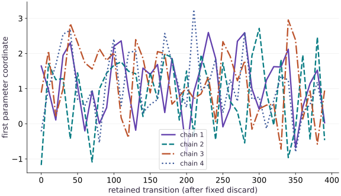

# Hamiltonian Monte Carlo and sampler diagnostics

Phase 11: Probabilistic modeling · about 140 minutes · CPU

## What you will be able to do

- Implement leapfrog with the correct half-step boundaries
- Check reversibility and an independent analytic gradient
- Compare four seeded chains with a known posterior
- Interpret energy error, acceptance and classical split R-hat without claiming convergence

## The problem

An approximate inference program returns a long list of weights. Before treating those weights as posterior samples, how can we tell whether its mechanics are correct and whether its chains explored the target? We will build a transparent Hamiltonian Monte Carlo sampler for a correlated Gaussian with a known mean and covariance, then deliberately damage its step size.

## The idea

Hamiltonian Monte Carlo introduces momentum to propose distant states while accounting for the target density. Numerical integration and acceptance control the proposal, but diagnostics are still needed to judge whether the retained samples explore the posterior adequately.

## A moving chain is not automatically a well-mixed chain

Follow position and momentum through a leapfrog trajectory. A proposal can travel far without behaving like an independent posterior draw. Integration error and acceptance behavior provide one diagnostic, while between-chain agreement and autocorrelation provide others.

Start multiple chains from meaningfully different positions where appropriate. Inspect the same retained sampling region across chains, and separate adaptation from retained draws. A trace that looks active may still stay in one region or be strongly correlated.

The lesson's trace plot uses a known posterior mean as a reference. Matching that mean is not sufficient: spread and dependence matter too. Compute diagnostics from the retained samples with their conventions recorded; plotting a thinned subset should not silently redefine the diagnostic sample.

### Pause and reason

Why can many saved samples still provide little effective information?

<details><summary>Compare your reasoning</summary>

Strong dependence or poor exploration can make them redundant. Sample count and effective sample size answer different questions; neither a smooth trace nor a correct mean alone establishes adequate mixing.

</details>

## Turn log-density into potential energy

For a normal target with mean $m$ and covariance $\Sigma$, the potential is $U(q)=(q-m)^\top\Sigma^{-1}(q-m)/2$, ignoring a constant. Its gradient is $\Sigma^{-1}(q-m)$, so we have an independent formula for autodiff. Momentum has a standard-normal distribution and kinetic energy $p^\top p/2$. The combined energy should remain constant along an exact trajectory.

$$
H(q,p)=U(q)+\tfrac12p^\top p,\qquad \nabla U(q)=\Sigma^{-1}(q-m)
$$

## Trace the half steps

First take a half momentum step using the current gradient. Take a full position step with that momentum, then update momentum using the new position. Interior momentum steps are full steps; the final one is a half step. This symmetry gives a reversible integrator up to numerical error. Our check negates the final momentum and integrates again; it should return to the starting position and negative starting momentum. A loop with all full momentum steps fails that boundary test.

## Correct discretization error in log space

A proposed trajectory changes energy by $\Delta H$. Accept with probability $\min(1,e^{-\Delta H})$, implemented as $\log u<-\Delta H$. A rejected proposal retains the current sample; removing repeated values would change the distribution. Non-finite energy error is rejected. The signed energy error can be negative, so it should not be interpreted as a nonnegative loss. An enormous positive error suggests an integration problem, often a step size too large for target curvature.

## Read diagnostics as evidence, not a certificate

We start four chains from dispersed points and discard the first $400$ transitions. This fixed discard is a teaching convention, not automatic warmup adaptation. Classical split R-hat compares between-chain and within-chain variance after splitting each chain. A value near one says those variance estimates agree; chains can still miss a mode together. Modern rank-normalized split R-hat, bulk and tail effective sample size, Monte Carlo standard errors and divergence diagnostics are stronger complementary tools. Our compact implementation is explicitly classical R-hat and does not implement those modern diagnostics.

## Use the reference model to expose failure

Here the exact mean, variance and covariance are known. Check all of them: getting both marginal means right can still hide missing correlation. Acceptance alone is insufficient; a tiny step can accept almost everything while exploring slowly. Effective sample size concerns the information in correlated draws, not the number of rows stored. Before using a library such as NumPyro on an unknown posterior, repeat an exact-model validation and inspect its documented diagnostics. This CPU fixture establishes neither multimodal exploration nor accelerator performance.

## 1. Write a known target and its gradient

Create a fresh main.py. This correlated Gaussian is an exact test target for an inference algorithm, not a new unknown statistical model.

```python
import numpy as np
import jax
import jax.numpy as jnp
target_mean = jnp.array([1.,-1.])
target_cov = jnp.array([[1.,.8],[.8,1.]])
precision = jnp.linalg.solve(target_cov,jnp.eye(2))
def potential(q):
    delta=q-target_mean
    return .5*delta@precision@delta
force=jax.grad(potential)
assert jnp.allclose(force(jnp.array([0.,0.])),precision@(-target_mean))
```

Potential energy is the negative log-density up to a constant, which cancels in the acceptance ratio.

## 2. Integrate then accept or reject

Append a leapfrog trajectory and a chain. Every transition splits keys for momentum and acceptance; rejection retains the old position.

```python
def leapfrog(q,p,step_size,steps):
    p=p-.5*step_size*force(q)
    def step(i,state):
        q,p=state
        q=q+step_size*p
        p=p-jnp.where(i<steps-1,step_size,.5*step_size)*force(q)
        return q,p
    return jax.lax.fori_loop(0,steps,step,(q,p))

def chain(key,initial,step_size=.25,leapfrog_steps=7,draws=1600):
    def transition(state,_):
        q,key=state
        key,kp,ku=jax.random.split(key,3)
        p=jax.random.normal(kp,q.shape)
        proposal,new_p=leapfrog(q,p,step_size,leapfrog_steps)
        error=potential(proposal)+.5*jnp.sum(new_p**2)-potential(q)-.5*jnp.sum(p**2)
        accept=jnp.isfinite(error)&(jnp.log(jax.random.uniform(ku)) < -error)
        next_q=jnp.where(accept,proposal,q)
        return (next_q,key),(next_q,accept,error)
    _,record=jax.lax.scan(transition,(initial,key),None,length=draws)
    return record
```

Leapfrog approximates energy conservation. Metropolis correction removes integration bias in the ideal stationary distribution; it does not make a finite chain independent or guarantee exploration.

## 3. Compare chains and an analytic oracle

Append four dispersed starts, discard an explicitly fixed initial segment, and retain all diagnostics. Run python main.py.

```python
starts=jnp.array([[-4.,-4.],[-4.,4.],[4.,-4.],[4.,4.]])
records=jax.vmap(lambda key,start:chain(key,start))(jax.random.split(jax.random.key(71),4),starts)
samples=records[0][:,400:,:]
def split_rhat(values):
    # Classical split R-hat for one scalar coordinate; not rank-normalized.
    half=values.shape[1]//2
    split=jnp.concatenate([values[:,:half],values[:,-half:]],axis=0)
    within=jnp.var(split,axis=1,ddof=1).mean()
    between=half*jnp.var(split.mean(axis=1),ddof=1)
    return jnp.sqrt(((half-1)*within/half+between/half)/within)
rhats=jax.vmap(split_rhat,in_axes=2)(samples)
pooled=samples.reshape(-1,2)
assert jnp.max(jnp.abs(pooled.mean(0)-target_mean))<.15
assert jnp.max(jnp.abs(jnp.cov(pooled.T)-target_cov))<.2
assert jnp.all(rhats<1.05)
print('mean:',pooled.mean(0),'covariance:',jnp.cov(pooled.T))
print('classical split R-hat:',rhats,'acceptance:',records[1].mean(axis=1))
```

The tolerances test this seeded Gaussian fixture only. Agreement with a known posterior is stronger evidence here than a diagnostic threshold alone.

## Run the example

```python
import numpy as np
import jax
import jax.numpy as jnp
target_mean = jnp.array([1.,-1.])
target_cov = jnp.array([[1.,.8],[.8,1.]])
precision = jnp.linalg.solve(target_cov,jnp.eye(2))
def potential(q):
    delta=q-target_mean
    return .5*delta@precision@delta
force=jax.grad(potential)
assert jnp.allclose(force(jnp.array([0.,0.])),precision@(-target_mean))

def leapfrog(q,p,step_size,steps):
    p=p-.5*step_size*force(q)
    def step(i,state):
        q,p=state
        q=q+step_size*p
        p=p-jnp.where(i<steps-1,step_size,.5*step_size)*force(q)
        return q,p
    return jax.lax.fori_loop(0,steps,step,(q,p))

def chain(key,initial,step_size=.25,leapfrog_steps=7,draws=1600):
    def transition(state,_):
        q,key=state
        key,kp,ku=jax.random.split(key,3)
        p=jax.random.normal(kp,q.shape)
        proposal,new_p=leapfrog(q,p,step_size,leapfrog_steps)
        error=potential(proposal)+.5*jnp.sum(new_p**2)-potential(q)-.5*jnp.sum(p**2)
        accept=jnp.isfinite(error)&(jnp.log(jax.random.uniform(ku)) < -error)
        next_q=jnp.where(accept,proposal,q)
        return (next_q,key),(next_q,accept,error)
    _,record=jax.lax.scan(transition,(initial,key),None,length=draws)
    return record

starts=jnp.array([[-4.,-4.],[-4.,4.],[4.,-4.],[4.,4.]])
records=jax.vmap(lambda key,start:chain(key,start))(jax.random.split(jax.random.key(71),4),starts)
samples=records[0][:,400:,:]
def split_rhat(values):
    # Classical split R-hat for one scalar coordinate; not rank-normalized.
    half=values.shape[1]//2
    split=jnp.concatenate([values[:,:half],values[:,-half:]],axis=0)
    within=jnp.var(split,axis=1,ddof=1).mean()
    between=half*jnp.var(split.mean(axis=1),ddof=1)
    return jnp.sqrt(((half-1)*within/half+between/half)/within)
rhats=jax.vmap(split_rhat,in_axes=2)(samples)
pooled=samples.reshape(-1,2)
assert jnp.max(jnp.abs(pooled.mean(0)-target_mean))<.15
assert jnp.max(jnp.abs(jnp.cov(pooled.T)-target_cov))<.2
assert jnp.all(rhats<1.05)
print('mean:',pooled.mean(0),'covariance:',jnp.cov(pooled.T))
print('classical split R-hat:',rhats,'acceptance:',records[1].mean(axis=1))
```

Expected: The pooled mean and covariance approach the stated target within the fixture tolerances. The two classical split R-hat values, one per parameter coordinate, remain near $1$; acceptance is reported separately for each chain.

## Four HMC traces around a known posterior mean

**Predict:** Can the chains cross the known mean while still showing successive correlated values?



**Recorded CPU computation**

### Read the figure

The horizontal axis counts retained transitions after discarding the initial $400$. The vertical axis is the first coordinate of the sampled parameter. Each colored line is one chain, plotted at every tenth retained transition to keep the figure readable. The target mean is $1$; the chains move on both sides of it. Their paths differ because they use different keys and initial positions. Connecting thinned points helps visual inspection but does not make the underlying draws independent.

### Connect it to the computation

This trace is one piece of the evidence. The code also checks the two-dimensional covariance, which a single-coordinate trace cannot show, and prints classical split R-hat and acceptance. A smooth-looking trace or repeated crossings of the mean cannot establish exploration of modes absent from this single-Gaussian fixture.

```python
indices=np.arange(0,400,10)
visual_data={"kind":"line","x":indices.tolist(),"xlabel":"retained transition (after fixed discard)","ylabel":"first parameter coordinate","series":[{"label":"chain "+str(i+1),"y":np.asarray(samples[i,indices,0]).tolist()} for i in range(4)]}
```

## Recorded reference execution

CPU run: 2026-10-06T15:41:52.001088+00:00. JAX 0.9.2.

```text
mean: [ 0.98358583 -1.0185838 ] covariance: [[0.98042357 0.7727629 ]
 [0.7727629  0.9861013 ]]
classical split R-hat: [1.0002148 1.000253 ] acceptance: [0.97749996 0.98625    0.98125    0.980625  ]
mean: [ 0.98358583 -1.0185838 ] covariance: [[0.98042357 0.7727629 ]
 [0.7727629  0.9861013 ]]
classical split R-hat: [1.0002148 1.000253 ] acceptance: [0.97749996 0.98625    0.98125    0.980625  ]
bad acceptance: 0.0 maximum energy error: 50229501952.0
PASS: probability-03

```

## Reverse one trajectory

**Predict before running:** If we reverse momentum after a trajectory, should the integrator return to the starting position?

```python
q0=jnp.array([.2,-.4]);p0=jnp.array([.3,.7])
q1,p1=leapfrog(q0,p0,.15,9)
q2,p2=leapfrog(q1,-p1,.15,9)
np.testing.assert_allclose(q2,q0,atol=2e-6)
np.testing.assert_allclose(p2,-p0,atol=2e-6)
```

**Expected:** The reversed trajectory returns within float32 tolerance.

Reversibility is an integrator invariant, independent of whether a particular chain happened to get a plausible mean.

## Separate replay from a changed chain

**Predict before running:** Will changing a key change the sampled path while leaving the target unchanged?

```python
replay=chain(jax.random.key(9),jnp.zeros(2),draws=50)[0]
again=chain(jax.random.key(9),jnp.zeros(2),draws=50)[0]
changed=chain(jax.random.key(10),jnp.zeros(2),draws=50)[0]
assert jnp.array_equal(replay,again)
assert not jnp.array_equal(replay,changed)
```

**Expected:** The same key reproduces the path; another key produces a different path.

Replay tests state ownership. It does not establish distributional correctness by itself.

## Make it yours

Increase the step size to 1.2 with the same leapfrog count. Record acceptance and positive energy errors. Explain why keeping more rejected samples is not a repair for unstable integration.

<details><summary>Reference solution</summary>

```python
bad=chain(jax.random.key(71),starts[0],step_size=1.2,draws=100)
assert bad[1].mean()<.2
assert jnp.max(bad[2])>100.
print("bad acceptance:",float(bad[1].mean()),"maximum energy error:",float(jnp.max(bad[2])))
```

</details>

## Catch chains trapped at different levels

**Transfer / diagnosis**

Construct four arrays with similar within-chain variation but means separated by four units. Verify that classical split R-hat flags disagreement.

<details><summary>Hint</summary>

Use independent small noise around four different constants.

</details>

<details><summary>Reference solution and reasoning</summary>

```python
fake=jax.random.normal(jax.random.key(4),(4,600))*.1+jnp.arange(4)[:,None]*4
assert split_rhat(fake)>5
```

Between-chain variation dominates within-chain variation, so pooling would conceal a serious exploration problem.

</details>

## Verify a directional derivative

**Transfer / diagnosis**

At a nonzero position compare the autodiff directional derivative with the analytic precision-matrix expression. Then compare to a central difference.

<details><summary>Hint</summary>

Use the same direction and a moderate float32 finite-difference step.

</details>

<details><summary>Reference solution and reasoning</summary>

```python
q=jnp.array([.4,.8]);v=jnp.array([.7,-.2]);eps=.001
analytic=(precision@(q-target_mean))@v
auto=force(q)@v
finite=(potential(q+eps*v)-potential(q-eps*v))/(2*eps)
np.testing.assert_allclose(auto,analytic,rtol=1e-6)
np.testing.assert_allclose(finite,analytic,rtol=.005,atol=.002)
```

A sign error in potential or a transposed geometry can be isolated before tuning the sampler.

</details>

## Check your understanding

Four chains have classical split R-hat close to one. What can we conclude?

1. They have certainly explored every posterior mode
2. Their retained draws are independent
3. Their within-chain and between-chain variance estimates agree, but additional checks are still necessary

<details><summary>Answer and explanation</summary>

Their within-chain and between-chain variance estimates agree, but additional checks are still necessary

A diagnostic can reveal problems without proving their absence. Here we also compare to exact moments; an unknown target needs several diagnostics and model checks.

</details>

## Diagnose the result

If acceptance collapses, inspect the finite energy error distribution and reduce the step size. If acceptance is high but traces barely move, inspect trajectory length and autocorrelation. If chains disagree, retain separate traces rather than pooling them into a smooth histogram. If a constant chain produces undefined R-hat, report that failure instead of replacing it with one.

## Carry forward

- A correct accept/reject rule retains rejected states.
- Check integrator invariants before interpreting chains.
- Near-one R-hat and high acceptance are useful evidence, not proof of convergence.

## Keep your evidence

Reversibility check, four traces, two-dimensional moments, key replay and classical split R-hat with limitations. Keep the environment, observed outputs and your explanation of the figure.

Keep predictions, modified code, observed results, and reasoning. A checkpoint alone does not demonstrate the exercise.

## Primary references

- [JAX scan state contract](https://docs.jax.dev/en/latest/_autosummary/jax.lax.scan.html)
- [Stan posterior analysis and diagnostics](https://mc-stan.org/docs/reference-manual/analysis.html)
- [NumPyro MCMC diagnostics interface](https://num.pyro.ai/en/stable/diagnostics.html)

