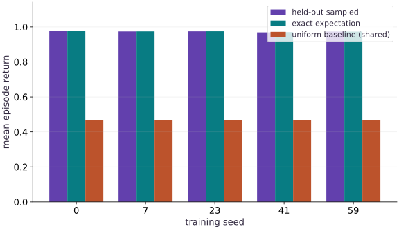

# Evaluate agents across seeds

Phase 12: Reinforcement learning · about 90 minutes · CPU

## What you will be able to do

- Separate training seeds, evaluation streams and individual episodes.
- Report per-agent means and variability with an explicit aggregation unit.
- Compare a trained policy to uniform and known deterministic baselines without mutating it.

## The problem

A single training run looks excellent. Would another random seed learn the same behavior, and did the evaluation quietly reuse the training data? We will separate randomness used to fit an agent from randomness used to test it, retain per-agent results and compare with policies whose behavior we already understand.

## The idea

A policy's result can vary because training produced a different policy and because evaluation sampled different episodes. A useful comparison records both sources instead of pooling every episode as though it came from one independent training run.

## Separate training randomness from evaluation randomness

Train several agents with distinct training seeds. Evaluate each on a declared set of held-out conditions. First summarize within-agent episode variability; then compare the results across independently trained agents.

When methods share evaluation conditions, paired comparisons can make differences easier to interpret. Preserve that pairing rather than mixing episode identities. A large number of episodes from one trained agent does not replace multiple training seeds.

The mean-return bars summarize the fixture. Inspect individual seed results before trusting a small average difference. If you add an uncertainty interval, state its unit of resampling and method rather than attaching an unexplained error bar.

### Pause and reason

Do a thousand episodes from one trained policy establish training-seed robustness?

<details><summary>Compare your reasoning</summary>

No. They improve knowledge of that policy's evaluation behavior. Training variability needs independently trained policies.

</details>

## Write the protocol before inspecting results

Fix the environment, horizon, training budget and evaluation procedure before seeing the held-out metrics. We use training seeds $(0,7,23,41,59)$ and evaluation seeds $(1000,1001,1002,1003)$. These seed identifiers are part of this protocol, not proof of statistical independence by themselves. The generator receives separate keys for fitting and testing. Do not change the learning rate after inspecting final test results and still call the same results held out.

## Name the experimental unit

Within an agent, averaging $2048$ evaluation episodes reduces uncertainty about that particular policy. Across five independently trained agents, differences reveal sensitivity to training randomness. A large episode count does not make the number of trained agents large. We retain all episode returns and stream means, then summarize the five agent means with their sample standard deviation. That standard deviation describes variability; it is not a confidence interval.

$$
\bar R_i=\frac1E\sum_{e=1}^E R_{i,e},\qquad s=\sqrt{\frac1{K-1}\sum_{i=1}^K(\bar R_i-\bar R)^2}
$$

## Pair the comparison deliberately

Using the same evaluation seed set across agents and baselines keeps the reset draws aligned and may reduce comparison noise. Actions still depend on the policy, so trajectories diverge. Shared evaluation randomness means the agent estimates are not wholly independent measurement errors. Preserve paired differences when comparing methods; do not pool every episode and pretend there were thousands of independent training runs. A broader study would use more training seeds, predeclared metrics and uncertainty estimates suited to its dependence structure.

## A baseline can catch a broken evaluator

The uniform policy has exact expected return $0.466875$. Always-left earns $-0.08$, because it never reaches the goal and receives eight costs. Always-right earns $0.985$, averaged over the two starts. If the sampled evaluator places these in the wrong order, inspect masks, reward sums and horizon before celebrating the learned policy. Test a changed horizon too: it should change the known returns in predictable ways.

## Evaluation must leave training state alone

The policy array is passed to the evaluator as a value. We copy it before evaluation and compare afterward. Evaluation creates its own keys and never calls an optimizer. In a neural model this contract also includes running statistics, dropout mode and any other mutable model state. The tabular example cannot certify that a future network implementation handles those correctly.

## Keep a report another learner can challenge

Retain source revision, package versions, policy parameters, train/evaluation seeds, horizon, step budget, raw episode returns and per-agent means. Add an exact-versus-sampled comparison, a failure diagnosis, and the limits: one small deterministic-transition environment, a randomized start distribution, stationary tabular policies, CPU execution and no hyperparameter search. High return here demonstrates a correct teaching harness, not general control capability.

## Assemble the verified learning system

Create main.py with this block. Run python3 main.py in the course CPU environment.

```python
"""Finite-horizon tabular policy training. CPU teaching environment, not a benchmark."""
from functools import partial
from typing import NamedTuple
import jax
import jax.numpy as jnp
import numpy as np


class State(NamedTuple):
    position: jax.Array
    elapsed: jax.Array
    done: jax.Array


def reset(key):
    """Start uniformly at position 0 or 1; goal is position 3."""
    return State(jax.random.randint(key, (), 0, 2), jnp.int32(0), jnp.bool_(False))


def step(state, action, horizon=8):
    """Action 0: left, 1: right. Caller supplies binary action and positive horizon.

    Returns next state, reward, termination event, truncation event. Finished
    states absorb without more rewards/events. No implicit reset or lost final observation.
    """
    active = ~state.done
    proposed = jnp.clip(state.position + 2 * action - 1, 0, 3)
    position = jnp.where(active, proposed, state.position)
    elapsed = state.elapsed + active.astype(jnp.int32)
    terminated = active & (position == 3)
    truncated = active & ~terminated & (elapsed >= horizon)
    reward = jnp.where(active, jnp.where(terminated, 1., -.01), 0.)
    return State(position, elapsed, state.done | terminated | truncated), reward, terminated, truncated

def log_probability(theta, observations, actions):
    logits = theta[jnp.minimum(observations, 2)]
    return jnp.where(actions == 1, jax.nn.log_sigmoid(logits), jax.nn.log_sigmoid(-logits))


@partial(jax.jit, static_argnames=('batch_size', 'horizon'))
def rollout(theta, key, batch_size=256, horizon=8):
    reset_key, action_key = jax.random.split(key)
    states = jax.vmap(reset)(jax.random.split(reset_key, batch_size))
    time_keys = jax.random.split(action_key, horizon)
    def body(states, time_key):
        observations = states.position
        keys = jax.random.split(time_key, batch_size)
        probabilities = jax.nn.sigmoid(theta[jnp.minimum(observations, 2)])
        actions = jax.vmap(jax.random.bernoulli)(keys, probabilities).astype(jnp.int32)
        next_states, rewards, terminated, truncated = jax.vmap(
            lambda s, a: step(s, a, horizon))(states, actions)
        record = dict(observation=observations, action=actions, reward=rewards,
                      active=~states.done, terminated=terminated, truncated=truncated,
                      old_logp=log_probability(theta, observations, actions))
        return next_states, record
    final, records = jax.lax.scan(body, states, time_keys)
    return final, records


def returns_to_go(rewards):
    """Undiscounted finite-episode objective; rewards after done are already zero."""
    return jnp.cumsum(rewards[::-1], axis=0)[::-1]

def policy_loss(theta, records, method='ppo', clip=.2):
    """Normalize by episodes, not live transitions. Freeze behavior data/returns."""
    advantage = jax.lax.stop_gradient(returns_to_go(records['reward']))
    old_logp = jax.lax.stop_gradient(records['old_logp'])
    new_logp = log_probability(theta, records['observation'], records['action'])
    if method == 'reinforce':
        terms = new_logp * advantage
    elif method == 'ppo':
        ratio = jnp.exp(new_logp - old_logp)
        terms = jnp.minimum(ratio * advantage, jnp.clip(ratio, 1-clip, 1+clip) * advantage)
    else:
        raise ValueError('method must be reinforce or ppo')
    return -jnp.sum(jnp.where(records['active'], terms, 0.)) / records['reward'].shape[1]


@partial(jax.jit, static_argnames=('horizon',))
def exact_return(theta, horizon=8):
    """Dynamic programming over states, independent of sampled rollouts."""
    p = jax.nn.sigmoid(theta)
    states = jnp.arange(3)
    left = jnp.maximum(states-1, 0)
    right = states+1
    def backup(_, values):
        q_left = -.01 + values[left]
        q_right = jnp.where(right == 3, 1., -.01 + values[right])
        return jnp.concatenate(((1-p)*q_left+p*q_right, jnp.zeros(1)))
    values = jax.lax.fori_loop(0, horizon, backup, jnp.zeros(4))
    return jnp.mean(values[:2])


@partial(jax.jit, static_argnames=('updates', 'batch_size', 'horizon', 'method', 'epochs'))
def _train(seed, updates, batch_size, horizon, method, epochs, learning_rate):
    key = jax.random.key(seed)
    theta = jnp.zeros(3)
    def update(carry, _):
        theta, key = carry
        key, sample_key = jax.random.split(key)
        _, records = rollout(theta, sample_key, batch_size, horizon)
        def epoch(_, candidate):
            grad = jax.grad(policy_loss)(candidate, records, method)
            return candidate - learning_rate * grad
        theta = jax.lax.fori_loop(0, epochs, epoch, theta)
        return (theta, key), exact_return(theta, horizon)
    (theta, _), history = jax.lax.scan(update, (theta, key), None, length=updates)
    return theta, jnp.concatenate((exact_return(jnp.zeros(3), horizon)[None], history))


def train(seed=0, updates=40, batch_size=256, horizon=8, method='ppo', epochs=3, learning_rate=.5):
    if updates < 1 or batch_size < 1 or horizon < 1 or epochs < 1 or learning_rate <= 0:
        raise ValueError('positive updates, batch_size, horizon, epochs and learning_rate required')
    if method not in ('ppo', 'reinforce'):
        raise ValueError('unknown method')
    if method == 'reinforce' and epochs != 1:
        raise ValueError('REINFORCE uses one update per fresh on-policy rollout')
    return _train(seed, updates, batch_size, horizon, method, epochs, learning_rate)
```

Use the same training protocol for every seed. Changing budgets between agents would confound the comparison.

## Add a read-only evaluator

Append this block to main.py. Run python3 main.py in the course CPU environment.

```python
def evaluate(theta, seeds, batch_size=512, horizon=8):
    """One mean per evaluation stream; preserve raw episode returns too."""
    theta = jnp.asarray(theta)
    if theta.shape != (3,) or not bool(jnp.all(jnp.isfinite(theta))):
        raise ValueError('theta must contain three finite logits')
    seeds = tuple(seeds)
    if len(seeds) < 2 or len(set(seeds)) != len(seeds) or batch_size < 1 or horizon < 1:
        raise ValueError('provide at least two distinct evaluation seeds and positive sizes')
    returns = np.stack([np.asarray(rollout(theta, jax.random.key(s), batch_size, horizon)[1]['reward'].sum(0)) for s in seeds])
    return {'seeds': list(seeds), 'episode_returns': returns, 'stream_means': returns.mean(1),
            'mean': float(returns.mean()), 'exact': float(exact_return(theta, horizon))}
```

The evaluator retains raw returns, reports its seed set and rejects malformed policies or repeated seed identifiers.

## Train several agents and retain every result

Append this block to main.py. Run python3 main.py in the course CPU environment.

```python
training_seeds = [0,7,23,41,59]
evaluation_seeds = [1000,1001,1002,1003]
policies, histories, reports = [], [], []
for seed in training_seeds:
    policy, history = train(seed=seed)
    policies.append(policy); histories.append(history)
    reports.append(evaluate(policy,evaluation_seeds))
trained_means = np.array([r['mean'] for r in reports])
exact_means = np.array([r['exact'] for r in reports])
baseline = evaluate(jnp.zeros(3),evaluation_seeds)
assert np.all(trained_means > baseline['mean'] + .4)
assert np.all(np.abs(trained_means-exact_means) < .03)
print('training seeds:', training_seeds)
print('held-out mean per agent:', trained_means)
print('exact mean per agent:', exact_means)
print('uniform baseline mean:', baseline['mean'])
print('across-agent mean / sample sd:', trained_means.mean(),trained_means.std(ddof=1))

```

Each agent receives a separate training key; all use the declared held-out evaluation streams.

## Run the example

```python
"""Finite-horizon tabular policy training. CPU teaching environment, not a benchmark."""
from functools import partial
from typing import NamedTuple
import jax
import jax.numpy as jnp
import numpy as np


class State(NamedTuple):
    position: jax.Array
    elapsed: jax.Array
    done: jax.Array


def reset(key):
    """Start uniformly at position 0 or 1; goal is position 3."""
    return State(jax.random.randint(key, (), 0, 2), jnp.int32(0), jnp.bool_(False))


def step(state, action, horizon=8):
    """Action 0: left, 1: right. Caller supplies binary action and positive horizon.

    Returns next state, reward, termination event, truncation event. Finished
    states absorb without more rewards/events. No implicit reset or lost final observation.
    """
    active = ~state.done
    proposed = jnp.clip(state.position + 2 * action - 1, 0, 3)
    position = jnp.where(active, proposed, state.position)
    elapsed = state.elapsed + active.astype(jnp.int32)
    terminated = active & (position == 3)
    truncated = active & ~terminated & (elapsed >= horizon)
    reward = jnp.where(active, jnp.where(terminated, 1., -.01), 0.)
    return State(position, elapsed, state.done | terminated | truncated), reward, terminated, truncated

def log_probability(theta, observations, actions):
    logits = theta[jnp.minimum(observations, 2)]
    return jnp.where(actions == 1, jax.nn.log_sigmoid(logits), jax.nn.log_sigmoid(-logits))


@partial(jax.jit, static_argnames=('batch_size', 'horizon'))
def rollout(theta, key, batch_size=256, horizon=8):
    reset_key, action_key = jax.random.split(key)
    states = jax.vmap(reset)(jax.random.split(reset_key, batch_size))
    time_keys = jax.random.split(action_key, horizon)
    def body(states, time_key):
        observations = states.position
        keys = jax.random.split(time_key, batch_size)
        probabilities = jax.nn.sigmoid(theta[jnp.minimum(observations, 2)])
        actions = jax.vmap(jax.random.bernoulli)(keys, probabilities).astype(jnp.int32)
        next_states, rewards, terminated, truncated = jax.vmap(
            lambda s, a: step(s, a, horizon))(states, actions)
        record = dict(observation=observations, action=actions, reward=rewards,
                      active=~states.done, terminated=terminated, truncated=truncated,
                      old_logp=log_probability(theta, observations, actions))
        return next_states, record
    final, records = jax.lax.scan(body, states, time_keys)
    return final, records


def returns_to_go(rewards):
    """Undiscounted finite-episode objective; rewards after done are already zero."""
    return jnp.cumsum(rewards[::-1], axis=0)[::-1]

def policy_loss(theta, records, method='ppo', clip=.2):
    """Normalize by episodes, not live transitions. Freeze behavior data/returns."""
    advantage = jax.lax.stop_gradient(returns_to_go(records['reward']))
    old_logp = jax.lax.stop_gradient(records['old_logp'])
    new_logp = log_probability(theta, records['observation'], records['action'])
    if method == 'reinforce':
        terms = new_logp * advantage
    elif method == 'ppo':
        ratio = jnp.exp(new_logp - old_logp)
        terms = jnp.minimum(ratio * advantage, jnp.clip(ratio, 1-clip, 1+clip) * advantage)
    else:
        raise ValueError('method must be reinforce or ppo')
    return -jnp.sum(jnp.where(records['active'], terms, 0.)) / records['reward'].shape[1]


@partial(jax.jit, static_argnames=('horizon',))
def exact_return(theta, horizon=8):
    """Dynamic programming over states, independent of sampled rollouts."""
    p = jax.nn.sigmoid(theta)
    states = jnp.arange(3)
    left = jnp.maximum(states-1, 0)
    right = states+1
    def backup(_, values):
        q_left = -.01 + values[left]
        q_right = jnp.where(right == 3, 1., -.01 + values[right])
        return jnp.concatenate(((1-p)*q_left+p*q_right, jnp.zeros(1)))
    values = jax.lax.fori_loop(0, horizon, backup, jnp.zeros(4))
    return jnp.mean(values[:2])


@partial(jax.jit, static_argnames=('updates', 'batch_size', 'horizon', 'method', 'epochs'))
def _train(seed, updates, batch_size, horizon, method, epochs, learning_rate):
    key = jax.random.key(seed)
    theta = jnp.zeros(3)
    def update(carry, _):
        theta, key = carry
        key, sample_key = jax.random.split(key)
        _, records = rollout(theta, sample_key, batch_size, horizon)
        def epoch(_, candidate):
            grad = jax.grad(policy_loss)(candidate, records, method)
            return candidate - learning_rate * grad
        theta = jax.lax.fori_loop(0, epochs, epoch, theta)
        return (theta, key), exact_return(theta, horizon)
    (theta, _), history = jax.lax.scan(update, (theta, key), None, length=updates)
    return theta, jnp.concatenate((exact_return(jnp.zeros(3), horizon)[None], history))


def train(seed=0, updates=40, batch_size=256, horizon=8, method='ppo', epochs=3, learning_rate=.5):
    if updates < 1 or batch_size < 1 or horizon < 1 or epochs < 1 or learning_rate <= 0:
        raise ValueError('positive updates, batch_size, horizon, epochs and learning_rate required')
    if method not in ('ppo', 'reinforce'):
        raise ValueError('unknown method')
    if method == 'reinforce' and epochs != 1:
        raise ValueError('REINFORCE uses one update per fresh on-policy rollout')
    return _train(seed, updates, batch_size, horizon, method, epochs, learning_rate)

def evaluate(theta, seeds, batch_size=512, horizon=8):
    """One mean per evaluation stream; preserve raw episode returns too."""
    theta = jnp.asarray(theta)
    if theta.shape != (3,) or not bool(jnp.all(jnp.isfinite(theta))):
        raise ValueError('theta must contain three finite logits')
    seeds = tuple(seeds)
    if len(seeds) < 2 or len(set(seeds)) != len(seeds) or batch_size < 1 or horizon < 1:
        raise ValueError('provide at least two distinct evaluation seeds and positive sizes')
    returns = np.stack([np.asarray(rollout(theta, jax.random.key(s), batch_size, horizon)[1]['reward'].sum(0)) for s in seeds])
    return {'seeds': list(seeds), 'episode_returns': returns, 'stream_means': returns.mean(1),
            'mean': float(returns.mean()), 'exact': float(exact_return(theta, horizon))}

training_seeds = [0,7,23,41,59]
evaluation_seeds = [1000,1001,1002,1003]
policies, histories, reports = [], [], []
for seed in training_seeds:
    policy, history = train(seed=seed)
    policies.append(policy); histories.append(history)
    reports.append(evaluate(policy,evaluation_seeds))
trained_means = np.array([r['mean'] for r in reports])
exact_means = np.array([r['exact'] for r in reports])
baseline = evaluate(jnp.zeros(3),evaluation_seeds)
assert np.all(trained_means > baseline['mean'] + .4)
assert np.all(np.abs(trained_means-exact_means) < .03)
print('training seeds:', training_seeds)
print('held-out mean per agent:', trained_means)
print('exact mean per agent:', exact_means)
print('uniform baseline mean:', baseline['mean'])
print('across-agent mean / sample sd:', trained_means.mean(),trained_means.std(ddof=1))

```

Expected: All five independently trained agents outperform the held-out uniform baseline. The printed per-agent values preserve variability instead of hiding it in one pooled number.

## Held-out returns for independently trained agents

**Predict:** Will measured and exact means coincide for every agent?



**Recorded CPU computation**

### Read the figure

The horizontal categories identify the five training seeds. Each group compares sampled held-out episode return with that policy’s exact expectation. The third bar is the uniform-policy baseline, repeated as a shared reference. Taller bars mean better return in this fixed corridor task; they do not mean higher accuracy or greater statistical confidence. Seed $41$ has the lowest sampled mean, about $0.9694$, and exact mean, about $0.9711$. Seed $0$ is around $0.9760$ sampled and $0.9758$ exact. The visible spread is small compared with the roughly $0.51$ improvement over the uniform baseline.

### Connect it to the computation

The trained policies cluster close to the always-right limit of $0.985$, while the uniform baseline remains around $0.47$. Small gaps between sampled and exact bars are evaluation noise. Differences among exact bars reflect differences in the trained policies. The plot has no confidence intervals: five training runs and shared evaluation streams support a descriptive comparison here, not a broad claim about PPO.

```python
visual_data = {'kind':'bar','labels':[str(s) for s in training_seeds],'xlabel':'training seed','ylabel':'mean episode return','series':[{'label':'held-out sampled','y':trained_means.tolist()},{'label':'exact expectation','y':exact_means.tolist()},{'label':'uniform baseline (shared)','y':[baseline['mean']]*5}]}
```

## Recorded reference execution

CPU run: 2026-10-06T15:42:10.282294+00:00. JAX 0.9.2.

```text
training seeds: [0, 7, 23, 41, 59]
held-out mean per agent: [0.9759717  0.97472161 0.97537106 0.96944821 0.97455072]
exact mean per agent: [0.97578394 0.9749347  0.97562152 0.97113729 0.97404611]
uniform baseline mean: 0.46628910303115845
across-agent mean / sample sd: 0.9740126609802247 0.0026129212275767476
training seeds: [0, 7, 23, 41, 59]
held-out mean per agent: [0.9759717  0.97472161 0.97537106 0.96944821 0.97455072]
exact mean per agent: [0.97578394 0.9749347  0.97562152 0.97113729 0.97404611]
uniform baseline mean: 0.46628910303115845
across-agent mean / sample sd: 0.9740126609802247 0.0026129212275767476
left / random / right: -0.07999999821186066 0.46628910303115845 0.9850389361381531
paired improvements: [0.5096826  0.50843251 0.50908196 0.50315911 0.50826162]
mean improvement across trained agents: 0.5077235579490662
sample sd / independence-assuming SE: 0.09999999999999998 0.05773502691896257
PASS: rl-04

```

## Check baselines with known returns

**Predict before running:** Which policy should have the highest mean, and by how much?

```python
left = evaluate(jnp.full(3,-100.),evaluation_seeds)
right = evaluate(jnp.full(3,100.),evaluation_seeds)
assert abs(left['mean']+.08) < 1e-6
assert abs(right['mean']-.985) < .002
assert left['mean'] < baseline['mean'] < right['mean']
assert abs(baseline['mean']-.466875) < .04
print('left / random / right:', left['mean'], baseline['mean'], right['mean'])
```

**Expected:** The means follow the known order and agree with the exact values within the declared sampling tolerances.

The baseline check can fail an evaluator even when the learned policy appears successful.

## Prove isolation and replay

**Predict before running:** Should evaluating a policy twice change either its parameters or the report?

```python
before = np.array(policies[0],copy=True)
a = evaluate(policies[0],evaluation_seeds)
b = evaluate(policies[0],evaluation_seeds)
np.testing.assert_array_equal(before,policies[0])
np.testing.assert_array_equal(a['episode_returns'],b['episode_returns'])
c = evaluate(policies[0],[2000,2001,2002,2003])
assert not np.array_equal(a['episode_returns'],c['episode_returns'])
```

**Expected:** The same stream reproduces the report; new streams change sampled episodes while preserving the policy.

Repeatability is useful for debugging. It does not convert a reused test stream into fresh evidence.

## Make it yours

Compute the paired held-out improvement over the uniform baseline for each trained agent. Report all $5$ differences and their mean, keeping the training run as the unit.

<details><summary>Reference solution</summary>

```python
deltas = trained_means - baseline['mean']
assert deltas.shape == (5,)
assert np.all(deltas > .4)
print('paired improvements:', deltas)
print('mean improvement across trained agents:', deltas.mean())
```

</details>

## Expose an unequal-batch averaging bug

**Transfer / diagnosis**

One evaluation shard contains one episode with return $1$; another contains nine episodes with return $0$. Compare the unweighted mean of shard means with the true episode mean.

<details><summary>Hint</summary>

Weight each shard mean by its episode count.

</details>

<details><summary>Reference solution and reasoning</summary>

```python
means = np.array([1.,0.]); counts = np.array([1,9])
wrong = means.mean(); right = np.average(means,weights=counts)
assert wrong == .5 and right == .1
```

Equal shard weighting changes the unit from episode to shard. Our equal-size streams avoid the discrepancy, but exported raw episode counts make the contract explicit.

</details>

## Distinguish spread from standard error

**Transfer / diagnosis**

For agent means $(0.8,0.9,1.0)$, compute sample standard deviation and the naive standard error assuming independent agent measurements. Explain why neither automatically describes our shared-stream protocol.

<details><summary>Hint</summary>

Use sample standard deviation with ddof=1; a standard error divides by the square root of the number of independent units.

</details>

<details><summary>Reference solution and reasoning</summary>

```python
values = np.array([.8,.9,1.])
sd = values.std(ddof=1)
naive_se = sd/np.sqrt(3)
assert abs(sd-.1) < 1e-12
assert abs(naive_se-.0577350269) < 1e-9
print('sample sd / independence-assuming SE:',sd,naive_se)
```

The numerical formula does not establish its sampling assumptions. Shared evaluation streams and only five training runs warrant a descriptive report, not a confident general claim.

</details>

## Check your understanding

What does evaluating one policy on many episodes fail to measure?

1. Its mean return on those sampled episodes
2. Sensitivity to training randomness across independently fitted policies
3. Variation in returns between the sampled episodes

<details><summary>Answer and explanation</summary>

Sensitivity to training randomness across independently fitted policies

More evaluation episodes estimate one policy more precisely. To study training variability, repeat training with different seeds and preserve those runs as separate units.

</details>

## Diagnose the result

If a result changes after evaluation, compare model state and random-key ownership before inspecting the optimizer. If a reported uncertainty is implausibly tiny, check whether episodes were incorrectly counted as independent training runs. If a baseline is unexpectedly strong, recompute its known return under the exact horizon and reward contract.

## Carry forward

- Separate randomness for fitting from randomness for evaluation.
- Report per-agent results, known baselines and explicit limits before making general claims.

## Keep your evidence

Keep multiple trained seeds, fixed held-out streams, exact versus sampled returns and failed trajectories. Explain uncertainty and demonstrate evaluation leaves the policy unchanged.

Keep predictions, modified code, observed results, and reasoning. A checkpoint alone does not demonstrate the exercise.

## Primary references

- [JAX: explicit pseudorandom keys](https://docs.jax.dev/en/latest/random-numbers.html)
- [JAX scan: fixed-shape carry](https://docs.jax.dev/en/latest/_autosummary/jax.lax.scan.html)
- [Schulman et al.: Proximal Policy Optimization Algorithms](https://arxiv.org/abs/1707.06347)
- [Gymnasium: termination and truncation](https://gymnasium.farama.org/tutorials/gymnasium_basics/handling_time_limits/)

