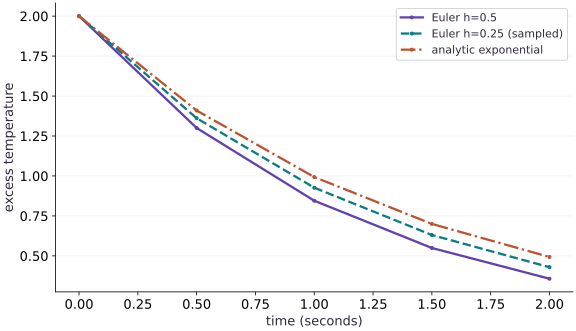

# A functional physical simulation

Phase 10: Scientific computing · about 85 minutes · CPU

## What you will be able to do

- Implement a pure scalar state transition with units and a fixed time grid.
- Separate a discrete implementation oracle from continuous approximation error.
- Demonstrate convergence and diagnose loss of stability.

## The problem

A hot object cools toward its surroundings. Can we predict its remaining excess temperature two seconds later, and tell a coding bug from a time-step error? We will build a small physical simulation, compare it with two independent references, and deliberately choose an unstable step.

## The idea

A numerical solver approximates a continuous process with discrete steps. A program can implement its update rule correctly and still differ from the physical solution. Check implementation error and discretization error separately.

## Separate a correct program from an accurate solver

For $y'=-y$, start at $y=1$. One Euler step of size $0.5$ gives $0.5$. The exact value at that time is $e^{-0.5}\approx0.6065$. The difference is expected discretization error, not necessarily an indexing bug.

Two Euler steps of size $0.25$ give $0.75^2=0.5625$ at the same final time. Comparing at equal physical time matters: taking the same number of smaller steps would change the question.

Read the trajectory plot by matching time coordinates and the analytic reference. Then reduce the step size and inspect the error trend. A finer step often improves this example, but stability, precision and compute cost still constrain a useful solver.

### Pause and reason

Why compare solutions at equal final time when changing the step size?

<details><summary>Compare your reasoning</summary>

Otherwise you compare different points of the physical trajectory. Increase the number of steps as needed to preserve the same time interval.

</details>

## Start with units and one step

The derivative gives change per second. Multiplying by a time step $h$ in seconds produces a change in temperature, which can be added to the current state. With $u_0=2$, $k=0.7$ and $h=0.5$, the first change is $-0.7$, so Euler predicts $u_1=1.3$. The exact value at that time is about $1.4094$: the slope becomes less negative as the object cools, but Euler holds the initial slope for the whole step.

$$
u_{n+1}=u_n+h(-ku_n)=(1-kh)u_n
$$

## Keep state explicit and keep the initial observation

The transition receives rate, current state and step length. It never changes a global variable. scan carries the state through time and saves the returned observations. Our output includes $u_0$, so its shape is $(N+1,)$ for $N$ updates. Forgetting the initial observation shifts every comparison by one time step. Float64 is enabled before array construction to make small numerical differences visible on CPU; this lesson makes no accelerator throughput claim.

## Use two references because they answer different questions

Repeated multiplication gives the exact answer for our discrete algorithm: $u_n=u_0(1-kh)^n$. It detects an implementation error without another loop. The differential equation has the continuous solution $u(t)=u_0e^{-kt}$. The discrepancy between those references measures discretization error. At two seconds the coarse Euler result is about $0.3570$, while the physical reference is $0.4932$. Both can be correct descriptions of their respective calculations.

$$
u(t)=u_0e^{-kt},\qquad e_N=\left|u_N-u_0e^{-kNh}\right|
$$

## Accuracy and stability are different requirements

The multiplier $1-kh$ controls every update. Its magnitude must be below one for decay: $0<kh<2$. To preserve nonnegative temperature excess at every step we need the stronger bound $0\le kh\le1$. When $1<kh<2$, the numerical result alternates sign while its magnitude shrinks. At $kh>2$, its magnitude grows, even though the actual physical solution always decays. A finite output and a differentiable program do not establish a faithful simulation.

## Make a convergence table before fitting parameters

Fix the physical horizon at two seconds, halve the time step and double the number of updates. Otherwise you change the question as well as the algorithm. The endpoint error should shrink roughly by a factor of two for this first-order method once the grid is reasonably fine. Convergence toward an analytic solution is evidence for this equation and parameter range; stiff systems, events and discontinuities need different tests.

## Define a state transition

Append this block to main.py in your CPU course environment; for the first block create the file. Run blocks in order.

```python
# Step 1 — Define a state transition: A scalar state enters and a new scalar leaves.
# Import jax for this computation.
import jax
# Update state in place with the new values.
jax.config.update("jax_enable_x64", True)
# Import jax.numpy for this computation.
import jax.numpy as jnp
import numpy as np

# Function `euler_step(rate, value, dt)` implementing this stage's computation:
def euler_step(rate, value, dt):
    # Return `value - dt * rate * value` to the caller.
    return value - dt*rate*value

# Define `euler_solve(rate, initial, steps, dt)` to carry state across steps with `jax.lax.scan`:
def euler_solve(rate, initial, steps, dt):
    # Function `advance(value, unused)` implementing this stage's computation:
    def advance(value, unused):
        # Run `euler_step` to compute `updated`.
        updated = euler_step(rate, value, dt)
        # Return `(updated, updated)` to the caller.
        return updated, updated
    # Run compiled structured control flow via `jax.lax` (`(_, tail)`).
    _, tail = jax.lax.scan(advance, initial, None, length=steps)
    # Return `jnp.concatenate((jnp.atleast_1d(initial), tail))` to the caller.
    return jnp.concatenate((jnp.atleast_1d(initial), tail))
```

A scalar state enters and a new scalar leaves. The initial value is saved explicitly, so a solve with four updates contains five observations. The step count is a Python integer, determining a fixed output shape.

## Compare the simulation with a physical reference

Append this block to main.py in your CPU course environment; for the first block create the file. Run blocks in order.

```python
# Step 2 — Compare the simulation with a physical reference: The geometric sequence verifies implementation correctness.
# Initialize array `(rate, initial, dt, steps)` with explicit values and shape.
rate, initial, dt, steps = 0.7, jnp.array(2.0), 0.5, 4
# Run `euler_solve` to compute `trajectory`.
trajectory = euler_solve(rate, initial, steps, dt)
# Initialize array `times` with explicit values and shape.
times = np.arange(steps+1)*dt
# Evaluate `continuous` from the current inputs and state.
continuous = 2.0*np.exp(-rate*times)
# Initialize array `discrete` with explicit values and shape.
discrete = 2.0*(1-rate*dt)**np.arange(steps+1)
# Verify that computed values match the expected reference within numerical tolerance.
np.testing.assert_allclose(trajectory, discrete, rtol=1e-12, atol=1e-12)
# Verify contract: `np.all(np.diff(np.asarray(trajectory)) < 0)`.
assert np.all(np.diff(np.asarray(trajectory)) < 0)
# Verify that the output satisfies the expected shape, finite-value, or numerical contract.
assert abs(float(trajectory[-1])-continuous[-1]) > 0.1
# Print the observed values to compare against the expected result.
print("Euler final:", float(trajectory[-1]), "analytic final:", continuous[-1])
```

The geometric sequence verifies implementation correctness. The exponential checks approximation error. Passing the first comparison does not make the numerical model exact.

## Refine the time grid without changing the experiment

Append this block to main.py in your CPU course environment; for the first block create the file. Run blocks in order.

```python
# Step 3 — Refine the time grid without changing the experiment: Every run stops at the same physical time.
# Initialize array `grid_sizes` with explicit values and shape.
grid_sizes = np.array([4, 8, 16, 32])
# Initialize array `endpoint_errors` with explicit values and shape.
endpoint_errors = np.array([abs(float(euler_solve(rate, initial, int(n), 2.0/n)[-1])-continuous[-1]) for n in grid_sizes])
# Verify contract: `np.all(np.diff(endpoint_errors) < 0)`.
assert np.all(np.diff(endpoint_errors) < 0)
# Verify that the output satisfies the expected shape, finite-value, or numerical contract.
assert 1.7 < endpoint_errors[-2]/endpoint_errors[-1] < 2.3
# Print the observed values to compare against the expected result.
print("Endpoint errors:", endpoint_errors)
# Print diagnostic summary of the computed outputs.
print("Last refinement ratio:", endpoint_errors[-2]/endpoint_errors[-1])
```

Every run stops at the same physical time. Halving the step approximately halves the global error, as expected for forward Euler on this smooth problem.

## Run the example

```python
# Step 1 — Define a state transition: A scalar state enters and a new scalar leaves.
# Import jax for this computation.
import jax
# Update state in place with the new values.
jax.config.update("jax_enable_x64", True)
# Import jax.numpy for this computation.
import jax.numpy as jnp
import numpy as np

# Function `euler_step(rate, value, dt)` implementing this stage's computation:
def euler_step(rate, value, dt):
    # Return `value - dt * rate * value` to the caller.
    return value - dt*rate*value

# Define `euler_solve(rate, initial, steps, dt)` to carry state across steps with `jax.lax.scan`:
def euler_solve(rate, initial, steps, dt):
    # Function `advance(value, unused)` implementing this stage's computation:
    def advance(value, unused):
        # Run `euler_step` to compute `updated`.
        updated = euler_step(rate, value, dt)
        # Return `(updated, updated)` to the caller.
        return updated, updated
    # Run compiled structured control flow via `jax.lax` (`(_, tail)`).
    _, tail = jax.lax.scan(advance, initial, None, length=steps)
    # Return `jnp.concatenate((jnp.atleast_1d(initial), tail))` to the caller.
    return jnp.concatenate((jnp.atleast_1d(initial), tail))

# Step 2 — Compare the simulation with a physical reference: The geometric sequence verifies implementation correctness.
# Initialize array `(rate, initial, dt, steps)` with explicit values and shape.
rate, initial, dt, steps = 0.7, jnp.array(2.0), 0.5, 4
# Run `euler_solve` to compute `trajectory`.
trajectory = euler_solve(rate, initial, steps, dt)
# Initialize array `times` with explicit values and shape.
times = np.arange(steps+1)*dt
# Evaluate `continuous` from the current inputs and state.
continuous = 2.0*np.exp(-rate*times)
# Initialize array `discrete` with explicit values and shape.
discrete = 2.0*(1-rate*dt)**np.arange(steps+1)
# Verify that computed values match the expected reference within numerical tolerance.
np.testing.assert_allclose(trajectory, discrete, rtol=1e-12, atol=1e-12)
# Verify contract: `np.all(np.diff(np.asarray(trajectory)) < 0)`.
assert np.all(np.diff(np.asarray(trajectory)) < 0)
# Verify that the output satisfies the expected shape, finite-value, or numerical contract.
assert abs(float(trajectory[-1])-continuous[-1]) > 0.1
# Print the observed values to compare against the expected result.
print("Euler final:", float(trajectory[-1]), "analytic final:", continuous[-1])

# Step 3 — Refine the time grid without changing the experiment: Every run stops at the same physical time.
# Initialize array `grid_sizes` with explicit values and shape.
grid_sizes = np.array([4, 8, 16, 32])
# Initialize array `endpoint_errors` with explicit values and shape.
endpoint_errors = np.array([abs(float(euler_solve(rate, initial, int(n), 2.0/n)[-1])-continuous[-1]) for n in grid_sizes])
# Verify contract: `np.all(np.diff(endpoint_errors) < 0)`.
assert np.all(np.diff(endpoint_errors) < 0)
# Verify that the output satisfies the expected shape, finite-value, or numerical contract.
assert 1.7 < endpoint_errors[-2]/endpoint_errors[-1] < 2.3
# Print the observed values to compare against the expected result.
print("Endpoint errors:", endpoint_errors)
# Print diagnostic summary of the computed outputs.
print("Last refinement ratio:", endpoint_errors[-2]/endpoint_errors[-1])
```

Expected: Euler final 0.3570125; analytic final 0.49319393. The endpoint errors decrease as the step is halved.

## A correct Euler program still has time-step error

**Predict:** Will halving the step make the endpoint move toward or away from the analytic curve?



**Recorded CPU computation**

### Read the figure

The horizontal axis is time in seconds; the vertical axis is excess temperature. All curves start at $2$. The solid coarse-grid curve takes four steps of $0.5$ seconds; the finer curve takes eight steps of $0.25$ seconds. The analytic exponential is evaluated at the same displayed times.

At two seconds, coarse Euler ends at $0.3570$, finer Euler at $0.4292$, and the analytic model at $0.4932$. Both discrete curves lie below the exponential here. A larger step keeps an overly negative slope active for longer, so the object appears to cool too quickly.

### Connect it to the computation

The code checks the coarse curve against the exact geometric sequence for Euler. That comparison passes even though the plot shows a visible physical approximation error. The separate refinement table quantifies that gap at a fixed endpoint.

These curves describe a stable, positive parameter choice. They do not establish accuracy for every time step or equation. The instability experiment changes the multiplier until the numerical behavior no longer resembles cooling.

```python
# Compute figure data for: A correct Euler program still has time-step error
# Create device-backed JAX array `fine`.
fine = np.asarray(euler_solve(0.7, jnp.array(2.0), 8, 0.25))[::2]
# Convert `visual_data` to a host NumPy array for inspection or verification.
visual_data = {'kind':'line','x':times.tolist(),'xlabel':'time (seconds)','ylabel':'excess temperature','series':[{'label':'Euler h=0.5','y':np.asarray(trajectory).tolist()},{'label':'Euler h=0.25 (sampled)','y':fine.tolist()},{'label':'analytic exponential','y':continuous.tolist()}]}
```

## Recorded reference execution

CPU run: 2026-10-08T14:04:09.728594+00:00. JAX 0.9.2.

```text
Euler final: 0.3570125000000001 analytic final: 0.493193927883213
Endpoint errors: [0.13618143 0.06399208 0.03107265 0.0153167 ]
Last refinement ratio: 2.0286780018480166
Euler final: 0.3570125000000001 analytic final: 0.493193927883213
Endpoint errors: [0.13618143 0.06399208 0.03107265 0.0153167 ]
Last refinement ratio: 2.0286780018480166
Stable but sign-alternating: [ 2.     -0.8     0.32   -0.128   0.0512]
Unstable numerical endpoint: 3.543121999999993
Changed rate, initial state and grid verified
Energy checks distinguish growth, but not sign preservation
Same-horizon errors: [np.float64(0.050590770107151406), np.float64(0.02471618055802971), np.float64(0.012218898970361547)]
PASS: science-01

```

## Stable does not mean physically positive

**Predict before running:** For $k=0.7$ and $h=2$, predict the signs of the first four states.

```python
# Experiment — Stable does not mean physically positive: The magnitude decays because |1-kh|=0.4, but crossing below...
# Initialize array `oscillatory` with explicit values and shape.
oscillatory = euler_solve(0.7, jnp.array(2.0), 4, 2.0)
# Verify that computed values match the expected reference within numerical tolerance.
np.testing.assert_allclose(oscillatory, [2.0, -0.8, 0.32, -0.128, 0.0512], atol=1e-12)
# Print the observed values to compare against the expected result.
print("Stable but sign-alternating:", np.asarray(oscillatory))
```

**Expected:** [2, -0.8, 0.32, -0.128, 0.0512]

The magnitude decays because $|1-kh|=0.4$, but crossing below ambient repeatedly is an artifact of this explicit update.

## Reproduce numerical instability

**Predict before running:** At $h=3$, is the exact model unstable, or only our update?

```python
# Experiment — Reproduce numerical instability: The multiplier is -1.1.
# Initialize array `unstable` with explicit values and shape.
unstable = euler_solve(0.7, jnp.array(2.0), 6, 3.0)
# Verify contract: `abs(float(unstable[-1])) > 2.0`.
assert abs(float(unstable[-1])) > 2.0
# Verify that the output satisfies the expected shape, finite-value, or numerical contract.
assert 2*np.exp(-0.7*18) < 1e-4
# Print the observed values to compare against the expected result.
print("Unstable numerical endpoint:", float(unstable[-1]))
```

**Expected:** The numerical magnitude grows above its initial value; the analytic endpoint is near zero.

The multiplier is $-1.1$. Reducing the time step repairs this discretization; clipping negative values would hide the defect and change the model.

## Make it yours

Change the rate to $0.3$, the initial excess to $5$, and use twenty steps of $0.1$ seconds. Verify the full discrete trajectory and bound the endpoint error against the exponential.

### How to write this exercise — Step-by-step recipe & starter scaffold

**Key functions & syntax to use:**
- `jnp.array(values, dtype=...)` — Constructs an immutable device-backed JAX array from Python/NumPy values.
- `jnp.allclose(actual, expected, rtol=..., atol=...)` — Checks that two arrays match elementwise within floating-point tolerance.

**Step-by-step implementation plan:**
1. Initialize array `changed` with explicit values and shape.
2. Initialize array `reference` with explicit values and shape.
3. Verify that computed values match the expected reference within numerical tolerance.
4. Verify contract: `float(changed[0]) == 5.0`.
5. Verify that the output satisfies the expected shape, finite-value, or numerical contract.

**Starter code scaffold (fill in the TODOs):**

```python
# Exercise solution: Change the rate to 0.3, the initial excess to 5, and use twenty steps...
# Initialize array `changed` with explicit values and shape.
changed = euler_solve(...)  # TODO: compute changed
# Initialize array `reference` with explicit values and shape.
reference = ...  # TODO: compute reference
# Verify that computed values match the expected reference within numerical tolerance.
np.testing.assert_allclose(changed, reference, rtol = ...  # TODO: compute np.testing.assert_allclose(changed, reference, rtol
# Verify contract: `float(changed[0]) == 5.0`.
assert float(changed[0])  # TODO: complete assertion check
# Verify that the output satisfies the expected shape, finite-value, or numerical contract.
assert abs(float(changed[-1])-5*np.exp(-0.6))  # TODO: complete assertion check
# Print the observed values to compare against the expected result.
print("Changed rate, initial state and grid verified")
```

<details><summary>Reference solution</summary>

```python
# Exercise solution: Change the rate to 0.3, the initial excess to 5, and use twenty steps...
# Initialize array `changed` with explicit values and shape.
changed = euler_solve(0.3, jnp.array(5.0), 20, 0.1)
# Initialize array `reference` with explicit values and shape.
reference = 5.0*(1-0.3*0.1)**np.arange(21)
# Verify that computed values match the expected reference within numerical tolerance.
np.testing.assert_allclose(changed, reference, rtol=1e-12)
# Verify contract: `float(changed[0]) == 5.0`.
assert float(changed[0]) == 5.0
# Verify that the output satisfies the expected shape, finite-value, or numerical contract.
assert abs(float(changed[-1])-5*np.exp(-0.6)) < 0.03
# Print the observed values to compare against the expected result.
print("Changed rate, initial state and grid verified")
```

</details>

## Energy does not check every invariant

**Practice**

Construct an energy diagnostic $E_n=u_n^2/2$. Test a monotone stable grid and an unstable grid, and explain why decreasing energy alone does not guarantee a nonnegative state.

<details><summary>Hint</summary>

Compare successive squared magnitudes. The sign-alternating case from the experiment still loses energy.

</details>

### How to write: Energy does not check every invariant — Step-by-step recipe & starter scaffold

**Key functions & syntax to use:**
- `jnp.array(values, dtype=...)` — Constructs an immutable device-backed JAX array from Python/NumPy values.

**Step-by-step implementation plan:**
1. Iterate over `h` to step through the computation:
2. Initialize array `u` with explicit values and shape.
3. Verify contract: `np.all(np.diff(u * u / 2) < 0)`.
4. Initialize array `u` with explicit values and shape.
5. Verify contract: `np.all(np.diff(u * u / 2) > 0)`.

**Starter code scaffold (fill in the TODOs):**

```python
# Energy does not check every invariant (Practice): A scalar diagnostic can establish decay without capturing...
# Iterate over `h` to step through the computation:
for h in (0.5, 2.0):
    # Initialize array `u` with explicit values and shape.
    u = np.asarray(...)  # TODO: compute u
    # Verify contract: `np.all(np.diff(u * u / 2) < 0)`.
    assert np.all(np.diff(u*u/2)  # TODO: complete assertion check
# Initialize array `u` with explicit values and shape.
u = np.asarray(...)  # TODO: compute u
# Verify contract: `np.all(np.diff(u * u / 2) > 0)`.
assert np.all(np.diff(u*u/2)  # TODO: complete assertion check
# Print the observed values to compare against the expected result.
print("Energy checks distinguish growth, but not sign preservation")
```

<details><summary>Reference solution and reasoning</summary>

```python
# Energy does not check every invariant (Practice): A scalar diagnostic can establish decay without capturing...
# Iterate over `h` to step through the computation:
for h in (0.5, 2.0):
    # Initialize array `u` with explicit values and shape.
    u = np.asarray(euler_solve(0.7, jnp.array(2.0), 6, h))
    # Verify contract: `np.all(np.diff(u * u / 2) < 0)`.
    assert np.all(np.diff(u*u/2) < 0)
# Initialize array `u` with explicit values and shape.
u = np.asarray(euler_solve(0.7, jnp.array(2.0), 6, 3.0))
# Verify contract: `np.all(np.diff(u * u / 2) > 0)`.
assert np.all(np.diff(u*u/2) > 0)
# Print the observed values to compare against the expected result.
print("Energy checks distinguish growth, but not sign preservation")
```

A scalar diagnostic can establish decay without capturing every physical invariant. Preserve sign checks separately.

</details>

## Keep the physical horizon fixed

**Challenge**

A colleague reports lower error after reducing both the step and number of updates. Reconstruct the final time for each run and repair the comparison.

<details><summary>Hint</summary>

The horizon is number of updates multiplied by step length.

</details>

### How to write: Keep the physical horizon fixed — Step-by-step recipe & starter scaffold

**Key functions & syntax to use:**
- `jnp.array(values, dtype=...)` — Constructs an immutable device-backed JAX array from Python/NumPy values.

**Step-by-step implementation plan:**
1. Evaluate `errors` from the current inputs and state.
2. Iterate over `n` to step through the computation:
3. Evaluate `h` from the current inputs and state.
4. Initialize array `final` with explicit values and shape.
5. Append the current step result to `errors`.

**Starter code scaffold (fill in the TODOs):**

```python
# Keep the physical horizon fixed (Challenge): A refinement study must hold the modeled experiment fixed;...
horizon = ...  # TODO: compute horizon
# Evaluate `errors` from the current inputs and state.
errors = ...  # TODO: compute errors
# Iterate over `n` to step through the computation:
for n in (10, 20, 40):
    # Evaluate `h` from the current inputs and state.
    h = ...  # TODO: compute h
    # Initialize array `final` with explicit values and shape.
    final = euler_solve(...)  # TODO: compute final
    # Append the current step result to `errors`.
    errors.append(abs(float(final)-2*np.exp(-0.7*horizon)))
# Verify contract: `errors[2] < errors[1] < errors[0]`.
assert errors[2]  # TODO: complete assertion check
# Print the observed values to compare against the expected result.
print("Same-horizon errors:", errors)
```

<details><summary>Reference solution and reasoning</summary>

```python
# Keep the physical horizon fixed (Challenge): A refinement study must hold the modeled experiment fixed;...
horizon = 2.0
# Evaluate `errors` from the current inputs and state.
errors = []
# Iterate over `n` to step through the computation:
for n in (10, 20, 40):
    # Evaluate `h` from the current inputs and state.
    h = horizon/n
    # Initialize array `final` with explicit values and shape.
    final = euler_solve(0.7, jnp.array(2.0), n, h)[-1]
    # Append the current step result to `errors`.
    errors.append(abs(float(final)-2*np.exp(-0.7*horizon)))
# Verify contract: `errors[2] < errors[1] < errors[0]`.
assert errors[2] < errors[1] < errors[0]
# Print the observed values to compare against the expected result.
print("Same-horizon errors:", errors)
```

A refinement study must hold the modeled experiment fixed; comparing different end times conflates physical change and numerical accuracy.

</details>

## Check your understanding

The code matches the geometric-sequence reference exactly but differs from the exponential. What have we established?

1. The continuous equation must be wrong.
2. Automatic differentiation needs a smaller learning rate.
3. The discrete update is implemented correctly; its time-step error still needs assessment.

<details><summary>Answer and explanation</summary>

The discrete update is implemented correctly; its time-step error still needs assessment.

The geometric sequence is an oracle for the discrete method. The exponential is a separate oracle for the differential equation. They answer different questions.

</details>

## Diagnose the result

If outputs alternate sign, inspect $kh$ before editing the physical rate. If the curve has the right shape but every point is shifted, compare the saved initial point and time indexing. If a refinement study improves unpredictably, verify that every run ends at the same physical time.

## Carry forward

- Start with units and one step
- Keep state explicit and keep the initial observation
- Use two references because they answer different questions
- Accuracy and stability are different requirements
- Make a convergence table before fitting parameters

## Keep your evidence

Full geometric/exponential comparisons, fixed-horizon refinement table, unstable-step failure and repair. Keep the environment, observed outputs and your explanation of the figure.

Save your predictions, modified code, terminal outputs, and reasoning in your engineering portfolio.

## Primary references

- [JAX scan: fixed carry structure and reverse-mode differentiation](https://docs.jax.dev/en/latest/_autosummary/jax.lax.scan.html)
- [JAX automatic vectorization](https://docs.jax.dev/en/latest/_autosummary/jax.vmap.html)
- [JAX derivative checking and Jacobian products](https://docs.jax.dev/en/latest/notebooks/autodiff_cookbook.html)
- [Diffrax solver terms, saved values and solution inspection](https://docs.kidger.site/diffrax/usage/getting-started/)

