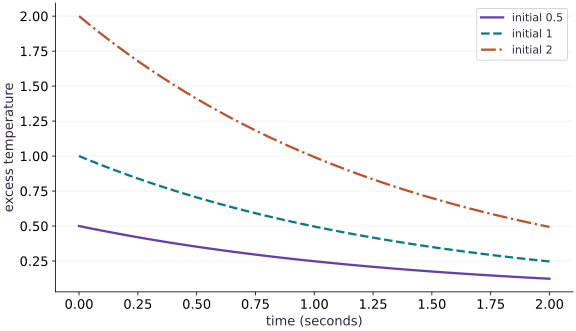

# Vectorize trajectories and scan time

Phase 10: Scientific computing · about 100 minutes · CPU

## What you will be able to do

- Construct and verify a fourth-order fixed-step transition.
- Distinguish batch-major from time-major trajectory layouts.
- Compare two valid scan/vectorization compositions numerically.
- Separate independent ensembles from interacting states.

## The problem

You need to simulate a collection of experimental starts, not just one. Which dimension represents independent experiments, and which represents sequential time? We will build both compositions explicitly and verify that their axes and physical predictions agree.

## The idea

Time steps depend on their predecessors, so scan handles that dependency. Different initial conditions can evolve independently under the same rate, so vmap handles that batch. These transformations describe different kinds of structure. Neither is a promise that the program will run faster on a particular device.

## Improve one step before multiplying trajectories

Forward Euler samples the slope only at the start of the interval. Classical RK4 samples a start slope, two midpoint slopes and an endpoint slope, then combines them with weights $1,2,2,1$. The intermediate states are trial values, not four extra saved observations. For our linear equation the full step is multiplication by a fourth-degree approximation to $e^{-kh}$. This makes an independent algebraic oracle possible.

$$
R(z)=1+z+\frac{z^2}{2}+\frac{z^3}{6}+\frac{z^4}{24},\qquad u_{n+1}=R(-kh)u_n
$$

## Read shapes as physical statements

Three initial values and forty updates produce a batch-major array of shape $(3,41)$. Row $b$ is one trajectory; column $n$ holds all experiment values at time $nh$. The extra time point is the initial state. We deliberately use different axis sizes to make an accidental transpose visible. A mean over the batch answers a different question from a mean over time.

## One transformation handles independence; another handles dependency

vmap transforms a scalar simulation into an ensemble operation. scan still enforces the sequential state dependence inside each trajectory. Reversing the composition is possible here: the carry can hold all three independent states, giving a time-major result of shape $(41,3)$. Its transpose matches the first construction. If one trajectory exchanges heat with another, the batch members no longer obey independent scalar equations; write a coupled vector state instead.

## Use physical structure as a second check

This equation is linear in the initial state. Starting at $2$ must produce four times the trajectory starting at $0.5$. That check is separate from the exponential comparison and catches unintended normalization over the batch axis. Linearity is special to this model; do not impose it on a nonlinear reaction model simply because batching worked here.

## Choose saved outputs deliberately

Saving every state costs storage proportional to batch size times number of saved times. Some objectives need only the final state. In that case return no saved observation from scan and keep its final carry. This reduces the explicit output size; it does not by itself establish the memory cost of reverse-mode differentiation, which may retain or recompute intermediates.

## Use a higher-order scalar transition

Append this block to main.py in your CPU course environment; for the first block create the file. Run blocks in order.

```python
import jax
jax.config.update("jax_enable_x64", True)
import jax.numpy as jnp
import numpy as np

def rk4_step(rate, value, dt):
    a = -rate*value
    b = -rate*(value + dt*a/2)
    c = -rate*(value + dt*b/2)
    d = -rate*(value + dt*c)
    return value + dt*(a + 2*b + 2*c + d)/6

def solve(rate, initial, steps=40, dt=0.05):
    def advance(value, unused):
        next_value = rk4_step(rate, value, dt)
        return next_value, next_value
    _, tail = jax.lax.scan(advance, initial, None, length=steps)
    return jnp.concatenate((jnp.atleast_1d(initial), tail))
```

Runge–Kutta uses four slopes inside one step. It remains a pure transition, so the same scan interface can save its trajectory.

## Batch initial conditions while sharing the model

Append this block to main.py in your CPU course environment; for the first block create the file. Run blocks in order.

```python
initials = jnp.array([0.5, 1.0, 2.0])
rate, dt, steps = 0.7, 0.05, 40
simulate_batch = jax.jit(jax.vmap(lambda initial: solve(rate, initial, steps, dt)))
trajectories = simulate_batch(initials)
times = np.arange(steps+1)*dt
oracle = np.asarray(initials)[:,None]*np.exp(-rate*times[None,:])
assert trajectories.shape == (3, 41)
np.testing.assert_allclose(trajectories, oracle, rtol=3e-8, atol=1e-10)
np.testing.assert_allclose(np.asarray(trajectories)[2], 4*np.asarray(trajectories)[0], rtol=1e-12)
print("Shape:", trajectories.shape, "endpoints:", np.asarray(trajectories)[:,-1])
```

The batch axis is independent initial conditions, not time. The shared rate and grid are closed over here; vmap adds one leading axis to the scalar solve.

## Change composition and verify axis meaning

Append this block to main.py in your CPU course environment; for the first block create the file. Run blocks in order.

```python
def scan_batch(rate, values, steps=40, dt=0.05):
    def advance(state, unused):
        updated = rk4_step(rate, state, dt)
        return updated, updated
    _, tail = jax.lax.scan(advance, values, None, length=steps)
    return jnp.concatenate((values[None,:], tail), axis=0)
time_major = scan_batch(rate, initials)
assert time_major.shape == (41, 3)
np.testing.assert_allclose(time_major.T, trajectories, rtol=1e-12, atol=1e-12)
print("scan(vectors) transposed equals vmap(scan)")
```

Array arithmetic applies the independent scalar dynamics to all initial conditions. This equivalence would fail if the model coupled different batch members.

## Run the example

```python
import jax
jax.config.update("jax_enable_x64", True)
import jax.numpy as jnp
import numpy as np

def rk4_step(rate, value, dt):
    a = -rate*value
    b = -rate*(value + dt*a/2)
    c = -rate*(value + dt*b/2)
    d = -rate*(value + dt*c)
    return value + dt*(a + 2*b + 2*c + d)/6

def solve(rate, initial, steps=40, dt=0.05):
    def advance(value, unused):
        next_value = rk4_step(rate, value, dt)
        return next_value, next_value
    _, tail = jax.lax.scan(advance, initial, None, length=steps)
    return jnp.concatenate((jnp.atleast_1d(initial), tail))

initials = jnp.array([0.5, 1.0, 2.0])
rate, dt, steps = 0.7, 0.05, 40
simulate_batch = jax.jit(jax.vmap(lambda initial: solve(rate, initial, steps, dt)))
trajectories = simulate_batch(initials)
times = np.arange(steps+1)*dt
oracle = np.asarray(initials)[:,None]*np.exp(-rate*times[None,:])
assert trajectories.shape == (3, 41)
np.testing.assert_allclose(trajectories, oracle, rtol=3e-8, atol=1e-10)
np.testing.assert_allclose(np.asarray(trajectories)[2], 4*np.asarray(trajectories)[0], rtol=1e-12)
print("Shape:", trajectories.shape, "endpoints:", np.asarray(trajectories)[:,-1])

def scan_batch(rate, values, steps=40, dt=0.05):
    def advance(state, unused):
        updated = rk4_step(rate, state, dt)
        return updated, updated
    _, tail = jax.lax.scan(advance, values, None, length=steps)
    return jnp.concatenate((values[None,:], tail), axis=0)
time_major = scan_batch(rate, initials)
assert time_major.shape == (41, 3)
np.testing.assert_allclose(time_major.T, trajectories, rtol=1e-12, atol=1e-12)
print("scan(vectors) transposed equals vmap(scan)")
```

Expected: Shape (3, 41); endpoints approximately [0.12329849, 0.24659697, 0.49319394]. Both compositions agree.

## Batching preserves independent physical trajectories

**Predict:** Should the highest curve decay proportionally faster, or preserve its ratio to the other curves?



**Recorded CPU computation**

### Read the figure

Time in seconds runs horizontally; excess temperature runs vertically. The three curves correspond to initial values $0.5$, $1$ and $2$. Each is one row of the batch-major output, including its initial observation.

At two seconds their values are approximately $0.1233$, $0.2466$ and $0.4932$. Their absolute changes differ, but every curve retains the same fraction of its initial value. The highest remains four times the lowest throughout.

### Connect it to the computation

The common rate produces that shared relative decay. vmap adds independent experiments without inserting a mean, normalization or interaction between them. The code checks both this proportional relationship and the analytic exponential.

The plot has no runtime or memory axis. It establishes numerical behavior for this ensemble, not a speedup from vectorization. The last lesson adds synchronized measurements with their own limitations.

```python
visual_data={'kind':'line','x':times.tolist(),'xlabel':'time (seconds)','ylabel':'excess temperature','series':[{'label':f'initial {float(u):g}','y':np.asarray(trajectories)[i].tolist()} for i,u in enumerate(initials)]}
```

## Recorded reference execution

CPU run: 2026-10-06T01:24:42.732612+00:00. JAX 0.9.2.

```text
Shape: (3, 41) endpoints: [0.12329848 0.24659697 0.49319394]
scan(vectors) transposed equals vmap(scan)
Shape: (3, 41) endpoints: [0.12329848 0.24659697 0.49319394]
scan(vectors) transposed equals vmap(scan)
RK4 polynomial maximum difference: 1.4432899320127035e-15
Paired-rate endpoints: [0.33516002 0.24659697 0.22160636]
Permutation preserves trajectory identity
Only final states returned: [0.12329848 0.24659697 0.49319394]
Grid axes: rate, initial condition, time (3, 3, 41)
PASS: science-02

```

## Compare RK4 with an independent polynomial

**Predict before running:** If the step is correct, can a loop-free formula reproduce every saved state?

```python
z = -rate*dt
multiplier = 1 + z + z*z/2 + z**3/6 + z**4/24
polynomial = np.asarray(initials)[:,None]*multiplier**np.arange(steps+1)[None,:]
np.testing.assert_allclose(trajectories, polynomial, rtol=1e-12, atol=1e-12)
print("RK4 polynomial maximum difference:", np.max(np.abs(np.asarray(trajectories)-polynomial)))
```

**Expected:** Differences are near float64 roundoff.

This checks the discrete algorithm independently of the continuous exponential. RK4 has much smaller error here but is not exact.

## Let each trajectory have its own rate

**Predict before running:** Which argument axes should map if rates and initial conditions are paired?

```python
rates = jnp.array([0.2, 0.7, 1.1])
paired = jax.vmap(lambda k, u: solve(k,u), in_axes=(0,0))(rates,initials)
paired_reference = np.asarray(initials)[:,None]*np.exp(-np.asarray(rates)[:,None]*times)
np.testing.assert_allclose(paired,paired_reference,rtol=2e-7,atol=1e-10)
print("Paired-rate endpoints:", np.asarray(paired)[:,-1])
```

**Expected:** Three trajectories now have different relative decay rates.

Mapping both axes pairs corresponding entries. A grid of every rate with every initial value would require nested mapping and a different output contract.

## Make it yours

Add a fourth initial condition, verify the changed output shape and exponential values, then verify that reordering initial conditions reorders rows only.

<details><summary>Reference solution</summary>

```python
changed_initials = jnp.array([0.5, 1.0, 2.0, 3.0])
changed = jax.vmap(lambda u: solve(0.7,u))(changed_initials)
assert changed.shape == (4,41)
np.testing.assert_allclose(changed,np.asarray(changed_initials)[:,None]*np.exp(-0.7*times),rtol=3e-8)
order = jnp.array([3,0,2,1])
reordered = jax.vmap(lambda u: solve(0.7,u))(changed_initials[order])
np.testing.assert_allclose(reordered,changed[order],rtol=1e-12)
print("Permutation preserves trajectory identity")
```

</details>

## Save only what the objective needs

**Practice**

Implement a final-state-only solve and compare it with the final column of the saved batch. Explain which allocation was removed.

<details><summary>Hint</summary>

scan may emit None while its carry still advances.

</details>

<details><summary>Reference solution and reasoning</summary>

```python
def final_only(rate, initial, steps=40, dt=0.05):
    def advance(value, unused):
        return rk4_step(rate,value,dt), None
    return jax.lax.scan(advance,initial,None,length=steps)[0]
finals = jax.vmap(lambda u: final_only(0.7,u))(initials)
np.testing.assert_allclose(finals,trajectories[:,-1],rtol=1e-12)
print("Only final states returned:", np.asarray(finals))
```

The explicit trajectory output is removed. Differentiation memory requires separate analysis and measurement.

</details>

## Pairing versus Cartesian products

**Challenge**

Build the full grid of three rates and three initial values. Show that its diagonal agrees with the paired-rate experiment.

<details><summary>Hint</summary>

Use nested vmap; identify the rate, initial-condition and time axes explicitly.

</details>

<details><summary>Reference solution and reasoning</summary>

```python
grid = jax.vmap(lambda k: jax.vmap(lambda u: solve(k,u))(initials))(rates)
assert grid.shape == (3,3,41)
np.testing.assert_allclose(grid[jnp.arange(3),jnp.arange(3)],paired,rtol=1e-12)
print("Grid axes: rate, initial condition, time", grid.shape)
```

Paired batches and Cartesian products are different experiments. The diagonal correspondence verifies the axis interpretation.

</details>

## Check your understanding

What does a shape of (3, 41) mean in the batch-major solver?

1. Three independent initial conditions, each with the initial state plus forty updates.
2. Three time points, each with forty-one parameters.
3. Forty-one independent devices.

<details><summary>Answer and explanation</summary>

Three independent initial conditions, each with the initial state plus forty updates.

vmap contributes the leading independent-experiment axis. The scalar solve contributes its forty-one saved states; no device placement is specified.

</details>

## Diagnose the result

If the reference comparison broadcasts unexpectedly, print both shapes before reducing anything. Compare a named row and a named time column. If changing one initial condition changes other rows, inspect reductions or coupling across the batch. A reduction can hide an axis error while still producing a plausible scalar.

## Carry forward

- Improve one step before multiplying trajectories
- Read shapes as physical statements
- One transformation handles independence; another handles dependency
- Use physical structure as a second check
- Choose saved outputs deliberately

## Keep your evidence

Polynomial/exponential references, batch/time shape diagram, permutation and final-only checks. Keep the environment, observed outputs and your explanation of the figure.

Keep predictions, modified code, observed results, and reasoning. A checkpoint alone does not demonstrate the exercise.

## Primary references

- [JAX scan: fixed carry structure and reverse-mode differentiation](https://docs.jax.dev/en/latest/_autosummary/jax.lax.scan.html)
- [JAX automatic vectorization](https://docs.jax.dev/en/latest/_autosummary/jax.vmap.html)
- [JAX derivative checking and Jacobian products](https://docs.jax.dev/en/latest/notebooks/autodiff_cookbook.html)
- [Diffrax solver terms, saved values and solution inspection](https://docs.kidger.site/diffrax/usage/getting-started/)

