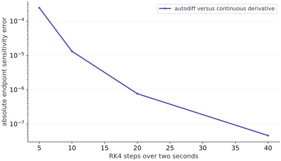

# Differentiate through a solver

Phase 10: Scientific computing · about 105 minutes · CPU

## What you will be able to do

- Derive an independent discrete solver sensitivity.
- Check an observation-loss gradient at a nonoptimal parameter.
- Separate derivative implementation error from discretization error.
- Explain static-grid differentiation and the limits of this solver.

## The problem

A simulation can produce a convincing curve and an incorrect sensitivity. Before using gradients to infer a physical parameter, how can we tell whether the derivative is right, and whether it describes the continuous equation closely enough?

## The idea

Differentiating a numerical solver gives sensitivity of its discrete computation. That sensitivity can approach the continuous system's sensitivity as the discretization improves, but the two are not automatically identical at a finite step size.

## Differentiate the computation you actually executed

For $y'=-ay$, Euler gives $y_N=(1-ah)^N y_0$, where $h$ is step size and $N$ is step count. Differentiating that expression gives $-Nh(1-ah)^{N-1}y_0$. The continuous derivative at time $T=Nh$ is instead $-Ty_0e^{-aT}$.

These expressions give two distinct references: one checks differentiation through the discrete steps, and the other measures convergence toward the continuous sensitivity. Hold final time fixed as you refine the grid.

In the sensitivity plot, disagreement with the continuous answer can be discretization error even when autodiff is correct. Compare the discrete analytic derivative first, then inspect refinement behavior.

### Pause and reason

Which reference isolates an autodiff implementation error from solver approximation error?

<details><summary>Compare your reasoning</summary>

The derivative of the same discrete update rule. The continuous sensitivity is valuable for convergence, but includes the effect of discretization.

</details>

## Follow one parameter through every time step

Changing $k$ changes every state transition. RK4 on this linear equation is multiplication by $R(-kh)$, so the final state after $N$ steps is $u_0R(-kh)^N$. Differentiate that expression with the chain rule. The derivative includes $-h$, which is easy to lose when differentiating the polynomial. For our parameters it is about $-0.98638781$: increasing the rate lowers the remaining temperature.

$$
\frac{\partial u_N}{\partial k}=u_0N R(-kh)^{N-1}\left[-h\left(1-kh+\frac{(kh)^2}{2}-\frac{(kh)^3}{6}\right)\right]
$$

## Check the discrete derivative before asking about physics

JAX and the polynomial derivative agree to near float64 roundoff. The continuous derivative is $-tu_0e^{-kt}$, approximately $-0.98638786$ at two seconds. Their small difference is expected from the numerical method. A perfect autodiff check cannot remove that bias. Refine the grid and see whether both the state and its sensitivity approach the continuous reference.

## Turn a trajectory into a scalar objective

The loss averages squared errors over all forty-one saved times. Its derivative adds each residual multiplied by the sensitivity of that observation, including the factor of two and mean normalization. The initial observation contributes zero rate sensitivity because the initial value is fixed. Evaluate the gradient away from the optimum: at the optimum, both a broken zero gradient and a correct gradient may look similar.

$$
L(k)=\frac{1}{N+1}\sum_{n=0}^N\left(u_n(k)-y_n\right)^2
$$

## Use a finite-difference window, not one magical epsilon

A central finite difference probes the change in the whole objective. If the perturbation is too large, curvature biases the estimate; if it is too small, subtracting nearly equal floating-point values loses information. Sweep several perturbations and look for a range of agreement. Keep initial state, observations, grid and precision fixed across the comparison. This lesson uses float64; copying its smallest perturbation into a float32 program requires rechecking tolerances.

## Know which solver problem you have solved

The grid is fixed and the output length is static. We have not implemented adaptive error control, event handling, stiffness detection or a custom adjoint. A Python integer controls scan length; a parameter-dependent early exit would introduce a different differentiation problem. For richer systems, Diffrax exposes solver choice, tolerances, saved times and adjoint strategies. Its optional extension belongs in a separately pinned and executed environment; these core CPU checks do not validate that library or an adaptive solver.

## Rebuild the differentiable solver

Append this block to main.py in your CPU course environment; for the first block create the file. Run blocks in order.

```python
# Step 1 — Rebuild the differentiable solver: The solver remains a pure JAX function with a static number of...
# Import jax for this computation.
import jax
# Update state in place with the new values.
jax.config.update("jax_enable_x64", True)
# Import jax.numpy for this computation.
import jax.numpy as jnp
import numpy as np

# Function `rk4_step(rate, value, dt)` implementing this stage's computation:
def rk4_step(rate, value, dt):
    # Evaluate `a` from the current inputs and state.
    a = -rate*value
    # Evaluate `b` from the current inputs and state.
    b = -rate*(value + dt*a/2)
    # Evaluate `c` from the current inputs and state.
    c = -rate*(value + dt*b/2)
    # Evaluate `d` from the current inputs and state.
    d = -rate*(value + dt*c)
    # Return `value + dt * (a + 2 * b + 2 * c + d) / 6` to the caller.
    return value + dt*(a + 2*b + 2*c + d)/6

# Define `solve(rate, initial, steps, dt)` to carry state across steps with `jax.lax.scan`:
def solve(rate, initial, steps=40, dt=0.05):
    # Function `advance(value, unused)` implementing this stage's computation:
    def advance(value, unused):
        # Run `rk4_step` to compute `next_value`.
        next_value = rk4_step(rate, value, dt)
        # Return `(next_value, next_value)` to the caller.
        return next_value, next_value
    # Run compiled structured control flow via `jax.lax` (`(_, tail)`).
    _, tail = jax.lax.scan(advance, initial, None, length=steps)
    # Return `jnp.concatenate((jnp.atleast_1d(initial), tail))` to the caller.
    return jnp.concatenate((jnp.atleast_1d(initial), tail))
```

The solver remains a pure JAX function with a static number of scan steps. No host conversion occurs inside the differentiated calculation.

## Check the derivative of the discrete endpoint

Append this block to main.py in your CPU course environment; for the first block create the file. Run blocks in order.

```python
# Step 2 — Check the derivative of the discrete endpoint: Autodiff gives the derivative of the actual RK4 program.
# Initialize array `(rate, initial, steps, dt)` with explicit values and shape.
rate, initial, steps, dt = 0.7, jnp.array(2.0), 40, 0.05
# Evaluate `endpoint` from the current inputs and state.
endpoint = lambda k: solve(k,initial,steps,dt)[-1]
# Differentiate the objective to obtain `autodiff` via automatic differentiation.
autodiff = float(jax.grad(endpoint)(rate))
# Evaluate `z` from the current inputs and state.
z = -rate*dt
# Evaluate `r` from the current inputs and state.
r = 1+z+z*z/2+z**3/6+z**4/24
# Evaluate `dr_dk` from the current inputs and state.
dr_dk = -dt*(1+z+z*z/2+z**3/6)
# Evaluate `discrete_gradient` from the current inputs and state.
discrete_gradient = 2.0*steps*r**(steps-1)*dr_dk
# Evaluate `continuous_gradient` from the current inputs and state.
continuous_gradient = -2.0*(steps*dt)*np.exp(-rate*steps*dt)
# Verify that computed values match the expected reference within numerical tolerance.
np.testing.assert_allclose(autodiff,discrete_gradient,rtol=1e-11,atol=1e-12)
# Verify that computed values match the expected reference within numerical tolerance.
np.testing.assert_allclose(autodiff,continuous_gradient,rtol=1e-7)
# Print the observed values to compare against the expected result.
print("Autodiff:",autodiff,"discrete oracle:",discrete_gradient,"continuous oracle:",continuous_gradient)
```

Autodiff gives the derivative of the actual RK4 program. Compare first against the discrete polynomial derivative, then assess how closely that approximates the continuous sensitivity.

## Differentiate an observation loss and check its direction

Append this block to main.py in your CPU course environment; for the first block create the file. Run blocks in order.

```python
# Step 3 — Differentiate an observation loss and check its direction: The candidate rate is too large.
# Initialize array `times` with explicit values and shape.
times = jnp.arange(steps+1)*dt
# Evaluate `observations` from the current inputs and state.
observations = 2.0*jnp.exp(-0.7*times)
# Function `objective(k)` implementing this stage's computation:
def objective(k):
    # Return `jnp.mean((solve(k, initial, steps, dt) - observations) ** 2)` to the caller.
    return jnp.mean((solve(k,initial,steps,dt)-observations)**2)
# Evaluate `probe` from the current inputs and state.
probe = 1.0
# Differentiate the objective to obtain `(value, derivative)` via automatic differentiation.
value, derivative = jax.value_and_grad(objective)(probe)
# Evaluate `epsilon` from the current inputs and state.
epsilon = 1e-4
# Evaluate `finite_difference` from the current inputs and state.
finite_difference = (float(objective(probe+epsilon))-float(objective(probe-epsilon)))/(2*epsilon)
# Verify that computed values match the expected reference within numerical tolerance.
np.testing.assert_allclose(derivative,finite_difference,rtol=2e-7,atol=1e-10)
# Verify contract: `float(derivative) > 0`.
assert float(derivative) > 0
# Verify that the output satisfies the expected shape, finite-value, or numerical contract.
assert float(objective(probe-0.1*derivative)) < float(value)
# Print the observed values to compare against the expected result.
print("Loss:",float(value),"gradient:",float(derivative),"finite difference:",finite_difference)
```

The candidate rate is too large. Its predictions decay too quickly. A positive loss derivative tells gradient descent to decrease the rate, consistent with that physical diagnosis.

## Run the example

```python
# Step 1 — Rebuild the differentiable solver: The solver remains a pure JAX function with a static number of...
# Import jax for this computation.
import jax
# Update state in place with the new values.
jax.config.update("jax_enable_x64", True)
# Import jax.numpy for this computation.
import jax.numpy as jnp
import numpy as np

# Function `rk4_step(rate, value, dt)` implementing this stage's computation:
def rk4_step(rate, value, dt):
    # Evaluate `a` from the current inputs and state.
    a = -rate*value
    # Evaluate `b` from the current inputs and state.
    b = -rate*(value + dt*a/2)
    # Evaluate `c` from the current inputs and state.
    c = -rate*(value + dt*b/2)
    # Evaluate `d` from the current inputs and state.
    d = -rate*(value + dt*c)
    # Return `value + dt * (a + 2 * b + 2 * c + d) / 6` to the caller.
    return value + dt*(a + 2*b + 2*c + d)/6

# Define `solve(rate, initial, steps, dt)` to carry state across steps with `jax.lax.scan`:
def solve(rate, initial, steps=40, dt=0.05):
    # Function `advance(value, unused)` implementing this stage's computation:
    def advance(value, unused):
        # Run `rk4_step` to compute `next_value`.
        next_value = rk4_step(rate, value, dt)
        # Return `(next_value, next_value)` to the caller.
        return next_value, next_value
    # Run compiled structured control flow via `jax.lax` (`(_, tail)`).
    _, tail = jax.lax.scan(advance, initial, None, length=steps)
    # Return `jnp.concatenate((jnp.atleast_1d(initial), tail))` to the caller.
    return jnp.concatenate((jnp.atleast_1d(initial), tail))

# Step 2 — Check the derivative of the discrete endpoint: Autodiff gives the derivative of the actual RK4 program.
# Initialize array `(rate, initial, steps, dt)` with explicit values and shape.
rate, initial, steps, dt = 0.7, jnp.array(2.0), 40, 0.05
# Evaluate `endpoint` from the current inputs and state.
endpoint = lambda k: solve(k,initial,steps,dt)[-1]
# Differentiate the objective to obtain `autodiff` via automatic differentiation.
autodiff = float(jax.grad(endpoint)(rate))
# Evaluate `z` from the current inputs and state.
z = -rate*dt
# Evaluate `r` from the current inputs and state.
r = 1+z+z*z/2+z**3/6+z**4/24
# Evaluate `dr_dk` from the current inputs and state.
dr_dk = -dt*(1+z+z*z/2+z**3/6)
# Evaluate `discrete_gradient` from the current inputs and state.
discrete_gradient = 2.0*steps*r**(steps-1)*dr_dk
# Evaluate `continuous_gradient` from the current inputs and state.
continuous_gradient = -2.0*(steps*dt)*np.exp(-rate*steps*dt)
# Verify that computed values match the expected reference within numerical tolerance.
np.testing.assert_allclose(autodiff,discrete_gradient,rtol=1e-11,atol=1e-12)
# Verify that computed values match the expected reference within numerical tolerance.
np.testing.assert_allclose(autodiff,continuous_gradient,rtol=1e-7)
# Print the observed values to compare against the expected result.
print("Autodiff:",autodiff,"discrete oracle:",discrete_gradient,"continuous oracle:",continuous_gradient)

# Step 3 — Differentiate an observation loss and check its direction: The candidate rate is too large.
# Initialize array `times` with explicit values and shape.
times = jnp.arange(steps+1)*dt
# Evaluate `observations` from the current inputs and state.
observations = 2.0*jnp.exp(-0.7*times)
# Function `objective(k)` implementing this stage's computation:
def objective(k):
    # Return `jnp.mean((solve(k, initial, steps, dt) - observations) ** 2)` to the caller.
    return jnp.mean((solve(k,initial,steps,dt)-observations)**2)
# Evaluate `probe` from the current inputs and state.
probe = 1.0
# Differentiate the objective to obtain `(value, derivative)` via automatic differentiation.
value, derivative = jax.value_and_grad(objective)(probe)
# Evaluate `epsilon` from the current inputs and state.
epsilon = 1e-4
# Evaluate `finite_difference` from the current inputs and state.
finite_difference = (float(objective(probe+epsilon))-float(objective(probe-epsilon)))/(2*epsilon)
# Verify that computed values match the expected reference within numerical tolerance.
np.testing.assert_allclose(derivative,finite_difference,rtol=2e-7,atol=1e-10)
# Verify contract: `float(derivative) > 0`.
assert float(derivative) > 0
# Verify that the output satisfies the expected shape, finite-value, or numerical contract.
assert float(objective(probe-0.1*derivative)) < float(value)
# Print the observed values to compare against the expected result.
print("Loss:",float(value),"gradient:",float(derivative),"finite difference:",finite_difference)
```

Expected: Endpoint autodiff approximately -0.9863878097; continuous reference approximately -0.9863878558. The loss gradient agrees with central differences and decreases the loss when subtracted.

## A solver gradient converges toward the physical sensitivity

**Predict:** How much should the gradient error fall when a fourth-order method doubles its steps?



**Recorded CPU computation**

### Read the figure

The horizontal axis shows the number of updates over the same two-second horizon. The vertical axis is absolute error in the endpoint derivative with respect to rate, on a logarithmic scale. A lower point means closer agreement with the exact continuous derivative, not a smaller temperature or lower training loss.

With five steps the error is about $2.449\times10^{-4}$. At ten, twenty and forty steps it is about $1.319\times10^{-5}$, $7.654\times10^{-7}$ and $4.609\times10^{-8}$. The final doubling improves agreement by about $16.6$, consistent with fourth-order convergence in this range.

### Connect it to the computation

The plotted derivatives come from JAX differentiating scan. The reference is the independently derived continuous sensitivity $-tu_0e^{-kt}$. A separate polynomial check verifies the derivative of the discrete RK4 program to much tighter tolerance.

The downward trend does not prove convergence for a stiff or discontinuous system, and it cannot continue indefinitely at fixed precision. It shows why checking only autodiff against another differentiation of the same program would miss solver bias.

```python
# Compute figure data for: A solver gradient converges toward the physical sensitivity
# Evaluate `counts` from the current inputs and state.
counts=[5,10,20,40]
# Create device-backed JAX array `errors`.
errors=[abs(float(jax.grad(lambda k: solve(k,jnp.array(2.0),n,2.0/n)[-1])(0.7))+4*np.exp(-1.4)) for n in counts]
# Evaluate `visual_data` from the current inputs and state.
visual_data={'kind':'line','x':counts,'xlabel':'RK4 steps over two seconds','ylabel':'absolute endpoint sensitivity error','yscale':'log','series':[{'label':'autodiff versus continuous derivative','y':errors}]}
```

## Recorded reference execution

CPU run: 2026-10-08T14:04:18.158095+00:00. JAX 0.9.2.

```text
Autodiff: -0.9863878096749447 discrete oracle: -0.9863878096749429 continuous oracle: -0.9863878557664257
Loss: 0.04837454286198381 gradient: 0.2686922266772409 finite difference: 0.26869222316237146
Autodiff: -0.9863878096749447 discrete oracle: -0.9863878096749429 continuous oracle: -0.9863878557664257
Loss: 0.04837454286198381 gradient: 0.2686922266772409 finite difference: 0.26869222316237146
Sensitivity errors: [np.float64(0.0002448795513753099), np.float64(1.3192617195456613e-05), np.float64(7.654351459329689e-07), np.float64(4.6091481076260266e-08)]
Finite-difference absolute errors: [3.515348206362123e-05, 3.5151551858181307e-07, 3.514869451048952e-09, 3.5118241648035564e-11, 1.1179057679555626e-11]
Rate and initial-state sensitivities: -2.695973769291141 0.44932896460456245
Weighted derivative reference: 0.30367311533053687
Detached autodiff is zero; actual value sensitivity: 0.26869222316237146
PASS: science-03

```

## Watch derivative discretization error shrink

**Predict before running:** When doubling the number of RK4 steps, should the gradient become closer to the analytic sensitivity?

```python
# Experiment — Watch derivative discretization error shrink: Fourth-order convergence becomes visible as an error ratio near...
# Initialize array `step_counts` with explicit values and shape.
step_counts = np.array([5,10,20,40])
# Evaluate `gradient_errors` from the current inputs and state.
gradient_errors = []
# Iterate over `n` to step through the computation:
for n in step_counts:
    # Differentiate the objective to obtain `numerical` via automatic differentiation.
    numerical = jax.grad(lambda k: solve(k,jnp.array(2.0),int(n),2.0/int(n))[-1])(0.7)
    # Append the current step result to `gradient_errors`.
    gradient_errors.append(abs(float(numerical)-continuous_gradient))
# Verify contract: `np.all(np.diff(gradient_errors) < 0)`.
assert np.all(np.diff(gradient_errors) < 0)
# Verify that the output satisfies the expected shape, finite-value, or numerical contract.
assert 12 < gradient_errors[-2]/gradient_errors[-1] < 20
# Print the observed values to compare against the expected result.
print("Sensitivity errors:",gradient_errors)
```

**Expected:** Errors approximately [2.449e-4, 1.319e-5, 7.654e-7, 4.609e-8].

Fourth-order convergence becomes visible as an error ratio near sixteen when the step is halved. Roundoff will eventually limit this trend.

## Sweep central-difference perturbations

**Predict before running:** Will the smallest perturbation necessarily be the most accurate?

```python
# Experiment — Sweep central-difference perturbations: Use the measured errors to select a tolerance.
epsilons = [1e-2,1e-3,1e-4,1e-5,1e-6]
# Evaluate `fd_errors` from the current inputs and state.
fd_errors=[]
# Iterate over `eps` to step through the computation:
for eps in epsilons:
    # Evaluate `fd` from the current inputs and state.
    fd=(float(objective(probe+eps))-float(objective(probe-eps)))/(2*eps)
    # Append the current step result to `fd_errors`.
    fd_errors.append(abs(fd-float(derivative)))
# Verify contract: `min(fd_errors) < 1e-08`.
assert min(fd_errors) < 1e-8
# Print the observed values to compare against the expected result.
print("Finite-difference absolute errors:",fd_errors)
```

**Expected:** There is a useful agreement window; very small perturbations eventually encounter subtraction error.

Use the measured errors to select a tolerance. Do not require every epsilon to improve monotonically.

## Make it yours

Change the initial value to $3$ and the rate to $0.4$. Verify the endpoint gradient against the continuous derivative, then check the derivative with respect to the initial value as well.

### How to write this exercise — Step-by-step recipe & starter scaffold

**Key functions & syntax to use:**
- `jnp.array(values, dtype=...)` — Constructs an immutable device-backed JAX array from Python/NumPy values.
- `jnp.allclose(actual, expected, rtol=..., atol=...)` — Checks that two arrays match elementwise within floating-point tolerance.
- `jax.grad(loss_fn)(params, ...)` — Transforms a scalar-output function into a function returning the gradient PyTree with the same structure as `params`.

**Step-by-step implementation plan:**
1. Differentiate the objective to obtain `g_rate` via automatic differentiation.
2. Differentiate the objective to obtain `g_initial` via automatic differentiation.
3. Verify that computed values match the expected reference within numerical tolerance.
4. Verify that computed values match the expected reference within numerical tolerance.
5. Print the observed values to compare against the expected result.

**Starter code scaffold (fill in the TODOs):**

```python
# Exercise solution: Change the initial value to 3 and the rate to 0.4.
changed_rate, changed_initial = ...  # TODO: compute changed_rate, changed_initial
# Differentiate the objective to obtain `g_rate` via automatic differentiation.
g_rate = jax.grad(...)  # TODO: compute g_rate
# Differentiate the objective to obtain `g_initial` via automatic differentiation.
g_initial = jax.grad(...)  # TODO: compute g_initial
# Verify that computed values match the expected reference within numerical tolerance.
np.testing.assert_allclose(g_rate,-2*changed_initial*np.exp(-0.8),rtol=1e-7)
# Verify that computed values match the expected reference within numerical tolerance.
np.testing.assert_allclose(g_initial,np.exp(-0.8),rtol=1e-8)
# Print the observed values to compare against the expected result.
print("Rate and initial-state sensitivities:",float(g_rate),float(g_initial))
```

<details><summary>Reference solution</summary>

```python
# Exercise solution: Change the initial value to 3 and the rate to 0.4.
changed_rate, changed_initial = 0.4, 3.0
# Differentiate the objective to obtain `g_rate` via automatic differentiation.
g_rate = jax.grad(lambda k: solve(k,jnp.array(changed_initial))[-1])(changed_rate)
# Differentiate the objective to obtain `g_initial` via automatic differentiation.
g_initial = jax.grad(lambda u: solve(changed_rate,u)[-1])(changed_initial)
# Verify that computed values match the expected reference within numerical tolerance.
np.testing.assert_allclose(g_rate,-2*changed_initial*np.exp(-0.8),rtol=1e-7)
# Verify that computed values match the expected reference within numerical tolerance.
np.testing.assert_allclose(g_initial,np.exp(-0.8),rtol=1e-8)
# Print the observed values to compare against the expected result.
print("Rate and initial-state sensitivities:",float(g_rate),float(g_initial))
```

</details>

## Weight observations without losing normalization

**Practice**

Differentiate a weighted observation loss that emphasizes late times. Compare with a NumPy chain-rule reference built from the RK4 polynomial.

<details><summary>Hint</summary>

Weights change the observation importance and must be normalized explicitly.

</details>

### How to write: Weight observations without losing normalization — Step-by-step recipe & starter scaffold

**Key functions & syntax to use:**
- `jnp.array(values, dtype=...)` — Constructs an immutable device-backed JAX array from Python/NumPy values.
- `x.sum(axis=...) / x.mean(axis=..., keepdims=...)` — Reduces values along the named `axis` (the axis you name is collapsed unless `keepdims=True`).
- `jnp.allclose(actual, expected, rtol=..., atol=...)` — Checks that two arrays match elementwise within floating-point tolerance.
- `jax.grad(loss_fn)(params, ...)` — Transforms a scalar-output function into a function returning the gradient PyTree with the same structure as `params`.

**Step-by-step implementation plan:**
1. Initialize array `weights` with explicit values and shape.
2. Function `weighted_objective(k)` implementing this stage's computation:
3. Initialize array `residual` with explicit values and shape.
4. Return `jnp.sum(jnp.asarray(weights) * residual ** 2) / np.sum(weights)` to the caller.
5. Initialize array `n` with explicit values and shape.

**Starter code scaffold (fill in the TODOs):**

```python
# Weight observations without losing normalization (Practice): The independent expression checks reduction normalization...
# Initialize array `weights` with explicit values and shape.
weights = np.linspace(...)  # TODO: compute weights
# Function `weighted_objective(k)` implementing this stage's computation:
def weighted_objective(k):
    # Initialize array `residual` with explicit values and shape.
    residual = solve(...)  # TODO: compute residual
    # Return `jnp.sum(jnp.asarray(weights) * residual ** 2) / np.sum(weights)` to the caller.
    return ...  # TODO: return computed result
# Initialize array `n` with explicit values and shape.
k = ...  # TODO: compute k
# Evaluate `r` from the current inputs and state.
r = ...  # TODO: compute r
# Evaluate `dr` from the current inputs and state.
dr = ...  # TODO: compute dr
# Evaluate `u` from the current inputs and state.
u = ...  # TODO: compute u
# Reduce across the target axis to summarize `sensitivity`.
sensitivity = ...  # TODO: compute sensitivity
# Aggregate array values to compute `reference`.
reference = np.sum(...)  # TODO: compute reference
# Differentiate the objective to obtain gradients ``.
np.testing.assert_allclose(jax.grad(weighted_objective)(k),reference,rtol = ...  # TODO: compute np.testing.assert_allclose(jax.grad(weighted_objective)(k),reference,rtol
# Print the observed values to compare against the expected result.
print("Weighted derivative reference:",reference)
```

<details><summary>Reference solution and reasoning</summary>

```python
# Weight observations without losing normalization (Practice): The independent expression checks reduction normalization...
# Initialize array `weights` with explicit values and shape.
weights=np.linspace(0.2,2.0,41)
# Function `weighted_objective(k)` implementing this stage's computation:
def weighted_objective(k):
    # Initialize array `residual` with explicit values and shape.
    residual=solve(k,jnp.array(2.0))-observations
    # Return `jnp.sum(jnp.asarray(weights) * residual ** 2) / np.sum(weights)` to the caller.
    return jnp.sum(jnp.asarray(weights)*residual**2)/np.sum(weights)
# Initialize array `n` with explicit values and shape.
k=1.0; h=0.05; n=np.arange(41); z=-k*h
# Evaluate `r` from the current inputs and state.
r=1+z+z*z/2+z**3/6+z**4/24
# Evaluate `dr` from the current inputs and state.
dr=-h*(1+z+z*z/2+z**3/6)
# Evaluate `u` from the current inputs and state.
u=2*r**n
# Reduce across the target axis to summarize `sensitivity`.
sensitivity=2*n*r**np.maximum(n-1,0)*dr
# Aggregate array values to compute `reference`.
reference=np.sum(2*weights*(u-np.asarray(observations))*sensitivity)/weights.sum()
# Differentiate the objective to obtain gradients ``.
np.testing.assert_allclose(jax.grad(weighted_objective)(k),reference,rtol=1e-11,atol=1e-12)
# Print the observed values to compare against the expected result.
print("Weighted derivative reference:",reference)
```

The independent expression checks reduction normalization and the derivative at every saved time, rather than only the endpoint.

</details>

## Diagnose a detached backward path

**Challenge**

Reproduce an accidentally detached simulation and explain why a finite-difference test catches it.

<details><summary>Hint</summary>

stop_gradient preserves values but removes their derivative.

</details>

### How to write: Diagnose a detached backward path — Step-by-step recipe & starter scaffold

**Key functions & syntax to use:**
- `jnp.array(values, dtype=...)` — Constructs an immutable device-backed JAX array from Python/NumPy values.
- `x.sum(axis=...) / x.mean(axis=..., keepdims=...)` — Reduces values along the named `axis` (the axis you name is collapsed unless `keepdims=True`).
- `jax.grad(loss_fn)(params, ...)` — Transforms a scalar-output function into a function returning the gradient PyTree with the same structure as `params`.

**Step-by-step implementation plan:**
1. Define `detached_objective(k)` to evaluate the objective and its automatic derivatives:
2. Initialize array `prediction` with explicit values and shape.
3. Return `jnp.mean((prediction - observations) ** 2)` to the caller.
4. Verify contract: `float(jax.grad(detached_objective)(1.0)) == 0.0`.
5. Evaluate `fd` from the current inputs and state.

**Starter code scaffold (fill in the TODOs):**

```python
# Diagnose a detached backward path (Challenge): A plausible forward curve does not validate backward behavior.
# Define `detached_objective(k)` to evaluate the objective and its automatic derivatives:
def detached_objective(k):
    # Initialize array `prediction` with explicit values and shape.
    prediction = jax.lax.stop_gradient(...)  # TODO: compute prediction
    # Return `jnp.mean((prediction - observations) ** 2)` to the caller.
    return ...  # TODO: return computed result
# Verify contract: `float(jax.grad(detached_objective)(1.0)) == 0.0`.
assert float(jax.grad(detached_objective)(1.0))  # TODO: complete assertion check
# Evaluate `fd` from the current inputs and state.
fd = ...  # TODO: compute fd
# Verify contract: `abs(fd) > 0.001`.
assert abs(fd)  # TODO: complete assertion check
# Print the observed values to compare against the expected result.
print("Detached autodiff is zero; actual value sensitivity:",fd)
```

<details><summary>Reference solution and reasoning</summary>

```python
# Diagnose a detached backward path (Challenge): A plausible forward curve does not validate backward behavior.
# Define `detached_objective(k)` to evaluate the objective and its automatic derivatives:
def detached_objective(k):
    # Initialize array `prediction` with explicit values and shape.
    prediction=jax.lax.stop_gradient(solve(k,jnp.array(2.0)))
    # Return `jnp.mean((prediction - observations) ** 2)` to the caller.
    return jnp.mean((prediction-observations)**2)
# Verify contract: `float(jax.grad(detached_objective)(1.0)) == 0.0`.
assert float(jax.grad(detached_objective)(1.0)) == 0.0
# Evaluate `fd` from the current inputs and state.
fd=(float(detached_objective(1.0001))-float(detached_objective(0.9999)))/0.0002
# Verify contract: `abs(fd) > 0.001`.
assert abs(fd)>1e-3
# Print the observed values to compare against the expected result.
print("Detached autodiff is zero; actual value sensitivity:",fd)
```

A plausible forward curve does not validate backward behavior. Remove an unintended gradient barrier and repeat the independent check.

</details>

## Check your understanding

An autodiff derivative matches the discrete RK4 formula, but both differ from the exact ODE derivative. What should you test next?

1. Replace the derivative with zero.
2. Refine the grid at fixed horizon and inspect convergence of sensitivity.
3. Increase the optimizer learning rate until they match.

<details><summary>Answer and explanation</summary>

Refine the grid at fixed horizon and inspect convergence of sensitivity.

The implementation derivative is consistent with the executed solver. A fixed-horizon refinement study tests whether its discretization bias is becoming small enough.

</details>

## Diagnose the result

If the analytic continuous derivative differs from autodiff, first compare with the discrete polynomial derivative. If only the continuous comparison fails, refine the grid. If a finite difference is nonzero but autodiff is zero, inspect stop_gradient or host conversions. If changing the step count also changes the horizon, repair the experiment before interpreting convergence.

## Carry forward

- Follow one parameter through every time step
- Check the discrete derivative before asking about physics
- Turn a trajectory into a scalar objective
- Use a finite-difference window, not one magical epsilon
- Know which solver problem you have solved

## Keep your evidence

Polynomial derivative, finite-difference window, sensitivity refinement and detached-gradient diagnosis. Keep the environment, observed outputs and your explanation of the figure.

Save your predictions, modified code, terminal outputs, and reasoning in your engineering portfolio.

## Primary references

- [JAX scan: fixed carry structure and reverse-mode differentiation](https://docs.jax.dev/en/latest/_autosummary/jax.lax.scan.html)
- [JAX automatic vectorization](https://docs.jax.dev/en/latest/_autosummary/jax.vmap.html)
- [JAX derivative checking and Jacobian products](https://docs.jax.dev/en/latest/notebooks/autodiff_cookbook.html)
- [Diffrax solver terms, saved values and solution inspection](https://docs.kidger.site/diffrax/usage/getting-started/)

