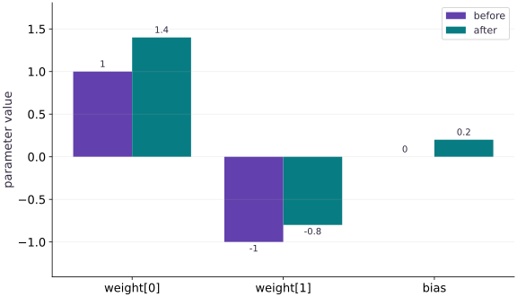

# Pytrees and structured parameters

Phase 03: State, randomness & control flow · about 60 minutes · CPU

## What you will be able to do

- Identify containers, leaves and structure
- Derive the matching gradient tree
- Apply corresponding leaves, not unrelated arrays
- Keep metadata separate from differentiated state

## The problem

Our model has a weight vector and a bias. How do we keep each parameter paired with its gradient? We’ll store them in a small nested structure called a pytree, calculate one update by hand, and check that JAX follows the same structure. The tree is just a way to keep related values organized.

## The idea

A pytree is a nested structure whose leaves hold values such as parameters. JAX can transform the leaves while preserving the structure. This makes a model's parameter groups explicit and lets us compare the gradient tree with the parameters it differentiates.

## Match leaves by meaning as well as shape

Suppose parameters contain a dense-layer weight matrix and a bias vector. Each gradient leaf describes sensitivity to its corresponding parameter leaf. Match paths such as layer/weight and layer/bias before comparing shapes; two equal-shaped leaves can still be swapped.

Optimizer state is related but need not have exactly the parameter tree's structure. It may contain moment trees plus a scalar step counter or other metadata. A useful diagram aligns matching parameter/gradient paths and then shows the additional optimizer state separately.

When a tree operation fails, inspect structure, leaf paths, shapes and dtypes in that order. Flattening everything immediately may hide the semantic distinction that would explain the error.

### Pause and reason

Two parameter leaves have the same shape. Is swapping their gradients safe?

<details><summary>Compare your reasoning</summary>

No. Shape compatibility does not identify which parameter a derivative belongs to. Preserve tree paths and compare the result with an independently known update.

</details>

## Identify containers, leaves and structure

A pytree separates a nested container structure from its leaves. A dictionary with weight and bias keys is a tree; each array is a leaf. A leaf can itself have many numerical elements. Two leaves therefore do not mean two scalar parameters.

JAX transformations understand common dictionaries, lists and tuples. tree.flatten returns an ordered leaf list plus a tree definition that can reconstruct the original containers. Treat that definition as part of the contract, rather than manually guessing where each flattened value belongs.

```text
params
├── weight: float32[2]
└── bias: float32[]
2 leaves, 3 numerical parameter values
```

## Derive the matching gradient tree

Let’s check one example. Take $x=[2,1]$, weights $w=[1,-1]$, and bias $b=0$. The prediction is $1$, while the target is $3$, so the residual is $-2$. For squared loss, the derivative with respect to the prediction is $-4$. Multiplying by the input gives the weight gradient $-4[2,1]=[-8,-4]$; the bias gradient is $-4$.

With learning rate $0.05$, the new weights are $[1.4,-0.8]$, and the bias becomes $0.2$. The new prediction is $2.2$, the residual is $-0.8$, and the loss is $0.64$. We can compare each of these values with the gradient tree and update. This tells us more than checking only whether the loss decreased.

$$
\begin{aligned}\hat y&=2(1)+1(-1)+0=1\\L&=(1-3)^2=4\\\nabla_w L&=(-8,-4),\qquad \frac{\partial L}{\partial b}=-4\end{aligned}
$$

## Apply corresponding leaves, not unrelated arrays

tree.map can apply $p-\eta g$ to corresponding leaves in the parameter and gradient trees. The containers must agree. A missing key is a structural error; an incompatible leaf shape is a numerical contract error. A matching tree structure alone does not prove that each leaf has the correct shape.

Dictionary leaves are traversed in a deterministic key order. Do not zip unrelated dictionaries merely because they have equal lengths. Use the tree definition to preserve identity and add shape checks at model boundaries.

## Keep metadata separate from differentiated state

Trainable leaves should be appropriate floating-point arrays. A Python string such as a model name is not a floating-point parameter. Keep such configuration separate, or register a carefully designed custom structure when the model requires it.

Optimizer state is another tree with its own meaning. Its structure need not be identical to parameters. Model parameters, gradients and optimizer statistics are connected, but they are not interchangeable objects. This separation will matter in the Optax lesson and in recovery.

## Prepare the inputs

Create main.py in your lesson workspace. Add this first block; use the environment from setup.

```python
# Step 1 — Prepare the inputs: These explicit inputs define the case that the later checks will...
# Import jax for this computation.
import jax
import jax.numpy as jnp
```

These explicit inputs define the case that the later checks will verify.

## Build the computation

Append this block below the inputs in the same file.

```python
# Step 2 — Build the computation: loss reads both parameter leaves.
# Construct `params` via `{"weight": jnp.array([1., -1.]), "bias": jnp.array(0.)}`
params = {"weight": jnp.array([1., -1.]), "bias": jnp.array(0.)}
# Construct `x` via `jnp.array([2., 1.])`
x = jnp.array([2., 1.])
# Function `loss(p)` implementing this stage's computation:
def loss(p):
    # Run `jnp.dot` to compute `prediction`.
    prediction = jnp.dot(p["weight"], x) + p["bias"]
    # Return `(prediction - 3.0) ** 2` to the caller.
    return (prediction - 3.) ** 2
```

loss reads both parameter leaves. grad returns a matching gradient tree; tree.map pairs each parameter with its corresponding derivative for the update.

## Run and check the result

Append the checks, save main.py, and run python main.py from this folder using your course environment.

```python
# Step 3 — Run and check the result: Compare the output to the expected result below before making the...
# Differentiate the objective to obtain `(value, grads)` via automatic differentiation.
value, grads = jax.value_and_grad(loss)(params)
# Transform every leaf of the parameter PyTree (`updated`).
updated = jax.tree.map(lambda p, g: p - 0.05 * g, params, grads)
# Print the observed values to compare against the expected result.
print("Before/after:", float(value), float(loss(updated)))
# Assert invariant `grads.keys() == params.keys()` holds
assert grads.keys() == params.keys()
# Assert invariant `loss(updated) < value` holds
assert loss(updated) < value
```

Compare the output to the expected result below before making the exercise change.

## Run the example

```python
# Step 1 — Prepare the inputs: These explicit inputs define the case that the later checks will...
# Import jax for this computation.
import jax
import jax.numpy as jnp
# Step 2 — Build the computation: loss reads both parameter leaves.
# Construct `params` via `{"weight": jnp.array([1., -1.]), "bias": jnp.array(0.)}`
params = {"weight": jnp.array([1., -1.]), "bias": jnp.array(0.)}
# Construct `x` via `jnp.array([2., 1.])`
x = jnp.array([2., 1.])
# Function `loss(p)` implementing this stage's computation:
def loss(p):
    # Run `jnp.dot` to compute `prediction`.
    prediction = jnp.dot(p["weight"], x) + p["bias"]
    # Return `(prediction - 3.0) ** 2` to the caller.
    return (prediction - 3.) ** 2
# Step 3 — Run and check the result: Compare the output to the expected result below before making the...
# Differentiate the objective to obtain `(value, grads)` via automatic differentiation.
value, grads = jax.value_and_grad(loss)(params)
# Transform every leaf of the parameter PyTree (`updated`).
updated = jax.tree.map(lambda p, g: p - 0.05 * g, params, grads)
# Print the observed values to compare against the expected result.
print("Before/after:", float(value), float(loss(updated)))
# Assert invariant `grads.keys() == params.keys()` holds
assert grads.keys() == params.keys()
# Assert invariant `loss(updated) < value` holds
assert loss(updated) < value
```

Expected: Before/after: $4.0$, approximately $0.64$.

## A gradient tree matches parameter leaves

**Predict:** Which weight changes more, and why?



**Recorded CPU computation**

### Read the figure

Each pair of bars compares one parameter before and after a gradient step. Read the categories as the two weight coordinates followed by the bias. The weights move from $(1,-1)$ to $(1.4,-0.8)$, and the bias moves from $0$ to $0.2$.

The second weight’s bar remains below zero, but becomes less negative. All three parameters increased; an upward update does not require the parameter itself to be positive.

### Connect it to the computation

For the input $(2,1)$, the initial prediction is $1$, below the target $3$. The parameter gradients are $(-8,-4,-4)$. Subtracting them with learning rate $0.05$ adds $(0.4,0.2,0.2)$, exactly the changes visible between the paired bars.

The updated prediction is $2.2$, so squared error falls from $4$ to $0.64$. The tree structure lets each gradient reach its corresponding parameter leaf. The chart’s vertical axis is parameter value, not loss; you need the prediction calculation to establish improvement.

```python
# Compute figure data for: A gradient tree matches parameter leaves
# Compute `visual_data` from `{'kind': 'bar', 'labels': ['weight[0]', 'weight[1]',...`
visual_data = {'kind': 'bar', 'labels': ['weight[0]', 'weight[1]', 'bias'], 'ylabel': 'parameter value', 'series': [{'label': 'before', 'y': [float(params['weight'][0]), float(params['weight'][1]), float(params['bias'])]}, {'label': 'after', 'y': [float(updated['weight'][0]), float(updated['weight'][1]), float(updated['bias'])]}]}
```

## Recorded reference execution

CPU run: 2026-10-08T14:01:39.388085+00:00. JAX 0.9.2.

```text
Before/after: 4.0 0.6399999260902405
Before/after: 4.0 0.6399999260902405
Expected tree mismatch
PASS: state-02

```

## Verify every gradient leaf

**Predict before running:** Predict both weight derivatives and the bias derivative from the residual before inspecting grads.

```python
# Experiment — Verify every gradient leaf: This check verifies parameter identity and the actual gradient...
# Assert that `jnp.allclose(grads["weight"],jnp.array([-8.,-4.]))`.
assert jnp.allclose(grads["weight"],jnp.array([-8.,-4.]))
# Assert that `jnp.allclose(grads["bias"],-4.)`.
assert jnp.allclose(grads["bias"],-4.)
# Assert that `jnp.allclose(updated["weight"],jnp.array([1.4,-0.8]))`.
assert jnp.allclose(updated["weight"],jnp.array([1.4,-0.8]))
# Assert that `jnp.allclose(updated["bias"],0.2)`.
assert jnp.allclose(updated["bias"],0.2)
# Assert that `jnp.allclose(loss(updated),0.64,atol=1e-6)`.
assert jnp.allclose(loss(updated),0.64,atol=1e-6)
```

**Expected:** All leaves agree with the hand-derived update.

This check verifies parameter identity and the actual gradient values, not just a matching container.

## Flatten and reconstruct without losing identity

**Predict before running:** What is retained by the tree definition when array values are replaced?

```python
# Experiment — Flatten and reconstruct without losing identity: The tree definition describes containers; leaves supply...
leaves,definition=jax.tree.flatten(params)
# Run `jax.tree.unflatten` to compute `rebuilt`.
rebuilt=jax.tree.unflatten(definition,leaves)
# Assert invariant `jax.tree.structure(rebuilt)==jax.tree.structure(params)` holds
assert jax.tree.structure(rebuilt)==jax.tree.structure(params)
# Assert invariant `jnp.array_equal(rebuilt["weight"]` holds
assert jnp.array_equal(rebuilt["weight"],params["weight"])
# Assert invariant `jnp.array_equal(rebuilt["bias"]` holds
assert jnp.array_equal(rebuilt["bias"],params["bias"])
```

**Expected:** The original keys and corresponding values are reconstructed.

The tree definition describes containers; leaves supply numerical values. Both are needed for reconstruction.

## Make it yours

Compute the squared norm of all gradient leaves. Verify it by adding the weight and bias contributions directly.

### How to write this exercise — Step-by-step recipe & starter scaffold

**Key functions & syntax to use:**
- `x.sum(axis=...) / x.mean(axis=..., keepdims=...)` — Reduces values along the named `axis` (the axis you name is collapsed unless `keepdims=True`).
- `jnp.allclose(actual, expected, rtol=..., atol=...)` — Checks that two arrays match elementwise within floating-point tolerance.

**Step-by-step implementation plan:**
1. Transform every leaf of the parameter PyTree (`norm_squared`).
2. Aggregate array values to compute `manual`.
3. Assert that `jnp.allclose(norm_squared, manual)`.
4. Assert that `jnp.allclose(norm_squared, 96.)`.

**Starter code scaffold (fill in the TODOs):**

```python
# Exercise solution: Compute the squared norm of all gradient leaves.
# Transform every leaf of the parameter PyTree (`norm_squared`).
norm_squared = sum(...)  # TODO: compute norm_squared
# Aggregate array values to compute `manual`.
manual = jnp.sum(...)  # TODO: compute manual
# Assert that `jnp.allclose(norm_squared, manual)`.
assert jnp.allclose(norm_squared, manual)  # TODO: complete assertion check
# Assert that `jnp.allclose(norm_squared, 96.)`.
assert jnp.allclose(norm_squared, 96.)  # TODO: complete assertion check
```

<details><summary>Reference solution</summary>

```python
# Exercise solution: Compute the squared norm of all gradient leaves.
# Transform every leaf of the parameter PyTree (`norm_squared`).
norm_squared = sum(jnp.sum(g ** 2) for g in jax.tree.leaves(grads))
# Aggregate array values to compute `manual`.
manual = jnp.sum(grads["weight"] ** 2) + grads["bias"] ** 2
# Assert that `jnp.allclose(norm_squared, manual)`.
assert jnp.allclose(norm_squared, manual)
# Assert that `jnp.allclose(norm_squared, 96.)`.
assert jnp.allclose(norm_squared, 96.)
```

</details>

## Extend to a nested model

**Practice**

Place weight and bias under a layer dictionary and add a scalar scale parameter. Verify the derivative of scale for $s(wx+b)$.

<details><summary>Hint</summary>

At the starting point prediction is $1$ and residual is $-2$, so the scale derivative is $-4$.

</details>

### How to write: Extend to a nested model — Step-by-step recipe & starter scaffold

**Key functions & syntax to use:**
- `jnp.array(values, dtype=...)` — Constructs an immutable device-backed JAX array from Python/NumPy values.
- `jnp.allclose(actual, expected, rtol=..., atol=...)` — Checks that two arrays match elementwise within floating-point tolerance.
- `jax.grad(loss_fn)(params, ...)` — Transforms a scalar-output function into a function returning the gradient PyTree with the same structure as `params`.

**Step-by-step implementation plan:**
1. Construct `nested` via `{"layer":params,"scale":jnp.array(1.)}`
2. Function `nested_loss(p)` implementing this stage's computation:
3. Compute `pred` from `p["scale"]*(jnp.dot(p["layer"]["weight"],x)+p["layer...`
4. Return `(pred - 3.0) ** 2` to the caller.
5. Differentiate the objective to obtain `g` via automatic differentiation.

**Starter code scaffold (fill in the TODOs):**

```python
# Extend to a nested model (Practice): Nested parameter identity survives differentiation.
# Construct `nested` via `{"layer":params,"scale":jnp.array(1.)}`
nested = ...  # TODO: compute nested
# Function `nested_loss(p)` implementing this stage's computation:
def nested_loss(p):
    # Compute `pred` from `p["scale"]*(jnp.dot(p["layer"]["weight"],x)+p["layer...`
    pred = ...  # TODO: compute pred
    # Return `(pred - 3.0) ** 2` to the caller.
    return ...  # TODO: return computed result
# Differentiate the objective to obtain `g` via automatic differentiation.
g = jax.grad(...)  # TODO: compute g
# Assert invariant `jax.tree.structure(g)==jax.tree.structure(nested)` holds
assert jax.tree.structure(g)  # TODO: complete assertion check
# Assert that `jnp.allclose(g["scale"],-4.)`.
assert jnp.allclose(g["scale"],-4.)  # TODO: complete assertion check
```

<details><summary>Reference solution and reasoning</summary>

```python
# Extend to a nested model (Practice): Nested parameter identity survives differentiation.
# Construct `nested` via `{"layer":params,"scale":jnp.array(1.)}`
nested={"layer":params,"scale":jnp.array(1.)}
# Function `nested_loss(p)` implementing this stage's computation:
def nested_loss(p):
    # Compute `pred` from `p["scale"]*(jnp.dot(p["layer"]["weight"],x)+p["layer...`
    pred=p["scale"]*(jnp.dot(p["layer"]["weight"],x)+p["layer"]["bias"])
    # Return `(pred - 3.0) ** 2` to the caller.
    return (pred-3.)**2
# Differentiate the objective to obtain `g` via automatic differentiation.
g=jax.grad(nested_loss)(nested)
# Assert invariant `jax.tree.structure(g)==jax.tree.structure(nested)` holds
assert jax.tree.structure(g)==jax.tree.structure(nested)
# Assert that `jnp.allclose(g["scale"],-4.)`.
assert jnp.allclose(g["scale"],-4.)
```

Nested parameter identity survives differentiation. The independent scale calculation checks the new path.

</details>

## Repair a mismatched update tree

**Challenge**

Remove bias from the gradient dictionary, reproduce the structural error, then restore it and verify the hand update.

<details><summary>Hint</summary>

Matching leaf counts is not enough; key paths matter.

</details>

### How to write: Repair a mismatched update tree — Step-by-step recipe & starter scaffold

**Key functions & syntax to use:**
- `jnp.allclose(actual, expected, rtol=..., atol=...)` — Checks that two arrays match elementwise within floating-point tolerance.
- `jax.tree.map(lambda p, g: ..., params, grads)` — Applies a function leaf-by-leaf across matching PyTrees (such as updating every parameter tensor with its gradient).

**Step-by-step implementation plan:**
1. Run the boundary check and catch the expected exception:
2. Transform every leaf of the parameter PyTree (`fixed`).
3. Assert that `jnp.allclose(loss(fixed),0.64,atol=1e-6)`.

**Starter code scaffold (fill in the TODOs):**

```python
# Repair a mismatched update tree (Challenge): A missing bias gradient is a tree mismatch.
# Run the boundary check and catch the expected exception:
try:
    jax.tree.map(lambda p,g:p-0.05*g,params,{"weight":grads["weight"]})
except ValueError:
    print("Expected tree mismatch")
else:
    raise AssertionError("Expected a missing-key failure")
# Transform every leaf of the parameter PyTree (`fixed`).
fixed = jax.tree.map(...)  # TODO: compute fixed
# Assert that `jnp.allclose(loss(fixed),0.64,atol=1e-6)`.
assert jnp.allclose(loss(fixed),0.64,atol=1e-6)  # TODO: complete assertion check
```

<details><summary>Reference solution and reasoning</summary>

```python
# Repair a mismatched update tree (Challenge): A missing bias gradient is a tree mismatch.
# Run the boundary check and catch the expected exception:
try:
    jax.tree.map(lambda p,g:p-0.05*g,params,{"weight":grads["weight"]})
except ValueError:
    print("Expected tree mismatch")
else:
    raise AssertionError("Expected a missing-key failure")
# Transform every leaf of the parameter PyTree (`fixed`).
fixed=jax.tree.map(lambda p,g:p-0.05*g,params,grads)
# Assert that `jnp.allclose(loss(fixed),0.64,atol=1e-6)`.
assert jnp.allclose(loss(fixed),0.64,atol=1e-6)
```

A missing bias gradient is a tree mismatch. Broadcasting weights or changing a learning rate cannot supply the missing parameter identity.

</details>

## Check your understanding

What structure does `grad(loss)(params)` have?

1. One scalar regardless of parameters
2. A pytree corresponding to params
3. A list of Python source lines

<details><summary>Answer and explanation</summary>

A pytree corresponding to params

The differentiated input determines the gradient structure. Each floating-point parameter leaf gets a corresponding gradient leaf.

</details>

## Diagnose the result

A missing bias gradient is a tree mismatch. Broadcasting weights or changing a learning rate cannot supply the missing parameter identity.

## Carry forward

- This check verifies parameter identity and the actual gradient values, not just a matching container.
- The tree definition describes containers; leaves supply numerical values. Both are needed for reconstruction.

## Keep your evidence

Keep the parameter/gradient tree diagram, hand-derived leaves and update, flatten/unflatten round trip, nested-scale derivative and missing-key repair.

Save your predictions, modified code, terminal outputs, and reasoning in your engineering portfolio.

## Primary references

- [JAX pytrees](https://docs.jax.dev/en/latest/101/pytrees.html)

