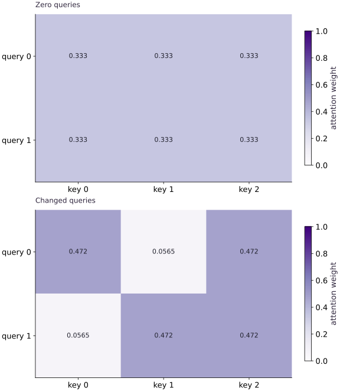

# Attention from small pieces

Phase 07: Transformers & language models · about 90 minutes · CPU

## What you will be able to do

- Track query, key and value axes
- Derive the uniform-query result
- Scale scores and keep softmax stable
- Test relationships that should survive a change

## The problem

When a model reads a sequence, how can one position use information from another? We’ll build a single attention head as a weighted average. Start with a query whose answer we know, then change the query and watch which values it emphasizes. Small arrays let us see every part of the calculation.

## The idea

Attention uses queries and keys to determine weights, then combines values using those weights. Scores describe compatibility; values provide the content being mixed. The attention matrix is an intermediate computation rather than the model's complete output.

## Calculate one weighted value mixture

Suppose one query gives weights $0.25$ and $0.75$ to values $[2,0]$ and $[0,4]$. The mixture is $[0.5,3]$. The weights sum to one, but output coordinates need not sum to one or lie between zero and one.

Read one heatmap row as a query's distribution over eligible keys, after confirming the axes. Scaling affects concentration, and a mask determines which keys can participate.

Hold the weights fixed and change a value vector: the output changes while the heatmap does not. Conversely, redundant values can make different weight patterns produce the same mixture. Use a hand-computed row to connect the heatmap to the actual value multiplication.

### Pause and reason

Can an attention-weight heatmap alone reconstruct the output?

<details><summary>Compare your reasoning</summary>

No. You also need the value vectors and any output projection. Weights explain the mixing coefficients, not the content being mixed.

</details>

## Track query, key and value axes

$Q$ has two query rows with two features each; $K$ has three key rows with the same feature dimension. $QK^\mathsf{T}$ produces a $(2, 3)$ score matrix: one row per query and one column per key. $V$ has three value rows, so the weighted sum returns two output rows. Its value-feature dimension need not equal the key-feature dimension.

Softmax acts along the last axis because a query chooses among keys. A softmax over queries instead would normalize a different problem. Check a rectangular example first: equal query and key counts can hide transposed-axis errors.

```text
Q (Tq, Dk) @ Kᵀ (Dk, Tk) → scores (Tq, Tk)
softmax over Tk → weights (Tq, Tk)
weights @ V (Tk, Dv) → output (Tq, Dv)
```

## Derive the uniform-query result

Every dot product with a zero query is zero. Softmax of $[0, 0, 0]$ is $[1/3, 1/3, 1/3]$, so each output is the mean of the three value rows. Our values sum to $[6, 6]$; both queries therefore produce $[2, 2]$. This known answer checks score normalization and value mixing without using another attention implementation.

The output is a weighted average, not a selected row. With finite unmasked scores, multiple keys can contribute. More concentrated weights can approximate retrieval but do not create a discrete index operation.

## Scale scores and keep softmax stable

Dividing by `sqrt(Dk)` moderates dot-product scale as the feature dimension grows under common initialization assumptions. It is a design convention, not a proof that arbitrary query/key values cannot saturate. The independent NumPy reference below subtracts each row maximum before exponentiating to avoid overflow.

JAX softmax performs a stable normalization. Adding the same finite constant to every score in a row leaves its weights unchanged. Extremely large or infinite inputs can still require diagnosis; a stable formula does not make invalid inputs meaningful.

## Test relationships that should survive a change

Adding a constant value vector c to every value row shifts every output by c because each weight row sums to one. Permuting keys and their corresponding values together leaves the result unchanged. Permuting only values changes what each score retrieves.

These tests examine the mechanism under changed conditions rather than merely duplicating the implementation. The unmasked head allows every key to contribute; interpreting it as a next-token model would leak future information. That boundary belongs in the next lesson.

## Read attention as matching, then mixing

Let’s give each symbol a job. $Q$ contains queries, $K$ contains keys, and $V$ contains the values we want to mix. The feature count $d_k$ sets the score scale. Each row of $A$ contains nonnegative weights that sum to one. For a zero query, all scores match, so three values each receive weight $1/3$. Their average is the output. You can check that case before thinking about learned projections.

$$
\begin{aligned}S&=\frac{QK^\mathsf{T}}{\sqrt{d_k}}\\A_{ij}&=\frac{\exp(S_{ij}-m_i)}{\sum_t\exp(S_{it}-m_i)},\quad m_i=\max_t S_{it}\\O&=AV\end{aligned}
$$

## 1. Prepare the experiment

In the CPU environment from setup, create main.py and add this block. Write down the dimensions and the known result before continuing.

```python
import jax
import jax.numpy as jnp
import numpy as np
```

These imports provide JAX array transformations and NumPy reference calculations. Define the numerical functions next; the final build block supplies the concrete fixture and checks.

## 2. Implement the mechanism

Append this block in the same file. Follow the shape diagram above and identify each reduction or state transition.

```python
def attend(q, k, v):
    scores = q @ k.T / jnp.sqrt(q.shape[-1])
    weights = jax.nn.softmax(scores, axis=-1)
    return weights @ v, weights
```

Multiplying $Q\in\mathbb{R}^{T_q\times D_k}$ by $K^\mathsf{T}\in\mathbb{R}^{D_k\times T_k}$ gives scores of shape $(T_q,T_k)$. Softmax normalizes each query’s weights across the $T_k$ keys. Multiplying by $V\in\mathbb{R}^{T_k\times D_v}$ then gives an output of shape $(T_q,D_v)$.

## 3. Run and check

Append this block and run python main.py. Compare its output with your prediction. An assertion failure means a stated contract needs investigation.

```python
q = jnp.zeros((2, 2))
k = jnp.array([[1., 0.], [0., 1.], [1., 1.]])
v = jnp.array([[2., 0.], [0., 4.], [4., 2.]])
output, weights = attend(q, k, v)
print("Weights / output:", weights, output)
assert jnp.allclose(weights, jnp.full((2, 3), 1/3))
assert jnp.allclose(output, jnp.array([[2., 2.], [2., 2.]]))
assert jnp.allclose(jnp.sum(weights, axis=-1), 1.)
```

Uniform weights $1/3$; both output rows $[2, 2]$.

## Run the example

```python
import jax
import jax.numpy as jnp
import numpy as np

def attend(q, k, v):
    scores = q @ k.T / jnp.sqrt(q.shape[-1])
    weights = jax.nn.softmax(scores, axis=-1)
    return weights @ v, weights

q = jnp.zeros((2, 2))
k = jnp.array([[1., 0.], [0., 1.], [1., 1.]])
v = jnp.array([[2., 0.], [0., 4.], [4., 2.]])
output, weights = attend(q, k, v)
print("Weights / output:", weights, output)
assert jnp.allclose(weights, jnp.full((2, 3), 1/3))
assert jnp.allclose(output, jnp.array([[2., 2.], [2., 2.]]))
assert jnp.allclose(jnp.sum(weights, axis=-1), 1.)
```

Expected: Uniform weights $1/3$; both output rows $[2, 2]$.

## Each query distributes one unit of attention

**Predict:** Why do the initial rows have equal weights?



**Recorded CPU computation**

### Read the figure

Rows are queries and columns are keys. Each cell gives the attention weight assigned to that key by that query. Both panels use the same color range from $0$ to $1$, so their shades are directly comparable. Read across one row at a time; its weights sum to $1$.

With zero queries, all scores are equal and every key receives weight $1/3$. With changed queries, the first row becomes approximately $(0.472,0.0565,0.472)$, while the second becomes $(0.0565,0.472,0.472)$. Each row favors two tied keys, not a single winning key.

### Connect it to the computation

The changed queries are $(3,0)$ and $(0,3)$; the keys are $(1,0)$, $(0,1)$, and $(1,1)$. The third key matches the active coordinate of either query, explaining why it ties for the highest weight in both rows. Softmax converts these relative scores into normalized, positive weights.

The weights mix the value vectors; they are not the output vectors themselves. In the uniform panel, averaging the values $(2,0)$, $(0,4)$, and $(4,2)$ produces $(2,2)$ for each query. To understand a changed output, first read its row of weights, then form that weighted sum.

```python
changed_q = jnp.array([[3.0, 0.0], [0.0, 3.0]])
_, focused = attend(changed_q, k, v)
visual_data = {'kind': 'panels', 'panels': [{'kind': 'heatmap', 'title': 'Zero queries', 'values': weights.tolist(), 'rows': ['query 0', 'query 1'], 'columns': ['key 0', 'key 1', 'key 2'], 'unit': 'attention weight'}, {'kind': 'heatmap', 'title': 'Changed queries', 'values': focused.tolist(), 'rows': ['query 0', 'query 1'], 'columns': ['key 0', 'key 1', 'key 2'], 'unit': 'attention weight'}]}
```

## Recorded reference execution

CPU run: 2026-10-06T21:58:46.981249+00:00. JAX 0.9.2.

```text
Weights / output: [[0.33333334 0.33333334 0.33333334]
 [0.33333334 0.33333334 0.33333334]] [[2. 2.]
 [2. 2.]]
Weights / output: [[0.33333334 0.33333334 0.33333334]
 [0.33333334 0.33333334 0.33333334]] [[2. 2.]
 [2. 2.]]
PASS: transformers-01

```

## Compare a nonzero query with NumPy

**Predict before running:** Which keys become more relevant for query $[2, 0]$?

```python
q_new = jnp.array([[2., 0.]])
actual, w_new = attend(q_new, k, v)
scores_np = np.asarray(q_new) @ np.asarray(k).T / np.sqrt(2)
raw = np.exp(scores_np - scores_np.max(axis=-1, keepdims=True))
reference_w = raw / raw.sum(axis=-1, keepdims=True)
np.testing.assert_allclose(w_new, reference_w, rtol=1e-6, atol=1e-6)
np.testing.assert_allclose(actual, reference_w @ np.asarray(v), rtol=1e-6, atol=1e-6)
```

**Expected:** Keys $0$ and $2$ receive equal larger weights than key $1$.

A separate NumPy calculation checks nonuniform weighting and the output axis.

## Shift every value vector

**Predict before running:** If every $V$ row gains $[5, -2]$, what happens to each output?

```python
shift = jnp.array([5., -2.])
shifted, _ = attend(q_new, k, v + shift)
assert jnp.allclose(shifted, actual + shift)
```

**Expected:** Each output shifts by $[5, -2]$.

Row-normalized attention preserves a shared value translation.

## Make it yours

Permute the three key/value pairs together, then permute only values. Verify invariance for the paired permutation and a changed result for the mismatched pairing.

<details><summary>Reference solution</summary>

```python
order = jnp.array([2, 0, 1])
paired, _ = attend(q_new, k[order], v[order])
mismatched, _ = attend(q_new, k, v[order])
assert jnp.allclose(paired, actual)
assert not jnp.allclose(mismatched, actual)
```

</details>

## Use a different value dimension

**Transfer / diagnosis**

Make each value a single scalar $[3, 6, 9]$. Check the output shape and zero-query mean.

<details><summary>Hint</summary>

The score matrix does not depend on Dv.

</details>

<details><summary>Reference solution and reasoning</summary>

```python
scalar_v = jnp.array([[3.], [6.], [9.]])
scalar_out, _ = attend(q, k, scalar_v)
assert scalar_out.shape == (2, 1)
assert jnp.allclose(scalar_out, 6.)
```

Queries and keys share $Dk$; values may have an independent feature dimension.

</details>

## Expose a wrong softmax axis

**Transfer / diagnosis**

Normalize zero scores along axis $0$ and compare row sums with the intended contract. Repair the axis.

<details><summary>Hint</summary>

Two queries and three keys make the incorrect result visible.

</details>

<details><summary>Reference solution and reasoning</summary>

```python
wrong_w = jax.nn.softmax(jnp.zeros((2, 3)), axis=0)
assert jnp.allclose(wrong_w.sum(axis=-1), 1.5)
right_w = jax.nn.softmax(jnp.zeros((2, 3)), axis=-1)
assert jnp.allclose(right_w.sum(axis=-1), 1.)
```

A legal operation can normalize the wrong axis. Rectangular shapes expose the mismatch.

</details>

## Check your understanding

Which dimension should softmax normalize for one query to combine all key/value pairs?

1. The query dimension
2. The key dimension
3. The value feature dimension

<details><summary>Answer and explanation</summary>

The key dimension

One query needs a probability distribution across keys; each row must sum to one.

</details>

## Diagnose the result

If weights sum to $1.5$ rather than $1$, inspect the softmax axis on the $(2,3)$ score matrix. If paired key/value permutation changes the output, check that the same order was applied to both arrays. Repair the axis or pairing, then rerun the independent NumPy and translation checks.

## Carry forward

- A separate NumPy calculation checks nonuniform weighting and the output axis.
- Row-normalized attention preserves a shared value translation.

## Keep your evidence

Save the Q/K/V axis diagram, uniform hand calculation, NumPy nonuniform reference, paired permutation check, and wrong-axis repair.

Keep predictions, modified code, observed results, and reasoning. A checkpoint alone does not demonstrate the exercise.

## Primary references

- [JAX softmax API](https://docs.jax.dev/en/latest/_autosummary/jax.nn.softmax.html)
- [JAX attention API](https://docs.jax.dev/en/latest/_autosummary/jax.nn.dot_product_attention.html)
- [Optax cross entropy](https://optax.readthedocs.io/en/latest/api/losses.html)

