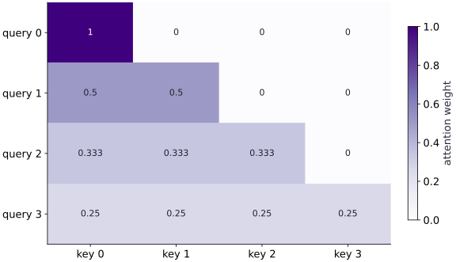

# Masking, tokenization, and sequence packing

Phase 07: Transformers & language models · about 90 minutes · CPU

## What you will be able to do

- Build a causal mask from positions
- Keep token IDs and targets aligned
- Combine causal and segment boundaries
- Handle padding without an all-masked softmax

## The problem

An attention head should not always see every token. For example, a next-token model must not peek at the future. We’ll build a causal mask one row at a time, then add padding and boundaries between packed examples. Before training, you’ll be able to explain exactly which positions may read each other.

## The idea

An attention mask controls which positions supply context. A loss mask controls which targets contribute to the objective. Tokenization, target shifting and sequence packing decide the positions to which those different rules apply.

## Keep context eligibility separate from scored targets

At input position $t$, causal next-token training predicts target $t+1$. A response-only role flag must follow that shifted target. Using unshifted role flags can score the wrong token at the prompt/response boundary.

An unscored prompt token can still influence a scored response through attention. Removing its direct loss does not remove it from the computation. A blocked attention edge instead prevents a context contribution.

Packed documents need segment boundaries in addition to a causal triangle. A later segment must not read an unrelated earlier segment merely because its positions occur earlier in the tensor. Trace one query and target across these rules before trusting a batch average.

### Pause and reason

Why is a triangular mask alone insufficient for packed documents?

<details><summary>Compare your reasoning</summary>

It blocks future positions but can allow one document to attend to another earlier document. Segment eligibility must enforce the intended document separation.

</details>

## Build a causal mask from positions

For query position i, allow keys j ≤ i. Including the diagonal lets a token use its own representation. The model predicts the next token from that prefix; the target array is shifted one position ahead. Excluding the diagonal is a different convention that requires changing how inputs and labels are aligned.

With values $2$, $4$, $8$, $16$ and uniform permitted scores, the outputs are prefix means: $2$, $3$, $14/3$ and $7.5$. Changing the last value must not change the first three outputs. This counterfactual tests causal isolation directly.

```text
allowed key columns
query 0: 1 0 0 0
query 1: 1 1 0 0
query 2: 1 1 1 0
query 3: 1 1 1 1
```

## Keep token IDs and targets aligned

For vocabulary {a:$0$, b:$1$, c:$2$}, abcab becomes $[0,1,2,0,1]$. Inputs $[0,1,2,0]$ pair with next-token targets $[1,2,0,1]$. Do not train the last token to predict the first token of an unrelated packed example. A separator or an ignored loss position must express that boundary.

Production tokenizers introduce normalization, special IDs and subword rules. This lesson teaches alignment using a simple character mapping and does not claim to replace them. Validate unknown characters explicitly rather than silently assigning an existing ID.

## Combine causal and segment boundaries

Packing segments $[0,0,1,1]$ means positions $2$ and $3$ belong to a new example. Require equal segment IDs as well as causal order. With our values, packed means become $2$, $3$, $8$ and $12$. Position $2$ must not read earlier positions from segment $0$ even though they are causally prior.

Segment IDs must identify separate examples within a packed row. Reusing an ID for two unrelated spans could reconnect them. The mask is only one part of packing: target eligibility must also stop at each segment boundary.

## Handle padding without an all-masked softmax

An all-masked row represented by all −infinity scores has no normalized distribution and can produce NaN. Padding queries create precisely that row if you forbid every key. Provide a harmless fallback key for those queries, then replace their outputs with zero and ignore their loss. Every real query still uses its original permitted keys.

The fallback is a numerical convention, not permission for padding to carry semantic information. Test that perturbing padded values does not change real outputs. Also reject any real query with no valid key when that violates your model contract.

## Turn the allowed positions into weights

For causal attention, query position $i$ may use key position $j$ only when $j\le i$. We leave an allowed score unchanged and replace a blocked score with negative infinity before softmax. This gives blocked positions zero weight when the row has at least one allowed key. If a row is entirely blocked, an ordinary softmax has no valid distribution; handle that case explicitly, as the code does.

$$
\widetilde S_{ij}=\begin{cases}S_{ij}&\text{if key }j\text{ is allowed for query }i\\-\infty&\text{otherwise}\end{cases}
$$

## 1. Prepare the experiment

In the CPU environment from setup, create main.py and add this block. Write down the dimensions and the known result before continuing.

```python
import jax
import jax.numpy as jnp
import numpy as np
```

These imports provide JAX array transformations and NumPy reference calculations. Define the numerical functions next; the final build block supplies the concrete fixture and checks.

## 2. Implement the mechanism

Append this block in the same file. Follow the shape diagram above and identify each reduction or state transition.

```python
def masked_mean(values, allowed):
    scores = jnp.where(allowed, 0., -jnp.inf)
    weights = jax.nn.softmax(scores, axis=-1)
    return weights @ values, weights

def make_mask(segment_ids, valid):
    positions = jnp.arange(segment_ids.shape[0])
    causal = positions[:, None] >= positions[None, :]
    same_segment = segment_ids[:, None] == segment_ids[None, :]
    return causal & same_segment & valid[:, None] & valid[None, :]
```

allowed key columns
query $0$: $1$ $0$ $0$ $0$
query $1$: $1$ $1$ $0$ $0$
query $2$: $1$ $1$ $1$ $0$
query $3$: $1$ $1$ $1$ $1$

## 3. Run and check

Append this block and run python main.py. Compare its output with your prediction. An assertion failure means a stated contract needs investigation.

```python
values = jnp.array([[2.], [4.], [8.], [16.]])
causal = jnp.arange(4)[:, None] >= jnp.arange(4)[None, :]
out, weights = masked_mean(values, causal)
assert jnp.allclose(out[:, 0], jnp.array([2., 3., 14/3, 7.5]))
assert jnp.allclose(jnp.triu(weights, 1), 0.)
print("Causal means:", out[:, 0])
```

Causal means $[2, 3, 4.666667, 7.5]$; no weight above the diagonal.

## Run the example

```python
import jax
import jax.numpy as jnp
import numpy as np

def masked_mean(values, allowed):
    scores = jnp.where(allowed, 0., -jnp.inf)
    weights = jax.nn.softmax(scores, axis=-1)
    return weights @ values, weights

def make_mask(segment_ids, valid):
    positions = jnp.arange(segment_ids.shape[0])
    causal = positions[:, None] >= positions[None, :]
    same_segment = segment_ids[:, None] == segment_ids[None, :]
    return causal & same_segment & valid[:, None] & valid[None, :]

values = jnp.array([[2.], [4.], [8.], [16.]])
causal = jnp.arange(4)[:, None] >= jnp.arange(4)[None, :]
out, weights = masked_mean(values, causal)
assert jnp.allclose(out[:, 0], jnp.array([2., 3., 14/3, 7.5]))
assert jnp.allclose(jnp.triu(weights, 1), 0.)
print("Causal means:", out[:, 0])
```

Expected: Causal means $[2, 3, 4.666667, 7.5]$; no weight above the diagonal.

## A causal mask blocks future information

**Predict:** Which cells must remain zero?



**Recorded CPU computation**

### Read the figure

Rows select query positions and columns select key positions. The diagonal and cells to its left are allowed; the white cells to the right of the diagonal have exactly zero attention weight because they refer to future tokens.

Query $0$ puts all its weight on key $0$. Query $1$ splits weight equally across keys $0$ and $1$. The last row assigns $1/4$ to every key because, at the last position, all four positions are available.

### Connect it to the computation

The allowed scores are equal in this constructed example, so each row averages its visible prefix. The causal mask determines which entries must be zero; it does not generally make the remaining entries uniform. Learned scores can distribute weight unevenly within the allowed region.

For values $(2,4,8,16)$, query $2$ returns $(2+4+8)/3=14/3$, not the full-sequence average $7.5$. The zero in its last column is what prevents the future value $16$ from influencing that result. Verify normalization across rows, not down columns.

```python
visual_data = {'kind': 'heatmap', 'values': weights.tolist(), 'rows': ['query ' + str(i) for i in range(4)], 'columns': ['key ' + str(i) for i in range(4)], 'unit': 'attention weight'}
```

## Recorded reference execution

CPU run: 2026-10-06T23:00:44.785259+00:00. JAX 0.9.2.

```text
Causal means: [2.       3.       4.666667 7.5     ]
Causal means: [2.       3.       4.666667 7.5     ]
PASS: transformers-02

```

## Perturb the future

**Predict before running:** If the last value becomes $1000$, which outputs may change?

```python
changed = values.at[-1, 0].set(1000.)
changed_out, _ = masked_mean(changed, causal)
assert jnp.allclose(changed_out[:3], out[:3])
assert not jnp.allclose(changed_out[-1], out[-1])
```

**Expected:** Only the last output changes.

Perturbation tests whether earlier representations depend on future information.

## Pack two independent examples

**Predict before running:** What are the means for segments $[0,0,1,1]$?

```python
segments = jnp.array([0, 0, 1, 1])
valid = jnp.ones(4, dtype=bool)
packed = make_mask(segments, valid)
packed_out, _ = masked_mean(values, packed)
assert jnp.allclose(packed_out[:, 0], jnp.array([2., 3., 8., 12.]))
```

**Expected:** Packed means $[2, 3, 8, 12]$.

Causal order alone does not isolate independent packed examples.

## Make it yours

Encode abcab with a three-character vocabulary. Create shifted inputs/targets, and a loss-eligibility vector for packed segments $[0,0,0,1,1]$ that excludes a cross-segment next-token target.

<details><summary>Reference solution</summary>

```python
vocab = {"a":0, "b":1, "c":2}
ids = jnp.array([vocab[c] for c in "abcab"])
assert jnp.array_equal(ids[:-1], jnp.array([0,1,2,0]))
assert jnp.array_equal(ids[1:], jnp.array([1,2,0,1]))
seg = jnp.array([0,0,0,1,1])
loss_valid = seg[:-1] == seg[1:]
assert jnp.array_equal(loss_valid, jnp.array([True,True,False,True]))
```

</details>

## Repair padding-query NaNs

**Transfer / diagnosis**

Use `valid=[True,True,False,False]`. Reproduce the undefined all-masked rows, then give padded queries a fallback and zero their outputs.

<details><summary>Hint</summary>

Insert a diagonal fallback only for invalid queries.

</details>

<details><summary>Reference solution and reasoning</summary>

```python
pad_valid = jnp.array([True,True,False,False])
pad_mask = make_mask(jnp.zeros(4, dtype=int), pad_valid)
bad_pad, _ = masked_mean(values, pad_mask)
assert not jnp.all(jnp.isfinite(bad_pad))
fallback = (~pad_valid[:, None]) & jnp.eye(4, dtype=bool)
pad_out, _ = masked_mean(values, pad_mask | fallback)
pad_out = jnp.where(pad_valid[:, None], pad_out, 0.)
assert jnp.all(jnp.isfinite(pad_out))
assert jnp.allclose(pad_out[:,0], jnp.array([2.,3.,0.,0.]))
```

A fallback makes normalization defined; zeroing and loss masking retain the semantic padding contract.

</details>

## Detect packed-example leakage

**Transfer / diagnosis**

Compare causal-only and segment-aware outputs at query $2$. Explain which prior values caused the difference.

<details><summary>Hint</summary>

Query $2$ should see only value $8$ from its own segment.

</details>

<details><summary>Reference solution and reasoning</summary>

```python
assert jnp.allclose(out[2,0], 14/3)
assert jnp.allclose(packed_out[2,0], 8.)
assert not jnp.allclose(out[2,0], packed_out[2,0])
```

The earlier values $2$ and $4$ belong to another example; they must be excluded despite being past positions.

</details>

## Check your understanding

What must a packed causal mask enforce?

1. Causal order only
2. Same segment and permitted causal keys, plus explicit padding behavior
3. Equal token IDs

<details><summary>Answer and explanation</summary>

Same segment and permitted causal keys, plus explicit padding behavior

Packing combines positions in storage, not their semantic context. Segment and validity constraints retain example boundaries.

</details>

## Diagnose the result

NaN in a padded output can mean that its mask row permits no keys; count allowed keys before blaming the optimizer. Add a fallback only for invalid queries, zero their outputs, and ignore their loss. If a packed output includes another example’s values, inspect equal-segment and causal conditions separately. Recheck the hand-derived $[2,3,8,12]$ result.

## Carry forward

- Perturbation tests whether earlier representations depend on future information.
- Causal order alone does not isolate independent packed examples.

## Keep your evidence

Keep token/target alignment, the two masks, future perturbation, segment-leakage comparison and all-masked-row repair. Verify that masks and ignored loss positions enforce the same boundaries.

Keep predictions, modified code, observed results, and reasoning. A checkpoint alone does not demonstrate the exercise.

## Primary references

- [JAX softmax API](https://docs.jax.dev/en/latest/_autosummary/jax.nn.softmax.html)
- [JAX attention API](https://docs.jax.dev/en/latest/_autosummary/jax.nn.dot_product_attention.html)
- [Optax cross entropy](https://optax.readthedocs.io/en/latest/api/losses.html)

