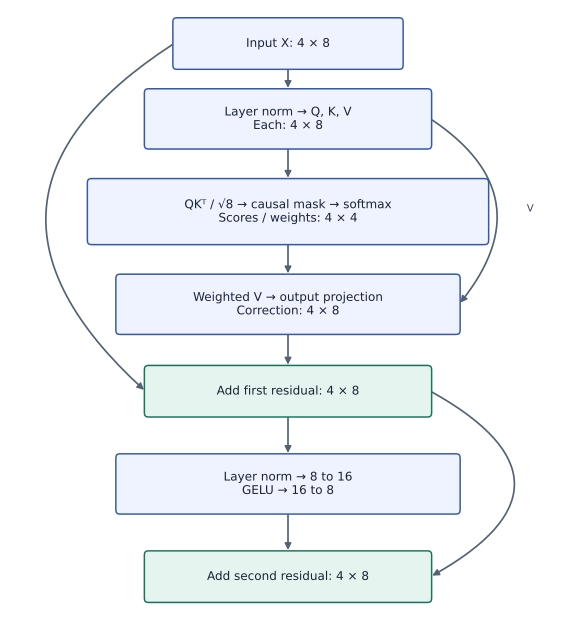
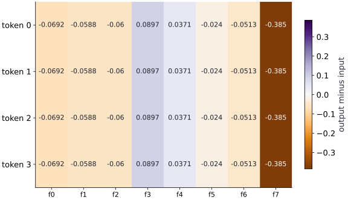

# A Transformer block and mixed precision

Phase 07: Transformers & language models · about 90 minutes · CPU

## What you will be able to do

- Follow the two residual paths
- Normalize features rather than examples
- Test causal independence and differentiation
- Separate storage precision from sensitive arithmetic

## The problem

An attention head mixes information across positions. What else makes it a Transformer block? We’ll add normalization, a small feature-processing network and two residual connections. Then we’ll inspect gradients and compare a lower-precision version. This is a deliberately small CPU teaching block, not a production architecture.

## The idea

A Transformer block adds learned corrections to token representations. This lesson uses a single attention head, normalization before each branch, and two residual additions. Follow the implemented dimensions rather than assuming all Transformer architectures are interchangeable.

## Follow the residual stream through the actual block

Four token positions each carry eight features. Query/key scores therefore form a four-by-four matrix. Weighted values and the output projection return to eight features, allowing the attention correction to be added to the input.

The feed-forward branch expands eight features to sixteen, applies GELU and returns to eight. It processes each token's feature vector; attention is the part that mixes eligible positions. Each residual addition requires matching shapes.

The saved output-minus-input heatmap shows the combined correction. Its equal rows arise from this fixture's constant-offset input and normalization behavior. They are not a universal property of attention. Use the architecture to identify which input change would test that explanation.

### The actual single-head pre-LN block

**Predict:** What should happen when every learned projection is zero?



*Conceptual / analytic teaching diagram; not a recorded benchmark.*

The center path carries four positions with eight features. Attention mixes eligible positions through four-by-four weights. The feed-forward branch changes each token from eight to sixteen features and back. Curved bypasses carry residual values to additions. No multihead or cache component is implied.

### Pause and reason

What should happen when every learned projection is zero?

<details><summary>Compare your reasoning</summary>

The block returns its input: both correction branches are zero and the residual path remains. This checks the structure independently of learned performance.

</details>

## Follow the two residual paths

The first sublayer normalizes each token’s features, creates Q/K/V projections, performs causal attention and projects back to the model width. Add that result to the original $x$. The second sublayer normalizes the intermediate residual, expands feature width, applies GELU, contracts back and adds again.

Every residual addition needs matching shapes. Zeroing all six projection matrices makes both sublayers contribute zero, so the block must return $x$ exactly. This is an independent boundary case that catches many incorrect residual connections.

```text
x → norm → Q/K/V → causal attention → output projection
└────────────────────────────── add → residual
residual → norm → expansion → GELU → contraction
└────────────────────────────────── add → output
```

## Normalize features rather than examples

For each token, compute the mean and variance over its feature axis. Subtracting the mean and dividing by `sqrt(variance+epsilon)` makes this sublayer insensitive to a shared finite feature shift, within numerical tolerance. Epsilon prevents division by zero for a constant feature row.

Layer normalization here does not compute statistics across the batch or sequence. Its result has the same shape as its input, and it has no running statistics. Batch normalization and learned affine normalization introduce different state or parameters; do not swap them without revisiting the contract.

## Test causal independence and differentiation

Perturb the last token heavily and verify that the first three output rows stay the same. Pre-normalization and the MLP act per token, while the attention mask prevents earlier queries from reading the last key. A full gradient with respect to the parameter pytree should retain each leaf’s shape and remain finite for this input.

Finite gradients are necessary but not sufficient evidence of a correct block. Check known cases, changed inputs, residual identity and eager/compiled agreement together. The loss reduction determines the gradient scale.

## Separate storage precision from sensitive arithmetic

Casting every parameter and input to bfloat16 is a simple controlled low-precision experiment, not a complete mixed-precision training policy. A common policy stores selected tensors at lower precision while computing reductions and normalization in float32. The second experiment compares fully cast bfloat16 computation with a policy that keeps feature normalization and score softmax in float32, while casting their outputs back for the lower-precision projections.

Record maximum absolute error for the supplied small input; do not require bitwise agreement. Precision affects both small denominators and accumulated dot products. If a comparison fails, inspect normalization and input scale before increasing the tolerance. Real models require workload-specific accuracy and performance qualification.

## 1. Prepare the experiment

In the CPU environment from setup, create main.py and add this block. Write down the dimensions and the known result before continuing.

```python
import jax
import jax.numpy as jnp
import numpy as np
```

These imports provide JAX array transformations and NumPy reference calculations. Define the numerical functions next; the final build block supplies the concrete fixture and checks.

## 2. Implement the mechanism

Append this block in the same file. Follow the shape diagram above and identify each reduction or state transition.

```python
def layer_norm(x):
    mean = jnp.mean(x, axis=-1, keepdims=True)
    variance = jnp.mean((x-mean)**2, axis=-1, keepdims=True)
    return (x-mean) / jnp.sqrt(variance + 1e-5)

def init_block(key, width=8):
    keys = jax.random.split(key, 6)
    shapes = [(width,width)]*4 + [(width,2*width),(2*width,width)]
    return {name: jax.random.normal(k,s)*0.1 for name,k,s in zip(
        ["q","k","v","o","up","down"], keys, shapes)}

def block_forward(p, x):
    h = layer_norm(x)
    q, k, v = h@p["q"], h@p["k"], h@p["v"]
    scores = q@k.T / jnp.sqrt(x.shape[-1])
    allowed = jnp.arange(x.shape[0])[:,None] >= jnp.arange(x.shape[0])[None,:]
    weights = jax.nn.softmax(jnp.where(allowed, scores, -jnp.inf), axis=-1)
    residual = x + (weights@v)@p["o"]
    return residual + jax.nn.gelu(layer_norm(residual)@p["up"])@p["down"]
```

$x$ → norm → Q/K/V → causal attention → output projection
└────────────────────────────── add → residual
residual → norm → expansion → GELU → contraction
└────────────────────────────────── add → output

## 3. Run and check

Append this block and run python main.py. Compare its output with your prediction. An assertion failure means a stated contract needs investigation.

```python
p = init_block(jax.random.key(7))
x = jnp.arange(32, dtype=jnp.float32).reshape(4,8)/10
output = block_forward(p, x)
assert output.shape == x.shape
assert jnp.all(jnp.isfinite(output))
zero = jax.tree.map(jnp.zeros_like, p)
assert jnp.allclose(block_forward(zero, x), x)
assert jnp.allclose(jax.jit(block_forward)(p,x), output, atol=1e-5)
print("Block shape:", output.shape)
```

Output shape $(4, 8)$; finite values, zero-projection identity, compiled/eager agreement.

## Run the example

```python
import jax
import jax.numpy as jnp
import numpy as np

def layer_norm(x):
    mean = jnp.mean(x, axis=-1, keepdims=True)
    variance = jnp.mean((x-mean)**2, axis=-1, keepdims=True)
    return (x-mean) / jnp.sqrt(variance + 1e-5)

def init_block(key, width=8):
    keys = jax.random.split(key, 6)
    shapes = [(width,width)]*4 + [(width,2*width),(2*width,width)]
    return {name: jax.random.normal(k,s)*0.1 for name,k,s in zip(
        ["q","k","v","o","up","down"], keys, shapes)}

def block_forward(p, x):
    h = layer_norm(x)
    q, k, v = h@p["q"], h@p["k"], h@p["v"]
    scores = q@k.T / jnp.sqrt(x.shape[-1])
    allowed = jnp.arange(x.shape[0])[:,None] >= jnp.arange(x.shape[0])[None,:]
    weights = jax.nn.softmax(jnp.where(allowed, scores, -jnp.inf), axis=-1)
    residual = x + (weights@v)@p["o"]
    return residual + jax.nn.gelu(layer_norm(residual)@p["up"])@p["down"]

p = init_block(jax.random.key(7))
x = jnp.arange(32, dtype=jnp.float32).reshape(4,8)/10
output = block_forward(p, x)
assert output.shape == x.shape
assert jnp.all(jnp.isfinite(output))
zero = jax.tree.map(jnp.zeros_like, p)
assert jnp.allclose(block_forward(zero, x), x)
assert jnp.allclose(jax.jit(block_forward)(p,x), output, atol=1e-5)
print("Block shape:", output.shape)
```

Expected: Output shape $(4, 8)$; finite values, zero-projection identity, compiled/eager agreement.

## A residual block adds a correction to its input

**Predict:** Does a residual connection force the output to equal the input?



**Recorded CPU computation**

### Read the figure

Rows are token positions and columns are features. Every cell shows output minus input at that location, so this is a map of the block’s correction, not its raw output. Purple indicates a positive correction, brown a negative correction, and near-white little change.

Feature $3$ increases by about $0.0897$, while feature $7$ decreases by about $0.385$. Those same column patterns repeat across all four rows, up to floating-point rounding. The strongest color marks the largest change in magnitude, not the feature with the largest original activation.

### Connect it to the computation

Why do the rows look identical? The example builds input rows that differ only by a constant offset across their features. Per-token layer normalization removes that offset, so the normalized rows match. Their projected values match too, so attention’s weighted average is the same even when the causal mask allows different numbers of tokens. The subsequent normalized feed-forward branch preserves this symmetry.

The block therefore adds almost the same correction to different input rows; the final rows themselves are still different. This repeated pattern comes from the chosen input, not a rule that transformers treat every token identically. Change one feature of one token, rather than shifting the entire row, to break the symmetry and inspect how the correction changes.

```python
visual_data = {'kind': 'heatmap', 'values': (output - x).tolist(), 'rows': ['token ' + str(i) for i in range(4)], 'columns': ['f' + str(i) for i in range(8)], 'unit': 'output minus input', 'diverging': True}
```

## Recorded reference execution

CPU run: 2026-10-06T15:40:50.629197+00:00. JAX 0.9.2.

```text
Block shape: (4, 8)
Block shape: (4, 8)
bfloat16 max absolute error: 0.013455629348754883
Float32 reduction policy max absolute error: 0.013455629348754883
PASS: transformers-03

```

## Verify the residual identity and causal boundary

**Predict before running:** Which output rows can change when only the last token changes?

```python
changed_x = x.at[-1].add(100.)
changed_output = block_forward(p, changed_x)
assert jnp.allclose(changed_output[:3], output[:3], atol=1e-5)
assert not jnp.allclose(changed_output[-1], output[-1])
```

**Expected:** First three rows agree; the last row changes.

Masking and per-token operations preserve causal independence through both sublayers.

## Compare two precision policies

**Predict before running:** Which operations use float32 in mixed_block? Will its error necessarily be smaller for every input?

```python
low_p = jax.tree.map(lambda z:z.astype(jnp.bfloat16), p)
low_x = x.astype(jnp.bfloat16)
low_out = block_forward(low_p, low_x).astype(jnp.float32)
error = jnp.max(jnp.abs(low_out-output))
print("bfloat16 max absolute error:", float(error))
assert jnp.all(jnp.isfinite(low_out))
assert error < 0.1

def mixed_block(p, x):
    h = layer_norm(x.astype(jnp.float32)).astype(jnp.bfloat16)
    q,k,v = h@p["q"], h@p["k"], h@p["v"]
    scores = (q@k.T).astype(jnp.float32)/jnp.sqrt(x.shape[-1])
    allowed = jnp.arange(x.shape[0])[:,None] >= jnp.arange(x.shape[0])[None,:]
    weights = jax.nn.softmax(jnp.where(allowed,scores,-jnp.inf),axis=-1).astype(jnp.bfloat16)
    residual = x+(weights@v)@p["o"]
    normalized = layer_norm(residual.astype(jnp.float32)).astype(jnp.bfloat16)
    activation = jax.nn.gelu((normalized@p["up"]).astype(jnp.float32)).astype(jnp.bfloat16)
    return residual + activation@p["down"]

mixed_out = mixed_block(low_p,low_x).astype(jnp.float32)
mixed_error = jnp.max(jnp.abs(mixed_out-output))
print("Float32 reduction policy max absolute error:",float(mixed_error))
assert jnp.all(jnp.isfinite(mixed_out))
assert mixed_error < 0.1
```

**Expected:** Both outputs are finite, with max absolute errors below $0.1$ for this fixture. Record both actual errors; their relative order is not guaranteed.

Storage/activation casts and sensitive-reduction precision are separate choices. One fixture cannot establish an accuracy or throughput guarantee.

## Make it yours

Differentiate the mean squared block output with respect to every projection. Check each gradient leaf’s shape and finite values, then perturb one parameter coordinate and compare a central difference.

<details><summary>Reference solution</summary>

```python
def objective(params):
    return jnp.mean(block_forward(params,x)**2)
g = jax.grad(objective)(p)
assert all(a.shape==b.shape and jnp.all(jnp.isfinite(b)) for a,b in zip(jax.tree.leaves(p),jax.tree.leaves(g)))
def shifted_objective(delta):
    altered = {**p, "down": p["down"].at[0,0].add(delta)}
    return objective(altered)
fd = (shifted_objective(1e-2)-shifted_objective(-1e-2))/(2e-2)
assert jnp.allclose(fd,g["down"][0,0],atol=1e-4,rtol=2e-2)
```

</details>

## Check normalization without autodiff

**Transfer / diagnosis**

Compute the first normalized row using NumPy and compare. Also check a constant row.

<details><summary>Hint</summary>

Use population variance over features and epsilon $10^{-5}$.

</details>

<details><summary>Reference solution and reasoning</summary>

```python
row = np.asarray(x[0])
reference = (row-row.mean())/np.sqrt(np.mean((row-row.mean())**2)+1e-5)
np.testing.assert_allclose(layer_norm(x)[0],reference,atol=1e-6)
assert jnp.allclose(layer_norm(jnp.ones((2,8))),0.)
```

The independent reduction and constant-row case check the normalization mechanism.

</details>

## Repair a residual width mismatch

**Transfer / diagnosis**

Remove the contraction from the MLP and reproduce the residual addition failure. Restore the contraction and verify shape.

<details><summary>Hint</summary>

The expanded tensor has twice the model width.

</details>

<details><summary>Reference solution and reasoning</summary>

```python
expanded = jax.nn.gelu(layer_norm(x)@p["up"])
assert expanded.shape == (4,16)
try:
    _ = x + expanded
except TypeError:
    pass
else:
    raise AssertionError("expected width mismatch")
assert (x + expanded@p["down"]).shape == x.shape
```

Residual paths require matching widths; the down projection restores the model-width contract.

</details>

## Check your understanding

If all projection matrices are zero in this block, what should the output be?

1. Zero
2. The original input
3. Undefined because attention has zero scores

<details><summary>Answer and explanation</summary>

The original input

Zero scores create uniform attention, but zero projections make sublayer contributions zero; both residual paths preserve $x$.

</details>

## Diagnose the result

A residual width error means the expanded MLP tensor was added before its contraction. Check $(T,2D)$ versus $(T,D)$, restore the down projection and verify the zero-projection identity. For nonfinite or inaccurate lower-precision results, inspect feature variance, epsilon and reduction dtype. Report both measured precision errors rather than assuming a policy must always improve them.

## Carry forward

- Masking and per-token operations preserve causal independence through both sublayers.
- The error bound is a checked example, not an accuracy guarantee for arbitrary models.

## Keep your evidence

Keep the architecture diagram, zero-projection identity, causal perturbation, independent normalization, finite-difference coordinate check, precision discrepancy and residual-width repair.

Keep predictions, modified code, observed results, and reasoning. A checkpoint alone does not demonstrate the exercise.

## Primary references

- [JAX softmax API](https://docs.jax.dev/en/latest/_autosummary/jax.nn.softmax.html)
- [JAX attention API](https://docs.jax.dev/en/latest/_autosummary/jax.nn.dot_product_attention.html)
- [Optax cross entropy](https://optax.readthedocs.io/en/latest/api/losses.html)

