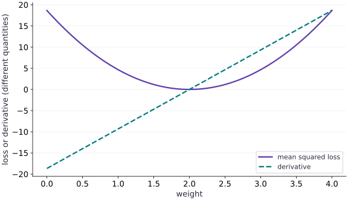

# Losses and value_and_grad

Phase 02: JAX transformations · about 55 minutes · CPU

## What you will be able to do

- Derive a batch mean-squared-error gradient for one weight.
- Use value_and_grad to return a loss and its parameter gradient together.
- Predict how sum versus mean and residual scaling change an update.
- Verify an update with independent arithmetic and diagnose an unstable step.

## The problem

Let’s turn the slope idea into a learning problem. We have three measurements and a model with one weight. How should that weight change to make its predictions better? We’ll calculate the prediction errors, combine them into one loss, and check the gradient by hand before asking JAX for the same result.

## The idea

A loss value tells us how the current prediction is scored. Its derivative tells us how a small parameter change affects that score locally. `value_and_grad` returns both so we can inspect progress and choose an update without confusing the two quantities.

## Read the value and derivative at the same point

Take $L(w)=(w-2)^2+1$ as a new hand-worked objective. At $w=0$, the loss is $5$ and the derivative is $-4$. A small positive change in the weight should decrease the loss. At $w=2$, the derivative is zero but the loss remains $1$.

The added constant changes every loss value but leaves the derivative unchanged. This is a useful diagnostic: if a derivative implementation changes when you add a parameter-independent constant, investigate the implementation. Equally, a nonzero minimum loss need not mean optimization failed.

When reading a plot of value and slope, compare them at the same horizontal coordinate and respect their different vertical units. The loss is not a gradient norm, and a small loss does not establish that all parameters are close to their intended values.

### Pause and reason

If every loss value is multiplied by $10$, what happens to the gradient?

<details><summary>Compare your reasoning</summary>

It is multiplied by $10$ as well. Unlike adding a constant, scaling the objective changes an unadjusted gradient-descent step. Learning-rate comparisons must account for the loss normalization.

</details>

## From three residuals to one decision

Read the formula from the inside out. For example $i$, the model predicts $wx_i$. Subtract the observed target $y_i$ to get the residual, square it, and then average over all $N$ examples. The symbol $\sum$ just tells us to add the individual terms.

For inputs $[1, 2, 3]$, targets $[2, 4, 6]$ and weight $1$, the predictions are $[1, 2, 3]$. The residuals are $[-1, -2, -3]$. Their squares add to $14$, so the mean loss is $14/3$. At weight $2$, every residual is zero. These two settings give us independent checks before we use gradients.

$$
L(w)=\frac{1}{N}\sum_{i=1}^{N}(wx_i-y_i)^2
$$

## Derive the gradient independently

Each squared residual contributes two factors when we differentiate: twice the residual, and the input $x_i$ from differentiating $wx_i$. We average those contributions just as we averaged the losses.

For this dataset, the loss simplifies to $(14/3)(w-2)^2$. At $w=1$, its derivative is $-28/3$. The negative sign tells us that a small increase in the weight reduces the loss. That sign is useful: subtracting a negative gradient should move the weight upward, toward $2$.

$$
\begin{aligned}\frac{dL}{dw}&=\frac{2}{N}\sum_{i=1}^{N}(wx_i-y_i)x_i\\L(w)&=\frac{14}{3}(w-2)^2\quad\text{for our three examples}\end{aligned}
$$

## Read value_and_grad as an interface

The transformation returns a callable whose result is a pair: (value, gradient). In this lesson the value has shape $()$ and the gradient also has shape $()$ because the parameter is scalar. For a vector parameter, the gradient would have the vector parameter shape, not the batch shape. For a structured parameter tree, the gradient mirrors the tree.

Only the first positional argument is differentiated by default. Data can be explicit additional inputs without becoming parameters. Making that boundary explicit will matter when we compile training steps and reuse them across batches. value_and_grad bundles value and derivative computation in one transformed call; it does not guarantee a specific speedup for every workload.

## Predict whether a step improves the objective

A gradient descent step uses $w_{\mathrm{new}}=w-\alpha g$. With $\alpha=0.1$ and $g=-28/3$, w_new is about $1.9333$, much closer to $2$ than the initial $1$. The loss therefore falls to about $0.02074$.

For this quadratic, the error $e=w-2$ evolves as $e_{\mathrm{new}}=(1-28\alpha/3)e$. The loss decreases for a nonzero error when the absolute value of that multiplier is below one, giving $0<\alpha<\frac{3}{14}$. At $\alpha=0.3$, the multiplier is $-1.8$: the update crosses the optimum and increases the magnitude of the error. This threshold belongs to this dataset and objective, not to all training problems. Here $\alpha$ is the step size, $g$ is the gradient, and $e$ measures how far the current weight is from $2$. Try reading the error multiplier before running each step-size experiment.

$$
\begin{aligned}w_{\mathrm{new}}&=w-\alpha g\\e_{\mathrm{new}}&=\left(1-\frac{28\alpha}{3}\right)e,\qquad e=w-2\end{aligned}
$$

## Separate objective value from useful metrics

A single mean can hide an important individual error. Keep residuals or another diagnostic metric alongside the scalar loss. With `has_aux=True`, the function returns `(scalar_loss, auxiliary_data)`, and value_and_grad returns `((loss, auxiliary_data), gradient)`. The differentiation objective is still the scalar loss; the auxiliary return does not create an additional objective.

In a larger model, auxiliary data might contain predictions or accuracy. This interface avoids confusing model outputs, logging information, and the objective. It also makes it easier to test what the step actually optimizes.

## Run the example

```python
import jax
import jax.numpy as jnp
x = jnp.array([1., 2., 3.])
y = 2. * x
def loss(weight):
    return jnp.mean((weight * x - y) ** 2)
value, gradient = jax.value_and_grad(loss)(1.0)
print("Loss:", float(value), "gradient:", float(gradient))
assert jnp.allclose(value, 14./3.)
assert jnp.allclose(gradient, -28./3.)
```

Expected: Loss ≈ $4.666667$; gradient ≈ $-9.333334$. Small floating-point differences are normal.

## Loss and slope answer different questions

**Predict:** Where is the loss smallest, and where does its slope change sign?



**Recorded CPU computation**

### Read the figure

The solid bowl is mean squared loss and the dashed line is its derivative with respect to the weight. The horizontal axis varies the weight. The two vertical quantities have different meanings even though they share one axis.

Both reach zero at $w=2$. At $w=1$, the loss is about $4.67$, while the derivative is about $-9.33$. Left of the minimum, the derivative is negative; right of it, the derivative is positive.

### Connect it to the computation

The loss tells us how wrong the predictions are. The derivative tells us how that loss changes when the weight increases slightly. A negative derivative means moving right initially lowers the loss, which is why subtracting the gradient moves the weight toward $2$.

The dashed line below zero is a negative slope, not a negative squared loss. Likewise, an intersection of the two curves away from the minimum has no special optimization meaning. `value_and_grad` returns these two different pieces of information together.

```python
grid = jnp.linspace(0.0, 4.0, 81)
visual_data = {'kind': 'line', 'x': grid.tolist(), 'xlabel': 'weight', 'ylabel': 'loss or derivative (different quantities)', 'series': [{'label': 'mean squared loss', 'y': jax.vmap(loss)(grid).tolist()}, {'label': 'derivative', 'y': jax.vmap(jax.grad(loss))(grid).tolist()}]}
```

## Recorded reference execution

CPU run: 2026-10-06T15:39:16.000318+00:00. JAX 0.9.2.

```text
Loss: 4.6666669845581055 gradient: -9.333333969116211
weight / loss / gradient: 0.0 18.666667938232422 -18.666667938232422
weight / loss / gradient: 1.0 4.6666669845581055 -9.333333969116211
weight / loss / gradient: 2.0 0.0 0.0
PASS: transforms-02

```

## Check JAX against the handwritten gradient

**Predict before running:** Predict the derivative at weights $0$, $1$, and $2$. Does the loss decrease just because the derivative is negative?

```python
def analytic_loss_gradient(weight):
    return 2. * jnp.mean((weight * x - y) * x)
for weight in (0., 1., 2.):
    value_here, grad_here = jax.value_and_grad(loss)(weight)
    print("weight / loss / gradient:", weight, float(value_here), float(grad_here))
    assert jnp.allclose(grad_here, analytic_loss_gradient(weight))
```

**Expected:** The gradients are $-56/3$, $-28/3$, and $0$; the losses are $56/3$, $14/3$, and $0$.

A derivative describes the direction. A new objective value is obtained only after a chosen update and a new evaluation.

## Return residuals without changing the objective

**Predict before running:** What nested structure will `has_aux=True` return, and which part determines the parameter gradient?

```python
def loss_with_residuals(weight):
    residuals = weight * x - y
    return jnp.mean(residuals ** 2), residuals
(aux_value, residuals), aux_gradient = jax.value_and_grad(loss_with_residuals, has_aux=True)(1.)
assert residuals.shape == (3,)
assert jnp.allclose(residuals, jnp.array([-1., -2., -3.]))
assert jnp.allclose(aux_value, value)
assert jnp.allclose(aux_gradient, gradient)
```

**Expected:** The objective and gradient match the original; residuals are a separate array of shape $(3,)$.

The return structure separates logging data from a scalar optimization target. Reducing or selecting the wrong return value is a common source of interface bugs.

## Make it yours

Foundation · Starting from $w=1$, calculate the next weight and loss for $\alpha=0.1$ and $\alpha=0.3$. Verify both. Explain the overshoot using the error multiplier rather than concluding that autodiff is wrong.

<details><summary>Reference solution</summary>

```python
small_step = 1. - 0.1 * gradient
large_step = 1. - 0.3 * gradient
assert jnp.allclose(small_step, 29. / 15.)
assert loss(small_step) < value
assert loss(large_step) > value
assert jnp.allclose(loss(2.), 0.)
```

</details>

## Make the data boundary explicit

**Practice**

Rewrite `loss(weight, inputs, targets)` with data as arguments. Use value_and_grad and verify the gradient at $w=1$ against the hand-derived result.

<details><summary>Hint</summary>

Default differentiation is with respect to the first argument, not every floating-point input.

</details>

<details><summary>Reference solution and reasoning</summary>

```python
def explicit_loss(weight, inputs, targets):
    return jnp.mean((weight * inputs - targets) ** 2)
v_explicit, g_explicit = jax.value_and_grad(explicit_loss)(1., x, y)
assert jnp.allclose(v_explicit, 14. / 3.)
assert jnp.allclose(g_explicit, -28. / 3.)
```

Keeping data explicit prepares the function for new batches and avoids accidentally closing over stale training data.

</details>

## Audit reduction and batch replication

**Challenge**

Compare the mean and sum loss gradients. Repeat this batch twice and predict the gradient under both reductions. Explain which learning-rate adjustment makes a sum-based update match a mean-based update.

<details><summary>Hint</summary>

Duplicate data are not new information. Track the factor $N$ in the mathematical objective.

</details>

<details><summary>Reference solution and reasoning</summary>

```python
def summed_loss(weight, inputs, targets):
    return jnp.sum((weight * inputs - targets) ** 2)
g_mean = jax.grad(explicit_loss)(1., x, y)
g_sum = jax.grad(summed_loss)(1., x, y)
x_twice, y_twice = jnp.tile(x, 2), jnp.tile(y, 2)
assert jnp.allclose(g_sum, len(x) * g_mean)
assert jnp.allclose(jax.grad(explicit_loss)(1., x_twice, y_twice), g_mean)
assert jnp.allclose(jax.grad(summed_loss)(1., x_twice, y_twice), 2. * g_sum)
assert jnp.allclose(1. - 0.1 * g_mean, 1. - (0.1 / len(x)) * g_sum)
```

Mean gradients stay fixed under exact batch replication; sum gradients scale with the count. Compensating the rate by 1/N makes this particular SGD update match.

</details>

## Check your understanding

You duplicate every example and keep the same learning rate. What happens to a sum-loss SGD update compared with the original batch?

1. Its gradient and update magnitude double.
2. It stays unchanged because the data values are unchanged.
3. value_and_grad silently converts the sum to a mean.

<details><summary>Answer and explanation</summary>

Its gradient and update magnitude double.

A sum counts each replicated contribution again. A mean divides by the new batch size and would preserve the gradient in this example.

</details>

## Diagnose the result

If an update increases loss, verify the subtraction sign, reduction scale, and learning rate before blaming the gradient transform. If the objective is nonscalar, inspect the residual and reduction shapes. If metrics look plausible but gradients are wrong, compare against the independently derived formula at more than one parameter setting. These checks separate implementation mistakes from an unstable optimization choice.

## Carry forward

- A scalar reduction defines both the objective and the update scale.
- value_and_grad returns a value/gradient pair; the gradient follows the parameter shape.
- Independent arithmetic and multiple parameter settings provide a useful numerical check.
- Descent direction does not guarantee descent with an arbitrary step size.

## Keep your evidence

Keep handwritten loss/gradient arithmetic, checks at three weights, small/large-rate update results, auxiliary residuals, and mean-versus-sum batch-replication results. Explain the update-scale change.

Keep predictions, modified code, observed results, and reasoning. A checkpoint alone does not demonstrate the exercise.

## Primary references

- [JAX: value_and_grad](https://docs.jax.dev/en/latest/_autosummary/jax.value_and_grad.html)

