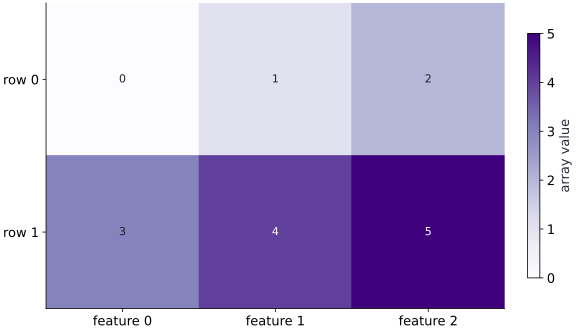

# Meet your arrays and devices

Phase 00: Setup & first steps · about 45 minutes · CPU

## What you will be able to do

- Read the table before using an API
- Derive a reduction and its output shape
- Distinguish dtype from mathematical value
- Inspect placement without assuming an accelerator

## The problem

Imagine a small table: two observations, with three measurements in each row. If we ask JAX to add the values, should it add across the rows or down the columns? Let’s work out both answers before running any code. You’ll learn to check an array’s shape, number format and device, so a plausible-looking result does not hide a mistake.

## The idea

An array is a collection of values with a shape, a dtype and a device. Shape tells us how to index the values; dtype tells us how they are represented; device tells us where the computation lives. Start by predicting a small reduction before asking JAX to perform it.

## Read one array two ways

Take the two rows $[1,2,3]$ and $[4,5,6]$. Summing across each row gives $[6,15]$: one answer per observation. Summing down the rows gives $[5,7,9]$: one answer per feature. The values are the same; the question determines the axis.

In Python, the row sums use `axis=1`, because the feature axis is reduced. The feature sums use `axis=0`, because the observation axis is reduced. The axis you name is the one you consume, not the one you keep.

Read the heatmap by locating one row and one column before looking at its color. Color helps compare values, but labels establish which observation and feature you are comparing. A device label is a separate property; moving the same values to another device does not change what a row means.

### Pause and reason

If the batch gains a third observation with the same three features, which reduction still returns three values?

<details><summary>Compare your reasoning</summary>

The feature sums still return three values because `axis=0` removes the observation axis. Row sums now return three values too, but for a different reason. This is why unequal axis sizes make debugging easier.

</details>

## Read the table before using an API

Start with the six values $0$ through $5$. Reshape them into two rows: $[0, 1, 2]$ and $[3, 4, 5]$. The first axis selects an observation; the second selects a measurement. Shape $(2, 3)$ describes that organization, not the numerical values. Reshape preserves element count and ordering here; it does not create new measurements.

A length-six array and a two-by-three array contain the same values but invite different operations. In your notebook, write an axis label beside each dimension. This becomes important when a later model expects one prediction per row.

```text
flat [0,1,2,3,4,5] → rows [[0,1,2],[3,4,5]]
axis 0: observations (2)
axis 1: measurements (3)
```

## Derive a reduction and its output shape

Summing along axis $1$ removes the measurement axis and leaves one number per observation. The first row sums to $3$, the second to $12$, so the result has shape $(2,)$. Summing along axis $0$ instead combines observations and leaves three measurement totals: $[3, 5, 7]$.

A reduction can also keep the reduced axis with `keepdims=True.` Column means then have shape $(1, 3)$, which states explicitly that the same three means are subtracted from every row. Derive the numbers and shape before using sum or mean.

```text
(2,3) --sum(axis=1)--> (2,) : [3,12]
(2,3) --sum(axis=0)--> (3,) : [3,5,7]
```

## Distinguish dtype from mathematical value

Dtype describes storage and arithmetic, not whether a value happens to be an integer. The value $3$ can be represented as int32 or float32. This lesson asks for float32 explicitly so later differentiation uses an inexact input. Do not infer precision from the way Python prints a scalar.

Float32 cannot represent every real number, or even every large integer. An exact-looking printed value is not a guarantee of exact arithmetic. Keep dtype in an experiment record and compare with tolerances when arithmetic is approximate.

## Inspect placement without assuming an accelerator

`jax.devices()` lists available devices; `x.devices()` describes the placement of this array. A CPU result is useful evidence of CPU execution. It does not establish that a TPU runtime is installed or that a model scales across devices.

Creating a NumPy copy brings values into host memory for inspection. Converting a scalar with float also requires a concrete value. Those are useful boundaries for tests and reports; repeated transfers inside a training loop can distort performance. Use device metadata to inspect placement and an explicit synchronization point for timing later.

## Prepare the inputs

Create main.py in your lesson workspace. Add this first block; use the environment from setup.

```python
# Step 1 — Prepare the inputs: These explicit inputs define the case that the later checks will...
# Import jax for this computation.
import jax
import jax.numpy as jnp
```

These explicit inputs define the case that the later checks will verify.

## Build the computation

Append this block below the inputs in the same file.

```python
# Step 2 — Build the computation: x has two observations and three features.
# Construct and reshape `x` into the target tensor dimensions.
x = jnp.arange(6, dtype=jnp.float32).reshape(2, 3)
```

$x$ has two observations and three features. `axis=0` removes the observation dimension, so the means describe features; the centered result retains both axes.

## Run and check the result

Append the checks, save main.py, and run python main.py from this folder using your course environment.

```python
# Step 3 — Run and check the result: Compare the output to the expected result below before making the...
# Print the observed values to compare against the expected result.
print("Shape:", x.shape)
# Print diagnostic summary of the computed outputs.
print("Dtype:", x.dtype)
# Print diagnostic summary of the computed outputs.
print("Devices:", x.devices())
# Print diagnostic summary of the computed outputs.
print("Row sums:", x.sum(axis=1))
# Verify that the output tensor shape matches our prediction.
assert x.shape == (2, 3)
# Verify that the output satisfies the expected shape, finite-value, or numerical contract.
assert jnp.allclose(x.sum(axis=1), jnp.array([3., 12.]))
```

Compare the output to the expected result below before making the exercise change.

## Run the example

```python
# Step 1 — Prepare the inputs: These explicit inputs define the case that the later checks will...
# Import jax for this computation.
import jax
import jax.numpy as jnp
# Step 2 — Build the computation: x has two observations and three features.
# Construct and reshape `x` into the target tensor dimensions.
x = jnp.arange(6, dtype=jnp.float32).reshape(2, 3)
# Step 3 — Run and check the result: Compare the output to the expected result below before making the...
# Print the observed values to compare against the expected result.
print("Shape:", x.shape)
# Print diagnostic summary of the computed outputs.
print("Dtype:", x.dtype)
# Print diagnostic summary of the computed outputs.
print("Devices:", x.devices())
# Print diagnostic summary of the computed outputs.
print("Row sums:", x.sum(axis=1))
# Verify that the output tensor shape matches our prediction.
assert x.shape == (2, 3)
# Verify that the output satisfies the expected shape, finite-value, or numerical contract.
assert jnp.allclose(x.sum(axis=1), jnp.array([3., 12.]))
```

Expected: Shape: $(2, 3)$; Dtype: float32; Row sums: [ $3$. $12$.]. Device names vary.

## Rows are groups of observations

**Predict:** Which row should sum to $12$?



**Recorded CPU computation**

### Read the figure

The horizontal axis selects a feature column; the vertical axis selects an observation row. Each cell contains one array value. The color bar maps larger numbers to darker purple: the bottom-right cell is darkest because it contains $5$.

Read across the top row to find $(0,1,2)$, then across the bottom row to find $(3,4,5)$. The picture therefore represents an array with shape $(2,3)$: two observations, each with three features.

### Connect it to the computation

Now connect the picture to a reduction. Summing the feature columns within each row gives $0+1+2=3$ and $3+4+5=12$. That is why summing along axis $1$ returns two values. Summing down rows instead would return $(3,5,7)$, one value per feature.

The row labels are positions, not times or class labels. The darker lower row tells us its stored values are larger; it does not imply that the observation is more important.

```python
# Compute figure data for: Rows are groups of observations
# Evaluate `visual_data` from the current inputs and state.
visual_data = {'kind': 'heatmap', 'values': x.tolist(), 'rows': ['row 0', 'row 1'], 'columns': ['feature 0', 'feature 1', 'feature 2'], 'unit': 'array value'}
```

## Recorded reference execution

CPU run: 2026-10-08T14:01:08.742597+00:00. JAX 0.9.2.

```text
Shape: (2, 3)
Dtype: float32
Devices: {CpuDevice(id=0)}
Row sums: [ 3. 12.]
Shape: (2, 3)
Dtype: float32
Devices: {CpuDevice(id=0)}
Row sums: [ 3. 12.]
Means: [[1.5 2.5 3.5]]
Centered: [[-1.5 -1.5 -1.5]
 [ 1.5  1.5  1.5]]
Host dtype: float32
Expected element-count mismatch
PASS: welcome-02

```

## Center each measurement

**Predict before running:** Predict the three column means and every centered value. Which mean is shared by the two observations?

```python
# Experiment — Center each measurement: The calculation reuses one mean per column.
# Reduce along axis=0 to compute `means`.
means=x.mean(axis=0,keepdims=True)
# Evaluate `centered` from the current inputs and state.
centered=x-means
# Print the observed values to compare against the expected result.
print("Means:",means)
# Print diagnostic summary of the computed outputs.
print("Centered:",centered)
# Verify that the output tensor shape matches our prediction.
assert means.shape==(1,3)
# Verify that the output satisfies the expected shape, finite-value, or numerical contract.
assert jnp.allclose(centered,jnp.array([[-1.5,-1.5,-1.5],[1.5,1.5,1.5]]))
```

**Expected:** Means $[[1.5,2.5,3.5]]$; centered rows are $-1.5$ and $+1.5$.

The calculation reuses one mean per column. An explicit hand calculation verifies both the values and the meaning of the reduction.

## Keep a host reference

**Predict before running:** Will copying to NumPy preserve values and shape? Does that copy describe device-resident computation?

```python
# Experiment — Keep a host reference: The host reference is an inspection copy.
# Import numpy for this computation.
import numpy as np
# Convert `host` to a host NumPy array for inspection or verification.
host=np.asarray(x)
# Verify that the output tensor shape matches our prediction.
assert host.shape==(2,3)
# Create evenly spaced index values in ``.
np.testing.assert_array_equal(host,np.arange(6).reshape(2,3))
# Print the observed values to compare against the expected result.
print("Host dtype:",host.dtype)
```

**Expected:** A NumPy array with the same two-by-three values.

The host reference is an inspection copy. Its existence says nothing about accelerator throughput.

## Make it yours

Compute column sums instead. State the resulting shape before running the code.

### How to write this exercise — Step-by-step recipe & starter scaffold

**Key functions & syntax to use:**
- `jnp.array(values, dtype=...)` — Constructs an immutable device-backed JAX array from Python/NumPy values.
- `x.sum(axis=...) / x.mean(axis=..., keepdims=...)` — Reduces values along the named `axis` (the axis you name is collapsed unless `keepdims=True`).
- `jnp.allclose(actual, expected, rtol=..., atol=...)` — Checks that two arrays match elementwise within floating-point tolerance.

**Step-by-step implementation plan:**
1. Reduce along axis=0 to compute `column_sums`.
2. Verify that the output tensor shape matches our prediction.
3. Verify that the output satisfies the expected shape, finite-value, or numerical contract.

**Starter code scaffold (fill in the TODOs):**

```python
# Exercise solution: Compute column sums instead.
# Reduce along axis=0 to compute `column_sums`.
column_sums = x.sum(...)  # TODO: compute column_sums
# Verify that the output tensor shape matches our prediction.
assert column_sums.shape  # TODO: complete assertion check
# Verify that the output satisfies the expected shape, finite-value, or numerical contract.
assert jnp.allclose(column_sums, jnp.array([3., 5., 7.]))  # TODO: complete assertion check
```

<details><summary>Reference solution</summary>

```python
# Exercise solution: Compute column sums instead.
# Reduce along axis=0 to compute `column_sums`.
column_sums = x.sum(axis=0)
# Verify that the output tensor shape matches our prediction.
assert column_sums.shape == (3,)
# Verify that the output satisfies the expected shape, finite-value, or numerical contract.
assert jnp.allclose(column_sums, jnp.array([3., 5., 7.]))
```

</details>

## Add a new observation

**Practice**

Append $[6,7,8]$. Predict row sums and column means, then check both.

<details><summary>Hint</summary>

Keep observation rows and measurement columns.

</details>

### How to write: Add a new observation — Step-by-step recipe & starter scaffold

**Key functions & syntax to use:**
- `jnp.arange(n, dtype=...)` — Creates a 1-D JAX array of evenly spaced values `[0, 1, ..., n-1]` on the target device.
- `jnp.array(values, dtype=...)` — Constructs an immutable device-backed JAX array from Python/NumPy values.
- `array.reshape(new_shape)` — Reorganizes tensor axes without changing the total element count (`array.size`).
- `x.sum(axis=...) / x.mean(axis=..., keepdims=...)` — Reduces values along the named `axis` (the axis you name is collapsed unless `keepdims=True`).

**Step-by-step implementation plan:**
1. Construct and reshape `table` into the target tensor dimensions.
2. Verify that the numerical values match the expected reference within tolerance.
3. Verify that the output satisfies the expected shape, finite-value, or numerical contract.

**Starter code scaffold (fill in the TODOs):**

```python
# Add a new observation (Practice): Changing the observation count changes axis 0, while the...
# Construct and reshape `table` into the target tensor dimensions.
table = jnp.arange(...)  # TODO: compute table
# Verify that the numerical values match the expected reference within tolerance.
assert jnp.allclose(table.sum(axis=1),jnp.array([3.,12.,21.]))  # TODO: complete assertion check
# Verify that the output satisfies the expected shape, finite-value, or numerical contract.
assert jnp.allclose(table.mean(axis=0),jnp.array([3.,4.,5.]))  # TODO: complete assertion check
```

<details><summary>Reference solution and reasoning</summary>

```python
# Add a new observation (Practice): Changing the observation count changes axis 0, while the...
# Construct and reshape `table` into the target tensor dimensions.
table=jnp.arange(9,dtype=jnp.float32).reshape(3,3)
# Verify that the numerical values match the expected reference within tolerance.
assert jnp.allclose(table.sum(axis=1),jnp.array([3.,12.,21.]))
# Verify that the output satisfies the expected shape, finite-value, or numerical contract.
assert jnp.allclose(table.mean(axis=0),jnp.array([3.,4.,5.]))
```

Changing the observation count changes axis $0$, while the measurement count stays three.

</details>

## Diagnose an impossible reshape

**Challenge**

Try reshaping six values to $(2,4)$. Explain the failure and repair the intended three-measurement table.

<details><summary>Hint</summary>

Count required elements before changing the code.

</details>

### How to write: Diagnose an impossible reshape — Step-by-step recipe & starter scaffold

**Key functions & syntax to use:**
- `array.reshape(new_shape)` — Reorganizes tensor axes without changing the total element count (`array.size`).

**Step-by-step implementation plan:**
1. Run the boundary check and catch the expected exception:
2. Verify contract: `x.reshape(2, 3).size == 6`.

**Starter code scaffold (fill in the TODOs):**

```python
# Diagnose an impossible reshape (Challenge): An incompatible reshape is an element-count error.
# Run the boundary check and catch the expected exception:
try:
    x.reshape(2,4)
except TypeError:
    print("Expected element-count mismatch")
else:
    raise AssertionError("Expected reshape to fail")
# Verify contract: `x.reshape(2, 3).size == 6`.
assert x.reshape(2,3).size  # TODO: complete assertion check
```

<details><summary>Reference solution and reasoning</summary>

```python
# Diagnose an impossible reshape (Challenge): An incompatible reshape is an element-count error.
# Run the boundary check and catch the expected exception:
try:
    x.reshape(2,4)
except TypeError:
    print("Expected element-count mismatch")
else:
    raise AssertionError("Expected reshape to fail")
# Verify contract: `x.reshape(2, 3).size == 6`.
assert x.reshape(2,3).size==6
```

An incompatible reshape is an element-count error. Changing a dtype or moving devices cannot fix it. Choose a shape whose product matches six.

</details>

## Check your understanding

For an array of shape $(2, 3)$, what shape results from `sum(axis=0)`?

1. $(2,)$
2. $(3,)$
3. $(2, 3)$

<details><summary>Answer and explanation</summary>

$(3,)$

Axis $0$ is reduced. The three columns remain, so the result has shape $(3,)$.

</details>

## Diagnose the result

An incompatible reshape is an element-count error. Changing a dtype or moving devices cannot fix it. Choose a shape whose product matches six.

## Carry forward

- The calculation reuses one mean per column. An explicit hand calculation verifies both the values and the meaning of the reduction.
- The host reference is an inspection copy. Its existence says nothing about accelerator throughput.

## Keep your evidence

Keep the labeled table, row/column calculations, centered-data check, array dtype/device report and the failed reshape with its element-count diagnosis.

Save your predictions, modified code, terminal outputs, and reasoning in your engineering portfolio.

## Primary references

- [JAX arrays](https://docs.jax.dev/en/latest/101/arrays.html)
- [JAX data placement](https://docs.jax.dev/en/latest/201/placement.html)

