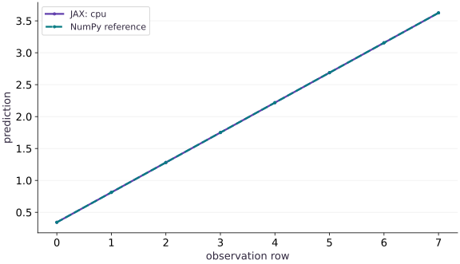

# Move your experiment to a TPU

Phase 00: Setup & first steps · about 45 minutes · CPU

## What you will be able to do

- Verify the device of a completed prediction and its independent numerical reference.
- Run an explicit TPU target path that fails when TPU is unavailable.
- Separate installation, placement and numerical evidence in a reproducibility report.

## The problem

Your notebook imports JAX successfully, but is the prediction actually running on a TPU? We will build a portable device check with an independent numerical answer, then require the requested backend so an unavailable accelerator cannot silently become a successful CPU demonstration.

## The idea

Moving an experiment to a TPU gives us two questions: did it calculate the intended result, and did it actually execute on the requested device? We answer the first with an independent numerical reference and the second with an observed device receipt.

## Check arithmetic and placement separately

Consider a prediction that adds a scalar bias after a dot product. Reducing the bias by $0.25$ should reduce every prediction by $0.25$, whatever compatible device performs the computation. That is a numerical invariant you can derive before running.

Now inspect where the completed result resides. A correct NumPy comparison on CPU does not show that a TPU was selected. Conversely, a TPU device label does not show that the formula or input data was correct. Keep both checks.

Wait for the result before recording completion or timing. A returned array handle can precede finished device work. Preserve the requested platform, observed platform, environment and error tolerance alongside the values.

### Pause and reason

The values match NumPy but the requested TPU run reports a CPU result. Which part passed?

<details><summary>Compare your reasoning</summary>

The arithmetic comparison passed. The requested placement did not. Investigate runtime/device selection instead of treating the numerical match as TPU validation.

</details>

## Carry a prediction, not just an installation

We will move one small function between runtimes: a matrix-vector prediction with a scalar bias. Each row is an observation; three columns are three features. The weights are fixed so we can calculate the answer independently. For the first row, $[0,1/8,2/8]$, the prediction is $0-1/32+1/4+1/8=11/32$. A working package import is useful, but it does not establish where this computation finished.

$$
\hat y_i=\sum_{j=1}^{3}x_{ij}w_j+b,\qquad X\in\mathbb{R}^{8\times3},\quad w\in\mathbb{R}^{3},\quad b=1/8
$$

## Establish the CPU reference first

Save the assembled code as main.py in your course workspace and run it in a fresh process. By default COURSE_EXPECT_PLATFORM is cpu. The program selects that backend explicitly, places both inputs on its first device and waits for the compiled prediction to finish. NumPy independently calculates the same arithmetic. Keep the environment report and predictions.

The tolerance allows small floating-point differences; a successful comparison means this prediction agrees within that tolerance. It does not establish accuracy for a larger model. We use float32 inputs deliberately. Implicit dtype changes and reduced-precision matrix multiplication should be separate experiments after the placement check.

**Run the CPU reference**

```bash
python main.py
```

**Expected:** The report names cpu, shape [8], float32, a completed output device and a small maximum absolute error. The first prediction is 0.34375.

## Run the same file on an existing TPU runtime

Use a supported TPU runtime you already have access to. The install command below belongs inside its Python environment; installing a TPU package on your laptop does not create an accelerator. Keep the interpreter and installed package versions in your report. Start a fresh Python process after installation.

Set COURSE_EXPECT_PLATFORM to tpu when running the same file. The call to jax.devices requests TPU explicitly and should fail when that backend is unavailable. The program checks the output array’s actual device after completion. Keep that report beside the CPU report. This course has executed the CPU path; a TPU run and its numerical result remain unverified here.

This is a single-controller, single-device placement check even if the runtime lists multiple devices. A multi-host launch needs coordinated initialization before querying devices and belongs to the distributed course. No throughput comparison is meaningful for this tiny setup check.

**Inside an existing supported TPU environment**

```bash
python -m pip install "jax[tpu]"
```

**Expected:** The TPU environment installs compatible JAX and TPU runtime packages. Record the resolved versions; installation alone is not the execution check.

**Require TPU execution**

```bash
COURSE_EXPECT_PLATFORM=tpu JAX_PLATFORMS=tpu python main.py
```

**Expected:** On a functioning TPU runtime the report names tpu and all assertions pass. An unavailable TPU must raise an error instead of producing a CPU success report.

## Diagnose the boundary that failed

If import fails, check the interpreter and installation. If explicit backend selection fails, check whether you are in the intended runtime and whether its TPU service is available. If device placement succeeds but the independent comparison fails, inspect shapes, dtype, precision and the arithmetic. Do not widen tolerance just to hide a large error.

An old notebook kernel may retain an initialized CPU backend or stale variables. Restart it, set runtime choices before the first device operation and run every cell. A CPU plot from the recorded course run remains a CPU plot when viewed on a machine that happens to have TPU access; only a fresh recorded execution supplies new evidence.

## Choose the requested platform

Add this block to main.py after the preceding block. Run the assembled file in a fresh process.

```python
import os
import json
import platform
import numpy as np
import jax
import jax.numpy as jnp
```

Keep the requested backend, observed output placement and independent arithmetic check together in the final report.

## Place inputs and compare a completed prediction

Add this block to main.py after the preceding block. Run the assembled file in a fresh process.

```python
expected = os.environ.get('COURSE_EXPECT_PLATFORM', 'cpu')
if expected not in {'cpu', 'tpu'}:
    raise ValueError('COURSE_EXPECT_PLATFORM must be cpu or tpu')
# Selecting a requested backend must fail when it is unavailable.
devices = jax.devices(expected)
assert devices and all(d.platform == expected for d in devices)
x_host = np.arange(24, dtype=np.float32).reshape(8, 3) / 8
w_host = np.array([0.5, -0.25, 1.0], dtype=np.float32)
x = jax.device_put(x_host, devices[0])
w = jax.device_put(w_host, devices[0])
predict = jax.jit(lambda a, b: a @ b + jnp.float32(0.125))
y = predict(x, w)
y.block_until_ready()
reference = x_host @ w_host + np.float32(0.125)
np.testing.assert_allclose(np.asarray(y), reference, rtol=1e-5, atol=1e-5)
assert {d.platform for d in y.devices()} == {expected}
report = dict(expected=expected, output_devices=[str(d) for d in y.devices()],
              platform=next(iter(y.devices())).platform, jax=jax.__version__,
              python=platform.python_version(), shape=list(y.shape), dtype=str(y.dtype),
              max_absolute_error=float(np.max(np.abs(np.asarray(y)-reference))),
              process_index=jax.process_index(), process_count=jax.process_count())
print(json.dumps(report, indent=2))
print('Completed prediction:', np.asarray(y).tolist())

```

Keep the requested backend, observed output placement and independent arithmetic check together in the final report.

## Run the example

```python
import os
import json
import platform
import numpy as np
import jax
import jax.numpy as jnp

expected = os.environ.get('COURSE_EXPECT_PLATFORM', 'cpu')
if expected not in {'cpu', 'tpu'}:
    raise ValueError('COURSE_EXPECT_PLATFORM must be cpu or tpu')
# Selecting a requested backend must fail when it is unavailable.
devices = jax.devices(expected)
assert devices and all(d.platform == expected for d in devices)
x_host = np.arange(24, dtype=np.float32).reshape(8, 3) / 8
w_host = np.array([0.5, -0.25, 1.0], dtype=np.float32)
x = jax.device_put(x_host, devices[0])
w = jax.device_put(w_host, devices[0])
predict = jax.jit(lambda a, b: a @ b + jnp.float32(0.125))
y = predict(x, w)
y.block_until_ready()
reference = x_host @ w_host + np.float32(0.125)
np.testing.assert_allclose(np.asarray(y), reference, rtol=1e-5, atol=1e-5)
assert {d.platform for d in y.devices()} == {expected}
report = dict(expected=expected, output_devices=[str(d) for d in y.devices()],
              platform=next(iter(y.devices())).platform, jax=jax.__version__,
              python=platform.python_version(), shape=list(y.shape), dtype=str(y.dtype),
              max_absolute_error=float(np.max(np.abs(np.asarray(y)-reference))),
              process_index=jax.process_index(), process_count=jax.process_count())
print(json.dumps(report, indent=2))
print('Completed prediction:', np.asarray(y).tolist())

```

Expected: The recorded CPU reference predicts [0.34375, 0.8125, 1.28125, 1.75, 2.21875, 2.6875, 3.15625, 3.625]. Its report names the actual output device. There is no recorded TPU result.

## The same prediction checked two ways

**Predict:** Should the JAX line overlap the independent NumPy points, and would overlap alone prove TPU execution?



**Recorded CPU computation**

### Read the figure

The horizontal axis is the observation row index, starting at $0$. The vertical axis is the scalar prediction. The two series use the same inputs and weights: one comes from the completed JAX array, the other from NumPy. They overlap in this recorded CPU example. The first value is $11/32$; the constant rise of $15/32$ follows from increasing every feature by $3/8$ while the weights sum to $5/4$.

### Connect it to the computation

The line is a check of arithmetic and ordering for these eight observations. Read the printed platform report to determine placement; a curve cannot identify the device that produced it. The changed-bias exercise translates this line downward, while row reversal changes the order. This recorded figure comes from the CPU path and carries no TPU timing or correctness claim.

```python
visual_data={'kind':'line','x':list(range(8)),'xlabel':'observation row','ylabel':'prediction','series':[{'label':'JAX: '+expected,'y':np.asarray(y).tolist()},{'label':'NumPy reference','y':reference.tolist()}]}
```

## Recorded reference execution

CPU run: 2026-10-06T21:55:53.169773+00:00. JAX 0.9.2.

```text
{
  "expected": "cpu",
  "output_devices": [
    "TFRT_CPU_0"
  ],
  "platform": "cpu",
  "jax": "0.9.2",
  "python": "3.14.3",
  "shape": [
    8
  ],
  "dtype": "float32",
  "max_absolute_error": 0.0,
  "process_index": 0,
  "process_count": 1
}
Completed prediction: [0.34375, 0.8125, 1.28125, 1.75, 2.21875, 2.6875, 3.15625, 3.625]
{
  "expected": "cpu",
  "output_devices": [
    "TFRT_CPU_0"
  ],
  "platform": "cpu",
  "jax": "0.9.2",
  "python": "3.14.3",
  "shape": [
    8
  ],
  "dtype": "float32",
  "max_absolute_error": 0.0,
  "process_index": 0,
  "process_count": 1
}
Completed prediction: [0.34375, 0.8125, 1.28125, 1.75, 2.21875, 2.6875, 3.15625, 3.625]
Mismatched platform report rejected.
Changed bias, first prediction: -0.03125
Row reversal preserved values and requested placement.
PASS: welcome-03

```

## Reject a mismatched report

**Predict before running:** Would a correct numeric answer be enough if the report says CPU but the requested target is TPU?

```python
def verify_report(record, required):
    if record['platform'] != required or record['expected'] != required:
        raise ValueError('requested and observed platform disagree')
    if record['shape'] != [8] or record['dtype'] != 'float32':
        raise ValueError('prediction contract changed')
    return True
assert verify_report(report, expected)
wrong = {**report, 'platform': 'cpu' if expected == 'tpu' else 'tpu'}
try:
    verify_report(wrong, expected)
except ValueError:
    print('Mismatched platform report rejected.')
else:
    raise AssertionError('a mismatched report was accepted')
```

**Expected:** The deliberately inconsistent report raises ValueError; the actual report passes.

Numerical agreement and requested placement are separate requirements. This experiment tests report validation; the main program performs the actual backend selection and array-placement check.

## Make it yours

Predict the effect of replacing the bias by minus one quarter. Run a second compiled prediction on the selected device. Compare against the original prediction plus the expected constant shift and an independent NumPy calculation.

<details><summary>Reference solution</summary>

```python
changed_predict = jax.jit(lambda a, b: a @ b - jnp.float32(0.25))
changed = changed_predict(x, w)
changed.block_until_ready()
np.testing.assert_allclose(np.asarray(changed), reference - 0.375, atol=1e-5, rtol=1e-5)
np.testing.assert_allclose(np.asarray(changed), x_host @ w_host - 0.25, atol=1e-5, rtol=1e-5)
assert {d.platform for d in changed.devices()} == {expected}
print('Changed bias, first prediction:', float(changed[0]))
```

</details>

## Test row order without changing the model

**Transfer**

Reverse the observation rows and predict the result order before execution. Verify the first and last values, the complete vector and device placement. Explain why this is a stronger check than only comparing the vector sum.

<details><summary>Hint</summary>

A row-wise affine prediction commutes with row permutation. A sum would conceal an ordering bug.

</details>

<details><summary>Reference solution and reasoning</summary>

```python
reversed_x = jax.device_put(x_host[::-1].copy(), devices[0])
reversed_y = predict(reversed_x, w)
reversed_y.block_until_ready()
np.testing.assert_allclose(np.asarray(reversed_y), reference[::-1], atol=1e-5, rtol=1e-5)
assert {d.platform for d in reversed_y.devices()} == {expected}
assert np.isclose(float(reversed_y[0]), 3.625)
assert np.isclose(float(reversed_y[-1]), 0.34375)
print('Row reversal preserved values and requested placement.')
```

Reversing rows should reverse predictions because each observation is evaluated independently. Matching a sum would not reveal a misplaced or reordered prediction.

</details>

## Check your understanding

The values match NumPy, but the output array is on CPU when the requested platform was TPU. What has been demonstrated?

1. The TPU installation and its execution are validated.
2. The arithmetic matches the reference, but the requested TPU execution has not been validated.
3. The model must be numerically wrong.

<details><summary>Answer and explanation</summary>

The arithmetic matches the reference, but the requested TPU execution has not been validated.

A correct value can be produced on the wrong device. Require both reference agreement and the output placement before recording a successful target run.

</details>

## Diagnose the result

Read the first failing boundary: interpreter/import, explicit backend discovery, output placement or numerical comparison. Keep the original error and requested platform in the report. Restart a stale notebook kernel before trying the target again.

## Carry forward

- Check an actual completed array, not only the installed package.
- Request TPU explicitly so its absence produces an error.
- Retain separate CPU and TPU evidence with versions and dtype.

## Keep your evidence

Keep separate CPU and TPU reports with requested/observed platform, package versions, completed predictions, NumPy error and changed-bias and row-permutation checks. Until the target command succeeds, TPU execution remains unverified.

Keep predictions, modified code, observed results, and reasoning. A checkpoint alone does not demonstrate the exercise.

## Primary references

- [JAX installation and TPU support](https://docs.jax.dev/en/latest/installation.html)
- [JAX device placement](https://docs.jax.dev/en/latest/sharded-computation.html)

