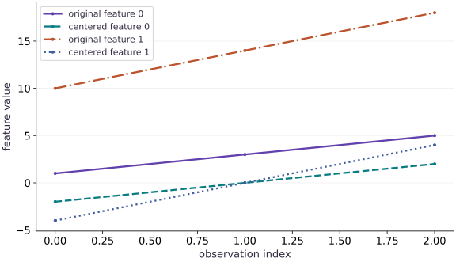

# From NumPy to jax.numpy

Phase 01: Arrays & pure functions · about 45 minutes · CPU

## What you will be able to do

- Translate a feature-wise NumPy calculation to `jax.numpy.`
- Predict the shapes and values of reductions and broadcasted centering.
- Fit preprocessing statistics on training data and reuse them on new data.
- Handle constant features explicitly and compare against a NumPy reference.

## The problem

Suppose your dataset records two measurements on very different scales. How can we put them on a more comparable footing before training a model? We’ll center each feature and divide by its scale. First we’ll work through three rows by hand; then we’ll write the JAX version and try new data, including a feature that never changes.

## The idea

Feature preprocessing answers a specific question: how does each measurement compare with the training data's scale and center? Compute statistics along the observation axis, then reuse those fitted statistics. A held-out example must not help choose the transformation used to evaluate it.

## Why held-out data should not center itself

Use a small new case: training values for one feature are $2$ and $6$, so their mean is $4$. Centered training values become $-2$ and $2$. A held-out value of $10$ becomes $6$ when we apply the training mean.

If we center that single held-out value using its own mean, it becomes zero. The computation succeeds, but it has erased the evidence that the new value lies far from the training center. With several features, retain one fitted mean per feature rather than collapsing the entire table to one mean.

The lesson's centering plot compares values before and after the same columnwise operation. It explains a translation of each feature, not a guarantee that future observations will have zero mean. Add scaling only after specifying the variance convention and how constant features are handled.

### Pause and reason

Should a correctly transformed held-out batch always have mean zero?

<details><summary>Compare your reasoning</summary>

No. Its mean reflects how that batch differs from training. Zero training mean is a property of the fitted centering operation; forcing held-out mean to zero changes the evaluation contract.

</details>

## Follow an axis through a reduction

A shape $(3, 2)$ means three observations with two feature values each. `mean(axis=0)` reduces the three observations and leaves two feature means, so its output shape is $(2,)$. `mean(axis=1)` instead averages unlike feature values within each observation, leaving shape $(3,)$. `mean()` with no axis reduces every value to a scalar.

All three calculations are legal. Only the first answers the question about each feature across observations. A valid shape is not evidence of a meaningful statistic: if the features represent different units, averaging them within a row might have no useful interpretation.

```text
(N,D) -- mean over axis 0 --> (D,)
(N,D) -- mean over axis 1 --> (N,)
(N,D) -- mean over all axes --> ()
```

## Derive the centering and scale values

Think of one column at a time. The symbol $x_{ij}$ means the value in row $i$, feature $j$, and $N$ is the number of training rows. The mean $\mu_j$ is the column’s center. The variance $s_j^2$ averages squared distances from that center; its square root $s_j$ is the scale we divide by.

For the first feature $[1, 3, 5]$, the mean is $3$. The centered values are $[-2, 0, 2]$, so the variance is $8/3$. The second feature $[10, 14, 18]$ centers to $[-4, 0, 4]$ and has variance $32/3$. Its scale is twice as large, so both columns have the same standardized pattern.

A constant column has scale zero. We use a safe denominator of $1$ for that column, which leaves its centered training values at zero. Learn the mean and scale from training data, then reuse them on new data; recomputing them on each incoming batch changes the meaning of a feature.

$$
\begin{aligned}\mu_j&=\frac{1}{N}\sum_{i=1}^{N}x_{ij}\\s_j^2&=\frac{1}{N}\sum_{i=1}^{N}(x_{ij}-\mu_j)^2\\z_{ij}&=\frac{x_{ij}-\mu_j}{s_j}\quad(s_j>0)\end{aligned}
$$

## Fit statistics once; apply them consistently

Centering training data using its own mean is useful. Recomputing the mean separately for each validation batch changes the transformation and incorporates information from that batch. A model then sees features represented in different coordinate systems.

Separate `fit_standardizer(training_data)`, which computes statistics, from `apply_standardizer(data, statistics)`, which reuses them. The same rule will apply to training/validation splits, inference requests, and checkpointed preprocessing state. A new batch is not expected to have zero mean after applying training statistics; that difference can be meaningful.

## Give constant features an explicit policy

A constant feature has zero standard deviation. Dividing its zero centered values by zero produces an undefined result. Adding epsilon to every scale is a simple bounded choice, but it perturbs the scale of every feature and can amplify a tiny feature with near-zero variability.

For this lesson, use $s=1$ for exactly constant columns and their training standard deviation otherwise. Training values in a constant column then transform to zero without division by zero. A changed value in new data produces a nonzero centered result. This policy is explicit and testable; it is not a universal prescription for every dataset.

## Use NumPy as a numerical reference, not an execution substitute

Compare a tiny JAX calculation with NumPy using explicitly matching float32 data and the same reduction definitions. Transfer and conversion are fine for this test. Converting an intermediate to NumPy inside a transformed differentiable computation is a different operation and can break its intended transform behavior.

The output of a `jax.numpy` operation is a JAX array with its own device behavior. We will explore devices and compilation elsewhere. At this point, focus on matching values, preserving shapes, and keeping preprocessing semantics explicit.

## Step 1: Set up imports and input tensors

Import the required JAX modules and define the initial inputs for from numpy to jax.numpy.

```python
import jax.numpy as jnp
# Construct `x` via `jnp.array([[1., 10.], [3., 14.], [5., 18.]])`
x = jnp.array([[1., 10.], [3., 14.], [5., 18.]])
```

Establishing explicit input shapes and dtypes first makes the downstream transformation contract deterministic.

## Step 2: Apply the core JAX transformation

Write the core computation and transformation step over the initialized inputs.

```python
mean = x.mean(axis=0)
# Compute `centered` from `x - mean`
centered = x - mean
```

This stage executes the primary numerical transformation and binds the intermediate outputs.

## Step 3: Verify shapes and numerical invariants

Check that the resulting arrays satisfy the expected shape, dtype, and numerical tolerances.

```python
assert jnp.allclose(mean, jnp.array([3., 14.]))
# Check numerical equivalence within tolerance: `jnp.allclose(centered.mean(axis=0), jnp.zeros(2))`
assert jnp.allclose(centered.mean(axis=0), jnp.zeros(2))
```

These assertions lock in the exact numerical contract before you run the full experiment and variations.

## Run the example

```python
# From NumPy to jax.numpy: Feature preprocessing answers a specific question: how does each...
# Import jax.numpy for this computation.
import jax.numpy as jnp
# Construct `x` via `jnp.array([[1., 10.], [3., 14.], [5., 18.]])`
x = jnp.array([[1., 10.], [3., 14.], [5., 18.]])
# Reduce along axis=0 to compute `mean`.
mean = x.mean(axis=0)
# Compute `centered` from `x - mean`
centered = x - mean
# Print the observed values to compare against the expected result.
print("Mean:", mean)
# Print diagnostic summary of the computed outputs.
print("Centered:\n", centered)
# Verify that the numerical values match the expected reference within tolerance.
assert jnp.allclose(mean, jnp.array([3., 14.]))
# Check numerical equivalence within tolerance: `jnp.allclose(centered.mean(axis=0), jnp.zeros(2))`
assert jnp.allclose(centered.mean(axis=0), jnp.zeros(2))
```

Expected: Mean: [ $3$. $14$.]; centered rows: $[-2., -4.]$, $[0., 0.]$, $[2., 4.]$.

## Center each feature around its own mean

**Predict:** Does centering make every entry zero, or only each column mean?



**Recorded CPU computation**

### Read the figure

The horizontal axis indexes the three observations; the vertical axis gives feature values. Compare each original feature with its centered version in the legend. The connecting lines help you follow corresponding entries; they are not a time series.

Feature $0$ changes from $(1,3,5)$ to $(-2,0,2)$, a downward shift of $3$. Feature $1$ changes from $(10,14,18)$ to $(-4,0,4)$, a downward shift of $14$. Both centered series pass through zero at the middle observation.

### Connect it to the computation

Those shifts are the separate column means. Subtracting a mean moves a whole feature without changing the gaps between its observations: feature $0$ still increases by $2$, while feature $1$ still increases by $4$. That is why each centered line stays parallel to its original line.

Centering makes each column’s mean zero, but does not give the columns the same spread. The wider range of centered feature $1$ remains visible. To check your axis choice, add the centered entries in each column: each sum should be zero.

```python
# Compute figure data for: Center each feature around its own mean
# Compute `visual_data` from `{'kind': 'line', 'x': [0, 1, 2], 'xlabel': 'observat...`
visual_data = {'kind': 'line', 'x': [0, 1, 2], 'xlabel': 'observation index', 'ylabel': 'feature value', 'series': [{'label': 'original feature 0', 'y': x[:, 0].tolist()}, {'label': 'centered feature 0', 'y': centered[:, 0].tolist()}, {'label': 'original feature 1', 'y': x[:, 1].tolist()}, {'label': 'centered feature 1', 'y': centered[:, 1].tolist()}]}
```

## Recorded reference execution

CPU run: 2026-10-08T14:01:13.832686+00:00. JAX 0.9.2.

```text
Mean: [ 3. 14.]
Centered:
 [[-2. -4.]
 [ 0.  0.]
 [ 2.  4.]]
new batch transformed: [[2.4494896 2.4494896]]
PASS: arrays-01

```

## Check the normalization arithmetic

**Predict before running:** Predict the feature standard deviations and centered rows before comparing with NumPy.

```python
# Experiment — Check the normalization arithmetic: Matching dtype and statistic definition makes this a useful...
# Import numpy for this computation.
import numpy as np
# Compute `reference_data` from `np.array([[1., 10.], [3., 14.], [5., 18.]], dtype=np...`
reference_data = np.array([[1., 10.], [3., 14.], [5., 18.]], dtype=np.float32)
# Reduce along axis=0 to compute `reference_mean`.
reference_mean = reference_data.mean(axis=0)
# Reduce along axis=0 to compute `reference_scale`.
reference_scale = reference_data.std(axis=0)
# Verify that the numerical values match the expected reference within tolerance.
assert jnp.allclose(mean, reference_mean)
# Check numerical equivalence within tolerance: `jnp.allclose(x.std(axis=0), reference_scale)`
assert jnp.allclose(x.std(axis=0), reference_scale)
# Check numerical equivalence within tolerance: `jnp.allclose(x.std(axis=0), jnp.sqrt(jnp.array([8. / 3., 32. / 3....`
assert jnp.allclose(x.std(axis=0), jnp.sqrt(jnp.array([8. / 3., 32. / 3.])))
```

**Expected:** The feature means are $[3, 14]$; standard deviations are approximately $[1.633, 3.266]$.

Matching dtype and statistic definition makes this a useful independent implementation check. It does not test TPU placement or performance.

## Observe a new batch in training coordinates

**Predict before running:** Will a new row $[7, 22]$ transform to zero just because it is the only row in its batch?

```python
# Experiment — Observe a new batch in training coordinates: The new observation is measured relative to training data.
def fit_standardizer(training_data):
    # Reduce along axis=0 to compute `fitted_mean`.
    fitted_mean = training_data.mean(axis=0)
    # Reduce along axis=0 to compute `fitted_std`.
    fitted_std = training_data.std(axis=0)
    # Combine or mask array elements to form `fitted_scale`.
    fitted_scale = jnp.where(fitted_std == 0., 1., fitted_std)
    # Return `(fitted_mean, fitted_scale)` to the caller.
    return fitted_mean, fitted_scale
# Function `apply_standardizer(data, statistics)` implementing this stage's computation:
def apply_standardizer(data, statistics):
    # Compute `fitted_mean, fitted_scale` from `statistics`
    fitted_mean, fitted_scale = statistics
    # Return `(data - fitted_mean) / fitted_scale` to the caller.
    return (data - fitted_mean) / fitted_scale
# Run `fit_standardizer` to compute `statistics`.
statistics = fit_standardizer(x)
# Construct `new_batch` via `jnp.array([[7., 22.]])`
new_batch = jnp.array([[7., 22.]])
# Run `apply_standardizer` to compute `new_values`.
new_values = apply_standardizer(new_batch, statistics)
# Print the observed values to compare against the expected result.
print("new batch transformed:", new_values)
# Verify that the numerical values match the expected reference within tolerance.
assert jnp.allclose(new_values, jnp.full((1, 2), jnp.sqrt(6.)), atol=1e-6)
```

**Expected:** Both transformed features are approximately $2.449$, not zero.

The new observation is measured relative to training data. Re-fitting on the one-row batch would erase this difference and produce constant-feature statistics.

## Make it yours

Foundation · Standardize the original data using its standard deviation plus epsilon $10^{-6}$. Predict the transformed rows and check feature means and scales. Explain why the scale is only approximately one with epsilon.

### How to write this exercise — Step-by-step recipe & starter scaffold

**Key functions & syntax to use:**
- `x.sum(axis=...) / x.mean(axis=..., keepdims=...)` — Reduces values along the named `axis` (the axis you name is collapsed unless `keepdims=True`).
- `jnp.allclose(actual, expected, rtol=..., atol=...)` — Checks that two arrays match elementwise within floating-point tolerance.

**Step-by-step implementation plan:**
1. Reduce along axis=0 to compute `standardized`.
2. Verify that the numerical values match the expected reference within tolerance.
3. Check numerical equivalence within tolerance: `jnp.allclose(standardized.std(axis=0), 1., atol=1e-5)`

**Starter code scaffold (fill in the TODOs):**

```python
# Exercise solution: Foundation · Standardize the original data using its standard...
# Reduce along axis=0 to compute `standardized`.
standardized = ...  # TODO: compute standardized
# Verify that the numerical values match the expected reference within tolerance.
assert jnp.allclose(standardized.mean(axis=0), 0., atol=1e-6)  # TODO: complete assertion check
# Check numerical equivalence within tolerance: `jnp.allclose(standardized.std(axis=0), 1., atol=1e-5)`
assert jnp.allclose(standardized.std(axis=0), 1., atol=1e-5)  # TODO: complete assertion check
```

<details><summary>Reference solution</summary>

```python
# Exercise solution: Foundation · Standardize the original data using its standard...
# Reduce along axis=0 to compute `standardized`.
standardized = centered / (x.std(axis=0) + 1e-6)
# Verify that the numerical values match the expected reference within tolerance.
assert jnp.allclose(standardized.mean(axis=0), 0., atol=1e-6)
# Check numerical equivalence within tolerance: `jnp.allclose(standardized.std(axis=0), 1., atol=1e-5)`
assert jnp.allclose(standardized.std(axis=0), 1., atol=1e-5)
```

</details>

## Test the constant-feature policy

**Practice**

Fit a standardizer to $[[1, 5]$, $[3, 5]$, $[5, 5]]$. Check the second training column and transform the new row $[7, 6]$. Explain why its second output is $1$ rather than zero.

<details><summary>Hint</summary>

Fit uses scale $1$ for a constant training feature. Applying statistics does not re-fit them.

</details>

### How to write: Test the constant-feature policy — Step-by-step recipe & starter scaffold

**Key functions & syntax to use:**
- `jnp.array(values, dtype=...)` — Constructs an immutable device-backed JAX array from Python/NumPy values.
- `jnp.allclose(actual, expected, rtol=..., atol=...)` — Checks that two arrays match elementwise within floating-point tolerance.
- `jnp.isfinite(x)` — Returns a boolean mask verifying that no element is `NaN` or `Inf`.

**Step-by-step implementation plan:**
1. Construct `constant_data` via `jnp.array([[1., 5.], [3., 5.], [5., 5.]])`
2. Run `fit_standardizer` to compute `constant_statistics`.
3. Run `apply_standardizer` to compute `constant_transformed`.
4. Confirm that all computed values remain finite (no NaN or Inf).
5. Check numerical equivalence within tolerance: `jnp.allclose(constant_transformed[:, 1], 0.)`

**Starter code scaffold (fill in the TODOs):**

```python
# Test the constant-feature policy (Practice): The training feature is constant but the new value differs...
# Construct `constant_data` via `jnp.array([[1., 5.], [3., 5.], [5., 5.]])`
constant_data = jnp.array(...)  # TODO: compute constant_data
# Run `fit_standardizer` to compute `constant_statistics`.
constant_statistics = fit_standardizer(...)  # TODO: compute constant_statistics
# Run `apply_standardizer` to compute `constant_transformed`.
constant_transformed = apply_standardizer(...)  # TODO: compute constant_transformed
# Confirm that all computed values remain finite (no NaN or Inf).
assert jnp.all(jnp.isfinite(constant_transformed))  # TODO: complete assertion check
# Check numerical equivalence within tolerance: `jnp.allclose(constant_transformed[:, 1], 0.)`
assert jnp.allclose(constant_transformed[:, 1], 0.)  # TODO: complete assertion check
# Check numerical equivalence within tolerance: `jnp.allclose(apply_standardizer(jnp.array([[7., 6.]]), constant_s...`
assert jnp.allclose(apply_standardizer(jnp.array([[7., 6.]]), constant_statistics)[0, 1], 1.)  # TODO: complete assertion check
```

<details><summary>Reference solution and reasoning</summary>

```python
# Test the constant-feature policy (Practice): The training feature is constant but the new value differs...
# Construct `constant_data` via `jnp.array([[1., 5.], [3., 5.], [5., 5.]])`
constant_data = jnp.array([[1., 5.], [3., 5.], [5., 5.]])
# Run `fit_standardizer` to compute `constant_statistics`.
constant_statistics = fit_standardizer(constant_data)
# Run `apply_standardizer` to compute `constant_transformed`.
constant_transformed = apply_standardizer(constant_data, constant_statistics)
# Confirm that all computed values remain finite (no NaN or Inf).
assert jnp.all(jnp.isfinite(constant_transformed))
# Check numerical equivalence within tolerance: `jnp.allclose(constant_transformed[:, 1], 0.)`
assert jnp.allclose(constant_transformed[:, 1], 0.)
# Check numerical equivalence within tolerance: `jnp.allclose(apply_standardizer(jnp.array([[7., 6.]]), constant_s...`
assert jnp.allclose(apply_standardizer(jnp.array([[7., 6.]]), constant_statistics)[0, 1], 1.)
```

The training feature is constant but the new value differs from its fitted mean. The transformation retains that difference under the documented policy.

</details>

## Detect accidental batch-dependent preprocessing

**Challenge**

Transform two new rows together and separately using training statistics. The outputs should agree. Then show that re-fitting on the new batch changes the outputs.

<details><summary>Hint</summary>

The application function should depend on each row and fixed statistics, not on which other rows share the request.

</details>

### How to write: Detect accidental batch-dependent preprocessing — Step-by-step recipe & starter scaffold

**Key functions & syntax to use:**
- `jnp.array(values, dtype=...)` — Constructs an immutable device-backed JAX array from Python/NumPy values.
- `jnp.allclose(actual, expected, rtol=..., atol=...)` — Checks that two arrays match elementwise within floating-point tolerance.

**Step-by-step implementation plan:**
1. Construct `new_rows` via `jnp.array([[7., 22.], [9., 26.]])`
2. Run `apply_standardizer` to compute `together`.
3. Combine or mask array elements to form `separately`.
4. Verify that the numerical values match the expected reference within tolerance.
5. Run `apply_standardizer` to compute `refitted`.

**Starter code scaffold (fill in the TODOs):**

```python
# Detect accidental batch-dependent preprocessing (Challenge): This consistency test expresses an inference boundary: a...
# Construct `new_rows` via `jnp.array([[7., 22.], [9., 26.]])`
new_rows = jnp.array(...)  # TODO: compute new_rows
# Run `apply_standardizer` to compute `together`.
together = apply_standardizer(...)  # TODO: compute together
# Combine or mask array elements to form `separately`.
separately = jnp.concatenate(...)  # TODO: compute separately
# Verify that the numerical values match the expected reference within tolerance.
assert jnp.allclose(together, separately)  # TODO: complete assertion check
# Run `apply_standardizer` to compute `refitted`.
refitted = apply_standardizer(...)  # TODO: compute refitted
# Verify that the numerical values match the expected reference within tolerance.
assert not jnp.allclose(together, refitted)  # TODO: complete assertion check
```

<details><summary>Reference solution and reasoning</summary>

```python
# Detect accidental batch-dependent preprocessing (Challenge): This consistency test expresses an inference boundary: a...
# Construct `new_rows` via `jnp.array([[7., 22.], [9., 26.]])`
new_rows = jnp.array([[7., 22.], [9., 26.]])
# Run `apply_standardizer` to compute `together`.
together = apply_standardizer(new_rows, statistics)
# Combine or mask array elements to form `separately`.
separately = jnp.concatenate([apply_standardizer(new_rows[i:i+1], statistics) for i in range(2)])
# Verify that the numerical values match the expected reference within tolerance.
assert jnp.allclose(together, separately)
# Run `apply_standardizer` to compute `refitted`.
refitted = apply_standardizer(new_rows, fit_standardizer(new_rows))
# Verify that the numerical values match the expected reference within tolerance.
assert not jnp.allclose(together, refitted)
```

This consistency test expresses an inference boundary: a fixed preprocessing transform should not change a row because a different neighbor was batched with it.

</details>

## Check your understanding

Why does `x.mean(axis=0)` return two values?

1. It averages each row
2. It preserves the two feature columns while reducing observations
3. JAX always returns two values

<details><summary>Answer and explanation</summary>

It preserves the two feature columns while reducing observations

Axis $0$ is the observation axis. Reducing it leaves one statistic for each feature column.

</details>

## Diagnose the result

If a statistic has the wrong length, inspect the reduced axis. If normalized values become NaN, check zero scales and finite inputs before increasing epsilon. If a model behaves differently across inference batch sizes, inspect whether preprocessing re-fits statistics on each batch. If JAX and NumPy differ, align dtype, axis, and degrees-of-freedom choices before treating the difference as a library bug.

## Carry forward

- Axes need semantic names in your reasoning; legal operations can still answer the wrong question.
- Fit preprocessing statistics on training data and reuse them for new observations.
- Constant and near-constant features need an explicit numerical policy.
- Independent arithmetic and matched NumPy checks establish the intended values.

## Keep your evidence

Keep the fitted mean/scale, hand-derived training values, NumPy comparison, constant-feature test, and together-versus-separate new-batch results. Explain why re-fitting on each inference batch changes the problem.

Save your predictions, modified code, terminal outputs, and reasoning in your engineering portfolio.

## Primary references

- [JAX: arrays and NumPy interface](https://docs.jax.dev/en/latest/jax.numpy.html)
- [JAX: standard deviation](https://docs.jax.dev/en/latest/_autosummary/jax.numpy.std.html)

