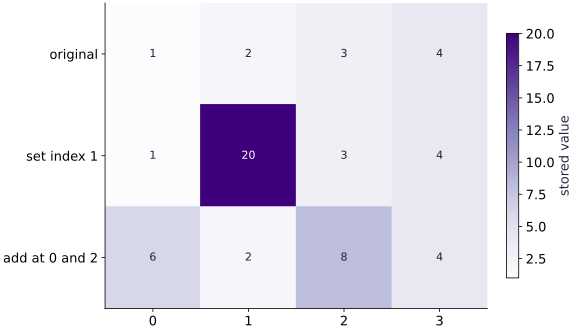

# Immutable updates and indexing

Phase 01: Arrays & pure functions · about 45 minutes · CPU

## What you will be able to do

- Predict the values returned by functional indexed set and add.
- Distinguish array-value semantics from Python name rebinding and compiler storage choices.
- Accumulate repeated-index contributions with an explicit integer reference.
- Choose a fixed-shape mask when output shape must remain stable.

## The problem

You want to replace a few array entries, but JAX rejects the NumPy-style assignment. The key idea is small: describe the new array value, then keep the result. We’ll try replacement and addition, check that the original value is still available, and see what happens when an index appears more than once.

## The idea

An indexed update in JAX returns an array value. This makes the relationship between old and new state explicit: the caller chooses which result to keep. The programming model describes values; compiler decisions about physical memory reuse are a separate issue.

## Separate a new value from a new physical buffer

Start with $[2,4,6]$. Setting the middle entry to $10$ produces $[2,10,6]$. Adding $10$ at that position produces $[2,14,6]$. Both operations begin from the same original values; the second is not automatically applied to the result of the first.

Draw two arrows from the original array, one labeled set and one labeled add. If you want sequential updates, explicitly feed the first result into the second operation. This is the same state-flow idea we will use in optimization and recurrent loops.

Do not infer allocation cost from that drawing. A compiler may reuse storage when it can preserve the program's semantics. First verify old/new values and duplicate-index behavior for the operation you use, then measure memory behavior separately.

### Pause and reason

You call an indexed update but keep using the original variable. Why might later predictions be unchanged?

<details><summary>Compare your reasoning</summary>

The returned updated value was discarded. Assign or pass that result into the next computation; do not expect the original array value to mutate.

</details>

## A Python name and an array value are different

After `y = x.at[1].set(20)`, $x$ still denotes the original array and $y$ denotes the updated value. After `x = x.at[1].set(20)`, the Python name $x$ is rebound to the new value. That spelling does not retroactively change another name holding the original value.

Keep `original = x` before an update when you want a reference for tests. Comparing original and updated makes the semantics visible. Repeatedly inspecting only the newly rebound name can make a functional update look like mutation even though the old value still exists.

## Set replaces; add accumulates

Replacing an entry means its old value no longer contributes at that position in the result. Adding a contribution means the old value remains and the contribution is combined with it. Use set for a known replacement and add for a scatter-like accumulation.

Repeated indices need particular care. With add, contributions to the same index are accumulated; their floating-point order may not be guaranteed. With conflicting set values for the same index, do not assume a portable last-write-wins order. Choose unique indices when you need deterministic replacement semantics and test duplicate accumulation with exact small integers before studying floating-point ordering.

## Choose a mask when you want to keep the shape

Selecting $x$[$x$ > threshold] extracts a variable number of elements: its output length depends on values. A masked replacement, `jnp.where(x > threshold, x, 0)`, keeps the original shape. They are different calculations even if both are described casually as filtering.

A fixed-shape representation is useful for staged computation. Later lessons will explain why value-dependent output lengths can fail under jit. Decide whether downstream code expects compacted selected data or an array with masked entries before choosing the operation.

## Make the index domain part of the contract

Our examples use explicit in-bounds integer indices and ordinary slices. Indexing behavior at out-of-bounds positions is not a substitute for validating bad input. Negative indexing, duplicate indices, masks, and scatter modes all need deliberate interpretation in a real data pipeline.

A small update test should verify unchanged positions as well as changed positions. Testing only the new value at one index could miss an unintended broadcast across a slice or a mistaken axis in a matrix.

## Carry functional updates into training state

A model update is a larger version of the same idea: parameters and gradients produce new parameters. The caller retains or checkpoints state. Functional indexed operations let you describe a selective change without mutating an old array value.

This lesson prepares you to reason about optimizer and simulation state. It does not establish memory efficiency or a training algorithm; those require broader computations and measurements.

## Run the example

```python
import jax.numpy as jnp
x = jnp.array([1., 2., 3., 4.])
y = x.at[1].set(20.)
z = x.at[jnp.array([0, 2])].add(5.)
print("Original:", x)
print("Set:", y)
print("Add:", z)
assert jnp.allclose(x, jnp.array([1.,2.,3.,4.]))
assert jnp.allclose(y, jnp.array([1.,20.,3.,4.]))
assert jnp.allclose(z, jnp.array([6.,2.,8.,4.]))
```

Expected: Original: $[1., 2., 3., 4.]$; Set: $[1., 20., 3., 4.]$; Add: $[6., 2., 8., 4.]$.

## An update returns a new array

**Predict:** Which cells change after set, and which after add?



**Recorded CPU computation**

### Read the figure

Columns are array indices. The top row is the original array, and each lower row is a separate result created from that original. The cell colors encode stored values; the dark cell containing $20$ makes the replacement easy to locate.

The middle row replaces only index $1$: $(1,2,3,4)$ becomes $(1,20,3,4)$. The bottom row instead adds $5$ at indices $0$ and $2$, giving $(6,2,8,4)$.

### Connect it to the computation

The bottom row still contains $2$ at index $1$. This is the visual clue that the two updates branch from the original; the second operation did not continue from the middle row. In both cases, the top row remains unchanged.

An immutable update returns a new value. To make changes accumulate, pass the returned array into the next update. If these operations were chained, the final array would be $(6,20,8,4)$, which is deliberately not the bottom row shown here.

```python
visual_data = {'kind': 'heatmap', 'values': jnp.stack([x, y, z]).tolist(), 'rows': ['original', 'set index 1', 'add at 0 and 2'], 'columns': ['0', '1', '2', '3'], 'unit': 'stored value'}
```

## Recorded reference execution

CPU run: 2026-10-06T22:58:27.227878+00:00. JAX 0.9.2.

```text
Original: [1. 2. 3. 4.]
Set: [ 1. 20.  3.  4.]
Add: [6. 2. 8. 4.]
PASS: arrays-04

```

## See name rebinding without old-value mutation

**Predict before running:** If two names point at the original array and one name is rebound, which values remain available?

```python
original = x
rebound = x
rebound = rebound.at[1].set(20.)
assert jnp.allclose(original, jnp.array([1., 2., 3., 4.]))
assert jnp.allclose(rebound, jnp.array([1., 20., 3., 4.]))
ignored = x.at[0].set(99.)
assert jnp.allclose(x, original)
assert float(ignored[0]) == 99.
```

**Expected:** The original remains $[1, 2, 3, 4]$; rebound and ignored hold separate returned values.

Assigning a result changes the binding, while ignoring a result leaves the caller using the old value.

## Accumulate repeated integer contributions

**Predict before running:** Predict the total at index $1$ after adding contributions $2$ and $3$ there. What differs from replacement?

```python
import numpy as np
indices = jnp.array([1, 1, 3])
contributions = jnp.array([2, 3, 7], dtype=jnp.int32)
base_counts = jnp.zeros(4, dtype=jnp.int32)
counts = base_counts.at[indices].add(contributions)
reference_counts = np.zeros(4, dtype=np.int32)
for index, contribution in zip([1, 1, 3], [2, 3, 7]):
    reference_counts[index] += contribution
assert jnp.array_equal(counts, reference_counts)
assert jnp.array_equal(counts, jnp.array([0, 5, 0, 7]))
assert jnp.array_equal(base_counts, jnp.zeros(4, dtype=jnp.int32))
```

**Expected:** The counts are $[0, 5, 0, 7]$; repeated index $1$ receives both contributions.

The integer loop reference makes accumulation explicit. It avoids asserting a floating-point reduction order or conflicting-set behavior.

## Make it yours

Replace the last two elements with zero in a new array. Keep $x$ unchanged.

<details><summary>Reference solution</summary>

```python
masked = x.at[2:].set(0.)
assert jnp.allclose(masked, jnp.array([1.,2.,0.,0.]))
assert jnp.allclose(x, jnp.array([1.,2.,3.,4.]))
```

</details>

## Replace a region of a matrix

**Practice**

Create a $(3, 3)$ matrix containing $0$ through $8$. Set its final column to $-1$ in a returned value. Verify the whole result and original matrix.

<details><summary>Hint</summary>

The slice [:, $-1$] selects every row and the last column. A scalar replacement broadcasts across that slice.

</details>

<details><summary>Reference solution and reasoning</summary>

```python
matrix = jnp.arange(9, dtype=jnp.float32).reshape(3, 3)
updated_matrix = matrix.at[:, -1].set(-1.)
assert jnp.allclose(updated_matrix, jnp.array([[0., 1., -1.], [3., 4., -1.], [6., 7., -1.]]))
assert jnp.allclose(matrix, jnp.arange(9).reshape(3, 3))
```

Checking the entire matrix verifies both changed and unchanged positions; preserving the original checks the update contract.

</details>

## Keep shape while masking values

**Challenge**

Keep only values greater than $2$ from $x$, replacing other positions with zero. Compare with compact selection and explain the shape difference.

<details><summary>Hint</summary>

Use where for the fixed-shape result. Boolean indexing produces selected values, not a shape-preserving mask.

</details>

<details><summary>Reference solution and reasoning</summary>

```python
fixed_shape = jnp.where(x > 2., x, 0.)
selected = x[x > 2.]
assert fixed_shape.shape == (4,)
assert selected.shape == (2,)
assert jnp.allclose(fixed_shape, jnp.array([0., 0., 3., 4.]))
assert jnp.allclose(selected, jnp.array([3., 4.]))
```

Both are useful representations, but they are not interchangeable. The expected downstream shape determines which is appropriate.

</details>

## Check your understanding

After `y = x.at[1].set(20.)`, what happens to $x$?

1. Its second element becomes $20$
2. Its value remains unchanged
3. It becomes a Python list

<details><summary>Answer and explanation</summary>

Its value remains unchanged

The expression returns the updated value. Assign it to a name to keep it; $x$ retains its original value.

</details>

## Diagnose the result

If nothing changes, check whether the returned update was discarded. If old values seem changed, distinguish name rebinding from mutation and inspect mutable containers around the array. If duplicate replacements are surprising, do not assume last-write-wins order; use an explicit unique-index policy. If a mask later fails under jit, inspect whether its output length depends on runtime values.

## Carry forward

- Indexed updates return values; retaining them is the caller’s responsibility.
- Name rebinding and mutation are different operations.
- Repeated-index add accumulates contributions, while conflicting set needs a deliberate policy.
- A shape-preserving mask and compact selection express different computations.

## Keep your evidence

Keep original and updated arrays, a repeated-index integer reference, the whole-matrix replacement check, and compact-versus-fixed-shape outputs. Explain replacement, accumulation, and name rebinding.

Keep predictions, modified code, observed results, and reasoning. A checkpoint alone does not demonstrate the exercise.

## Primary references

- [JAX: indexed update API](https://docs.jax.dev/en/latest/_autosummary/jax.numpy.ndarray.at.html)
- [JAX: immutability and array updates](https://docs.jax.dev/en/latest/notebooks/Common_Gotchas_in_JAX.html#in-place-updates)

