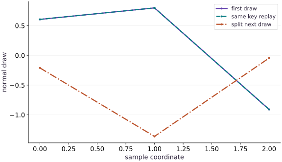

# Random keys without surprises

Phase 03: State, randomness & control flow · about 60 minutes · CPU

## What you will be able to do

- Treat a key as an explicit input
- Carry the continuation key explicitly
- Separate replay from a statistical claim
- Allocate randomness by sample identity

## The problem

You saved the seed, yet your simulation repeats exactly the same noise at every step. Let’s follow the random key. In JAX, using a key again repeats the same draw; splitting it gives you keys for separate draws. We’ll practice both deliberate replay and fresh sampling before adding randomness to a training loop.

## The idea

A random sampler in JAX receives an explicit key. Reusing the same key with the same sampler repeats the same computation. Splitting gives us separately owned keys, so the program can show which operation receives which randomness.

## A key is an input, not a moving cursor

Imagine a training step that needs dropout randomness and a key for the next step. Split the incoming key, use one child for dropout, and return the other as the continuation key. The drawing should branch once; it should not show a sampler secretly advancing the parent key.

If two augmentation calls receive the same key and otherwise identical inputs, they can produce the same augmentation. Different variable names do not make the underlying key values different. This is a data-flow bug that ordinary shape checks will miss.

For recovery, save the continuation key at the same boundary as model and data position. Reconstructing an initial seed and restarting the random stream is not equivalent to restoring the next key after many training steps.

### Pause and reason

Does calling a sampler consume or mutate the key variable?

<details><summary>Compare your reasoning</summary>

No. The key is an explicit value. Your program must choose new child keys and carry the next key forward; otherwise repeated calls can replay the same sample.

</details>

## Treat a key as an explicit input

A JAX random operation is deterministic given its key and other arguments. The key is not a mutable generator that automatically advances after a call. Calling normal twice with the same key, shape and dtype reproduces the draw. That property is useful for replay and dangerous when accidental reuse makes samples correlated.

A seed is only the initial description of an experiment. Splitting describes where subsequent random choices come from. Write down which function owns the continuation key and which subkey is consumed by a draw. Do not pass one subkey to two independent components.

```text
seed → root key
root key --split--> continuation key + sample key
sample key --normal(shape=(3,))--> one sample
```

## Carry the continuation key explicitly

In the worked program, `key, sample_key = split(key)` replaces the variable key with a continuation value. The old key was not mutated; Python rebound a name. sample_key belongs to the immediate draw. The next split uses the retained continuation, not sample_key.

This convention gives each training or simulation step a small state transition: receive key → split → sample → return next key. Later, checkpoints need to store that next key alongside model and optimizer state. Storing parameters alone cannot reproduce the next random batch.

## Separate replay from a statistical claim

For this fixed seed, fresh subkeys produce visibly different draws. That observation is not proof of statistical independence, and different random draws can theoretically coincide. Equality of a single pair is therefore not a general test of randomness quality.

The reliable replay test is to reconstruct the same program from the same seed and compare its results. A change to key allocation can alter all later samples. Do not promise identical streams across arbitrary JAX versions, PRNG implementations, shapes or devices.

## Allocate randomness by sample identity

Splitting a root into four keys is useful for one fixed batch. If the batch membership changes, assignment by position may associate a different draw with a particular sample. fold_in lets you combine a stable integer identity with a base key, which can make per-example randomness stable under reordering.

Keep identifiers unique where distinct randomness is intended. Reusing an identifier repeats its derived key. This is deterministic bookkeeping, not a security primitive or a substitute for recording the PRNG implementation.

## Prepare the inputs

Create main.py in your lesson workspace. Add this first block; use the environment from setup.

```python
# Step 1 — Prepare the inputs: These explicit inputs define the case that the later checks will...
# Import jax for this computation.
import jax
import jax.numpy as jnp
```

These explicit inputs define the case that the later checks will verify.

## Build the computation

Append this block below the inputs in the same file.

```python
# Step 2 — Build the computation: random.split returns two new keys.
# Create or split explicit PRNG key(s) (`key`) for reproducible randomness.
key = jax.random.key(42)
# Create or split explicit PRNG key(s) (`(key, sample_key)`) for reproducible randomness.
key, sample_key = jax.random.split(key)
# Sample deterministic random values into `a` using an explicit PRNG key.
a = jax.random.normal(sample_key, (3,))
# Sample deterministic random values into `repeated` using an explicit PRNG key.
repeated = jax.random.normal(sample_key, (3,))
# Create or split explicit PRNG key(s) (`(key, next_key)`) for reproducible randomness.
key, next_key = jax.random.split(key)
# Sample deterministic random values into `b` using an explicit PRNG key.
b = jax.random.normal(next_key, (3,))
```

random.split returns two new keys. noise_step returns the continuation key as part of its result so the caller can use fresh noise on the next transition.

## Run and check the result

Append the checks, save main.py, and run python main.py from this folder using your course environment.

```python
# Step 3 — Run and check the result: Compare the output to the expected result below before making the...
# Print the observed values to compare against the expected result.
print("Replay equal:", bool(jnp.array_equal(a, repeated)))
# Print diagnostic summary of the computed outputs.
print("Fresh draw equal:", bool(jnp.array_equal(a, b)))
# Verify contract: `jnp.array_equal(a, repeated)`.
assert jnp.array_equal(a, repeated)
# Verify that the output satisfies the expected shape, finite-value, or numerical contract.
assert not jnp.array_equal(a, b)
```

Compare the output to the expected result below before making the exercise change.

## Run the example

```python
# Step 1 — Prepare the inputs: These explicit inputs define the case that the later checks will...
# Import jax for this computation.
import jax
import jax.numpy as jnp
# Step 2 — Build the computation: random.split returns two new keys.
# Create or split explicit PRNG key(s) (`key`) for reproducible randomness.
key = jax.random.key(42)
# Create or split explicit PRNG key(s) (`(key, sample_key)`) for reproducible randomness.
key, sample_key = jax.random.split(key)
# Sample deterministic random values into `a` using an explicit PRNG key.
a = jax.random.normal(sample_key, (3,))
# Sample deterministic random values into `repeated` using an explicit PRNG key.
repeated = jax.random.normal(sample_key, (3,))
# Create or split explicit PRNG key(s) (`(key, next_key)`) for reproducible randomness.
key, next_key = jax.random.split(key)
# Sample deterministic random values into `b` using an explicit PRNG key.
b = jax.random.normal(next_key, (3,))
# Step 3 — Run and check the result: Compare the output to the expected result below before making the...
# Print the observed values to compare against the expected result.
print("Replay equal:", bool(jnp.array_equal(a, repeated)))
# Print diagnostic summary of the computed outputs.
print("Fresh draw equal:", bool(jnp.array_equal(a, b)))
# Verify contract: `jnp.array_equal(a, repeated)`.
assert jnp.array_equal(a, repeated)
# Verify that the output satisfies the expected shape, finite-value, or numerical contract.
assert not jnp.array_equal(a, b)
```

Expected: Replay equal: True; Fresh draw equal: False.

## Reused keys replay the same sample

**Predict:** Will a repeated draw lie on top of the original?



**Recorded CPU computation**

### Read the figure

The horizontal axis selects a coordinate within a three-element random draw; the vertical axis gives its sampled value. The solid first-draw line and dashed same-key replay line lie on top of each other. The dash-dot line comes from a new split key.

The replay repeats approximately $(0.606,0.799,-0.909)$, while the split-key draw is approximately $(-0.211,-1.363,-0.045)$. Two curves are hard to distinguish precisely because their coordinates are equal.

### Connect it to the computation

A JAX random function is deterministic given the same key and arguments. Calling it again with that key replays the result; it does not silently advance a hidden random state. Splitting produces a new key for a new draw.

The lines only connect coordinates to make equality visible. This is not a time series or a probability density, and three different values cannot establish statistical independence. The practical check is reproducibility: reuse for deliberate replay, split for the next stochastic operation.

```python
# Compute figure data for: Reused keys replay the same sample
# Evaluate `visual_data` from the current inputs and state.
visual_data = {'kind': 'line', 'x': [0, 1, 2], 'xlabel': 'sample coordinate', 'ylabel': 'normal draw', 'series': [{'label': 'first draw', 'y': a.tolist()}, {'label': 'same key replay', 'y': repeated.tolist()}, {'label': 'split next draw', 'y': b.tolist()}]}
```

## Recorded reference execution

CPU run: 2026-10-08T14:01:36.463793+00:00. JAX 0.9.2.

```text
Replay equal: True
Fresh draw equal: False
Replay equal: True
Fresh draw equal: False
PASS: state-01

```

## Implement one random state transition

**Predict before running:** Predict which part of the return value must be reused for the next draw.

```python
# Experiment — Implement one random state transition: Replay compares complete state transitions.
def noise_step(key):
    # Create or split explicit PRNG key(s) (`(next_key, draw_key)`) for reproducible randomness.
    next_key,draw_key=jax.random.split(key)
    # Return `(next_key, jax.random.normal(draw_key, (2,)))` to the caller.
    return next_key,jax.random.normal(draw_key,(2,))
# Create or split explicit PRNG key(s) (`root`) for reproducible randomness.
root=jax.random.key(9)
# Run `noise_step` to compute `(k1, n1)`.
k1,n1=noise_step(root)
# Run `noise_step` to compute `(k2, n2)`.
k2,n2=noise_step(k1)
# Create or split explicit PRNG key(s) (`(r1, replay1)`) for reproducible randomness.
r1,replay1=noise_step(jax.random.key(9))
# Run `noise_step` to compute `(r2, replay2)`.
r2,replay2=noise_step(r1)
# Verify contract: `jnp.array_equal(n1, replay1) and jnp.array_equal(n2, replay2)`.
assert jnp.array_equal(n1,replay1) and jnp.array_equal(n2,replay2)
# Verify that the output satisfies the expected shape, finite-value, or numerical contract.
assert jnp.array_equal(jax.random.key_data(k2),jax.random.key_data(r2))
```

**Expected:** Reconstructing the two steps reproduces both samples and the continuation key.

Replay compares complete state transitions. It catches lost continuation state, not only a repeated final number.

## Keep identity under reordering

**Predict before running:** If examples $3$ and $8$ swap order, should their identity-derived noise swap too?

```python
# Experiment — Keep identity under reordering: fold_in makes the assignment explicit.
# Create or split explicit PRNG key(s) (`base`) for reproducible randomness.
base=jax.random.key(11)
# Function `by_id(ids)` implementing this stage's computation:
def by_id(ids):
    # Return `jax.vmap(lambda i: jax.random.normal(jax.random.fold_in(base, i), ()))(ids)` to the caller.
    return jax.vmap(lambda i:jax.random.normal(jax.random.fold_in(base,i),()))(ids)
# Initialize array `forward` with explicit values and shape.
forward=by_id(jnp.array([3,8]))
# Initialize array `reverse` with explicit values and shape.
reverse=by_id(jnp.array([8,3]))
# Verify contract: `jnp.array_equal(forward, reverse[::-1])`.
assert jnp.array_equal(forward,reverse[::-1])
```

**Expected:** Noise follows the identifiers, not their batch positions.

fold_in makes the assignment explicit. Repeated IDs would deliberately reproduce a draw.

## Make it yours

Split a fresh seed into four keys, then use vmap to draw two normal values from each. Replay from the seed and compare.

### How to write this exercise — Step-by-step recipe & starter scaffold

**Key functions & syntax to use:**
- `jax.vmap(fn, in_axes=..., out_axes=...)` — Vectorizes a single-example function across a batch axis without writing a Python loop.
- `jax.random.PRNGKey(seed) & jax.random.split(key)` — Manages explicit, stateless PRNG keys—always split a key before passing subkeys into independent random draws.

**Step-by-step implementation plan:**
1. Create or split explicit PRNG key(s) (`keys`) for reproducible randomness.
2. Return `jax.vmap(lambda k: jax.random.normal(k, (2,)))(keys)` to the caller.
3. Verify that the output tensor shape matches our prediction.
4. Verify that the output satisfies the expected shape, finite-value, or numerical contract.

**Starter code scaffold (fill in the TODOs):**

```python
# Exercise solution: Split a fresh seed into four keys, then use vmap to draw two normal...
def draw(seed):
    # Create or split explicit PRNG key(s) (`keys`) for reproducible randomness.
    keys = jax.random.split(...)  # TODO: compute keys
    # Return `jax.vmap(lambda k: jax.random.normal(k, (2,)))(keys)` to the caller.
    return ...  # TODO: return computed result
# Verify that the output tensor shape matches our prediction.
assert draw(7).shape  # TODO: complete assertion check
# Verify that the output satisfies the expected shape, finite-value, or numerical contract.
assert jnp.array_equal(draw(7), draw(7))  # TODO: complete assertion check
```

<details><summary>Reference solution</summary>

```python
# Exercise solution: Split a fresh seed into four keys, then use vmap to draw two normal...
def draw(seed):
    # Create or split explicit PRNG key(s) (`keys`) for reproducible randomness.
    keys = jax.random.split(jax.random.key(seed), 4)
    # Return `jax.vmap(lambda k: jax.random.normal(k, (2,)))(keys)` to the caller.
    return jax.vmap(lambda k: jax.random.normal(k, (2,)))(keys)
# Verify that the output tensor shape matches our prediction.
assert draw(7).shape == (4, 2)
# Verify that the output satisfies the expected shape, finite-value, or numerical contract.
assert jnp.array_equal(draw(7), draw(7))
```

</details>

## Replay a noisy prediction

**Practice**

Draw one noise value per example for prediction $2x+1$. Reconstruct the same batch from the seed, then change only $x$.

<details><summary>Hint</summary>

Reuse the random construction for a controlled comparison, not accidentally across independent training steps.

</details>

### How to write: Replay a noisy prediction — Step-by-step recipe & starter scaffold

**Key functions & syntax to use:**
- `jnp.array(values, dtype=...)` — Constructs an immutable device-backed JAX array from Python/NumPy values.
- `jnp.allclose(actual, expected, rtol=..., atol=...)` — Checks that two arrays match elementwise within floating-point tolerance.
- `jax.random.PRNGKey(seed) & jax.random.split(key)` — Manages explicit, stateless PRNG keys—always split a key before passing subkeys into independent random draws.

**Step-by-step implementation plan:**
1. Create or split explicit PRNG key(s) (`eps`) for reproducible randomness.
2. Return `2 * x + 1 + eps` to the caller.
3. Initialize array `inputs` with explicit values and shape.
4. Verify contract: `jnp.array_equal(noisy_prediction(4, inputs), noisy_prediction(4, inp...`.
5. Verify that the output satisfies the expected shape, finite-value, or numerical contract.

**Starter code scaffold (fill in the TODOs):**

```python
# Replay a noisy prediction (Practice): Holding noise fixed isolates the changed numerical input.
def noisy_prediction(seed,x):
    # Create or split explicit PRNG key(s) (`eps`) for reproducible randomness.
    eps = jax.random.normal(...)  # TODO: compute eps
    # Return `2 * x + 1 + eps` to the caller.
    return ...  # TODO: return computed result
# Initialize array `inputs` with explicit values and shape.
inputs = jnp.array(...)  # TODO: compute inputs
# Verify contract: `jnp.array_equal(noisy_prediction(4, inputs), noisy_prediction(4, inp...`.
assert jnp.array_equal(noisy_prediction(4,inputs),noisy_prediction(4,inputs))  # TODO: complete assertion check
# Verify that the output satisfies the expected shape, finite-value, or numerical contract.
assert jnp.allclose(noisy_prediction(4,inputs+1)-noisy_prediction(4,inputs),2.,atol=1e-6)  # TODO: complete assertion check
```

<details><summary>Reference solution and reasoning</summary>

```python
# Replay a noisy prediction (Practice): Holding noise fixed isolates the changed numerical input.
def noisy_prediction(seed,x):
    # Create or split explicit PRNG key(s) (`eps`) for reproducible randomness.
    eps=jax.random.normal(jax.random.key(seed),x.shape)
    # Return `2 * x + 1 + eps` to the caller.
    return 2*x+1+eps
# Initialize array `inputs` with explicit values and shape.
inputs=jnp.array([0.,1.,2.])
# Verify contract: `jnp.array_equal(noisy_prediction(4, inputs), noisy_prediction(4, inp...`.
assert jnp.array_equal(noisy_prediction(4,inputs),noisy_prediction(4,inputs))
# Verify that the output satisfies the expected shape, finite-value, or numerical contract.
assert jnp.allclose(noisy_prediction(4,inputs+1)-noisy_prediction(4,inputs),2.,atol=1e-6)
```

Holding noise fixed isolates the changed numerical input. That is a deliberately coupled experiment.

</details>

## Diagnose key reuse in a loop

**Challenge**

Write the broken loop that draws with one key three times, demonstrate repeated rows, then repair it by threading the continuation.

<details><summary>Hint</summary>

The draw function does not mutate the key.

</details>

### How to write: Diagnose key reuse in a loop — Step-by-step recipe & starter scaffold

**Key functions & syntax to use:**
- `jax.random.PRNGKey(seed) & jax.random.split(key)` — Manages explicit, stateless PRNG keys—always split a key before passing subkeys into independent random draws.

**Step-by-step implementation plan:**
1. Create or split explicit PRNG key(s) (`root`) for reproducible randomness.
2. Sample deterministic random values into `broken` using an explicit PRNG key.
3. Verify contract: `jnp.array_equal(broken[0], broken[1])`.
4. Evaluate `current` from the current inputs and state.
5. Evaluate `rows` from the current inputs and state.

**Starter code scaffold (fill in the TODOs):**

```python
# Diagnose key reuse in a loop (Challenge): The repeated-row symptom comes from key allocation.
# Create or split explicit PRNG key(s) (`root`) for reproducible randomness.
root = jax.random.key(...)  # TODO: compute root
# Sample deterministic random values into `broken` using an explicit PRNG key.
broken = jnp.stack(...)  # TODO: compute broken
# Verify contract: `jnp.array_equal(broken[0], broken[1])`.
assert jnp.array_equal(broken[0],broken[1])  # TODO: complete assertion check
# Evaluate `current` from the current inputs and state.
current = ...  # TODO: compute current
# Evaluate `rows` from the current inputs and state.
rows = ...  # TODO: compute rows
# Repeat the update loop over `range(3)` steps:
for _ in range(3):
    # Run `noise_step` to compute `(current, noise)`.
    current,noise = noise_step(...)  # TODO: compute current,noise
    # Append the current step result to `rows`.
    rows.append(noise)
# Combine or mask array elements to form `fixed`.
fixed = jnp.stack(...)  # TODO: compute fixed
# Verify that the output tensor shape matches our prediction.
assert fixed.shape  # TODO: complete assertion check
# Verify that the output satisfies the expected shape, finite-value, or numerical contract.
assert not jnp.array_equal(fixed[0],fixed[1])  # TODO: complete assertion check
```

<details><summary>Reference solution and reasoning</summary>

```python
# Diagnose key reuse in a loop (Challenge): The repeated-row symptom comes from key allocation.
# Create or split explicit PRNG key(s) (`root`) for reproducible randomness.
root=jax.random.key(5)
# Sample deterministic random values into `broken` using an explicit PRNG key.
broken=jnp.stack([jax.random.normal(root,(2,)) for _ in range(3)])
# Verify contract: `jnp.array_equal(broken[0], broken[1])`.
assert jnp.array_equal(broken[0],broken[1])
# Evaluate `current` from the current inputs and state.
current=root
# Evaluate `rows` from the current inputs and state.
rows=[]
# Repeat the update loop over `range(3)` steps:
for _ in range(3):
    # Run `noise_step` to compute `(current, noise)`.
    current,noise=noise_step(current)
    # Append the current step result to `rows`.
    rows.append(noise)
# Combine or mask array elements to form `fixed`.
fixed=jnp.stack(rows)
# Verify that the output tensor shape matches our prediction.
assert fixed.shape==(3,2)
# Verify that the output satisfies the expected shape, finite-value, or numerical contract.
assert not jnp.array_equal(fixed[0],fixed[1])
```

The repeated-row symptom comes from key allocation. The last inequality checks this fixed demonstration, not every possible random stream.

</details>

## Check your understanding

What happens if the same key is used twice for the same random operation?

1. The generator automatically advances
2. The same sample is reproduced
3. JAX guarantees an exception

<details><summary>Answer and explanation</summary>

The same sample is reproduced

Keys are explicit immutable inputs. Identical inputs reproduce the draw; split keys to describe independent randomness.

</details>

## Diagnose the result

The repeated-row symptom comes from key allocation. The last inequality checks this fixed demonstration, not every possible random stream.

## Carry forward

- Replay compares complete state transitions. It catches lost continuation state, not only a repeated final number.
- fold_in makes the assignment explicit. Repeated IDs would deliberately reproduce a draw.

## Keep your evidence

Keep a key-ownership tree, two-step replay including the final key, the per-ID reorder check, and the broken/repaired repeated-noise loop.

Save your predictions, modified code, terminal outputs, and reasoning in your engineering portfolio.

## Primary references

- [JAX pseudorandom numbers](https://docs.jax.dev/en/latest/101/random.html)

