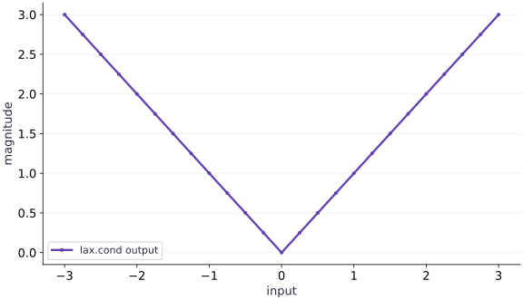

# Branches with lax.cond

Phase 03: State, randomness & control flow · about 60 minutes · CPU

## What you will be able to do

- Locate the decision boundary
- Trace both branches and check their result types
- Choose cond or where by the shape of the question
- Inspect boundary behavior and derivatives

## The problem

A Python branch can choose a path when it knows a value. Inside jit, that value may not be available yet. We’ll use lax.cond to make the choice at runtime, check what both branches must return, and compare a single decision with elementwise selection.

## The idea

A data-dependent branch needs a control-flow operation that can represent both alternatives in a transformed program. With a scalar predicate, `lax.cond` selects the result of one branch while requiring compatible result structures from both.

## Trace both possibilities, execute the selected rule

Consider an absolute-value rule: return the input when it is nonnegative and its negation otherwise. Both branches return the same shape and dtype, even though only one scalar case determines a particular result. The function is continuous at zero, but its mathematical derivative is not uniquely defined there.

The plot of magnitudes shows what the branch computes, not the tracing process. During tracing, Python code in both branch functions can be visited. Avoid using Python side effects as evidence that one numerical branch executed on the device.

After batching or other transformations, the implementation of control flow can change; for example, batching a conditional can turn it into selection. Keep claims about execution scope tied to the actual transformed program.

$$
\mathcal{T} = (\text{Leaves}(\mathcal{T}),\; \text{TreeDef}(\mathcal{T})), \qquad \operatorname{map}(g, \mathcal{T})_k = g(\mathcal{T}_k)
$$

### Pause and reason

Can one branch return a vector and the other a scalar if your current input only selects the vector?

<details><summary>Compare your reasoning</summary>

Not under the same conditional result contract. Both branches must produce compatible structures, shapes and dtypes so the transformed program has a well-defined result.

</details>

## Locate the decision boundary

The predicate $x\ge0$ is numerical data when $x$ is a traced argument. A Python if must choose a branch while tracing, before that runtime value is available. lax.cond represents the choice inside the staged computation instead.

Its arguments are a scalar Boolean predicate, two pure branch functions and an operand. Each branch receives that operand; each must return the same kind of result. Read the contract as an ordinary state transition with two possible implementations, not as a magic exception to tracing.

```text
predicate: x>=0
true:  operand x → x
false: operand x → −x
joined result: scalar float
```

## Trace both branches and check their result types

For a scalar predicate, cond selects one branch at runtime, but both branches are traced when building the computation. Therefore an invalid operation in a branch can fail during tracing even if a particular test input would not choose it.

Both result pytrees must agree and corresponding array leaves must have compatible shapes and dtypes. A scalar in one branch and a vector in the other cannot be joined by this contract. This is different from numerical correctness: matching output types can still hide a wrong branch formula.

## Choose cond or where by the shape of the question

cond makes one scalar decision for a computation. where chooses values elementwise from compatible arrays. A vector predicate naturally belongs to where or a deliberately batched conditional.

When cond is transformed with vmap over predicates, it can become selection. Do not use a branch as a promise that side effects or invalid arithmetic will never be evaluated under transformations. Keep functions pure and design numerical expressions that are valid in the relevant domain.

## Inspect boundary behavior and derivatives

Our magnitude function equals absolute value. Away from zero its derivative is +$1$ for positive inputs and $-1$ for negative inputs. At zero the mathematical function is not differentiable; a selected branch rule is a convention rather than proof of a derivative.

Test negative, positive and exact-boundary inputs because a `>` versus `>=` change can alter boundary behavior in other functions. Keep a separate argument about mathematical smoothness when differentiating conditional computations.

## Prepare the inputs

Create main.py in your lesson workspace. Add this first block; use the environment from setup.

```python
# Step 1 — Prepare the inputs: These explicit inputs define the case that the later checks will...
# Import jax for this computation.
import jax
import jax.numpy as jnp
```

These explicit inputs define the case that the later checks will verify.

## Build the computation

Append this block below the inputs in the same file.

```python
# Step 2 — Build the computation: Both branches return the same scalar type.
# Define and JIT-compile `magnitude(x)` so XLA traces and fuses the operations:
@jax.jit
# Function `magnitude(x)` implementing this stage's computation:
def magnitude(x):
    # Return `jax.lax.cond(x >= 0.0, lambda v: v, lambda v: -v, x)` to the caller.
    return jax.lax.cond(x >= 0., lambda v: v, lambda v: -v, x)
```

Both branches return the same scalar type. cond takes the runtime predicate and passes $x$ to the selected numerical branch.

## Run and check the result

Append the checks, save main.py, and run python main.py from this folder using your course environment.

```python
# Step 3 — Run and check the result: Compare the output to the expected result below before making the...
# Print the observed values to compare against the expected result.
print(float(magnitude(-3.)))
# Verify that the numerical values match the expected reference within tolerance.
assert jnp.allclose(magnitude(-3.), 3.)
# Check numerical equivalence within tolerance: `jnp.allclose(magnitude(2.), 2.)`
assert jnp.allclose(magnitude(2.), 2.)
```

Compare the output to the expected result below before making the exercise change.

## Run the example

```python
# Step 1 — Prepare the inputs: These explicit inputs define the case that the later checks will...
# Import jax for this computation.
import jax
import jax.numpy as jnp
# Step 2 — Build the computation: Both branches return the same scalar type.
# Define and JIT-compile `magnitude(x)` so XLA traces and fuses the operations:
@jax.jit
# Function `magnitude(x)` implementing this stage's computation:
def magnitude(x):
    # Return `jax.lax.cond(x >= 0.0, lambda v: v, lambda v: -v, x)` to the caller.
    return jax.lax.cond(x >= 0., lambda v: v, lambda v: -v, x)
# Step 3 — Run and check the result: Compare the output to the expected result below before making the...
# Print the observed values to compare against the expected result.
print(float(magnitude(-3.)))
# Verify that the numerical values match the expected reference within tolerance.
assert jnp.allclose(magnitude(-3.), 3.)
# Check numerical equivalence within tolerance: `jnp.allclose(magnitude(2.), 2.)`
assert jnp.allclose(magnitude(2.), 2.)
```

Expected: $3.0$

## Both branches form one magnitude function

**Predict:** What happens on each side of zero?



**Recorded CPU computation**

### Read the figure

The horizontal axis varies the input and the vertical axis gives the returned magnitude. The V-shaped line passes through $(-3,3)$, $(0,0)$, and $(3,3)$. Equal distances to the left and right of zero produce equal outputs.

The left arm comes from negating a negative input. The right arm comes from returning a nonnegative input unchanged. At zero the two values meet, so there is no jump in the output.

### Connect it to the computation

The branches together implement $|x|$. Moving right along the negative side decreases the result with slope $-1$; moving right along the positive side increases it with slope $1$. The sharp corner records that change of rule.

Continuity at the join does not imply differentiability: the classical derivative is undefined at zero because the two slopes disagree. A branch-selected autodiff value there must not be confused with a derivative of a smooth curve. The picture helps separate correct branch outputs from assumptions about gradients.

```python
# Compute figure data for: Both branches form one magnitude function
# Generate a uniform grid of points in `grid`.
grid = jnp.linspace(-3.0, 3.0, 25)
# Vectorize across the batch dimension without a Python loop (`visual_data`).
visual_data = {'kind': 'line', 'x': grid.tolist(), 'xlabel': 'input', 'ylabel': 'magnitude', 'series': [{'label': 'lax.cond output', 'y': jax.vmap(magnitude)(grid).tolist()}]}
```

## Recorded reference execution

CPU run: 2026-10-08T14:01:44.478527+00:00. JAX 0.9.2.

```text
3.0
3.0
Expected traced Python Boolean failure
Expected branch shape mismatch
PASS: state-04

```

## Reproduce the Python truth-test failure

**Predict before running:** Why does eager evaluation choose a branch while jit cannot use a runtime value in Python if?

```python
# Experiment — Reproduce the Python truth-test failure: The repair changes where the decision is represented.
def eager_branch(v):
    # Branch on condition `v >= 0.0`:
    if v>=0.:
        return v
    # Return `-v` to the caller.
    return -v
# Assert invariant `eager_branch(-3.)==3.` holds
assert eager_branch(-3.)==3.
# Run the boundary check and catch the expected exception:
try:
    jax.jit(eager_branch)(jnp.array(-3.))
except jax.errors.TracerBoolConversionError:
    print("Expected traced Python Boolean failure")
else:
    raise AssertionError("Expected branch error")
# Iterate over `v` to step through the computation:
for v in [-3.,0.,2.]:
    # Check numerical equivalence within tolerance: `jnp.allclose(magnitude(v),abs(v))`
    assert jnp.allclose(magnitude(v),abs(v))
```

**Expected:** The traced Python branch fails; cond gives the correct values for all three cases.

The repair changes where the decision is represented. It does not make $x$ static or remove the negative case.

## Check a batched numerical selection

**Predict before running:** Predict the outputs and derivatives away from the nonsmooth point.

```python
# Experiment — Check a batched numerical selection: Correct values under batching do not imply a conditional branch...
# Construct `values` via `jnp.array([-3.,-1.,2.,4.])`
values=jnp.array([-3.,-1.,2.,4.])
# Verify that the numerical values match the expected reference within tolerance.
assert jnp.allclose(jax.vmap(magnitude)(values),jnp.abs(values))
# Check numerical equivalence within tolerance: `jnp.allclose(jax.vmap(jax.grad(magnitude))(values),jnp.array([-1....`
assert jnp.allclose(jax.vmap(jax.grad(magnitude))(values),jnp.array([-1.,-1.,1.,1.]))
```

**Expected:** Magnitudes $[3,1,2,4]$ and slopes $[-1,-1,1,1]$.

Correct values under batching do not imply a conditional branch remains lazy after every transformation.

## Make it yours

Write a compiled function that applies $2x$ when $x$ is positive and $x-2$ otherwise. Check positive, negative, and zero inputs.

### How to write this exercise — Step-by-step recipe & starter scaffold

**Key functions & syntax to use:**
- `jnp.allclose(actual, expected, rtol=..., atol=...)` — Checks that two arrays match elementwise within floating-point tolerance.
- `jax.jit(fn) / @jax.jit` — Traces `fn` with abstract shapes and compiles a fused XLA executable cached by input shape and dtype.

**Step-by-step implementation plan:**
1. Define and JIT-compile `choose_update(x)` so XLA traces and fuses the operations:
2. Function `choose_update(x)` implementing this stage's computation:
3. Return `jax.lax.cond(x > 0.0, lambda v: v * 2.0, lambda v: v - 2.0, x)` to the caller.
4. Verify that the numerical values match the expected reference within tolerance.
5. Check numerical equivalence within tolerance: `jnp.allclose(choose_update(-3.), -5.)`

**Starter code scaffold (fill in the TODOs):**

```python
# Exercise solution: Write a compiled function that applies 2x when x is positive and x-2...
# Define and JIT-compile `choose_update(x)` so XLA traces and fuses the operations:
@jax.jit
# Function `choose_update(x)` implementing this stage's computation:
def choose_update(x):
    # Return `jax.lax.cond(x > 0.0, lambda v: v * 2.0, lambda v: v - 2.0, x)` to the caller.
    return ...  # TODO: return computed result
# Verify that the numerical values match the expected reference within tolerance.
assert jnp.allclose(choose_update(3.), 6.)  # TODO: complete assertion check
# Check numerical equivalence within tolerance: `jnp.allclose(choose_update(-3.), -5.)`
assert jnp.allclose(choose_update(-3.), -5.)  # TODO: complete assertion check
# Check numerical equivalence within tolerance: `jnp.allclose(choose_update(0.), -2.)`
assert jnp.allclose(choose_update(0.), -2.)  # TODO: complete assertion check
```

<details><summary>Reference solution</summary>

```python
# Exercise solution: Write a compiled function that applies 2x when x is positive and x-2...
# Define and JIT-compile `choose_update(x)` so XLA traces and fuses the operations:
@jax.jit
# Function `choose_update(x)` implementing this stage's computation:
def choose_update(x):
    # Return `jax.lax.cond(x > 0.0, lambda v: v * 2.0, lambda v: v - 2.0, x)` to the caller.
    return jax.lax.cond(x > 0., lambda v: v * 2., lambda v: v - 2., x)
# Verify that the numerical values match the expected reference within tolerance.
assert jnp.allclose(choose_update(3.), 6.)
# Check numerical equivalence within tolerance: `jnp.allclose(choose_update(-3.), -5.)`
assert jnp.allclose(choose_update(-3.), -5.)
# Check numerical equivalence within tolerance: `jnp.allclose(choose_update(0.), -2.)`
assert jnp.allclose(choose_update(0.), -2.)
```

</details>

## Match a changed piecewise rule

**Practice**

Implement $x^2$ for $x>1$ and $2x$ otherwise. Derive outputs at $-1$,$1$,$2$ and derivatives away from $1$.

<details><summary>Hint</summary>

At $x=1$ the false branch is selected.

</details>

### How to write: Match a changed piecewise rule — Step-by-step recipe & starter scaffold

**Key functions & syntax to use:**
- `jnp.array(values, dtype=...)` — Constructs an immutable device-backed JAX array from Python/NumPy values.
- `jnp.allclose(actual, expected, rtol=..., atol=...)` — Checks that two arrays match elementwise within floating-point tolerance.
- `jax.grad(loss_fn)(params, ...)` — Transforms a scalar-output function into a function returning the gradient PyTree with the same structure as `params`.
- `jax.vmap(fn, in_axes=..., out_axes=...)` — Vectorizes a single-example function across a batch axis without writing a Python loop.

**Step-by-step implementation plan:**
1. Return `jax.lax.cond(v > 1.0, lambda z: z * z, lambda z: 2 * z, v)` to the caller.
2. Verify that the numerical values match the expected reference within tolerance.
3. Check numerical equivalence within tolerance: `jnp.allclose(jax.grad(piecewise)(-1.),2.)`
4. Check numerical equivalence within tolerance: `jnp.allclose(jax.grad(piecewise)(2.),4.)`

**Starter code scaffold (fill in the TODOs):**

```python
# Match a changed piecewise rule (Practice): The values check the exact boundary and both formulas; the...
def piecewise(v):
    # Return `jax.lax.cond(v > 1.0, lambda z: z * z, lambda z: 2 * z, v)` to the caller.
    return ...  # TODO: return computed result
# Verify that the numerical values match the expected reference within tolerance.
assert jnp.allclose(jax.vmap(piecewise)(jnp.array([-1.,1.,2.])),jnp.array([-2.,2.,4.]))  # TODO: complete assertion check
# Check numerical equivalence within tolerance: `jnp.allclose(jax.grad(piecewise)(-1.),2.)`
assert jnp.allclose(jax.grad(piecewise)(-1.),2.)  # TODO: complete assertion check
# Check numerical equivalence within tolerance: `jnp.allclose(jax.grad(piecewise)(2.),4.)`
assert jnp.allclose(jax.grad(piecewise)(2.),4.)  # TODO: complete assertion check
```

<details><summary>Reference solution and reasoning</summary>

```python
# Match a changed piecewise rule (Practice): The values check the exact boundary and both formulas; the...
def piecewise(v):
    # Return `jax.lax.cond(v > 1.0, lambda z: z * z, lambda z: 2 * z, v)` to the caller.
    return jax.lax.cond(v>1.,lambda z:z*z,lambda z:2*z,v)
# Verify that the numerical values match the expected reference within tolerance.
assert jnp.allclose(jax.vmap(piecewise)(jnp.array([-1.,1.,2.])),jnp.array([-2.,2.,4.]))
# Check numerical equivalence within tolerance: `jnp.allclose(jax.grad(piecewise)(-1.),2.)`
assert jnp.allclose(jax.grad(piecewise)(-1.),2.)
# Check numerical equivalence within tolerance: `jnp.allclose(jax.grad(piecewise)(2.),4.)`
assert jnp.allclose(jax.grad(piecewise)(2.),4.)
```

The values check the exact boundary and both formulas; the derivatives are checked only at smooth points.

</details>

## Repair incompatible branch shapes

**Challenge**

Return a scalar in one branch and a length-two vector in the other, reproduce the error, then define a consistent two-value result.

<details><summary>Hint</summary>

Decide what each output component means before padding.

</details>

### How to write: Repair incompatible branch shapes — Step-by-step recipe & starter scaffold

**Key functions & syntax to use:**
- `jnp.array(values, dtype=...)` — Constructs an immutable device-backed JAX array from Python/NumPy values.
- `jnp.allclose(actual, expected, rtol=..., atol=...)` — Checks that two arrays match elementwise within floating-point tolerance.

**Step-by-step implementation plan:**
1. Run the boundary check and catch the expected exception:
2. Function `pair(v)` implementing this stage's computation:
3. Return `jax.lax.cond(v >= 0.0, lambda x: jnp.stack([x, x * x]), lambda x: jnp.stack([-x, x * x]), v)` to the caller.
4. Verify that the numerical values match the expected reference within tolerance.

**Starter code scaffold (fill in the TODOs):**

```python
# Repair incompatible branch shapes (Challenge): A branch mismatch is a result-contract error even when the...
# Run the boundary check and catch the expected exception:
try:
    jax.lax.cond(True,lambda x:x,lambda x:jnp.stack([x,x]),jnp.array(2.))
except TypeError:
    print("Expected branch shape mismatch")
else:
    raise AssertionError("Expected result type error")
# Function `pair(v)` implementing this stage's computation:
def pair(v):
    # Return `jax.lax.cond(v >= 0.0, lambda x: jnp.stack([x, x * x]), lambda x: jnp.stack([-x, x * x]), v)` to the caller.
    return ...  # TODO: return computed result
# Verify that the numerical values match the expected reference within tolerance.
assert jnp.allclose(pair(jnp.array(-2.)),jnp.array([2.,4.]))  # TODO: complete assertion check
```

<details><summary>Reference solution and reasoning</summary>

```python
# Repair incompatible branch shapes (Challenge): A branch mismatch is a result-contract error even when the...
# Run the boundary check and catch the expected exception:
try:
    jax.lax.cond(True,lambda x:x,lambda x:jnp.stack([x,x]),jnp.array(2.))
except TypeError:
    print("Expected branch shape mismatch")
else:
    raise AssertionError("Expected result type error")
# Function `pair(v)` implementing this stage's computation:
def pair(v):
    # Return `jax.lax.cond(v >= 0.0, lambda x: jnp.stack([x, x * x]), lambda x: jnp.stack([-x, x * x]), v)` to the caller.
    return jax.lax.cond(v>=0.,lambda x:jnp.stack([x,x*x]),lambda x:jnp.stack([-x,x*x]),v)
# Verify that the numerical values match the expected reference within tolerance.
assert jnp.allclose(pair(jnp.array(-2.)),jnp.array([2.,4.]))
```

A branch mismatch is a result-contract error even when the current predicate is known. Here the repaired output explicitly means [magnitude,square].

</details>

## Check your understanding

Can one cond branch return a scalar and the other a length-three array?

1. Yes, any shapes are allowed
2. No, branch result types and shapes must be compatible
3. Only if the predicate is negative

<details><summary>Answer and explanation</summary>

No, branch result types and shapes must be compatible

Compiled control flow requires compatible output structures and array types across branches.

</details>

## Diagnose the result

A branch mismatch is a result-contract error even when the current predicate is known. Here the repaired output explicitly means [magnitude,square].

## Carry forward

- The repair changes where the decision is represented. It does not make $x$ static or remove the negative case.
- Correct values under batching do not imply a conditional branch remains lazy after every transformation.

## Keep your evidence

Keep the branch-contract diagram, eager/jit failure and repair, boundary cases, batched values and off-boundary derivatives, and the shape-mismatch diagnosis.

Save your predictions, modified code, terminal outputs, and reasoning in your engineering portfolio.

## Primary references

- [JAX cond](https://docs.jax.dev/en/latest/_autosummary/jax.lax.cond.html)
- [JAX control flow](https://docs.jax.dev/en/latest/control-flow.html)

