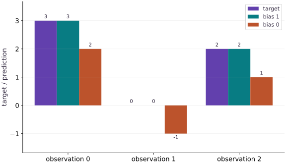

# Linear algebra and loss intuition

Phase 04: Math & optimization · about 80 minutes · CPU

## What you will be able to do

- Map one row to one prediction
- Calculate loss before differentiating
- Expose a broadcast that changes the problem
- Change the dataset and retain the contract
- Derive the vector gradient from individual errors

## The problem

Let’s build a regression prediction one row at a time. Each feature gets a weight, and a bias shifts the result. Once we can calculate three predictions ourselves, we’ll write the matrix version and its loss. This small check will help us catch a transposed array or an accidental broadcast before training begins.

## The idea

Represent observations as rows and features as columns. The matrix $X\in\mathbb{R}^{n\times d}$ contains $n$ observations with $d$ features each, and $w\in\mathbb{R}^{d}$ assigns a weight to each feature. Multiplying gives one weighted sum per observation; in Python, this is `X @ w`.

A scalar bias shifts every prediction, giving $\hat y=Xw+b\mathbf{1}$, where $\mathbf{1}$ is the vector of ones. Predictions and targets should both have shape $(n,)$. Subtract them element by element, square the residuals and average to obtain one scalar mean squared loss. A mistaken $(n,n)$ residual matrix compares every prediction with every target, changing the problem even though its mean is still a scalar.

## Calculate one complete loss by hand

Use a small worked case: $X=[[1,2],[3,0]]$, $w=[2,-1]$, and $b=1$. The predictions are $1(2)+2(-1)+1=1$ and $3(2)+0(-1)+1=7$. With targets $[2,5]$, the residuals are $[-1,2]$, their squares are $[1,4]$, and the mean squared loss is $2.5$.

Notice where each axis goes. The feature axis disappears in the dot product; the observation axis remains until the final average. In general, $X$ has shape $(n,d)$, $w$ has shape $(d,)$, and predictions and targets both have shape $(n,)$.

The prediction plot shows the effect of changing bias: every point moves by the same amount. Changing a weight instead affects an observation in proportion to its corresponding feature. Compare those two interventions before treating all parameter updates as interchangeable.

### Pause and reason

If you duplicate every observation and target, does mean squared loss double?

<details><summary>Compare your reasoning</summary>

No. Both the squared-error sum and the observation count double, leaving the mean unchanged. A summed loss would double, and its gradient scale would change too.

</details>

## Map one row to one prediction

Our three observations have two features each. The first row selects weight $0$, the second selects weight $1$, and the third adds both weights. With $w=[2, -1]$ and bias $1$, the predictions are therefore $[3, 0, 2]$. Matrix multiplication performs these three dot products together. It does not turn the bias into another feature unless you explicitly augment the design matrix.

Write the shapes beside each quantity before executing. The feature axis disappears through the dot product; the observation axis survives. This is the same contract you will use when replacing this tiny dataset with a data loader.

```text
X (3, 2) × w (2,) → prediction (3,)
                                  + scalar bias
prediction − target (3,) → residual (3,)
mean(residual²) → scalar loss
```

## Calculate loss before differentiating

With bias zero the prediction is $[2, -1, 1]$. Subtracting $[3, 0, 2]$ gives three residuals of $-1$. Squaring gives $[1, 1, 1]$; their mean is $1$. The sign convention matters when you later derive the gradient even though either residual sign produces the same squared loss.

For residual $r=Xw+b\mathbf{1}-y$, the gradients are $\frac{2}{n}X^\mathsf{T}r$ and $2\operatorname{mean}(r)$ for weights and bias respectively. At this point they are $[-4/3, -4/3]$ and $-2$. This hand calculation is an independent test of both the model and the reduction axis. Here $r$ is the vector of residuals, $n$ counts observations, and $\mathbf{1}$ repeats the scalar bias for every row. The transpose $X^\mathsf{T}$ gathers each feature’s contribution to its weight gradient.

$$
\begin{aligned}r&=Xw+b\mathbf{1}-y\\L&=\frac{1}{n}\sum_{i=1}^{n}r_i^2\\\nabla_w L&=\frac{2}{n}X^\mathsf{T}r,\qquad\frac{\partial L}{\partial b}=\frac{2}{n}\sum_{i=1}^{n}r_i\end{aligned}
$$

## Expose a broadcast that changes the problem

A column target of shape $(3, 1)$ and predictions of shape $(3,)$ combine into a $(3, 3)$ residual matrix. Each target is compared with every prediction. At the parameters that exactly fit our observations, this wrong loss is $28/9$ rather than zero. JAX is following the array rules correctly; the data contract is wrong.

Check shapes at the loss boundary instead of hoping a small loss will reveal the mistake. Flattening is appropriate only when the original column really represents one scalar per observation; flattening multi-output targets would discard their meaning.

## Change the dataset and retain the contract

The supplied dataset is deliberately easy to compute by hand. Test a new row $[2, -1]$: its weighted sum is $5$ and its prediction with bias $1$ is $6$. Include this row and its target, then verify zero loss. A test that only uses the training rows cannot detect every feature-order mistake.

A mean reduction makes duplicating the entire dataset leave the loss unchanged; a sum reduction would double it. Neither convention is inherently invalid, but it changes gradient scale and therefore affects the interpretation of a learning rate.

## Derive the vector gradient from individual errors

For observation $i$, the residual is $r_i=x_i^\mathsf{T}w+b-y_i$. Its derivative with respect to the weights is the feature row $x_i$. The chain rule multiplies this by $2r_i$, and averaging combines all observations. This gives $\nabla_w L=2X^\mathsf{T}r/n$, while the bias derivative is twice the mean residual. A sum loss has gradients $n$ times as large as a mean loss. Neither convention is inherently wrong, but the same learning rate then represents a different update. Use the direct solver in the next lesson to obtain a reference fit before diagnosing iterative training.

$$
\nabla_w L=\frac{2}{n}X^\mathsf{T}(Xw+b\mathbf1-y),\qquad \frac{\partial L}{\partial b}=\frac{2}{n}\sum_i r_i
$$

## 1. Prepare the inputs

Create a file named main.py in your activated learning environment. Add these imports and inputs first. Shapes and numeric types are part of the experiment.

```python
import jax
import jax.numpy as jnp
```

This block establishes the values used by the following steps; run the completed file after step $3$.

## 2. Define the computation

Append this block below the inputs. Before proceeding, trace which values are inputs, predictions, and state.

```python
X = jnp.array([[1., 0.], [0., 1.], [1., 1.]])
w = jnp.array([2., -1.])
targets = jnp.array([3., 0., 2.])
def predict(w, bias, X):
    return X @ w + bias
def mse(w, bias):
    prediction = predict(w, bias, X)
    assert prediction.shape == targets.shape
    return jnp.mean((prediction - targets) ** 2)
```

predict contracts the feature axis through $Xw$. mse checks row alignment before subtraction, squares each residual, and reduces to one scalar.

## 3. Measure and verify

Append the remaining block, then run python main.py in the terminal. Compare the printed result with the expected output below. Assertions stop execution if the contract fails.

```python
print("Predictions:", predict(w, 1., X))
print("Loss:", float(mse(w, 1.)))
assert jnp.allclose(predict(w, 1., X), targets)
assert jnp.allclose(mse(w, 1.), 0.)
```

Predictions: $[3., 0., 2.]$; Loss: $0.0$.

## Run the example

```python
import jax
import jax.numpy as jnp
X = jnp.array([[1., 0.], [0., 1.], [1., 1.]])
w = jnp.array([2., -1.])
targets = jnp.array([3., 0., 2.])
def predict(w, bias, X):
    return X @ w + bias
def mse(w, bias):
    prediction = predict(w, bias, X)
    assert prediction.shape == targets.shape
    return jnp.mean((prediction - targets) ** 2)
print("Predictions:", predict(w, 1., X))
print("Loss:", float(mse(w, 1.)))
assert jnp.allclose(predict(w, 1., X), targets)
assert jnp.allclose(mse(w, 1.), 0.)
```

Expected: Predictions: $[3., 0., 2.]$; Loss: $0.0$.

## A scalar bias shifts every prediction

**Predict:** What residual appears when the bias changes from $1$ to $0$?



**Recorded CPU computation**

### Read the figure

Each group of bars corresponds to one observation. The vertical axis contains targets and predictions, not losses. Within each group, compare the target with predictions using bias $1$ and bias $0$.

With bias $1$, the predictions $(3,0,2)$ have the same heights as the targets. With bias $0$, they become $(2,-1,1)$: every prediction is exactly one unit lower. The negative bar in the middle group is a negative prediction, not a negative squared error.

### Connect it to the computation

The matrix-vector product produces one value per observation, and the scalar bias is added to each value. Holding the weights fixed while removing the bias therefore shifts all predictions by the same amount.

For bias $0$, the prediction-minus-target residual is $-1$ on every row. Squaring and averaging gives $(1+1+1)/3=1$. With bias $1$, all residuals are zero and the mean squared loss is zero. Read the gaps between bars to understand the loss; do not average the bar heights themselves.

```python
visual_data = {'kind': 'bar', 'labels': ['observation 0', 'observation 1', 'observation 2'], 'ylabel': 'target / prediction', 'series': [{'label': 'target', 'y': targets.tolist()}, {'label': 'bias 1', 'y': predict(w, 1.0, X).tolist()}, {'label': 'bias 0', 'y': predict(w, 0.0, X).tolist()}]}
```

## Recorded reference execution

CPU run: 2026-10-06T22:58:55.918075+00:00. JAX 0.9.2.

```text
Predictions: [3. 0. 2.]
Loss: 0.0
Predictions: [3. 0. 2.]
Loss: 0.0
Analytic gradients: [-1.3333334 -1.3333334] -2.0
Wrong residual shape: (3, 3)
PASS: optimization-01

```

## Verify the gradient by hand

**Predict before running:** At bias zero, what are the weight and bias derivatives?

```python
gw, gb = jax.grad(mse, argnums=(0, 1))(w, 0.)
assert jnp.allclose(gw, jnp.array([-4/3, -4/3]))
assert jnp.allclose(gb, -2.)
print("Analytic gradients:", gw, gb)
```

**Expected:** Weight gradient ≈ $[-1.333333, -1.333333]$; bias gradient $-2$.

The matrix formula and autodiff agree for the same row-matched scalar objective.

## Make the silent shape error visible

**Predict before running:** Does an exact model still have zero loss against column targets?

```python
column_targets = targets[:, None]
pairwise = predict(w, 1., X) - column_targets
assert pairwise.shape == (3, 3)
assert jnp.allclose(jnp.mean(pairwise**2), 28/9)
print("Wrong residual shape:", pairwise.shape)
```

**Expected:** $(3, 3)$, with loss $28/9$.

A valid broadcast can define an unintended objective without raising an exception.

## Change the reduction, predict the update

**Predict before running:** For the same three residuals, how much larger is the gradient of a sum loss than a mean loss?

```python
def mean_objective(weights):
    return jnp.mean((X @ weights - targets)**2)
def sum_objective(weights):
    return jnp.sum((X @ weights - targets)**2)
point = jnp.array([0.2, -0.4])
residual = X @ point - targets
analytic_mean = 2 * X.T @ residual / X.shape[0]
assert jnp.allclose(jax.grad(mean_objective)(point), analytic_mean, atol=1e-6)
assert jnp.allclose(jax.grad(sum_objective)(point), X.shape[0]*analytic_mean, atol=1e-6)
```

**Expected:** The sum gradient is $3$ times the mean gradient.

Loss reduction is part of the optimization specification. Match it when comparing hand calculations, libraries and learning rates.

## Make it yours

Set the bias to zero. Predict each residual and calculate the loss by hand, then compare it with JAX.

<details><summary>Reference solution</summary>

```python
residual = predict(w, 0., X) - targets
assert jnp.allclose(residual, -jnp.ones(3))
assert jnp.allclose(mse(w, 0.), 1.)
```

</details>

## Add an unseen observation

**Transfer / diagnosis**

Extend $X$ with $[2, -1]$, supply its target, and check predictions using ordinary arithmetic.

<details><summary>Hint</summary>

The new target is the dot product plus bias.

</details>

<details><summary>Reference solution and reasoning</summary>

```python
X_new = jnp.concatenate([X, jnp.array([[2., -1.]])])
y_new = jnp.concatenate([targets, jnp.array([6.])])
assert jnp.allclose(predict(w, 1., X_new), y_new)
```

The fourth row checks a combination absent from the original three observations.

</details>

## Reject and repair a column target

**Transfer / diagnosis**

Write a loss that rejects mismatched prediction/target shapes. Demonstrate rejection and then restore the intended one-target-per-row format.

<details><summary>Hint</summary>

Compare shapes before subtraction; reshape only this known scalar-target dataset.

</details>

<details><summary>Reference solution and reasoning</summary>

```python
def checked_loss(prediction, target):
    if prediction.shape != target.shape:
        raise ValueError("one target required per prediction")
    return jnp.mean((prediction-target)**2)
try:
    checked_loss(predict(w, 1., X), column_targets)
except ValueError:
    pass
else:
    raise AssertionError("bad shape accepted")
assert checked_loss(predict(w, 1., X), column_targets[:, 0]) == 0
```

The failure is reproduced at the boundary and the repair is verified against zero residuals.

</details>

## Check your understanding

What shape should one scalar target per observation have for predictions of shape $(n,)$?

1. $(n, 1)$
2. $(n,)$
3. $(d,)$

<details><summary>Answer and explanation</summary>

$(n,)$

Use matching $(n,)$ shapes. A column target can silently broadcast into pairwise residuals.

</details>

## Diagnose the result

Check prediction and target shapes before blaming the optimizer. For this dataset, all residuals with bias zero are $-1$, so the mean squared loss must be $1$.

## Carry forward

- The matrix formula and autodiff agree for the same row-matched scalar objective.
- A valid broadcast can define an unintended objective without raising an exception.

## Keep your evidence

Keep the row-by-row predictions, analytic weight/bias derivatives, pairwise-broadcast counterexample, and checked-loss rejection/repair. Include the analytic vector-gradient derivation and mean-versus-sum comparison.

Keep predictions, modified code, observed results, and reasoning. A checkpoint alone does not demonstrate the exercise.

## Primary references

- [JAX array operations](https://docs.jax.dev/en/latest/jax.numpy.html)
- [Autodiff cookbook](https://docs.jax.dev/en/latest/notebooks/autodiff_cookbook.html)

