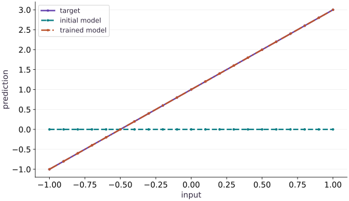

# Optimize with Optax

Phase 04: Math & optimization · about 80 minutes · CPU

## What you will be able to do

- Distinguish gradients, updates, and parameters
- Understand the state even when SGD has none
- Make a resumable training transition
- Verify the simpler algorithm before composing one
- Preserve state when a gradient happens to be zero

## The problem

An optimizer helps turn gradients into parameter changes. Before introducing a more complicated one, we’ll check that Optax SGD agrees with the update you already know. Then we’ll add momentum and follow the extra state it remembers, so you can explain why resetting that state changes the next step.

## The idea

An optimizer transforms gradients into parameter updates and may retain state between steps. Optax makes that state explicit: initialize it, pass it into each update, and keep the returned state together with the new parameters.

## The optimizer has memory of earlier gradients

For plain gradient descent without extra state, the current parameters and gradient can determine the next update. For momentum or Adam, earlier gradients also matter through stored accumulators. Two runs at the same parameters can therefore take different next steps if their optimizer states differ.

Follow the update cycle in order: calculate the loss and gradients from current parameters, ask the optimizer for updates and new state, then apply those updates to the parameters. Keeping only one returned object breaks the cycle.

The fitted-line figure shows that the example recovered a useful prediction rule. It does not by itself prove correct state continuation. Save a mid-run state and compare the next update with an uninterrupted run to test that separate capability.

### Pause and reason

You restore weights but initialize Adam from scratch. Is that an exact continuation?

<details><summary>Compare your reasoning</summary>

No. The moment estimates and step counter have changed, so subsequent updates can differ. This may be a deliberate new optimization run, but it is not an exact resume.

</details>

## Distinguish gradients, updates, and parameters

A gradient describes local sensitivity; an update is the change the optimizer wants to add to parameters. Optax SGD transforms $g$ into $-\eta g$. apply_updates adds that update, so subtracting it again would reverse the intended direction. The tree structure of gradients and updates follows the parameter tree.

For our evenly spaced $x$ values, $\operatorname{mean}(x)=0$ and $\operatorname{mean}(x^2)=\frac{11}{30}$. At zero parameters, the weight derivative is $-4\cdot\frac{11}{30}=-\frac{22}{15}$ and the bias derivative is $-2$. With rate $0.2$, the first weight becomes $22/75$ and bias $0.4$. Compute these values before trusting a long run.

```text
params → loss → grads
grads + old optimizer state → updates + new optimizer state
params + updates → next params
```

## Understand the state even when SGD has none

Plain SGD here has no momentum history, so the equality with manual gradient descent is a useful baseline. Momentum adds a trace of prior gradients. Its returned state must be threaded through every call; rebuilding state each step discards that history and gives a different algorithm.

With momentum $0.9$ and gradients $2$ then $1$, the trace is first $2$ then $2.8$. At rate $0.1$ the second update is $-0.28$. Reinitializing before the second gradient gives $-0.1$. This two-step example demonstrates the actual state dependence without assuming that the regression fit alone proves it.

## Make a resumable training transition

Treat a training step as (params, optimizer_state, batch) → (new_params, new_state, metrics). A checkpoint must preserve the algorithm state as well as parameter values. With a deterministic fixed dataset, replaying the next step from identical saved parameters and state should produce identical results within the same environment.

This lesson performs an in-memory replay; it does not implement file persistence or claim crash recovery. Random keys, data iterator position and distributed topology become additional state in later training systems. A tuple called “checkpoint” is not a resilient checkpoint service.

## Verify the simpler algorithm before composing one

Compare one Optax SGD step to a hand-derived tree update before introducing momentum, clipping, schedules or Adam. Composition order matters: transformations operate on the value produced by preceding transformations. Keep loss convention and the rate fixed while comparing algorithms.

The 120-step fit is a small CPU regression example, not a TPU throughput benchmark or evidence that the same rate is suitable for a network. Inspect the parameters, loss, and optimizer transition separately; the final loss alone cannot reveal a reset-state bug in every problem.

## Preserve state when a gradient happens to be zero

Momentum remembers earlier gradients. Under the convention $m_t=\beta m_{t-1}+g_t$, a zero current gradient can still produce a nonzero update. With $\beta=0.9$, a previous trace of $2$ becomes $1.8$ when the new gradient is zero. This is why an optimizer’s behavior cannot be reconstructed from the current gradient and weights alone. The next lesson builds on this state model to explain Adam and learning-rate schedules.

$$
m_t=\beta m_{t-1}+g_t,\qquad \Delta w_t=-\eta m_t
$$

## 1. Prepare the inputs

Create a file named main.py in your activated learning environment. Add these imports and inputs first. Shapes and numeric types are part of the experiment.

```python
import jax
import jax.numpy as jnp
import optax
```

This block establishes the values used by the following steps; run the completed file after step $3$.

## 2. Define the computation

Append this block below the inputs. Before proceeding, trace which values are inputs, predictions, and state.

```python
params = {"weight": jnp.array(0.), "bias": jnp.array(0.)}
x = jnp.linspace(-1., 1., 21)
y = 2. * x + 1.
def loss(p):
    return jnp.mean((p["weight"] * x + p["bias"] - y) ** 2)
optimizer = optax.sgd(0.2)
state = optimizer.init(params)
```

loss maps the two parameter leaves to row-wise predictions. optimizer.init establishes the initial SGD state; retain the update state in the next block.

## 3. Measure and verify

Append the remaining block, then run python main.py in the terminal. Compare the printed result with the expected output below. Assertions stop execution if the contract fails.

```python
initial_loss = loss(params)
for _ in range(120):
    grads = jax.grad(loss)(params)
    updates, state = optimizer.update(grads, state, params)
    params = optax.apply_updates(params, updates)
print("Parameters:", params)
print("Loss:", float(loss(params)))
assert loss(params) < 1e-8
assert jnp.allclose(params["weight"], 2., atol=1e-4)
assert jnp.allclose(params["bias"], 1., atol=1e-4)
```

Weight approaches $2.0$, bias approaches $1.0$, and loss is below $10^{-8}$.

## Run the example

```python
import jax
import jax.numpy as jnp
import optax
params = {"weight": jnp.array(0.), "bias": jnp.array(0.)}
x = jnp.linspace(-1., 1., 21)
y = 2. * x + 1.
def loss(p):
    return jnp.mean((p["weight"] * x + p["bias"] - y) ** 2)
optimizer = optax.sgd(0.2)
state = optimizer.init(params)
initial_loss = loss(params)
for _ in range(120):
    grads = jax.grad(loss)(params)
    updates, state = optimizer.update(grads, state, params)
    params = optax.apply_updates(params, updates)
print("Parameters:", params)
print("Loss:", float(loss(params)))
assert loss(params) < 1e-8
assert jnp.allclose(params["weight"], 2., atol=1e-4)
assert jnp.allclose(params["bias"], 1., atol=1e-4)
```

Expected: Weight approaches $2.0$, bias approaches $1.0$, and loss is below $10^{-8}$.

## The fitted line recovers slope and bias

**Predict:** What does each learned parameter change in the predictions?



**Recorded CPU computation**

### Read the figure

The horizontal axis gives input values and the vertical axis gives predictions. The dashed initial model is flat at zero. The target and trained-model lines rise together from approximately $(-1,-1)$ through $(0,1)$ to $(1,3)$.

The trained line lies almost exactly on top of the target, so one can hide the other. This overlap is the intended result, not a missing legend entry. It means the predictions agree to the numerical tolerance used in the example.

### Connect it to the computation

Read the learned parameters from the geometry: the intercept is $1$, and increasing the input by $1$ raises the prediction by $2$. Training has therefore recovered the target relationship $y=2x+1$, whereas the initial model used zero slope and zero intercept.

This picture shows the final fit across the displayed inputs, not the optimizer’s path or its runtime. Agreement on an exact synthetic linear target is a useful correctness check. It does not establish performance on noisy data or on a different relationship.

```python
visual_data = {'kind': 'line', 'x': x.tolist(), 'xlabel': 'input', 'ylabel': 'prediction', 'series': [{'label': 'target', 'y': y.tolist()}, {'label': 'initial model', 'y': jnp.zeros_like(x).tolist()}, {'label': 'trained model', 'y': (params['weight'] * x + params['bias']).tolist()}]}
```

## Recorded reference execution

CPU run: 2026-10-06T22:59:30.553881+00:00. JAX 0.9.2.

```text
Parameters: {'bias': Array(1., dtype=float32), 'weight': Array(1.9999996, dtype=float32)}
Loss: 5.126058404787345e-14
Parameters: {'bias': Array(1., dtype=float32), 'weight': Array(1.9999996, dtype=float32)}
Loss: 5.126058404787345e-14
First parameters: {'bias': Array(0.4, dtype=float32), 'weight': Array(0.29333338, dtype=float32)}
PASS: optimization-04

```

## Check the first update against arithmetic

**Predict before running:** Predict both parameters after one SGD step at the zero initialization.

```python
p0 = {"weight": jnp.array(0.), "bias": jnp.array(0.)}
g0 = jax.grad(loss)(p0)
u0, s0 = optimizer.update(g0, optimizer.init(p0), p0)
p1 = optax.apply_updates(p0, u0)
assert jnp.allclose(p1["weight"], 22/75)
assert jnp.allclose(p1["bias"], 0.4)
print("First parameters:", p1)
```

**Expected:** Weight ≈ $0.293333$; bias $0.4$.

Independent arithmetic checks the gradient scale and the update sign.

## Observe stateful momentum

**Predict before running:** After gradients $2$ then $1$, is the second update the same if you reset state?

```python
momentum = optax.sgd(0.1, momentum=0.9)
m0 = momentum.init(jnp.array(0.))
u1, m1 = momentum.update(jnp.array(2.), m0)
u2, m2 = momentum.update(jnp.array(1.), m1)
reset_u2, _ = momentum.update(jnp.array(1.), m0)
assert jnp.allclose(u1, -0.2)
assert jnp.allclose(u2, -0.28)
assert jnp.allclose(reset_u2, -0.1)
```

**Expected:** Second update $-0.28$ with retained state, $-0.1$ after reset.

Resetting momentum removes the prior-gradient contribution; it changes the optimization algorithm.

## Coast through a zero-gradient step

**Predict before running:** After gradient $2$, does a zero gradient stop momentum SGD immediately?

```python
momentum_tx = optax.sgd(0.1, momentum=0.9)
position = jnp.array(0.)
momentum_state = momentum_tx.init(position)
coast_first, momentum_state = momentum_tx.update(jnp.array(2.),momentum_state,position)
position = optax.apply_updates(position,coast_first)
coast_second, momentum_state = momentum_tx.update(jnp.array(0.),momentum_state,position)
assert jnp.allclose(coast_first,-0.2)
assert jnp.allclose(coast_second,-0.18)
```

**Expected:** The second update is $-0.18$, despite a zero current gradient.

Optimizer state carries information from earlier steps. A zero current gradient need not produce a zero update.

## Make it yours

At the original zero parameters, compare the first Optax SGD update with an explicit tree-map gradient descent step.

<details><summary>Reference solution</summary>

```python
start = {"weight": jnp.array(0.), "bias": jnp.array(0.)}
grads = jax.grad(loss)(start)
updates, _ = optimizer.update(grads, optimizer.init(start), start)
actual = optax.apply_updates(start, updates)
expected = jax.tree.map(lambda p, g: p - 0.2 * g, start, grads)
assert all(jnp.allclose(a, b) for a, b in zip(jax.tree.leaves(actual), jax.tree.leaves(expected)))
```

</details>

## Replay a momentum continuation

**Transfer / diagnosis**

Save the state after the first update; run the next update twice from that state and compare every state leaf.

<details><summary>Hint</summary>

Optimizer transformations return new state; reuse the saved value for the replay.

</details>

<details><summary>Reference solution and reasoning</summary>

```python
replay_u, replay_state = momentum.update(jnp.array(1.), m1)
assert jnp.allclose(replay_u, u2)
assert all(jnp.allclose(a,b) for a,b in zip(jax.tree.leaves(replay_state), jax.tree.leaves(m2)))
```

This verifies an in-memory optimizer transition. It does not test serialization or a data-loader resume.

</details>

## Catch double subtraction

**Transfer / diagnosis**

At zero parameters, subtract SGD updates by mistake. Show the loss increases; repair using apply_updates.

<details><summary>Hint</summary>

SGD updates already contain the minus sign.

</details>

<details><summary>Reference solution and reasoning</summary>

```python
wrong = jax.tree.map(lambda p,u: p-u, p0,u0)
right = optax.apply_updates(p0,u0)
assert loss(wrong) > loss(p0)
assert loss(right) < loss(p0)
```

Comparing identical gradients exposes an update-sign error rather than a hyperparameter difference.

</details>

## Check your understanding

What should a training step retain besides updated parameters for a stateful optimizer?

1. Only the final loss
2. The new optimizer state returned by update
3. A freshly initialized state every time

<details><summary>Answer and explanation</summary>

The new optimizer state returned by update

State carries momentum or adaptive statistics between steps. Reinitializing it discards that history.

</details>

## Diagnose the result

If an adaptive optimizer behaves differently after restarting, compare both parameter values and optimizer state. Equal parameters alone do not establish an identical continuation.

## Carry forward

- Independent arithmetic checks the gradient scale and the update sign.
- Resetting momentum removes the prior-gradient contribution; it changes the optimization algorithm.

## Keep your evidence

Save the analytic first update, manual/Optax equivalence, retained/reset momentum comparison, continuation replay and double-subtraction repair. Include the zero-gradient momentum step and explain why retained state still moves the parameter.

Keep predictions, modified code, observed results, and reasoning. A checkpoint alone does not demonstrate the exercise.

## Primary references

- [Optax getting started](https://optax.readthedocs.io/en/latest/getting_started.html)
- [Optax optimizer API](https://optax.readthedocs.io/en/latest/api/optimizers.html)

