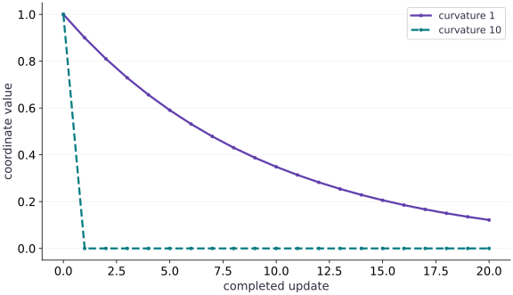

# Curvature, Hessians, and learning rates

Phase 04: Math & optimization · about 75 minutes · CPU

## What you will be able to do

- Use curvature to explain learning-rate stability, slow directions and why a zero gradient need not be a minimum.
- Read a bowl through its curvature
- Derive a stability bound
- See why scaling helps
- Distinguish a minimum from a stationary point

## The problem

Why can the same learning rate crawl along one direction and explode along another? A gradient tells us the local slope. Curvature tells us how quickly that slope changes. We will use a two-dimensional bowl whose behavior can be predicted exactly.

## The idea

Curvature describes how quickly the gradient changes as we move. A direction with high curvature can overshoot under a learning rate that makes slow progress in a flatter direction. Contours make this imbalance easier to see than loss alone.

## Why one learning rate must respect the steep direction

For the illustrative quadratic $L(x,y)=(x^2+10y^2)/2$, a gradient step multiplies the coordinates by $1-\eta$ and $1-10\eta$. Here $\eta$ is the learning rate. With $\eta=0.1$, the steep coordinate reaches zero in one exact-arithmetic step while the other shrinks by $0.9$.

With $\eta=0.25$, the steep coordinate is multiplied by $-1.5$: it changes sign and grows in magnitude. The flatter coordinate still shrinks, so observing one coordinate could make the update look healthy while the total objective diverges.

Sketch narrow elliptical contours for this quadratic and mark the first two iterates. The saved coordinate plot shows how each direction progresses. Keep the objective coefficients, initial point and rate labels aligned when comparing this calculation with a trajectory; a path from another quadratic would tell a different story.

### Pause and reason

For this quadratic, what condition on a positive learning rate contracts both coordinates?

<details><summary>Compare your reasoning</summary>

Require $\lvert1-10\eta\rvert<1$ and $\lvert1-\eta\rvert<1$. For a positive rate, both hold when $0<\eta<0.2$. At the boundary the steep coordinate can oscillate without shrinking.

</details>

## Read a bowl through its curvature

Consider $L(w)=\tfrac12(w_0^2+10w_1^2)$. Its gradient is $(w_0,10w_1)$, and its Hessian is diagonal with entries $1$ and $10$. Moving equally far along the second axis changes the slope ten times as much. An eigenvector of a matrix keeps its direction when multiplied by that matrix; its eigenvalue is the scale factor. Here the coordinate axes are eigenvectors, and their eigenvalues are those diagonal entries.

$$
H_{ij}=\frac{\partial^2 L}{\partial w_i\partial w_j},\qquad H=\begin{pmatrix}1&0\\0&10\end{pmatrix}
$$

## Derive a stability bound

Gradient descent uses $w_{t+1}=w_t-\eta\nabla L(w_t)$, where $\eta$ is the learning rate. Along an eigenvector with positive curvature $\lambda$, the error is multiplied by $1-\eta\lambda$. Its magnitude shrinks only when $|1-\eta\lambda|<1$. All directions of this strictly convex quadratic shrink when $0<\eta<2/\lambda_{\max}=0.2$. At the boundary the steep coordinate flips sign without shrinking. This exact global bound belongs to this constant-curvature quadratic; a nonquadratic model needs more care.

$$
0<\eta<\frac{2}{\lambda_{\max}}
$$

## See why scaling helps

At $\eta=0.1$, the steep coordinate reaches zero immediately, while the shallow coordinate shrinks by $0.9$ each step. Reparameterize with $z=(w_0,\sqrt{10}w_1)$. The same objective becomes $\tfrac12\|z\|^2$, an evenly curved bowl. A step of size $1$ in these coordinates reaches the optimum. Real feature standardization is a practical approximation to improving this geometry; it does not remove all correlations or guarantee one-step convergence.

## Distinguish a minimum from a stationary point

At a stationary point the gradient is zero. Positive definite curvature gives a strict local minimum for a twice continuously differentiable function; an indefinite Hessian has both rising and falling directions and indicates a saddle. For $S(w)=w_0^2-w_1^2$, the origin is a saddle despite its zero gradient. A positive semidefinite Hessian alone can be inconclusive. For large models, avoid storing the full Hessian when a product $Hv$ answers your question; use a JVP of the gradient.

## Write the bowl

Create main.py with the objective and independently known curvature.

```python
# Step 1 — Write the bowl: At the starting point the gradient is (1,10).
# Import jax for this computation.
import jax
import jax.numpy as jnp

# Function `loss(w)` implementing this stage's computation:
def loss(w):
    # Return `0.5 * (w[0] ** 2 + 10 * w[1] ** 2)` to the caller.
    return 0.5 * (w[0] ** 2 + 10 * w[1] ** 2)
# Initialize array `w` with explicit values and shape.
w = jnp.array([1.0, 1.0])
# Initialize array `H` with explicit values and shape.
H = jnp.diag(jnp.array([1.0, 10.0]))
# Verify that the numerical values match the expected reference within tolerance.
assert jnp.allclose(jax.grad(loss)(w), H @ w)
```

At the starting point the gradient is $(1,10)$.

## Check second derivatives

Append the full Hessian and a product check.

```python
# Step 2 — Check second derivatives: The product agrees with the diagonal matrix without constructing a...
# Verify that the numerical values match the expected reference within tolerance.
assert jnp.allclose(jax.hessian(loss)(w), H)
# Initialize array `v` with explicit values and shape.
v = jnp.array([2.0, -1.0])
# Differentiate the objective to obtain `hv` via automatic differentiation.
hv = jax.jvp(jax.grad(loss), (w,), (v,))[1]
# Verify that the numerical values match the expected reference within tolerance.
assert jnp.allclose(hv, jnp.array([2.0, -10.0]))
```

The product agrees with the diagonal matrix without constructing a Hessian inside the JVP.

## Run an explicit trajectory

Append this scan and run python main.py. The history records losses after each update.

```python
# Step 3 — Run an explicit trajectory: The second coordinate vanishes; the first remains near 0.1216...
# Define `run(rate, steps)` to evaluate the objective and its automatic derivatives:
def run(rate, steps=20):

    # Define `step(w, _)` to evaluate the objective and its automatic derivatives:
    def step(w, _):
        # Differentiate the objective to obtain `w` via automatic differentiation.
        w = w - rate * jax.grad(loss)(w)
        # Return `(w, loss(w))` to the caller.
        return (w, loss(w))
    # Return `jax.lax.scan(step, jnp.array([1.0, 1.0]), None, length=steps)` to the caller.
    return jax.lax.scan(step, jnp.array([1.0, 1.0]), None, length=steps)
# Run `run` to compute `(final, history)`.
final, history = run(0.1)
# Verify that the numerical values match the expected reference within tolerance.
assert jnp.allclose(final, jnp.array([0.9 ** 20, 0.0]), atol=2e-06)
# Verify that the output satisfies the expected shape, finite-value, or numerical contract.
assert jnp.all(jnp.diff(history) <= 1e-06)
# Print the observed values to compare against the expected result.
print('final weights / loss:', final, history[-1])
```

The second coordinate vanishes; the first remains near $0.1216$ after $20$ steps.

## Run the example

```python
# Step 1 — Write the bowl: At the starting point the gradient is (1,10).
# Import jax for this computation.
import jax
import jax.numpy as jnp

# Function `loss(w)` implementing this stage's computation:
def loss(w):
    # Return `0.5 * (w[0] ** 2 + 10 * w[1] ** 2)` to the caller.
    return 0.5 * (w[0] ** 2 + 10 * w[1] ** 2)
# Initialize array `w` with explicit values and shape.
w = jnp.array([1.0, 1.0])
# Initialize array `H` with explicit values and shape.
H = jnp.diag(jnp.array([1.0, 10.0]))
# Verify that the numerical values match the expected reference within tolerance.
assert jnp.allclose(jax.grad(loss)(w), H @ w)

# Step 2 — Check second derivatives: The product agrees with the diagonal matrix without constructing a...
# Verify that the numerical values match the expected reference within tolerance.
assert jnp.allclose(jax.hessian(loss)(w), H)
# Initialize array `v` with explicit values and shape.
v = jnp.array([2.0, -1.0])
# Differentiate the objective to obtain `hv` via automatic differentiation.
hv = jax.jvp(jax.grad(loss), (w,), (v,))[1]
# Verify that the numerical values match the expected reference within tolerance.
assert jnp.allclose(hv, jnp.array([2.0, -10.0]))

# Step 3 — Run an explicit trajectory: The second coordinate vanishes; the first remains near 0.1216...
# Define `run(rate, steps)` to evaluate the objective and its automatic derivatives:
def run(rate, steps=20):

    # Define `step(w, _)` to evaluate the objective and its automatic derivatives:
    def step(w, _):
        # Differentiate the objective to obtain `w` via automatic differentiation.
        w = w - rate * jax.grad(loss)(w)
        # Return `(w, loss(w))` to the caller.
        return (w, loss(w))
    # Return `jax.lax.scan(step, jnp.array([1.0, 1.0]), None, length=steps)` to the caller.
    return jax.lax.scan(step, jnp.array([1.0, 1.0]), None, length=steps)
# Run `run` to compute `(final, history)`.
final, history = run(0.1)
# Verify that the numerical values match the expected reference within tolerance.
assert jnp.allclose(final, jnp.array([0.9 ** 20, 0.0]), atol=2e-06)
# Verify that the output satisfies the expected shape, finite-value, or numerical contract.
assert jnp.all(jnp.diff(history) <= 1e-06)
# Print the observed values to compare against the expected result.
print('final weights / loss:', final, history[-1])
```

Expected: At rate $0.1$, the final loss is about $0.00739$ and the trajectory is decreasing.

## Unequal curvature produces unequal progress

**Predict:** At rate $0.1$, which coordinate reaches zero immediately?



**Recorded CPU computation**

### Read the figure

The horizontal axis counts completed updates; the point at $0$ is the initial state. The vertical axis shows a parameter coordinate, not the total loss. Both coordinates start at $1$, but the coordinate with curvature $10$ drops to zero after one update, while the coordinate with curvature $1$ decays gradually.

The gradual curve starts $1,0.9,0.81$ and is still about $0.122$ after $20$ updates. The dashed curve remains at zero after its first drop. It has reached its optimum in this particular direction.

### Connect it to the computation

For a quadratic direction with curvature $\lambda$, gradient descent multiplies the coordinate by $1-\eta\lambda$. At learning rate $0.1$, that multiplier is $0.9$ for curvature $1$ and zero for curvature $10$. The unequal curves come from curvature interacting with the same learning rate.

The steeper direction is faster here because the rate exactly cancels it. Increasing the rate further does not keep making it better: sufficiently large steps produce oscillation or divergence. This is why one shared rate can be constrained by a steep direction while making slow progress in a flatter one.

```python
# Compute figure data for: Unequal curvature produces unequal progress
# Create device-backed JAX array `points`.
points = [jnp.array([1.0, 1.0])]
# Repeat the update loop over `range(20)` steps:
for _ in range(20):
    # Differentiate the objective to obtain gradients ``.
    points.append(points[-1] - 0.1 * jax.grad(loss)(points[-1]))
# Combine or mask array elements to form `trace`.
trace = jnp.stack(points)
# Evaluate `visual_data` from the current inputs and state.
visual_data = {'kind': 'line', 'x': list(range(21)), 'xlabel': 'completed update', 'ylabel': 'coordinate value', 'series': [{'label': 'curvature 1', 'y': trace[:, 0].tolist()}, {'label': 'curvature 10', 'y': trace[:, 1].tolist()}]}
```

## Recorded reference execution

CPU run: 2026-10-08T14:02:02.468125+00:00. JAX 0.9.2.

```text
final weights / loss: [ 0.12157664 -0.        ] 0.0073904395
final weights / loss: [ 0.12157664 -0.        ] 0.0073904395
PASS: optimization-08

```

## Cross the stability boundary

**Predict before running:** Predict the steep coordinate at rates $0.2$ and $0.21$.

```python
# Experiment — Cross the stability boundary: A learning-rate bound depends on curvature, not on a universal...
edge, _ = run(0.2)
# Run `run` to compute `(bad, bad_history)`.
bad, bad_history = run(0.21)
# Verify that the numerical values match the expected reference within tolerance.
assert jnp.allclose(jnp.abs(edge[1]), 1.0, atol=2e-06)
# Verify that the output satisfies the expected shape, finite-value, or numerical contract.
assert jnp.abs(bad[1]) > 6.0
# Verify that the output satisfies the expected shape, finite-value, or numerical contract.
assert bad_history[-1] > loss(w)
```

**Expected:** At the boundary its magnitude stays $1$; above it the magnitude grows.

A learning-rate bound depends on curvature, not on a universal default value.

## Change coordinates

**Predict before running:** For $\tfrac12\|z\|^2$, what happens after a gradient step of size $1$?

```python
# Experiment — Change coordinates: Coordinates can change optimization geometry while representing...
# Initialize array `z` with explicit values and shape.
z = jnp.array([w[0], jnp.sqrt(10.0) * w[1]])
# Evaluate `round_loss` from the current inputs and state.
round_loss = lambda z: 0.5 * jnp.dot(z, z)
# Differentiate the objective to obtain `z_next` via automatic differentiation.
z_next = z - jax.grad(round_loss)(z)
# Verify that the numerical values match the expected reference within tolerance.
assert jnp.allclose(z_next, jnp.zeros(2))
# Verify that the output satisfies the expected shape, finite-value, or numerical contract.
assert jnp.allclose(round_loss(z), loss(w))
```

**Expected:** The transformed objective starts at the same value and reaches zero in one step.

Coordinates can change optimization geometry while representing the same underlying objective.

## Make it yours

For curvatures $(2,8)$, derive the stable interval and check one step at rate $0.1$ from $(1,1)$.

### How to write this exercise — Step-by-step recipe & starter scaffold

**Key functions & syntax to use:**
- `jnp.array(values, dtype=...)` — Constructs an immutable device-backed JAX array from Python/NumPy values.
- `jnp.allclose(actual, expected, rtol=..., atol=...)` — Checks that two arrays match elementwise within floating-point tolerance.

**Step-by-step implementation plan:**
1. Initialize array `H2` with explicit values and shape.
2. Perform matrix contraction / projection to compute `w_next`.
3. Verify that the numerical values match the expected reference within tolerance.
4. Verify that the output satisfies the expected shape, finite-value, or numerical contract.

**Starter code scaffold (fill in the TODOs):**

```python
# Exercise solution: For curvatures (2,8), derive the stable interval and check one step at...
# Initialize array `H2` with explicit values and shape.
H2 = jnp.diag(...)  # TODO: compute H2
# Perform matrix contraction / projection to compute `w_next`.
w_next = ...  # TODO: compute w_next
# Verify that the numerical values match the expected reference within tolerance.
assert jnp.allclose(w_next, jnp.array([0.8, 0.2]), atol=1e-06)  # TODO: complete assertion check
# Verify that the output satisfies the expected shape, finite-value, or numerical contract.
assert jnp.allclose(2 / jnp.max(jnp.linalg.eigvalsh(H2)), 0.25)  # TODO: complete assertion check
```

<details><summary>Reference solution</summary>

```python
# Exercise solution: For curvatures (2,8), derive the stable interval and check one step at...
# Initialize array `H2` with explicit values and shape.
H2 = jnp.diag(jnp.array([2.0, 8.0]))
# Perform matrix contraction / projection to compute `w_next`.
w_next = w - 0.1 * (H2 @ w)
# Verify that the numerical values match the expected reference within tolerance.
assert jnp.allclose(w_next, jnp.array([0.8, 0.2]), atol=1e-06)
# Verify that the output satisfies the expected shape, finite-value, or numerical contract.
assert jnp.allclose(2 / jnp.max(jnp.linalg.eigvalsh(H2)), 0.25)
```

</details>

## Reject the zero-gradient shortcut

**Transfer / diagnosis**

At the origin of $S(w)=w_0^2-w_1^2$, show zero gradient and both a lower and higher nearby value.

<details><summary>Hint</summary>

Move by $0.1$ along each axis separately.

</details>

### How to write: Reject the zero-gradient shortcut — Step-by-step recipe & starter scaffold

**Key functions & syntax to use:**
- `jnp.array(values, dtype=...)` — Constructs an immutable device-backed JAX array from Python/NumPy values.
- `jnp.zeros / jnp.ones(shape, dtype=...)` — Allocates a tensor of the given `shape` initialized with constants.
- `jnp.allclose(actual, expected, rtol=..., atol=...)` — Checks that two arrays match elementwise within floating-point tolerance.
- `jax.grad(loss_fn)(params, ...)` — Transforms a scalar-output function into a function returning the gradient PyTree with the same structure as `params`.

**Step-by-step implementation plan:**
1. Initialize array `zero` with explicit values and shape.
2. Verify that the numerical values match the expected reference within tolerance.
3. Verify that the output satisfies the expected shape, finite-value, or numerical contract.
4. Verify that the output satisfies the expected shape, finite-value, or numerical contract.
5. Verify that the output satisfies the expected shape, finite-value, or numerical contract.

**Starter code scaffold (fill in the TODOs):**

```python
# Reject the zero-gradient shortcut (Transfer / diagnosis): Stationarity is a first-order condition, not a proof of a...
saddle = ...  # TODO: compute saddle
# Initialize array `zero` with explicit values and shape.
zero = jnp.zeros(...)  # TODO: compute zero
# Verify that the numerical values match the expected reference within tolerance.
assert jnp.allclose(jax.grad(saddle)(zero), zero)  # TODO: complete assertion check
# Verify that the output satisfies the expected shape, finite-value, or numerical contract.
assert saddle(jnp.array([0.0, 0.1]))  # TODO: complete assertion check
# Verify that the output satisfies the expected shape, finite-value, or numerical contract.
assert saddle(jnp.array([0.1, 0.0]))  # TODO: complete assertion check
# Verify that the output satisfies the expected shape, finite-value, or numerical contract.
assert jnp.allclose(jnp.linalg.eigvalsh(jax.hessian(saddle)(zero)), jnp.array([-2.0, 2.0]))  # TODO: complete assertion check
```

<details><summary>Reference solution and reasoning</summary>

```python
# Reject the zero-gradient shortcut (Transfer / diagnosis): Stationarity is a first-order condition, not a proof of a...
saddle = lambda z: z[0] ** 2 - z[1] ** 2
# Initialize array `zero` with explicit values and shape.
zero = jnp.zeros(2)
# Verify that the numerical values match the expected reference within tolerance.
assert jnp.allclose(jax.grad(saddle)(zero), zero)
# Verify that the output satisfies the expected shape, finite-value, or numerical contract.
assert saddle(jnp.array([0.0, 0.1])) < saddle(zero)
# Verify that the output satisfies the expected shape, finite-value, or numerical contract.
assert saddle(jnp.array([0.1, 0.0])) > saddle(zero)
# Verify that the output satisfies the expected shape, finite-value, or numerical contract.
assert jnp.allclose(jnp.linalg.eigvalsh(jax.hessian(saddle)(zero)), jnp.array([-2.0, 2.0]))
```

Stationarity is a first-order condition, not a proof of a minimum.

</details>

## Transfer to a nonquadratic function

**Transfer / diagnosis**

For $F(w)=\sum_i e^{w_i}$, verify a Hessian-vector product at $(0,\log 2)$ along $(1,3)$.

<details><summary>Hint</summary>

The analytic Hessian is diagonal with entries $e^{w_i}$.

</details>

### How to write: Transfer to a nonquadratic function — Step-by-step recipe & starter scaffold

**Key functions & syntax to use:**
- `jnp.array(values, dtype=...)` — Constructs an immutable device-backed JAX array from Python/NumPy values.
- `x.sum(axis=...) / x.mean(axis=..., keepdims=...)` — Reduces values along the named `axis` (the axis you name is collapsed unless `keepdims=True`).
- `jnp.allclose(actual, expected, rtol=..., atol=...)` — Checks that two arrays match elementwise within floating-point tolerance.
- `jax.grad(loss_fn)(params, ...)` — Transforms a scalar-output function into a function returning the gradient PyTree with the same structure as `params`.

**Step-by-step implementation plan:**
1. Initialize array `point` with explicit values and shape.
2. Initialize array `direction` with explicit values and shape.
3. Differentiate the objective to obtain `product` via automatic differentiation.
4. Verify that the numerical values match the expected reference within tolerance.

**Starter code scaffold (fill in the TODOs):**

```python
# Transfer to a nonquadratic function (Transfer / diagnosis): For a nonquadratic function the Hessian changes with the...
# Initialize array `point` with explicit values and shape.
point = jnp.array(...)  # TODO: compute point
# Initialize array `direction` with explicit values and shape.
direction = jnp.array(...)  # TODO: compute direction
# Differentiate the objective to obtain `product` via automatic differentiation.
product = jax.jvp(...)  # TODO: compute product
# Verify that the numerical values match the expected reference within tolerance.
assert jnp.allclose(product, jnp.array([1.0, 6.0]), atol=1e-06)  # TODO: complete assertion check
```

<details><summary>Reference solution and reasoning</summary>

```python
# Transfer to a nonquadratic function (Transfer / diagnosis): For a nonquadratic function the Hessian changes with the...
# Initialize array `point` with explicit values and shape.
point = jnp.array([0.0, jnp.log(2.0)])
# Initialize array `direction` with explicit values and shape.
direction = jnp.array([1.0, 3.0])
# Differentiate the objective to obtain `product` via automatic differentiation.
product = jax.jvp(jax.grad(lambda z: jnp.sum(jnp.exp(z))), (point,), (direction,))[1]
# Verify that the numerical values match the expected reference within tolerance.
assert jnp.allclose(product, jnp.array([1.0, 6.0]), atol=1e-06)
```

For a nonquadratic function the Hessian changes with the point; a bound from one location is not a global guarantee.

</details>

## Check your understanding

A smooth function has zero gradient at a point. What can we conclude?

1. It is a global minimum
2. It is stationary; curvature or other evidence is needed
3. The optimizer implementation is broken

<details><summary>Answer and explanation</summary>

It is stationary; curvature or other evidence is needed

A zero gradient is compatible with a minimum, maximum or saddle. Even second-order information can be inconclusive in flat directions.

</details>

## Diagnose the result

If a run oscillates or diverges, inspect the steepest curvature and the effective step size. If it barely moves, compare directional scales. If a zero gradient appears suspicious, probe nearby values before declaring success.

## Carry forward

- A learning-rate bound depends on curvature, not on a universal default value.
- Coordinates can change optimization geometry while representing the same underlying objective.

## Keep your evidence

Keep the Hessian and Hessian-vector checks, stable/divergent trajectories, rescaling comparison and saddle counterexample.

Save your predictions, modified code, terminal outputs, and reasoning in your engineering portfolio.

## Primary references

- [JAX autodiff cookbook: Hessian-vector products](https://docs.jax.dev/en/latest/301/cookbook.html)
- [JAX Hessian API](https://docs.jax.dev/en/latest/_autosummary/jax.hessian.html)

