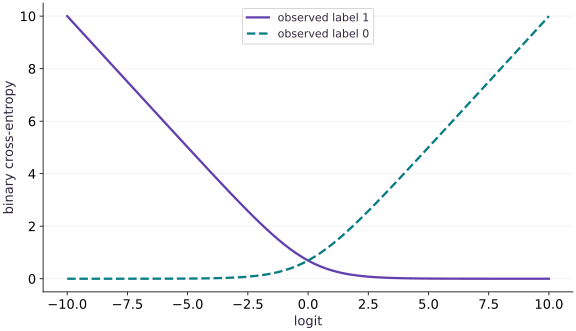

# Probability, likelihood, and stable losses

Phase 04: Math & optimization · about 80 minutes · CPU

## What you will be able to do

- Derive binary cross-entropy from a probability model and compute it safely from logits.
- Read likelihood as support for the observed data
- Move from probabilities to logits
- Avoid overflowing intermediate values
- Extend the idea without overstating it

## The problem

A classifier should tell us how strongly it believes a label, not only which label it chooses. How do we turn that belief into a loss? We will start with a yes-or-no event, derive the penalty for a prediction, and discover why an algebraically correct formula can fail on a computer.

## The idea

A classification loss rewards probability assigned to the observed outcome. A logit is an unconstrained score that becomes a probability through a link such as the sigmoid. Stable formulas let us compute the same objective without overflowing or taking the logarithm of a rounded zero.

## Connect a logit to the observed label

For a binary label of one, predicting probability $0.5$ gives loss $-\log(0.5)\approx0.693$. Predicting $0.9$ gives about $0.105$. If the observed label is instead zero, that same $0.9$ prediction gives $-\log(0.1)\approx2.303$. Confidence helps only when it supports the observed outcome.

At logit zero, the sigmoid gives $0.5$, so either binary label has the same loss. Moving the logit right helps the positive label and hurts the negative one. Follow the correct label's curve rather than treating a lower curve as universally better.

Extreme logits expose numerical differences between mathematically equivalent formulas. Prefer a stable logit-based loss and verify it against moderate-value hand calculations before exploring extreme cases.

### Pause and reason

Can an accurate classifier still produce poorly calibrated probabilities?

<details><summary>Compare your reasoning</summary>

Yes. Correct top-label decisions do not determine whether predicted probabilities match observed frequencies. Classification accuracy and probability quality require different checks.

</details>

## Read likelihood as support for the observed data

The Bernoulli model writes the probability of an observed label as $p^y(1-p)^{1-y}$. If the label is $1$, predictions $p=0.8$ and $p=0.2$ incur losses about $0.2231$ and $1.6094$, respectively. Both can be compared even before applying a classification threshold. For independent observations conditional on their inputs and model parameters, likelihoods multiply. Taking negative logarithms turns the product into a sum; dividing by the sample count gives a mean.

$$
\ell(p,y)=-y\log p-(1-y)\log(1-p)
$$

## Move from probabilities to logits

A logit $z$ is an unrestricted real score. The sigmoid maps it into a probability: $p=1/(1+e^{-z})$. At $z=0$, the probability is $1/2$ and either binary label has loss $\log 2$. For a positive label, differentiating the loss gives $p-1$, so gradient descent increases the logit. More generally the derivative is $p-y$. A very wrong, confident prediction still supplies a useful gradient.

$$
\ell(z,y)=\operatorname{softplus}(z)-yz,\qquad \frac{\partial\ell}{\partial z}=\operatorname{sigmoid}(z)-y
$$

## Avoid overflowing intermediate values

Computing `log(sigmoid(z))` directly can take a logarithm of a rounded zero. For $z=-100$ and $y=1$, the correct loss is close to $100$, not infinity. Use `jax.nn.softplus` or an established logits-based loss. The equivalent expression below explains the stability: its exponential argument is never positive. We use the library softplus for differentiation rather than hand-assembling `maximum` and `abs`, whose derivative conventions at a tie need care.

$$
\operatorname{softplus}(z)=\max(z,0)+\log(1+e^{-|z|})
$$

## Extend the idea without overstating it

For mutually exclusive classes, the probability of class $k$ is the softmax of its score $z_k$. Use `jax.nn.log_softmax` and select the observed class. Adding the same constant to every score must not change the probabilities or loss. A low training cross-entropy is not proof of calibration or generalization; check held-out predictions. Squared error also has a likelihood interpretation under independent Gaussian errors with fixed variance, but that assumption differs from the Bernoulli model.

$$
\ell(z,y)=\log\!\left(\sum_k e^{z_k}\right)-z_y
$$

## Write a loss from logits

Create main.py. Start at an uncertain prediction so you can verify the answer by hand.

```python
import jax
import jax.numpy as jnp
import optax

def binary_loss(z, y):
    return jax.nn.softplus(z) - y * z
z = jnp.array(0.0)
y = jnp.array(1.0)
assert jnp.allclose(binary_loss(z, y), jnp.log(2.0))
```

A balanced probability assigns loss $\log 2$ to either outcome.

## Check the derivative independently

Append the analytic gradient and a library comparison at moderate scores.

```python
assert jnp.allclose(jax.grad(binary_loss)(z, y), -0.5)
logits = jnp.array([-2.0, 0.0, 2.0])
labels = jnp.array([0.0, 1.0, 1.0])
analytic = jax.nn.sigmoid(logits) - labels
actual = jax.vmap(jax.grad(binary_loss))(logits, labels)
assert jnp.allclose(actual, analytic, atol=1e-06)
assert jnp.allclose(binary_loss(logits, labels), optax.sigmoid_binary_cross_entropy(logits, labels), atol=1e-06)
```

The derivative points toward assigning more probability to the observed label.

## Check a confident mistake

Append the extreme case and run python main.py.

```python
assert jnp.allclose(binary_loss(jnp.array(-100.0), jnp.array(1.0)), 100.0)
assert jnp.allclose(jax.grad(binary_loss)(jnp.array(-100.0), jnp.array(1.0)), -1.0)
print('uncertain loss / confident-wrong loss:', binary_loss(z, y), binary_loss(-100.0, 1.0))
```

The confident mistake has a large finite loss and derivative near $-1$.

## Run the example

```python
import jax
import jax.numpy as jnp
import optax

def binary_loss(z, y):
    return jax.nn.softplus(z) - y * z
z = jnp.array(0.0)
y = jnp.array(1.0)
assert jnp.allclose(binary_loss(z, y), jnp.log(2.0))

assert jnp.allclose(jax.grad(binary_loss)(z, y), -0.5)
logits = jnp.array([-2.0, 0.0, 2.0])
labels = jnp.array([0.0, 1.0, 1.0])
analytic = jax.nn.sigmoid(logits) - labels
actual = jax.vmap(jax.grad(binary_loss))(logits, labels)
assert jnp.allclose(actual, analytic, atol=1e-06)
assert jnp.allclose(binary_loss(logits, labels), optax.sigmoid_binary_cross_entropy(logits, labels), atol=1e-06)

assert jnp.allclose(binary_loss(jnp.array(-100.0), jnp.array(1.0)), 100.0)
assert jnp.allclose(jax.grad(binary_loss)(jnp.array(-100.0), jnp.array(1.0)), -1.0)
print('uncertain loss / confident-wrong loss:', binary_loss(z, y), binary_loss(-100.0, 1.0))
```

Expected: Uncertain loss about $0.6931$; confident-wrong loss $100$.

## Confidence is rewarded only when it matches the label

**Predict:** For a positive label, which direction should the logit move?



**Recorded CPU computation**

### Read the figure

The horizontal axis is a logit, which becomes the predicted probability of label $1$ after a sigmoid. The vertical axis is binary cross-entropy loss. The solid curve assumes the observed label is $1$; the dashed curve assumes it is $0$.

At logit $0$, the predicted probability is $0.5$, and both losses are $\log 2\approx0.693$. Moving right lowers the loss for observed label $1$ but raises it for observed label $0$. At logit $10$, the latter loss is about $10$, while the former is close to zero.

### Connect it to the computation

A large positive logit strongly favors label $1$. That confidence is rewarded only if label $1$ is actually observed. For label $0$, the same confidence is a large mistake. The mirror-image curves make the dependence on the target explicit.

Loss is not a probability or classification accuracy, so values above $1$ are valid. The near-flat parts approach zero without implying an exact zero probability for the other class. Computing this loss from logits with a stable formula avoids unnecessary overflow or taking the logarithm of a rounded zero.

```python
grid = jnp.linspace(-10.0, 10.0, 81)
visual_data = {'kind': 'line', 'x': grid.tolist(), 'xlabel': 'logit', 'ylabel': 'binary cross-entropy', 'series': [{'label': 'observed label 1', 'y': binary_loss(grid, 1.0).tolist()}, {'label': 'observed label 0', 'y': binary_loss(grid, 0.0).tolist()}]}
```

## Recorded reference execution

CPU run: 2026-10-06T22:59:18.512589+00:00. JAX 0.9.2.

```text
uncertain loss / confident-wrong loss: 0.6931472 100.0
uncertain loss / confident-wrong loss: 0.6931472 100.0
PASS: optimization-09

```

## Break the probability-first implementation

**Predict before running:** What happens when a positive logit of $100$ is passed through sigmoid before taking the log-probability of label $0$?

```python
p = jax.nn.sigmoid(jnp.array(100.0))
naive = -jnp.log(1 - p)
stable = binary_loss(jnp.array(100.0), jnp.array(0.0))
assert not jnp.isfinite(naive)
assert jnp.isfinite(stable) and jnp.allclose(stable, 100.0)
```

**Expected:** The naive loss is infinite; the logits-based loss remains finite.

A stable final answer requires stable intermediate computations.

## Shift every class score

**Predict before running:** Will adding $1000$ to all class scores change the predicted probabilities?

```python
scores = jnp.array([1.0, 2.0, 3.0])
target = 2
nll = -jax.nn.log_softmax(scores)[target]
shifted = -jax.nn.log_softmax(scores + 1000.0)[target]
assert jnp.allclose(nll, shifted, atol=1e-06)
reference_loss = jnp.log(jnp.exp(-2.0) + jnp.exp(-1.0) + 1.0)
assert jnp.allclose(nll, reference_loss, atol=1e-06)
```

**Expected:** Both losses are about $0.4076$.

Only relative class scores matter. Stable log-softmax respects this invariance.

## Make it yours

Compute the binary losses for positive labels at probabilities $0.8$ and $0.2$, and explain which prediction is better supported.

<details><summary>Reference solution</summary>

```python
probabilities = jnp.array([0.8, 0.2])
z_from_p = jnp.log(probabilities) - jnp.log1p(-probabilities)
assert jnp.allclose(binary_loss(z_from_p, 1.0), -jnp.log(probabilities), atol=1e-06)
assert binary_loss(z_from_p[0], 1.0) < binary_loss(z_from_p[1], 1.0)
```

</details>

## Fit a constant probability

**Transfer / diagnosis**

A dataset contains labels $(1,1,1,0)$. For a model with one constant logit, show that $p=3/4$ is stationary and has less mean loss than $p=1/2$.

<details><summary>Hint</summary>

The mean gradient is $p-\bar y$. Convert the desired probability to log-odds.

</details>

<details><summary>Reference solution and reasoning</summary>

```python
ys = jnp.array([1.0, 1.0, 1.0, 0.0])
constant_loss = lambda z: jnp.mean(binary_loss(z, ys))
optimum = jnp.log(3.0)
assert jnp.allclose(jax.grad(constant_loss)(optimum), 0.0, atol=1e-06)
assert constant_loss(optimum) < constant_loss(jnp.array(0.0))
```

The constant model matches the observed class frequency. It has learned no feature-dependent discrimination.

</details>

## Catch a reduction mistake

**Transfer / diagnosis**

Duplicate every observation. Verify that mean loss stays fixed while total loss doubles. What happens to gradients?

<details><summary>Hint</summary>

The mean divides by the new observation count; the sum does not.

</details>

<details><summary>Reference solution and reasoning</summary>

```python
zs = jnp.array([-1.0, 2.0])
ys2 = jnp.array([0.0, 1.0])
original = binary_loss(zs, ys2)
doubled = binary_loss(jnp.tile(zs, 2), jnp.tile(ys2, 2))
assert jnp.allclose(jnp.mean(original), jnp.mean(doubled))
assert jnp.allclose(jnp.sum(doubled), 2 * jnp.sum(original))
mean_grad = lambda z: jax.grad(lambda t: jnp.mean(binary_loss(t * z, ys2)))(1.0)
duplicated_grad = jax.grad(lambda t: jnp.mean(binary_loss(t * jnp.tile(zs, 2), jnp.tile(ys2, 2))))(1.0)
assert jnp.allclose(mean_grad(zs), duplicated_grad)
```

Reduction conventions affect gradient scale and learning-rate interpretation; record them with the objective.

</details>

## Check your understanding

Why compute binary cross-entropy from logits?

1. It makes all classifications correct
2. It avoids unstable probability and logarithm intermediates
3. It removes the need for held-out evaluation

<details><summary>Answer and explanation</summary>

It avoids unstable probability and logarithm intermediates

A logits-based implementation can stay finite for confident mistakes even when probabilities round to zero or one. It does not fix a poor model.

</details>

## Diagnose the result

If loss becomes infinite, inspect logits and intermediate probabilities before clipping targets or shrinking the learning rate. Check label range, class axis and reduction. Keep stability checks separate from calibration and accuracy measurements.

## Carry forward

- A stable final answer requires stable intermediate computations.
- Only relative class scores matter. Stable log-softmax respects this invariance.

## Keep your evidence

Keep the hand log-loss, analytic gradient, extreme-logit failure/repair, multiclass shift check and empirical-probability calculation.

Keep predictions, modified code, observed results, and reasoning. A checkpoint alone does not demonstrate the exercise.

## Primary references

- [JAX softplus](https://docs.jax.dev/en/latest/_autosummary/jax.nn.softplus.html)
- [Optax losses](https://optax.readthedocs.io/en/latest/api/losses.html)

