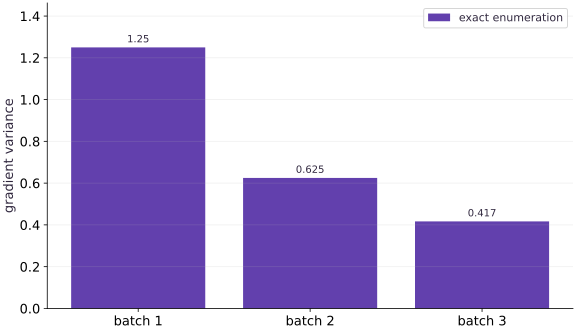

# Minibatches, expectation, and gradient noise

Phase 04: Math & optimization · about 75 minutes · CPU

## What you will be able to do

- Explain an unbiased minibatch gradient and verify how sampling and reduction affect its variance.
- Define the population before estimating it
- Make the independence assumption explicit
- Weight unequal batches by example count
- Separate noise, replay and progress

## The problem

A minibatch may suggest a different update from the full dataset. Is it wrong, or is it a noisy estimate? We will enumerate every possible tiny batch so expectation and variance become quantities you can inspect rather than claims you have to trust.

## The idea

A minibatch gradient estimates the full-data gradient using fewer examples. Its noise depends on the sampling scheme and batch size. When combining batches, the denominator must still represent the population you intend to average over.

## Average examples rather than batch averages

Suppose one batch has two examples with mean loss $1$, and another has one example with loss $4$. Averaging batch means gives $2.5$. The mean over all three examples is $(2+4)/3=2$. The first calculation gave the small batch too much weight.

Carry loss sums and example counts through aggregation, then divide once. For token losses, carry valid-token counts instead: examples and tokens are different denominators when lengths vary. The same weighting issue appears when combining gradients across devices.

The variance plot illustrates the benefit of averaging under its stated sampling assumptions. Correlated examples, sampling without replacement, and nonuniform sampling can change the relationship. Batch size alone does not fully describe the estimator.

### Pause and reason

Why might doubling batch size fail to halve observed gradient variance?

<details><summary>Compare your reasoning</summary>

The usual inverse-size relationship assumes a particular sampling model, often independent samples. Correlation, finite-population effects, changing parameters or too few repeated measurements can alter the observed ratio.

</details>

## Define the population before estimating it

Use the per-example loss $\ell(w,y)=\tfrac12(w-y)^2$ with targets $(1,2,3,4)$. At $w=0$, the per-example gradients are $(-1,-2,-3,-4)$. Their mean is $-2.5$, and their population variance is $1.25$: average the squared deviations from the mean, dividing by $4$. This finite training dataset is the population for our sampling experiment, not the population of all future data.

$$
g=\frac1n\sum_{i=1}^n g_i,\qquad \operatorname{Var}(g_i)=\frac1n\sum_{i=1}^n(g_i-g)^2
$$

## Make the independence assumption explicit

Draw $B$ examples independently and uniformly with replacement, where $B$ is the batch size. Repeated examples are allowed. The batch gradient $\hat g$ has expectation $g$ and variance $\operatorname{Var}(g_i)/B$. For $B=2$, enumerate all $16$ ordered pairs. The batch variance is $0.625$. Sampling without replacement follows a different variance formula; correlated samples can reduce the benefit of averaging.

$$
\mathbb{E}[\hat g]=g,\qquad \operatorname{Var}(\hat g)=\frac{\operatorname{Var}(g_i)}{B}
$$

## Weight unequal batches by example count

A batch mean over three examples and a batch mean over one example should not receive equal weight when reconstructing the dataset mean. Our first three gradients average to $-2$, while the last is $-4$. Averaging those means gives $-3$, which is wrong. Weighting by counts gives $(3(-2)+1(-4))/4=-2.5$. The same issue appears when accumulating gradients or aggregating metrics across devices.

## Separate noise, replay and progress

A random key records a reproducible sampling choice; reusing it repeats that choice. Split keys for fresh batches. An individual minibatch update can worsen the full loss even though its gradient is unbiased at the current parameters. Log full or held-out evaluation at defined intervals instead of expecting a monotone minibatch curve. Unbiasedness alone does not prove convergence, and changing batch size can change both compute cost and optimization behavior.

## Compute per-example gradients

Create main.py. Keep the parameter fixed while measuring the sampling distribution.

```python
# Step 1 — Compute per-example gradients: Each example supplies a slope; the dataset objective uses their mean.
# Import jax for this computation.
import jax
import jax.numpy as jnp
# Construct `y` via `jnp.array([1.0, 2.0, 3.0, 4.0])`
y = jnp.array([1.0, 2.0, 3.0, 4.0])
# Construct `w` via `jnp.array(0.0)`
w = jnp.array(0.0)

# Function `example_loss(w, y)` implementing this stage's computation:
def example_loss(w, y):
    # Return `0.5 * (w - y) ** 2` to the caller.
    return 0.5 * (w - y) ** 2
# Differentiate the objective to obtain `per` via automatic differentiation.
per = jax.vmap(jax.grad(example_loss), in_axes=(None, 0))(w, y)
# Differentiate the objective to obtain `full` via automatic differentiation.
full = jax.grad(lambda w: jnp.mean(jax.vmap(example_loss, in_axes=(None, 0))(w, y)))(w)
# Verify that the numerical values match the expected reference within tolerance.
assert jnp.allclose(per, jnp.array([-1.0, -2.0, -3.0, -4.0]))
# Check numerical equivalence within tolerance: `jnp.allclose(full, -2.5)`
assert jnp.allclose(full, -2.5)
```

Each example supplies a slope; the dataset objective uses their mean.

## Enumerate every pair

Append the exact with-replacement distribution. No random simulation is needed for this check.

```python
# Step 2 — Enumerate every pair: All ordered pairs are equally likely under independent uniform draws.
pairs = (per[:, None] + per[None, :]) / 2
# Check tensor shape invariant: `pairs.shape == (4, 4)`
assert pairs.shape == (4, 4)
# Check numerical equivalence within tolerance: `jnp.allclose(jnp.mean(pairs), full)`
assert jnp.allclose(jnp.mean(pairs), full)
# Check numerical equivalence within tolerance: `jnp.allclose(jnp.var(per), 1.25)`
assert jnp.allclose(jnp.var(per), 1.25)
# Check numerical equivalence within tolerance: `jnp.allclose(jnp.var(pairs), 0.625)`
assert jnp.allclose(jnp.var(pairs), 0.625)
```

All ordered pairs are equally likely under independent uniform draws.

## Sample and replay one batch

Append a PRNG example and run python main.py.

```python
# Step 3 — Sample and replay one batch: Replay checks reproducibility.
# Create or split explicit PRNG key(s) (`key`) for reproducible randomness.
key = jax.random.key(7)
# Sample deterministic random values into `indices` using an explicit PRNG key.
indices = jax.random.choice(key, 4, shape=(2,), replace=True)
# Sample deterministic random values into `replay` using an explicit PRNG key.
replay = jax.random.choice(key, 4, shape=(2,), replace=True)
# Assert invariant `jnp.array_equal(indices, replay)` holds
assert jnp.array_equal(indices, replay)
# Print the observed values to compare against the expected result.
print('full gradient / single variance / pair variance:', full, jnp.var(per), jnp.var(pairs))
# Print diagnostic summary of the computed outputs.
print('sample indices / sample gradient:', indices, jnp.mean(per[indices]))
```

Replay checks reproducibility. One sample does not estimate the full sampling distribution.

## Run the example

```python
# Step 1 — Compute per-example gradients: Each example supplies a slope; the dataset objective uses their mean.
# Import jax for this computation.
import jax
import jax.numpy as jnp
# Construct `y` via `jnp.array([1.0, 2.0, 3.0, 4.0])`
y = jnp.array([1.0, 2.0, 3.0, 4.0])
# Construct `w` via `jnp.array(0.0)`
w = jnp.array(0.0)

# Function `example_loss(w, y)` implementing this stage's computation:
def example_loss(w, y):
    # Return `0.5 * (w - y) ** 2` to the caller.
    return 0.5 * (w - y) ** 2
# Differentiate the objective to obtain `per` via automatic differentiation.
per = jax.vmap(jax.grad(example_loss), in_axes=(None, 0))(w, y)
# Differentiate the objective to obtain `full` via automatic differentiation.
full = jax.grad(lambda w: jnp.mean(jax.vmap(example_loss, in_axes=(None, 0))(w, y)))(w)
# Verify that the numerical values match the expected reference within tolerance.
assert jnp.allclose(per, jnp.array([-1.0, -2.0, -3.0, -4.0]))
# Check numerical equivalence within tolerance: `jnp.allclose(full, -2.5)`
assert jnp.allclose(full, -2.5)

# Step 2 — Enumerate every pair: All ordered pairs are equally likely under independent uniform draws.
pairs = (per[:, None] + per[None, :]) / 2
# Check tensor shape invariant: `pairs.shape == (4, 4)`
assert pairs.shape == (4, 4)
# Check numerical equivalence within tolerance: `jnp.allclose(jnp.mean(pairs), full)`
assert jnp.allclose(jnp.mean(pairs), full)
# Check numerical equivalence within tolerance: `jnp.allclose(jnp.var(per), 1.25)`
assert jnp.allclose(jnp.var(per), 1.25)
# Check numerical equivalence within tolerance: `jnp.allclose(jnp.var(pairs), 0.625)`
assert jnp.allclose(jnp.var(pairs), 0.625)

# Step 3 — Sample and replay one batch: Replay checks reproducibility.
# Create or split explicit PRNG key(s) (`key`) for reproducible randomness.
key = jax.random.key(7)
# Sample deterministic random values into `indices` using an explicit PRNG key.
indices = jax.random.choice(key, 4, shape=(2,), replace=True)
# Sample deterministic random values into `replay` using an explicit PRNG key.
replay = jax.random.choice(key, 4, shape=(2,), replace=True)
# Assert invariant `jnp.array_equal(indices, replay)` holds
assert jnp.array_equal(indices, replay)
# Print the observed values to compare against the expected result.
print('full gradient / single variance / pair variance:', full, jnp.var(per), jnp.var(pairs))
# Print diagnostic summary of the computed outputs.
print('sample indices / sample gradient:', indices, jnp.mean(per[indices]))
```

Expected: Full gradient $-2.5$; variances $1.25$ for one example and $0.625$ for two independent draws.

## Averaging independent gradients reduces variance

**Predict:** How much variance remains when the batch grows from $1$ to $2$?



**Recorded CPU computation**

### Read the figure

The horizontal categories are batch sizes $1$, $2$, and $3$. The vertical axis is the variance of the estimated gradient at one fixed weight. The bar heights are $1.25$, $0.625$, and approximately $0.417$, respectively.

Doubling the batch size from $1$ to $2$ halves the variance. Tripling it divides the variance by $3$. These are exact enumerations of the possible sampled batches in this small example, rather than noisy estimates from a handful of trials.

### Connect it to the computation

Each batch averages independent, uniformly sampled per-example gradients with replacement. Under those assumptions, the variance of the average is the single-example variance divided by batch size. Its expected gradient remains $-2.5$ for all three sizes; the estimate becomes less variable without changing its mean.

The bar heights are squared gradient units, not loss or gradient magnitude. A shorter bar does not mean a smaller learning rate or a faster overall training run. Sampling without replacement, correlated examples, and changing parameters require a different variance analysis.

```python
# Compute figure data for: Averaging independent gradients reduces variance
# Compute `triples` from `(per[:, None, None] + per[None, :, None] + per[None,...`
triples = (per[:, None, None] + per[None, :, None] + per[None, None, :]) / 3
# Reduce across the target axis to summarize `visual_data`.
visual_data = {'kind': 'bar', 'labels': ['batch 1', 'batch 2', 'batch 3'], 'ylabel': 'gradient variance', 'series': [{'label': 'exact enumeration', 'y': [float(jnp.var(per)), float(jnp.var(pairs)), float(jnp.var(triples))]}]}
```

## Recorded reference execution

CPU run: 2026-10-08T14:02:17.617251+00:00. JAX 0.9.2.

```text
full gradient / single variance / pair variance: -2.5 1.25 0.625
sample indices / sample gradient: [3 2] -3.5
full gradient / single variance / pair variance: -2.5 1.25 0.625
sample indices / sample gradient: [3 2] -3.5
PASS: optimization-11

```

## Combine unequal batches

**Predict before running:** Will an unweighted mean of the two batch means recover the full gradient?

```python
# Experiment — Combine unequal batches: Batch means require example-count weights when batch sizes differ.
# Aggregate array values to compute `first`.
first = jnp.mean(per[:3])
# Aggregate array values to compute `last`.
last = jnp.mean(per[3:])
# Compute `wrong` from `(first + last) / 2`
wrong = (first + last) / 2
# Compute `correct` from `(3 * first + last) / 4`
correct = (3 * first + last) / 4
# Verify that the numerical values match the expected reference within tolerance.
assert jnp.allclose(wrong, -3.0)
# Check numerical equivalence within tolerance: `jnp.allclose(correct, full)`
assert jnp.allclose(correct, full)
```

**Expected:** The unweighted result is $-3$, while count weighting recovers $-2.5$.

Batch means require example-count weights when batch sizes differ.

## Take a noisy step at the full optimum

**Predict before running:** At the full-data optimum $w=2.5$, does a step toward target $1$ improve the full loss?

```python
# Experiment — Take a noisy step at the full optimum: A noisy gradient may point away from the full optimum on a...
# Aggregate array values to compute `full_loss`.
full_loss = lambda w: jnp.mean(0.5 * (w - y) ** 2)
# Construct `optimum` via `jnp.array(2.5)`
optimum = jnp.array(2.5)
# Differentiate the objective to obtain `noisy` via automatic differentiation.
noisy = optimum - 0.1 * jax.grad(example_loss)(optimum, y[0])
# Verify that the numerical values match the expected reference within tolerance.
assert jnp.allclose(jax.grad(full_loss)(optimum), 0.0)
# Assert invariant `full_loss(noisy) > full_loss(optimum)` holds
assert full_loss(noisy) > full_loss(optimum)
```

**Expected:** The single-example step increases the full-data loss.

A noisy gradient may point away from the full optimum on a particular draw.

## Make it yours

Enumerate all $64$ ordered batches of size $3$. Check their mean and variance against the independent-sampling formula.

### How to write this exercise — Step-by-step recipe & starter scaffold

**Key functions & syntax to use:**
- `x.sum(axis=...) / x.mean(axis=..., keepdims=...)` — Reduces values along the named `axis` (the axis you name is collapsed unless `keepdims=True`).
- `jnp.allclose(actual, expected, rtol=..., atol=...)` — Checks that two arrays match elementwise within floating-point tolerance.

**Step-by-step implementation plan:**
1. Assert invariant `triples.size == 64` holds
2. Check numerical equivalence within tolerance: `jnp.allclose(jnp.mean(triples), full, atol=1e-06)`
3. Check numerical equivalence within tolerance: `jnp.allclose(jnp.var(triples), 1.25 / 3, atol=1e-06)`

**Starter code scaffold (fill in the TODOs):**

```python
# Exercise solution: Enumerate all 64 ordered batches of size 3.
triples = ...  # TODO: compute triples
# Assert invariant `triples.size == 64` holds
assert triples.size  # TODO: complete assertion check
# Check numerical equivalence within tolerance: `jnp.allclose(jnp.mean(triples), full, atol=1e-06)`
assert jnp.allclose(jnp.mean(triples), full, atol=1e-06)  # TODO: complete assertion check
# Check numerical equivalence within tolerance: `jnp.allclose(jnp.var(triples), 1.25 / 3, atol=1e-06)`
assert jnp.allclose(jnp.var(triples), 1.25 / 3, atol=1e-06)  # TODO: complete assertion check
```

<details><summary>Reference solution</summary>

```python
# Exercise solution: Enumerate all 64 ordered batches of size 3.
triples = (per[:, None, None] + per[None, :, None] + per[None, None, :]) / 3
# Assert invariant `triples.size == 64` holds
assert triples.size == 64
# Check numerical equivalence within tolerance: `jnp.allclose(jnp.mean(triples), full, atol=1e-06)`
assert jnp.allclose(jnp.mean(triples), full, atol=1e-06)
# Check numerical equivalence within tolerance: `jnp.allclose(jnp.var(triples), 1.25 / 3, atol=1e-06)`
assert jnp.allclose(jnp.var(triples), 1.25 / 3, atol=1e-06)
```

</details>

## Accumulate before updating

**Transfer / diagnosis**

At the same fixed $w$, accumulate gradients from microbatches of sizes $3$ and $1$. Verify that one update matches the full-batch update.

<details><summary>Hint</summary>

Do not update parameters between microbatches. Weight each mean by its sample count.

</details>

### How to write: Accumulate before updating — Step-by-step recipe & starter scaffold

**Key functions & syntax to use:**
- `x.sum(axis=...) / x.mean(axis=..., keepdims=...)` — Reduces values along the named `axis` (the axis you name is collapsed unless `keepdims=True`).
- `jnp.allclose(actual, expected, rtol=..., atol=...)` — Checks that two arrays match elementwise within floating-point tolerance.
- `jax.grad(loss_fn)(params, ...)` — Transforms a scalar-output function into a function returning the gradient PyTree with the same structure as `params`.

**Step-by-step implementation plan:**
1. Differentiate the objective to obtain `g1` via automatic differentiation.
2. Differentiate the objective to obtain `g2` via automatic differentiation.
3. Compute `accumulated` from `(3 * g1 + g2) / 4`
4. Verify that the numerical values match the expected reference within tolerance.

**Starter code scaffold (fill in the TODOs):**

```python
# Accumulate before updating (Transfer / diagnosis): Exact accumulation matches the full mean gradient only when...
# Differentiate the objective to obtain `g1` via automatic differentiation.
g1 = jax.grad(...)  # TODO: compute g1
# Differentiate the objective to obtain `g2` via automatic differentiation.
g2 = jax.grad(...)  # TODO: compute g2
# Compute `accumulated` from `(3 * g1 + g2) / 4`
accumulated = ...  # TODO: compute accumulated
# Verify that the numerical values match the expected reference within tolerance.
assert jnp.allclose(w - 0.1 * accumulated, w - 0.1 * full)  # TODO: complete assertion check
```

<details><summary>Reference solution and reasoning</summary>

```python
# Accumulate before updating (Transfer / diagnosis): Exact accumulation matches the full mean gradient only when...
# Differentiate the objective to obtain `g1` via automatic differentiation.
g1 = jax.grad(lambda z: jnp.mean(0.5 * (z - y[:3]) ** 2))(w)
# Differentiate the objective to obtain `g2` via automatic differentiation.
g2 = jax.grad(lambda z: jnp.mean(0.5 * (z - y[3:]) ** 2))(w)
# Compute `accumulated` from `(3 * g1 + g2) / 4`
accumulated = (3 * g1 + g2) / 4
# Verify that the numerical values match the expected reference within tolerance.
assert jnp.allclose(w - 0.1 * accumulated, w - 0.1 * full)
```

Exact accumulation matches the full mean gradient only when all microbatches use the same parameters and the reduction is correct.

</details>

## Detect a biased sampler

**Transfer / diagnosis**

A sampler chooses targets $1$ and $4$ with probabilities $0.9$ and $0.1$, never the others. Compute its expected gradient. Does it estimate the uniform dataset gradient?

<details><summary>Hint</summary>

Use the sampling probabilities as weights. Missing examples cannot be recovered by naive averaging.

</details>

### How to write: Detect a biased sampler — Step-by-step recipe & starter scaffold

**Key functions & syntax to use:**
- `jnp.allclose(actual, expected, rtol=..., atol=...)` — Checks that two arrays match elementwise within floating-point tolerance.

**Step-by-step implementation plan:**
1. Verify that the numerical values match the expected reference within tolerance.
2. Check numerical equivalence within tolerance: `not jnp.allclose(biased, full)`

**Starter code scaffold (fill in the TODOs):**

```python
# Detect a biased sampler (Transfer / diagnosis): Uniform mean-gradient claims require the corresponding...
biased = ...  # TODO: compute biased
# Verify that the numerical values match the expected reference within tolerance.
assert jnp.allclose(biased, -1.3)  # TODO: complete assertion check
# Check numerical equivalence within tolerance: `not jnp.allclose(biased, full)`
assert not jnp.allclose(biased, full)  # TODO: complete assertion check
```

<details><summary>Reference solution and reasoning</summary>

```python
# Detect a biased sampler (Transfer / diagnosis): Uniform mean-gradient claims require the corresponding...
biased = 0.9 * per[0] + 0.1 * per[3]
# Verify that the numerical values match the expected reference within tolerance.
assert jnp.allclose(biased, -1.3)
# Check numerical equivalence within tolerance: `not jnp.allclose(biased, full)`
assert not jnp.allclose(biased, full)
```

Uniform mean-gradient claims require the corresponding sampling assumptions. A biased sampler changes the expected objective unless properly corrected.

</details>

## Check your understanding

When does averaging batch means reproduce the dataset mean?

1. Always
2. When batch sizes are equal, or the means are weighted by their example counts
3. Only with Adam

<details><summary>Answer and explanation</summary>

When batch sizes are equal, or the means are weighted by their example counts

The dataset mean weights examples equally. Unequal batches need count weighting.

</details>

## Diagnose the result

If changing batch size unexpectedly scales the gradient, inspect sum versus mean and accumulation weights. If replay fails, retain the key and sampled indices. If the estimate stays biased over many draws, inspect the sampling distribution rather than only increasing batch size.

## Carry forward

- Batch means require example-count weights when batch sizes differ.
- A noisy gradient may point away from the full optimum on a particular draw.

## Keep your evidence

Keep the exact per-example mean, enumerated batch-variance calculation, uneven-batch repair, PRNG replay and gradient-accumulation check.

Save your predictions, modified code, terminal outputs, and reasoning in your engineering portfolio.

## Primary references

- [JAX random sampling](https://docs.jax.dev/en/latest/_autosummary/jax.random.choice.html)
- [JAX pseudorandom numbers](https://docs.jax.dev/en/latest/random-numbers.html)

