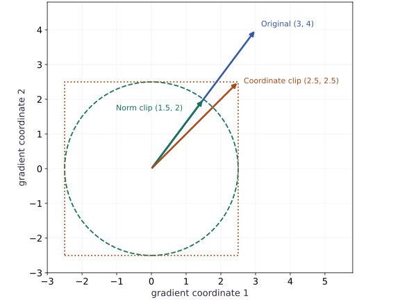
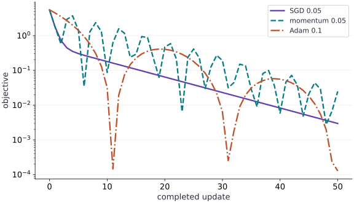

# Adam, clipping, and learning-rate schedules

Phase 04: Math & optimization · about 90 minutes · CPU

## What you will be able to do

- Explain Adam’s moments, inspect clipping and schedule order, and compare optimizers with a controlled update budget.
- Calculate the first two Adam steps
- Clip a direction without rotating it
- Make the schedule clock explicit
- Compare decisions with evidence
- Bring the phase together in a training audit

## The problem

An optimizer can lower the loss while hiding several choices: how it averages gradients, rescales coordinates, clips large values, and changes the step size. We will expose those choices one at a time before running a controlled comparison. The goal is to explain a training decision, not to crown a universal winner.

## The idea

Adam combines gradient history with coordinatewise scaling. Clipping limits a gradient or update according to a chosen rule, while a learning-rate schedule changes scale over training. These mechanisms interact, but we should inspect each separately before interpreting their combined loss curve.

## Clipping changes a vector; a schedule changes a clocked scale

Use the analytic gradient $g=(3,4)$, whose norm is $5$. Global-norm clipping at $2.5$ scales the entire vector to $(1.5,2)$, preserving its direction. Clipping each coordinate to the interval $[-2.5,2.5]$ instead produces $(2.5,2.5)$, whose direction and norm differ.

Now consider four microbatches accumulated into one optimizer update. A schedule indexed by optimizer updates should advance once for that group, not four times. The schedule's clock is part of the algorithm and should be restored with optimizer state.

The existing optimizer plot uses its labeled learning rates and shows nonmonotone trajectories, including rebounds. It compares that specific fixture; it does not demonstrate clipping or scheduling. Use the separate clipping diagram to understand the geometry, then test each mechanism with its own controlled change.

### A norm ball and a coordinate box

**Predict:** Does coordinate clipping at $2.5$ guarantee that the whole gradient norm is at most $2.5$?



*Conceptual / analytic teaching diagram; not a recorded benchmark.*

The blue arrow is $(3,4)$. Green scales it to norm $2.5$ along the same ray. Orange clips each coordinate to $2.5$, landing at the box corner with norm $2.5\sqrt{2}$. The circle and box are analytic constraints, not training measurements.

### Pause and reason

Does coordinate clipping at $2.5$ guarantee that the whole gradient norm is at most $2.5$?

<details><summary>Compare your reasoning</summary>

No. For the clipped vector $(2.5,2.5)$, the norm is $2.5\sqrt{2}$. A coordinate bound describes a box; a global-norm bound describes a ball.

</details>

## Calculate the first two Adam steps

Let $g_t$ be the gradient at update $t$. Adam tracks a first moment $m_t$ and a second raw moment $v_t$, using decay rates $\beta_1$ and $\beta_2$. Starting at zero makes the early averages small; divide by $1-\beta_1^t$ and $1-\beta_2^t$ to correct that bias. At the first step, corrected moments are $g_1$ and $g_1^2$. With a small $\epsilon$, each nonzero coordinate initially moves close to the learning rate in the opposite sign direction. This does not mean later steps ignore magnitude.

$$
\begin{aligned}m_t&=\beta_1m_{t-1}+(1-\beta_1)g_t\\v_t&=\beta_2v_{t-1}+(1-\beta_2)g_t^2\\\hat m_t&=m_t/(1-\beta_1^t),\quad \hat v_t=v_t/(1-\beta_2^t)\\\Delta w_t&=-\eta_t\frac{\hat m_t}{\sqrt{\hat v_t}+\epsilon}\end{aligned}
$$

## Clip a direction without rotating it

Global norm clipping rescales a gradient only when its length exceeds a threshold $c$. For $g=(3,4)$, the norm is $5$, so clipping at $c=1$ gives $(0.6,0.8)$. Coordinate-wise clipping to the same threshold instead gives $(1,1)$, changing direction. Clipping before Adam limits the gradient entering its moments; it does not impose that same bound on the final parameter update. Clipping cannot repair NaNs, wrong labels or a wrong objective.

$$
\tilde g=g\min\!\left(1,\frac{c}{\|g\|_2}\right)\quad\text{for }\|g\|_2>0
$$

## Make the schedule clock explicit

A schedule maps an optimizer update count to a learning rate. Our linear example goes from $0.1$ at count $0$ to $0.01$ at count $4$, then stays there. Count $0$ is the first update, not an epoch. Gradient accumulation changes how many optimizer updates occur per data pass. Restoring only model weights loses the moments and schedule position; retain optimizer state to continue the same run.

## Compare decisions with evidence

Use the same objective, initialization, data and number of updates when comparing SGD, momentum and Adam. Report the loss history and chosen rates; equal updates are not equal wall-clock time, and one rate per method is not a thorough tuning study. An adaptive method does not make scaling or validation irrelevant. Adding an $L_2$ penalty to an Adam loss also differs from decoupled weight decay in AdamW: the penalty gradient is transformed by Adam’s moments, while decoupled decay acts separately on the weights.

## Bring the phase together in a training audit

For the regression audit project, first document feature and target shapes, loss reduction and dtype. Use a direct least-squares fit as a reference when its assumptions match. Check gradients at more than one point, inspect feature scales, and preserve optimizer state for replay. If you introduce a penalty or change the batch size, state how that changes the objective or noise. Finish with separate training and held-out losses, an unstable run, and a short explanation of your choice. The existing project checks a subset of these skills; keep the new lesson evidence alongside it rather than treating a project pass as assessment of all twelve lessons.

## Build a transparent Adam reference

Create main.py. Use an explicit two-gradient sequence to inspect the optimizer independently of a training loop.

```python
import jax
import jax.numpy as jnp
import optax
params = jnp.zeros(2)
adam = optax.adam(0.1, b1=0.9, b2=0.99, eps=1e-08)
state = adam.init(params)
m = jnp.zeros(2)
v = jnp.zeros(2)
gradients = [jnp.array([2.0, -4.0]), jnp.array([1.0, 3.0])]
```

The supplied gradients isolate optimizer arithmetic; they are not presented as a model’s measured training gradients.

## Verify both moment updates

Append the manual recurrences and compare each update with Optax.

```python
for t, g in enumerate(gradients, start=1):
    m = 0.9 * m + 0.1 * g
    v = 0.99 * v + 0.01 * g * g
    expected = -0.1 * (m / (1 - 0.9 ** t)) / (jnp.sqrt(v / (1 - 0.99 ** t)) + 1e-08)
    update, state = adam.update(g, state, params)
    assert jnp.allclose(update, expected, atol=2e-06, rtol=2e-06)
    params = optax.apply_updates(params, update)
    print('step / update:', t, update)
```

The first update is near $(-0.1,0.1)$; the next depends on both gradients.

## Inspect one clipped update

Append a global clipping plus SGD chain and run python main.py.

```python
g = jnp.array([3.0, 4.0])
clip = optax.clip_by_global_norm(1.0)
clipped, _ = clip.update(g, clip.init(jnp.zeros(2)))
assert jnp.allclose(clipped, jnp.array([0.6, 0.8]), atol=1e-06)
chain = optax.chain(optax.clip_by_global_norm(1.0), optax.sgd(0.1))
update, _ = chain.update(g, chain.init(jnp.zeros(2)))
assert jnp.allclose(update, jnp.array([-0.06, -0.08]), atol=1e-06)
```

For this SGD chain, the update norm is $0.1$. That bound does not automatically apply to a chain containing Adam.

## Run the example

```python
import jax
import jax.numpy as jnp
import optax
params = jnp.zeros(2)
adam = optax.adam(0.1, b1=0.9, b2=0.99, eps=1e-08)
state = adam.init(params)
m = jnp.zeros(2)
v = jnp.zeros(2)
gradients = [jnp.array([2.0, -4.0]), jnp.array([1.0, 3.0])]

for t, g in enumerate(gradients, start=1):
    m = 0.9 * m + 0.1 * g
    v = 0.99 * v + 0.01 * g * g
    expected = -0.1 * (m / (1 - 0.9 ** t)) / (jnp.sqrt(v / (1 - 0.99 ** t)) + 1e-08)
    update, state = adam.update(g, state, params)
    assert jnp.allclose(update, expected, atol=2e-06, rtol=2e-06)
    params = optax.apply_updates(params, update)
    print('step / update:', t, update)

g = jnp.array([3.0, 4.0])
clip = optax.clip_by_global_norm(1.0)
clipped, _ = clip.update(g, clip.init(jnp.zeros(2)))
assert jnp.allclose(clipped, jnp.array([0.6, 0.8]), atol=1e-06)
chain = optax.chain(optax.clip_by_global_norm(1.0), optax.sgd(0.1))
update, _ = chain.update(g, chain.init(jnp.zeros(2)))
assert jnp.allclose(update, jnp.array([-0.06, -0.08]), atol=1e-06)
```

Expected: Two Adam updates match the manual moment calculation; the clipped SGD update is $(-0.06,-0.08)$.

## Compare optimizer paths under a fixed update budget

**Predict:** Will equal update counts produce equal loss histories?



**Recorded CPU computation**

### Read the figure

Start with the axes. The horizontal axis counts completed parameter updates; $0$ is the shared starting point. The vertical axis is the objective $L(w)=\tfrac12(w_0^2+10w_1^2)$, so lower is better. It is logarithmic: falling from $10^{-2}$ to $10^{-3}$ means a tenfold reduction, not a decrease of one unit. Zero cannot appear on this scale.

All three methods begin at $w=(1,1)$, with loss $5.5$. The solid SGD curve drops smoothly and then develops a slower tail. With learning rate $0.05$, each update multiplies the two coordinates by $0.95$ and $0.5$. The steep direction shrinks quickly; the flatter direction accounts for the slow remaining progress.

### Connect it to the computation

Now follow the dashed momentum curve. Its loss falls to about $0.568$ at update $2$, then rises to about $3.714$ at update $4$. Momentum retains past gradients, so a favorable current position does not guarantee a favorable next step: the accumulated update can carry the parameters past the minimum. The repeated dips and rebounds occur under a generally declining envelope. They are deterministic optimizer behavior in this example, not noise from shuffled minibatches.

The dash-dot Adam curve makes the same caution especially clear. It reaches about $1.45\times10^{-4}$ at update $11$, then rises to about $0.410$ by update $19$. Adam adapts coordinate-wise update sizes using gradient history, but that history can still move parameters away after a close approach. A deep dip means the current parameters are near the minimum; it does not mean subsequent updates will stay there. The scalar loss alone does not tell us which side of the minimum each coordinate occupies.

At update $50$, the losses are approximately $1.28\times10^{-4}$ for Adam, $2.96\times10^{-3}$ for SGD, and $2.49\times10^{-2}$ for momentum. Adam finishes lowest under these settings, although it was not lowest at every earlier update. Compare the same update budget, read the endpoint as well as the dips, and remember that equal update counts do not imply equal runtime. This figure uses fixed rates without clipping or a schedule; the later experiments examine those separate choices.

```python
def plot_bowl(z):
    return 0.5 * (z[0] ** 2 + 10 * z[1] ** 2)
series = []
for name, tx in [('SGD 0.05', optax.sgd(0.05)), ('momentum 0.05', optax.sgd(0.05, momentum=0.9)), ('Adam 0.1', optax.adam(0.1))]:
    p_plot = jnp.array([1.0, 1.0])
    s_plot = tx.init(p_plot)
    vals = [float(plot_bowl(p_plot))]
    for _ in range(50):
        delta, s_plot = tx.update(jax.grad(plot_bowl)(p_plot), s_plot, p_plot)
        p_plot = optax.apply_updates(p_plot, delta)
        vals.append(float(plot_bowl(p_plot)))
    series.append({'label': name, 'y': vals})
visual_data = {'kind': 'line', 'x': list(range(51)), 'xlabel': 'completed update', 'ylabel': 'objective', 'yscale': 'log', 'series': series}
```

## Recorded reference execution

CPU run: 2026-10-06T15:39:56.989492+00:00. JAX 0.9.2.

```text
step / update: 1 [-0.09999993  0.09999993]
step / update: 2 [-0.09334469  0.00893815]
step / update: 1 [-0.09999993  0.09999993]
step / update: 2 [-0.09334469  0.00893815]
schedule rates: [0.1    0.0775 0.055  0.0325 0.01   0.01  ]
sgd initial / final loss: 5.5 0.0029602647
momentum initial / final loss: 5.5 0.024945451
adam initial / final loss: 5.5 0.00012754407
PASS: optimization-12

```

## Inspect the schedule boundary

**Predict before running:** List the rates used by the first five updates. Is the fifth rate already the final value?

```python
schedule = optax.linear_schedule(init_value=0.1, end_value=0.01, transition_steps=4)
rates = jnp.array([schedule(i) for i in range(6)])
assert jnp.allclose(rates, jnp.array([0.1, 0.0775, 0.055, 0.0325, 0.01, 0.01]), atol=1e-06)
tx = optax.sgd(schedule)
p = jnp.array(0.0)
s = tx.init(p)
for _ in range(5):
    delta, s = tx.update(jnp.array(1.0), s, p)
    p = optax.apply_updates(p, delta)
assert jnp.allclose(p, -0.275, atol=1e-06)
print('schedule rates:', rates)
```

**Expected:** The fifth update uses count $4$ and rate $0.01$.

A schedule is indexed by optimizer updates. Recording only the number of epochs leaves its behavior ambiguous.

## Compare a fixed update budget

**Predict before running:** Will every optimizer produce the same path on a bowl with unequal curvature?

```python
def bowl(w):
    return 0.5 * (w[0] ** 2 + 10 * w[1] ** 2)
start = jnp.array([1.0, 1.0])
optimizers = {'sgd': optax.sgd(0.05), 'momentum': optax.sgd(0.05, momentum=0.9), 'adam': optax.adam(0.1)}
traces = {}
for name, tx in optimizers.items():

    def step(carry, _):
        p, s = carry
        delta, s = tx.update(jax.grad(bowl)(p), s, p)
        p = optax.apply_updates(p, delta)
        return ((p, s), bowl(p))
    (_, _), history = jax.lax.scan(step, (start, tx.init(start)), None, length=50)
    assert jnp.all(jnp.isfinite(history))
    assert history[-1] < bowl(start)
    traces[name] = history
    print(name, 'initial / final loss:', bowl(start), history[-1])
assert not jnp.allclose(traces['sgd'], traces['adam'])
```

**Expected:** All three reduce the loss for these specified settings; the trajectories differ.

This is a controlled demonstration at stated rates and update counts, not evidence that one optimizer universally wins.

## Make it yours

Compare global norm clipping with coordinate-wise clipping on $(3,4)$. Check which preserves the ratio of the coordinates.

<details><summary>Reference solution</summary>

```python
coordinate = jnp.clip(g, -1.0, 1.0)
assert jnp.allclose(coordinate, jnp.array([1.0, 1.0]))
assert jnp.allclose(clipped[0] / clipped[1], g[0] / g[1])
assert not jnp.allclose(coordinate[0] / coordinate[1], g[0] / g[1])
```

</details>

## Catch schedule restart

**Transfer / diagnosis**

After five scheduled SGD steps with constant gradient $1$, compare a retained optimizer state with a freshly initialized state for the next update.

<details><summary>Hint</summary>

The retained count has reached the final rate; a reset count starts at $0$.

</details>

<details><summary>Reference solution and reasoning</summary>

```python
tx = optax.sgd(schedule)
p = jnp.array(0.0)
s = tx.init(p)
for _ in range(5):
    delta, s = tx.update(jnp.array(1.0), s, p)
    p = optax.apply_updates(p, delta)
continued, _ = tx.update(jnp.array(1.0), s, p)
restarted, _ = tx.update(jnp.array(1.0), tx.init(p), p)
assert jnp.allclose(continued, -0.01, atol=1e-06)
assert jnp.allclose(restarted, -0.1, atol=1e-06)
```

Restoring weights without optimizer state can silently restart the learning-rate schedule.

</details>

## Check transformation order

**Transfer / diagnosis**

For gradient $(3,4)$, compare clipping before SGD at rate $0.1$ with clipping after it. Write a decision memo explaining which quantity you intended to bound.

<details><summary>Hint</summary>

The un-clipped SGD update already has norm $0.5$, below the threshold $1$.

</details>

<details><summary>Reference solution and reasoning</summary>

```python
before = optax.chain(optax.clip_by_global_norm(1.0), optax.sgd(0.1))
after = optax.chain(optax.sgd(0.1), optax.clip_by_global_norm(1.0))
u_before, _ = before.update(g, before.init(jnp.zeros(2)))
u_after, _ = after.update(g, after.init(jnp.zeros(2)))
assert jnp.allclose(jnp.linalg.norm(u_before), 0.1, atol=1e-06)
assert jnp.allclose(jnp.linalg.norm(u_after), 0.5, atol=1e-06)
```

Transformation order changes the algorithm. State whether the bound applies to the raw gradient or the parameter update, and retain the observed evidence.

</details>

## Check your understanding

Does clipping gradients before Adam guarantee that final updates obey the same norm threshold?

1. Yes, every later transformation preserves that bound
2. No; Adam subsequently rescales coordinates
3. Only if the loss is a scalar

<details><summary>Answer and explanation</summary>

No; Adam subsequently rescales coordinates

The clipping threshold bounds the incoming gradient. Adam’s stateful rescaling and learning rate determine the final update.

</details>

## Diagnose the result

If a restart changes the trajectory, compare optimizer moments and schedule count. If a clipped run still jumps, measure both gradient and update norms and inspect transformation order. Record rates, reductions, dtype and validation behavior before recommending a method.

## Carry forward

- A schedule is indexed by optimizer updates. Recording only the number of epochs leaves its behavior ambiguous.
- This is a controlled demonstration at stated rates and update counts, not evidence that one optimizer universally wins.

## Keep your evidence

Keep two hand-checked Adam steps, clipping-direction checks, schedule values and boundary, equal-budget loss traces, and the optimization decision memo.

Keep predictions, modified code, observed results, and reasoning. A checkpoint alone does not demonstrate the exercise.

## Primary references

- [Optax Adam](https://optax.readthedocs.io/en/latest/api/optimizers.html#optax.adam)
- [Optax transformations](https://optax.readthedocs.io/en/latest/api/transformations.html)
- [Optax schedules](https://optax.readthedocs.io/en/latest/api/optimizer_schedules.html)

