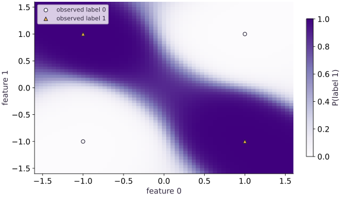

# Build a tiny multilayer perceptron

Phase 05: Neural network training · about 85 minutes · CPU

## What you will be able to do

- Trace the shapes from observations to logits
- Explain why the hidden activation matters
- Use stable binary cross-entropy
- Separate learning from held-out measurement

## The problem

Four points can give us a useful puzzle: how do we separate the two diagonal pairs in XOR? A single straight line cannot do it. We’ll add a small hidden layer and a nonlinear activation, check the shapes, and train a classifier. Then we’ll test nearby points to see what it has learned beyond the four training examples.

## The idea

A multilayer perceptron composes affine maps with a nonlinear activation. Keep the parameter tree visible so a gradient, an optimizer update, and a prediction can be inspected separately. This is a controlled synthetic experiment, not evidence of useful real-world classification.

## Trace the shapes from observations to logits

Each row is one observation with two features. The first weight matrix has shape $(2, 8)$, so a batch $(B, 2)$ becomes $(B, 8)$. A bias vector $(8,)$ broadcasts across rows; it does not create eight observations. tanh changes values without changing shape. The second matrix $(8, 1)$ produces one logit per row. Squeeze only the final axis to produce $(B,)$, preserving the batch dimension even when $B$ is one. A logit is an unrestricted real score; a positive logit predicts class one when the decision threshold is probability $0.5$.

```text
(B, 2) → affine → (B, 8) → tanh → (B, 8) → affine → (B, 1) → (B,)
```

## Explain why the hidden activation matters

XOR assigns matching signs to class zero and opposite signs to class one. A single line cannot place both diagonal pairs on opposite sides. Two affine layers without an activation still collapse to one affine map: ($x$ W1 + b1) W2 + b2. More parameters alone therefore do not solve this obstacle. tanh introduces curved intermediate features that can support a nonlinear boundary. Eight hidden units are deliberately small enough to inspect. They are not a principled best width, and successful training at one seed does not guarantee every initialization will converge.

## Use stable binary cross-entropy

Do not calculate $\log\sigma(z)$ by separately taking the sigmoid and logarithm. At large negative scores the probability may round to zero. The stable scalar loss is $\operatorname{logaddexp}(0,z)-yz$. Average these losses over the batch so duplicating every row does not double the objective. Labels are zero or one, logits and labels both have shape $(B,)$, and gradients are taken with respect to the parameter tree. The derivative with respect to each score is $\sigma(z)-y$, divided by batch size. We verify the implementation independently with NumPy and verify a zero-parameter example against $\log2$.

## Separate learning from held-out measurement

The four XOR corners are the complete training set. Held-out points are perturbed versions of those corners, generated from a separate fixed seed. Their labels follow the original sign rule. They check nearby transfer rather than merely memorizing four exact inputs. They do not test arbitrary extrapolation across the plane; this small fixture is especially easy. Record initial and final loss, the seed, hidden width, learning rate, update count, and held-out accuracy. Keep evaluation outside the update loop and do not select a hyperparameter by repeatedly inspecting the held-out answers.

## Read the classification loss one example at a time

The logit $z$ is the model’s raw score; the label $y$ is either $0$ or $1$. A positive logit favors class $1$. When $z=0$, the sigmoid probability is one half, so either label gives a loss of $\log 2$. That is a useful sanity check. In code, logaddexp evaluates the softplus term stably instead of separately computing an exponential and logarithm.

$$
\ell(z,y)=\underbrace{\log(1+e^z)}_{\mathrm{softplus}(z)}-yz
$$

## 1. Define the fixture and parameter tree

Create main.py and copy this block. Before running, write the four XOR labels and the expected shape of each parameter.

```python
import jax
import jax.numpy as jnp
import numpy as np
import optax
x = jnp.array([[-1.,-1.],[-1.,1.],[1.,-1.],[1.,1.]])
y = jnp.array([0.,1.,1.,0.])
k1, k2 = jax.random.split(jax.random.key(0))
params = {'w1':jax.random.normal(k1,(2,8))*.4, 'b1':jnp.zeros(8),
          'w2':jax.random.normal(k2,(8,1))*.4, 'b2':jnp.zeros(1)}
assert sum(a.size for a in jax.tree.leaves(params)) == 33
```

The parameter count is $16+8+8+1=33$. Independent keys initialize the two layers; biases start at zero.

## 2. Write prediction and verify the loss

Append these functions. The NumPy reference has no autodiff or optimizer and tests the objective itself.

```python
def logits(p, batch):
    return (jnp.tanh(batch@p['w1']+p['b1'])@p['w2']+p['b2']).squeeze(-1)
def loss(p, batch, labels):
    return jnp.mean(optax.sigmoid_binary_cross_entropy(logits(p,batch),labels))
scores = np.asarray(logits(params,x))
expected = np.mean(np.logaddexp(0.,scores)-np.asarray(y)*scores)
np.testing.assert_allclose(loss(params,x,y), expected, rtol=1e-6)
zeros = jax.tree.map(jnp.zeros_like, params)
np.testing.assert_allclose(loss(zeros,x,y),np.log(2.),rtol=1e-6)
assert logits(params,jnp.ones((1,2))).shape == (1,)
```

The zero-score baseline is about $0.693147$. A loss below it alone does not prove held-out skill.

## 3. Train and evaluate untouched points

Append the compiled step and loop. Prediction: can the nonlinear model beat chance on points near each training corner?

```python
tx = optax.adam(.03)
state = tx.init(params)
@jax.jit
def step(p,s):
    value,grads = jax.value_and_grad(loss)(p,x,y)
    updates,s = tx.update(grads,s,p)
    return optax.apply_updates(p,updates),s,value
initial = float(loss(params,x,y))
for _ in range(200): params,state,_ = step(params,state)
rng = np.random.default_rng(12)
held_x = np.repeat(np.asarray(x),8,axis=0)+rng.normal(0,.12,(32,2))
held_y = (held_x[:,0]*held_x[:,1]<0).astype(np.float32)
held_scores = np.asarray(logits(params,jnp.array(held_x)))
accuracy = np.mean((held_scores>0)==held_y)
final = float(loss(params,x,y))
assert final < .03 and accuracy >= .95
print('Training loss:', initial, '->', final, 'held-out accuracy:', accuracy)
```

The independent held-out seed changes input coordinates. Passing this check establishes behavior on this fixture only.

## Run the example

```python
import jax
import jax.numpy as jnp
import numpy as np
import optax
x = jnp.array([[-1.,-1.],[-1.,1.],[1.,-1.],[1.,1.]])
y = jnp.array([0.,1.,1.,0.])
k1, k2 = jax.random.split(jax.random.key(0))
params = {'w1':jax.random.normal(k1,(2,8))*.4, 'b1':jnp.zeros(8),
          'w2':jax.random.normal(k2,(8,1))*.4, 'b2':jnp.zeros(1)}
assert sum(a.size for a in jax.tree.leaves(params)) == 33

def logits(p, batch):
    return (jnp.tanh(batch@p['w1']+p['b1'])@p['w2']+p['b2']).squeeze(-1)
def loss(p, batch, labels):
    return jnp.mean(optax.sigmoid_binary_cross_entropy(logits(p,batch),labels))
scores = np.asarray(logits(params,x))
expected = np.mean(np.logaddexp(0.,scores)-np.asarray(y)*scores)
np.testing.assert_allclose(loss(params,x,y), expected, rtol=1e-6)
zeros = jax.tree.map(jnp.zeros_like, params)
np.testing.assert_allclose(loss(zeros,x,y),np.log(2.),rtol=1e-6)
assert logits(params,jnp.ones((1,2))).shape == (1,)

tx = optax.adam(.03)
state = tx.init(params)
@jax.jit
def step(p,s):
    value,grads = jax.value_and_grad(loss)(p,x,y)
    updates,s = tx.update(grads,s,p)
    return optax.apply_updates(p,updates),s,value
initial = float(loss(params,x,y))
for _ in range(200): params,state,_ = step(params,state)
rng = np.random.default_rng(12)
held_x = np.repeat(np.asarray(x),8,axis=0)+rng.normal(0,.12,(32,2))
held_y = (held_x[:,0]*held_x[:,1]<0).astype(np.float32)
held_scores = np.asarray(logits(params,jnp.array(held_x)))
accuracy = np.mean((held_scores>0)==held_y)
final = float(loss(params,x,y))
assert final < .03 and accuracy >= .95
print('Training loss:', initial, '->', final, 'held-out accuracy:', accuracy)
```

Expected: Loss falls below $0.03$ and nearby held-out accuracy is at least $0.95$. Exact initialization and losses may vary across backend/version.

## A tiny MLP separates the XOR regions

**Predict:** Can a single straight boundary separate these labels?



**Recorded CPU computation**

### Read the figure

The axes are the two input features. Background color shows the model’s predicted probability of label $1$: dark purple is near $1$, and the pale regions are near $0$. The markers give observed labels independently of that background: triangles are label $1$, circles are label $0$.

The triangles at $(-1,1)$ and $(1,-1)$ sit in dark regions. The circles at $(-1,-1)$ and $(1,1)$ sit in pale regions. Thus the learned pattern assigns label $1$ to opposite-sign corners and label $0$ to same-sign corners, matching XOR.

### Connect it to the computation

A single straight boundary cannot separate these alternating corners. The hidden nonlinear layer allows the model to bend the boundary and create separated regions for the same class. The transition band between light and dark marks inputs where the predicted probability changes rapidly.

Most colored locations are grid queries, not additional labeled observations. Their colors show how this trained model extends its predictions between and beyond the examples. A dark region alone does not establish calibrated confidence or accuracy there; those claims need appropriate held-out data.

```python
axis = jnp.linspace(-1.6, 1.6, 61)
gx, gy = jnp.meshgrid(axis, axis)
grid = jnp.stack([gx.ravel(), gy.ravel()], axis=-1)
prob = jax.nn.sigmoid(logits(params, grid)).reshape(gx.shape)
visual_data = {'kind': 'field', 'values': prob.tolist(), 'extent': [-1.6, 1.6, -1.6, 1.6], 'xlabel': 'feature 0', 'ylabel': 'feature 1', 'unit': 'P(label 1)', 'points': x.tolist(), 'labels': y.tolist()}
```

## Recorded reference execution

CPU run: 2026-10-06T01:23:32.907173+00:00. JAX 0.9.2.

```text
Training loss: 0.7047799825668335 -> 0.0015878621488809586 held-out accuracy: 1.0
Training loss: 0.7047799825668335 -> 0.0015878621488809586 held-out accuracy: 1.0
Consistent hidden permutation preserves logits; one-sided permutation changes them.
PASS: networks-01

```

## Duplication preserves a mean objective

**Predict before running:** If every observation is repeated three times, should the loss and gradient change?

```python
repeated_x=jnp.repeat(x,3,axis=0);repeated_y=jnp.repeat(y,3)
np.testing.assert_allclose(loss(params,repeated_x,repeated_y),loss(params,x,y),rtol=1e-5)
original_g=jax.grad(loss)(params,x,y);repeated_g=jax.grad(loss)(params,repeated_x,repeated_y)
for a,b in zip(jax.tree.leaves(original_g),jax.tree.leaves(repeated_g)):
    np.testing.assert_allclose(a,b,rtol=1e-4,atol=1e-7)
```

**Expected:** The losses and corresponding gradient leaves agree within tolerance.

Averaging normalizes repeated identical data. Summing would change the learning-rate interpretation.

## An affine stack stays affine

**Predict before running:** Can removing tanh create a nonlinear XOR separator merely by keeping two matrices?

```python
def affine_stack(batch):return (batch@params['w1']+params['b1'])@params['w2']+params['b2']
midpoint=jnp.array([[.2,-.3]]);delta=jnp.array([[.4,.1]])
np.testing.assert_allclose(affine_stack(midpoint),.5*(affine_stack(midpoint+delta)+affine_stack(midpoint-delta)),atol=1e-6)
```

**Expected:** The midpoint identity holds for the affine stack.

This exact affine identity explains why removing the nonlinearity limits the class of functions, regardless of width.

## Make it yours

Swap class zero and one. Transform only the trained output layer to preserve the boundary and verify predictions on new coordinates.

<details><summary>Reference solution</summary>

```python
complemented=dict(params,w2=-params['w2'],b2=-params['b2'])
changed_x=jnp.array([[-.8,.7],[.7,.9],[-1.1,-.8]])
np.testing.assert_allclose(logits(complemented,changed_x),-logits(params,changed_x),atol=1e-6)
expected_labels=(np.asarray(changed_x)[:,0]*np.asarray(changed_x)[:,1]>0)
assert np.array_equal(np.asarray(logits(complemented,changed_x)>0),expected_labels)
```

</details>

## Reorder hidden units without changing predictions

**Transfer**

Permute the hidden units and make the matching change to the output layer. Predict whether the logits change. Test the result on new coordinates, then show why permuting only one side breaks the contract.

<details><summary>Hint</summary>

Columns of the first kernel and rows of the second kernel describe the same hidden units.

</details>

<details><summary>Reference solution and reasoning</summary>

```python
order=jnp.array([7,0,6,1,5,2,4,3])
probe=jnp.array([[.2,-.9],[-.4,.6],[.8,.1]])
permuted=dict(params,w1=params['w1'][:,order],b1=params['b1'][order],w2=params['w2'][order,:])
np.testing.assert_allclose(logits(permuted,probe),logits(params,probe),rtol=1e-5,atol=1e-5)
broken=dict(params,w1=params['w1'][:,order],b1=params['b1'][order])
assert not np.allclose(logits(broken,probe),logits(params,probe),atol=1e-5)
print('Consistent hidden permutation preserves logits; one-sided permutation changes them.')
```

A hidden unit has no intrinsic index. Reordering its incoming weights, bias and outgoing weights together preserves the function. This is a parameter-layout invariant, not another training run.

</details>

## Diagnose accidental pairwise broadcasting

**Intermediate**

Demonstrate how labels shaped $(B, 1)$ and scores shaped $(B,)$ create a $(B, B)$ loss. Repair the contract before averaging.

<details><summary>Hint</summary>

Inspect the unreduced loss shape; a scalar mean can hide the error.

</details>

<details><summary>Reference solution and reasoning</summary>

```python
bad=optax.sigmoid_binary_cross_entropy(logits(params,x),y[:,None])
assert bad.shape==(4,4)
good=optax.sigmoid_binary_cross_entropy(logits(params,x),y)
assert good.shape==(4,)
np.testing.assert_allclose(jnp.mean(good),loss(params,x,y),rtol=1e-6)
```

The incorrect scalar still looks plausible, but it compares each score with every label. A shape check catches the silent objective change.

</details>

## Check your understanding

Why does the two-layer XOR model need a nonlinear activation?

1. Without it the composition is still affine
2. Two affine layers always separate XOR
3. Cross-entropy itself changes the prediction boundary

<details><summary>Answer and explanation</summary>

Without it the composition is still affine

The optimizer can change coefficients but cannot enlarge the affine function class. The activation supplies nonlinear intermediate features.

</details>

## Diagnose the result

Inspect unreduced loss shapes before tuning learning rate. Compare the loss with NumPy, check finite gradients, and test $B=1$. If fit succeeds but perturbed held-out points fail, investigate the learned boundary rather than claiming generalization from four exact predictions.

## Carry forward

- Trace the shapes from observations to logits
- Explain why the hidden activation matters
- Use stable binary cross-entropy
- Separate learning from held-out measurement

## Keep your evidence

Keep the 33-parameter shape calculation, independent NumPy cross-entropy, train and held-out seeds, initial/final loss, nearby held-out accuracy, and one repaired score/label shape failure.

Keep predictions, modified code, observed results, and reasoning. A checkpoint alone does not demonstrate the exercise.

## Primary references

- [Optax sigmoid binary cross-entropy](https://optax.readthedocs.io/en/latest/api/losses.html#optax.losses.sigmoid_binary_cross_entropy)
- [JAX automatic differentiation](https://docs.jax.dev/en/latest/automatic-differentiation.html)

