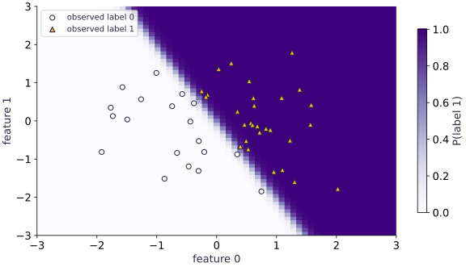

# A compiled train and evaluation step

Phase 05: Neural network training · about 95 minutes · CPU

## What you will be able to do

- Choose a transparent train and held-out split
- Read the state transition in execution order
- Compute useful metrics without changing the model
- Make replay a controlled experiment

## The problem

Training changes a model; evaluation should measure it without changing it. We’ll write those two steps separately and compile them with Flax NNX. Then we’ll check the parameters and optimizer counter before and after evaluation, so this important promise is something we test rather than assume.

## The idea

Training computes gradients and changes the model. Evaluation measures a fixed model under a declared input and scoring contract. Keeping those roles separate prevents held-out data from quietly participating in fitting.

## Evaluation observes a frozen model

Suppose validation loss improves after an accidental optimizer step on validation examples. The number is real, but it no longer evaluates the unchanged training result. The evaluation has influenced fitting.

Capture parameter and relevant state values before evaluation and compare afterward. If the model has training-only randomness or running statistics, verify its evaluation convention too. Depict only the mechanisms the actual model uses.

Aggregate evaluation contributions with their counts. Unequal batch sizes make an average of batch means different from an example mean. Finally, inspect actual errors in the held-out prediction field: a visually attractive boundary cannot rule out leakage or a denominator mistake.

### Pause and reason

Why compare state before and after evaluation instead of checking only the score?

<details><summary>Compare your reasoning</summary>

A score can look plausible even if evaluation updates parameters or statistics. State comparison tests whether the measurement changed the object it was meant to evaluate.

</details>

## Choose a transparent train and held-out split

Generate separate arrays from fixed independent seeds. Labels follow the known line x0 + $0.5$ x1 > $0$, so there is no label ambiguity and no external dataset download. Forty-eight training rows and forty-eight held-out rows are intentionally tiny. The held-out distribution matches the training distribution; this measures interpolation on a controlled problem, not robustness under distribution shift. Keep held-out rows out of optimizer calls. Real projects also need validation for model selection and a final test set; this example fixes hyperparameters in advance and does not supply a production evaluation protocol.

## Read the state transition in execution order

`nnx.value_and_grad` computes loss and gradients for the current parameters. `optimizer.update(model, grads)` then changes the model and optimizer state. The returned loss is pre-update loss, not the loss at the new weights. `nnx.Optimizer` is configured with `wrt=nnx.Param`, and `optax.adam` maintains first and second moments plus an update counter. A model snapshot alone cannot exactly resume Adam training. Conversely, a metrics call should not increment optimizer.step. Counting $80$ requested updates checks loop behavior, while comparing full snapshots checks evaluation isolation.

```text
(model parameters, optimizer state, training batch) → loss/gradients → updated model and optimizer
(fixed model, held-out batch) → loss and accuracy only
```

## Compute useful metrics without changing the model

Binary cross-entropy uses scores directly. Accuracy thresholds scores at zero; sigmoid is unnecessary for this decision. Return both because confidence and hard decisions measure different behavior. A wrong but extremely confident prediction can dominate loss while changing accuracy by only one observation. We calculate held-out loss independently with NumPy logaddexp and held-out accuracy with NumPy comparisons. Capture every parameter array before evaluation and compare bytes afterward. This model has no dropout or batch normalization; later stateful models require explicit evaluation mode and nonparameter-state checks too.

## Make replay a controlled experiment

Repeat the full initialization and training routine from the same seed and batches. Compare final parameter arrays within tolerance and compare held-out metrics. This is stronger than checking that one seeded initialization looks similar. It verifies the sequence of updates, but only in the tested CPU environment. Floating-point reductions, package versions, and backend changes may affect results. Store model seed, data seeds, batch policy, learning rate, iteration count, dependency versions, and metrics. Do not use a different initialization as a supposed resume of an existing optimizer state.

## 1. Construct data, model, and optimizer

Create main.py in the training dependency environment. The generator returns separate train and held-out arrays.

```python
from flax import nnx
import jax
import jax.numpy as jnp
import numpy as np
import optax
def dataset(seed,n=48):
    a=np.random.default_rng(seed).normal(size=(n,2)).astype(np.float32)
    b=(a[:,0]+.5*a[:,1]>0).astype(np.float32)
    return jnp.array(a),jnp.array(b)
train_x,train_y=dataset(10)
test_x,test_y=dataset(11)
class Classifier(nnx.Module):
    def __init__(self,seed=0):
        rngs=nnx.Rngs(seed)
        self.hidden=nnx.Linear(2,8,rngs=rngs)
        self.out=nnx.Linear(8,1,rngs=rngs)
    def __call__(self,x):return self.out(nnx.tanh(self.hidden(x))).squeeze(-1)
def objective(m,x,y):return jnp.mean(optax.sigmoid_binary_cross_entropy(m(x),y))
def initialize():
    m=Classifier(0)
    return m,nnx.Optimizer(m,optax.adam(.03),wrt=nnx.Param)
model,optimizer=initialize()
```

The held-out seed is $11$; every optimizer call below uses seed-10 data only.

## 2. Define the two compiled functions

Append train and evaluation functions. Notice that only train_step receives an optimizer.

```python
@nnx.jit
def train_step(m,o,x,y):
    value,grads=nnx.value_and_grad(objective)(m,x,y)
    o.update(m,grads)
    return value
@nnx.jit
def evaluate(m,x,y):
    scores=m(x)
    return jnp.mean(optax.sigmoid_binary_cross_entropy(scores,y)),jnp.mean((scores>0)==y)
def snapshot(m):return [np.array(a,copy=True) for a in jax.tree.leaves(nnx.state(m))]
before_loss=float(objective(model,train_x,train_y))
for _ in range(80):train_step(model,optimizer,train_x,train_y)
assert int(optimizer.step[...])==80
```

The 80-update counter is an optimizer invariant. Pre-update losses returned during the loop are not the final held-out metric.

## 3. Verify held-out metrics and state isolation

Append snapshot and reference comparisons. Print both training and held-out results instead of a single success number.

```python
frozen=snapshot(model);step_count=int(optimizer.step[...])
test_loss,test_accuracy=evaluate(model,test_x,test_y)
for a,b in zip(frozen,snapshot(model)):np.testing.assert_array_equal(a,b)
assert int(optimizer.step[...])==step_count
scores=np.asarray(model(test_x));labels=np.asarray(test_y)
np.testing.assert_allclose(test_loss,np.mean(np.logaddexp(0.,scores)-labels*scores),rtol=1e-5,atol=1e-6)
np.testing.assert_allclose(test_accuracy,np.mean((scores>0)==labels),atol=1e-6)
assert float(test_accuracy)>.85 and float(objective(model,train_x,train_y))<before_loss*.3
print('Updates:',step_count,'held-out loss:',float(test_loss),'accuracy:',float(test_accuracy))
```

The synthetic fixture normally exceeds $0.85$ held-out accuracy. Parameter bytes and optimizer count remain unchanged during evaluation.

## Run the example

```python
from flax import nnx
import jax
import jax.numpy as jnp
import numpy as np
import optax
def dataset(seed,n=48):
    a=np.random.default_rng(seed).normal(size=(n,2)).astype(np.float32)
    b=(a[:,0]+.5*a[:,1]>0).astype(np.float32)
    return jnp.array(a),jnp.array(b)
train_x,train_y=dataset(10)
test_x,test_y=dataset(11)
class Classifier(nnx.Module):
    def __init__(self,seed=0):
        rngs=nnx.Rngs(seed)
        self.hidden=nnx.Linear(2,8,rngs=rngs)
        self.out=nnx.Linear(8,1,rngs=rngs)
    def __call__(self,x):return self.out(nnx.tanh(self.hidden(x))).squeeze(-1)
def objective(m,x,y):return jnp.mean(optax.sigmoid_binary_cross_entropy(m(x),y))
def initialize():
    m=Classifier(0)
    return m,nnx.Optimizer(m,optax.adam(.03),wrt=nnx.Param)
model,optimizer=initialize()

@nnx.jit
def train_step(m,o,x,y):
    value,grads=nnx.value_and_grad(objective)(m,x,y)
    o.update(m,grads)
    return value
@nnx.jit
def evaluate(m,x,y):
    scores=m(x)
    return jnp.mean(optax.sigmoid_binary_cross_entropy(scores,y)),jnp.mean((scores>0)==y)
def snapshot(m):return [np.array(a,copy=True) for a in jax.tree.leaves(nnx.state(m))]
before_loss=float(objective(model,train_x,train_y))
for _ in range(80):train_step(model,optimizer,train_x,train_y)
assert int(optimizer.step[...])==80

frozen=snapshot(model);step_count=int(optimizer.step[...])
test_loss,test_accuracy=evaluate(model,test_x,test_y)
for a,b in zip(frozen,snapshot(model)):np.testing.assert_array_equal(a,b)
assert int(optimizer.step[...])==step_count
scores=np.asarray(model(test_x));labels=np.asarray(test_y)
np.testing.assert_allclose(test_loss,np.mean(np.logaddexp(0.,scores)-labels*scores),rtol=1e-5,atol=1e-6)
np.testing.assert_allclose(test_accuracy,np.mean((scores>0)==labels),atol=1e-6)
assert float(test_accuracy)>.85 and float(objective(model,train_x,train_y))<before_loss*.3
print('Updates:',step_count,'held-out loss:',float(test_loss),'accuracy:',float(test_accuracy))
```

Expected: $80$ optimizer updates; held-out accuracy above $0.85$; evaluation snapshots unchanged. Exact scalar metrics are printed by your run.

## Inspect predictions on held-out inputs

**Predict:** Where would a mistake appear relative to the decision boundary?



**Recorded CPU computation**

### Read the figure

The horizontal and vertical axes are input features. The background is the trained model’s probability of label $1$, from pale near $0$ to dark purple near $1$. Circles mark held-out examples with label $0$, and triangles mark held-out examples with label $1$.

A slanted transition separates a mostly pale left side from a dark right side. The circles lie on the low-probability side and the triangles on the high-probability side. The example’s direct evaluation reports accuracy $1$ on this fixed held-out set; the figure shows where those correct decisions occur.

### Connect it to the computation

The data rule assigns label $1$ when $x_0+0.5x_1>0$, whose boundary is $x_1=-2x_0$. That explains the overall downward slant. The network approximates this separation; its transition need not be perfectly straight everywhere.

To inspect a mistake in a changed run, look for a triangle where the probability is below $0.5$, or a circle where it is above $0.5$, and check the model at that exact point. Grid colors are sampled approximations. Perfect accuracy on this small synthetic set does not establish accuracy outside it, and extreme probabilities do not by themselves establish calibration.

```python
axis = jnp.linspace(-3.0, 3.0, 61)
gx, gy = jnp.meshgrid(axis, axis)
grid = jnp.stack([gx.ravel(), gy.ravel()], axis=-1)
prob = jax.nn.sigmoid(model(grid)).reshape(gx.shape)
visual_data = {'kind': 'field', 'values': prob.tolist(), 'extent': [-3.0, 3.0, -3.0, 3.0], 'xlabel': 'feature 0', 'ylabel': 'feature 1', 'unit': 'P(label 1)', 'points': test_x.tolist(), 'labels': test_y.tolist()}
```

## Recorded reference execution

CPU run: 2026-10-06T21:57:54.545104+00:00. JAX 0.9.2.

```text
Updates: 80 held-out loss: 0.018426384776830673 accuracy: 1.0
Updates: 80 held-out loss: 0.018426384776830673 accuracy: 1.0
Count-weighted held-out metrics: [0.01842638 0.99999995] constructed accuracy: 0.5416666666666666
PASS: networks-03

```

## Replay the complete update sequence

**Predict before running:** Should equal seed, batches, and update count reproduce the final model?

```python
replay,replay_optimizer=initialize()
for _ in range(80):train_step(replay,replay_optimizer,train_x,train_y)
for a,b in zip(snapshot(model),snapshot(replay)):np.testing.assert_allclose(a,b,rtol=1e-6,atol=1e-6)
np.testing.assert_allclose(evaluate(replay,test_x,test_y),evaluate(model,test_x,test_y),rtol=1e-6)
```

**Expected:** Final parameters and held-out metrics agree within CPU tolerances.

Replay reconstructs optimizer state from the start. It is not a checkpoint-resume implementation.

## Duplicating evaluation data

**Predict before running:** If the held-out rows are repeated twice, should mean loss or accuracy change?

```python
doubled=evaluate(model,jnp.concatenate([test_x,test_x]),jnp.concatenate([test_y,test_y]))
np.testing.assert_allclose(doubled,evaluate(model,test_x,test_y),rtol=1e-5,atol=1e-6)
```

**Expected:** Both metrics stay the same.

Means normalize the observation count. Duplicating data does not create independent evaluation evidence.

## Make it yours

Compute held-out metrics in three equal chunks and reconstruct the overall means. Then confirm no state changed.

<details><summary>Reference solution</summary>

```python
old=snapshot(model)
pieces=[evaluate(model,test_x[i:i+16],test_y[i:i+16]) for i in range(0,48,16)]
aggregate=np.mean(np.asarray(pieces),axis=0)
np.testing.assert_allclose(aggregate,np.asarray(evaluate(model,test_x,test_y)),rtol=1e-5,atol=1e-6)
for a,b in zip(old,snapshot(model)):np.testing.assert_array_equal(a,b)
```

</details>

## Aggregate unequal batches

**Transfer**

Evaluate the held-out set in batches of seven and forty-one observations. Reconstruct both metrics from sums and counts. Use a separate constructed count example to demonstrate why averaging batch accuracies can be wrong.

<details><summary>Hint</summary>

Weight each batch mean by its number of observations.

</details>

<details><summary>Reference solution and reasoning</summary>

```python
sizes=np.array([7,41])
metrics=np.asarray([evaluate(model,test_x[:7],test_y[:7]),evaluate(model,test_x[7:],test_y[7:])])
weighted=(metrics*sizes[:,None]).sum(axis=0)/sizes.sum()
np.testing.assert_allclose(weighted,np.asarray(evaluate(model,test_x,test_y)),rtol=1e-5,atol=1e-6)
correct=np.array([6,20]);counts=np.array([7,41])
expected=26/48
np.testing.assert_allclose(correct.sum()/counts.sum(),expected)
assert not np.isclose(np.mean(correct/counts),expected)
print('Count-weighted held-out metrics:',weighted,'constructed accuracy:',expected)
```

A batch is a packaging choice, not a unit of evidence. The constructed counts expose the bias even if a particular model happens to obtain equal accuracy on both actual batches.

</details>

## Catch an evaluation function that trains

**Intermediate**

On an independent clone, deliberately call train_step with held-out data and show the isolation checks fail. Keep the real model untouched.

<details><summary>Hint</summary>

Compare both optimizer.step and model parameters around the bad call.

</details>

<details><summary>Reference solution and reasoning</summary>

```python
graph,state=nnx.split(model)
bad_model=nnx.merge(graph,jax.tree.map(lambda a:jnp.array(a,copy=True),state))
bad_optimizer=nnx.Optimizer(bad_model,optax.adam(.03),wrt=nnx.Param)
prior=snapshot(bad_model)
train_step(bad_model,bad_optimizer,test_x,test_y)
assert int(bad_optimizer.step[...])==1
assert any(not np.array_equal(a,b) for a,b in zip(prior,snapshot(bad_model)))
assert int(optimizer.step[...])==80
```

A plausible returned loss does not establish evaluation. Passing held-out data through the update function leaks it into learned state.

</details>

## Check your understanding

The train step returns a loss before optimizer.update. Which parameters does it describe?

1. The parameters entering that update
2. The final parameters after all updates
3. A separate held-out model

<details><summary>Answer and explanation</summary>

The parameters entering that update

The order of statements matters: value_and_grad runs before applying the update. Use a fresh evaluation call to measure final parameters.

</details>

## Diagnose the result

If metrics look suspiciously good, trace which arrays reach train_step. If evaluation modifies the model, compare snapshots and optimizer counts. If replay fails, compare data seeds, iteration counts, optimizer initialization, and versions before guessing that compilation is nondeterministic.

## Carry forward

- Choose a transparent train and held-out split
- Read the state transition in execution order
- Compute useful metrics without changing the model
- Make replay a controlled experiment

## Keep your evidence

Keep pre/post parameter snapshots around evaluation, optimizer step count 80, independent held-out loss and accuracy, complete replay comparison, and a deliberately bad held-out update on an isolated clone.

Keep predictions, modified code, observed results, and reasoning. A checkpoint alone does not demonstrate the exercise.

## Primary references

- [NNX optimizer API](https://flax.readthedocs.io/en/latest/api_reference/flax.nnx/training/optimizer.html)
- [NNX transforms](https://flax.readthedocs.io/en/latest/guides/transforms.html)

