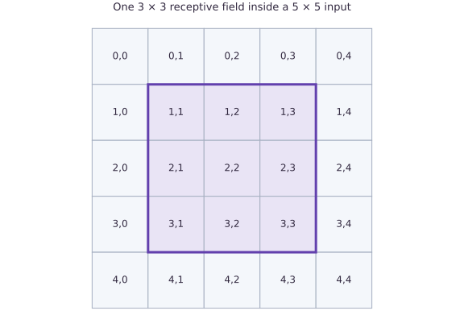
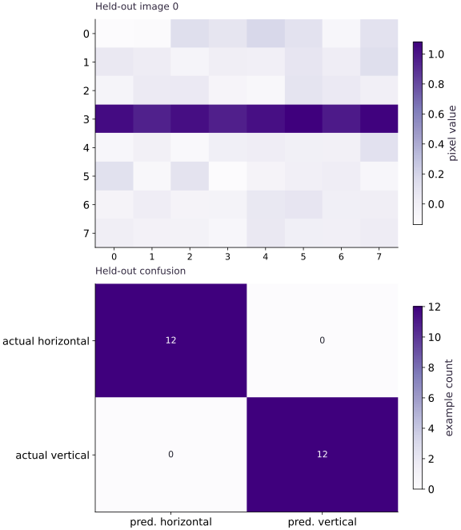

# Train a CNN on a small dataset

Phase 05: Neural network training · about 110 minutes · CPU

## What you will be able to do

- Generate images with an explicit label rule
- Derive the convolution output shape
- Pool spatial responses and retain class scores
- Read a confusion matrix rather than a success label

## The problem

Can a small model tell horizontal bars from vertical bars in noisy images? We’ll create the images locally and train a convolutional classifier on CPU. You’ll then test images from a different random seed and read a confusion matrix. The task is small enough to inspect without downloading a dataset.

## The idea

A convolution combines a local input patch with weights reused across spatial positions. Layout, stride and padding decide which pixels contribute to each output. Trace one position first; the full feature map repeats that same rule.

## Trace one convolution output

In a separate shape example, a three-by-three kernel sliding over a five-by-five image with stride one and no padding has three valid positions along each axis. It produces a three-by-three output per filter.

For one output location, multiply the selected patch by the kernel and sum over spatial and input-channel axes, then add the filter bias. Moving to another location changes the patch while reusing the filter. A new padding or stride convention changes the indexing contract.

The confusion matrix answers a later question about classification errors. Pick one off-diagonal cell, identify its true/predicted labels, and inspect an image from that cell. Correct synthetic-shape classification does not establish recognition of natural photographs.

### Pixels behind one convolution output

**Predict:** What stays shared when the kernel moves?



*Conceptual / analytic teaching diagram; not a recorded benchmark.*

The purple square selects one three-by-three patch within a five-by-five input. Each selected cell contributes to one output under the declared convolution. Moving the patch reuses weights. This separate shape example has three valid positions per axis at stride one without padding; it does not display learned weights.

### Pause and reason

What stays shared when the kernel moves?

<details><summary>Compare your reasoning</summary>

The filter weights and bias. The input patch changes. This is different from learning unrelated weights at every spatial location.

</details>

## Generate images with an explicit label rule

Our images have height eight, width eight, and one channel. Class zero contains a horizontal bright bar; class one contains a vertical bright bar. The bar position varies among interior rows or columns, and independent Gaussian noise perturbs every pixel. Alternate labels so both splits are balanced. Generate training and held-out sets from different seeds; identical seeds would reproduce images and create leakage. Every observation follows a known rule, so inspect a few images and labels before training. This synthetic distribution contains no occlusion, perspective, or multiple objects and should never be described as realistic vision evaluation.

## Derive the convolution output shape

NNX Conv accepts channels-last arrays: batch, height, width, channels. A $3\times3$ filter with stride one and VALID padding slides only where the whole patch fits. An $8\times8$ image therefore yields $6\times6$ spatial outputs. Four output channels mean four independently learned filters; the kernel shape is $(3, 3, 1, 4)$, followed by four biases. Each output is a patch dot product plus a bias. Deep-learning convolution uses cross-correlation here: do not reverse the filter in the independent NumPy reference. We check one interior output explicitly before fitting, which catches axis or padding misunderstandings.

```text
(B,8,8,1) → Conv3×3/VALID → (B,6,6,4) → ReLU → spatial mean → (B,4) → Linear → (B,2)
```

## Pool spatial responses and retain class scores

ReLU replaces negative filter responses with zero. Averaging axes one and two summarizes how strongly each learned pattern appears anywhere in the remaining image. Pooling discards exact position, which suits orientation classification but would hurt a task asking for bar location. The classifier head emits two logits per image. softmax_cross_entropy_with_integer_labels consumes those scores and integer labels directly; do not apply softmax beforehand. A stable independent NumPy reference subtracts the largest score before computing log-sum-exp. The objective is averaged over observations, not over classes.

## Read a confusion matrix rather than a success label

Use rows for true classes and columns for predicted classes. The diagonal counts correct classifications; off-diagonal cells identify orientation-specific mistakes. A balanced 24-image held-out set contains $12$ examples per class, so a model always predicting horizontal has accuracy $0.5$. After training, print both held-out mean loss and accuracy, along with all four confusion counts. Check that the matrix sums to $24$ and that its trace divided by $24$ equals accuracy. This independent accounting prevents a reduction-axis error from looking like good performance. Keep the split and hyperparameters fixed; a new data distribution is a new experiment, not another chance to select the reported test result.

## 1. Generate two disjoint synthetic splits

Create main.py. Print a training image as an $8\times8$ array if you want to inspect the task before fitting.

```python
# Step 1 — 1. Generate two disjoint synthetic splits: Two seeds produce separate examples.
# Import flax (nnx) for this computation.
from flax import nnx
import jax
import jax.numpy as jnp
import numpy as np
import optax
# Function `bars(seed, n, noise)` implementing this stage's computation:
def bars(seed,n,noise=.08):
    # Draw pseudorandom samples for `rng` using the explicit RNG state.
    rng=np.random.default_rng(seed)
    # Allocate initialized array `images` with the specified shape and dtype.
    images=np.zeros((n,8,8,1),np.float32)
    # Initialize array `labels` with explicit values and shape.
    labels=np.arange(n,dtype=np.int32)%2
    # Loop over `(i, label)` in `enumerate(labels)`:
    for i,label in enumerate(labels):
        # Draw pseudorandom samples for `position` using the explicit RNG state.
        position=int(rng.integers(2,6))
        # Branch on condition `label == 0`:
        if label==0:images[i,position,:,0]=1.
        else:images[i,:,position,0]=1.
    # Accumulate the next contribution into `images`.
    images+=rng.normal(0,noise,images.shape).astype(np.float32)
    # Return `(jnp.array(images), jnp.array(labels))` to the caller.
    return jnp.array(images),jnp.array(labels)
# Run `bars` to compute `(train_x, train_y)`.
train_x,train_y=bars(20,48)
# Run `bars` to compute `(test_x, test_y)`.
test_x,test_y=bars(21,24)
# Verify that the output tensor shape matches our prediction.
assert train_x.shape==(48,8,8,1) and test_x.shape==(24,8,8,1)
# Verify that the output satisfies the expected shape, finite-value, or numerical contract.
assert not np.array_equal(np.asarray(train_x[:24]),np.asarray(test_x))
```

Two seeds produce separate examples. Both labels are balanced by construction; noise can make orientation harder as its scale grows.

## 2. Build and independently inspect the convolution

Append the small CNN and the patch dot-product check before defining an optimizer.

```python
# Step 2 — 2. Build and independently inspect the convolution: The first output at (0,0) consumes exactly the top-left 3\times3...
# Define `BarCNN` module / container with explicit state and forward pass:
class BarCNN(nnx.Module):
    # Function `__init__(self)` implementing this stage's computation:
    def __init__(self):
        # Run `nnx.Rngs` to compute `rngs`.
        rngs=nnx.Rngs(0)
        # Combine or mask array elements to form `self.conv`.
        self.conv=nnx.Conv(1,4,(3,3),padding='VALID',rngs=rngs)
        # Run `nnx.Linear` to compute `self.head`.
        self.head=nnx.Linear(4,2,rngs=rngs)
    # Function `__call__(self, x)` implementing this stage's computation:
    def __call__(self,x):
        # Apply nonlinear activation or probability normalization to compute `features`.
        features=jnp.mean(nnx.relu(self.conv(x)),axis=(1,2))
        # Return `self.head(features)` to the caller.
        return self.head(features)
# Run `BarCNN` to compute `model`.
model=BarCNN()
# Run `model.conv` to compute `raw`.
raw=model.conv(train_x[:1])
# Verify that the output tensor shape matches our prediction.
assert raw.shape==(1,6,6,4)
# Convert `patch` to a host NumPy array for inspection or verification.
patch=np.asarray(train_x[0,:3,:3,:])
# Convert `kernel` to a host NumPy array for inspection or verification.
kernel=np.asarray(model.conv.kernel[...])
# Aggregate array values to compute `expected`.
expected=np.sum(patch*kernel[:,:,:,0])+np.asarray(model.conv.bias[...])[0]
# Verify that computed values match the expected reference within numerical tolerance.
np.testing.assert_allclose(raw[0,0,0,0],expected,rtol=1e-5,atol=1e-6)
# Function `loss(m, x, y)` implementing this stage's computation:
# Return `jnp.mean(optax.softmax_cross_entropy_with_integer_labels(m(x), y))` to the caller.
def loss(m,x,y):return jnp.mean(optax.softmax_cross_entropy_with_integer_labels(m(x),y))
# Configure or step the Optax optimizer state (`optimizer`).
optimizer=nnx.Optimizer(model,optax.adam(.03),wrt=nnx.Param)
@nnx.jit
# Function `train_step(m, o, x, y)` implementing this stage's computation:
def train_step(m,o,x,y):
    # Evaluate both scalar loss and parameter gradients in one pass (`(value, grads)`).
    value,grads=nnx.value_and_grad(loss)(m,x,y)
    # Update state in place with the new values.
    o.update(m,grads)
    # Return `value` to the caller.
    return value
```

The first output at $(0,0)$ consumes exactly the top-left $3\times3$ patch. The NumPy result validates filter orientation and layout.

## 3. Fit, then measure the held-out split once

Append $80$ full-batch updates, stable NumPy loss, and confusion accounting. Every update uses only train_x/train_y.

```python
# Step 3 — 3. Fit, then measure the held-out split once: The output is a measured CPU result for synthetic bars.
initial=float(loss(model,train_x,train_y))
# Repeat the update loop over `range(80)` steps:
# Execute the next step of the computation.
for _ in range(80):train_step(model,optimizer,train_x,train_y)
# Convert `scores` to a host NumPy array for inspection or verification.
# Convert `labels` to a host NumPy array for inspection or verification.
scores=np.asarray(model(test_x));labels=np.asarray(test_y)
# Run `scores.argmax` to compute `predictions`.
predictions=scores.argmax(axis=-1)
# Reduce along axis=-1 to compute `shifted`.
shifted=scores-scores.max(axis=-1,keepdims=True)
# Reduce along axis=-1 to compute `reference_loss`.
reference_loss=np.mean(np.log(np.exp(shifted).sum(axis=-1))-shifted[np.arange(len(labels)),labels])
# Verify that computed values match the expected reference within numerical tolerance.
np.testing.assert_allclose(loss(model,test_x,test_y),reference_loss,rtol=1e-5,atol=1e-6)
# Allocate initialized array `confusion` with the specified shape and dtype.
confusion=np.zeros((2,2),dtype=int)
# Run `np.add.at` to perform the next check or state transition.
np.add.at(confusion,(labels,predictions),1)
# Aggregate array values to compute `accuracy`.
accuracy=np.mean(predictions==labels)
# Verify that the output satisfies the expected shape, finite-value, or numerical contract.
assert confusion.sum()==24 and np.isclose(np.trace(confusion)/24,accuracy)
# Verify that the output satisfies the expected shape, finite-value, or numerical contract.
assert accuracy>=.9 and float(loss(model,train_x,train_y))<initial*.3
# Print diagnostic summary of the computed outputs.
print('Held-out loss:',reference_loss,'accuracy:',accuracy,'confusion:\n',confusion)
```

The output is a measured CPU result for synthetic bars. No MNIST, TPU, or throughput claim is implied.

## Run the example

```python
# Step 1 — 1. Generate two disjoint synthetic splits: Two seeds produce separate examples.
# Import flax (nnx) for this computation.
from flax import nnx
import jax
import jax.numpy as jnp
import numpy as np
import optax
# Function `bars(seed, n, noise)` implementing this stage's computation:
def bars(seed,n,noise=.08):
    # Draw pseudorandom samples for `rng` using the explicit RNG state.
    rng=np.random.default_rng(seed)
    # Allocate initialized array `images` with the specified shape and dtype.
    images=np.zeros((n,8,8,1),np.float32)
    # Initialize array `labels` with explicit values and shape.
    labels=np.arange(n,dtype=np.int32)%2
    # Loop over `(i, label)` in `enumerate(labels)`:
    for i,label in enumerate(labels):
        # Draw pseudorandom samples for `position` using the explicit RNG state.
        position=int(rng.integers(2,6))
        # Branch on condition `label == 0`:
        if label==0:images[i,position,:,0]=1.
        else:images[i,:,position,0]=1.
    # Accumulate the next contribution into `images`.
    images+=rng.normal(0,noise,images.shape).astype(np.float32)
    # Return `(jnp.array(images), jnp.array(labels))` to the caller.
    return jnp.array(images),jnp.array(labels)
# Run `bars` to compute `(train_x, train_y)`.
train_x,train_y=bars(20,48)
# Run `bars` to compute `(test_x, test_y)`.
test_x,test_y=bars(21,24)
# Verify that the output tensor shape matches our prediction.
assert train_x.shape==(48,8,8,1) and test_x.shape==(24,8,8,1)
# Verify that the output satisfies the expected shape, finite-value, or numerical contract.
assert not np.array_equal(np.asarray(train_x[:24]),np.asarray(test_x))

# Step 2 — 2. Build and independently inspect the convolution: The first output at (0,0) consumes exactly the top-left 3\times3...
# Define `BarCNN` module / container with explicit state and forward pass:
class BarCNN(nnx.Module):
    # Function `__init__(self)` implementing this stage's computation:
    def __init__(self):
        # Run `nnx.Rngs` to compute `rngs`.
        rngs=nnx.Rngs(0)
        # Combine or mask array elements to form `self.conv`.
        self.conv=nnx.Conv(1,4,(3,3),padding='VALID',rngs=rngs)
        # Run `nnx.Linear` to compute `self.head`.
        self.head=nnx.Linear(4,2,rngs=rngs)
    # Function `__call__(self, x)` implementing this stage's computation:
    def __call__(self,x):
        # Apply nonlinear activation or probability normalization to compute `features`.
        features=jnp.mean(nnx.relu(self.conv(x)),axis=(1,2))
        # Return `self.head(features)` to the caller.
        return self.head(features)
# Run `BarCNN` to compute `model`.
model=BarCNN()
# Run `model.conv` to compute `raw`.
raw=model.conv(train_x[:1])
# Verify that the output tensor shape matches our prediction.
assert raw.shape==(1,6,6,4)
# Convert `patch` to a host NumPy array for inspection or verification.
patch=np.asarray(train_x[0,:3,:3,:])
# Convert `kernel` to a host NumPy array for inspection or verification.
kernel=np.asarray(model.conv.kernel[...])
# Aggregate array values to compute `expected`.
expected=np.sum(patch*kernel[:,:,:,0])+np.asarray(model.conv.bias[...])[0]
# Verify that computed values match the expected reference within numerical tolerance.
np.testing.assert_allclose(raw[0,0,0,0],expected,rtol=1e-5,atol=1e-6)
# Function `loss(m, x, y)` implementing this stage's computation:
# Return `jnp.mean(optax.softmax_cross_entropy_with_integer_labels(m(x), y))` to the caller.
def loss(m,x,y):return jnp.mean(optax.softmax_cross_entropy_with_integer_labels(m(x),y))
# Configure or step the Optax optimizer state (`optimizer`).
optimizer=nnx.Optimizer(model,optax.adam(.03),wrt=nnx.Param)
@nnx.jit
# Function `train_step(m, o, x, y)` implementing this stage's computation:
def train_step(m,o,x,y):
    # Evaluate both scalar loss and parameter gradients in one pass (`(value, grads)`).
    value,grads=nnx.value_and_grad(loss)(m,x,y)
    # Update state in place with the new values.
    o.update(m,grads)
    # Return `value` to the caller.
    return value

# Step 3 — 3. Fit, then measure the held-out split once: The output is a measured CPU result for synthetic bars.
initial=float(loss(model,train_x,train_y))
# Repeat the update loop over `range(80)` steps:
# Execute the next step of the computation.
for _ in range(80):train_step(model,optimizer,train_x,train_y)
# Convert `scores` to a host NumPy array for inspection or verification.
# Convert `labels` to a host NumPy array for inspection or verification.
scores=np.asarray(model(test_x));labels=np.asarray(test_y)
# Run `scores.argmax` to compute `predictions`.
predictions=scores.argmax(axis=-1)
# Reduce along axis=-1 to compute `shifted`.
shifted=scores-scores.max(axis=-1,keepdims=True)
# Reduce along axis=-1 to compute `reference_loss`.
reference_loss=np.mean(np.log(np.exp(shifted).sum(axis=-1))-shifted[np.arange(len(labels)),labels])
# Verify that computed values match the expected reference within numerical tolerance.
np.testing.assert_allclose(loss(model,test_x,test_y),reference_loss,rtol=1e-5,atol=1e-6)
# Allocate initialized array `confusion` with the specified shape and dtype.
confusion=np.zeros((2,2),dtype=int)
# Run `np.add.at` to perform the next check or state transition.
np.add.at(confusion,(labels,predictions),1)
# Aggregate array values to compute `accuracy`.
accuracy=np.mean(predictions==labels)
# Verify that the output satisfies the expected shape, finite-value, or numerical contract.
assert confusion.sum()==24 and np.isclose(np.trace(confusion)/24,accuracy)
# Verify that the output satisfies the expected shape, finite-value, or numerical contract.
assert accuracy>=.9 and float(loss(model,train_x,train_y))<initial*.3
# Print diagnostic summary of the computed outputs.
print('Held-out loss:',reference_loss,'accuracy:',accuracy,'confusion:\n',confusion)
```

Expected: Held-out accuracy is at least $0.9$ for the fixed fixture; confusion counts total $24$. The runnable script prints the actual measured loss and counts.

## See the image task and its classification errors

**Predict:** Which axis of the confusion matrix is the actual label?



**Recorded CPU computation**

### Read the figure

The upper panel is one held-out image, with pixel columns across and rows down. Its dark horizontal stripe is near row $3$; the faint variation elsewhere is added noise. This color bar measures pixel value, so the picture is an input to the classifier.

The lower panel summarizes all held-out predictions. Rows are actual classes and columns are predicted classes. The two diagonal cells contain $12$ each; both off-diagonal cells contain zero. The lower color bar measures example count, which is a different quantity from pixel intensity.

### Connect it to the computation

The upper-left confusion cell counts horizontal images classified as horizontal; the lower-right counts vertical images classified as vertical. Off-diagonal counts would identify the two kinds of confusion. Here the $24$ held-out images are all classified correctly.

Use the sample image to understand the task and the confusion matrix to understand the observed errors. The single image cannot establish accuracy, and a zero in the matrix means no observed mistakes of that kind in this set, not that such a mistake is impossible. This is a small synthetic stripe task, not evidence of general image recognition.

```python
# Compute figure data for: See the image task and its classification errors
# Evaluate `visual_data` from the current inputs and state.
visual_data = {'kind': 'panels', 'panels': [{'kind': 'heatmap', 'title': 'Held-out image 0', 'values': test_x[0, :, :, 0].tolist(), 'unit': 'pixel value'}, {'kind': 'heatmap', 'title': 'Held-out confusion', 'values': confusion.tolist(), 'rows': ['actual horizontal', 'actual vertical'], 'columns': ['pred. horizontal', 'pred. vertical'], 'unit': 'example count'}]}
```

## Recorded reference execution

CPU run: 2026-10-08T14:02:48.989253+00:00. JAX 0.9.2.

```text
Held-out loss: 0.015700625 accuracy: 1.0 confusion:
 [[12  0]
 [ 0 12]]
Held-out loss: 0.015700625 accuracy: 1.0 confusion:
 [[12  0]
 [ 0 12]]
True-class counts: [12 12] row-normalized confusion: [[1. 0.]
 [0. 1.]]
Absent class recall: undefined, not zero.
PASS: networks-04

```

## Trace a second patch and a second filter

**Predict before running:** If the spatial location changes to $(2,3)$, which input patch produces that output?

```python
# Experiment — Trace a second patch and a second filter: The same learned filter is reused at each valid location;...
patch=np.asarray(test_x[0,2:5,3:6,:])
# Convert `weights` to a host NumPy array for inspection or verification.
weights=np.asarray(model.conv.kernel[...])[:,:,:,2]
# Aggregate array values to compute `expected`.
expected=np.sum(patch*weights)+np.asarray(model.conv.bias[...])[2]
# Verify that computed values match the expected reference within numerical tolerance.
np.testing.assert_allclose(model.conv(test_x[:1])[0,2,3,2],expected,rtol=1e-5,atol=1e-6)
```

**Expected:** The output uses rows $2$–$4$ and columns $3$–$5$ of the input.

The same learned filter is reused at each valid location; changing the output coordinate changes the patch, not the filter.

## Predict the chance classifier

**Predict before running:** On a balanced held-out split, what is the accuracy of always predicting class zero?

```python
# Experiment — Predict the chance classifier: A majority or constant-label baseline is part of evaluation.
always_zero=np.zeros_like(labels)
# Aggregate array values to compute `baseline`.
baseline=np.mean(always_zero==labels)
# Verify contract: `baseline == 0.5`.
assert baseline==.5
# Allocate initialized array `baseline_confusion` with the specified shape and dtype.
baseline_confusion=np.zeros((2,2),dtype=int)
# Run `np.add.at` to perform the next check or state transition.
np.add.at(baseline_confusion,(labels,always_zero),1)
# Convert `` to a host NumPy array for inspection or verification.
np.testing.assert_array_equal(baseline_confusion,np.array([[12,0],[12,0]]))
```

**Expected:** Accuracy is $0.5$ with confusion $[[12,0]$,$[12,0]]$.

A majority or constant-label baseline is part of evaluation. A good-looking class-specific count alone can hide a useless predictor.

## Make it yours

Apply the trained model to one $10\times10$ image. Predict intermediate shape and parameter count before executing. Do not claim accuracy from an unlabeled input.

### How to write this exercise — Step-by-step recipe & starter scaffold

**Key functions & syntax to use:**
- `jnp.zeros / jnp.ones(shape, dtype=...)` — Allocates a tensor of the given `shape` initialized with constants.
- `nnx.Module / nnx.Linear / nnx.Optimizer` — Flax NNX stateful module and optimizer containers with explicit RNG streams (`nnx.Rngs`) and traced graph updates.

**Step-by-step implementation plan:**
1. Initialize array `larger` with explicit values and shape.
2. Verify that the output tensor shape matches our prediction.
3. Verify that the output satisfies the expected shape, finite-value, or numerical contract.
4. Verify that the output satisfies the expected shape, finite-value, or numerical contract.

**Starter code scaffold (fill in the TODOs):**

```python
# Exercise solution: Apply the trained model to one 10\times10 image.
# Initialize array `larger` with explicit values and shape.
larger = jnp.zeros(...)  # TODO: compute larger
# Verify that the output tensor shape matches our prediction.
assert model.conv(larger).shape  # TODO: complete assertion check
# Verify that the output satisfies the expected shape, finite-value, or numerical contract.
assert model(larger).shape  # TODO: complete assertion check
# Verify that the output satisfies the expected shape, finite-value, or numerical contract.
assert sum(a.size for a  # TODO: complete assertion check
```

<details><summary>Reference solution</summary>

```python
# Exercise solution: Apply the trained model to one 10\times10 image.
# Initialize array `larger` with explicit values and shape.
larger=jnp.zeros((1,10,10,1));larger=larger.at[0,4,:,0].set(1.)
# Verify that the output tensor shape matches our prediction.
assert model.conv(larger).shape==(1,8,8,4)
# Verify that the output satisfies the expected shape, finite-value, or numerical contract.
assert model(larger).shape==(1,2)
# Verify that the output satisfies the expected shape, finite-value, or numerical contract.
assert sum(a.size for a in jax.tree.leaves(nnx.state(model,nnx.Param)))==50
```

</details>

## Read a confusion matrix as conditional rates

**Transfer**

Normalize each confusion-matrix row by its true-class count. Explain the diagonal and verify that weighting class recalls by class counts reproduces overall accuracy. Then remove a class in a constructed case and report its recall as undefined.

<details><summary>Hint</summary>

Keep the integer counts; a normalized row without a count hides how much evidence supports it.

</details>

### How to write: Read a confusion matrix as conditional rates — Step-by-step recipe & starter scaffold

**Key functions & syntax to use:**
- `x.sum(axis=...) / x.mean(axis=..., keepdims=...)` — Reduces values along the named `axis` (the axis you name is collapsed unless `keepdims=True`).
- `jnp.allclose(actual, expected, rtol=..., atol=...)` — Checks that two arrays match elementwise within floating-point tolerance.

**Step-by-step implementation plan:**
1. Reduce along axis=1 to compute `counts`.
2. Combine or mask array elements to form `rates`.
3. Allocate initialized array `` with the specified shape and dtype.
4. Reduce across the target axis to summarize ``.
5. Initialize array `missing` with explicit values and shape.

**Starter code scaffold (fill in the TODOs):**

```python
# Read a confusion matrix as conditional rates (Transfer): Each row asks where examples of one true class went.
# Reduce along axis=1 to compute `counts`.
counts = confusion.sum(...)  # TODO: compute counts
# Combine or mask array elements to form `rates`.
rates = np.divide(...)  # TODO: compute rates
# Allocate initialized array `` with the specified shape and dtype.
np.testing.assert_allclose(rates.sum(axis = ...  # TODO: compute np.testing.assert_allclose(rates.sum(axis
# Reduce across the target axis to summarize ``.
np.testing.assert_allclose((np.diag(rates)*counts).sum()/counts.sum(),accuracy)
# Initialize array `missing` with explicit values and shape.
missing = np.array(...)  # TODO: compute missing
# Reduce along axis=1 to compute `n`.
n = missing.sum(...)  # TODO: compute n
# Combine or mask array elements to form `missing_rates`.
missing_rates = np.divide(...)  # TODO: compute missing_rates
# Verify contract: `np.isnan(missing_rates[1]).all()`.
assert np.isnan(missing_rates[1]).all()  # TODO: complete assertion check
# Print the observed values to compare against the expected result.
print('True-class counts:',counts,'row-normalized confusion:',rates)
# Print diagnostic summary of the computed outputs.
print('Absent class recall: undefined, not zero.')
```

<details><summary>Reference solution and reasoning</summary>

```python
# Read a confusion matrix as conditional rates (Transfer): Each row asks where examples of one true class went.
# Reduce along axis=1 to compute `counts`.
counts=confusion.sum(axis=1)
# Combine or mask array elements to form `rates`.
rates=np.divide(confusion,counts[:,None],out=np.full(confusion.shape,np.nan),where=counts[:,None]!=0)
# Allocate initialized array `` with the specified shape and dtype.
np.testing.assert_allclose(rates.sum(axis=1),np.ones(2))
# Reduce across the target axis to summarize ``.
np.testing.assert_allclose((np.diag(rates)*counts).sum()/counts.sum(),accuracy)
# Initialize array `missing` with explicit values and shape.
missing=np.array([[3,1],[0,0]])
# Reduce along axis=1 to compute `n`.
n=missing.sum(axis=1)
# Combine or mask array elements to form `missing_rates`.
missing_rates=np.divide(missing,n[:,None],out=np.full(missing.shape,np.nan),where=n[:,None]!=0)
# Verify contract: `np.isnan(missing_rates[1]).all()`.
assert np.isnan(missing_rates[1]).all()
# Print the observed values to compare against the expected result.
print('True-class counts:',counts,'row-normalized confusion:',rates)
# Print diagnostic summary of the computed outputs.
print('Absent class recall: undefined, not zero.')
```

Each row asks where examples of one true class went. A missing class has no observed recall; assigning zero confuses missing evidence with demonstrated failure.

</details>

## Catch a channel-order mistake

**Intermediate**

Transpose NHWC images to NCHW and show why this convolution rejects them. Repair the layout and compare predictions.

<details><summary>Hint</summary>

The final axis is the input-channel dimension for NNX Conv.

</details>

### How to write: Catch a channel-order mistake — Step-by-step recipe & starter scaffold

**Key functions & syntax to use:**
- `jnp.allclose(actual, expected, rtol=..., atol=...)` — Checks that two arrays match elementwise within floating-point tolerance.

**Step-by-step implementation plan:**
1. Catch a channel-order mistake (Intermediate): The mistaken array has eight channels where the layer...
2. Evaluate `caught` from the current inputs and state.
3. Run the boundary check and catch the expected exception:
4. Verify contract: `caught`.
5. Rearrange tensor axes to match the required layout for `repaired`.

**Starter code scaffold (fill in the TODOs):**

```python
# Catch a channel-order mistake (Intermediate): The mistaken array has eight channels where the layer...
wrong = jnp.transpose(...)  # TODO: compute wrong
# Evaluate `caught` from the current inputs and state.
caught = ...  # TODO: compute caught
# Run the boundary check and catch the expected exception:
try:model(wrong)
except (ValueError,TypeError):caught=True
# Verify contract: `caught`.
assert caught  # TODO: complete assertion check
# Rearrange tensor axes to match the required layout for `repaired`.
repaired = jnp.transpose(...)  # TODO: compute repaired
# Verify that computed values match the expected reference within numerical tolerance.
np.testing.assert_allclose(model(repaired),model(test_x[:2]),rtol=1e-6)
```

<details><summary>Reference solution and reasoning</summary>

```python
# Catch a channel-order mistake (Intermediate): The mistaken array has eight channels where the layer...
wrong=jnp.transpose(test_x[:2],(0,3,1,2))
# Evaluate `caught` from the current inputs and state.
caught=False
# Run the boundary check and catch the expected exception:
try:model(wrong)
except (ValueError,TypeError):caught=True
# Verify contract: `caught`.
assert caught
# Rearrange tensor axes to match the required layout for `repaired`.
repaired=jnp.transpose(wrong,(0,2,3,1))
# Verify that computed values match the expected reference within numerical tolerance.
np.testing.assert_allclose(model(repaired),model(test_x[:2]),rtol=1e-6)
```

The mistaken array has eight channels where the layer expects one. Explicit layout conversion is the repair; changing the declared channel count would silently change the model task.

</details>

## Check your understanding

What does spatial mean pooling discard in this classifier?

1. The exact location of local responses
2. The number of output channels
3. All orientation-sensitive features

<details><summary>Answer and explanation</summary>

The exact location of local responses

Pooling summarizes each feature channel over positions. This can support orientation classification, but it cannot preserve exact bar coordinates.

</details>

## Diagnose the result

Before tuning, inspect sample labels and input layout. Validate a convolution patch numerically, inspect prediction counts, and compare the constant baseline. If all predictions choose one class, examine class balance, score ranges, and per-class errors. If held-out samples equal training samples, repair the split before reporting metrics.

## Carry forward

- Generate images with an explicit label rule
- Derive the convolution output shape
- Pool spatial responses and retain class scores
- Read a confusion matrix rather than a success label

## Keep your evidence

Keep the 8-by-8-to-6-by-6 shape diagram, NumPy patch dot product, seeds 20/21, independent held-out cross-entropy, 24-observation confusion matrix, constant-class baseline, and layout failure repair.

Keep predictions, modified code, observed results, and reasoning. A checkpoint alone does not demonstrate the exercise.

## Primary references

- [Flax NNX Conv API](https://flax.readthedocs.io/en/latest/api_reference/flax.nnx/nn/linear.html)
- [Optax classification losses](https://optax.readthedocs.io/en/latest/api/losses.html)

