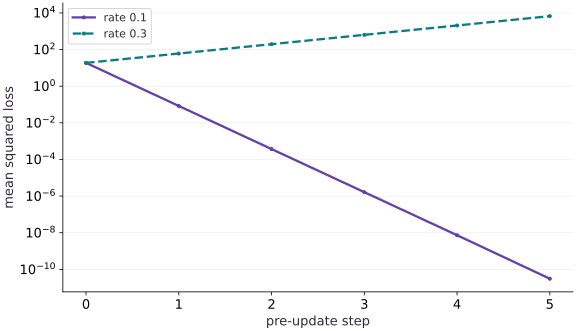

# Debug unstable learning

Phase 05: Neural network training · about 85 minutes · CPU

## What you will be able to do

- Derive the gradient and curvature on paper
- Record pre-update and post-update quantities distinctly
- Use gradient clipping for a bounded symptom, not a diagnosis
- Change the feature scale and predict the new bound

## The problem

The loss is growing. Should you immediately lower the learning rate? Let’s first gather evidence. We’ll use a one-weight model whose update we can derive, deliberately make it unstable, and inspect its losses, gradients and weights. You’ll learn how to connect a symptom to a cause.

## The idea

Unstable learning is a symptom with several possible causes. Connect the first unexpected value to inputs, forward computation, loss, gradients, optimizer state or the applied update. That ordering turns a vague failure into a testable diagnosis.

## Locate the first broken boundary

Start with a reproducible failing batch. Check inputs and forward loss before differentiating. If the loss is finite but gradients are not, inspect derivative-sensitive operations. If gradients are finite but the next loss explodes, inspect update size and parameter change.

Change one factor at a time and keep the original failing case. Clipping can limit damage without repairing the cause, so test whether the intervention predicts behavior on a changed input or learning rate.

The loss curve shows when behavior diverges. To explain why, add the relevant evidence: gradient norm, parameter norm, update norm and the first nonfinite intermediate. Keep those quantities distinct; a large parameter norm does not automatically imply a large gradient.

### Pause and reason

Why is “the loss is NaN” not yet a diagnosis?

<details><summary>Compare your reasoning</summary>

It names the final symptom. Find the earliest nonfinite value and its producing operation, then test a specific repair against the same failing case.

</details>

## Derive the gradient and curvature on paper

The training pairs are $x=[1, 2, 3]$ and $y=2x$. The head predicts $wx$, so the mean squared loss is $\operatorname{mean}(x^2)(w-2)^2=\frac{14}{3}(w-2)^2$. The gradient is $\frac{28}{3}(w-2)$, and the constant curvature is $28/3$. Gradient descent transforms the weight error $e=w-2$ into $(1-\eta\,28/3)e$. Stability requires the magnitude of that multiplier to be less than one, hence $0<\eta<\frac{3}{14}$ for this specific objective. This calculation lets us predict failure before observing a plot.

$$
\begin{aligned}L(w)&=\frac{14}{3}(w-2)^2\\e_{\mathrm{next}}&=\left(1-\eta\frac{28}{3}\right)e\\0&<\eta<\frac{3}{14}\approx0.214286\end{aligned}
$$

## Record pre-update and post-update quantities distinctly

At each iteration, record the current weight, loss, and absolute gradient, then compute the new weight. The history therefore describes the parameter entering each update. At rate $0.1$ the error multiplier is about $0.066667$; the weight converges quickly. At rate $0.3$ the multiplier is $-1.8$; errors alternate sign and grow in magnitude, with loss increasing by a factor $3.24$ per update until precision limits intervene. We run only six unstable steps to preserve a readable finite trace. A finite-number check catches overflow, but finite values can still represent a badly diverging run.

## Use gradient clipping for a bounded symptom, not a diagnosis

Clipping a scalar gradient to magnitude one limits each rate-0.3 update to at most $0.3$. That prevents the explosive trajectory in this small example, but it is separate from a generally correct learning rate, good final accuracy, or a solved numerical problem. Inspect the original norm as well as the clipped update. A repeatedly clipped run may indicate badly scaled features or excessive rate. Diagnose the data and objective before adopting clipping as a permanent fix. For cross-entropy models, large steps can produce confidently wrong finite predictions; monitoring only NaNs would miss them.

## Change the feature scale and predict the new bound

Multiply every $x$ and $y$ by ten while keeping the true weight two. The loss and curvature multiply by $100$, and the stable learning-rate ceiling divides by $100$. A rate of $0.1$ that was stable on the original data is now unstable. This demonstrates why a copied learning rate can fail after preprocessing changes. Standardization, objective normalization, adaptive optimizers, and clipping affect update behavior in different ways. Preserve an independent analytic check when possible, then instrument real networks with finite checks, gradient norms, prediction ranges, class balance, and evaluation isolation. Do not apply the quadratic bound to an unrelated model.

## 1. Define the controlled objective

Create main.py. Calculate $\operatorname{mean}(x^2)$ and the gradient at $w=0$ before running this block.

```python
# Step 1 — 1. Define the controlled objective: The initial loss is 56/3 and the initial gradient is -56/3.
# Import jax for this computation.
import jax
import jax.numpy as jnp
import numpy as np
# Construct `x` via `jnp.array([1.,2.,3.])`
x=jnp.array([1.,2.,3.])
y=2*x
# Function `loss(w, features, targets)` implementing this stage's computation:
# Return `jnp.mean((w * features - targets) ** 2)` to the caller.
def loss(w,features=x,targets=y):return jnp.mean((w*features-targets)**2)
# Function `analytic_gradient(w)` implementing this stage's computation:
# Return `28 / 3 * (w - 2)` to the caller.
def analytic_gradient(w):return (28/3)*(w-2)
# Compute `np.testing.assert_allclose(loss(0.),56/3,rtol` as `1e-6)`.
np.testing.assert_allclose(loss(0.),56/3,rtol=1e-6)
# Differentiate the objective to obtain gradients ``.
np.testing.assert_allclose(jax.grad(loss)(0.),-56/3,rtol=1e-6)
```

The initial loss is $56/3$ and the initial gradient is $-56/3$. These values independently anchor the autodiff trace.

## 2. Instrument the update loop

Append the runner. Each history row stores pre-update weight, loss, and gradient magnitude; no optimizer library hides the update.

```python
# Step 2 — 2. Instrument the update loop: The rate changes while initial state, data, and objective stay fixed.
# Define `run(rate, steps, features, targets...)` to evaluate the objective and its automatic derivatives:
def run(rate,steps,features=x,targets=y,clip=None):
    # Construct `w` via `jnp.array(0.)`
    w=jnp.array(0.)
    history=[]
    # Compute `objective` from `lambda value:loss(value,features,targets)`
    objective=lambda value:loss(value,features,targets)
    # Repeat the update loop over `range(steps)` steps:
    for _ in range(steps):
        # Differentiate the objective to obtain `(value, grad)` via automatic differentiation.
        value,grad=jax.value_and_grad(objective)(w)
        # Append the current step result to `history`.
        history.append([float(w),float(value),float(jnp.abs(grad))])
        # Confirm that all computed values remain finite (no NaN or Inf).
        assert np.all(np.isfinite(history[-1]))
        # Combine or mask array elements to form `update`.
        update=jnp.clip(grad,-clip,clip) if clip is not None else grad
        # Compute `w` from `w-rate*update`
        w=w-rate*update
    # Return `(float(w), np.asarray(history))` to the caller.
    return float(w),np.asarray(history)
# Run `run` to compute `(stable, good)`.
stable,good=run(.1,6)
# Run `run` to compute `(unstable, bad)`.
unstable,bad=run(.3,6)
# Assert that `abs(stable-2)<1e-5 and bad[-1,1]>bad[0,1]*100`.
assert abs(stable-2)<1e-5 and bad[-1,1]>bad[0,1]*100
```

The rate changes while initial state, data, and objective stay fixed. This isolates the intervention.

## 3. Match the recorded failure to the exact recurrence

Append analytic comparisons for every recorded iteration, then print the finite divergence trace.

```python
# Step 3 — 3. Match the recorded failure to the exact recurrence: An alternating parameter error and a 3.24 loss multiplier support...
# Iterate over `(rate, history)` to step through the computation:
for rate,history in [(.1,good),(.3,bad)]:
    # Compute `expected_w` from `2-2*(1-rate*28/3)**np.arange(len(history))`
    expected_w=2-2*(1-rate*28/3)**np.arange(len(history))
    # Compute `expected_loss` from `(14/3)*(expected_w-2)**2`
    expected_loss=(14/3)*(expected_w-2)**2
    # Compute `np.testing.assert_allclose(history[:,0],expected_w,rtol` as `2e-5,atol=1e-5)`.
    np.testing.assert_allclose(history[:,0],expected_w,rtol=2e-5,atol=1e-5)
    # Compute `np.testing.assert_allclose(history[:,1],expected_loss,rtol` as `2e-5,atol=1e-8)`.
    np.testing.assert_allclose(history[:,1],expected_loss,rtol=2e-5,atol=1e-8)
# Compute `np.testing.assert_allclose(bad[1:,1]/bad[:-1,1],3.24,rtol` as `1e-5)`.
np.testing.assert_allclose(bad[1:,1]/bad[:-1,1],3.24,rtol=1e-5)
# Print the observed values to compare against the expected result.
print('Stable final weight:',stable,'unstable pre-update [weight,loss,|gradient|]:\n',bad)
```

An alternating parameter error and a $3.24$ loss multiplier support the learning-rate diagnosis. Near zero, float32 cancellation makes relative loss error misleading, so the analytic comparison uses a $10^{-8}$ absolute floor. No timing or accelerator result is claimed.

## Run the example

```python
# Step 1 — 1. Define the controlled objective: The initial loss is 56/3 and the initial gradient is -56/3.
# Import jax for this computation.
import jax
import jax.numpy as jnp
import numpy as np
# Construct `x` via `jnp.array([1.,2.,3.])`
x=jnp.array([1.,2.,3.])
y=2*x
# Function `loss(w, features, targets)` implementing this stage's computation:
# Return `jnp.mean((w * features - targets) ** 2)` to the caller.
def loss(w,features=x,targets=y):return jnp.mean((w*features-targets)**2)
# Function `analytic_gradient(w)` implementing this stage's computation:
# Return `28 / 3 * (w - 2)` to the caller.
def analytic_gradient(w):return (28/3)*(w-2)
# Compute `np.testing.assert_allclose(loss(0.),56/3,rtol` as `1e-6)`.
np.testing.assert_allclose(loss(0.),56/3,rtol=1e-6)
# Differentiate the objective to obtain gradients ``.
np.testing.assert_allclose(jax.grad(loss)(0.),-56/3,rtol=1e-6)

# Step 2 — 2. Instrument the update loop: The rate changes while initial state, data, and objective stay fixed.
# Define `run(rate, steps, features, targets...)` to evaluate the objective and its automatic derivatives:
def run(rate,steps,features=x,targets=y,clip=None):
    # Construct `w` via `jnp.array(0.)`
    w=jnp.array(0.)
    history=[]
    # Compute `objective` from `lambda value:loss(value,features,targets)`
    objective=lambda value:loss(value,features,targets)
    # Repeat the update loop over `range(steps)` steps:
    for _ in range(steps):
        # Differentiate the objective to obtain `(value, grad)` via automatic differentiation.
        value,grad=jax.value_and_grad(objective)(w)
        # Append the current step result to `history`.
        history.append([float(w),float(value),float(jnp.abs(grad))])
        # Confirm that all computed values remain finite (no NaN or Inf).
        assert np.all(np.isfinite(history[-1]))
        # Combine or mask array elements to form `update`.
        update=jnp.clip(grad,-clip,clip) if clip is not None else grad
        # Compute `w` from `w-rate*update`
        w=w-rate*update
    # Return `(float(w), np.asarray(history))` to the caller.
    return float(w),np.asarray(history)
# Run `run` to compute `(stable, good)`.
stable,good=run(.1,6)
# Run `run` to compute `(unstable, bad)`.
unstable,bad=run(.3,6)
# Assert that `abs(stable-2)<1e-5 and bad[-1,1]>bad[0,1]*100`.
assert abs(stable-2)<1e-5 and bad[-1,1]>bad[0,1]*100

# Step 3 — 3. Match the recorded failure to the exact recurrence: An alternating parameter error and a 3.24 loss multiplier support...
# Iterate over `(rate, history)` to step through the computation:
for rate,history in [(.1,good),(.3,bad)]:
    # Compute `expected_w` from `2-2*(1-rate*28/3)**np.arange(len(history))`
    expected_w=2-2*(1-rate*28/3)**np.arange(len(history))
    # Compute `expected_loss` from `(14/3)*(expected_w-2)**2`
    expected_loss=(14/3)*(expected_w-2)**2
    # Compute `np.testing.assert_allclose(history[:,0],expected_w,rtol` as `2e-5,atol=1e-5)`.
    np.testing.assert_allclose(history[:,0],expected_w,rtol=2e-5,atol=1e-5)
    # Compute `np.testing.assert_allclose(history[:,1],expected_loss,rtol` as `2e-5,atol=1e-8)`.
    np.testing.assert_allclose(history[:,1],expected_loss,rtol=2e-5,atol=1e-8)
# Compute `np.testing.assert_allclose(bad[1:,1]/bad[:-1,1],3.24,rtol` as `1e-5)`.
np.testing.assert_allclose(bad[1:,1]/bad[:-1,1],3.24,rtol=1e-5)
# Print the observed values to compare against the expected result.
print('Stable final weight:',stable,'unstable pre-update [weight,loss,|gradient|]:\n',bad)
```

Expected: Rate $0.1$ approaches weight $2$. Rate $0.3$ produces alternating growing errors; consecutive unstable losses have ratio $3.24$ before overflow.

## Correct gradients can still produce unstable training

**Predict:** Which learning rate crosses the stability limit?



**Recorded CPU computation**

### Read the figure

The horizontal axis is the pre-update step: step $0$ shows the initial loss before training. The vertical axis is mean squared loss on a logarithmic scale. Both runs start at approximately $18.67$, but the solid rate-$0.1$ curve falls while the dashed rate-$0.3$ curve rises.

After the first update, the smaller rate gives loss about $0.083$, whereas the larger rate gives about $60.48$. By the last plotted step, the losses differ by many orders of magnitude. Equal vertical distances represent equal ratios, not equal absolute changes.

### Connect it to the computation

The loss here has curvature $28/3$. A step multiplies the weight error by $1-\eta(28/3)$. At rate $0.1$, this factor is $1/15$; at rate $0.3$, it is $-1.8$. The larger rate crosses the optimum and increases the error’s magnitude, so squared loss grows by a factor of $3.24$ per update.

The derivative can be correct while the update is unstable. That is the diagnosis this comparison isolates: change the step size before assuming a rising loss proves broken autodiff. The loss curve itself hides the sign alternation; the update equation explains it.

```python
# Compute figure data for: Correct gradients can still produce unstable training
# Compute `visual_data` from `{'kind': 'line', 'x': list(range(len(good))), 'xlabe...`
visual_data = {'kind': 'line', 'x': list(range(len(good))), 'xlabel': 'pre-update step', 'ylabel': 'mean squared loss', 'yscale': 'log', 'series': [{'label': 'rate 0.1', 'y': good[:, 1].tolist()}, {'label': 'rate 0.3', 'y': bad[:, 1].tolist()}]}
```

## Recorded reference execution

CPU run: 2026-10-08T14:02:51.242104+00:00. JAX 0.9.2.

```text
Stable final weight: 1.999999761581421 unstable pre-update [weight,loss,|gradient|]:
 [[ 0.00000000e+00  1.86666679e+01  1.86666679e+01]
 [ 5.60000038e+00  6.04800110e+01  3.36000061e+01]
 [-4.48000145e+00  1.95955292e+02  6.04800148e+01]
 [ 1.36640034e+01  6.34895264e+02  1.08864037e+02]
 [-1.89952106e+01  2.05706152e+03  1.95955322e+02]
 [ 3.97913895e+01  6.66488281e+03  3.52719635e+02]]
Stable final weight: 1.999999761581421 unstable pre-update [weight,loss,|gradient|]:
 [[ 0.00000000e+00  1.86666679e+01  1.86666679e+01]
 [ 5.60000038e+00  6.04800110e+01  3.36000061e+01]
 [-4.48000145e+00  1.95955292e+02  6.04800148e+01]
 [ 1.36640034e+01  6.34895264e+02  1.08864037e+02]
 [-1.89952106e+01  2.05706152e+03  1.95955322e+02]
 [ 3.97913895e+01  6.66488281e+03  3.52719635e+02]]
Reference / compensated / unchanged-rate updates: 1.8833334 1.8833332 8.416667
PASS: networks-05

```

## Bounded clipped updates

**Predict before running:** At rate $0.3$ with clipping threshold one, how far can one scalar update move?

```python
# Experiment — Bounded clipped updates: Clipping changes the effective update.
clipped,clipped_history=run(.3,6,clip=1.)
# Assert that `np.all(np.abs(np.diff(clipped_history[:,0]))<=.300001)`.
assert np.all(np.abs(np.diff(clipped_history[:,0]))<=.300001)
# Assert invariant `clipped_history[-1,1]<clipped_history[0,1]` holds
assert clipped_history[-1,1]<clipped_history[0,1]
# Assert invariant `clipped_history[0,2]>1.` holds
assert clipped_history[0,2]>1.
```

**Expected:** Each recorded displacement is at most $0.3$ while the original gradient norm initially exceeds one.

Clipping changes the effective update. Its boundedness is a useful invariant, not proof of optimal training.

## Feature scaling changes curvature

**Predict before running:** Scale both features and targets by ten. Does the original stable rate remain stable?

```python
# Experiment — Feature scaling changes curvature: The gradient multiplies by 100 because both prediction and...
scaled_final,scaled=run(.1,3,x*10,y*10)
# Assert invariant `scaled[-1,1]>scaled[0,1]` holds
assert scaled[-1,1]>scaled[0,1]
# Run `run` to compute `(adjusted_final, adjusted)`.
adjusted_final,adjusted=run(.001,6,x*10,y*10)
# Compute `np.testing.assert_allclose(adjusted[:,0],good[:,0],rtol` as `1e-5,atol=1e-5)`.
np.testing.assert_allclose(adjusted[:,0],good[:,0],rtol=1e-5,atol=1e-5)
# Compute `np.testing.assert_allclose(adjusted[:,1],good[:,1]*100,rtol` as `1e-4,atol=1e-8)`.
np.testing.assert_allclose(adjusted[:,1],good[:,1]*100,rtol=1e-4,atol=1e-8)
```

**Expected:** Rate $0.1$ diverges after scaling. Dividing the rate by $100$ restores the original weight trajectory.

The gradient multiplies by $100$ because both prediction and target are scaled; adjusting rate compensates for this fixture.

## Make it yours

Use features $[1, 1, 1]$ and targets $2$. Predict the new stability ceiling. Compare stable rate $0.5$ and unstable rate $1.1$.

### How to write this exercise — Step-by-step recipe & starter scaffold

**Key functions & syntax to use:**
- `jnp.zeros / jnp.ones(shape, dtype=...)` — Allocates a tensor of the given `shape` initialized with constants.
- `jnp.allclose(actual, expected, rtol=..., atol=...)` — Checks that two arrays match elementwise within floating-point tolerance.

**Step-by-step implementation plan:**
1. Construct `ones` via `jnp.ones(3)`
2. Run `run` to compute `(exact, history)`.
3. Run `run` to compute `(divergent, divergent_history)`.
4. Compute `np.testing.assert_allclose(exact,2.,atol` as `1e-6)`.
5. Assert invariant `divergent_history[-1,1]>divergent_history[0,1]` holds

**Starter code scaffold (fill in the TODOs):**

```python
# Exercise solution: Use features [1, 1, 1] and targets 2.
# Construct `ones` via `jnp.ones(3)`
ones = jnp.ones(...)  # TODO: compute ones
# Run `run` to compute `(exact, history)`.
exact,history = run(...)  # TODO: compute exact,history
# Run `run` to compute `(divergent, divergent_history)`.
divergent,divergent_history = run(...)  # TODO: compute divergent,divergent_history
# Compute `np.testing.assert_allclose(exact,2.,atol` as `1e-6)`.
np.testing.assert_allclose(exact,2.,atol = ...  # TODO: compute np.testing.assert_allclose(exact,2.,atol
# Assert invariant `divergent_history[-1,1]>divergent_history[0,1]` holds
assert divergent_history[-1,1]  # TODO: complete assertion check
# Compute `np.testing.assert_allclose(divergent_history[1:,1]/divergent_history[:-1,1],1.44,rtol` as `1e-5)`.
np.testing.assert_allclose(divergent_history[1:,1]/divergent_history[:-1,1],1.44,rtol=1e-5)
```

<details><summary>Reference solution</summary>

```python
# Exercise solution: Use features [1, 1, 1] and targets 2.
# Construct `ones` via `jnp.ones(3)`
ones=jnp.ones(3)
# Run `run` to compute `(exact, history)`.
exact,history=run(.5,3,ones,2*ones)
# Run `run` to compute `(divergent, divergent_history)`.
divergent,divergent_history=run(1.1,6,ones,2*ones)
# Compute `np.testing.assert_allclose(exact,2.,atol` as `1e-6)`.
np.testing.assert_allclose(exact,2.,atol=1e-6)
# Assert invariant `divergent_history[-1,1]>divergent_history[0,1]` holds
assert divergent_history[-1,1]>divergent_history[0,1]
# Compute `np.testing.assert_allclose(divergent_history[1:,1]/divergent_history[:-1,1],1.44,rtol` as `1e-5)`.
np.testing.assert_allclose(divergent_history[1:,1]/divergent_history[:-1,1],1.44,rtol=1e-5)
```

</details>

## Rescale the objective and compensate the update

**Transfer**

Multiply the squared-loss objective by five. Compare one plain gradient-descent update at the old rate and at one fifth of that rate. Explain why this compensation does not automatically describe Adam or clipping.

<details><summary>Hint</summary>

Differentiate the scaled objective; plain gradient descent multiplies its gradient by the learning rate.

</details>

### How to write: Rescale the objective and compensate the update — Step-by-step recipe & starter scaffold

**Key functions & syntax to use:**
- `jnp.array(values, dtype=...)` — Constructs an immutable device-backed JAX array from Python/NumPy values.
- `jnp.allclose(actual, expected, rtol=..., atol=...)` — Checks that two arrays match elementwise within floating-point tolerance.
- `jax.grad(loss_fn)(params, ...)` — Transforms a scalar-output function into a function returning the gradient PyTree with the same structure as `params`.

**Step-by-step implementation plan:**
1. Construct `w0` via `jnp.array(.25)`
2. Differentiate the objective to obtain `base_gradient` via automatic differentiation.
3. Differentiate the objective to obtain `scaled_gradient` via automatic differentiation.
4. Compute `np.testing.assert_allclose(scaled_gradient,5*base_gradient,rtol` as `1e-6)`.
5. Compute `reference` from `w0-.1*base_gradient`

**Starter code scaffold (fill in the TODOs):**

```python
# Rescale the objective and compensate the update (Transfer): Scaling the objective scales the gradient.
# Construct `w0` via `jnp.array(.25)`
w0 = jnp.array(...)  # TODO: compute w0
# Differentiate the objective to obtain `base_gradient` via automatic differentiation.
base_gradient = jax.grad(...)  # TODO: compute base_gradient
# Differentiate the objective to obtain `scaled_gradient` via automatic differentiation.
scaled_gradient = jax.grad(...)  # TODO: compute scaled_gradient
# Compute `np.testing.assert_allclose(scaled_gradient,5*base_gradient,rtol` as `1e-6)`.
np.testing.assert_allclose(scaled_gradient,5*base_gradient,rtol=1e-6)
# Compute `reference` from `w0-.1*base_gradient`
reference = ...  # TODO: compute reference
# Compute `compensated` from `w0-(.1/5)*scaled_gradient`
compensated = ...  # TODO: compute compensated
# Compute `uncompensated` from `w0-.1*scaled_gradient`
uncompensated = ...  # TODO: compute uncompensated
# Compute `np.testing.assert_allclose(compensated,reference,rtol` as `1e-6)`.
np.testing.assert_allclose(compensated,reference,rtol = ...  # TODO: compute np.testing.assert_allclose(compensated,reference,rtol
# Assert that `not np.isclose(uncompensated,reference)`.
assert not np.isclose(uncompensated,reference)  # TODO: complete assertion check
# Print the observed values to compare against the expected result.
print('Reference / compensated / unchanged-rate updates:',reference,compensated,uncompensated)
```

<details><summary>Reference solution and reasoning</summary>

```python
# Rescale the objective and compensate the update (Transfer): Scaling the objective scales the gradient.
# Construct `w0` via `jnp.array(.25)`
w0=jnp.array(.25)
# Differentiate the objective to obtain `base_gradient` via automatic differentiation.
base_gradient=jax.grad(loss)(w0)
# Differentiate the objective to obtain `scaled_gradient` via automatic differentiation.
scaled_gradient=jax.grad(lambda w:5*loss(w))(w0)
# Compute `np.testing.assert_allclose(scaled_gradient,5*base_gradient,rtol` as `1e-6)`.
np.testing.assert_allclose(scaled_gradient,5*base_gradient,rtol=1e-6)
# Compute `reference` from `w0-.1*base_gradient`
reference=w0-.1*base_gradient
# Compute `compensated` from `w0-(.1/5)*scaled_gradient`
compensated=w0-(.1/5)*scaled_gradient
# Compute `uncompensated` from `w0-.1*scaled_gradient`
uncompensated=w0-.1*scaled_gradient
# Compute `np.testing.assert_allclose(compensated,reference,rtol` as `1e-6)`.
np.testing.assert_allclose(compensated,reference,rtol=1e-6)
# Assert that `not np.isclose(uncompensated,reference)`.
assert not np.isclose(uncompensated,reference)
# Print the observed values to compare against the expected result.
print('Reference / compensated / unchanged-rate updates:',reference,compensated,uncompensated)
```

Scaling the objective scales the gradient. For this plain update the inverse rate change cancels it exactly. Stateful normalization, clipping and regularization need their own analysis.

</details>

## Diagnose a nonfinite input before an update

**Intermediate**

Insert one NaN feature. Show that loss/gradient finite checks fail, then repair the source data and recheck the independent initial gradient.

<details><summary>Hint</summary>

Changing the learning rate cannot make a NaN observation valid.

</details>

### How to write: Diagnose a nonfinite input before an update — Step-by-step recipe & starter scaffold

**Key functions & syntax to use:**
- `jnp.array(values, dtype=...)` — Constructs an immutable device-backed JAX array from Python/NumPy values.
- `jnp.allclose(actual, expected, rtol=..., atol=...)` — Checks that two arrays match elementwise within floating-point tolerance.
- `jnp.isfinite(x)` — Returns a boolean mask verifying that no element is `NaN` or `Inf`.
- `jax.value_and_grad(loss_fn)(params, ...)` — Evaluates both the scalar loss and its gradient PyTree `(loss_val, grads)` in a single forward+backward pass.

**Step-by-step implementation plan:**
1. Diagnose a nonfinite input before an update (Intermediate): Nonfinite data is a different cause than excessive step size.
2. Differentiate the objective to obtain `(bad_value, bad_grad)` via automatic differentiation.
3. Confirm that all computed values remain finite (no NaN or Inf).
4. Construct `repaired` via `jnp.array([1.,2.,3.])`
5. Differentiate the objective to obtain `(repaired_value, repaired_grad)` via automatic differentiation.

**Starter code scaffold (fill in the TODOs):**

```python
# Diagnose a nonfinite input before an update (Intermediate): Nonfinite data is a different cause than excessive step size.
corrupted = ...  # TODO: compute corrupted
# Differentiate the objective to obtain `(bad_value, bad_grad)` via automatic differentiation.
bad_value,bad_grad = jax.value_and_grad(...)  # TODO: compute bad_value,bad_grad
# Confirm that all computed values remain finite (no NaN or Inf).
assert not np.isfinite(float(bad_value))  # TODO: complete assertion check
# Construct `repaired` via `jnp.array([1.,2.,3.])`
repaired = jnp.array(...)  # TODO: compute repaired
# Differentiate the objective to obtain `(repaired_value, repaired_grad)` via automatic differentiation.
repaired_value,repaired_grad = jax.value_and_grad(...)  # TODO: compute repaired_value,repaired_grad
# Compute `np.testing.assert_allclose(repaired_grad,-56/3,rtol` as `1e-6)`.
np.testing.assert_allclose(repaired_grad,-56/3,rtol=1e-6)
# Confirm that all computed values remain finite (no NaN or Inf).
assert np.isfinite(float(repaired_value))  # TODO: complete assertion check
```

<details><summary>Reference solution and reasoning</summary>

```python
# Diagnose a nonfinite input before an update (Intermediate): Nonfinite data is a different cause than excessive step size.
corrupted=x.at[1].set(jnp.nan)
# Differentiate the objective to obtain `(bad_value, bad_grad)` via automatic differentiation.
bad_value,bad_grad=jax.value_and_grad(lambda w:loss(w,corrupted,y))(0.)
# Confirm that all computed values remain finite (no NaN or Inf).
assert not np.isfinite(float(bad_value)) and not np.isfinite(float(bad_grad))
# Construct `repaired` via `jnp.array([1.,2.,3.])`
repaired=jnp.array([1.,2.,3.])
# Differentiate the objective to obtain `(repaired_value, repaired_grad)` via automatic differentiation.
repaired_value,repaired_grad=jax.value_and_grad(lambda w:loss(w,repaired,y))(0.)
# Compute `np.testing.assert_allclose(repaired_grad,-56/3,rtol` as `1e-6)`.
np.testing.assert_allclose(repaired_grad,-56/3,rtol=1e-6)
# Confirm that all computed values remain finite (no NaN or Inf).
assert np.isfinite(float(repaired_value))
```

Nonfinite data is a different cause than excessive step size. Repair it at ingestion and validate the objective before taking another update.

</details>

## Check your understanding

Why does scaling both $x$ and $y$ by ten require a different stable step-size range?

1. The squared-loss curvature grows by $100$
2. Autodiff stops working on scaled inputs
3. The number of observations changes

<details><summary>Answer and explanation</summary>

The squared-loss curvature grows by $100$

Both the residual scale and its weight derivative scale by ten, so the gradient and curvature scale by $100$. This is specific to the squared objective and paired scaling.

</details>

## Diagnose the result

Start with finite input and loss checks, then inspect shape contracts and independent objective values. Record gradient norm, parameter norm, learning rate, and step index. Alternating growing errors can support a curvature diagnosis; NaNs from corrupted inputs require data repair. Preserve separate train and held-out metrics before declaring the fix successful.

## Carry forward

- Derive the gradient and curvature on paper
- Record pre-update and post-update quantities distinctly
- Use gradient clipping for a bounded symptom, not a diagnosis
- Change the feature scale and predict the new bound

## Keep your evidence

Keep the analytic error recurrence, per-step weight/loss/gradient norm for rates 0.1 and 0.3, observed 3.24 loss multiplier, changed-scale comparison, clipping bound, and one repaired nonfinite-input case.

Save your predictions, modified code, terminal outputs, and reasoning in your engineering portfolio.

## Primary references

- [JAX numerical accuracy](https://docs.jax.dev/en/latest/faq.html#numerical-accuracy)
- [Optax clipping transformations](https://optax.readthedocs.io/en/latest/api/transformations.html#optax.clip_by_global_norm)

